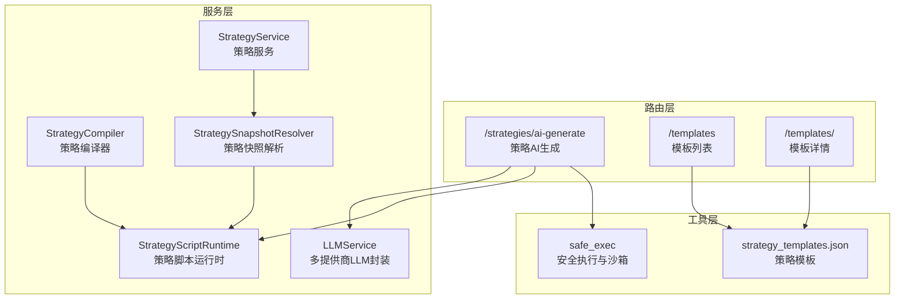
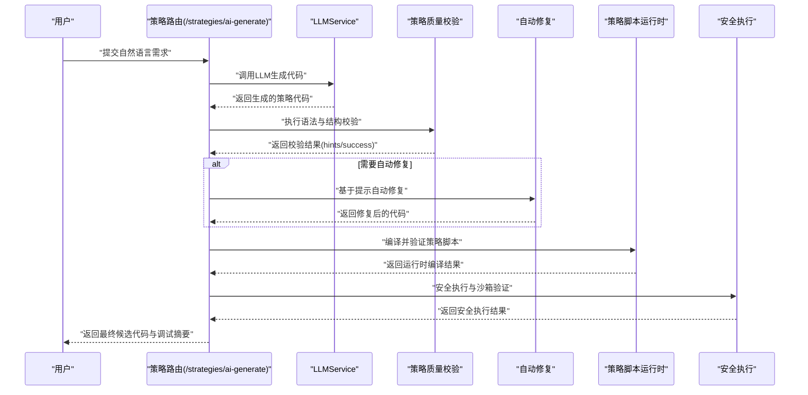
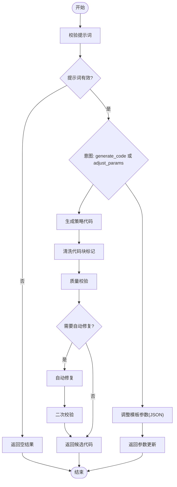
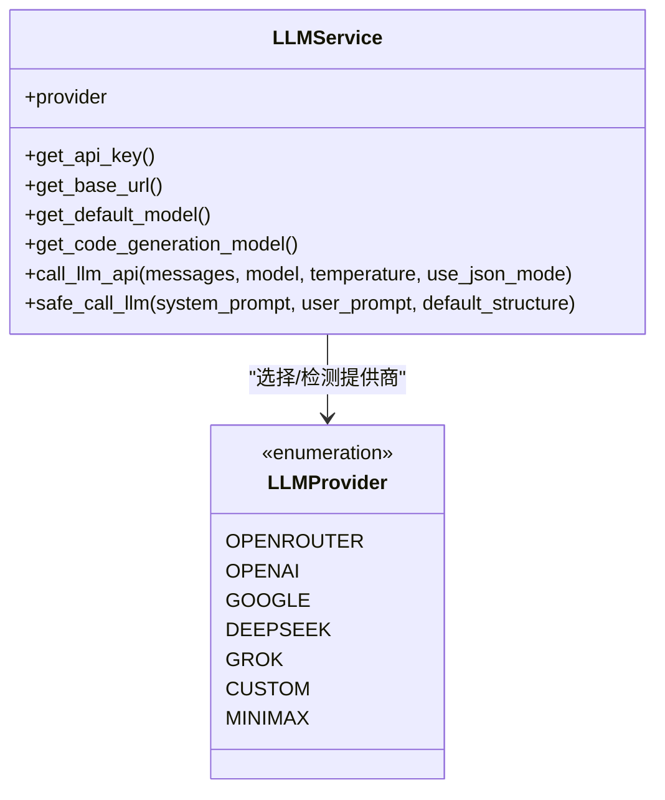
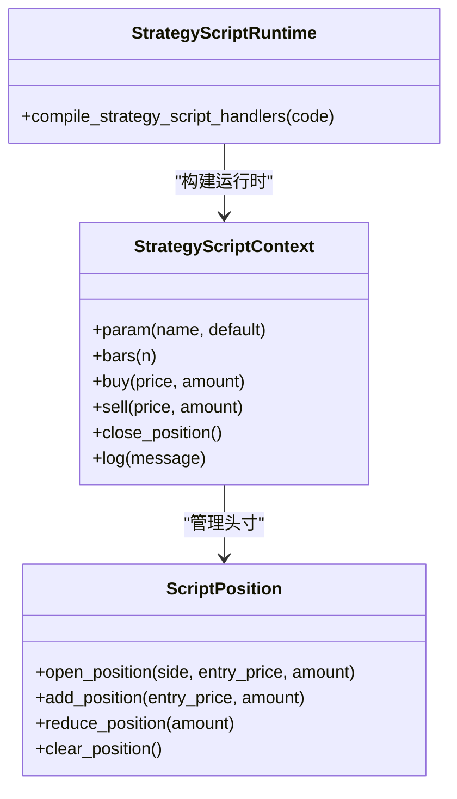
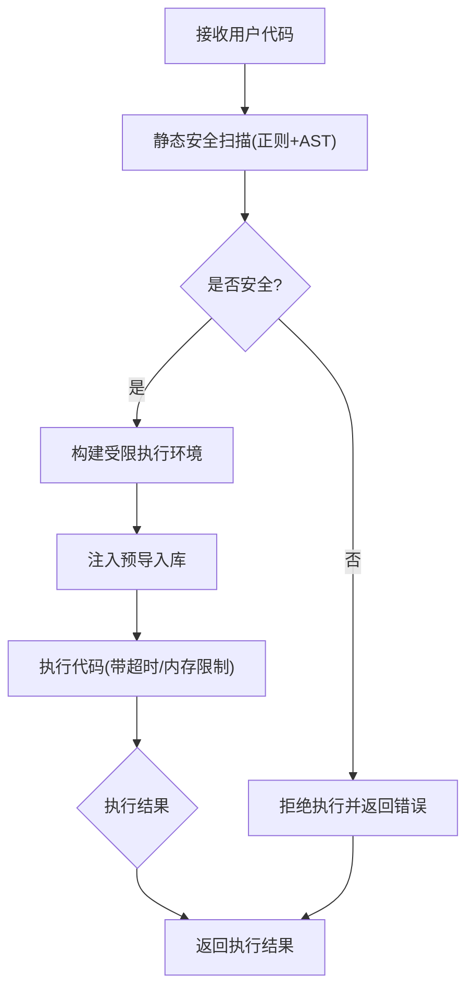
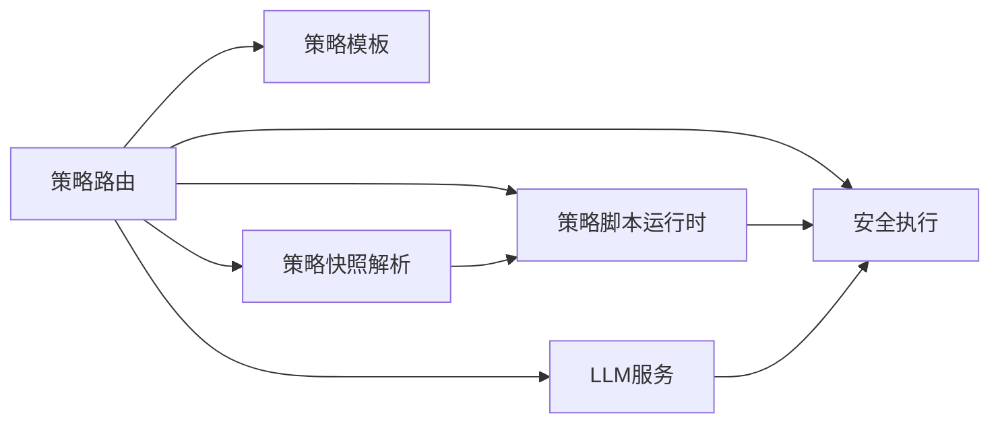

# AI代码生成功能

<cite>
**本文档引用的文件**
- [strategy.py](file://backend_api_python/app/routes/strategy.py)
- [llm.py](file://backend_api_python/app/services/llm.py)
- [strategy_script_runtime.py](file://backend_api_python/app/services/strategy_script_runtime.py)
- [strategy_compiler.py](file://backend_api_python/app/services/strategy_compiler.py)
- [strategy_templates.json](file://backend_api_python/app/data/strategy_templates.json)
- [safe_exec.py](file://backend_api_python/app/utils/safe_exec.py)
- [strategy.py](file://backend_api_python/app/services/strategy.py)
- [strategy_snapshot.py](file://backend_api_python/app/services/strategy_snapshot.py)
- [ai_chat.py](file://backend_api_python/app/routes/ai_chat.py)
</cite>

## 目录
1. [简介](#简介)
2. [项目结构](#项目结构)
3. [核心组件](#核心组件)
4. [架构总览](#架构总览)
5. [详细组件分析](#详细组件分析)
6. [依赖关系分析](#依赖关系分析)
7. [性能考虑](#性能考虑)
8. [故障排查指南](#故障排查指南)
9. [结论](#结论)
10. [附录](#附录)

## 简介
本文件系统性阐述 QuantDinger 量化平台中的 AI 代码生成功能，重点覆盖以下方面：
- 如何将自然语言需求转化为可运行的量化交易策略代码
- 提示工程、代码模板与语法转换机制
- 支持的代码生成类型、语言规范与最佳实践
- 质量控制、语法检查与安全验证机制
- 与策略编译器的集成流程、错误处理与调试支持
- 配置选项、参数设置与性能优化策略
- 历史记录管理、版本控制与代码审查流程

## 项目结构
AI 代码生成功能主要分布在后端 API 路由层、服务层与工具层：
- 路由层：提供对外接口，负责接收用户请求、调用 LLM 服务、执行代码质量校验与自动修复
- 服务层：封装 LLM 服务、策略脚本运行时、策略编译器、模板加载与快照解析
- 工具层：提供安全执行与沙箱能力，确保用户代码在受控环境下运行

**图表来源**
- [strategy.py:1525-1891](file://backend_api_python/app/routes/strategy.py#L1525-L1891)
- [llm.py:70-629](file://backend_api_python/app/services/llm.py#L70-L629)
- [strategy_script_runtime.py:159-191](file://backend_api_python/app/services/strategy_script_runtime.py#L159-L191)
- [strategy_compiler.py:4-689](file://backend_api_python/app/services/strategy_compiler.py#L4-L689)
- [strategy_templates.json:1-191](file://backend_api_python/app/data/strategy_templates.json#L1-L191)
- [safe_exec.py:207-244](file://backend_api_python/app/utils/safe_exec.py#L207-L244)

**章节来源**
- [strategy.py:1-800](file://backend_api_python/app/routes/strategy.py#L1-L800)
- [llm.py:1-629](file://backend_api_python/app/services/llm.py#L1-L629)

## 核心组件
- AI 代码生成路由：接收自然语言提示，调用 LLM 生成策略代码，执行质量校验与自动修复，返回最终候选代码
- LLM 服务：统一管理多提供商（OpenRouter、OpenAI、Google Gemini、DeepSeek、Grok、Minimax、自定义）的 API 调用、模型选择与降级策略
- 策略脚本运行时：编译并验证策略脚本，确保满足 on_init/on_bar 等必需函数与上下文接口
- 安全执行工具：对用户代码进行静态安全扫描与动态沙箱执行，限制危险操作与资源消耗
- 模板系统：内置多种策略模板，支持一键导入与参数调整
- 策略编译器：将结构化配置编译为可回测的 Python 代码
- 快照解析：将存储的策略配置解析为回测所需的快照对象

**章节来源**
- [strategy.py:45-121](file://backend_api_python/app/routes/strategy.py#L45-L121)
- [llm.py:70-629](file://backend_api_python/app/services/llm.py#L70-L629)
- [strategy_script_runtime.py:159-191](file://backend_api_python/app/services/strategy_script_runtime.py#L159-L191)
- [safe_exec.py:358-471](file://backend_api_python/app/utils/safe_exec.py#L358-L471)
- [strategy_templates.json:1-191](file://backend_api_python/app/data/strategy_templates.json#L1-L191)
- [strategy_compiler.py:4-689](file://backend_api_python/app/services/strategy_compiler.py#L4-L689)
- [strategy_snapshot.py:116-220](file://backend_api_python/app/services/strategy_snapshot.py#L116-L220)

## 架构总览
AI 代码生成从“自然语言”到“可运行策略”的端到端流程如下：

**图表来源**
- [strategy.py:1525-1891](file://backend_api_python/app/routes/strategy.py#L1525-L1891)
- [llm.py:368-563](file://backend_api_python/app/services/llm.py#L368-L563)
- [strategy_script_runtime.py:159-191](file://backend_api_python/app/services/strategy_script_runtime.py#L159-L191)
- [safe_exec.py:207-244](file://backend_api_python/app/utils/safe_exec.py#L207-L244)

## 详细组件分析

### 组件A：AI 代码生成路由与工作流
- 接口职责：接收用户请求，解析意图（生成代码/参数调整），调用 LLM 生成代码，执行质量校验与自动修复，返回调试摘要
- 关键流程：
  - 参数校验与计费扣减
  - 生成意图分支（generate_code/adjust_params）
  - LLM 调用与内容清洗
  - 质量校验与自动修复
  - 返回候选代码与调试摘要

**图表来源**
- [strategy.py:1525-1891](file://backend_api_python/app/routes/strategy.py#L1525-L1891)

**章节来源**
- [strategy.py:1525-1891](file://backend_api_python/app/routes/strategy.py#L1525-L1891)

### 组件B：LLM 服务与多提供商支持
- 多提供商封装：OpenRouter、OpenAI、Google Gemini、DeepSeek、Grok、Minimax、自定义
- 模型选择与降级：优先使用显式配置或环境变量，自动检测可用 API Key，支持备用模型与备用提供商
- 安全与鲁棒性：统一错误处理、状态码映射、降级提示与替代提供商尝试

**图表来源**
- [llm.py:70-629](file://backend_api_python/app/services/llm.py#L70-L629)

**章节来源**
- [llm.py:70-629](file://backend_api_python/app/services/llm.py#L70-L629)

### 组件C：策略脚本运行时与编译
- 编译入口：compile_strategy_script_handlers 返回 on_init/on_bar 可调用句柄
- 运行时上下文：提供 param/bars/buy/sell/close_position 等接口，与回测/实盘一致
- 校验规则：必须定义 on_bar；可选 on_init；缺失必要函数时报错

**图表来源**
- [strategy_script_runtime.py:114-191](file://backend_api_python/app/services/strategy_script_runtime.py#L114-L191)

**章节来源**
- [strategy_script_runtime.py:159-191](file://backend_api_python/app/services/strategy_script_runtime.py#L159-L191)

### 组件D：安全执行与沙箱
- 静态安全扫描：正则与 AST 双重检查，禁止危险模块与函数调用
- 动态沙箱执行：限制内置函数与导入模块，超时与内存限制，跨平台超时注入
- 子进程隔离：可选的子进程执行方案，进一步隔离风险

**图表来源**
- [safe_exec.py:207-244](file://backend_api_python/app/utils/safe_exec.py#L207-L244)
- [safe_exec.py:358-471](file://backend_api_python/app/utils/safe_exec.py#L358-L471)

**章节来源**
- [safe_exec.py:207-244](file://backend_api_python/app/utils/safe_exec.py#L207-L244)
- [safe_exec.py:358-471](file://backend_api_python/app/utils/safe_exec.py#L358-L471)

### 组件E：策略模板系统
- 模板加载：从 JSON 文件一次性加载缓存，支持分类与难度过滤
- 模板字段：包含键、名称、描述、类别、难度、市场、默认参数与标签
- 使用场景：一键导入、参数调整、作为生成上下文

**章节来源**
- [strategy.py:239-274](file://backend_api_python/app/routes/strategy.py#L239-L274)
- [strategy_templates.json:1-191](file://backend_api_python/app/data/strategy_templates.json#L1-L191)

### 组件F：策略编译器
- 输入：策略配置（名称、入场规则、仓位配置、加仓规则、风控）
- 输出：可回测的 Python 代码（含指标计算、信号逻辑、核心循环、输出格式）
- 特性：支持多种技术指标与信号组合，生成可视化绘图配置

**章节来源**
- [strategy_compiler.py:4-689](file://backend_api_python/app/services/strategy_compiler.py#L4-L689)

### 组件G：策略快照解析与回测集成
- 解析目标：将存储的策略配置解析为回测快照，包含市场、符号、时间框架、初始资金、杠杆、佣金滑点、交易方向、风控与加仓配置
- 集成点：与策略脚本运行时配合，支持脚本策略与指标策略两类

**章节来源**
- [strategy_snapshot.py:116-220](file://backend_api_python/app/services/strategy_snapshot.py#L116-L220)

## 依赖关系分析
- 路由层依赖服务层与工具层，实现端到端的 AI 代码生成
- 服务层内部解耦：LLM 服务独立于策略运行时，便于替换与扩展
- 安全执行贯穿生成与运行阶段，形成闭环保障

**图表来源**
- [strategy.py:1525-1891](file://backend_api_python/app/routes/strategy.py#L1525-L1891)
- [llm.py:70-629](file://backend_api_python/app/services/llm.py#L70-L629)
- [strategy_script_runtime.py:159-191](file://backend_api_python/app/services/strategy_script_runtime.py#L159-L191)
- [safe_exec.py:207-244](file://backend_api_python/app/utils/safe_exec.py#L207-L244)
- [strategy_templates.json:1-191](file://backend_api_python/app/data/strategy_templates.json#L1-L191)
- [strategy_snapshot.py:116-220](file://backend_api_python/app/services/strategy_snapshot.py#L116-L220)

**章节来源**
- [strategy.py:1-800](file://backend_api_python/app/routes/strategy.py#L1-L800)

## 性能考虑
- LLM 调用优化
  - 模型选择：优先使用专用代码生成模型，避免通用对话模型的冗余
  - 温度参数：生成代码时采用较高温度以提升创造性，但需平衡稳定性
  - 降级策略：提供备用模型与备用提供商，降低单点故障影响
- 代码生成质量
  - 严格的质量校验与自动修复，减少无效重试
  - 模板复用与参数调整，缩短生成路径
- 执行效率
  - 安全执行的超时与内存限制，防止长耗时或内存泄漏
  - 子进程隔离作为后备方案，提高稳定性

[本节为通用指导，无需特定文件引用]

## 故障排查指南
- LLM 相关
  - API Key 未配置或无效：检查对应提供商的环境变量与配置
  - 模型不可用或余额不足：查看提供商返回的状态码与错误信息
  - 备用提供商切换：服务会自动尝试替代提供商，若全部失败需人工检查配置
- 代码生成与校验
  - 生成结果为空：检查提示词有效性与 LLM 返回内容清洗逻辑
  - 质量校验失败：根据提示修复缺失函数、参数声明或交易意图
  - 自动修复失败：查看修复日志，必要时回退到初始版本
- 安全执行
  - 语法错误或 AST 解析失败：修正代码语法或移除危险模式
  - 超时或内存不足：优化算法复杂度，减少中间变量与循环次数
  - 危险模块导入：仅使用白名单内的模块与函数

**章节来源**
- [strategy.py:1525-1891](file://backend_api_python/app/routes/strategy.py#L1525-L1891)
- [llm.py:480-563](file://backend_api_python/app/services/llm.py#L480-L563)
- [safe_exec.py:358-471](file://backend_api_python/app/utils/safe_exec.py#L358-L471)

## 结论
QuantDinger 的 AI 代码生成功能通过“提示工程 + LLM 生成 + 质量校验 + 自动修复 + 安全执行”的闭环，实现了从自然语言到可运行策略的高效转化。其多提供商 LLM 支持、严格的沙箱执行与完善的调试摘要，既保证了生成质量，也确保了运行安全。结合模板系统与策略编译器，用户可以快速迭代策略并进入回测与实盘阶段。

[本节为总结性内容，无需特定文件引用]

## 附录

### 支持的代码生成类型与语言规范
- 生成类型
  - 生成策略代码：根据自然语言描述生成完整策略
  - 调整模板参数：基于现有模板与上下文，返回参数更新建议
- 语言规范
  - 策略脚本需遵循 on_init/on_bar 等约定，使用上下文提供的 API
  - 代码必须通过语法与结构校验，确保可编译与可运行

**章节来源**
- [strategy.py:1525-1891](file://backend_api_python/app/routes/strategy.py#L1525-L1891)
- [strategy_script_runtime.py:159-191](file://backend_api_python/app/services/strategy_script_runtime.py#L159-L191)

### 提示工程与最佳实践
- 明确目标：清晰描述策略意图、入场条件、风控要求与回测范围
- 上下文补充：提供模板键、当前参数与代码片段，提升生成准确性
- 参数优先：优先使用模板参数调整，减少从零生成的工作量

**章节来源**
- [strategy.py:1705-1730](file://backend_api_python/app/routes/strategy.py#L1705-L1730)
- [strategy.py:1789-1809](file://backend_api_python/app/routes/strategy.py#L1789-L1809)

### 配置选项与参数设置
- LLM 提供商与模型
  - 通过环境变量或配置文件选择提供商与模型
  - 支持备用模型与备用提供商，提升可用性
- 安全执行参数
  - 超时时间、内存上限、白名单模块与内置函数
- 代码生成参数
  - 温度、JSON 模式开关、提示词长度限制

**章节来源**
- [llm.py:168-174](file://backend_api_python/app/services/llm.py#L168-L174)
- [safe_exec.py:157-205](file://backend_api_python/app/utils/safe_exec.py#L157-L205)

### 质量控制与安全验证机制
- 静态安全扫描：禁止危险模块与函数调用
- 动态沙箱执行：限制资源与超时
- 运行时编译：确保策略脚本可被编译与执行
- 质量校验：检测缺失函数、参数声明与交易意图

**章节来源**
- [safe_exec.py:358-471](file://backend_api_python/app/utils/safe_exec.py#L358-L471)
- [strategy_script_runtime.py:159-191](file://backend_api_python/app/services/strategy_script_runtime.py#L159-L191)
- [strategy.py:45-121](file://backend_api_python/app/routes/strategy.py#L45-L121)

### 与策略编译器的集成流程
- 结构化配置 → 编译器 → Python 回测代码
- 适用于非脚本策略（如指标策略）的快速生成与回测

**章节来源**
- [strategy_compiler.py:4-689](file://backend_api_python/app/services/strategy_compiler.py#L4-L689)

### 错误处理与调试支持
- 调试摘要：包含初始与最终校验摘要、修复前后对比与人类可读说明
- 人类可读提示：将机器提示映射为中文/英文说明，便于理解与改进
- 日志记录：记录关键步骤与错误信息，辅助定位问题

**章节来源**
- [strategy.py:179-227](file://backend_api_python/app/routes/strategy.py#L179-L227)

### 历史记录管理、版本控制与代码审查
- 历史记录：后端提供回测历史查询接口，可用于追踪策略表现与变更
- 版本控制：建议在外部系统（如 Git）中管理策略代码版本
- 代码审查：结合调试摘要与提示工程，建立团队审查流程

**章节来源**
- [strategy.py:443-488](file://backend_api_python/app/routes/strategy.py#L443-L488)
- [ai_chat.py:15-47](file://backend_api_python/app/routes/ai_chat.py#L15-L47)