# AI分析引擎

<cite>
**本文档引用的文件**
- [llm.py](file://backend_api_python/app/services/llm.py)
- [ai_calibration.py](file://backend_api_python/app/services/ai_calibration.py)
- [analysis_memory.py](file://backend_api_python/app/services/analysis_memory.py)
- [fast_analysis.py](file://backend_api_python/app/services/fast_analysis.py)
- [reflection.py](file://backend_api_python/app/services/reflection.py)
- [api_keys.py](file://backend_api_python/app/config/api_keys.py)
- [config_loader.py](file://backend_api_python/app/utils/config_loader.py)
- [market_data_collector.py](file://backend_api_python/app/services/market_data_collector.py)
- [polymarket_analyzer.py](file://backend_api_python/app/services/polymarket_analyzer.py)
- [polymarket.py](file://backend_api_python/app/data_sources/polymarket.py)
- [ai_chat.py](file://backend_api_python/app/routes/ai_chat.py)
- [fast_analysis_routes.py](file://backend_api_python/app/routes/fast_analysis.py)
</cite>

## 目录
1. [简介](#简介)
2. [项目结构](#项目结构)
3. [核心组件](#核心组件)
4. [架构概览](#架构概览)
5. [详细组件分析](#详细组件分析)
6. [依赖关系分析](#依赖关系分析)
7. [性能考量](#性能考量)
8. [故障排除指南](#故障排除指南)
9. [结论](#结论)
10. [附录](#附录)

## 简介
AI分析引擎是一个基于多LLM提供商集成的智能分析系统，支持OpenRouter、OpenAI、Google Gemini、DeepSeek、Grok、MiniMax等多种AI服务提供商。该系统提供快速分析、AI校准、分析记忆、预测市场分析等功能，旨在为量化交易和投资决策提供智能化支持。

## 项目结构
AI分析引擎采用模块化设计，主要包含以下核心模块：

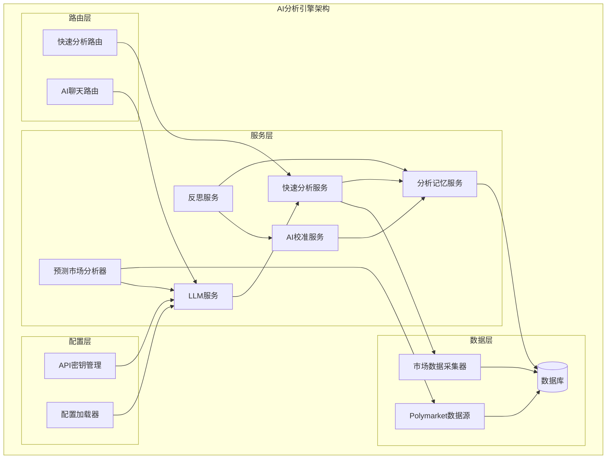

**图表来源**
- [llm.py:70-122](file://backend_api_python/app/services/llm.py#L70-L122)
- [fast_analysis.py:186-200](file://backend_api_python/app/services/fast_analysis.py#L186-L200)
- [analysis_memory.py:36-44](file://backend_api_python/app/services/analysis_memory.py#L36-L44)

**章节来源**
- [llm.py:1-629](file://backend_api_python/app/services/llm.py#L1-L629)
- [fast_analysis.py:1-800](file://backend_api_python/app/services/fast_analysis.py#L1-L800)

## 核心组件
AI分析引擎的核心组件包括多LLM提供商支持、AI校准机制、分析记忆系统、预测市场分析器等。

### 多LLM提供商集成
系统支持7种不同的LLM提供商，每种提供商都有特定的配置和API端点：

| 提供商 | 基础URL | 默认模型 | 备注 |
|--------|---------|----------|------|
| OpenRouter | https://openrouter.ai/api/v1 | openai/gpt-4o | 支持多模型路由 |
| OpenAI | https://api.openai.com/v1 | gpt-4o | 直接OpenAI接口 |
| Google | https://generativelanguage.googleapis.com/v1beta | gemini-1.5-flash | Gemini API |
| DeepSeek | https://api.deepseek.com/v1 | deepseek-chat | 开源模型 |
| Grok | https://api.x.ai/v1 | grok-beta | xAI模型 |
| MiniMax | https://api.minimax.io/v1 | MiniMax-M2.7 | 中文模型 |
| Custom | 用户配置 | 用户配置 | 本地或自定义接口 |

### AI校准机制
AI校准服务通过历史分析结果自动调整决策阈值，实现系统的自我优化：

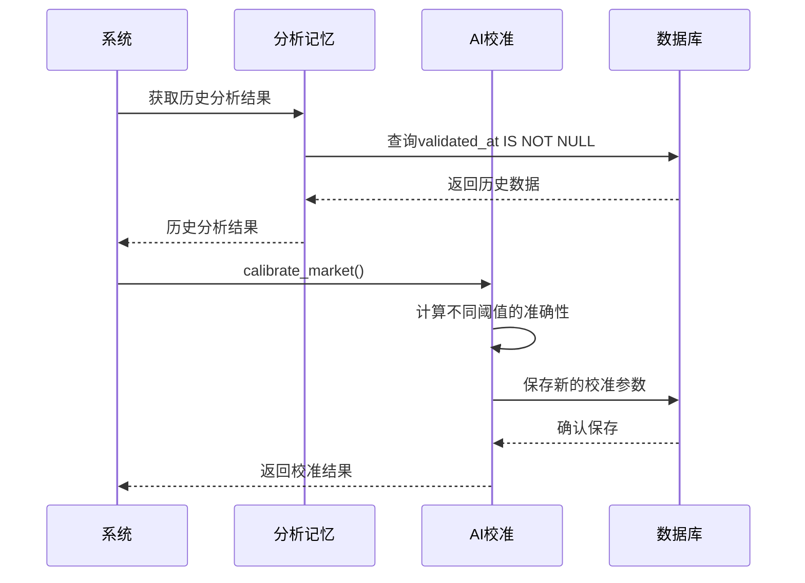

**图表来源**
- [ai_calibration.py:163-310](file://backend_api_python/app/services/ai_calibration.py#L163-L310)
- [analysis_memory.py:609-701](file://backend_api_python/app/services/analysis_memory.py#L609-L701)

**章节来源**
- [ai_calibration.py:1-342](file://backend_api_python/app/services/ai_calibration.py#L1-L342)
- [analysis_memory.py:1-957](file://backend_api_python/app/services/analysis_memory.py#L1-L957)

## 架构概览
AI分析引擎采用分层架构设计，确保各组件职责清晰、耦合度低：

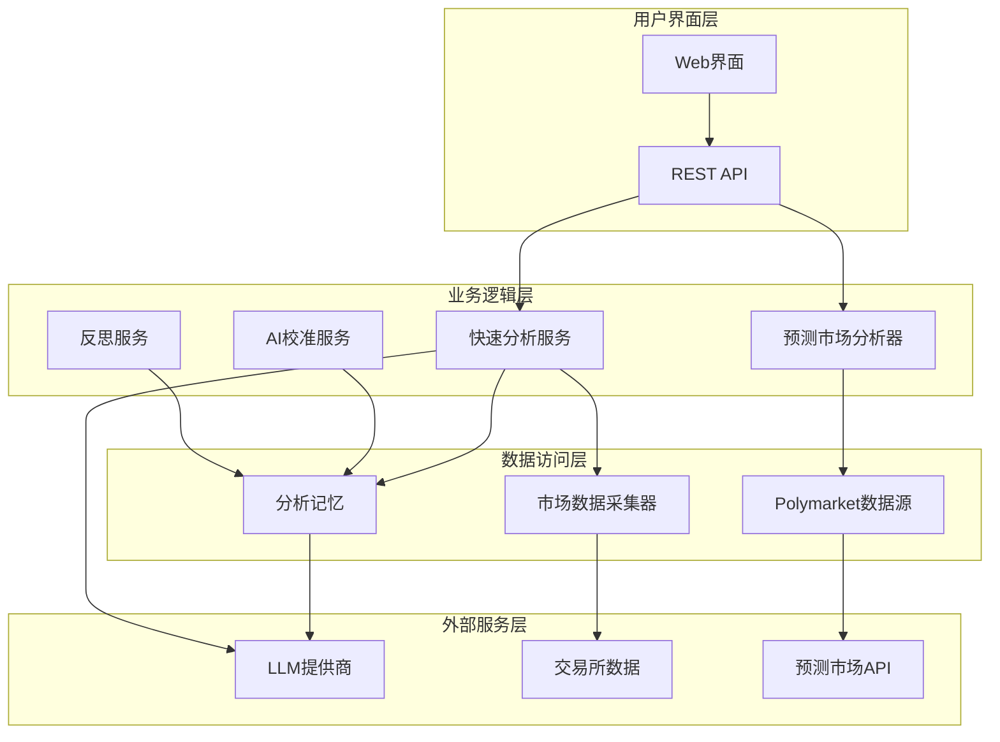

**图表来源**
- [fast_analysis.py:186-200](file://backend_api_python/app/services/fast_analysis.py#L186-L200)
- [polymarket_analyzer.py:19-26](file://backend_api_python/app/services/polymarket_analyzer.py#L19-L26)

## 详细组件分析

### LLM服务组件
LLM服务是整个AI分析引擎的核心，负责统一管理多个LLM提供商：

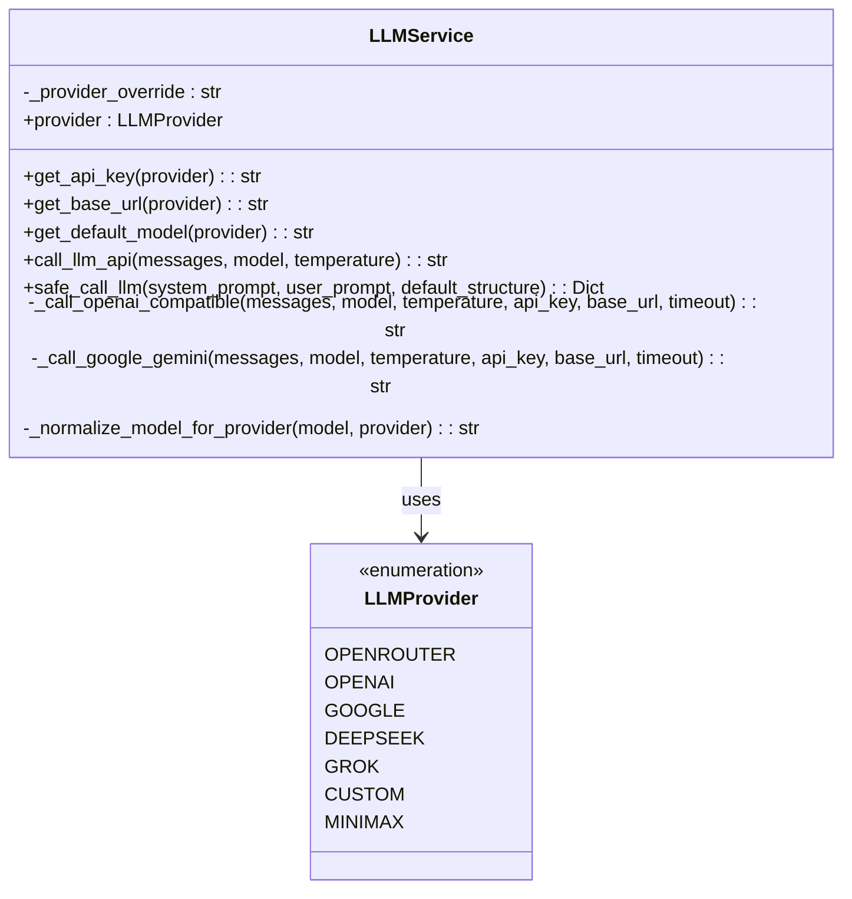

**图表来源**
- [llm.py:70-122](file://backend_api_python/app/services/llm.py#L70-L122)
- [llm.py:18-28](file://backend_api_python/app/services/llm.py#L18-L28)

#### LLM调用流程
系统支持智能提供商检测和自动切换机制：

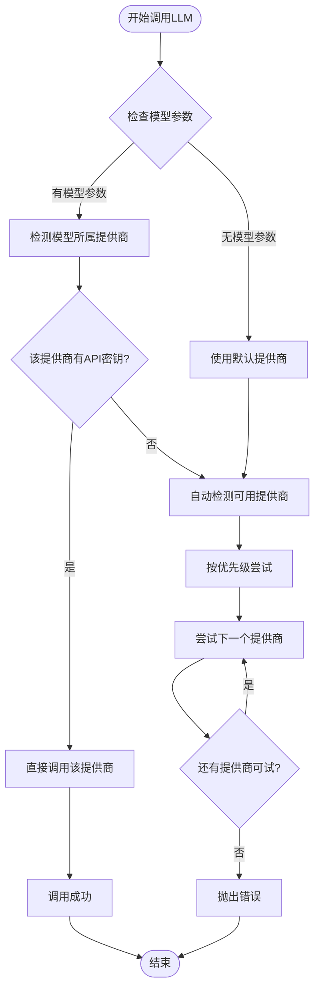

**图表来源**
- [llm.py:392-445](file://backend_api_python/app/services/llm.py#L392-L445)
- [llm.py:526-562](file://backend_api_python/app/services/llm.py#L526-L562)

**章节来源**
- [llm.py:1-629](file://backend_api_python/app/services/llm.py#L1-L629)

### 快速分析服务
快速分析服务是AI引擎的主要入口，提供统一的分析接口：

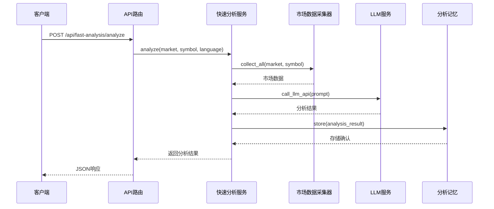

**图表来源**
- [fast_analysis.py:243-250](file://backend_api_python/app/services/fast_analysis.py#L243-L250)
- [fast_analysis_routes.py:113-130](file://backend_api_python/app/routes/fast_analysis.py#L113-L130)

#### 分析提示工程
系统采用严格的提示工程策略，确保分析质量和一致性：

| 分析要素 | 提示规则 | 重要性 |
|----------|----------|--------|
| 决策规则 | 必须遵循明确的BUY/SELL/HOLD规则 | ⭐⭐⭐⭐⭐ |
| 技术分析 | 必须客观解读RSI、MACD、MA指标 | ⭐⭐⭐⭐⭐ |
| 宏观环境 | 必须分析DXY、VIX、利率影响 | ⭐⭐⭐⭐ |
| 新闻事件 | 必须关注地缘政治事件 | ⭐⭐⭐⭐⭐ |
| 风险评估 | 必须列出所有显著风险 | ⭐⭐⭐⭐ |
| 价格规则 | 必须在10%范围内给出价格建议 | ⭐⭐⭐⭐ |

**章节来源**
- [fast_analysis.py:486-761](file://backend_api_python/app/services/fast_analysis.py#L486-L761)

### 分析记忆系统
分析记忆系统提供完整的分析历史管理和学习功能：

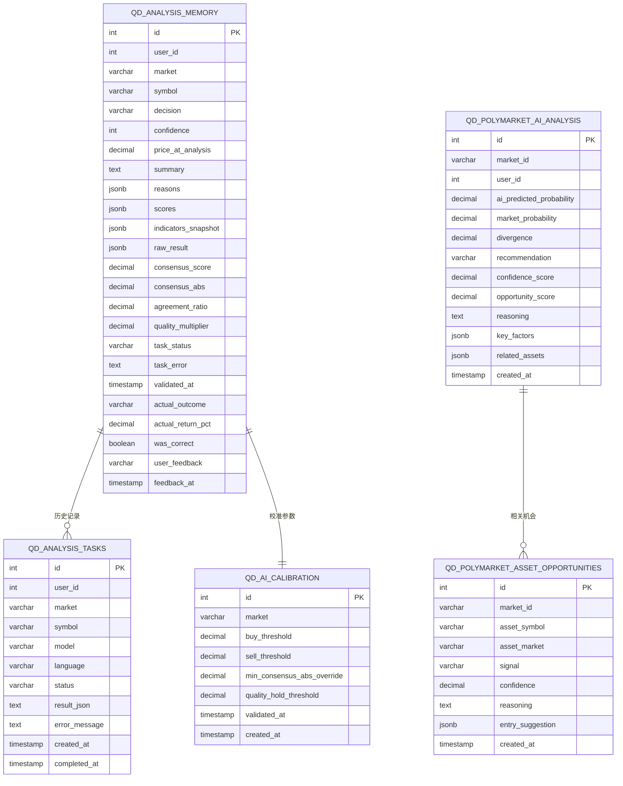

**图表来源**
- [analysis_memory.py:53-80](file://backend_api_python/app/services/analysis_memory.py#L53-L80)
- [polymarket_analyzer.py:567-612](file://backend_api_python/app/services/polymarket_analyzer.py#L567-L612)

#### 相似模式检索算法
系统使用多指标加权相似度算法查找历史相似模式：

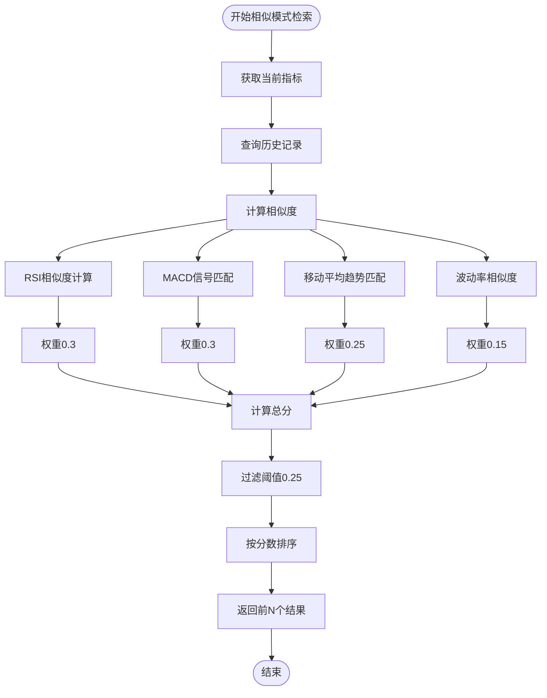

**图表来源**
- [analysis_memory.py:513-584](file://backend_api_python/app/services/analysis_memory.py#L513-L584)

**章节来源**
- [analysis_memory.py:1-957](file://backend_api_python/app/services/analysis_memory.py#L1-L957)

### 预测市场分析器
预测市场分析器专门处理Polymarket等预测市场的AI分析：

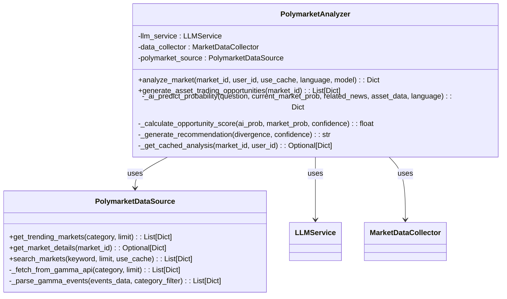

**图表来源**
- [polymarket_analyzer.py:19-26](file://backend_api_python/app/services/polymarket_analyzer.py#L19-L26)
- [polymarket.py:17-28](file://backend_api_python/app/data_sources/polymarket.py#L17-L28)

#### AI预测概率计算
系统采用多维度分析计算预测概率：

| 分析维度 | 权重 | 说明 |
|----------|------|------|
| 历史成功率 | 20% | 类似历史事件的成功率 |
| 新闻趋势 | 20% | 相关新闻和趋势分析 |
| 资产价格 | 20% | 相关资产价格走势和技术指标 |
| 宏观环境 | 20% | VIX、DXY、利率等宏观因素 |
| 市场情绪 | 20% | 预测市场情绪指标 |

**章节来源**
- [polymarket_analyzer.py:197-336](file://backend_api_python/app/services/polymarket_analyzer.py#L197-L336)
- [polymarket.py:1-800](file://backend_api_python/app/data_sources/polymarket.py#L1-L800)

### 反思服务
反思服务负责定期验证历史分析结果并触发AI校准：

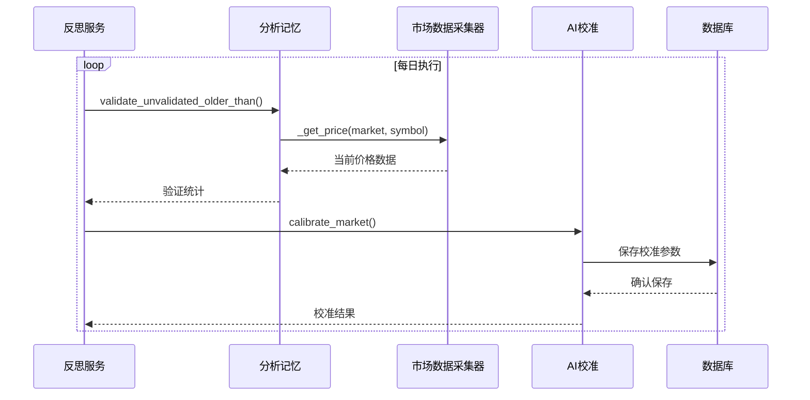

**图表来源**
- [reflection.py:27-48](file://backend_api_python/app/services/reflection.py#L27-L48)
- [ai_calibration.py:163-310](file://backend_api_python/app/services/ai_calibration.py#L163-L310)

**章节来源**
- [reflection.py:1-101](file://backend_api_python/app/services/reflection.py#L1-L101)

## 依赖关系分析

### 外部依赖关系
AI分析引擎依赖多个外部服务和API：

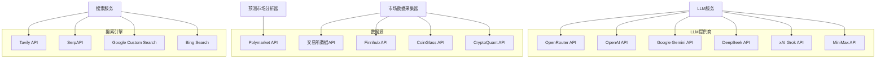

**图表来源**
- [llm.py:31-67](file://backend_api_python/app/services/llm.py#L31-L67)
- [market_data_collector.py:54-71](file://backend_api_python/app/services/market_data_collector.py#L54-L71)

### 内部依赖关系
系统内部组件之间的依赖关系：

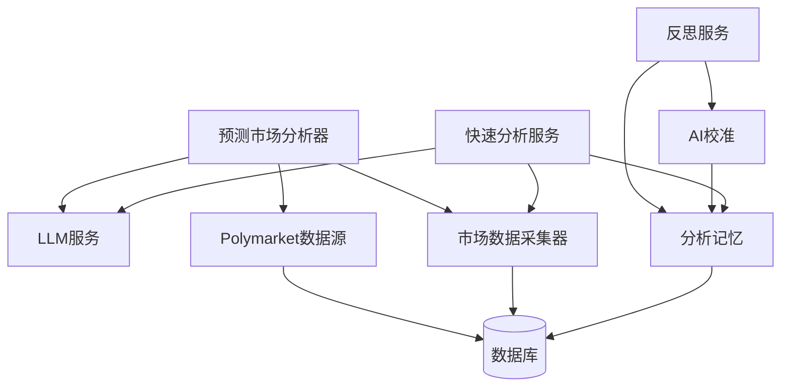

**图表来源**
- [fast_analysis.py:196-199](file://backend_api_python/app/services/fast_analysis.py#L196-L199)
- [polymarket_analyzer.py:22-25](file://backend_api_python/app/services/polymarket_analyzer.py#L22-L25)

**章节来源**
- [api_keys.py:1-184](file://backend_api_python/app/config/api_keys.py#L1-L184)
- [config_loader.py:24-161](file://backend_api_python/app/utils/config_loader.py#L24-L161)

## 性能考量
AI分析引擎在设计时充分考虑了性能优化：

### 缓存策略
- **Polymarket数据缓存**：5分钟TTL，减少API调用频率
- **分析结果缓存**：30分钟有效期，支持用户特定缓存
- **配置缓存**：全局配置缓存，避免重复解析

### 并行处理
- **数据采集并行化**：使用ThreadPoolExecutor并行获取价格、K线、基本面数据
- **异步分析任务**：支持异步提交分析任务，避免阻塞主线程
- **批量验证**：反思服务批量验证历史分析结果

### 错误处理和重试
- **智能提供商切换**：当某个提供商出现403/402错误时自动切换到其他提供商
- **模型回退机制**：支持主模型失败时自动尝试备用模型
- **超时控制**：为每个外部API调用设置合理的超时时间

## 故障排除指南

### 常见问题诊断
1. **API密钥配置错误**
   - 检查.env文件中的API密钥配置
   - 验证API密钥的有效性和权限
   - 确认提供商选择与密钥匹配

2. **LLM调用失败**
   - 查看具体的HTTP状态码和错误信息
   - 检查提供商的API限制和配额
   - 验证模型名称和格式

3. **分析结果为空**
   - 确认数据源连接正常
   - 检查市场符号格式
   - 验证时间框架参数

### 性能优化建议
1. **缓存配置优化**
   - 调整Polymarket缓存TTL以平衡实时性和性能
   - 优化数据库索引以提升查询性能
   - 考虑增加Redis缓存层

2. **并发控制**
   - 调整线程池大小以适应服务器资源
   - 实现请求队列管理防止过载
   - 优化数据库连接池配置

3. **监控和告警**
   - 设置关键指标监控（响应时间、错误率）
   - 实现自动故障转移机制
   - 建立性能基准测试

**章节来源**
- [llm.py:210-238](file://backend_api_python/app/services/llm.py#L210-L238)
- [fast_analysis_routes.py:25-39](file://backend_api_python/app/routes/fast_analysis.py#L25-L39)

## 结论
AI分析引擎通过多LLM提供商集成、智能校准机制、完善的分析记忆系统和预测市场分析功能，为量化交易提供了强大的智能化支持。系统采用模块化设计，具有良好的扩展性和维护性。通过合理的性能优化和故障处理机制，能够满足生产环境的高可用性要求。

## 附录

### 配置选项参考
- **LLM提供商配置**：通过环境变量或.env文件配置
- **API密钥管理**：支持多提供商密钥配置
- **性能参数**：超时时间、重试次数、并发数等
- **分析参数**：置信度阈值、时间框架、语言设置

### API接口文档
- **快速分析接口**：POST /api/fast-analysis/analyze
- **历史查询接口**：GET /api/fast-analysis/history
- **反馈提交接口**：POST /api/fast-analysis/feedback
- **AI聊天接口**：兼容旧版API，支持未来扩展

### 最佳实践建议
1. **提示工程**：严格遵循系统提示规则，确保分析质量
2. **模型选择**：根据分析场景选择合适的LLM模型
3. **缓存策略**：合理利用缓存机制提升性能
4. **监控告警**：建立完善的监控体系及时发现和解决问题