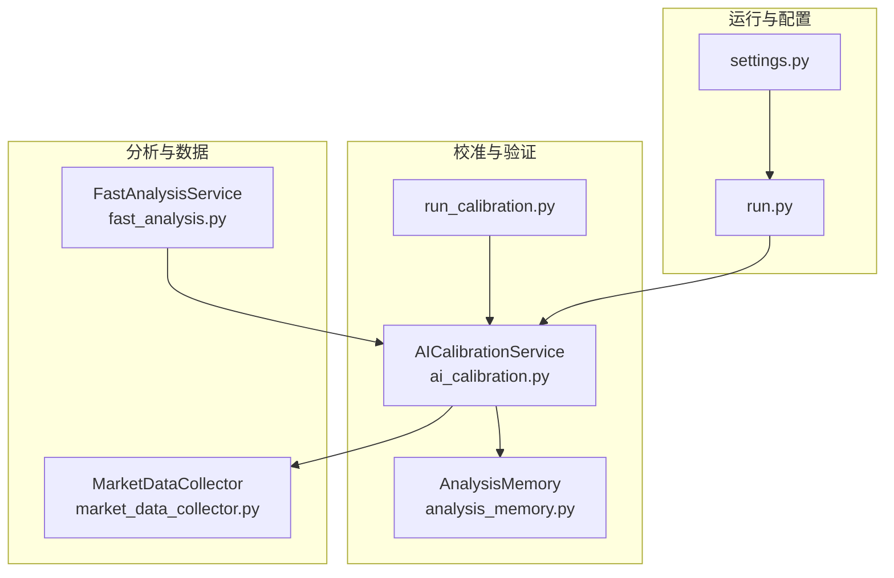
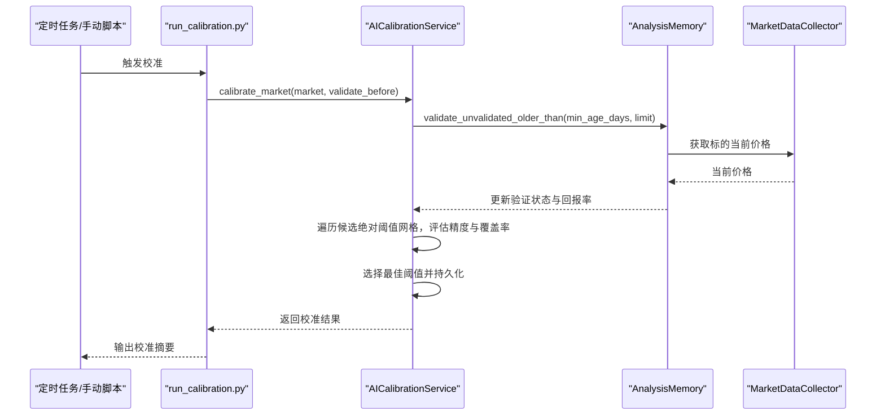
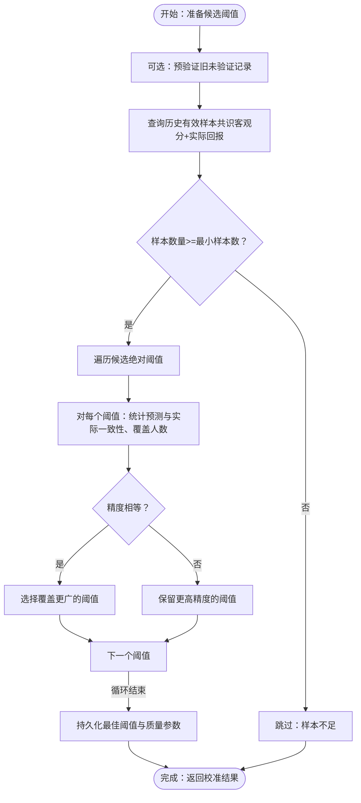
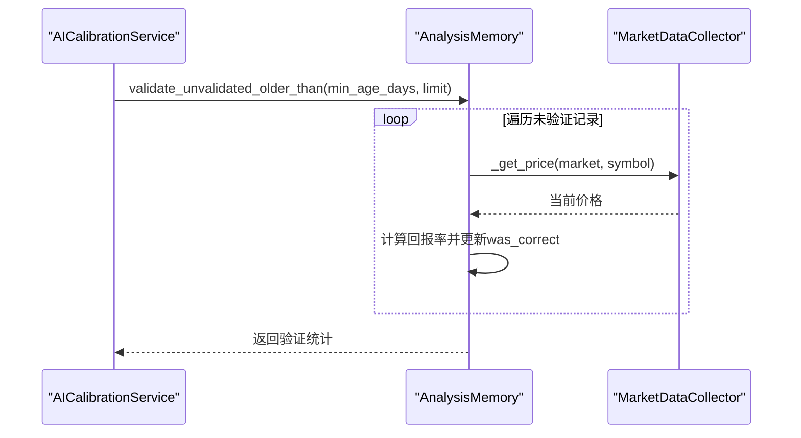
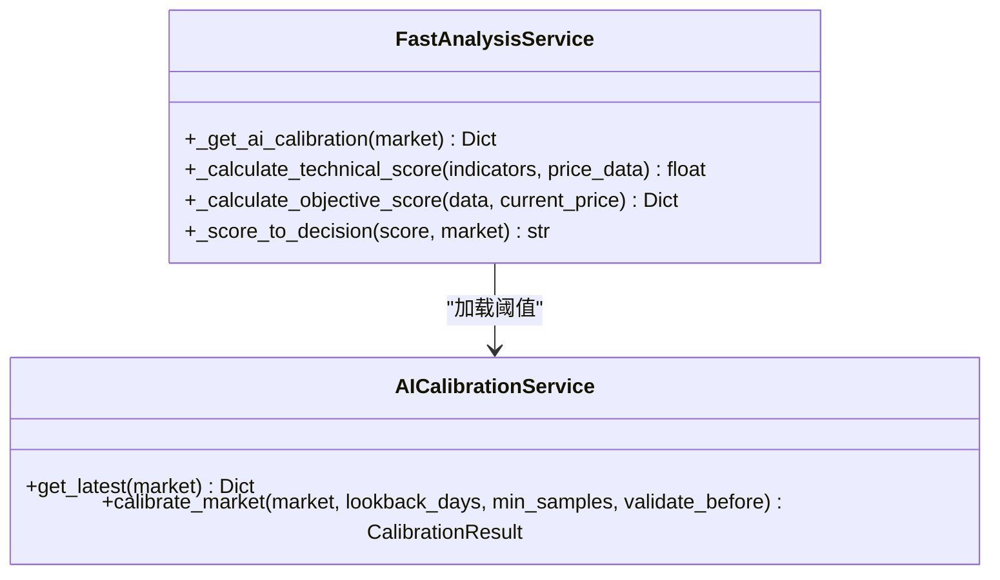
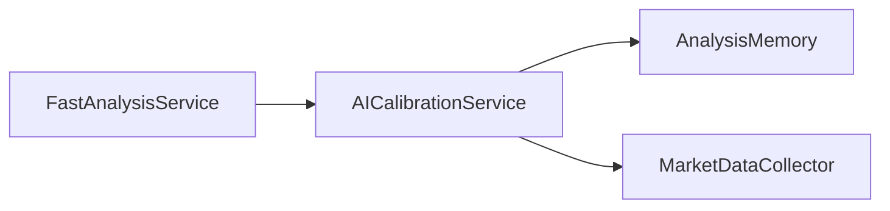

# AI校准机制

<cite>
**本文引用的文件**
- [ai_calibration.py](file://backend_api_python/app/services/ai_calibration.py)
- [run_calibration.py](file://backend_api_python/scripts/run_calibration.py)
- [analysis_memory.py](file://backend_api_python/app/services/analysis_memory.py)
- [fast_analysis.py](file://backend_api_python/app/services/fast_analysis.py)
- [market_data_collector.py](file://backend_api_python/app/services/market_data_collector.py)
- [settings.py](file://backend_api_python/app/config/settings.py)
- [run.py](file://backend_api_python/run.py)
</cite>

## 目录
1. [简介](#简介)
2. [项目结构](#项目结构)
3. [核心组件](#核心组件)
4. [架构总览](#架构总览)
5. [详细组件分析](#详细组件分析)
6. [依赖关系分析](#依赖关系分析)
7. [性能考量](#性能考量)
8. [故障排查指南](#故障排查指南)
9. [结论](#结论)
10. [附录](#附录)

## 简介
本文件系统化阐述 QuantDinger 后端的 AI 校准机制，聚焦以下目标：
- 解释基于历史分析结果的阈值校准算法与流程
- 说明校准数据来源、质量保证与参数调整策略
- 文档化数据预处理、特征提取与结果验证方法
- 提供配置项、阈值设置与失败恢复策略
- 说明效果监控、性能指标跟踪与自动校准触发机制

该机制通过离线校准，将“共识客观分”映射为交易决策阈值，使快速分析服务具备自学习能力，提升在不同市场条件下的准确性与稳健性。

## 项目结构
围绕 AI 校准的关键文件与职责如下：
- 校准服务与脚本
  - ai_calibration.py：离线校准服务，负责阈值搜索、结果持久化与最新配置查询
  - run_calibration.py：手动执行脚本，支持按市场批量校准
- 学习与验证
  - analysis_memory.py：分析记忆库，存储历史分析与验证结果，提供回填验证接口
- 快速分析与集成
  - fast_analysis.py：快速分析服务，加载校准阈值并进行决策
  - market_data_collector.py：市场数据采集器，为验证提供价格数据
- 配置与入口
  - settings.py：全局配置（含日志级别等）
  - run.py：应用入口，启动时可触发离线校准工作进程

**图表来源**
- [ai_calibration.py:1-342](file://backend_api_python/app/services/ai_calibration.py#L1-L342)
- [run_calibration.py:1-36](file://backend_api_python/scripts/run_calibration.py#L1-L36)
- [analysis_memory.py:1-957](file://backend_api_python/app/services/analysis_memory.py#L1-L957)
- [fast_analysis.py:180-2805](file://backend_api_python/app/services/fast_analysis.py#L180-L2805)
- [market_data_collector.py:1-229](file://backend_api_python/app/services/market_data_collector.py#L1-L229)
- [run.py:1-134](file://backend_api_python/run.py#L1-L134)
- [settings.py:1-99](file://backend_api_python/app/config/settings.py#L1-L99)

**章节来源**
- [ai_calibration.py:1-342](file://backend_api_python/app/services/ai_calibration.py#L1-L342)
- [run_calibration.py:1-36](file://backend_api_python/scripts/run_calibration.py#L1-L36)
- [analysis_memory.py:1-957](file://backend_api_python/app/services/analysis_memory.py#L1-L957)
- [fast_analysis.py:180-2805](file://backend_api_python/app/services/fast_analysis.py#L180-L2805)
- [market_data_collector.py:1-229](file://backend_api_python/app/services/market_data_collector.py#L1-L229)
- [run.py:1-134](file://backend_api_python/run.py#L1-L134)
- [settings.py:1-99](file://backend_api_python/app/config/settings.py#L1-L99)

## 核心组件
- AICalibrationService
  - 负责：创建校准表、查询最新阈值、生成候选绝对阈值网格、评估阈值精度、持久化最佳配置
  - 关键点：使用历史“共识客观分”与“实际回报率”进行正确性判定；优先选择覆盖更广且精度更高的阈值
- AnalysisMemory
  - 负责：存储分析历史、回填验证（自动标注正确性）、统计置信度分桶准确率
  - 关键点：提供 validate_unvalidated_older_than 接口，供离线校准批量回填
- FastAnalysisService
  - 负责：加载校准阈值、计算技术/基本面/情绪/宏观评分、生成共识与最终决策
  - 关键点：缓存校准配置，按市场维度加载；根据阈值将客观分映射为买卖/持有
- MarketDataCollector
  - 负责：为验证阶段提供当前价格，支撑“实际回报率”的计算
- run_calibration.py
  - 负责：手动触发离线校准，支持单个或多个市场的批量执行
- run.py
  - 负责：应用启动，可触发离线校准工作进程

**章节来源**
- [ai_calibration.py:57-342](file://backend_api_python/app/services/ai_calibration.py#L57-L342)
- [analysis_memory.py:36-957](file://backend_api_python/app/services/analysis_memory.py#L36-L957)
- [fast_analysis.py:1800-2199](file://backend_api_python/app/services/fast_analysis.py#L1800-L2199)
- [market_data_collector.py:34-229](file://backend_api_python/app/services/market_data_collector.py#L34-L229)
- [run_calibration.py:18-36](file://backend_api_python/scripts/run_calibration.py#L18-L36)
- [run.py:104-134](file://backend_api_python/run.py#L104-L134)

## 架构总览
AI 校准机制采用“离线训练 + 在线应用”的双阶段设计：
- 离线阶段：从分析记忆库中抽取历史样本，回填验证，评估候选阈值，持久化最佳配置
- 在线阶段：快速分析服务加载最新校准阈值，将客观分映射为交易决策

**图表来源**
- [run_calibration.py:18-36](file://backend_api_python/scripts/run_calibration.py#L18-L36)
- [ai_calibration.py:163-311](file://backend_api_python/app/services/ai_calibration.py#L163-L311)
- [analysis_memory.py:703-783](file://backend_api_python/app/services/analysis_memory.py#L703-L783)
- [market_data_collector.py:228-229](file://backend_api_python/app/services/market_data_collector.py#L228-L229)

## 详细组件分析

### AICalibrationService（离线校准服务）
- 表结构与索引
  - qd_ai_calibration：保存每个市场的最新阈值与质量参数，按市场+时间倒序索引，便于快速查询最新配置
- 阈值候选网格
  - 默认网格：[10, 12, 14, 16, 18, 20, 22, 25, 30]
  - 可通过环境变量覆盖
- 正确性规则
  - 依据“实际回报率”与决策的近似正确性规则：正向回报>2%视为买入正确，负向回报<-2%视为卖出正确，|回报|<=5%视为持有正确
- 评估与选择
  - 对每个候选绝对阈值，统计预测决策与实际回报的一致率；若一致率相同，优先选择覆盖更广（BUY+SELL合计更高）的阈值
- 持久化与返回
  - 将最佳阈值与质量参数写入数据库，返回校准结果对象（包含市场、阈值、精度、覆盖率、样本数等）

**图表来源**
- [ai_calibration.py:132-145](file://backend_api_python/app/services/ai_calibration.py#L132-L145)
- [ai_calibration.py:147-162](file://backend_api_python/app/services/ai_calibration.py#L147-L162)
- [ai_calibration.py:232-267](file://backend_api_python/app/services/ai_calibration.py#L232-L267)
- [ai_calibration.py:268-311](file://backend_api_python/app/services/ai_calibration.py#L268-L311)

**章节来源**
- [ai_calibration.py:57-131](file://backend_api_python/app/services/ai_calibration.py#L57-L131)
- [ai_calibration.py:132-162](file://backend_api_python/app/services/ai_calibration.py#L132-L162)
- [ai_calibration.py:163-311](file://backend_api_python/app/services/ai_calibration.py#L163-L311)

### AnalysisMemory（分析记忆与验证）
- 记忆表字段
  - 包含决策、置信度、价格、原因、评分、指标快照、原始结果、共识分、一致性比例、质量倍数、验证时间、实际回报率、正确性标记等
- 验证流程
  - validate_unvalidated_older_than：按时间窗口回溯未验证记录，调用 MarketDataCollector 获取当前价格，计算回报率并标注正确性
  - validate_past_decisions：按固定天数窗口进行批量验证，用于定期构建学习数据
- 统计与分桶
  - 提供按置信度分桶的准确率统计接口，用于校准与监控

**图表来源**
- [analysis_memory.py:703-783](file://backend_api_python/app/services/analysis_memory.py#L703-L783)
- [market_data_collector.py:228-229](file://backend_api_python/app/services/market_data_collector.py#L228-L229)

**章节来源**
- [analysis_memory.py:36-174](file://backend_api_python/app/services/analysis_memory.py#L36-L174)
- [analysis_memory.py:609-701](file://backend_api_python/app/services/analysis_memory.py#L609-L701)
- [analysis_memory.py:703-783](file://backend_api_python/app/services/analysis_memory.py#L703-L783)

### FastAnalysisService（在线应用与决策）
- 校准阈值加载
  - _get_ai_calibration：按市场维度加载最新校准配置，内置短时缓存，避免频繁访问数据库
- 决策映射
  - 将“共识客观分”与“绝对阈值”比较，映射为“买入/卖出/持有”
- 评分体系
  - 技术评分、基本面评分、情绪评分、宏观评分加权合成，支持加密货币特有因子
- 置信度与一致性
  - 基于共识绝对值与一致性比例动态调整置信度

**图表来源**
- [fast_analysis.py:2000-2028](file://backend_api_python/app/services/fast_analysis.py#L2000-L2028)
- [fast_analysis.py:1890-1999](file://backend_api_python/app/services/fast_analysis.py#L1890-L1999)
- [ai_calibration.py:91-131](file://backend_api_python/app/services/ai_calibration.py#L91-L131)

**章节来源**
- [fast_analysis.py:2000-2028](file://backend_api_python/app/services/fast_analysis.py#L2000-L2028)
- [fast_analysis.py:1890-1999](file://backend_api_python/app/services/fast_analysis.py#L1890-L1999)
- [ai_calibration.py:91-131](file://backend_api_python/app/services/ai_calibration.py#L91-L131)

### MarketDataCollector（数据采集）
- 为验证阶段提供当前价格，支撑回报率计算
- 支持多种数据源与异步采集，确保校准所需的价格数据可用

**章节来源**
- [market_data_collector.py:34-229](file://backend_api_python/app/services/market_data_collector.py#L34-L229)

### run_calibration.py（手动执行）
- 支持通过环境变量指定单个或多个市场批量校准
- 输出每次校准的精度、阈值与样本数摘要

**章节来源**
- [run_calibration.py:18-36](file://backend_api_python/scripts/run_calibration.py#L18-L36)

### run.py（启动与自动校准）
- 应用启动时可触发离线校准工作进程，按环境变量控制启用与参数

**章节来源**
- [run.py:104-134](file://backend_api_python/run.py#L104-L134)
- [ai_calibration.py:313-341](file://backend_api_python/app/services/ai_calibration.py#L313-L341)

## 依赖关系分析
- 组件耦合
  - AICalibrationService 依赖 AnalysisMemory（回填验证）与 MarketDataCollector（价格数据）
  - FastAnalysisService 依赖 AICalibrationService（阈值配置）
- 外部依赖
  - 数据库：PostgreSQL（分析记忆与校准配置）
  - 外部数据源：Finanhub、yfinance 等（由 MarketDataCollector 调用）

**图表来源**
- [ai_calibration.py:180-186](file://backend_api_python/app/services/ai_calibration.py#L180-L186)
- [analysis_memory.py:620-621](file://backend_api_python/app/services/analysis_memory.py#L620-L621)
- [fast_analysis.py:2019-2021](file://backend_api_python/app/services/fast_analysis.py#L2019-L2021)

**章节来源**
- [ai_calibration.py:180-186](file://backend_api_python/app/services/ai_calibration.py#L180-L186)
- [analysis_memory.py:620-621](file://backend_api_python/app/services/analysis_memory.py#L620-L621)
- [fast_analysis.py:2019-2021](file://backend_api_python/app/services/fast_analysis.py#L2019-L2021)

## 性能考量
- 查询与缓存
  - FastAnalysisService 对校准配置进行短时缓存，降低数据库压力
- 样本规模与回溯窗口
  - 通过最小样本数与回溯天数控制校准稳定性与时效性
- 阈值网格大小
  - 网格越大，评估越精确但计算成本越高；可通过环境变量调整
- 并发与超时
  - MarketDataCollector 支持并发与超时控制，保障校准流程稳定性

**章节来源**
- [fast_analysis.py:2007-2028](file://backend_api_python/app/services/fast_analysis.py#L2007-L2028)
- [ai_calibration.py:132-145](file://backend_api_python/app/services/ai_calibration.py#L132-L145)
- [market_data_collector.py:72-224](file://backend_api_python/app/services/market_data_collector.py#L72-L224)

## 故障排查指南
- 校准失败
  - 检查数据库连接与表权限
  - 查看日志中“Failed to ensure qd_ai_calibration table”“Failed to persist calibration”
- 样本不足
  - 提升最小样本数或延长回溯天数；确认 AnalysisMemory.validate_unvalidated_older_than 是否正常执行
- 阈值异常
  - 检查候选阈值网格环境变量是否为空或格式错误
- 在线决策异常
  - 确认 FastAnalysisService 缓存是否过期；检查校准表是否存在对应市场的最新记录

**章节来源**
- [ai_calibration.py:88-90](file://backend_api_python/app/services/ai_calibration.py#L88-L90)
- [ai_calibration.py:297-299](file://backend_api_python/app/services/ai_calibration.py#L297-L299)
- [analysis_memory.py:703-783](file://backend_api_python/app/services/analysis_memory.py#L703-L783)
- [fast_analysis.py:2018-2028](file://backend_api_python/app/services/fast_analysis.py#L2018-L2028)

## 结论
该 AI 校准机制通过离线评估与在线应用相结合，实现了对快速分析服务的自适应优化。其关键优势包括：
- 基于历史验证样本的阈值搜索，兼顾精度与覆盖率
- 与分析记忆系统的无缝衔接，支持批量回填与统计
- 在线服务的短时缓存与灵活配置，平衡性能与实时性
- 易于扩展至多市场与多周期场景

## 附录

### 配置选项与阈值设置
- 离线校准
  - ENABLE_OFFLINE_AI_CALIBRATION：是否启用启动时离线校准
  - AI_CALIBRATION_MARKET(S)：单个或多个市场名称
  - AI_CALIBRATION_LOOKBACK_DAYS：回溯天数
  - AI_CALIBRATION_MIN_SAMPLES：最小样本数
  - AI_CALIBRATION_CANDIDATE_ABS_THRESHOLDS：候选绝对阈值网格（逗号分隔）
  - AI_CALIBRATION_CACHE_TTL_SEC：在线阈值缓存 TTL
- 在线应用
  - FastAnalysisService 加载最新校准配置，按市场维度生效

**章节来源**
- [ai_calibration.py:317-341](file://backend_api_python/app/services/ai_calibration.py#L317-L341)
- [run_calibration.py:19-26](file://backend_api_python/scripts/run_calibration.py#L19-L26)
- [fast_analysis.py:2012](file://backend_api_python/app/services/fast_analysis.py#L2012)

### 校准流程与质量保证
- 数据来源
  - 分析记忆表中的历史分析记录（含共识客观分、一致性比例、质量倍数）
- 验证方法
  - 回填验证：对旧未验证记录进行批量验证，标注正确性与实际回报率
- 参数调整策略
  - 以精度为主、覆盖为辅的择优策略；支持质量参数（如最小共识绝对值、持有阈值）随市场调整
- 结果验证
  - 通过 CalibrationResult 返回最佳阈值、精度、覆盖率与样本统计

**章节来源**
- [analysis_memory.py:703-783](file://backend_api_python/app/services/analysis_memory.py#L703-L783)
- [ai_calibration.py:227-311](file://backend_api_python/app/services/ai_calibration.py#L227-L311)

### 自动校准触发机制
- 启动时触发：应用启动后尝试执行一次离线校准
- 手动触发：通过脚本按市场批量执行
- 周期性触发：结合定时任务（如 cron）定期运行脚本

**章节来源**
- [run.py:317-341](file://backend_api_python/app/services/ai_calibration.py#L317-L341)
- [run_calibration.py:18-36](file://backend_api_python/scripts/run_calibration.py#L18-L36)