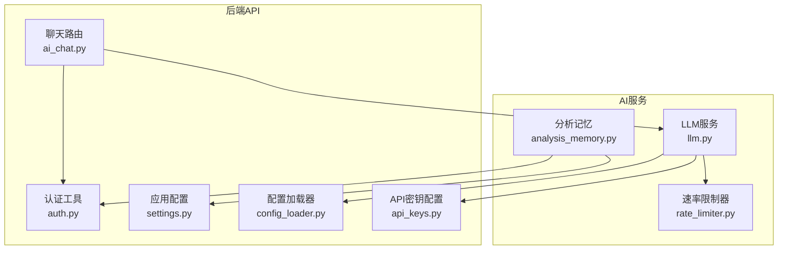
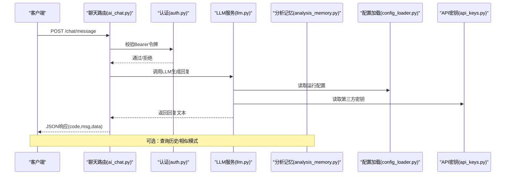
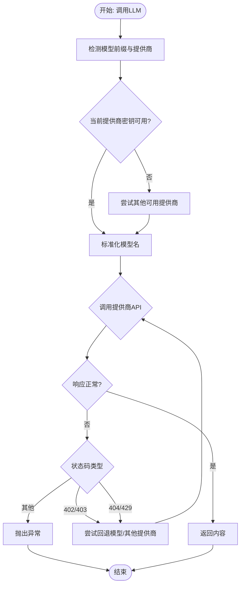
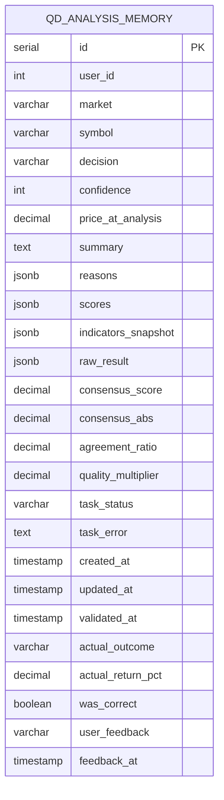
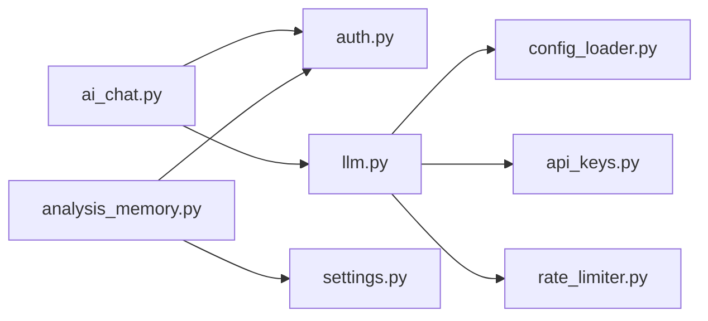

# AI聊天接口

<cite>
**本文引用的文件**
- [ai_chat.py](file://backend_api_python/app/route/ai_chat.py)
- [llm.py](file://backend_api_python/app/services/llm.py)
- [auth.py](file://backend_api_python/app/utils/auth.py)
- [settings.py](file://backend_api_python/app/config/settings.py)
- [api_keys.py](file://backend_api_python/app/config/api_keys.py)
- [config_loader.py](file://backend_api_python/app/utils/config_loader.py)
- [analysis_memory.py](file://backend_api_python/app/services/analysis_memory.py)
- [rate_limiter.py](file://backend_api_python/app/data_sources/rate_limiter.py)
- [logger.py](file://backend_api_python/app/utils/logger.py)
</cite>

## 目录
1. [简介](#简介)
2. [项目结构](#项目结构)
3. [核心组件](#核心组件)
4. [架构总览](#架构总览)
5. [详细组件分析](#详细组件分析)
6. [依赖分析](#依赖分析)
7. [性能考量](#性能考量)
8. [故障排除指南](#故障排除指南)
9. [结论](#结论)
10. [附录](#附录)

## 简介
本文件面向AI聊天接口的使用者与开发者，系统性地梳理后端API的REST接口设计、认证机制、消息格式、上下文与历史管理、错误处理策略，并结合现有LLM服务与分析记忆能力，给出可操作的实现指南与最佳实践。当前仓库中的聊天API路由处于兼容层状态，核心AI能力通过独立的LLM服务与分析记忆系统提供；本文将明确这些能力如何协同工作，以及如何扩展以满足策略开发与市场分析场景。

## 项目结构
- 聊天API路由位于后端蓝图中，当前提供兼容性占位接口，实际对话逻辑由LLM服务与分析记忆系统承担。
- 认证采用基于JWT的Bearer令牌，支持多角色访问控制。
- LLM服务统一抽象多家大模型提供商，具备自动探测、回退与错误提示能力。
- 分析记忆系统负责历史分析结果的持久化、相似模式检索与校准统计，为AI聊天提供上下文与学习基础。
- 配置体系通过环境变量与附加配置加载器统一管理，支持运行时热更新。

图表来源
- [ai_chat.py:1-47](file://backend_api_python/app/route/ai_chat.py#L1-L47)
- [auth.py:1-239](file://backend_api_python/app/utils/auth.py#L1-L239)
- [settings.py:1-99](file://backend_api_python/app/config/settings.py#L1-L99)
- [config_loader.py:1-251](file://backend_api_python/app/utils/config_loader.py#L1-L251)
- [api_keys.py:1-184](file://backend_api_python/app/config/api_keys.py#L1-L184)
- [llm.py:1-629](file://backend_api_python/app/services/llm.py#L1-L629)
- [analysis_memory.py:1-957](file://backend_api_python/app/services/analysis_memory.py#L1-L957)
- [rate_limiter.py:1-273](file://backend_api_python/app/data_sources/rate_limiter.py#L1-L273)

章节来源
- [ai_chat.py:1-47](file://backend_api_python/app/route/ai_chat.py#L1-L47)
- [auth.py:1-239](file://backend_api_python/app/utils/auth.py#L1-L239)
- [settings.py:1-99](file://backend_api_python/app/config/settings.py#L1-L99)
- [config_loader.py:1-251](file://backend_api_python/app/utils/config_loader.py#L1-L251)
- [api_keys.py:1-184](file://backend_api_python/app/config/api_keys.py#L1-L184)
- [llm.py:1-629](file://backend_api_python/app/services/llm.py#L1-L629)
- [analysis_memory.py:1-957](file://backend_api_python/app/services/analysis_memory.py#L1-L957)
- [rate_limiter.py:1-273](file://backend_api_python/app/data_sources/rate_limiter.py#L1-L273)

## 核心组件
- REST聊天路由：提供兼容性占位接口，当前返回友好提示而非404，便于前端渐进式演进。
- 认证与授权：基于Bearer令牌的JWT认证，支持管理员/经理/用户等角色，提供装饰器级中间件。
- LLM服务：统一抽象多家大模型提供商，支持自动探测、回退、超时与错误提示，适配JSON输出模式。
- 分析记忆：持久化分析决策与指标快照，支持相似模式检索与校准统计，为AI聊天提供上下文与学习基础。
- 配置与密钥：集中管理第三方API密钥与运行参数，支持环境变量与附加配置映射。
- 日志与速率限制：统一日志配置与通用速率限制策略，保障稳定性与合规性。

章节来源
- [ai_chat.py:15-44](file://backend_api_python/app/route/ai_chat.py#L15-L44)
- [auth.py:126-186](file://backend_api_python/app/utils/auth.py#L126-L186)
- [llm.py:70-562](file://backend_api_python/app/services/llm.py#L70-L562)
- [analysis_memory.py:36-174](file://backend_api_python/app/services/analysis_memory.py#L36-L174)
- [config_loader.py:24-161](file://backend_api_python/app/utils/config_loader.py#L24-L161)
- [api_keys.py:54-141](file://backend_api_python/app/config/api_keys.py#L54-L141)
- [logger.py:9-63](file://backend_api_python/app/utils/logger.py#L9-L63)
- [rate_limiter.py:109-164](file://backend_api_python/app/data_sources/rate_limiter.py#L109-L164)

## 架构总览
AI聊天接口的请求流从路由进入，经过认证与授权，再调用LLM服务生成回复；同时可结合分析记忆系统提供上下文与历史参考。配置与密钥通过加载器与密钥类统一注入，日志与速率限制贯穿各环节。

图表来源
- [ai_chat.py:15-32](file://backend_api_python/app/route/ai_chat.py#L15-L32)
- [auth.py:126-157](file://backend_api_python/app/utils/auth.py#L126-L157)
- [llm.py:368-525](file://backend_api_python/app/services/llm.py#L368-L525)
- [analysis_memory.py:236-291](file://backend_api_python/app/services/analysis_memory.py#L236-L291)
- [config_loader.py:24-161](file://backend_api_python/app/utils/config_loader.py#L24-L161)
- [api_keys.py:54-141](file://backend_api_python/app/config/api_keys.py#L54-L141)

## 详细组件分析

### REST API定义与消息格式
- 路由与方法
  - POST /chat/message：兼容性占位接口，返回成功与回显消息；当前未接入真实LLM。
  - GET /chat/history：返回空历史列表（兼容性占位）。
  - POST /chat/history/save：保存历史占位（兼容性占位）。
- 请求/响应模式
  - 统一返回结构：{ "code": 数字, "msg": 文本, "data": 任意 }
  - 成功：code=1；失败：code≠1并携带错误信息。
- 认证方式
  - Authorization: Bearer <token>；401/403分别表示缺少令牌、令牌无效/过期、权限不足。
- 版本信息
  - 应用版本：2.0.0（来自配置）。

章节来源
- [ai_chat.py:15-44](file://backend_api_python/app/route/ai_chat.py#L15-L44)
- [auth.py:126-157](file://backend_api_python/app/utils/auth.py#L126-L157)
- [settings.py:27-28](file://backend_api_python/app/config/settings.py#L27-L28)

### LLM服务与消息处理
- 支持的提供商与默认模型
  - OpenRouter、OpenAI、Google Gemini、DeepSeek、Grok、Custom(OpenAI兼容)、MiniMax。
- 模型解析与提供商选择
  - 自动检测：根据模型前缀映射到对应提供商；若当前提供商无可用密钥，则按优先级尝试其他提供商。
  - 默认模型与回退模型：不同提供商配置默认与回退模型名。
- 调用流程
  - 构造消息数组（role/content），按提供商格式转换（如Gemini需contents/systemInstruction）。
  - 发送请求，处理非2xx状态码与空内容等异常，提供针对性错误提示。
  - 支持JSON输出模式与温度参数，适配分析类任务。
- 错误处理
  - 402/403：API密钥问题或余额不足，建议检查密钥与账户状态。
  - 404/429：模型不可用或限流，尝试回退模型与其他提供商。
- 性能与超时
  - 各提供商可通过配置设置超时；回退策略降低单点故障风险。

图表来源
- [llm.py:368-525](file://backend_api_python/app/services/llm.py#L368-L525)
- [llm.py:467-478](file://backend_api_python/app/services/llm.py#L467-L478)
- [llm.py:480-511](file://backend_api_python/app/services/llm.py#L480-L511)

章节来源
- [llm.py:19-67](file://backend_api_python/app/services/llm.py#L19-L67)
- [llm.py:368-525](file://backend_api_python/app/services/llm.py#L368-L525)
- [llm.py:526-562](file://backend_api_python/app/services/llm.py#L526-L562)

### 认证与授权
- 令牌生成与验证
  - 生成：包含用户ID、用户名、角色、token版本与过期时间。
  - 验证：解码JWT，校验过期与token版本一致性（数据库中当前版本匹配）。
- 角色与权限
  - 支持admin/manager/user/viewer角色；提供装饰器@login_required、@admin_required、@manager_required与@permission_required。
- 单用户模式
  - 旧版单用户兼容：通过环境变量读取管理员凭据进行认证（生产环境不推荐）。

章节来源
- [auth.py:18-114](file://backend_api_python/app/utils/auth.py#L18-L114)
- [auth.py:126-217](file://backend_api_python/app/utils/auth.py#L126-L217)
- [auth.py:220-239](file://backend_api_python/app/utils/auth.py#L220-L239)

### 分析记忆与上下文管理
- 数据模型
  - 存储字段：用户ID、市场/标的、决策、置信度、价格、摘要、原因、评分、指标快照、原始结果、共识统计、任务状态/错误、反馈等。
  - 索引：按市场/标的、创建时间、验证时间、用户ID建立索引。
- 能力
  - 存储：将分析结果持久化，支持后续检索与校准。
  - 查询：按标的最近历史、分页查询全部历史、删除记录。
  - 相似模式：基于RSI/MACD/均线/波动率等指标加权相似度匹配，偏好近期且正确的历史。
  - 校准：与实际价格变动对比，计算准确率与收益回报，形成学习数据。
- 与聊天集成
  - 可在生成回复前检索相似历史，作为上下文增强；或在用户反馈后更新记忆，提升后续回复质量。

图表来源
- [analysis_memory.py:52-174](file://backend_api_python/app/services/analysis_memory.py#L52-L174)

章节来源
- [analysis_memory.py:175-291](file://backend_api_python/app/services/analysis_memory.py#L175-L291)
- [analysis_memory.py:293-368](file://backend_api_python/app/services/analysis_memory.py#L293-L368)
- [analysis_memory.py:513-584](file://backend_api_python/app/services/analysis_memory.py#L513-L584)
- [analysis_memory.py:609-701](file://backend_api_python/app/services/analysis_memory.py#L609-L701)

### 配置与密钥管理
- 配置加载
  - 从环境变量与附加配置映射为嵌套结构，覆盖LLM提供商、应用运行参数、数据源等。
  - 提供缓存与类型转换，支持整数/浮点/布尔/JSON等类型。
- API密钥
  - 统一通过类属性读取，优先环境变量，其次附加配置；支持多提供商密钥与自定义OpenAI兼容端点。
- 应用配置
  - 主机、端口、调试、版本、日志、速率限制、功能开关等。

章节来源
- [config_loader.py:24-161](file://backend_api_python/app/utils/config_loader.py#L24-L161)
- [api_keys.py:54-141](file://backend_api_python/app/config/api_keys.py#L54-L141)
- [settings.py:11-91](file://backend_api_python/app/config/settings.py#L11-L91)

### 日志与速率限制
- 日志
  - 统一日志级别与文件轮转，过滤无关噪声，确保关键模块可见性。
- 速率限制
  - 通用限流器支持最小间隔与抖动，指数退避重试装饰器用于网络请求稳定性。

章节来源
- [logger.py:9-63](file://backend_api_python/app/utils/logger.py#L9-L63)
- [rate_limiter.py:109-231](file://backend_api_python/app/data_sources/rate_limiter.py#L109-L231)

## 依赖分析
- 路由依赖认证与LLM服务；LLM服务依赖配置加载器与API密钥类；分析记忆依赖数据库连接与配置；日志与速率限制贯穿各模块。
- 当前聊天路由为兼容层，未直接依赖LLM服务；实际聊天应在上层业务中调用LLM服务并结合分析记忆。

图表来源
- [ai_chat.py:6-12](file://backend_api_python/app/route/ai_chat.py#L6-L12)
- [auth.py:11-13](file://backend_api_python/app/utils/auth.py#L11-L13)
- [llm.py:12-14](file://backend_api_python/app/services/llm.py#L12-L14)
- [config_loader.py:16-18](file://backend_api_python/app/utils/config_loader.py#L16-L18)
- [api_keys.py:5-6](file://backend_api_python/app/config/api_keys.py#L5-L6)
- [rate_limiter.py:15-19](file://backend_api_python/app/data_sources/rate_limiter.py#L15-L19)
- [analysis_memory.py:16-17](file://backend_api_python/app/services/analysis_memory.py#L16-L17)

章节来源
- [ai_chat.py:6-12](file://backend_api_python/app/route/ai_chat.py#L6-L12)
- [llm.py:12-14](file://backend_api_python/app/services/llm.py#L12-L14)
- [analysis_memory.py:16-17](file://backend_api_python/app/services/analysis_memory.py#L16-L17)

## 性能考量
- LLM调用
  - 合理设置温度与超时，启用回退模型与替代提供商，避免单点失败。
  - 对于分析类任务，建议使用JSON输出模式以提高解析稳定性。
- 速率限制
  - 在上游数据源与LLM提供商处均实施限流与退避策略，避免触发429与403。
- 日志与监控
  - 统一日志级别与文件轮转，便于定位性能瓶颈与异常。
- 缓存与功能开关
  - 通过配置控制缓存与请求日志开关，平衡可观测性与性能。

## 故障排除指南
- 认证失败
  - 401：检查Authorization头格式与令牌有效性；确认token版本与数据库一致。
  - 403：检查角色权限或具体权限标识。
- LLM调用失败
  - 402/403：检查对应提供商API密钥配置与账户状态；查看服务端错误提示。
  - 404：模型不可用或无权限，切换回退模型或更换提供商。
  - 429：触发限流，等待后重试或调整请求频率。
- 聊天接口
  - 当前占位接口返回成功但提示“本地模式未实现”，需在上层业务中接入LLM服务。

章节来源
- [auth.py:143-157](file://backend_api_python/app/utils/auth.py#L143-L157)
- [llm.py:210-238](file://backend_api_python/app/services/llm.py#L210-L238)
- [llm.py:480-511](file://backend_api_python/app/services/llm.py#L480-L511)
- [ai_chat.py:23-32](file://backend_api_python/app/route/ai_chat.py#L23-L32)

## 结论
AI聊天接口当前以兼容层形式存在，核心AI能力由LLM服务与分析记忆系统提供。通过统一的认证、配置与日志体系，系统具备良好的扩展性与稳定性。建议在上层业务中直接调用LLM服务并结合分析记忆，以实现更丰富的聊天体验与策略开发支持。

## 附录

### 常见用例与实现要点
- 策略开发辅助
  - 使用LLM服务生成策略描述或代码草稿，结合分析记忆的历史相似模式与校准统计，提升策略可信度。
- 市场分析问答
  - 将市场新闻、经济事件与技术指标整合为系统提示，利用LLM服务生成解读与建议。
- 会话与上下文
  - 在业务层维护用户会话，结合分析记忆检索最近历史，作为上下文增强回复质量。

### 安全与合规
- 令牌安全
  - 仅在受信环境中使用单用户模式；生产环境严格使用JWT与角色控制。
- 传输安全
  - 建议在反向代理层启用HTTPS与CORS策略，限制跨域访问。
- 限额与审计
  - 结合应用级速率限制与上游提供商限额，配合审计日志追踪调用。

### 性能优化技巧
- 合理选择模型与温度，减少不必要的长文本生成。
- 使用回退模型与替代提供商，提升成功率与稳定性。
- 控制日志级别与文件轮转，避免I/O成为瓶颈。
- 对高频请求实施本地限流与指数退避，降低上游压力。