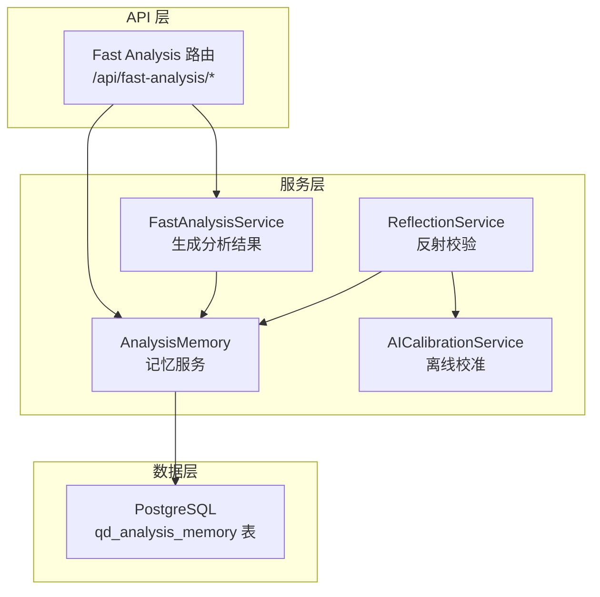
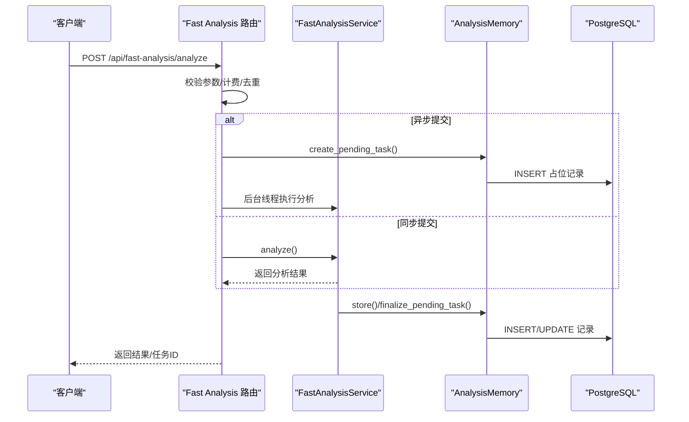
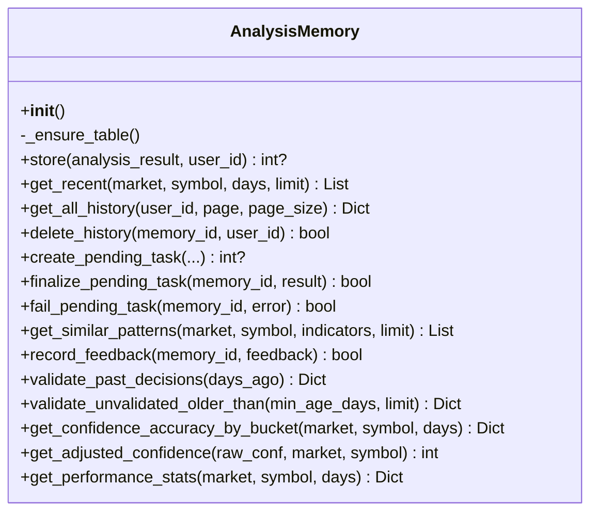
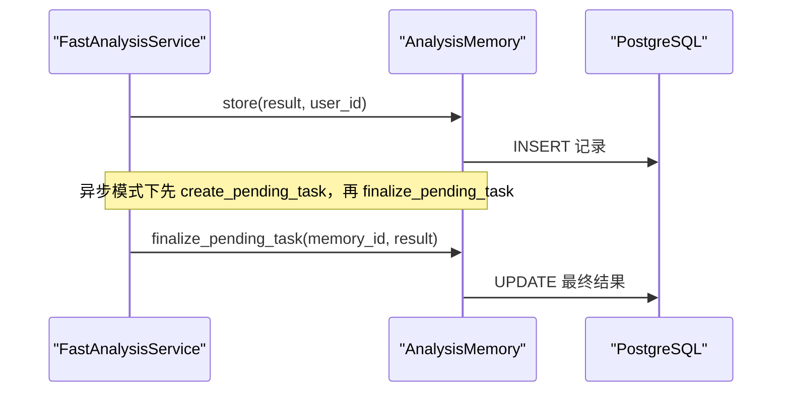
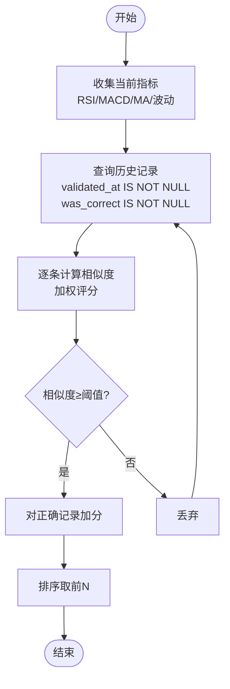
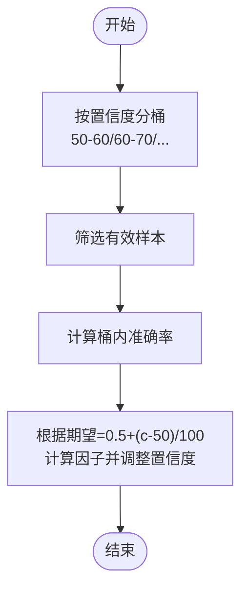
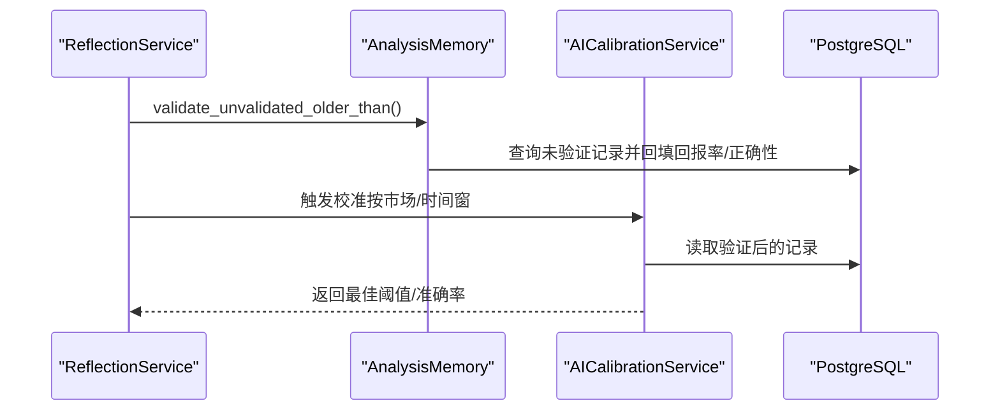
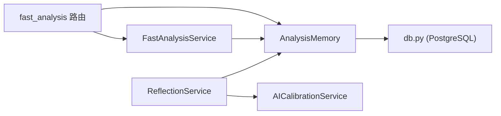
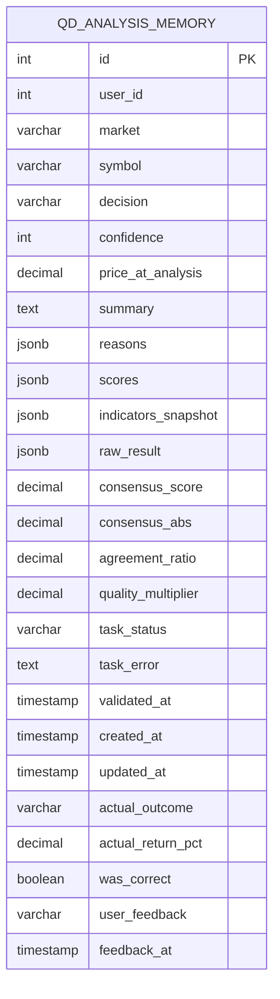

# 分析记忆系统

<cite>
**本文引用的文件**   
- [analysis_memory.py](file://backend_api_python/app/services/analysis_memory.py)
- [fast_analysis.py](file://backend_api_python/app/services/fast_analysis.py)
- [fast_analysis 路由](file://backend_api_python/app/routes/fast_analysis.py)
- [db.py](file://backend_api_python/app/utils/db.py)
- [ai_calibration.py](file://backend_api_python/app/services/ai_calibration.py)
- [reflection.py](file://backend_api_python/app/services/reflection.py)
- [user 路由](file://backend_api_python/app/routes/user.py)
- [v3_1_0_agent_gateway.sql](file://backend_api_python/migrations/v3_1_0_agent_gateway.sql)
</cite>

## 目录
1. [简介](#简介)
2. [项目结构](#项目结构)
3. [核心组件](#核心组件)
4. [架构总览](#架构总览)
5. [详细组件分析](#详细组件分析)
6. [依赖分析](#依赖分析)
7. [性能考量](#性能考量)
8. [故障排查指南](#故障排查指南)
9. [结论](#结论)
10. [附录](#附录)

## 简介
本技术文档围绕“分析记忆系统”展开，系统目标是为快速分析服务提供可持久化的决策记忆、相似模式检索与学习闭环。系统通过 PostgreSQL 存储分析结果与历史记录，结合索引与批处理校验流程，实现：
- 历史分析记录的持久化与分页查询
- 决策结果的验证与准确性统计
- 基于技术指标的相似模式检索
- 用户反馈与性能统计
- 与策略开发、回测系统的数据共享与集成

## 项目结构
分析记忆系统主要由以下模块组成：
- 记忆服务：负责表结构确保、存储、检索、验证与统计
- 快速分析服务：负责生成分析结果并触发记忆存储
- Fast Analysis 路由：对外提供分析、历史、反馈、相似模式等接口
- 数据库工具：统一 PostgreSQL 连接与迁移
- 反射与校准：周期性验证历史决策并驱动模型校准
- 用户路由：统计用户维度的记忆使用情况

**图表来源**
- [fast_analysis 路由:113-311](file://backend_api_python/app/routes/fast_analysis.py#L113-L311)
- [fast_analysis.py:186-200](file://backend_api_python/app/services/fast_analysis.py#L186-L200)
- [analysis_memory.py:42-174](file://backend_api_python/app/services/analysis_memory.py#L42-L174)
- [reflection.py:22-48](file://backend_api_python/app/services/reflection.py#L22-L48)
- [ai_calibration.py:182-212](file://backend_api_python/app/services/ai_calibration.py#L182-L212)

**章节来源**
- [fast_analysis 路由:1-701](file://backend_api_python/app/routes/fast_analysis.py#L1-L701)
- [analysis_memory.py:1-957](file://backend_api_python/app/services/analysis_memory.py#L1-L957)
- [fast_analysis.py:1-200](file://backend_api_python/app/services/fast_analysis.py#L1-L200)
- [db.py:1-66](file://backend_api_python/app/utils/db.py#L1-L66)
- [reflection.py:1-101](file://backend_api_python/app/services/reflection.py#L1-L101)
- [ai_calibration.py:182-212](file://backend_api_python/app/services/ai_calibration.py#L182-L212)

## 核心组件
- AnalysisMemory：记忆服务核心类，负责表结构初始化、存储、检索、相似模式匹配、验证、统计与反馈记录
- FastAnalysisService：快速分析服务，负责数据采集、单次 LLM 分析与记忆存储触发
- Fast Analysis 路由：提供分析提交、历史查询、删除、反馈、相似模式、性能统计等 API
- ReflectionService/AICalibrationService：周期性验证历史决策并进行离线校准
- 数据库工具：统一 PostgreSQL 连接与迁移脚本

关键特性：
- JSONB 字段存储复杂结构（原因、评分、指标快照、原始结果）
- 多索引优化查询（按市场/符号、创建时间、验证时间、用户）
- 支持“待处理任务”占位与最终落库，避免重复存储
- 提供置信度校准与性能统计

**章节来源**
- [analysis_memory.py:36-174](file://backend_api_python/app/services/analysis_memory.py#L36-L174)
- [fast_analysis.py:186-200](file://backend_api_python/app/services/fast_analysis.py#L186-L200)
- [fast_analysis 路由:113-311](file://backend_api_python/app/routes/fast_analysis.py#L113-L311)
- [reflection.py:22-48](file://backend_api_python/app/services/reflection.py#L22-L48)
- [ai_calibration.py:182-212](file://backend_api_python/app/services/ai_calibration.py#L182-L212)

## 架构总览
下图展示从 API 请求到数据库写入与后续校验的端到端流程。

**图表来源**
- [fast_analysis 路由:113-311](file://backend_api_python/app/routes/fast_analysis.py#L113-L311)
- [analysis_memory.py:397-486](file://backend_api_python/app/services/analysis_memory.py#L397-L486)
- [fast_analysis.py:2611-2624](file://backend_api_python/app/services/fast_analysis.py#L2611-L2624)

## 详细组件分析

### AnalysisMemory 类设计
- 表结构与索引：自动创建/迁移表结构，确保必要列存在，并建立多维索引提升查询效率
- 存储与更新：支持完整插入与“待处理任务”占位后覆盖更新
- 查询能力：最近历史、分页全量历史、相似模式检索、反馈记录
- 验证与统计：基于价格变动验证决策正确性，计算准确率与性能指标
- 置信度校准：按置信度桶计算实际准确率并调整置信度

**图表来源**
- [analysis_memory.py:36-957](file://backend_api_python/app/services/analysis_memory.py#L36-L957)

**章节来源**
- [analysis_memory.py:42-174](file://backend_api_python/app/services/analysis_memory.py#L42-L174)
- [analysis_memory.py:175-235](file://backend_api_python/app/services/analysis_memory.py#L175-L235)
- [analysis_memory.py:236-368](file://backend_api_python/app/services/analysis_memory.py#L236-L368)
- [analysis_memory.py:370-396](file://backend_api_python/app/services/analysis_memory.py#L370-L396)
- [analysis_memory.py:397-486](file://backend_api_python/app/services/analysis_memory.py#L397-L486)
- [analysis_memory.py:488-512](file://backend_api_python/app/services/analysis_memory.py#L488-L512)
- [analysis_memory.py:513-584](file://backend_api_python/app/services/analysis_memory.py#L513-L584)
- [analysis_memory.py:586-607](file://backend_api_python/app/services/analysis_memory.py#L586-L607)
- [analysis_memory.py:609-701](file://backend_api_python/app/services/analysis_memory.py#L609-L701)
- [analysis_memory.py:703-783](file://backend_api_python/app/services/analysis_memory.py#L703-L783)
- [analysis_memory.py:785-827](file://backend_api_python/app/services/analysis_memory.py#L785-L827)
- [analysis_memory.py:829-853](file://backend_api_python/app/services/analysis_memory.py#L829-L853)
- [analysis_memory.py:855-933](file://backend_api_python/app/services/analysis_memory.py#L855-L933)
- [analysis_memory.py:935-957](file://backend_api_python/app/services/analysis_memory.py#L935-L957)

### FastAnalysisService 与记忆存储
- 在分析完成后调用记忆服务存储结果，或在异步模式下先创建“待处理任务”，再覆盖写入最终结果
- 避免重复存储同一分析记录

**图表来源**
- [fast_analysis.py:2611-2624](file://backend_api_python/app/services/fast_analysis.py#L2611-L2624)
- [analysis_memory.py:397-486](file://backend_api_python/app/services/analysis_memory.py#L397-L486)

**章节来源**
- [fast_analysis.py:2611-2624](file://backend_api_python/app/services/fast_analysis.py#L2611-L2624)
- [analysis_memory.py:397-486](file://backend_api_python/app/services/analysis_memory.py#L397-L486)

### 相似模式检索算法
- 输入当前指标（RSI、MACD、MA 趋势、波动等级）
- 从历史记录中筛选已验证且有结果的记录
- 计算加权相似度（RSI 范围、MACD 精确匹配、MA 趋势精确匹配、波动等级相近带）
- 可对正确的历史记录给予额外权重
- 排序返回前 N 条相似记录

**图表来源**
- [analysis_memory.py:513-584](file://backend_api_python/app/services/analysis_memory.py#L513-L584)

**章节来源**
- [analysis_memory.py:513-584](file://backend_api_python/app/services/analysis_memory.py#L513-L584)

### 性能统计与置信度校准
- 统计维度：总分析数、准确率、平均回报率、决策分布、用户满意度
- 置信度校准：按置信度桶计算期望与实际准确率比值，动态调整置信度

**图表来源**
- [analysis_memory.py:785-827](file://backend_api_python/app/services/analysis_memory.py#L785-L827)
- [analysis_memory.py:829-853](file://backend_api_python/app/services/analysis_memory.py#L829-L853)

**章节来源**
- [analysis_memory.py:855-933](file://backend_api_python/app/services/analysis_memory.py#L855-L933)
- [analysis_memory.py:829-853](file://backend_api_python/app/services/analysis_memory.py#L829-L853)

### 反射校验与离线校准
- 反射服务周期性验证历史未验证记录，计算准确率并触发离线校准
- 校准服务基于历史记录与共识指标进行模型参数优化

**图表来源**
- [reflection.py:22-75](file://backend_api_python/app/services/reflection.py#L22-L75)
- [ai_calibration.py:182-212](file://backend_api_python/app/services/ai_calibration.py#L182-L212)
- [analysis_memory.py:703-783](file://backend_api_python/app/services/analysis_memory.py#L703-L783)

**章节来源**
- [reflection.py:22-75](file://backend_api_python/app/services/reflection.py#L22-L75)
- [ai_calibration.py:182-212](file://backend_api_python/app/services/ai_calibration.py#L182-L212)
- [analysis_memory.py:703-783](file://backend_api_python/app/services/analysis_memory.py#L703-L783)

## 依赖分析
- AnalysisMemory 依赖数据库工具提供的连接与事务封装
- FastAnalysisService 依赖 LLM 服务与市场数据采集器，并调用 AnalysisMemory
- Fast Analysis 路由依赖 FastAnalysisService 与 AnalysisMemory，并处理鉴权与计费
- 反射与校准服务依赖 AnalysisMemory 的验证与统计接口

**图表来源**
- [fast_analysis 路由:113-311](file://backend_api_python/app/routes/fast_analysis.py#L113-L311)
- [fast_analysis.py:186-200](file://backend_api_python/app/services/fast_analysis.py#L186-L200)
- [analysis_memory.py:42-174](file://backend_api_python/app/services/analysis_memory.py#L42-L174)
- [reflection.py:22-48](file://backend_api_python/app/services/reflection.py#L22-L48)
- [ai_calibration.py:182-212](file://backend_api_python/app/services/ai_calibration.py#L182-L212)
- [db.py:1-66](file://backend_api_python/app/utils/db.py#L1-L66)

**章节来源**
- [fast_analysis 路由:1-701](file://backend_api_python/app/routes/fast_analysis.py#L1-L701)
- [analysis_memory.py:1-957](file://backend_api_python/app/services/analysis_memory.py#L1-L957)
- [fast_analysis.py:1-200](file://backend_api_python/app/services/fast_analysis.py#L1-L200)
- [reflection.py:1-101](file://backend_api_python/app/services/reflection.py#L1-L101)
- [ai_calibration.py:182-212](file://backend_api_python/app/services/ai_calibration.py#L182-L212)
- [db.py:1-66](file://backend_api_python/app/utils/db.py#L1-L66)

## 性能考量
- 索引优化
  - 复合索引：(market, symbol) 用于按标的检索
  - 时间索引：created_at DESC 用于最近记录与分页
  - 验证过滤索引：validated_at 非空过滤
  - 用户索引：user_id 限制用户可见范围
- 查询限制
  - 相似模式检索限制扫描上限并按时间倒序优先
  - 分页查询限制每页最大数量
- 异步处理
  - 异步提交先写“待处理任务”，后台线程完成分析并覆盖写入，避免阻塞请求
- 缓存与内存
  - 路由层使用内存去重锁避免重复计费与重复分析
- 数据类型
  - JSONB 字段支持灵活扩展，但需注意查询时的索引利用与序列化成本

**章节来源**
- [analysis_memory.py:154-167](file://backend_api_python/app/services/analysis_memory.py#L154-L167)
- [fast_analysis 路由:20-111](file://backend_api_python/app/routes/fast_analysis.py#L20-L111)
- [analysis_memory.py:236-288](file://backend_api_python/app/services/analysis_memory.py#L236-L288)
- [analysis_memory.py:293-368](file://backend_api_python/app/services/analysis_memory.py#L293-L368)

## 故障排查指南
- 记忆表创建失败
  - 检查数据库连接与权限，确认 PostgreSQL 可用
  - 查看日志中的警告信息，确认迁移是否成功
- 存储失败
  - 检查 JSON 序列化是否异常，确认字段类型与长度
  - 关注异常堆栈定位具体 SQL
- 查询无结果
  - 确认 market/symbol 是否正确
  - 检查索引是否存在，必要时重建索引
- 相似模式为空
  - 当前指标是否为空或异常
  - 适当放宽相似度阈值或扩大扫描上限
- 反射校验不生效
  - 检查环境变量 ENABLE_REFLECTION_WORKER、REFLECTION_WORKER_INTERVAL_SEC
  - 确认 validate_unvalidated_older_than 的扫描范围与数量限制

**章节来源**
- [analysis_memory.py:172-173](file://backend_api_python/app/services/analysis_memory.py#L172-L173)
- [analysis_memory.py:232-234](file://backend_api_python/app/services/analysis_memory.py#L232-L234)
- [analysis_memory.py:289-291](file://backend_api_python/app/services/analysis_memory.py#L289-L291)
- [analysis_memory.py:582-584](file://backend_api_python/app/services/analysis_memory.py#L582-L584)
- [reflection.py:77-101](file://backend_api_python/app/services/reflection.py#L77-L101)

## 结论
分析记忆系统通过 PostgreSQL 的 JSONB 字段与多维索引，实现了高扩展性的分析历史存储与高效检索；结合相似模式匹配、性能统计与置信度校准，构建了从“决策—验证—学习”的闭环。异步处理与内存去重锁提升了用户体验与系统稳定性。建议在生产环境中持续监控索引命中率、查询延迟与反射校验的吞吐，按业务增长动态调整扫描上限与校准频率。

## 附录

### API 一览（与记忆相关）
- POST /api/fast-analysis/analyze：提交分析请求（同步/异步）
- GET /api/fast-analysis/history：按标的查询最近历史
- GET /api/fast-analysis/history/all：分页查询全部历史
- DELETE /api/fast-analysis/history/{id}：删除个人历史
- POST /api/fast-analysis/feedback：提交用户反馈
- GET /api/fast-analysis/performance：获取性能统计
- GET /api/fast-analysis/similar-patterns：获取相似模式

**章节来源**
- [fast_analysis 路由:113-701](file://backend_api_python/app/routes/fast_analysis.py#L113-L701)

### 数据模型（简化）

**图表来源**
- [analysis_memory.py:52-81](file://backend_api_python/app/services/analysis_memory.py#L52-L81)

### 迁移与索引
- 初始化与增强：迁移脚本确保表结构与索引存在
- 索引策略：按查询场景建立复合索引与过滤索引

**章节来源**
- [v3_1_0_agent_gateway.sql:1-93](file://backend_api_python/migrations/v3_1_0_agent_gateway.sql#L1-L93)
- [analysis_memory.py:154-167](file://backend_api_python/app/services/analysis_memory.py#L154-L167)