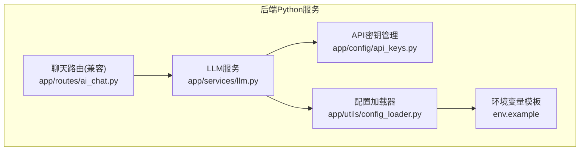
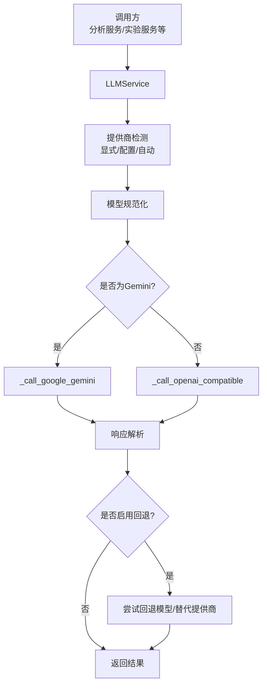
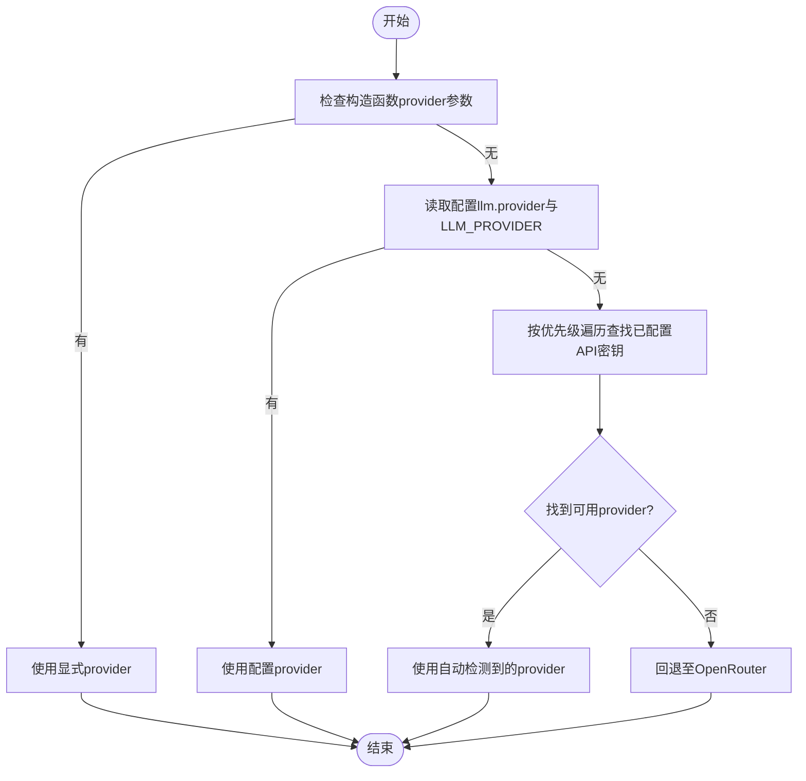
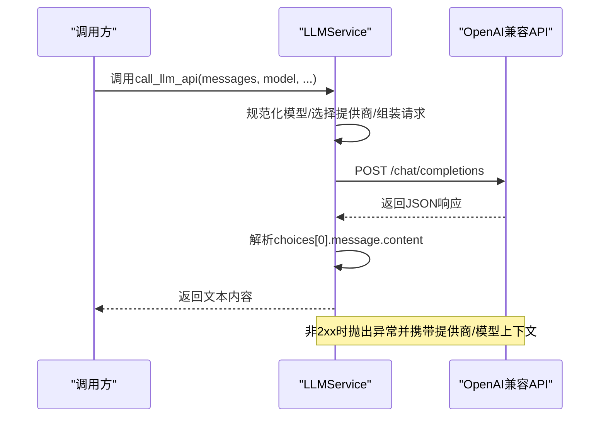
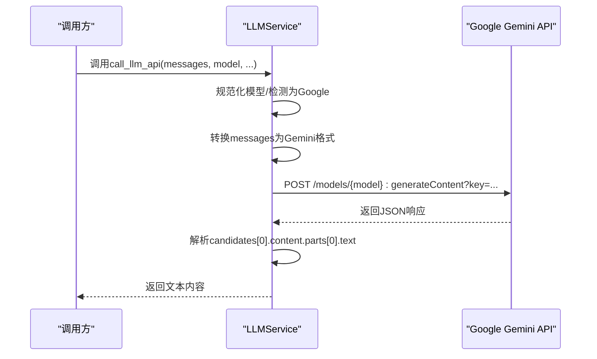
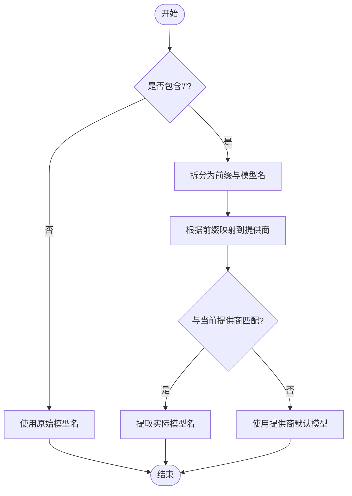
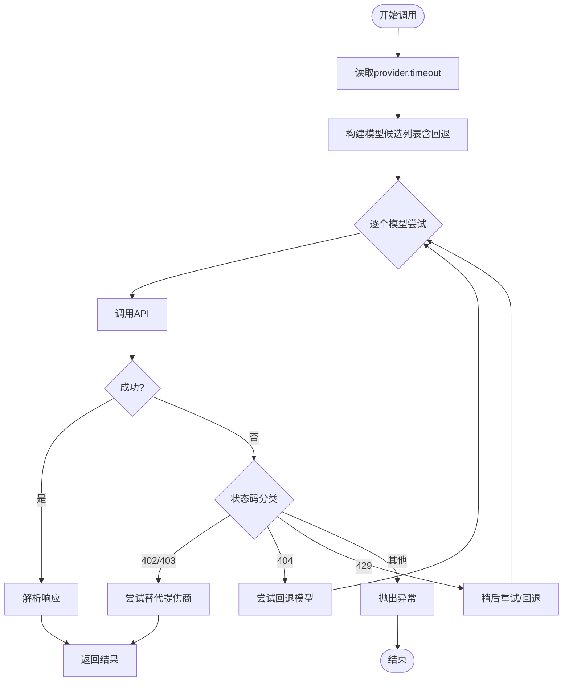
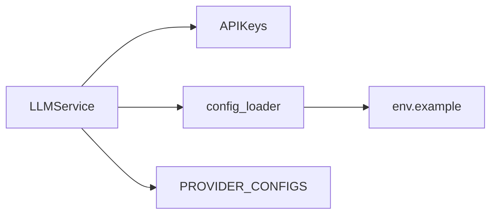

# 多LLM提供商集成

<cite>
**本文引用的文件**
- [llm.py](file://backend_api_python/app/services/llm.py)
- [api_keys.py](file://backend_api_python/app/config/api_keys.py)
- [config_loader.py](file://backend_api_python/app/utils/config_loader.py)
- [settings.py](file://backend_api_python/app/config/settings.py)
- [env.example](file://backend_api_python/env.example)
- [ai_chat.py](file://backend_api_python/app/routes/ai_chat.py)
</cite>

## 目录
1. [简介](#简介)
2. [项目结构](#项目结构)
3. [核心组件](#核心组件)
4. [架构总览](#架构总览)
5. [详细组件分析](#详细组件分析)
6. [依赖关系分析](#依赖关系分析)
7. [性能考量](#性能考量)
8. [故障排查指南](#故障排查指南)
9. [结论](#结论)
10. [附录](#附录)

## 简介
本文件面向多LLM提供商集成模块，系统性阐述OpenRouter、OpenAI、Google Gemini、DeepSeek、Grok、Custom（OpenAI兼容）、MiniMax七种LLM提供商的集成架构与配置方法。重点覆盖以下方面：
- 各提供商的API端点、默认模型、认证方式与特殊配置要求
- 提供商自动检测机制、优先级排序与故障转移策略
- OpenAI兼容API的统一接口封装、消息格式转换与响应解析
- 环境变量配置示例、API密钥管理与错误处理机制
- 提供商切换、模型名称规范化与超时配置的实现细节

该模块以独立服务形式存在，避免与其他业务模块产生循环依赖，便于在分析服务等场景中复用。

## 项目结构
多LLM提供商集成位于后端Python服务的“services”目录下，核心文件如下：
- LLM服务实现：backend_api_python/app/services/llm.py
- API密钥集中管理：backend_api_python/app/config/api_keys.py
- 配置加载器（含环境变量映射）：backend_api_python/app/utils/config_loader.py
- 应用主配置（非LLM专用）：backend_api_python/app/config/settings.py
- 环境变量模板示例：backend_api_python/env.example
- 聊天路由（兼容层）：backend_api_python/app/routes/ai_chat.py

图表来源
- [llm.py:1-629](file://backend_api_python/app/services/llm.py#L1-L629)
- [api_keys.py:1-184](file://backend_api_python/app/config/api_keys.py#L1-L184)
- [config_loader.py:1-251](file://backend_api_python/app/utils/config_loader.py#L1-L251)
- [env.example:1-319](file://backend_api_python/env.example#L1-L319)
- [ai_chat.py:1-47](file://backend_api_python/app/routes/ai_chat.py#L1-L47)

章节来源
- [llm.py:1-629](file://backend_api_python/app/services/llm.py#L1-L629)
- [api_keys.py:1-184](file://backend_api_python/app/config/api_keys.py#L1-L184)
- [config_loader.py:1-251](file://backend_api_python/app/utils/config_loader.py#L1-L251)
- [env.example:1-319](file://backend_api_python/env.example#L1-L319)
- [ai_chat.py:1-47](file://backend_api_python/app/routes/ai_chat.py#L1-L47)

## 核心组件
- LLMProvider枚举：定义支持的七种提供商（openrouter、openai、google、deepseek、grok、custom、minimax）
- PROVIDER_CONFIGS：内置各提供商的基础URL、默认模型与回退模型
- LLMService：统一的LLM调用封装，负责提供商选择、模型规范化、请求发送、响应解析与错误处理
- APIKeys：集中读取各提供商API密钥与自定义端点信息
- config_loader：将环境变量映射为嵌套配置字典，支持LLM相关键位

关键职责与交互：
- 提供商选择：显式指定 > 环境/配置 > 自动检测（按优先级）
- 模型规范化：将前端传入的OpenRouter风格模型名转换为对应提供商的原生模型名
- 统一接口：OpenAI兼容API通过同一通道调用，Gemini采用专用通道
- 故障转移：针对402/403/404/429等状态码进行回退模型与替代提供商尝试
- 错误提示：结合提供商特性给出可操作的诊断信息

章节来源
- [llm.py:19-67](file://backend_api_python/app/services/llm.py#L19-L67)
- [llm.py:70-122](file://backend_api_python/app/services/llm.py#L70-L122)
- [llm.py:123-136](file://backend_api_python/app/services/llm.py#L123-L136)
- [llm.py:138-166](file://backend_api_python/app/services/llm.py#L138-L166)
- [llm.py:168-173](file://backend_api_python/app/services/llm.py#L168-L173)
- [api_keys.py:54-141](file://backend_api_python/app/config/api_keys.py#L54-L141)
- [config_loader.py:60-147](file://backend_api_python/app/utils/config_loader.py#L60-L147)

## 架构总览
多LLM提供商集成采用“统一服务 + 分层配置”的架构设计：
- 统一服务层：LLMService封装所有提供商调用逻辑
- 配置管理层：APIKeys与config_loader分别负责密钥与环境变量映射
- 适配层：OpenAI兼容API与Gemini专用通道
- 降级与转移：回退模型与替代提供商策略

图表来源
- [llm.py:368-525](file://backend_api_python/app/services/llm.py#L368-L525)
- [llm.py:467-478](file://backend_api_python/app/services/llm.py#L467-L478)
- [llm.py:526-562](file://backend_api_python/app/services/llm.py#L526-L562)

## 详细组件分析

### LLMProvider与PROVIDER_CONFIGS
- LLMProvider枚举定义七种提供商标识
- PROVIDER_CONFIGS提供基础URL、默认模型与回退模型，部分提供商（如CUSTOM）允许通过环境变量或配置覆盖

章节来源
- [llm.py:19-28](file://backend_api_python/app/services/llm.py#L19-L28)
- [llm.py:31-67](file://backend_api_python/app/services/llm.py#L31-L67)

### 提供商自动检测与优先级
- 显式选择：优先使用用户显式配置的LLM_PROVIDER或构造函数provider参数
- 环境/配置：读取addon配置中的llm.provider与环境变量LLM_PROVIDER
- 自动检测：按DeepSeek > Grok > MiniMax > OpenAI > Google > OpenRouter顺序查找已配置API密钥的提供商
- 未配置时回退至OpenRouter

图表来源
- [llm.py:82-121](file://backend_api_python/app/services/llm.py#L82-L121)

章节来源
- [llm.py:82-121](file://backend_api_python/app/services/llm.py#L82-L121)

### OpenAI兼容API统一封装
- 统一端点：/chat/completions
- 认证方式：Authorization: Bearer {api_key}（若提供）
- 特殊头：OpenRouter额外设置HTTP-Referer与X-Title
- 请求体：model、messages、temperature；可选response_format=json_object
- 响应解析：提取choices[0].message.content，校验非空
- 错误处理：捕获HTTP错误与非2xx状态码，解析error.message并给出针对性提示（如OpenRouter 403/404）

图表来源
- [llm.py:184-248](file://backend_api_python/app/services/llm.py#L184-L248)

章节来源
- [llm.py:184-248](file://backend_api_python/app/services/llm.py#L184-L248)

### Google Gemini专用通道
- 端点：/models/{model}:generateContent?key={api_key}
- 消息格式转换：将OpenAI风格messages转换为Gemini contents与systemInstruction
- 响应解析：提取candidates[0].content.parts[0].text
- 生成配置：temperature与responseMimeType=application/json

图表来源
- [llm.py:249-294](file://backend_api_python/app/services/llm.py#L249-L294)

章节来源
- [llm.py:249-294](file://backend_api_python/app/services/llm.py#L249-L294)

### 模型名称规范化与提供商检测
- 规范化规则：
  - 若当前提供商为OPENROUTER，保留原始格式（如openai/gpt-4o）
  - 否则提取斜杠后的实际模型名；若前缀与当前提供商不匹配，则回退到提供商默认模型
- 模型前缀到提供商映射：openai→OPENAI、google→GOOGLE、deepseek→DEEPSEEK、x-ai/xai→GROK、minimax→MINIMAX
- 检测失败时使用默认模型，避免跨提供商发送不兼容模型名

图表来源
- [llm.py:295-342](file://backend_api_python/app/services/llm.py#L295-L342)
- [llm.py:344-366](file://backend_api_python/app/services/llm.py#L344-L366)

章节来源
- [llm.py:295-342](file://backend_api_python/app/services/llm.py#L295-L342)
- [llm.py:344-366](file://backend_api_python/app/services/llm.py#L344-L366)

### 超时与回退策略
- 超时配置：从addon配置读取provider.timeout（秒），默认120秒
- 回退模型：当use_fallback为真时，按PROVIDER_CONFIGS中的fallback_model尝试
- 状态码处理：
  - 402/403：通常为API密钥问题，尝试替代提供商
  - 404：模型不可用，尝试回退模型或替代提供商
  - 429：速率限制，可重试或回退
- 替代提供商优先级：DeepSeek > Grok > MiniMax > OpenAI > Google > OpenRouter

图表来源
- [llm.py:452-524](file://backend_api_python/app/services/llm.py#L452-L524)
- [llm.py:526-562](file://backend_api_python/app/services/llm.py#L526-L562)

章节来源
- [llm.py:452-524](file://backend_api_python/app/services/llm.py#L452-L524)
- [llm.py:526-562](file://backend_api_python/app/services/llm.py#L526-L562)

### API密钥管理与环境变量
- APIKeys集中读取各提供商密钥与自定义端点：
  - OPENROUTER_API_KEY、OPENAI_API_KEY、GOOGLE_API_KEY、DEEPSEEK_API_KEY、GROK_API_KEY、CUSTOM_API_KEY、CUSTOM_API_URL、CUSTOM_MODEL、MINIMAX_API_KEY
- config_loader将环境变量映射为嵌套配置键（如openrouter.api_key、openai.base_url等），并与.env示例保持一致

章节来源
- [api_keys.py:54-141](file://backend_api_python/app/config/api_keys.py#L54-L141)
- [config_loader.py:60-147](file://backend_api_python/app/utils/config_loader.py#L60-L147)
- [env.example:64-98](file://backend_api_python/env.example#L64-L98)

### 聊天路由兼容层
- 当前为兼容层，返回占位消息而非404，便于前端平滑过渡

章节来源
- [ai_chat.py:15-32](file://backend_api_python/app/routes/ai_chat.py#L15-L32)

## 依赖关系分析
- LLMService依赖APIKeys获取密钥、依赖config_loader读取配置与环境变量
- PROVIDER_CONFIGS提供基础URL与默认模型，作为回退与默认值来源
- config_loader与env.example共同定义了完整的环境变量键集

图表来源
- [llm.py:12-16](file://backend_api_python/app/services/llm.py#L12-L16)
- [llm.py:31-67](file://backend_api_python/app/services/llm.py#L31-L67)
- [config_loader.py:24-160](file://backend_api_python/app/utils/config_loader.py#L24-L160)
- [env.example:64-98](file://backend_api_python/env.example#L64-L98)

章节来源
- [llm.py:12-16](file://backend_api_python/app/services/llm.py#L12-L16)
- [llm.py:31-67](file://backend_api_python/app/services/llm.py#L31-L67)
- [config_loader.py:24-160](file://backend_api_python/app/utils/config_loader.py#L24-L160)
- [env.example:64-98](file://backend_api_python/env.example#L64-L98)

## 性能考量
- 超时控制：通过provider.timeout统一设置，避免长时间阻塞
- 回退策略：在模型不可用或额度不足时快速切换，提升成功率
- 连接复用：requests库默认复用连接，减少握手开销
- 配置缓存：config_loader对配置进行缓存，降低重复解析成本

## 故障排查指南
常见问题与定位要点：
- API密钥未配置或无效
  - 现象：403/402/401错误
  - 排查：确认对应环境变量或addon配置项是否正确；OpenRouter 403常因密钥无效/余额不足/无模型权限
- 模型不可用或无访问权限
  - 现象：404错误
  - 排查：检查模型名是否与提供商匹配；必要时使用回退模型或切换提供商
- 速率限制
  - 现象：429错误
  - 排查：适当增加provider.timeout或降低调用频率
- 响应为空或JSON解析失败
  - 现象：返回空内容或JSON解析异常
  - 排查：检查use_json_mode与提供商响应格式；必要时调整模型或请求参数
- 自定义端点未配置
  - 现象：CUSTOM模式报错
  - 排查：确保CUSTOM_API_URL指向OpenAI兼容端点根地址，本地Ollama通常无需API Key

章节来源
- [llm.py:210-238](file://backend_api_python/app/services/llm.py#L210-L238)
- [llm.py:480-524](file://backend_api_python/app/services/llm.py#L480-L524)
- [llm.py:441-445](file://backend_api_python/app/services/llm.py#L441-L445)

## 结论
该多LLM提供商集成模块通过统一服务封装、完善的配置与密钥管理、智能的提供商检测与故障转移策略，实现了对七种主流LLM的稳定接入。其设计兼顾易用性与可扩展性，既满足本地部署需求，又为未来新增提供商预留空间。

## 附录

### 各提供商配置清单与要点
- OpenRouter
  - 端点：https://openrouter.ai/api/v1/chat/completions
  - 默认模型：openai/gpt-4o
  - 回退模型：openai/gpt-4o-mini
  - 认证：OPENROUTER_API_KEY
  - 特殊：请求头包含HTTP-Referer与X-Title
- OpenAI
  - 端点：https://api.openai.com/v1/chat/completions
  - 默认模型：gpt-4o
  - 回退模型：gpt-4o-mini
  - 认证：OPENAI_API_KEY
  - 特殊：与OpenRouter共享统一通道
- Google Gemini
  - 端点：/models/{model}:generateContent?key={api_key}
  - 默认模型：gemini-1.5-flash
  - 认证：GOOGLE_API_KEY
  - 特殊：消息格式转换、responseMimeType=application/json
- DeepSeek
  - 端点：https://api.deepseek.com/v1/chat/completions
  - 默认模型：deepseek-chat
  - 认证：DEEPSEEK_API_KEY
  - 特殊：与OpenAI兼容通道
- Grok（xAI）
  - 端点：https://api.x.ai/v1/chat/completions
  - 默认模型：grok-beta
  - 认证：GROK_API_KEY
  - 特殊：与OpenAI兼容通道
- Custom（OpenAI兼容）
  - 端点：CUSTOM_API_URL（如http://host:port/v1）
  - 默认模型：CUSTOM_MODEL
  - 认证：CUSTOM_API_KEY（可为空，如本地Ollama）
  - 特殊：可通过CUSTOM_API_URL与CUSTOM_MODEL覆盖
- MiniMax
  - 端点：https://api.minimax.io/v1/chat/completions
  - 默认模型：MiniMax-M2.7
  - 回退模型：MiniMax-M2.7-highspeed
  - 认证：MINIMAX_API_KEY

章节来源
- [llm.py:31-67](file://backend_api_python/app/services/llm.py#L31-L67)
- [env.example:64-98](file://backend_api_python/env.example#L64-L98)
- [api_keys.py:54-141](file://backend_api_python/app/config/api_keys.py#L54-L141)

### 环境变量与配置示例
- LLM总体配置
  - LLM_PROVIDER：选择默认提供商（openrouter/openai/google/deepseek/grok/custom/minimax）
  - AI_CODE_GEN_MODEL：AI代码生成专用模型（可选）
- 各提供商键位（来自env.example与config_loader映射）
  - OPENROUTER_API_KEY、OPENROUTER_MODEL、OPENROUTER_TIMEOUT、OPENROUTER_BASE_URL
  - OPENAI_API_KEY、OPENAI_BASE_URL、OPENAI_MODEL
  - GOOGLE_API_KEY、GOOGLE_MODEL
  - DEEPSEEK_API_KEY、DEEPSEEK_BASE_URL、DEEPSEEK_MODEL
  - GROK_API_KEY、GROK_BASE_URL、GROK_MODEL
  - CUSTOM_API_KEY、CUSTOM_API_URL、CUSTOM_MODEL
  - MINIMAX_API_KEY、MINIMAX_BASE_URL、MINIMAX_MODEL

章节来源
- [env.example:64-98](file://backend_api_python/env.example#L64-L98)
- [config_loader.py:60-147](file://backend_api_python/app/utils/config_loader.py#L60-L147)