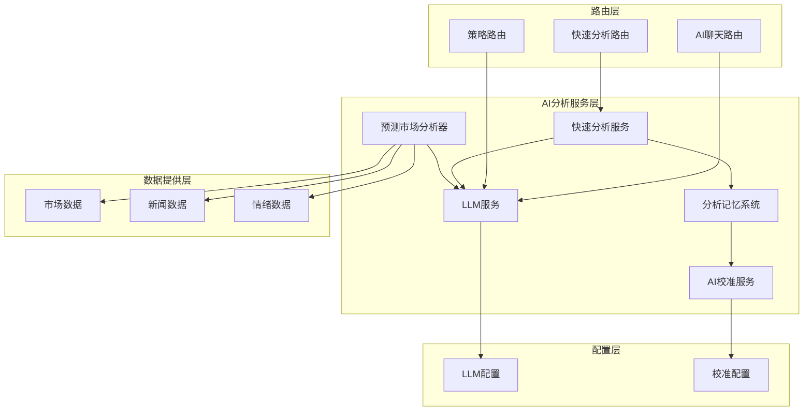
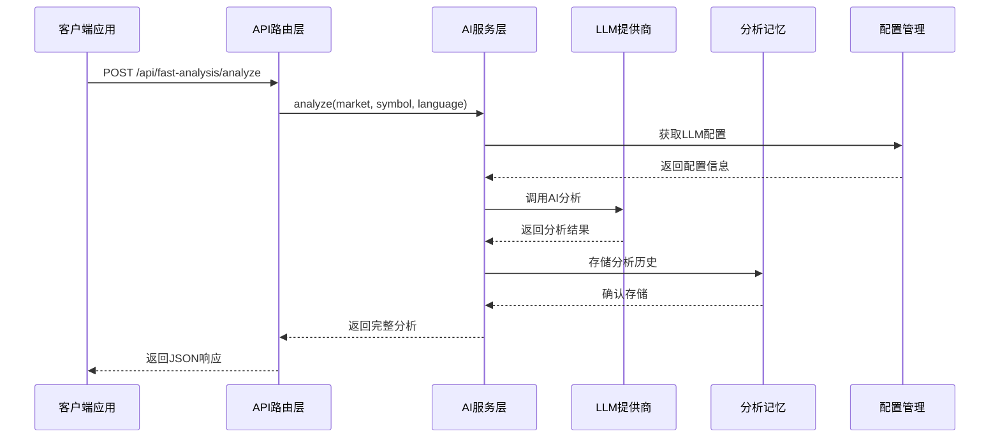
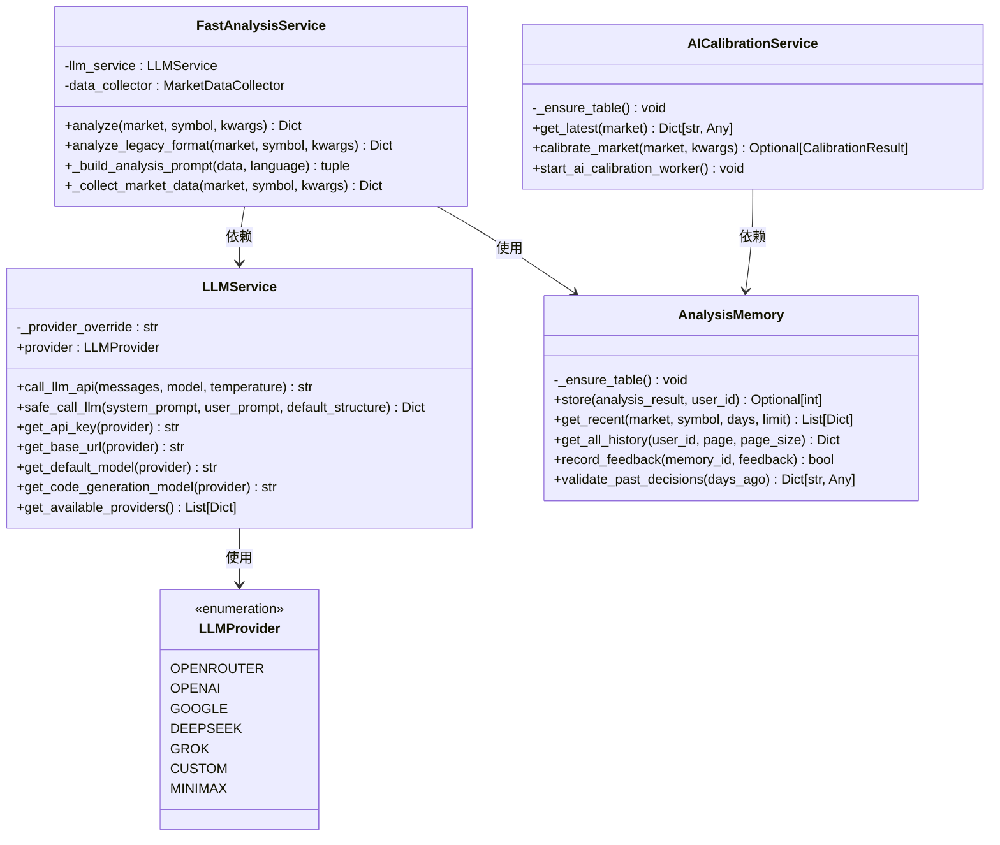
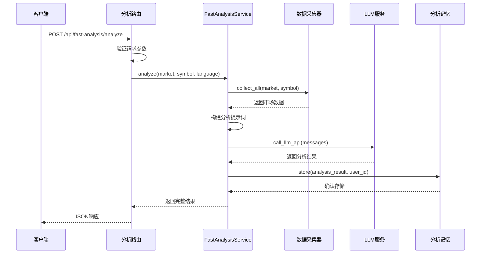
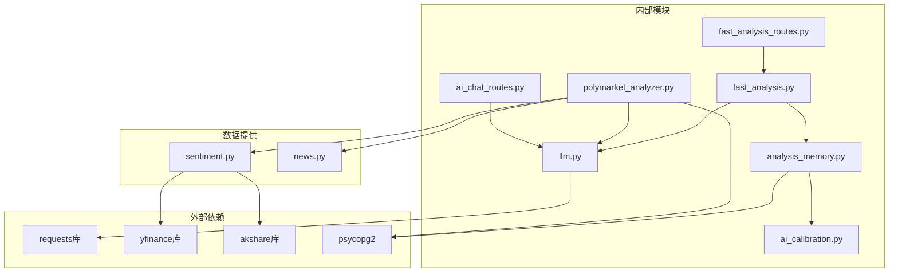

# AI分析API

<cite>
**本文档引用的文件**
- [llm.py](file://backend_api_python/app/services/llm.py)
- [fast_analysis.py](file://backend_api_python/app/services/fast_analysis.py)
- [analysis_memory.py](file://backend_api_python/app/services/analysis_memory.py)
- [ai_calibration.py](file://backend_api_python/app/services/ai_calibration.py)
- [polymarket_analyzer.py](file://backend_api_python/app/services/polymarket_analyzer.py)
- [fast_analysis.py](file://backend_api_python/app/routes/fast_analysis.py)
- [ai_chat.py](file://backend_api_python/app/routes/ai_chat.py)
- [sentiment.py](file://backend_api_python/app/data_providers/sentiment.py)
- [news.py](file://backend_api_python/app/data_providers/news.py)
- [strategy.py](file://backend_api_python/app/routes/strategy.py)
</cite>

## 目录
1. [简介](#简介)
2. [项目结构](#项目结构)
3. [核心组件](#核心组件)
4. [架构概览](#架构概览)
5. [详细组件分析](#详细组件分析)
6. [依赖关系分析](#依赖关系分析)
7. [性能考虑](#性能考虑)
8. [故障排除指南](#故障排除指南)
9. [结论](#结论)

## 简介

QuantDinger的AI分析API是一套完整的智能金融服务接口，集成了多LLM提供商支持、AI校准、分析记忆等功能。该系统提供从AI聊天、市场分析到策略优化的全方位智能服务，支持自然语言到代码转换、市场情绪分析、投资建议生成等高级功能。

系统采用模块化设计，通过统一的LLM服务层支持多种AI提供商，包括OpenRouter、OpenAI、Google Gemini、DeepSeek、Grok、Custom和MiniMax。同时集成了完整的分析记忆系统，支持AI校准和学习功能。

## 项目结构

**图表来源**
- [llm.py:70-122](file://backend_api_python/app/services/llm.py#L70-L122)
- [fast_analysis.py:186-200](file://backend_api_python/app/services/fast_analysis.py#L186-L200)
- [analysis_memory.py:36-44](file://backend_api_python/app/services/analysis_memory.py#L36-L44)

**章节来源**
- [llm.py:1-629](file://backend_api_python/app/services/llm.py#L1-L629)
- [fast_analysis.py:1-800](file://backend_api_python/app/services/fast_analysis.py#L1-L800)
- [analysis_memory.py:1-957](file://backend_api_python/app/services/analysis_memory.py#L1-L957)

## 核心组件

### LLM服务组件

LLM服务是整个AI分析系统的核心，支持七种不同的AI提供商：

- **OpenRouter**: 支持多模型格式，如openai/gpt-4o
- **OpenAI**: 标准OpenAI API支持
- **Google Gemini**: Gemini系列模型支持
- **DeepSeek**: 深度学习模型支持
- **Grok**: x.ai的Grok模型
- **MiniMax**: MiniMax系列模型
- **Custom**: 自定义OpenAI兼容接口

**章节来源**
- [llm.py:19-67](file://backend_api_python/app/services/llm.py#L19-L67)
- [llm.py:70-122](file://backend_api_python/app/services/llm.py#L70-L122)

### 快速分析服务

快速分析服务提供统一的市场分析能力，集成了技术分析、基本面分析、情绪分析和宏观环境分析：

- **技术指标分析**: RSI、MACD、移动平均线等
- **基本面分析**: 财务数据、估值指标
- **情绪分析**: 新闻情感、市场情绪
- **宏观分析**: 宏观经济指标、地缘政治事件

**章节来源**
- [fast_analysis.py:186-200](file://backend_api_python/app/services/fast_analysis.py#L186-L200)
- [fast_analysis.py:486-761](file://backend_api_python/app/services/fast_analysis.py#L486-L761)

### 分析记忆系统

分析记忆系统提供完整的分析历史存储和检索功能：

- **历史分析存储**: 存储每次分析的结果和上下文
- **相似模式检索**: 基于技术指标相似性的历史模式查找
- **反馈收集**: 用户对分析结果的反馈收集
- **性能统计**: 分析准确性和性能统计

**章节来源**
- [analysis_memory.py:36-174](file://backend_api_python/app/services/analysis_memory.py#L36-L174)
- [analysis_memory.py:236-368](file://backend_api_python/app/services/analysis_memory.py#L236-L368)

### AI校准服务

AI校准服务实现自动化的AI决策阈值校准：

- **阈值优化**: 基于历史验证结果优化买入/卖出阈值
- **性能监控**: 持续监控AI分析的准确性
- **自适应调整**: 根据市场条件自动调整分析策略

**章节来源**
- [ai_calibration.py:57-90](file://backend_api_python/app/services/ai_calibration.py#L57-L90)
- [ai_calibration.py:163-310](file://backend_api_python/app/services/ai_calibration.py#L163-L310)

## 架构概览

**图表来源**
- [fast_analysis.py:113-304](file://backend_api_python/app/routes/fast_analysis.py#L113-L304)
- [fast_analysis.py:243-250](file://backend_api_python/app/services/fast_analysis.py#L243-L250)

## 详细组件分析

### LLM服务类图

**图表来源**
- [llm.py:70-122](file://backend_api_python/app/services/llm.py#L70-L122)
- [ai_calibration.py:57-90](file://backend_api_python/app/services/ai_calibration.py#L57-L90)
- [fast_analysis.py:186-200](file://backend_api_python/app/services/fast_analysis.py#L186-L200)
- [analysis_memory.py:36-44](file://backend_api_python/app/services/analysis_memory.py#L36-L44)

### 快速分析API序列图

**图表来源**
- [fast_analysis.py:113-285](file://backend_api_python/app/routes/fast_analysis.py#L113-L285)
- [fast_analysis.py:243-250](file://backend_api_python/app/services/fast_analysis.py#L243-L250)

### AI聊天API兼容性

虽然AI聊天API目前是兼容性层，但提供了完整的接口规范：

**章节来源**
- [ai_chat.py:15-47](file://backend_api_python/app/routes/ai_chat.py#L15-L47)

### 预测市场分析器

预测市场分析器提供专门的预测市场分析能力：

- **事件概率预测**: 基于AI分析预测事件发生概率
- **机会评分**: 计算交易机会的量化评分
- **风险评估**: 评估预测的风险等级
- **资产关联分析**: 识别相关资产并生成交易建议

**章节来源**
- [polymarket_analyzer.py:19-26](file://backend_api_python/app/services/polymarket_analyzer.py#L19-L26)
- [polymarket_analyzer.py:27-111](file://backend_api_python/app/services/polymarket_analyzer.py#L27-L111)

## 依赖关系分析

**图表来源**
- [sentiment.py:4-10](file://backend_api_python/app/data_providers/sentiment.py#L4-L10)
- [news.py:4-10](file://backend_api_python/app/data_providers/news.py#L4-L10)

**章节来源**
- [sentiment.py:1-377](file://backend_api_python/app/data_providers/sentiment.py#L1-L377)
- [news.py:1-150](file://backend_api_python/app/data_providers/news.py#L1-L150)

## 性能考虑

### LLM调用优化

系统实现了多级优化策略来提升LLM调用性能：

- **智能提供商检测**: 根据模型名称自动检测合适的AI提供商
- **备用模型机制**: 当主要模型失败时自动尝试备用模型
- **超时控制**: 为不同提供商设置合理的超时时间
- **错误重试**: 对可恢复的网络错误进行自动重试

### 缓存策略

- **分析结果缓存**: 预测市场分析结果缓存30分钟
- **配置缓存**: LLM提供商配置缓存
- **数据缓存**: 常用市场数据的短期缓存

### 并发控制

- **飞行状态保护**: 防止重复的分析请求
- **连接池管理**: 限制并发的外部API调用
- **资源限制**: 控制内存和CPU使用

## 故障排除指南

### LLM提供商配置问题

**常见问题及解决方案**：

1. **API密钥配置错误**
   - 检查对应的环境变量是否正确设置
   - 验证API密钥的有效性和权限
   - 确认提供商的API端点配置正确

2. **模型兼容性问题**
   - 确保使用的模型名称与提供商匹配
   - 检查自定义模型配置
   - 验证OpenRouter模型格式

3. **网络连接问题**
   - 检查防火墙和代理设置
   - 验证网络连通性
   - 查看提供商的API状态

**章节来源**
- [llm.py:415-445](file://backend_api_python/app/services/llm.py#L415-L445)
- [llm.py:480-524](file://backend_api_python/app/services/llm.py#L480-L524)

### 分析记忆系统问题

**故障排除步骤**：

1. **数据库连接问题**
   - 检查PostgreSQL连接配置
   - 验证数据库表结构
   - 确认必要的索引存在

2. **数据存储失败**
   - 检查JSON序列化问题
   - 验证数据完整性约束
   - 查看数据库错误日志

3. **查询性能问题**
   - 分析慢查询日志
   - 检查索引使用情况
   - 优化查询条件

**章节来源**
- [analysis_memory.py:47-174](file://backend_api_python/app/services/analysis_memory.py#L47-L174)
- [analysis_memory.py:236-291](file://backend_api_python/app/services/analysis_memory.py#L236-L291)

### AI校准服务问题

**校准失败的诊断**：

1. **数据不足**
   - 检查历史数据分析的数量
   - 验证数据的时间范围
   - 确认足够的样本数量

2. **阈值计算异常**
   - 检查阈值候选值配置
   - 验证准确性计算逻辑
   - 确认覆盖度优先级

3. **数据库写入失败**
   - 检查校准结果表结构
   - 验证数据类型匹配
   - 查看事务提交状态

**章节来源**
- [ai_calibration.py:175-225](file://backend_api_python/app/services/ai_calibration.py#L175-L225)
- [ai_calibration.py:268-310](file://backend_api_python/app/services/ai_calibration.py#L268-L310)

## 结论

QuantDinger的AI分析API提供了一套完整、灵活且高性能的智能金融服务接口。通过多LLM提供商集成、AI校准、分析记忆等核心功能，系统能够为用户提供高质量的市场分析和投资建议。

系统的主要优势包括：

- **多提供商支持**: 灵活的LLM提供商选择和切换机制
- **自动化校准**: 基于历史数据的自动阈值优化
- **完整的分析生命周期**: 从数据收集到结果存储的全流程管理
- **可扩展架构**: 模块化设计便于功能扩展和维护

未来可以考虑的功能增强包括：
- 更丰富的AI提供商支持
- 实时数据流处理能力
- 更精细的用户个性化配置
- 增强的可视化和报告功能