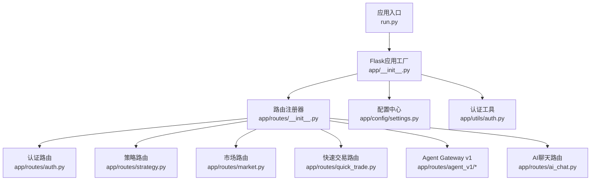
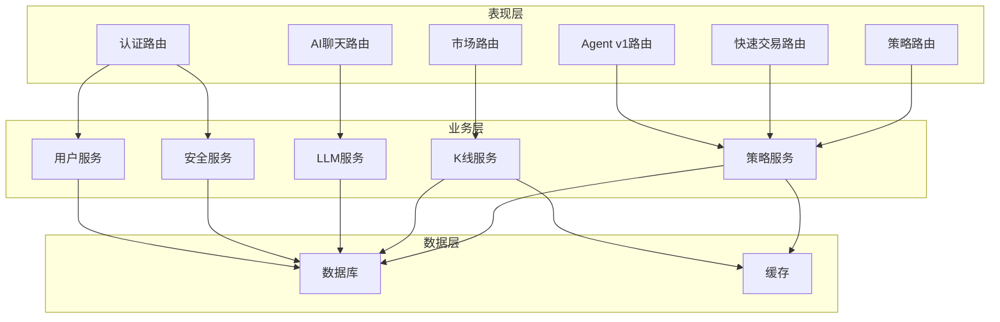
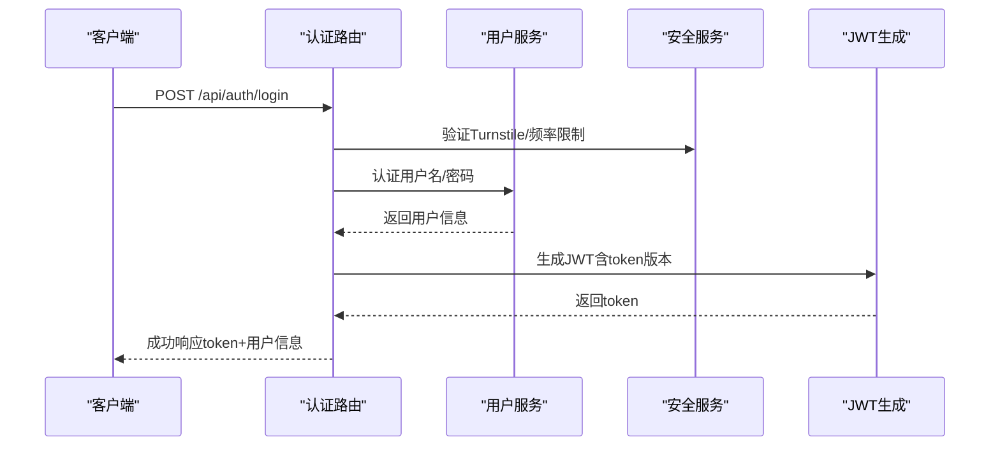
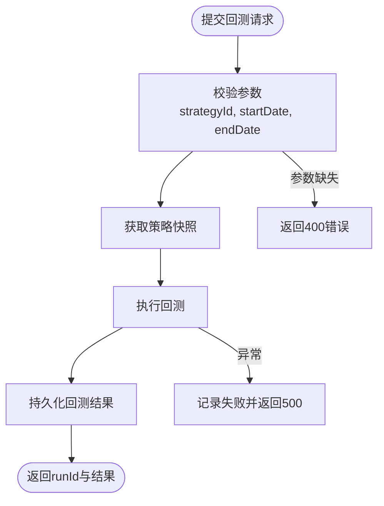
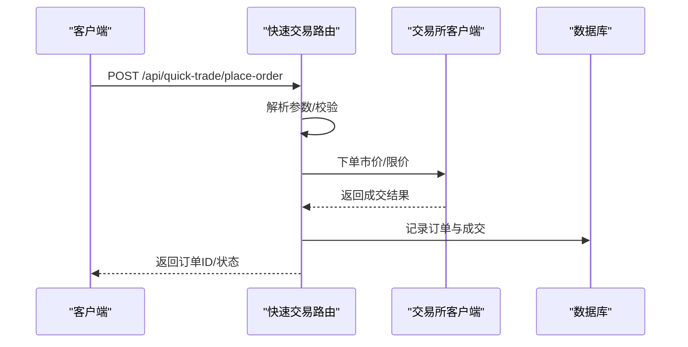
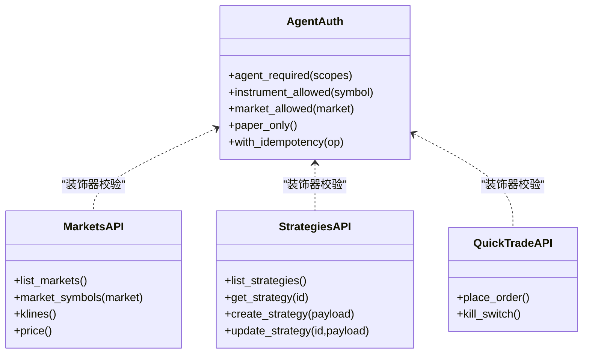
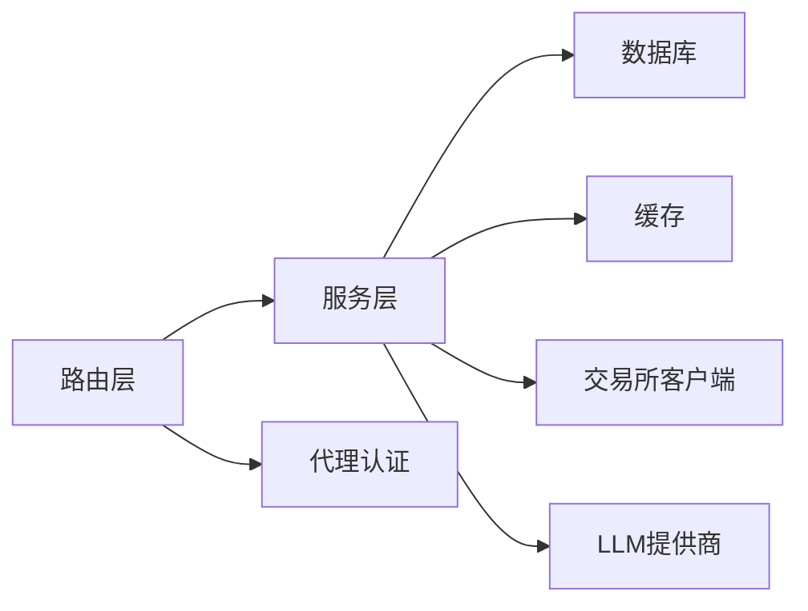

# API参考文档

<cite>
**本文档引用的文件**
- [run.py](file://backend_api_python/run.py)
- [app/__init__.py](file://backend_api_python/app/__init__.py)
- [routes/__init__.py](file://backend_api_python/app/routes/__init__.py)
- [config/settings.py](file://backend_api_python/app/config/settings.py)
- [utils/auth.py](file://backend_api_python/app/utils/auth.py)
- [routes/auth.py](file://backend_api_python/app/routs/auth.py)
- [routes/agent_v1/__init__.py](file://backend_api_python/app/routes/agent_v1/__init__.py)
- [routes/agent_v1/markets.py](file://backend_api_python/app/routes/agent_v1/markets.py)
- [routes/agent_v1/strategies.py](file://backend_api_python/app/routes/agent_v1/strategies.py)
- [routes/agent_v1/quick_trade.py](file://backend_api_python/app/routes/agent_v1/quick_trade.py)
- [routes/strategy.py](file://backend_api_python/app/routs/strategy.py)
- [routes/market.py](file://backend_api_python/app/routs/market.py)
- [routes/quick_trade.py](file://backend_api_python/app/routs/quick_trade.py)
- [routes/ai_chat.py](file://backend_api_python/app/routs/ai_chat.py)
- [services/llm.py](file://backend_api_python/app/services/llm.py)
</cite>

## 目录
1. [简介](#简介)
2. [项目结构](#项目结构)
3. [核心组件](#核心组件)
4. [架构总览](#架构总览)
5. [详细组件分析](#详细组件分析)
6. [依赖分析](#依赖分析)
7. [性能考虑](#性能考虑)
8. [故障排除指南](#故障排除指南)
9. [结论](#结论)
10. [附录](#附录)

## 简介
QuantDinger 提供一套面向量化交易与AI分析的Python后端API，覆盖认证授权、策略管理、市场数据、交易执行以及AI分析等能力。系统采用Flask框架，支持多用户认证、JWT令牌、角色权限控制，并提供Agent Gateway v1版本化的接口，遵循MCP协议扩展能力。

## 项目结构
后端API主要位于 `backend_api_python` 目录，核心模块包括：
- 应用入口与工厂：run.py、app/__init__.py
- 路由注册：app/routes/__init__.py
- 配置中心：app/config/settings.py
- 认证工具：app/utils/auth.py
- 各类API路由：app/routes/*.py
- 业务服务：app/services/*.py

**图表来源**
- [run.py:1-134](file://backend_api_python/run.py#L1-L134)
- [app/__init__.py:213-279](file://backend_api_python/app/__init__.py#L213-L279)
- [routes/__init__.py:7-58](file://backend_api_python/app/routes/__init__.py#L7-L58)

**章节来源**
- [run.py:104-134](file://backend_api_python/run.py#L104-L134)
- [app/__init__.py:213-279](file://backend_api_python/app/__init__.py#L213-L279)
- [routes/__init__.py:7-58](file://backend_api_python/app/routes/__init__.py#L7-L58)

## 核心组件
- 应用工厂与JSON序列化：提供安全的JSON输出（NaN/Infinity转null），避免前端解析错误。
- 路由注册：集中注册所有蓝图，统一前缀与版本化路径。
- 认证与权限：基于JWT的用户认证，支持管理员/经理/用户/访客角色，以及细粒度权限校验。
- Agent Gateway v1：独立的版本化接口面，强制代理身份、审计与能力范围（R/W/B/N/C/T）。

**章节来源**
- [app/__init__.py:15-51](file://backend_api_python/app/__init__.py#L15-L51)
- [routes/__init__.py:32-58](file://backend_api_python/app/routes/__init__.py#L32-L58)
- [utils/auth.py:18-114](file://backend_api_python/app/utils/auth.py#L18-L114)
- [agent_v1/__init__.py:21-49](file://backend_api_python/app/routes/agent_v1/__init__.py#L21-L49)

## 架构总览
系统采用分层架构：
- 表现层：Flask蓝图与路由处理HTTP请求
- 业务层：各服务模块（策略、回测、K线、LLM等）
- 数据访问层：数据库连接与缓存
- 外部集成：交易所执行、第三方数据源、LLM提供商

**图表来源**
- [routes/auth.py:140-279](file://backend_api_python/app/routs/auth.py#L140-L279)
- [routes/strategy.py:295-441](file://backend_api_python/app/routs/strategy.py#L295-L441)
- [routes/market.py:53-92](file://backend_api_python/app/routs/market.py#L53-L92)
- [routes/quick_trade.py:364-614](file://backend_api_python/app/routs/quick_trade.py#L364-L614)
- [agent_v1/markets.py:37-156](file://backend_api_python/app/routes/agent_v1/markets.py#L37-L156)
- [agent_v1/strategies.py:38-130](file://backend_api_python/app/routes/agent_v1/strategies.py#L38-L130)
- [agent_v1/quick_trade.py:102-178](file://backend_api_python/app/routes/agent_v1/quick_trade.py#L102-L178)
- [services/llm.py:70-122](file://backend_api_python/app/services/llm.py#L70-L122)

## 详细组件分析

### 认证授权API
- 路径前缀：/api/auth
- 主要端点：
  - GET /api/auth/security-config：公开安全配置（Turnstile开关、OAuth开关、注册开关）
  - POST /api/auth/login：用户名/密码登录，支持Turnstile验证码与登录频率限制
  - POST /api/auth/login-code：邮箱验证码快速登录/注册
  - POST /api/auth/send-code：发送验证码（注册/重置/改密/改绑）
  - POST /api/auth/register：邮箱注册
  - POST /api/auth/reset-password：重置密码
- 认证方式：Bearer JWT令牌；支持管理员/经理/用户/访客角色；支持权限位校验
- 安全特性：登录失败记录、频率限制、Turnstile人机验证、单设备登录（token版本）

**图表来源**
- [routes/auth.py:140-279](file://backend_api_python/app/routs/auth.py#L140-L279)
- [utils/auth.py:18-114](file://backend_api_python/app/utils/auth.py#L18-L114)

**章节来源**
- [routes/auth.py:115-279](file://backend_api_python/app/routs/auth.py#L115-L279)
- [utils/auth.py:18-114](file://backend_api_python/app/utils/auth.py#L18-L114)

### 策略管理API
- 路径前缀：/api
- 主要端点：
  - GET /api/strategies：列出当前用户的策略
  - GET /api/strategies/detail：获取策略详情
  - POST /api/strategies/backtest：运行策略回测
  - GET /api/strategies/backtest/history：回测历史
  - GET /api/strategies/backtest/get：获取单次回测结果
  - POST /api/strategies/create：创建策略
  - POST /api/strategies/batch-create：批量创建策略
  - POST /api/strategies/batch-start：批量启动策略
  - POST /api/strategies/batch-stop：批量停止策略
  - DELETE /api/strategies/batch-delete：批量删除策略
  - PUT /api/strategies/update：更新策略
  - DELETE /api/strategies/delete：删除策略
  - GET /api/strategies/trades：获取策略交易记录
  - GET /api/strategies/positions：获取策略持仓记录
- 认证：需Bearer JWT
- 权限：策略操作需属主或具备相应权限

**图表来源**
- [routes/strategy.py:329-441](file://backend_api_python/app/routs/strategy.py#L329-L441)

**章节来源**
- [routes/strategy.py:295-800](file://backend_api_python/app/routs/strategy.py#L295-L800)

### 市场数据API
- 路径前缀：/api/market
- 主要端点：
  - GET /api/market/config：公开配置（模型列表等）
  - GET /api/market/types：市场类型列表（可按配置排序）
  - GET /api/market/symbols/search：搜索标的（种子数据+交易所补充）
  - GET /api/market/symbols/hot：热门标的
  - GET /api/market/watchlist/get：获取自选股
  - POST /api/market/watchlist/add：添加自选股
  - POST /api/market/watchlist/remove：移除自选股
  - GET /api/market/watchlist/prices：批量获取自选股价格（线程池并发）
  - GET /api/market/price：单个标的实时价格
  - POST /api/market/stock/name：根据市场/代码解析名称
- 认证：部分端点需登录（如自选股）
- 性能：批量价格查询使用线程池并发，支持超时保护

**章节来源**
- [routes/market.py:53-643](file://backend_api_python/app/routs/market.py#L53-L643)

### 交易执行API（快速交易）
- 路径前缀：/api/quick-trade
- 主要端点：
  - POST /api/quick-trade/place-order：下单（市价/限价，USDT金额统一输入）
  - POST /api/quick-trade/close-position：平仓
  - GET /api/quick-trade/balance：可用余额
  - GET /api/quick-trade/position：当前持仓
  - GET /api/quick-trade/history：历史记录
- 认证：需登录
- 适配：多交易所客户端统一封装，自动转换USDT到基础币数量

**图表来源**
- [routes/quick_trade.py:364-614](file://backend_api_python/app/routs/quick_trade.py#L364-L614)

**章节来源**
- [routes/quick_trade.py:364-800](file://backend_api_python/app/routs/quick_trade.py#L364-L800)

### AI分析API
- 路径前缀：/api/ai
- 当前最小兼容层（本地模式下占位）：
  - POST /api/ai/chat/message：返回友好提示而非404
  - GET /api/ai/chat/history：空历史
  - POST /api/ai/chat/history/save：空操作
- LLM服务：多提供商（OpenRouter/OpenAI/Google/DeepSeek/Grok/Minimax/自定义）统一封装，支持自动探测与降级

**章节来源**
- [routes/ai_chat.py:15-47](file://backend_api_python/app/routs/ai_chat.py#L15-L47)
- [services/llm.py:70-122](file://backend_api_python/app/services/llm.py#L70-L122)

### Agent Gateway v1（版本化接口与MCP）
- 路径前缀：/api/agent/v1
- 设计要点：
  - 代理专用身份（非用户会话JWT），强制审计与能力范围（R/W/B/N/C/T）
  - 市场数据只读：/markets, /markets/<market>/symbols, /klines, /price
  - 策略CRUD：/strategies（读写），创建/更新自动投影公共字段
  - 交易（T）：/quick-trade/orders（纸面单，可硬性开关启用实盘）
- MCP协议：Agent Gateway作为外部Agent的扩展面，遵循MCP协议进行消息传递与能力发现

**图表来源**
- [agent_v1/__init__.py:21-49](file://backend_api_python/app/routes/agent_v1/__init__.py#L21-L49)
- [agent_v1/markets.py:37-156](file://backend_api_python/app/routes/agent_v1/markets.py#L37-L156)
- [agent_v1/strategies.py:38-130](file://backend_api_python/app/routes/agent_v1/strategies.py#L38-L130)
- [agent_v1/quick_trade.py:102-178](file://backend_api_python/app/routes/agent_v1/quick_trade.py#L102-L178)

**章节来源**
- [agent_v1/__init__.py:21-49](file://backend_api_python/app/routes/agent_v1/__init__.py#L21-L49)
- [agent_v1/markets.py:37-156](file://backend_api_python/app/routes/agent_v1/markets.py#L37-L156)
- [agent_v1/strategies.py:38-130](file://backend_api_python/app/routes/agent_v1/strategies.py#L38-L130)
- [agent_v1/quick_trade.py:102-178](file://backend_api_python/app/routes/agent_v1/quick_trade.py#L102-L178)

## 依赖分析
- 组件耦合：
  - 路由层依赖服务层（策略、K线、LLM、安全、用户）
  - 服务层依赖数据库与缓存
  - Agent v1路由依赖代理认证与审计
- 外部依赖：
  - 交易所客户端（Binance/OKX/Bybit等）
  - LLM提供商（OpenRouter/OpenAI/Google等）
  - 第三方数据源（CCXT、yfinance等）

**图表来源**
- [routes/strategy.py:11-28](file://backend_api_python/app/routs/strategy.py#L11-L28)
- [services/llm.py:70-122](file://backend_api_python/app/services/llm.py#L70-L122)

**章节来源**
- [routes/strategy.py:11-28](file://backend_api_python/app/routs/strategy.py#L11-L28)
- [services/llm.py:70-122](file://backend_api_python/app/services/llm.py#L70-L122)

## 性能考虑
- JSON序列化：避免NaN/Infinity导致的非法JSON，确保前端稳定解析
- 并发与限流：批量价格查询使用线程池，支持超时保护；速率限制可通过配置项控制
- 缓存：市场名称、交易所市场列表等结果缓存，降低重复调用成本
- 线程安全：IBKR连接使用异步补丁，避免嵌套事件循环导致的连接中断

**章节来源**
- [app/__init__.py:15-51](file://backend_api_python/app/__init__.py#L15-L51)
- [routes/market.py:31-42](file://backend_api_python/app/routs/market.py#L31-L42)
- [config/settings.py:66-73](file://backend_api_python/app/config/settings.py#L66-L73)

## 故障排除指南
- 认证失败
  - 检查Authorization头是否为Bearer JWT
  - 核对token是否过期或token版本不匹配
  - 查看登录失败记录与频率限制触发
- 交易失败
  - 检查错误提示中的友好键（如insufficient balance、invalid size等）
  - 确认交易所API连通性与账号权限
  - 核对下单参数（symbol、side、amount、price等）
- 回测异常
  - 确认策略ID存在且属于当前用户
  - 检查时间范围与时间级别限制
  - 查看回测历史中的错误信息
- Agent执行
  - 确认token具备所需scope（R/W/B/N/C/T）
  - 实盘开关需满足部署级环境变量与token配置

**章节来源**
- [utils/auth.py:126-186](file://backend_api_python/app/utils/auth.py#L126-L186)
- [routes/quick_trade.py:616-666](file://backend_api_python/app/routs/quick_trade.py#L616-L666)
- [routes/strategy.py:402-441](file://backend_api_python/app/routs/strategy.py#L402-L441)
- [agent_v1/quick_trade.py:131-153](file://backend_api_python/app/routes/agent_v1/quick_trade.py#L131-L153)

## 结论
QuantDinger的API体系以Flask为基础，围绕认证授权、策略管理、市场数据、交易执行与AI分析构建了完整的REST接口族。Agent Gateway v1通过版本化与能力范围约束，为外部Agent提供了安全可控的扩展面。配合多提供商LLM与多交易所执行客户端，系统能够满足从研究到实盘的全流程需求。

## 附录

### API版本管理与迁移
- 版本化路径：/api/agent/v1，便于未来引入v2
- 迁移建议：
  - 优先使用Agent v1的只读接口（/markets/*）进行功能迁移
  - 策略CRUD与交易接口逐步切换至Agent v1，确保token具备对应scope
  - 保持与人类UI一致的行为，减少兼容性差异

**章节来源**
- [agent_v1/__init__.py:34-49](file://backend_api_python/app/routes/agent_v1/__init__.py#L34-L49)

### 安全与合规
- 强制JWT认证与角色权限
- 登录频率限制与人机验证
- 单设备登录（token版本）防止重复登录
- Agent执行严格审计与硬性开关（实盘开关）

**章节来源**
- [utils/auth.py:18-114](file://backend_api_python/app/utils/auth.py#L18-L114)
- [routes/auth.py:172-181](file://backend_api_python/app/routs/auth.py#L172-L181)
- [agent_v1/quick_trade.py:131-153](file://backend_api_python/app/routes/agent_v1/quick_trade.py#L131-L153)

### 客户端实现要点
- 认证：保存并刷新JWT，处理过期与版本不匹配
- Agent：使用代理token，明确scope需求，遵循MCP协议
- 交易：统一以USDT输入金额，自动转换为基础币数量
- 错误处理：依据友好键映射提示，区分网络、权限、余额等场景

**章节来源**
- [routes/quick_trade.py:364-614](file://backend_api_python/app/routs/quick_trade.py#L364-L614)
- [agent_v1/quick_trade.py:102-178](file://backend_api_python/app/routes/agent_v1/quick_trade.py#L102-L178)