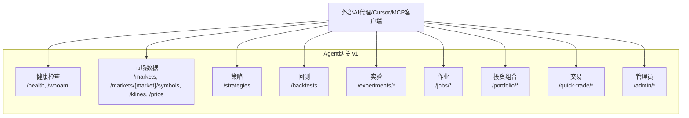
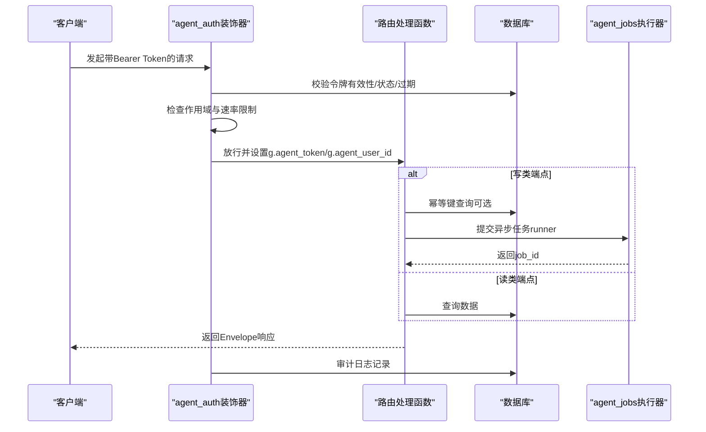
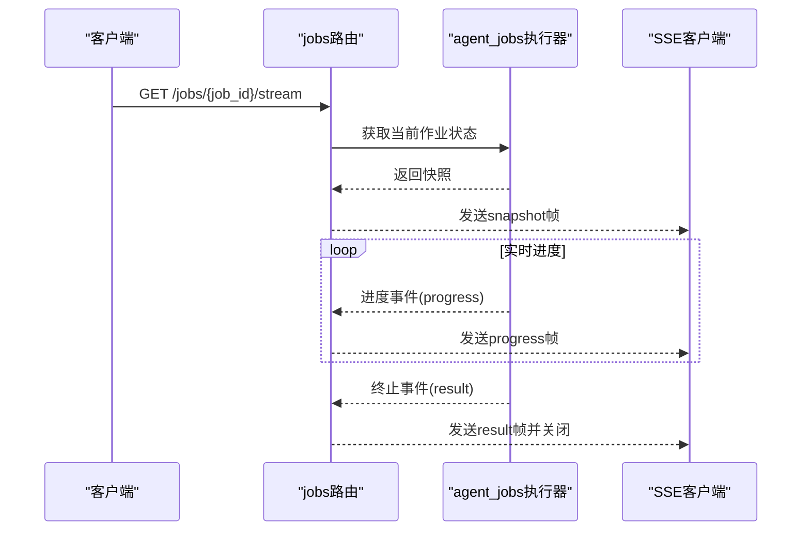
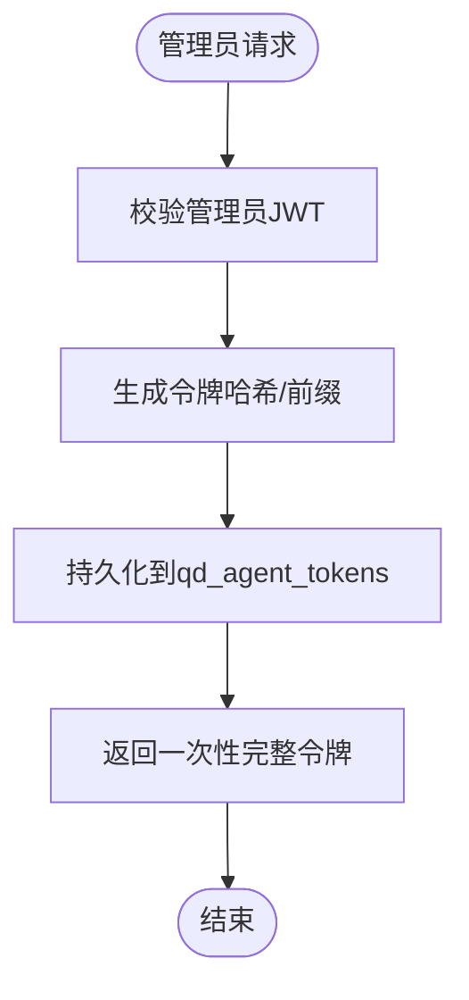
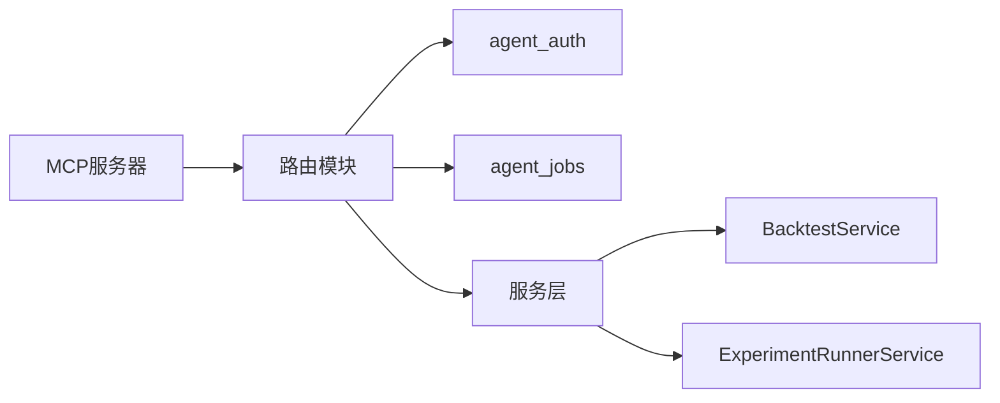

# Agent网关API

<cite>
**本文档引用的文件**
- [backend_api_python/app/routers/agent_v1/__init__.py](file://backend_api_python/app/routers/agent_v1/__init__.py)
- [backend_api_python/app/routers/agent_v1/admin.py](file://backend_api_python/app/routers/agent_v1/admin.py)
- [backend_api_python/app/routers/agent_v1/backtests.py](file://backend_api_python/app/routers/agent_v1/backtests.py)
- [backend_api_python/app/routers/agent_v1/experiments.py](file://backend_api_python/app/routers/agent_v1/experiments.py)
- [backend_api_python/app/routers/agent_v1/health.py](file://backend_api_python/app/routers/agent_v1/health.py)
- [backend_api_python/app/routers/agent_v1/jobs.py](file://backend_api_python/app/routers/agent_v1/jobs.py)
- [backend_api_python/app/routers/agent_v1/markets.py](file://backend_api_python/app/routers/agent_v1/markets.py)
- [backend_api_python/app/routers/agent_v1/portfolio.py](file://backend_api_python/app/routers/agent_v1/portfolio.py)
- [backend_api_python/app/routers/agent_v1/strategies.py](file://backend_api_python/app/routers/agent_v1/strategies.py)
- [backend_api_python/app/routers/agent_v1/quick_trade.py](file://backend_api_python/app/routers/agent_v1/quick_trade.py)
- [backend_api_python/app/utils/agent_auth.py](file://backend_api_python/app/utils/agent_auth.py)
- [backend_api_python/app/utils/agent_jobs.py](file://backend_api_python/app/utils/agent_jobs.py)
- [backend_api_python/app/services/experiment/runner.py](file://backend_api_python/app/services/experiment/runner.py)
- [backend_api_python/app/services/backtest.py](file://backend_api_python/app/services/backtest.py)
- [docs/agent/agent-openapi.json](file://docs/agent/agent-openapi.json)
- [docs/agent/cursor-mcp.example.json](file://docs/agent/cursor-mcp.example.json)
- [backend_api_python/migrations/v3_1_0_agent_gateway.sql](file://backend_api_python/migrations/v3_1_0_agent_gateway.sql)
- [mcp_server/src/quantdinger_mcp/server.py](file://mcp_server/src/quantdinger_mcp/server.py)
</cite>

## 目录
1. [简介](#简介)
2. [项目结构](#项目结构)
3. [核心组件](#核心组件)
4. [架构总览](#架构总览)
5. [详细组件分析](#详细组件分析)
6. [依赖关系分析](#依赖关系分析)
7. [性能考量](#性能考量)
8. [故障排查指南](#故障排查指南)
9. [结论](#结论)
10. [附录](#附录)

## 简介
本文件为QuantDinger Agent网关API的完整参考文档，覆盖agent/v1版本的全部端点与协议规范。该网关面向AI代理与自动化系统，提供版本化、作用域受限的接口表面，确保与人类用户界面分离，并对每个请求进行审计与速率限制。文档同时涵盖MCP协议集成、Cursor工具支持、Claude AI集成的技术规范，以及代理权限控制、资源限制、并发管理等安全考虑，以及代理生命周期管理、错误处理和监控告警的接口定义。

## 项目结构
Agent网关位于后端Python服务的路由层，采用Flask蓝图组织，按功能域划分为多个子模块：健康检查、市场数据、策略、回测与实验、作业队列、交易、投资组合、管理员令牌管理等。所有非公开端点均要求Bearer格式的Agent Token（以qd_agent_开头）。

图表来源
- [backend_api_python/app/routers/agent_v1/__init__.py](file://backend_api_python/app/routers/agent_v1/__init__.py)
- [backend_api_python/app/routers/agent_v1/health.py](file://backend_api_python/app/routers/agent_v1/health.py)
- [backend_api_python/app/routers/agent_v1/markets.py](file://backend_api_python/app/routers/agent_v1/markets.py)
- [backend_api_python/app/routers/agent_v1/strategies.py](file://backend_api_python/app/routers/agent_v1/strategies.py)
- [backend_api_python/app/routers/agent_v1/backtests.py](file://backend_api_python/app/routers/agent_v1/backtests.py)
- [backend_api_python/app/routers/agent_v1/experiments.py](file://backend_api_python/app/routers/agent_v1/experiments.py)
- [backend_api_python/app/routers/agent_v1/jobs.py](file://backend_api_python/app/routers/agent_v1/jobs.py)
- [backend_api_python/app/routers/agent_v1/portfolio.py](file://backend_api_python/app/routers/agent_v1/portfolio.py)
- [backend_api_python/app/routers/agent_v1/quick_trade.py](file://backend_api_python/app/routers/agent_v1/quick_trade.py)
- [backend_api_python/app/routers/agent_v1/admin.py](file://backend_api_python/app/routers/agent_v1/admin.py)

章节来源
- [backend_api_python/app/routers/agent_v1/__init__.py](file://backend_api_python/app/routers/agent_v1/__init__.py)
- [backend_api_python/app/routers/agent_v1/health.py](file://backend_api_python/app/routers/agent_v1/health.py)
- [backend_api_python/app/routers/agent_v1/markets.py](file://backend_api_python/app/routers/agent_v1/markets.py)
- [backend_api_python/app/routers/agent_v1/strategies.py](file://backend_api_python/app/routers/agent_v1/strategies.py)
- [backend_api_python/app/routers/agent_v1/backtests.py](file://backend_api_python/app/routers/agent_v1/backtests.py)
- [backend_api_python/app/routers/agent_v1/experiments.py](file://backend_api_python/app/routers/agent_v1/experiments.py)
- [backend_api_python/app/routers/agent_v1/jobs.py](file://backend_api_python/app/routers/agent_v1/jobs.py)
- [backend_api_python/app/routers/agent_v1/portfolio.py](file://backend_api_python/app/routers/agent_v1/portfolio.py)
- [backend_api_python/app/routers/agent_v1/quick_trade.py](file://backend_api_python/app/routers/agent_v1/quick_trade.py)
- [backend_api_python/app/routers/agent_v1/admin.py](file://backend_api_python/app/routers/agent_v1/admin.py)

## 核心组件
- 蓝图注册与错误处理：在蓝图中集中处理404错误并统一返回标准化响应体。
- 认证与授权：独立于人类JWT的Agent Token认证，支持能力类（R/W/B/N/C/T）、速率限制、审计日志与幂等键。
- 异步作业：基于线程池的作业提交与进度流式推送，支持SSE长连接与断点续播。
- 数据服务：回测服务、实验运行器、K线服务等，保证与人类UI一致的行为。
- MCP服务器：将Agent网关作为MCP工具暴露，仅限读取与回测类工具，交易类不暴露。

章节来源
- [backend_api_python/app/routers/agent_v1/__init__.py](file://backend_api_python/app/routers/agent_v1/__init__.py)
- [backend_api_python/app/utils/agent_auth.py](file://backend_api_python/app/utils/agent_auth.py)
- [backend_api_python/app/utils/agent_jobs.py](file://backend_api_python/app/utils/agent_jobs.py)
- [backend_api_python/app/services/experiment/runner.py](file://backend_api_python/app/services/experiment/runner.py)
- [backend_api_python/app/services/backtest.py](file://backend_api_python/app/services/backtest.py)
- [mcp_server/src/quantdinger_mcp/server.py](file://mcp_server/src/quantdinger_mcp/server.py)

## 架构总览
Agent网关通过Flask蓝图挂载到/api/agent/v1路径，所有端点由agent_required装饰器保护，执行前完成令牌校验、作用域检查、速率限制与审计记录。写类（B/T）端点支持幂等键去重；异步任务通过作业队列持久化并在完成后返回结果或错误。MCP服务器作为薄包装层，将REST API映射为工具集供Cursor等客户端使用。

图表来源
- [backend_api_python/app/utils/agent_auth.py](file://backend_api_python/app/utils/agent_auth.py)
- [backend_api_python/app/utils/agent_jobs.py](file://backend_api_python/app/utils/agent_jobs.py)
- [backend_api_python/app/routers/agent_v1/backtests.py](file://backend_api_python/app/routers/agent_v1/backtests.py)
- [backend_api_python/app/routers/agent_v1/experiments.py](file://backend_api_python/app/routers/agent_v1/experiments.py)

## 详细组件分析

### 健康与自检
- /health：公开可用，用于存活探针。
- /whoami：返回调用令牌的身份信息（不含敏感字段），便于代理自发现能力。

章节来源
- [backend_api_python/app/routers/agent_v1/health.py](file://backend_api_python/app/routers/agent_v1/health.py)

### 市场数据与价格
- /markets：列出令牌允许访问的市场集合。
- /markets/{market}/symbols：按关键字搜索标的，支持热榜与关键词两种模式。
- /klines：OHLCV蜡烛数据，支持分页参数before_time。
- /price：获取最新价格。

章节来源
- [backend_api_python/app/routers/agent_v1/markets.py](file://backend_api_python/app/routers/agent_v1/markets.py)

### 投资组合
- /portfolio/positions：返回手动持仓列表。
- /portfolio/paper-orders：返回近期纸单订单列表。

章节来源
- [backend_api_python/app/routers/agent_v1/portfolio.py](file://backend_api_python/app/routers/agent_v1/portfolio.py)

### 策略管理
- /strategies（GET）：列出租户策略（投影字段）。
- /strategies（POST）：创建策略，默认stopped状态。
- /strategies/{id}（GET/PATCH）：读取与更新；将策略置为running需具备T作用域。

章节来源
- [backend_api_python/app/routers/agent_v1/strategies.py](file://backend_api_python/app/routers/agent_v1/strategies.py)

### 回测与实验
- /backtests（POST）：提交回测作业，返回job_id；支持Idempotency-Key去重。
- /experiments/regime/detect（POST）：同步检测市场周期。
- /experiments/pipeline（POST）：提交网格流水线作业。
- /experiments/structured-tune（POST）：提交结构化（网格/随机）调参作业。
- /experiments/ai-optimize（POST）：提交LLM多轮优化作业，消耗配额。

章节来源
- [backend_api_python/app/routers/agent_v1/backtests.py](file://backend_api_python/app/routers/agent_v1/backtests.py)
- [backend_api_python/app/routers/agent_v1/experiments.py](file://backend_api_python/app/routers/agent_v1/experiments.py)
- [backend_api_python/app/services/experiment/runner.py](file://backend_api_python/app/services/experiment/runner.py)

### 作业队列与进度流
- /jobs（GET）：列出最近作业。
- /jobs/{job_id}（GET）：获取单个作业快照。
- /jobs/{job_id}/stream（GET）：SSE流式输出进度，支持断点续播（since/Last-Event-ID）。

图表来源
- [backend_api_python/app/routers/agent_v1/jobs.py](file://backend_api_python/app/routers/agent_v1/jobs.py)
- [backend_api_python/app/utils/agent_jobs.py](file://backend_api_python/app/utils/agent_jobs.py)

章节来源
- [backend_api_python/app/routers/agent_v1/jobs.py](file://backend_api_python/app/routers/agent_v1/jobs.py)
- [backend_api_python/app/utils/agent_jobs.py](file://backend_api_python/app/utils/agent_jobs.py)

### 交易（纸单默认）
- /quick-trade/orders（POST）：下单（默认纸单，paper-only）。若启用实时交易需满足：令牌含T作用域、paper_only=false、部署开关开启。
- /quick-trade/kill-switch（POST）：撤销该租户未成交纸单。

章节来源
- [backend_api_python/app/routers/agent_v1/quick_trade.py](file://backend_api_python/app/routers/agent_v1/quick_trade.py)

### 管理员令牌与审计
- /admin/tokens（POST）：签发新令牌（仅管理员），支持名称、作用域、市场/标的白名单、paper_only、速率限制、过期时间。
- /admin/tokens（GET）：列出租户令牌（无密文）。
- /admin/tokens/{id}（DELETE）：吊销令牌。
- /admin/audit（GET）：查看审计日志。

图表来源
- [backend_api_python/app/routers/agent_v1/admin.py](file://backend_api_python/app/routers/agent_v1/admin.py)

章节来源
- [backend_api_python/app/routers/agent_v1/admin.py](file://backend_api_python/app/routers/agent_v1/admin.py)

### MCP协议集成与Cursor工具支持
- MCP服务器将Agent网关映射为工具集，仅暴露读类与回测类工具，交易类不暴露。
- Cursor示例配置文件展示了如何通过环境变量指定Base URL与Agent Token。

章节来源
- [mcp_server/src/quantdinger_mcp/server.py](file://mcp_server/src/quantdinger_mcp/server.py)
- [docs/agent/cursor-mcp.example.json](file://docs/agent/cursor-mcp.example.json)

## 依赖关系分析
Agent网关各模块间依赖清晰，核心依赖链如下：
- 路由层依赖认证与作业工具：agent_required装饰器、with_idempotency上下文、submit_job。
- 回测与实验依赖服务层：BacktestService、ExperimentRunnerService。
- MCP服务器依赖HTTP客户端封装REST API。

图表来源
- [backend_api_python/app/routers/agent_v1/backtests.py](file://backend_api_python/app/routers/agent_v1/backtests.py)
- [backend_api_python/app/routers/agent_v1/experiments.py](file://backend_api_python/app/routers/agent_v1/experiments.py)
- [backend_api_python/app/utils/agent_auth.py](file://backend_api_python/app/utils/agent_auth.py)
- [backend_api_python/app/utils/agent_jobs.py](file://backend_api_python/app/utils/agent_jobs.py)
- [mcp_server/src/quantdinger_mcp/server.py](file://mcp_server/src/quantdinger_mcp/server.py)

章节来源
- [backend_api_python/app/routers/agent_v1/backtests.py](file://backend_api_python/app/routers/agent_v1/backtests.py)
- [backend_api_python/app/routers/agent_v1/experiments.py](file://backend_api_python/app/routers/agent_v1/experiments.py)
- [backend_api_python/app/utils/agent_auth.py](file://backend_api_python/app/utils/agent_auth.py)
- [backend_api_python/app/utils/agent_jobs.py](file://backend_api_python/app/utils/agent_jobs.py)
- [mcp_server/src/quantdinger_mcp/server.py](file://mcp_server/src/quantdinger_mcp/server.py)

## 性能考量
- 速率限制：基于令牌维度的每分钟请求数限制，防止滥用。
- 并发与线程池：作业执行器使用有界线程池，最大工作者数可通过环境变量配置。
- 缓存：回测服务内置K线缓存，减少重复拉取外部数据。
- SSE长连接：进度流采用事件序列号与心跳帧，避免代理超时断开。

章节来源
- [backend_api_python/app/utils/agent_auth.py](file://backend_api_python/app/utils/agent_auth.py)
- [backend_api_python/app/utils/agent_jobs.py](file://backend_api_python/app/utils/agent_jobs.py)
- [backend_api_python/app/services/backtest.py](file://backend_api_python/app/services/backtest.py)

## 故障排查指南
- 401/403/429：认证失败、权限不足、速率超限。检查令牌是否正确、作用域是否包含所需类、速率限制是否触发。
- 404：路由不存在或作业/令牌不存在。确认URL与租户范围。
- 500/5xx：内部错误。查看审计日志与后端错误堆栈。
- SSE断连：使用since或Last-Event-ID参数恢复；若作业已结束，服务会立即返回最终结果帧。

章节来源
- [backend_api_python/app/routers/agent_v1/__init__.py](file://backend_api_python/app/routers/agent_v1/__init__.py)
- [backend_api_python/app/utils/agent_auth.py](file://backend_api_python/app/utils/agent_auth.py)
- [backend_api_python/app/routers/agent_v1/jobs.py](file://backend_api_python/app/routers/agent_v1/jobs.py)

## 结论
QuantDinger Agent网关以明确的作用域与审计机制保障了AI代理的安全可控使用，结合异步作业与SSE流式进度，提供了良好的自动化工作流体验。MCP与Cursor集成进一步降低了接入门槛。建议在生产环境中合理配置速率限制、并发与审计策略，确保平台稳定与合规。

## 附录

### OpenAPI规范摘要
- 服务器：/api/agent/v1
- 安全方案：AgentToken（Bearer qd_agent_xxx）
- 主要端点概览：
  - 健康与自检：/health, /whoami
  - 市场数据：/markets, /markets/{market}/symbols, /klines, /price
  - 策略：/strategies, /strategies/{id}
  - 回测与实验：/backtests, /experiments/*
  - 作业：/jobs, /jobs/{job_id}, /jobs/{job_id}/stream
  - 投资组合：/portfolio/positions, /portfolio/paper-orders
  - 交易：/quick-trade/orders, /quick-trade/kill-switch
  - 管理员：/admin/tokens, /admin/tokens/{id}, /admin/audit

章节来源
- [docs/agent/agent-openapi.json](file://docs/agent/agent-openapi.json)

### 数据模型与索引
- qd_agent_tokens：令牌表，包含user_id、scopes、markets、instruments、paper_only、rate_limit_per_min、status、expires_at等。
- qd_agent_jobs：作业表，包含job_id、user_id、agent_token_id、kind、status、request、result、error、progress、idempotency_key等。
- qd_agent_audit：审计表，记录每次请求的用户、令牌、路由、方法、作用域类、状态码、耗时等。
- qd_agent_paper_orders：纸单订单表，记录paper-only订单。

章节来源
- [backend_api_python/migrations/v3_1_0_agent_gateway.sql](file://backend_api_python/migrations/v3_1_0_agent_gateway.sql)