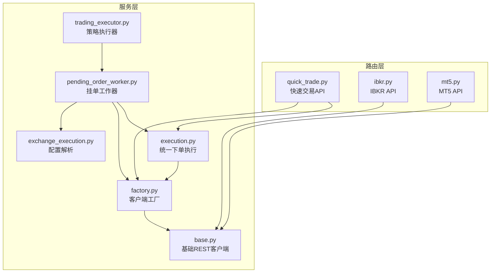
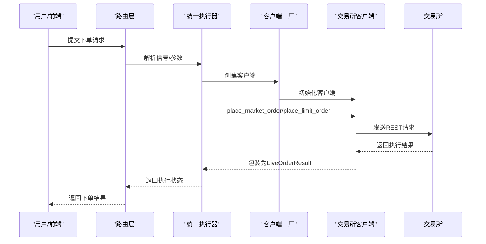
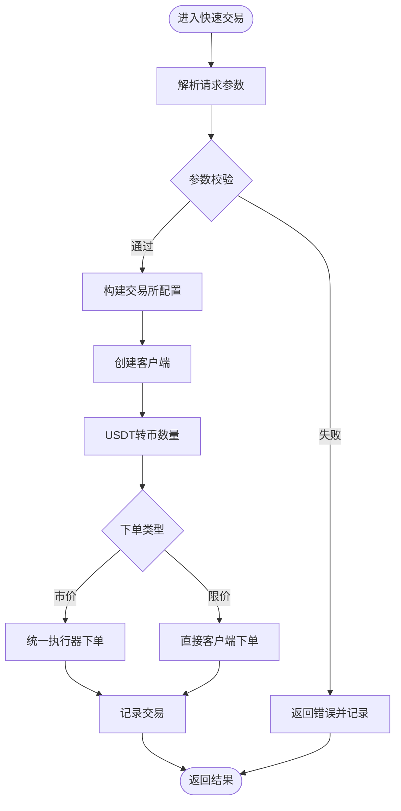
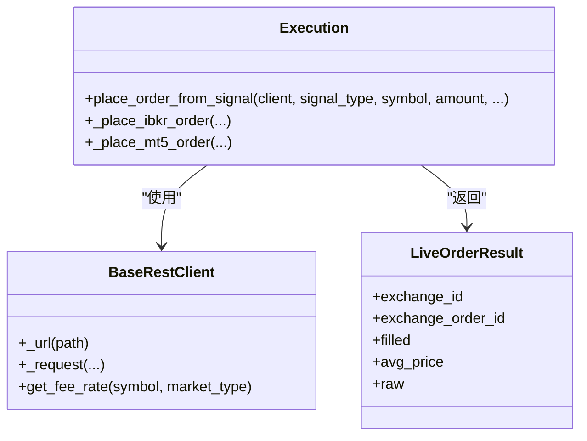
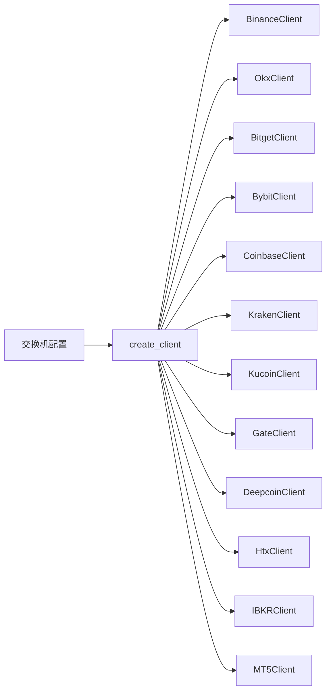
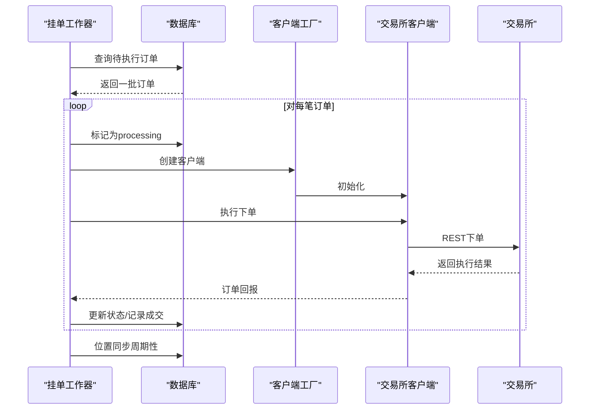
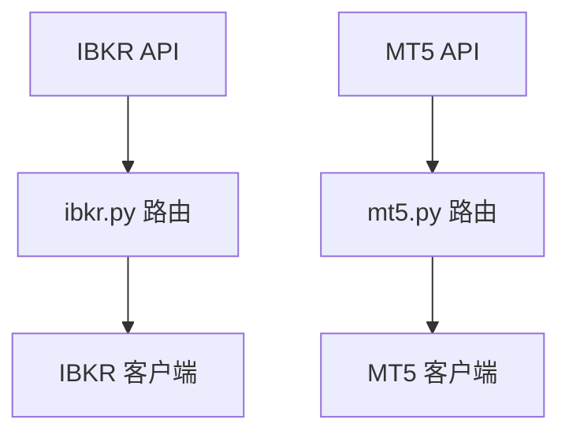
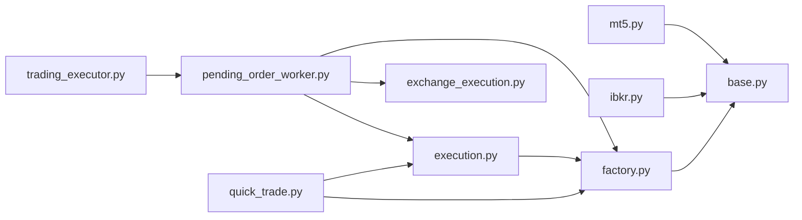

# 交易执行API

<cite>
**本文档引用的文件**
- [quick_trade.py](file://backend_api_python/app/routes/quick_trade.py)
- [execution.py](file://backend_api_python/app/services/live_trading/execution.py)
- [base.py](file://backend_api_python/app/services/live_trading/base.py)
- [factory.py](file://backend_api_python/app/services/live_trading/factory.py)
- [pending_order_worker.py](file://backend_api_python/app/services/pending_order_worker.py)
- [exchange_execution.py](file://backend_api_python/app/services/exchange_execution.py)
- [ibkr.py](file://backend_api_python/app/routes/ibkr.py)
- [mt5.py](file://backend_api_python/app/routes/mt5.py)
- [trading_executor.py](file://backend_api_python/app/services/trading_executor.py)
- [IBKR_TRADING_GUIDE_EN.md](file://docs/IBKR_TRADING_GUIDE_EN.md)
- [MT5_TRADING_GUIDE_EN.md](file://docs/MT5_TRADING_GUIDE_EN.md)
</cite>

## 目录
1. [简介](#简介)
2. [项目结构](#项目结构)
3. [核心组件](#核心组件)
4. [架构总览](#架构总览)
5. [详细组件分析](#详细组件分析)
6. [依赖关系分析](#依赖关系分析)
7. [性能考虑](#性能考虑)
8. [故障排除指南](#故障排除指南)
9. [结论](#结论)
10. [附录](#附录)

## 简介
本文件为 QuantDinger 交易执行API的权威参考文档，覆盖订单提交、取消、查询等交易操作的完整API规范，统一适配多交易所、多执行器（加密、传统券商、外汇）。文档同时涵盖实时交易、模拟交易、批量订单处理、资金管理、风险控制、手续费计算、订单状态跟踪、执行报告、交易日志以及与Interactive Brokers（IBKR）、MetaTrader5（MT5）等外部系统的集成接口。

## 项目结构
QuantDinger 后端采用Flask微服务架构，交易执行相关代码主要分布在以下模块：
- 路由层：提供REST API入口，负责请求解析、鉴权与响应封装
- 服务层：封装交易所客户端工厂、订单执行逻辑、挂单处理、资金与风控
- 业务层：策略执行器、快速交易、外部Broker集成

**图表来源**
- [quick_trade.py:1-800](file://backend_api_python/app/routes/quick_trade.py#L1-800)
- [execution.py:1-426](file://backend_api_python/app/services/live_trading/execution.py#L1-426)
- [factory.py:1-441](file://backend_api_python/app/services/live_trading/factory.py#L1-441)
- [base.py:1-168](file://backend_api_python/app/services/live_trading/base.py#L1-168)
- [pending_order_worker.py:1-800](file://backend_api_python/app/services/pending_order_worker.py#L1-800)
- [exchange_execution.py:1-150](file://backend_api_python/app/services/exchange_execution.py#L1-150)
- [ibkr.py:1-383](file://backend_api_python/app/routes/ibkr.py#L1-383)
- [mt5.py:1-439](file://backend_api_python/app/routes/mt5.py#L1-439)
- [trading_executor.py:1-800](file://backend_api_python/app/services/trading_executor.py#L1-800)

**章节来源**
- [quick_trade.py:1-800](file://backend_api_python/app/routes/quick_trade.py#L1-800)
- [execution.py:1-426](file://backend_api_python/app/services/live_trading/execution.py#L1-426)
- [factory.py:1-441](file://backend_api_python/app/services/live_trading/factory.py#L1-441)
- [base.py:1-168](file://backend_api_python/app/services/live_trading/base.py#L1-168)
- [pending_order_worker.py:1-800](file://backend_api_python/app/services/pending_order_worker.py#L1-800)
- [exchange_execution.py:1-150](file://backend_api_python/app/services/exchange_execution.py#L1-150)
- [ibkr.py:1-383](file://backend_api_python/app/routes/ibkr.py#L1-383)
- [mt5.py:1-439](file://backend_api_python/app/routes/mt5.py#L1-439)
- [trading_executor.py:1-800](file://backend_api_python/app/services/trading_executor.py#L1-800)

## 核心组件
- 快速交易API：面向非策略用户的直接下单能力，支持加密市场市价/限价单、余额查询、头寸查询、历史记录等
- 统一执行器：将策略信号转换为具体交易所的下单调用，抽象多交易所差异
- 客户端工厂：根据配置动态创建不同交易所/外部Broker客户端
- 挂单工作器：轮询待执行队列，按策略配置执行真实或模拟交易
- 外部Broker集成：IBKR（美国股票）与MT5（外汇）专用API
- 策略执行器：策略线程驱动K线/价格采集、信号生成、订单入队与状态跟踪

**章节来源**
- [quick_trade.py:1-800](file://backend_api_python/app/routes/quick_trade.py#L1-800)
- [execution.py:123-311](file://backend_api_python/app/services/live_trading/execution.py#L123-311)
- [factory.py:126-285](file://backend_api_python/app/services/live_trading/factory.py#L126-285)
- [pending_order_worker.py:52-122](file://backend_api_python/app/services/pending_order_worker.py#L52-122)
- [ibkr.py:1-383](file://backend_api_python/app/routes/ibkr.py#L1-383)
- [mt5.py:1-439](file://backend_api_python/app/routes/mt5.py#L1-439)
- [trading_executor.py:37-100](file://backend_api_python/app/services/trading_executor.py#L37-100)

## 架构总览
交易执行链路自上而下分为三层：API路由、执行调度、底层客户端。快速交易与策略执行共享统一的下单执行器与客户端工厂，确保多交易所一致性。

**图表来源**
- [execution.py:123-311](file://backend_api_python/app/services/live_trading/execution.py#L123-311)
- [factory.py:126-285](file://backend_api_python/app/services/live_trading/factory.py#L126-285)
- [base.py:95-167](file://backend_api_python/app/services/live_trading/base.py#L95-167)

## 详细组件分析

### 快速交易API（加密市场）
- 支持路径：/api/quick-trade/*
- 功能：市价/限价单、余额查询、头寸查询、历史记录、错误提示友好化
- 关键特性：
  - USDT为中心的金额输入，自动转换为币数量
  - 自动获取实时价格进行转换，失败时保留原值并记录告警
  - 支持杠杆设置、保证金模式（交叉/隔离）
  - 统一记录到数据库，便于审计与回溯

**图表来源**
- [quick_trade.py:364-614](file://backend_api_python/app/routes/quick_trade.py#L364-614)
- [execution.py:123-311](file://backend_api_python/app/services/live_trading/execution.py#L123-311)

**章节来源**
- [quick_trade.py:1-800](file://backend_api_python/app/routes/quick_trade.py#L1-800)
- [execution.py:123-311](file://backend_api_python/app/services/live_trading/execution.py#L123-311)

### 统一执行器（多交易所）
- 负责将信号映射为具体交易所的下单调用
- 支持加密交易所：Binance、OKX、Bitget、Bybit、Coinbase、Kraken、KuCoin、Gate、Deepcoin、HTX
- 支持传统券商：IBKR（美国股票）、MT5（外汇）

**图表来源**
- [execution.py:123-426](file://backend_api_python/app/services/live_trading/execution.py#L123-426)
- [base.py:82-167](file://backend_api_python/app/services/live_trading/base.py#L82-167)

**章节来源**
- [execution.py:1-426](file://backend_api_python/app/services/live_trading/execution.py#L1-426)
- [base.py:1-168](file://backend_api_python/app/services/live_trading/base.py#L1-168)

### 客户端工厂（多执行器）
- 根据配置动态创建客户端，支持演示/仿真模式切换
- 支持IBKR与MT5的即时连接验证
- 提供费用率查询辅助

**图表来源**
- [factory.py:126-285](file://backend_api_python/app/services/live_trading/factory.py#L126-285)

**章节来源**
- [factory.py:1-441](file://backend_api_python/app/services/live_trading/factory.py#L1-441)

### 挂单工作器（批量执行）
- 轮询待执行队列，批量派发订单
- 支持位置同步（最佳努力），防止“幽灵持仓”
- 可配置重入与失败处理策略

**图表来源**
- [pending_order_worker.py:99-122](file://backend_api_python/app/services/pending_order_worker.py#L99-122)
- [pending_order_worker.py:138-751](file://backend_api_python/app/services/pending_order_worker.py#L138-751)

**章节来源**
- [pending_order_worker.py:1-800](file://backend_api_python/app/services/pending_order_worker.py#L1-800)

### 外部Broker集成（IBKR/MT5）
- IBKR（美国股票）：账户信息、头寸、开放订单、下单、撤单、报价
- MT5（外汇）：账户信息、头寸、挂单、符号、下单、限价单、平仓、撤单、报价

**图表来源**
- [ibkr.py:1-383](file://backend_api_python/app/routes/ibkr.py#L1-383)
- [mt5.py:1-439](file://backend_api_python/app/routes/mt5.py#L1-439)

**章节来源**
- [ibkr.py:1-383](file://backend_api_python/app/routes/ibkr.py#L1-383)
- [mt5.py:1-439](file://backend_api_python/app/routes/mt5.py#L1-439)
- [IBKR_TRADING_GUIDE_EN.md:1-168](file://docs/IBKR_TRADING_GUIDE_EN.md#L1-168)
- [MT5_TRADING_GUIDE_EN.md:1-276](file://docs/MT5_TRADING_GUIDE_EN.md#L1-276)

### 策略执行器（实时交易）
- 策略线程：拉取K线/价格、计算信号、将订单写入待执行队列
- 实盘成交由挂单工作器与交易所直连完成
- 支持资金管理、风险控制、手续费缓存、去重与优先级

**章节来源**
- [trading_executor.py:1-800](file://backend_api_python/app/services/trading_executor.py#L1-800)

## 依赖关系分析
- 路由层依赖服务层：快速交易依赖统一执行器与客户端工厂；IBKR/MT5路由依赖各自客户端
- 服务层内部解耦：统一执行器通过工厂创建客户端，避免硬编码
- 数据访问：统一通过数据库工具与缓存工具，减少重复实现
- 外部依赖：交易所REST SDK、ib_insync、MetaTrader5库

**图表来源**
- [quick_trade.py:1-800](file://backend_api_python/app/routes/quick_trade.py#L1-800)
- [execution.py:1-426](file://backend_api_python/app/services/live_trading/execution.py#L1-426)
- [factory.py:1-441](file://backend_api_python/app/services/live_trading/factory.py#L1-441)
- [base.py:1-168](file://backend_api_python/app/services/live_trading/base.py#L1-168)
- [pending_order_worker.py:1-800](file://backend_api_python/app/services/pending_order_worker.py#L1-800)
- [exchange_execution.py:1-150](file://backend_api_python/app/services/exchange_execution.py#L1-150)
- [ibkr.py:1-383](file://backend_api_python/app/routes/ibkr.py#L1-383)
- [mt5.py:1-439](file://backend_api_python/app/routes/mt5.py#L1-439)
- [trading_executor.py:1-800](file://backend_api_python/app/services/trading_executor.py#L1-800)

**章节来源**
- [quick_trade.py:1-800](file://backend_api_python/app/routes/quick_trade.py#L1-800)
- [execution.py:1-426](file://backend_api_python/app/services/live_trading/execution.py#L1-426)
- [factory.py:1-441](file://backend_api_python/app/services/live_trading/factory.py#L1-441)
- [base.py:1-168](file://backend_api_python/app/services/live_trading/base.py#L1-168)
- [pending_order_worker.py:1-800](file://backend_api_python/app/services/pending_order_worker.py#L1-800)
- [exchange_execution.py:1-150](file://backend_api_python/app/services/exchange_execution.py#L1-150)
- [ibkr.py:1-383](file://backend_api_python/app/routes/ibkr.py#L1-383)
- [mt5.py:1-439](file://backend_api_python/app/routes/mt5.py#L1-439)
- [trading_executor.py:1-800](file://backend_api_python/app/services/trading_executor.py#L1-800)

## 性能考虑
- 并发与限流：快速交易与组合行情查询使用线程池与速率限制，避免触发第三方API限流
- 价格缓存：本地轻量内存缓存与TTL控制，降低频繁查询成本
- 批量执行：挂单工作器支持批量拉取与处理，提升吞吐
- 资源监控：策略执行器记录线程/内存使用，便于定位资源瓶颈
- SSL证书：集中解析CA信任链，支持代理与企业根证书

[本节为通用指导，无需特定文件引用]

## 故障排除指南
- 快速交易错误提示：内置常见错误模式匹配，返回可本地化的错误提示键，便于前端展示
- 认证与权限：统一的LiveTradingError与请求头字符集校验，避免非ASCII字符导致的认证失败
- 位置同步：挂单工作器具备最佳努力的位置对账，自动清理“幽灵持仓”，并支持目标策略精准同步
- 外部Broker：IBKR/MT5需满足各自部署与网络要求，文档提供端口、平台与常见问题排查

**章节来源**
- [quick_trade.py:34-69](file://backend_api_python/app/routes/quick_trade.py#L34-69)
- [base.py:106-153](file://backend_api_python/app/services/live_trading/base.py#L106-153)
- [pending_order_worker.py:138-751](file://backend_api_python/app/services/pending_order_worker.py#L138-751)
- [IBKR_TRADING_GUIDE_EN.md:138-168](file://docs/IBKR_TRADING_GUIDE_EN.md#L138-168)
- [MT5_TRADING_GUIDE_EN.md:251-276](file://docs/MT5_TRADING_GUIDE_EN.md#L251-276)

## 结论
QuantDinger交易执行API通过统一的执行器与客户端工厂，实现了多交易所、多执行器的一致化接入；配合挂单工作器与策略执行器，形成从信号到成交的完整闭环。快速交易API为非策略用户提供便捷入口，IBKR/MT5则满足传统与外汇类交易需求。文档提供了清晰的接口规范、流程图与排错建议，便于二次开发与生产部署。

[本节为总结性内容，无需特定文件引用]

## 附录

### 快速交易API（加密）
- POST /api/quick-trade/place-order：提交市价/限价单
- POST /api/quick-trade/close-position：平仓（快速交易）
- GET /api/quick-trade/balance：查询可用余额
- GET /api/quick-trade/position：查询当前头寸
- GET /api/quick-trade/history：查询快速交易历史

**章节来源**
- [quick_trade.py:1-800](file://backend_api_python/app/routes/quick_trade.py#L1-800)

### IBKR API（美国股票）
- GET /api/ibkr/status：连接状态
- POST /api/ibkr/connect：连接TWS/Gateway
- POST /api/ibkr/disconnect：断开连接
- GET /api/ibkr/account：账户信息
- GET /api/ibkr/positions：头寸
- GET /api/ibkr/orders：开放订单
- POST /api/ibkr/order：下单
- DELETE /api/ibkr/order/<id>：撤单
- GET /api/ibkr/quote：报价

**章节来源**
- [ibkr.py:1-383](file://backend_api_python/app/routes/ibkr.py#L1-383)
- [IBKR_TRADING_GUIDE_EN.md:80-109](file://docs/IBKR_TRADING_GUIDE_EN.md#L80-109)

### MT5 API（外汇）
- GET /api/mt5/status：连接状态
- POST /api/mt5/connect：连接MT5终端
- POST /api/mt5/disconnect：断开连接
- GET /api/mt5/account：账户信息
- GET /api/mt5/positions：头寸
- GET /api/mt5/orders：挂单
- GET /api/mt5/symbols：可用符号
- POST /api/mt5/order：下单
- POST /api/mt5/close：平仓
- DELETE /api/mt5/order/<id>：撤单
- GET /api/mt5/quote：报价

**章节来源**
- [mt5.py:1-439](file://backend_api_python/app/routes/mt5.py#L1-439)
- [MT5_TRADING_GUIDE_EN.md:163-188](file://docs/MT5_TRADING_GUIDE_EN.md#L163-188)