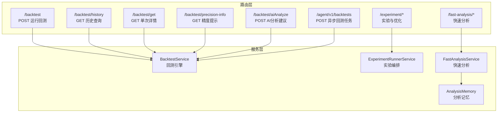
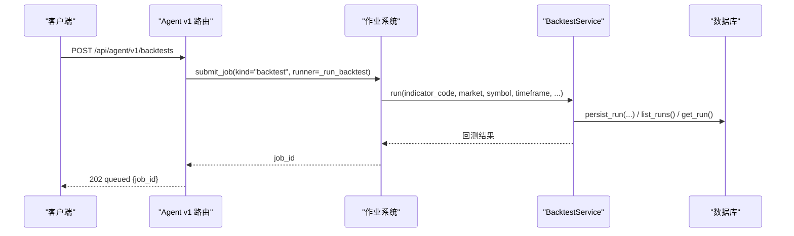
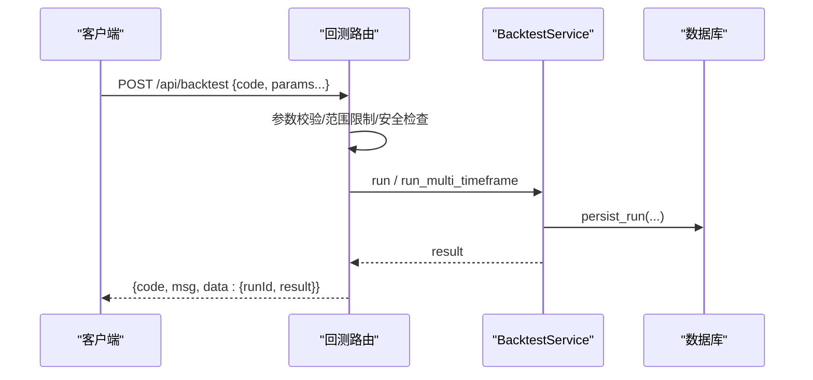
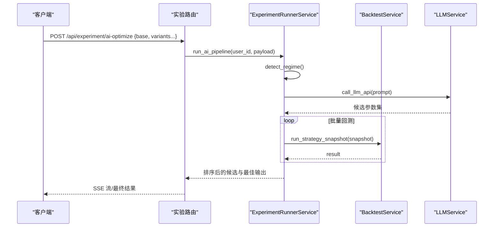
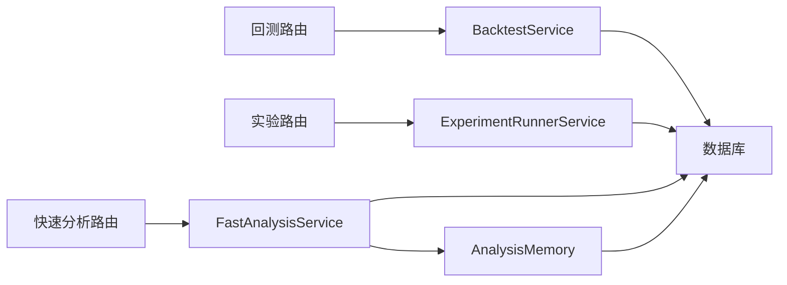

# 回测分析API

<cite>
**本文引用的文件**
- [backtest.py](file://backend_api_python/app/routes/backtest.py)
- [backtests.py](file://backend_api_python/app/routes/agent_v1/backtests.py)
- [backtest.py](file://backend_api_python/app/services/backtest.py)
- [experiment.py](file://backend_api_python/app/routes/experiment.py)
- [runner.py](file://backend_api_python/app/services/experiment/runner.py)
- [fast_analysis.py](file://backend_api_python/app/services/fast_analysis.py)
- [fast_analysis.py](file://backend_api_python/app/routes/fast_analysis.py)
- [analysis_memory.py](file://backend_api_python/app/services/analysis_memory.py)
- [agent-openapi.json](file://docs/agent/agent-openapi.json)
</cite>

## 目录
1. [简介](#简介)
2. [项目结构](#项目结构)
3. [核心组件](#核心组件)
4. [架构总览](#架构总览)
5. [详细组件分析](#详细组件分析)
6. [依赖分析](#依赖分析)
7. [性能考量](#性能考量)
8. [故障排查指南](#故障排查指南)
9. [结论](#结论)
10. [附录](#附录)

## 简介
本文件为QuantDinger回测分析API的权威参考文档，覆盖策略回测启动、进度查询、结果获取、AI辅助分析、组合优化与参数搜索、性能评估与可视化、以及并行与内存优化等能力。文档面向开发者与策略工程师，提供清晰的接口定义、参数说明、流程图与时序图，帮助快速集成与扩展。

## 项目结构
QuantDinger后端采用Flask蓝图组织路由，回测与实验相关功能集中在routes与services两个目录：
- 路由层：负责HTTP接口、鉴权、参数校验与错误返回
- 服务层：封装回测引擎、实验编排、快速分析、内存与持久化等业务逻辑

**图表来源**
- [backtest.py:149-376](file://backend_api_python/app/routes/backtest.py#L149-L376)
- [backtests.py:79-112](file://backend_api_python/app/routes/agent_v1/backtests.py#L79-L112)
- [backtest.py:64-142](file://backend_api_python/app/services/backtest.py#L64-L142)
- [experiment.py:42-158](file://backend_api_python/app/routes/experiment.py#L42-L158)
- [runner.py:32-609](file://backend_api_python/app/services/experiment/runner.py#L32-L609)
- [fast_analysis.py:113-304](file://backend_api_python/app/routes/fast_analysis.py#L113-L304)
- [fast_analysis.py:186-761](file://backend_api_python/app/services/fast_analysis.py#L186-L761)
- [analysis_memory.py:36-174](file://backend_api_python/app/services/analysis_memory.py#L36-L174)

**章节来源**
- [backtest.py:1-829](file://backend_api_python/app/routes/backtest.py#L1-L829)
- [backtests.py:1-112](file://backend_api_python/app/routes/agent_v1/backtests.py#L1-L112)
- [backtest.py:1-800](file://backend_api_python/app/services/backtest.py#L1-L800)
- [experiment.py:1-194](file://backend_api_python/app/routes/experiment.py#L1-L194)
- [runner.py:1-609](file://backend_api_python/app/services/experiment/runner.py#L1-L609)
- [fast_analysis.py:1-701](file://backend_api_python/app/routes/fast_analysis.py#L1-L701)
- [fast_analysis.py:1-800](file://backend_api_python/app/services/fast_analysis.py#L1-L800)
- [analysis_memory.py:1-957](file://backend_api_python/app/services/analysis_memory.py#L1-L957)

## 核心组件
- 回测路由与服务
  - 提供标准回测、历史查询、单次详情、精度提示、AI分析建议等接口
  - 支持多时间框架高精度回测（MTF），自动选择执行时间框架
- 实验与优化
  - 市场周期检测、LLM驱动多轮优化、结构化参数搜索、最佳策略保存
- 快速分析
  - 统一数据采集、单次LLM调用、相似模式检索、反馈与统计
- 分析记忆
  - 存储分析决策、相似模式匹配、结果校验与准确率统计

**章节来源**
- [backtest.py:149-376](file://backend_api_python/app/routes/backtest.py#L149-L376)
- [backtest.py:170-225](file://backend_api_python/app/services/backtest.py#L170-L225)
- [experiment.py:21-158](file://backend_api_python/app/routes/experiment.py#L21-L158)
- [runner.py:52-237](file://backend_api_python/app/services/experiment/runner.py#L52-L237)
- [fast_analysis.py:113-304](file://backend_api_python/app/routes/fast_analysis.py#L113-L304)
- [analysis_memory.py:513-584](file://backend_api_python/app/services/analysis_memory.py#L513-L584)

## 架构总览
回测分析API通过路由层接收请求，调用服务层执行回测或实验，必要时访问数据库与外部数据源。Agent v1提供异步回测作业提交，支持幂等与重放。

**图表来源**
- [backtests.py:79-112](file://backend_api_python/app/routes/agent_v1/backtests.py#L79-L112)
- [backtests.py:40-77](file://backend_api_python/app/routes/agent_v1/backtests.py#L40-L77)
- [backtest.py:233-342](file://backend_api_python/app/services/backtest.py#L233-L342)

**章节来源**
- [backtests.py:1-112](file://backend_api_python/app/routes/agent_v1/backtests.py#L1-L112)
- [backtest.py:233-342](file://backend_api_python/app/services/backtest.py#L233-L342)

## 详细组件分析

### 回测运行接口
- 接口：POST /api/backtest
- 功能：运行指标回测，支持多时间框架高精度回测（MTF）
- 关键参数：
  - indicatorCode/indicatorId：指标代码或ID
  - symbol/market/timeframe：标的、市场、时间框架
  - startDate/endDate：回测起止日期
  - initialCapital/commission/slippage/leverage：资金、手续费、滑点、杠杆
  - tradeDirection：方向（long/short/both）
  - strategyConfig：策略配置（风控、仓位、加仓等）
  - enableMtf：是否启用MTF（默认开启，仅加密市场）
  - persist：是否持久化（默认开启）
- 返回：runId + result（包含总收益、最大回撤、夏普、胜率、盈亏比、交易次数、交易明细、净值曲线等）

**图表来源**
- [backtest.py:149-376](file://backend_api_python/app/routes/backtest.py#L149-L376)
- [backtest.py:444-668](file://backend_api_python/app/services/backtest.py#L444-L668)

**章节来源**
- [backtest.py:149-376](file://backend_api_python/app/routes/backtest.py#L149-L376)
- [backtest.py:444-668](file://backend_api_python/app/services/backtest.py#L444-L668)

### 回测历史与详情
- 历史查询：GET /api/backtest/history
  - 查询当前用户的历史回测记录，支持分页与多维过滤（indicatorId、strategyId、symbol、market、timeframe）
- 单次详情：GET /api/backtest/get
  - 根据runId获取回测详情，包含完整结果与持久化元数据

**章节来源**
- [backtest.py:378-448](file://backend_api_python/app/routes/backtest.py#L378-L448)
- [backtest.py:344-418](file://backend_api_python/app/services/backtest.py#L344-L418)

### 回测精度提示与MTF
- 接口：GET /api/backtest/precision-info
  - 根据市场与日期范围返回推荐执行时间框架与预估K线数量
- 多时间框架回测（MTF）
  - 自动选择1m/5m执行时间框架，支持高精度模拟交易
  - 当不满足条件（如存在规模规则、信号时机不支持）时回退到标准回测

**章节来源**
- [backtest.py:112-146](file://backend_api_python/app/routes/backtest.py#L112-L146)
- [backtest.py:170-225](file://backend_api_python/app/services/backtest.py#L170-L225)
- [backtest.py:444-554](file://backend_api_python/app/services/backtest.py#L444-L554)

### AI分析建议
- 接口：POST /api/backtest/aiAnalyze
  - 输入：runIds（最多10条）
  - 输出：基于回测配置与结果的参数调优建议（启发式或OpenRouter模型）
  - 支持多语言本地化输出

**章节来源**
- [backtest.py:665-800](file://backend_api_python/app/routes/backtest.py#L665-L800)
- [backtest.py:451-662](file://backend_api_python/app/services/backtest.py#L451-L662)

### Agent v1 异步回测
- 接口：POST /api/agent/v1/backtests
  - 幂等提交，返回job_id；后续由代理轮询/jobs/{id}获取状态
  - 支持市场/标的白名单校验与限流

**章节来源**
- [backtests.py:79-112](file://backend_api_python/app/routes/agent_v1/backtests.py#L79-L112)
- [agent-openapi.json:192-202](file://docs/agent/agent-openapi.json#L192-L202)

### 实验与组合优化
- 市场周期检测：POST /api/experiment/regime/detect
- 传统网格/变体管道：POST /api/experiment/pipeline/run
- LLM多轮优化（SSE流）：POST /api/experiment/ai-optimize
- 同步版：POST /api/experiment/ai-optimize-sync
- 结构化参数搜索：POST /api/experiment/structured-tune
- 保存最佳策略：POST /api/experiment/save-strategy

**图表来源**
- [experiment.py:61-134](file://backend_api_python/app/routes/experiment.py#L61-L134)
- [runner.py:52-237](file://backend_api_python/app/services/experiment/runner.py#L52-L237)

**章节来源**
- [experiment.py:21-158](file://backend_api_python/app/routes/experiment.py#L21-L158)
- [runner.py:32-237](file://backend_api_python/app/services/experiment/runner.py#L32-L237)

### 快速分析API
- 接口：POST /api/fast-analysis/analyze
  - 支持异步提交（async_submit），返回任务ID与状态
  - 付费扣费与自动退款机制
- 类似模式检索：GET /api/fast-analysis/similar-patterns
- 历史管理：GET /api/fast-analysis/history, /api/fast-analysis/history/all, DELETE /api/fast-analysis/history/{id}
- 反馈：POST /api/fast-analysis/feedback
- 性能统计：GET /api/fast-analysis/performance

**章节来源**
- [fast_analysis.py:113-304](file://backend_api_python/app/routes/fast_analysis.py#L113-L304)
- [fast_analysis.py:186-761](file://backend_api_python/app/services/fast_analysis.py#L186-L761)
- [analysis_memory.py:513-584](file://backend_api_python/app/services/analysis_memory.py#L513-L584)

## 依赖分析
- 路由到服务的依赖
  - 回测路由依赖BacktestService进行数据获取、回测执行与持久化
  - 实验路由依赖ExperimentRunnerService进行多轮优化与批量回测
  - 快速分析路由依赖FastAnalysisService与AnalysisMemory进行数据采集、LLM分析与历史检索
- 外部依赖
  - 数据源工厂：根据市场类型选择数据源
  - LLM服务：OpenRouter（可选）与内部提示工程
  - 数据库：PostgreSQL，持久化回测运行、交易明细、净值点、分析记忆

**图表来源**
- [backtest.py:12-23](file://backend_api_python/app/routes/backtest.py#L12-L23)
- [backtest.py:17-22](file://backend_api_python/app/services/backtest.py#L17-L22)
- [experiment.py:11-18](file://backend_api_python/app/routes/experiment.py#L11-L18)
- [runner.py:13-23](file://backend_api_python/app/services/experiment/runner.py#L13-L23)
- [fast_analysis.py:18-18](file://backend_api_python/app/routes/fast_analysis.py#L18-L18)
- [fast_analysis.py:196-199](file://backend_api_python/app/services/fast_analysis.py#L196-L199)
- [analysis_memory.py:42-43](file://backend_api_python/app/services/analysis_memory.py#L42-L43)

**章节来源**
- [backtest.py:12-23](file://backend_api_python/app/routes/backtest.py#L12-L23)
- [backtest.py:17-22](file://backend_api_python/app/services/backtest.py#L17-L22)
- [experiment.py:11-18](file://backend_api_python/app/routes/experiment.py#L11-L18)
- [runner.py:13-23](file://backend_api_python/app/services/experiment/runner.py#L13-L23)
- [fast_analysis.py:18-18](file://backend_api_python/app/routes/fast_analysis.py#L18-L18)
- [fast_analysis.py:196-199](file://backend_api_python/app/services/fast_analysis.py#L196-L199)
- [analysis_memory.py:42-43](file://backend_api_python/app/services/analysis_memory.py#L42-L43)

## 性能考量
- 多时间框架回测（MTF）
  - 自动选择1m/5m执行时间框架，限制最长回测天数，避免过长窗口导致的内存与计算压力
  - 当不满足条件（如存在规模规则、信号时机不支持）时回退到标准回测
- 内存缓存
  - K线数据缓存（带TTL），减少重复外部API调用
- 异步与幂等
  - Agent v1回测支持幂等与重放，避免重复计算
  - 快速分析支持异步提交与自动退款，降低前端等待与资源占用
- 批量与排序
  - 实验服务对候选集进行评分与排序，减少无效回测次数

**章节来源**
- [backtest.py:25-61](file://backend_api_python/app/services/backtest.py#L25-L61)
- [backtest.py:444-554](file://backend_api_python/app/services/backtest.py#L444-L554)
- [backtests.py:94-100](file://backend_api_python/app/routes/agent_v1/backtests.py#L94-L100)
- [fast_analysis.py:206-241](file://backend_api_python/app/routes/fast_analysis.py#L206-L241)

## 故障排查指南
- 回测失败
  - 检查参数合法性（必填项、日期范围、时间框架限制）
  - 查看持久化错误日志，确认runId与错误信息
- AI分析建议失败
  - 若未配置OpenRouter密钥，将返回启发式建议；请检查环境变量与模型配置
- 快速分析异常
  - 检查付费扣费与退款流程，确认任务状态与错误消息
- 实验优化卡顿
  - 控制候选数量与轮次上限，合理设置earlyStopScore与maxRounds

**章节来源**
- [backtest.py:334-375](file://backend_api_python/app/routes/backtest.py#L334-L375)
- [backtest.py:340-342](file://backend_api_python/app/services/backtest.py#L340-L342)
- [fast_analysis.py:252-298](file://backend_api_python/app/routes/fast_analysis.py#L252-L298)
- [runner.py:134-146](file://backend_api_python/app/services/experiment/runner.py#L134-L146)

## 结论
QuantDinger回测分析API提供了从单次回测、历史管理、AI辅助建议，到实验优化与快速分析的全链路能力。通过MTF高精度回测、实验编排与分析记忆系统，能够支撑策略研发、参数优化与多策略对比分析。建议在生产环境中结合异步提交、内存缓存与合理的参数空间搜索，以获得更好的性能与稳定性。

## 附录

### 接口一览（摘要）
- 回测
  - POST /api/backtest
  - GET /api/backtest/history
  - GET /api/backtest/get
  - GET /api/backtest/precision-info
  - POST /api/backtest/aiAnalyze
- Agent v1
  - POST /api/agent/v1/backtests
- 实验与优化
  - POST /api/experiment/regime/detect
  - POST /api/experiment/pipeline/run
  - POST /api/experiment/ai-optimize
  - POST /api/experiment/ai-optimize-sync
  - POST /api/experiment/structured-tune
  - POST /api/experiment/save-strategy
- 快速分析
  - POST /api/fast-analysis/analyze
  - GET /api/fast-analysis/history
  - GET /api/fast-analysis/history/all
  - DELETE /api/fast-analysis/history/{id}
  - POST /api/fast-analysis/feedback
  - GET /api/fast-analysis/performance
  - GET /api/fast-analysis/similar-patterns

**章节来源**
- [backtest.py:149-448](file://backend_api_python/app/routes/backtest.py#L149-L448)
- [backtests.py:79-112](file://backend_api_python/app/routes/agent_v1/backtests.py#L79-L112)
- [experiment.py:21-194](file://backend_api_python/app/routes/experiment.py#L21-L194)
- [fast_analysis.py:113-701](file://backend_api_python/app/routes/fast_analysis.py#L113-L701)
- [agent-openapi.json:192-202](file://docs/agent/agent-openapi.json#L192-L202)