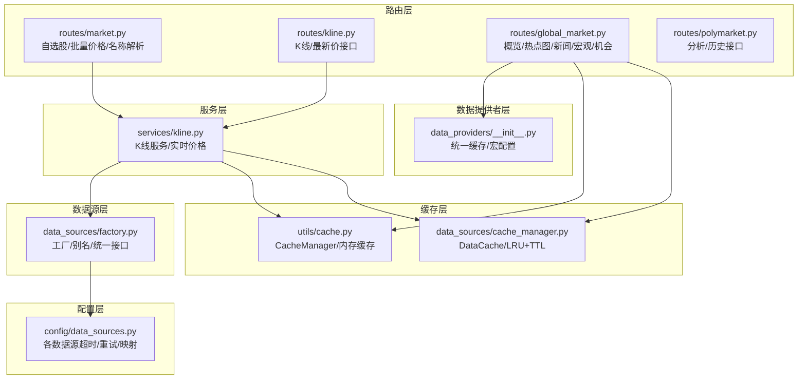
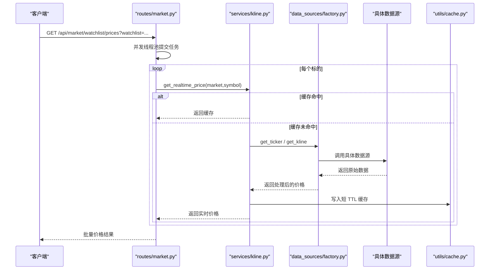
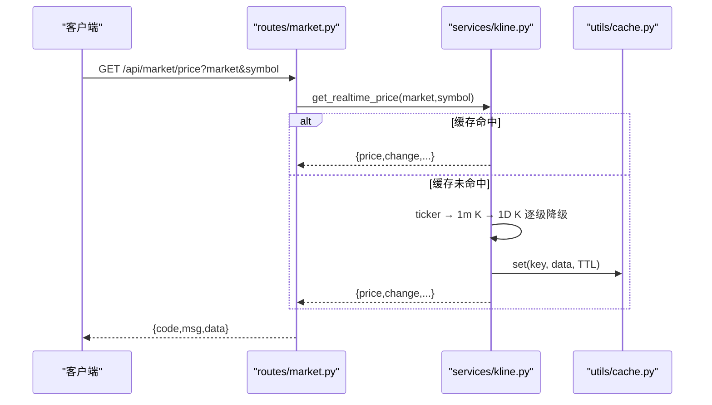
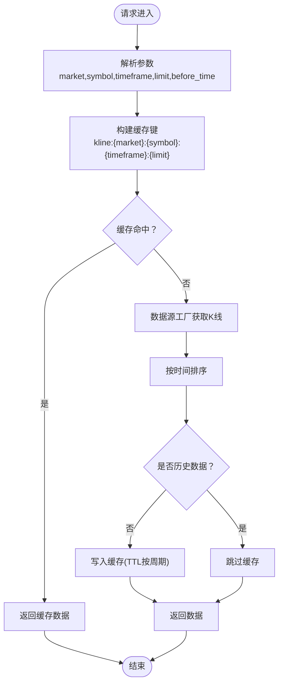
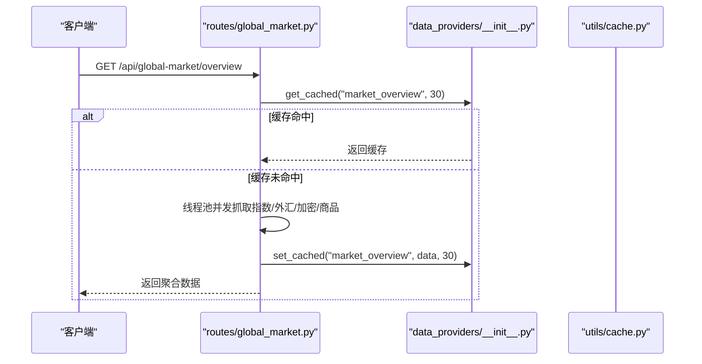
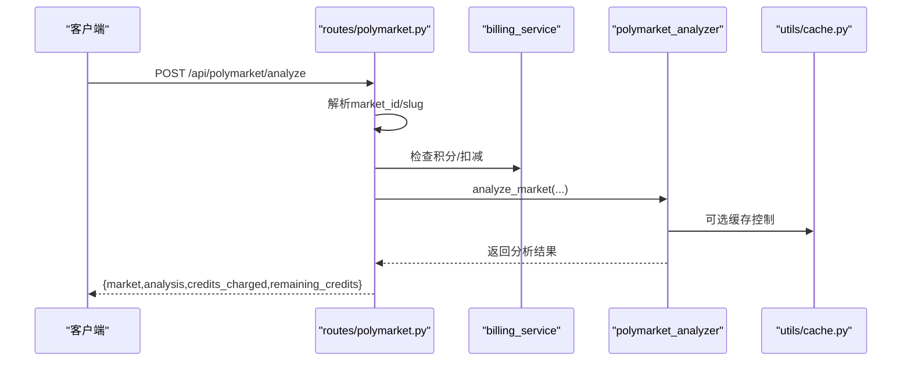
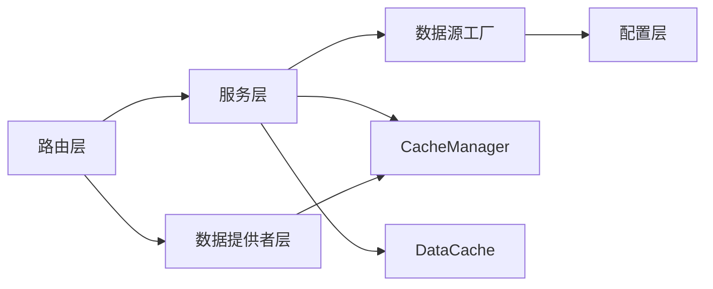

# 市场数据API

<cite>
**本文引用的文件**
- [backend_api_python/app/routes/market.py](file://backend_api_python/app/routes/market.py)
- [backend_api_python/app/routes/kline.py](file://backend_api_python/app/routes/kline.py)
- [backend_api_python/app/routes/global_market.py](file://backend_api_python/app/routes/global_market.py)
- [backend_api_python/app/routes/polymarket.py](file://backend_api_python/app/routes/polymarket.py)
- [backend_api_python/app/data_sources/factory.py](file://backend_api_python/app/data_sources/factory.py)
- [backend_api_python/app/services/kline.py](file://backend_api_python/app/services/kline.py)
- [backend_api_python/app/data_sources/cache_manager.py](file://backend_api_python/app/data_sources/cache_manager.py)
- [backend_api_python/app/utils/cache.py](file://backend_api_python/app/utils/cache.py)
- [backend_api_python/app/config/data_sources.py](file://backend_api_python/app/config/data_sources.py)
- [backend_api_python/app/data_providers/__init__.py](file://backend_api_python/app/data_providers/__init__.py)
</cite>

## 目录
1. [简介](#简介)
2. [项目结构](#项目结构)
3. [核心组件](#核心组件)
4. [架构总览](#架构总览)
5. [详细组件分析](#详细组件分析)
6. [依赖分析](#依赖分析)
7. [性能考虑](#性能考虑)
8. [故障排查指南](#故障排查指南)
9. [结论](#结论)
10. [附录](#附录)

## 简介
本文件为 QuantDinger 的市场数据 API 参考文档，覆盖以下能力：
- 实时行情与批量价格获取
- 历史 K 线数据查询与分页
- 多市场、多数据源聚合接口（全球市场概览、热点图、新闻、宏观情绪、机会扫描）
- 高级数据服务（Adanos 情绪、Polymarket 分析与历史）
- 数据格式、时间范围参数、分页机制与缓存策略
- 订阅与 WebSocket 推送现状说明（当前以轮询为主）

## 项目结构
围绕市场数据 API 的关键目录与文件：
- 路由层：提供公开与鉴权接口，负责参数校验、并发拉取与响应封装
- 服务层：K 线服务封装缓存与数据源工厂
- 数据源层：工厂模式按市场类型选择具体数据源，统一 K 线与实时报价接口
- 缓存层：本地内存缓存与可选 Redis 缓存，支持 TTL 与 LRU
- 数据提供者层：全局市场聚合接口，统一缓存 TTL 与并发抓取

图表来源
- [backend_api_python/app/routes/market.py:1-643](file://backend_api_python/app/routes/market.py#L1-L643)
- [backend_api_python/app/routes/kline.py:1-124](file://backend_api_python/app/routes/kline.py#L1-L124)
- [backend_api_python/app/routes/global_market.py:1-316](file://backend_api_python/app/routes/global_market.py#L1-L316)
- [backend_api_python/app/routes/polymarket.py:1-329](file://backend_api_python/app/routes/polymarket.py#L1-L329)
- [backend_api_python/app/services/kline.py:1-191](file://backend_api_python/app/services/kline.py#L1-L191)
- [backend_api_python/app/data_sources/factory.py:1-178](file://backend_api_python/app/data_sources/factory.py#L1-L178)
- [backend_api_python/app/utils/cache.py:1-129](file://backend_api_python/app/utils/cache.py#L1-L129)
- [backend_api_python/app/data_sources/cache_manager.py:1-233](file://backend_api_python/app/data_sources/cache_manager.py#L1-L233)
- [backend_api_python/app/config/data_sources.py:1-173](file://backend_api_python/app/config/data_sources.py#L1-L173)
- [backend_api_python/app/data_providers/__init__.py:1-86](file://backend_api_python/app/data_providers/__init__.py#L1-L86)

章节来源
- [backend_api_python/app/routes/market.py:1-643](file://backend_api_python/app/routes/market.py#L1-L643)
- [backend_api_python/app/routes/kline.py:1-124](file://backend_api_python/app/routes/kline.py#L1-L124)
- [backend_api_python/app/routes/global_market.py:1-316](file://backend_api_python/app/routes/global_market.py#L1-L316)
- [backend_api_python/app/routes/polymarket.py:1-329](file://backend_api_python/app/routes/polymarket.py#L1-L329)
- [backend_api_python/app/services/kline.py:1-191](file://backend_api_python/app/services/kline.py#L1-L191)
- [backend_api_python/app/data_sources/factory.py:1-178](file://backend_api_python/app/data_sources/factory.py#L1-L178)
- [backend_api_python/app/utils/cache.py:1-129](file://backend_api_python/app/utils/cache.py#L1-L129)
- [backend_api_python/app/data_sources/cache_manager.py:1-233](file://backend_api_python/app/data_sources/cache_manager.py#L1-L233)
- [backend_api_python/app/config/data_sources.py:1-173](file://backend_api_python/app/config/data_sources.py#L1-L173)
- [backend_api_python/app/data_providers/__init__.py:1-86](file://backend_api_python/app/data_providers/__init__.py#L1-L86)

## 核心组件
- 路由层
  - 自选股与批量价格：支持 watchlist 批量价格获取与单个价格查询，内部使用线程池并发抓取，带超时保护
  - K 线与最新价：提供 K 线查询与最新价格接口，支持时间范围与分页参数
  - 全球市场聚合：概览、热点图、新闻、经济日历、宏观情绪、机会扫描等
  - Polymarket 分析：按 URL/标题解析市场，计费扣减，AI 分析，历史查询
- 服务层
  - K 线服务：统一缓存策略、TTL、降级回退（ticker → 1m K → 1D K）
- 数据源层
  - 工厂模式：标准化市场别名，按市场类型返回对应数据源，统一 K 线与实时报价接口
- 缓存层
  - CacheManager：本地内存缓存或 Redis 缓存（可选），JSON 序列化
  - DataCache：LRU + TTL 的本地缓存实现，支持清理过期与统计
- 数据提供者层
  - 统一缓存 TTL 与并发抓取，支持强制刷新

章节来源
- [backend_api_python/app/routes/market.py:396-518](file://backend_api_python/app/routes/market.py#L396-L518)
- [backend_api_python/app/routes/kline.py:17-124](file://backend_api_python/app/routes/kline.py#L17-L124)
- [backend_api_python/app/routes/global_market.py:58-316](file://backend_api_python/app/routes/global_market.py#L58-L316)
- [backend_api_python/app/routes/polymarket.py:22-329](file://backend_api_python/app/routes/polymarket.py#L22-L329)
- [backend_api_python/app/services/kline.py:14-191](file://backend_api_python/app/services/kline.py#L14-L191)
- [backend_api_python/app/data_sources/factory.py:33-178](file://backend_api_python/app/data_sources/factory.py#L33-L178)
- [backend_api_python/app/utils/cache.py:49-129](file://backend_api_python/app/utils/cache.py#L49-L129)
- [backend_api_python/app/data_sources/cache_manager.py:44-233](file://backend_api_python/app/data_sources/cache_manager.py#L44-L233)
- [backend_api_python/app/data_providers/__init__.py:23-86](file://backend_api_python/app/data_providers/__init__.py#L23-L86)

## 架构总览
下图展示从路由到数据源与缓存的整体调用链。

图表来源
- [backend_api_python/app/routes/market.py:396-482](file://backend_api_python/app/routes/market.py#L396-L482)
- [backend_api_python/app/services/kline.py:74-191](file://backend_api_python/app/services/kline.py#L74-L191)
- [backend_api_python/app/data_sources/factory.py:114-178](file://backend_api_python/app/data_sources/factory.py#L114-L178)
- [backend_api_python/app/utils/cache.py:100-117](file://backend_api_python/app/utils/cache.py#L100-L117)

## 详细组件分析

### 实时行情与批量价格接口
- 接口清单
  - 单个价格：GET /api/market/price?market=&symbol=
  - 批量价格：GET /api/market/watchlist/prices?watchlist=[{"market":"...","symbol":"..."}]
  - 股票名称：POST /api/market/stock/name
- 关键行为
  - 批量价格使用线程池并发抓取，每个标的独立任务，带超时保护（默认 30 秒）
  - 实时价格优先使用 ticker 接口，失败则降级到 1 分钟 K 线，再降级到日线
  - 股票名称接口对 USStock 使用第三方库获取公司名称，并设置 1 天缓存
- 参数与返回
  - market：市场类型（Crypto、USStock、Forex、Futures、CNStock、HKStock、MOEX）
  - symbol：交易标的（如股票代码、加密货币交易对、外汇对）
  - watchlist：JSON 字符串数组，元素含 market 与 symbol
  - 返回字段：price、change、changePercent、high、low、open、previousClose、source

图表来源
- [backend_api_python/app/routes/market.py:484-518](file://backend_api_python/app/routes/market.py#L484-L518)
- [backend_api_python/app/services/kline.py:74-191](file://backend_api_python/app/services/kline.py#L74-L191)
- [backend_api_python/app/utils/cache.py:100-117](file://backend_api_python/app/utils/cache.py#L100-L117)

章节来源
- [backend_api_python/app/routes/market.py:396-518](file://backend_api_python/app/routes/market.py#L396-L518)
- [backend_api_python/app/services/kline.py:74-191](file://backend_api_python/app/services/kline.py#L74-L191)

### K 线数据查询与历史下载
- 接口清单
  - GET /api/kline/kline?market=&symbol=&timeframe=&limit=&before_time=
  - GET /api/kline/price?market=&symbol=
- 关键行为
  - K 线接口支持 limit 与 before_time（Unix 秒）进行历史回溯与分页
  - 实时价格接口已弃用，建议使用实时价格服务
  - 不同时间周期有不同的缓存 TTL
- 参数与返回
  - timeframe：1m、5m、15m、30m、1H、4H、1D、1W
  - before_time：Unix 时间戳，用于获取该时间之前的 K 线（历史回放）
  - 返回字段：按数据源约定的 K 线字段集合（包含时间、开盘、最高、最低、收盘、成交量等）

图表来源
- [backend_api_python/app/routes/kline.py:17-85](file://backend_api_python/app/routes/kline.py#L17-L85)
- [backend_api_python/app/services/kline.py:21-65](file://backend_api_python/app/services/kline.py#L21-L65)
- [backend_api_python/app/data_sources/factory.py:114-149](file://backend_api_python/app/data_sources/factory.py#L114-L149)

章节来源
- [backend_api_python/app/routes/kline.py:17-124](file://backend_api_python/app/routes/kline.py#L17-L124)
- [backend_api_python/app/services/kline.py:21-65](file://backend_api_python/app/services/kline.py#L21-L65)
- [backend_api_python/app/data_sources/factory.py:114-149](file://backend_api_python/app/data_sources/factory.py#L114-L149)

### 全球市场聚合接口
- 接口清单（均需登录）
  - GET /api/global-market/overview
  - GET /api/global-market/heatmap
  - GET /api/global-market/news?lang=(cn|en|all)
  - GET /api/global-market/calendar
  - GET /api/global-market/sentiment
  - GET /api/global-market/adanos-sentiment?tickers=&source=&days=
  - GET /api/global-market/opportunities?force=
  - POST /api/global-market/refresh
- 关键行为
  - 概览与热点图使用线程池并发抓取多类数据，统一缓存 TTL
  - 新闻与日历分别设置不同 TTL
  - 宏观情绪聚合多个指标，设置较长缓存 TTL
  - 机会扫描按市场并行分析，结果按 24 小时涨跌幅排序
  - 强制刷新接口清除缓存
- 参数与返回
  - lang：新闻语言过滤
  - days：Adanos 情绪分析天数
  - force：机会扫描强制刷新开关
  - 返回字段：按各子模块约定的数据结构

图表来源
- [backend_api_python/app/routes/global_market.py:58-113](file://backend_api_python/app/routes/global_market.py#L58-L113)
- [backend_api_python/app/data_providers/__init__.py:45-58](file://backend_api_python/app/data_providers/__init__.py#L45-L58)
- [backend_api_python/app/utils/cache.py:100-117](file://backend_api_python/app/utils/cache.py#L100-L117)

章节来源
- [backend_api_python/app/routes/global_market.py:58-316](file://backend_api_python/app/routes/global_market.py#L58-L316)
- [backend_api_python/app/data_providers/__init__.py:23-86](file://backend_api_python/app/data_providers/__init__.py#L23-L86)

### Polymarket 预测市场分析
- 接口清单
  - POST /api/polymarket/analyze（输入 URL 或标题，支持语言与模型参数）
  - GET /api/polymarket/history?page=&page_size=
- 关键行为
  - 解析 market_id 或 slug，获取市场详情
  - 计费系统检查与扣减积分（可选）
  - AI 分析完成后返回结果与剩余积分
  - 历史接口支持分页查询
- 参数与返回
  - 输入：input（URL 或标题）、language、model（可选）
  - 返回：market、analysis、credits_charged、remaining_credits

图表来源
- [backend_api_python/app/routes/polymarket.py:22-228](file://backend_api_python/app/routes/polymarket.py#L22-L228)
- [backend_api_python/app/utils/cache.py:100-117](file://backend_api_python/app/utils/cache.py#L100-L117)

章节来源
- [backend_api_python/app/routes/polymarket.py:22-329](file://backend_api_python/app/routes/polymarket.py#L22-L329)

### 数据格式定义与时间范围参数
- 市场类型
  - Crypto、USStock、Forex、Futures、CNStock、HKStock、MOEX
  - 工厂层提供别名映射与规范化
- 时间周期
  - K 线：1m、5m、15m、30m、1H、4H、1D、1W
  - YFinance 映射：1m、3m、5m、15m、30m、1H、4H、1D、1W
- 时间范围
  - limit：返回条数上限
  - before_time：Unix 秒，用于历史回溯
- 分页机制
  - 全局市场历史接口：GET /api/global-market/opportunities?force=
  - Polymarket 历史接口：GET /api/polymarket/history?page=&page_size=

章节来源
- [backend_api_python/app/data_sources/factory.py:14-50](file://backend_api_python/app/data_sources/factory.py#L14-L50)
- [backend_api_python/app/config/data_sources.py:83-94](file://backend_api_python/app/config/data_sources.py#L83-L94)
- [backend_api_python/app/routes/kline.py:17-85](file://backend_api_python/app/routes/kline.py#L17-L85)
- [backend_api_python/app/routes/polymarket.py:231-329](file://backend_api_python/app/routes/polymarket.py#L231-L329)

### 缓存策略与性能特征
- 缓存层次
  - CacheManager：本地内存缓存或 Redis 缓存（可选），统一 JSON 序列化
  - DataCache：LRU + TTL 的本地缓存实现，最大容量与命中率统计
- TTL 与命中
  - K 线服务：按时间周期设置不同 TTL，默认 5 分钟
  - 实时价格：30 秒（ticker/1m K），日线 5 分钟
  - 全局市场：概览 120s、新闻 180s、宏观情绪 6h、机会扫描 1h
- 性能特征
  - 批量价格使用线程池并发，受环境变量控制工作线程数
  - 数据源配置支持超时、重试与退避策略

章节来源
- [backend_api_python/app/utils/cache.py:49-129](file://backend_api_python/app/utils/cache.py#L49-L129)
- [backend_api_python/app/data_sources/cache_manager.py:44-233](file://backend_api_python/app/data_sources/cache_manager.py#L44-L233)
- [backend_api_python/app/services/kline.py:17-65](file://backend_api_python/app/services/kline.py#L17-L65)
- [backend_api_python/app/data_providers/__init__.py:23-34](file://backend_api_python/app/data_providers/__init__.py#L23-L34)
- [backend_api_python/app/config/data_sources.py:8-28](file://backend_api_python/app/config/data_sources.py#L8-L28)

### WebSocket 推送与订阅现状
- 当前实现
  - SSE（Server-Sent Events）用于实验与指标流式输出
  - 市场数据 API 未提供 WebSocket 推送
- 建议
  - 若需实时推送，可在前端使用 SSE 或引入 WebSocket 服务

章节来源
- [backend_api_python/app/routes/agent_v1/jobs.py:45-108](file://backend_api_python/app/routes/agent_v1/jobs.py#L45-L108)
- [backend_api_python/app/routes/experiment.py:64-120](file://backend_api_python/app/routes/experiment.py#L64-L120)
- [backend_api_python/app/routes/indicator.py:722-1185](file://backend_api_python/app/routes/indicator.py#L722-L1185)

## 依赖分析
- 组件耦合
  - 路由层依赖服务层与工具层（缓存、日志、认证）
  - 服务层依赖数据源工厂与缓存层
  - 数据源工厂依赖各具体数据源模块与配置层
  - 数据提供者层依赖缓存层与并发抓取
- 外部依赖
  - 第三方库：yfinance（股票名称）、ccxt（加密市场动态搜索）
  - 可选 Redis：通过配置启用

图表来源
- [backend_api_python/app/routes/market.py:1-643](file://backend_api_python/app/routes/market.py#L1-L643)
- [backend_api_python/app/routes/kline.py:1-124](file://backend_api_python/app/routes/kline.py#L1-L124)
- [backend_api_python/app/routes/global_market.py:1-316](file://backend_api_python/app/routes/global_market.py#L1-L316)
- [backend_api_python/app/services/kline.py:1-191](file://backend_api_python/app/services/kline.py#L1-L191)
- [backend_api_python/app/data_sources/factory.py:1-178](file://backend_api_python/app/data_sources/factory.py#L1-L178)
- [backend_api_python/app/utils/cache.py:1-129](file://backend_api_python/app/utils/cache.py#L1-L129)
- [backend_api_python/app/data_sources/cache_manager.py:1-233](file://backend_api_python/app/data_sources/cache_manager.py#L1-L233)
- [backend_api_python/app/config/data_sources.py:1-173](file://backend_api_python/app/config/data_sources.py#L1-L173)
- [backend_api_python/app/data_providers/__init__.py:1-86](file://backend_api_python/app/data_providers/__init__.py#L1-L86)

## 性能考虑
- 并发与限流
  - 批量价格使用线程池并发，受环境变量控制工作线程数
  - 数据源配置支持超时、重试与退避
- 缓存优化
  - K 线与实时价格采用短 TTL，避免频繁外部请求
  - 全局市场聚合设置合理 TTL，降低重复抓取
- 存储与容量
  - DataCache 支持 LRU 淘汰，防止内存膨胀

章节来源
- [backend_api_python/app/routes/market.py:34-41](file://backend_api_python/app/routes/market.py#L34-L41)
- [backend_api_python/app/config/data_sources.py:8-28](file://backend_api_python/app/config/data_sources.py#L8-L28)
- [backend_api_python/app/data_sources/cache_manager.py:114-158](file://backend_api_python/app/data_sources/cache_manager.py#L114-L158)

## 故障排查指南
- 常见错误与提示
  - 缺少必要参数：返回缺失字段提示
  - Forex 1 分钟数据：提示需付费订阅
  - 无数据：返回空数组并附带友好提示
- 日志与追踪
  - 各路由捕获异常并记录堆栈，便于定位问题
- 缓存问题
  - 强制刷新：使用全局市场刷新接口清除缓存
  - 检查 Redis 连接状态或切换为本地缓存

章节来源
- [backend_api_python/app/routes/kline.py:57-84](file://backend_api_python/app/routes/kline.py#L57-L84)
- [backend_api_python/app/routes/global_market.py:306-316](file://backend_api_python/app/routes/global_market.py#L306-L316)
- [backend_api_python/app/utils/cache.py:94-98](file://backend_api_python/app/utils/cache.py#L94-L98)

## 结论
QuantDinger 的市场数据 API 提供了从实时行情、K 线历史到全球市场聚合与高级分析的完整能力。通过工厂模式与统一缓存策略，系统在多市场、多数据源场景下实现了高可用与高性能。若需进一步提升实时性，可在现有 SSE 能力基础上扩展 WebSocket 推送。

## 附录
- 环境变量与配置要点
  - MARKET_EXECUTOR_WORKERS：批量价格线程池工作线程数
  - DATA_SOURCE_TIMEOUT/RETRY/RETRY_BACKOFF：数据源超时与重试
  - CCXT_DEFAULT_EXCHANGE/PROXY：加密数据源默认交易所与代理
  - CACHE_ENABLED/Redis 配置：启用 Redis 缓存

章节来源
- [backend_api_python/app/routes/market.py:34-39](file://backend_api_python/app/routes/market.py#L34-L39)
- [backend_api_python/app/config/data_sources.py:8-28](file://backend_api_python/app/config/data_sources.py#L8-L28)
- [backend_api_python/app/config/data_sources.py:102-148](file://backend_api_python/app/config/data_sources.py#L102-L148)
- [backend_api_python/app/utils/cache.py:72-98](file://backend_api_python/app/utils/cache.py#L72-L98)