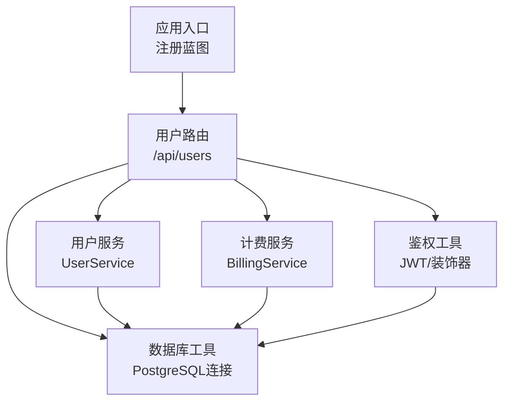
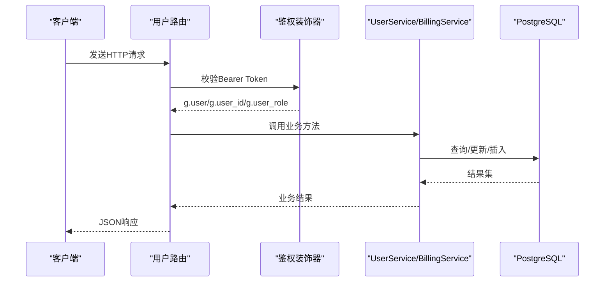
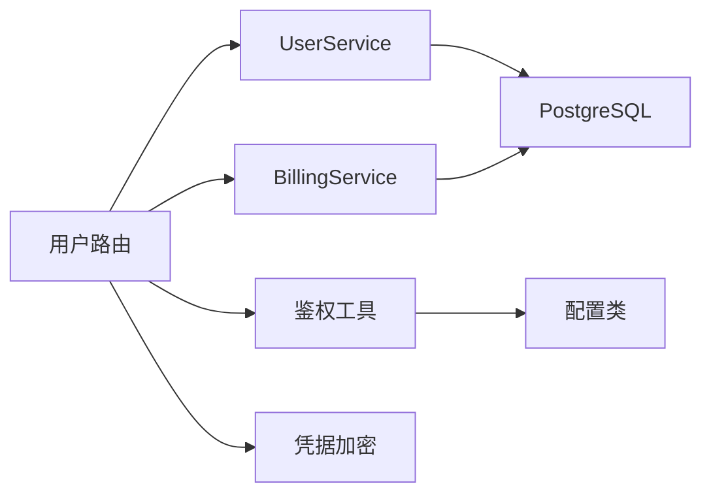

# 用户管理API

<cite>
**本文引用的文件**
- [backend_api_python/app/routes/user.py](file://backend_api_python/app/routes/user.py)
- [backend_api_python/app/services/user_service.py](file://backend_api_python/app/services/user_service.py)
- [backend_api_python/app/utils/auth.py](file://backend_api_python/app/utils/auth.py)
- [backend_api_python/app/services/billing_service.py](file://backend_api_python/app/services/billing_service.py)
- [backend_api_python/app/routing注册路由](file://backend_api_python/app/routes/__init__.py)
- [backend_api_python/app/config/settings.py](file://backend_api_python/app/config/settings.py)
- [backend_api_python/app/utils/db.py](file://backend_api_python/app/utils/db.py)
- [backend_api_python/app/utils/credential_crypto.py](file://backend_api_python/app/utils/credential_crypto.py)
- [backend_api_python/app/routes/credentials.py](file://backend_api_python/app/routes/credentials.py)
- [backend_api_python/app/services/security_service.py](file://backend_api_python/app/services/security_service.py)
- [backend_api_python/migrations/init.sql](file://backend_api_python/migrations/init.sql)
</cite>

## 目录
1. [简介](#简介)
2. [项目结构](#项目结构)
3. [核心组件](#核心组件)
4. [架构总览](#架构总览)
5. [详细组件分析](#详细组件分析)
6. [依赖分析](#依赖分析)
7. [性能考虑](#性能考虑)
8. [故障排查指南](#故障排查指南)
9. [结论](#结论)
10. [附录](#附录)

## 简介
本文件为 QuantDinger 的“用户管理API”完整参考文档，覆盖用户信息查询、更新、删除、密码重置、角色与权限、计费与会员管理、个人资料与通知设置、凭据加密存储、以及安全与访问控制等能力。文档面向开发者与运维人员，提供端点定义、参数说明、响应格式、错误处理与安全策略。

## 项目结构
用户管理API位于后端Python服务中，采用Flask蓝图组织路由，并通过服务层与数据库交互。路由注册在应用启动时完成，用户相关端点挂载于 /api/users 前缀下。

图示来源
- [backend_api_python/app/routes/__init__.py:7-58](file://backend_api_python/app/routes/__init__.py#L7-L58)
- [backend_api_python/app/routes/user.py:1-100](file://backend_api_python/app/routes/user.py#L1-L100)

章节来源
- [backend_api_python/app/routes/__init__.py:7-58](file://backend_api_python/app/routes/__init__.py#L7-L58)
- [backend_api_python/app/routes/user.py:1-100](file://backend_api_python/app/routes/user.py#L1-L100)

## 核心组件
- 路由层：提供用户管理与个人中心相关HTTP端点，含管理员端与自服务端两类。
- 服务层：
  - UserService：用户CRUD、认证、密码哈希/校验、角色权限、默认看板种子数据等。
  - BillingService：积分余额、消费、充值、会员状态与套餐、积分日志。
- 鉴权与安全：JWT生成/校验、单设备登录强制、管理员/经理权限校验、登录尝试与验证码风控。
- 数据层：PostgreSQL模式与索引，用户表、积分日志、安全审计等。
- 凭据加密：基于Fernet的凭据加密/解密，密钥来自环境变量。

章节来源
- [backend_api_python/app/services/user_service.py:56-701](file://backend_api_python/app/services/user_service.py#L56-L701)
- [backend_api_python/app/services/billing_service.py:47-758](file://backend_api_python/app/services/billing_service.py#L47-L758)
- [backend_api_python/app/utils/auth.py:18-239](file://backend_api_python/app/utils/auth.py#L18-L239)
- [backend_api_python/migrations/init.sql:8-31](file://backend_api_python/migrations/init.sql#L8-L31)

## 架构总览
用户管理API遵循“路由-服务-数据”的分层设计，所有请求均需通过鉴权中间件；管理员端额外受角色限制；个人中心端点仅限已登录用户访问。

图示来源
- [backend_api_python/app/utils/auth.py:126-186](file://backend_api_python/app/utils/auth.py#L126-L186)
- [backend_api_python/app/routes/user.py:41-117](file://backend_api_python/app/routes/user.py#L41-L117)
- [backend_api_python/app/services/user_service.py:102-151](file://backend_api_python/app/services/user_service.py#L102-L151)
- [backend_api_python/app/services/billing_service.py:98-116](file://backend_api_python/app/services/billing_service.py#L98-L116)

## 详细组件分析

### 用户管理（管理员）
- 端点列表
  - GET /api/users/list：分页列出用户，支持关键词搜索
  - GET /api/users/export：导出用户CSV（Excel友好）
  - GET /api/users/detail?id=：按ID获取用户详情
  - POST /api/users/create：创建用户（用户名、密码、邮箱、昵称、角色）
  - PUT /api/users/update?id=：更新用户信息（邮箱、昵称、头像、角色、状态、时区）
  - DELETE /api/users/delete?id=：删除用户（禁止删除自身）
  - POST /api/users/reset-password：重置用户密码（管理员）
  - GET /api/users/roles：获取可用角色及权限
  - POST /api/users/set-credits：设置用户积分（管理员）
  - POST /api/users/set-vip：设置用户VIP（管理员）
  - GET /api/users/credits-log：查看用户积分日志（管理员）

- 参数与响应
  - 分页参数：page/page_size（最大100），search（用户名/邮箱/昵称）
  - 创建/更新字段：用户名必填，密码≥6（创建时），角色限定，状态/时区校验
  - 删除限制：禁止删除当前登录用户
  - 积分设置：非负整数，备注可选
  - VIP设置：提供天数或ISO时间戳二选一，0或无效输入可取消VIP
  - 响应统一结构：{code,msg,data}

- 错误处理
  - 缺少参数：400
  - 权限不足：403
  - 未认证：401
  - 业务异常：500

章节来源
- [backend_api_python/app/routes/user.py:41-416](file://backend_api_python/app/routes/user.py#L41-L416)
- [backend_api_python/app/services/user_service.py:314-454](file://backend_api_python/app/services/user_service.py#L314-L454)
- [backend_api_python/app/services/billing_service.py:579-673](file://backend_api_python/app/services/billing_service.py#L579-L673)

### 个人中心（自服务）
- 端点列表
  - GET /api/users/profile：获取当前用户资料（含权限、计费信息、通知设置）
  - PUT /api/users/profile/update：更新当前用户资料（昵称、头像、时区）
  - GET /api/users/my-credits-log：获取当前用户积分日志
  - GET /api/users/my-referrals：获取当前用户推荐列表与奖励配置
  - GET /api/users/notification-settings：获取通知设置
  - PUT /api/users/notification-settings：更新通知设置（渠道、机器人、Webhook、电话等）
  - GET /api/users/chart-templates：获取用户图表模板（指标布局）
  - POST /api/users/chart-templates：保存用户图表模板

- 参数与响应
  - 时区：IANA标识符，长度≤64
  - 通知设置：默认通道、Telegram/Discord/Webhook/邮件/电话等
  - 推荐：返回推荐列表、总数、邀请码、奖励配置（来自环境变量）
  - 图表模板：JSON数组，按更新时间倒序

- 安全与访问控制
  - 所有端点需Bearer Token
  - 仅能修改自身资料（邮箱不可改，需管理员在后台修改）

章节来源
- [backend_api_python/app/routes/user.py:418-800](file://backend_api_python/app/routes/user.py#L418-L800)
- [backend_api_python/app/services/billing_service.py:729-745](file://backend_api_python/app/services/billing_service.py#L729-L745)

### 角色与权限
- 角色层级：viewer → user → manager → admin
- 权限映射：不同角色具备不同功能权限集合
- 装饰器：
  - @login_required：强制Bearer Token
  - @admin_required：管理员
  - @manager_required：管理员/经理
  - @permission_required(permission)：细粒度权限校验

章节来源
- [backend_api_python/app/services/user_service.py:59-68](file://backend_api_python/app/services/user_service.py#L59-L68)
- [backend_api_python/app/utils/auth.py:160-217](file://backend_api_python/app/utils/auth.py#L160-L217)

### 计费与会员
- 积分
  - 查询余额、消费、充值、管理员调整、日志分页
  - 功能计费配置来源于环境变量（可经系统设置界面配置）
- 会员（VIP）
  - 设置到期时间或取消
  - 会员计划：月卡、年卡、终身卡（含月度积分发放）
- 会话强制失效
  - 通过递增token_version实现单设备登录

章节来源
- [backend_api_python/app/services/billing_service.py:47-758](file://backend_api_python/app/services/billing_service.py#L47-L758)
- [backend_api_python/app/services/user_service.py:248-313](file://backend_api_python/app/services/user_service.py#L248-L313)
- [backend_api_python/app/utils/auth.py:82-114](file://backend_api_python/app/utils/auth.py#L82-L114)

### 凭据存储（加密）
- 存储位置：qd_exchange_credentials表，加密字段为encrypted_config
- 加密算法：Fernet（基于SECRET_KEY的派生密钥）
- 支持交易所：加密存储apiKey/secretKey/passphrase等
- 端点：列出、创建、删除、获取（获取返回解密后的配置）

章节来源
- [backend_api_python/app/routes/credentials.py:55-310](file://backend_api_python/app/routes/credentials.py#L55-L310)
- [backend_api_python/app/utils/credential_crypto.py:17-50](file://backend_api_python/app/utils/credential_crypto.py#L17-L50)
- [backend_api_python/migrations/init.sql:1-200](file://backend_api_python/migrations/init.sql#L1-L200)

### 数据模型与索引
- 用户表：包含用户名、邮箱、角色、状态、积分、VIP、通知设置、图表模板、时区、token版本、登录时间等
- 积分日志：记录充值、消费、退款、管理员调整、VIP变更等
- 安全审计：登录/注册/重置密码等事件记录

章节来源
- [backend_api_python/migrations/init.sql:8-31](file://backend_api_python/migrations/init.sql#L8-L31)
- [backend_api_python/migrations/init.sql:42-57](file://backend_api_python/migrations/init.sql#L42-L57)

### API端点一览（管理员）
- GET /api/users/list
  - 查询参数：page/page_size/search
  - 响应：items,total,page,page_size,total_pages
- GET /api/users/export
  - 响应：CSV文件流
- GET /api/users/detail
  - 查询参数：id
  - 响应：用户对象
- POST /api/users/create
  - 请求体：username,password,email,nickname,role
  - 响应：{id}
- PUT /api/users/update
  - 查询参数：id
  - 请求体：email,nickname,avatar,role,status,timezone
- DELETE /api/users/delete
  - 查询参数：id
- POST /api/users/reset-password
  - 请求体：user_id,new_password
- GET /api/users/roles
  - 响应：roles数组
- POST /api/users/set-credits
  - 请求体：user_id,credits,remark
- POST /api/users/set-vip
  - 请求体：user_id,vip_days或vip_expires_at,remark
- GET /api/users/credits-log
  - 查询参数：user_id,page,page_size

章节来源
- [backend_api_python/app/routes/user.py:41-416](file://backend_api_python/app/routes/user.py#L41-L416)

### API端点一览（自服务）
- GET /api/users/profile
  - 响应：用户对象（含permissions、billing、notification_settings）
- PUT /api/users/profile/update
  - 请求体：nickname,avatar,timezone
- GET /api/users/my-credits-log
  - 查询参数：page,page_size
- GET /api/users/my-referrals
  - 查询参数：page,page_size
  - 响应：list,total,page,page_size,referral_code,referral_bonus,register_bonus
- GET /api/users/notification-settings
  - 响应：通知设置对象（含默认通道、各平台配置）
- PUT /api/users/notification-settings
  - 请求体：default_channels,telegram_bot_token,telegram_chat_id,email,discord_webhook,webhook_url,webhook_token,phone
- GET /api/users/chart-templates
  - 响应：模板数组（按更新时间倒序）
- POST /api/users/chart-templates
  - 请求体：模板数组（JSON）

章节来源
- [backend_api_python/app/routes/user.py:418-800](file://backend_api_python/app/routes/user.py#L418-L800)

### 安全与访问控制
- 鉴权
  - JWT签名算法：HS256
  - token_version：强制单设备登录，服务端校验与数据库一致
- 权限
  - 角色与权限映射，细粒度权限装饰器
- 登录风控
  - 登录尝试记录、失败次数统计、IP/账户封禁窗口
  - 验证码发送频率限制
- 配置
  - SECRET_KEY必须在生产环境更改
  - 可选Cloudflare Turnstile人机验证

章节来源
- [backend_api_python/app/utils/auth.py:18-114](file://backend_api_python/app/utils/auth.py#L18-L114)
- [backend_api_python/app/services/security_service.py:26-399](file://backend_api_python/app/services/security_service.py#L26-L399)
- [backend_api_python/app/config/settings.py:32-42](file://backend_api_python/app/config/settings.py#L32-L42)

## 依赖分析
- 路由到服务
  - 用户路由依赖UserService与BillingService
  - 计费日志与会员状态查询依赖数据库
- 服务到数据
  - UserService/BillingService通过db工具获取连接
  - 凭据加密依赖credential_crypto工具
- 鉴权到配置
  - SECRET_KEY来自配置类，用于JWT签名与Fernet密钥派生

图示来源
- [backend_api_python/app/routes/user.py:1-50](file://backend_api_python/app/routes/user.py#L1-L50)
- [backend_api_python/app/utils/db.py:19-25](file://backend_api_python/app/utils/db.py#L19-L25)
- [backend_api_python/app/utils/credential_crypto.py:17-22](file://backend_api_python/app/utils/credential_crypto.py#L17-L22)
- [backend_api_python/app/config/settings.py:32-42](file://backend_api_python/app/config/settings.py#L32-L42)

章节来源
- [backend_api_python/app/utils/db.py:19-25](file://backend_api_python/app/utils/db.py#L19-L25)
- [backend_api_python/app/utils/credential_crypto.py:17-22](file://backend_api_python/app/utils/credential_crypto.py#L17-L22)
- [backend_api_python/app/config/settings.py:32-42](file://backend_api_python/app/config/settings.py#L32-L42)

## 性能考虑
- 分页与限制
  - 列表与日志默认page_size上限为100，避免过大响应
- 数据库索引
  - 用户表与日志表建立必要索引，提升查询效率
- 密钥与加密
  - SECRET_KEY仅用于派生Fernet密钥，避免明文存储
- 速率限制
  - 登录尝试与验证码发送存在窗口与配额限制，降低暴力破解风险

## 故障排查指南
- 401 未认证
  - 检查Authorization头是否为Bearer Token
  - 确认Token未过期且token_version与数据库一致
- 403 权限不足
  - 确认用户角色满足端点要求（admin/manager）
  - 检查具体权限装饰器是否匹配
- 400 参数错误
  - 校验必填字段、时区格式、密码长度、积分非负等
- 500 服务器错误
  - 查看后端日志定位异常堆栈
  - 确认数据库连接可用与表结构完整

章节来源
- [backend_api_python/app/utils/auth.py:126-186](file://backend_api_python/app/utils/auth.py#L126-L186)
- [backend_api_python/app/services/security_service.py:200-241](file://backend_api_python/app/services/security_service.py#L200-L241)

## 结论
QuantDinger的用户管理API以清晰的分层架构实现用户全生命周期管理，结合JWT鉴权、角色权限、登录风控与凭据加密，保障了安全性与可维护性。管理员端提供完善的用户治理能力，个人中心端提供便捷的自助服务能力。建议在生产环境中严格配置SECRET_KEY、启用Turnstile、合理设置速率限制与日志留存策略。

## 附录
- 统一响应结构
  - 成功：{code:1,msg:"success",data:...}
  - 失败：{code:0,msg:"错误信息",data:null}
  - 未认证：{code:401,msg:"Token missing/invalid/expired",data:null}
  - 权限不足：{code:403,msg:"Admin/Manager access required 或 权限不足",data:null}
- 时区与时钟
  - 时区字段支持IANA标识符，为空表示跟随客户端
  - 积分日志创建时间统一为UTC，便于前端正确显示