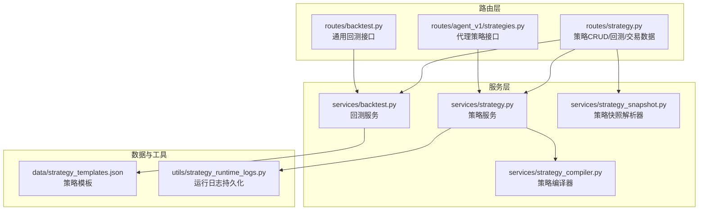
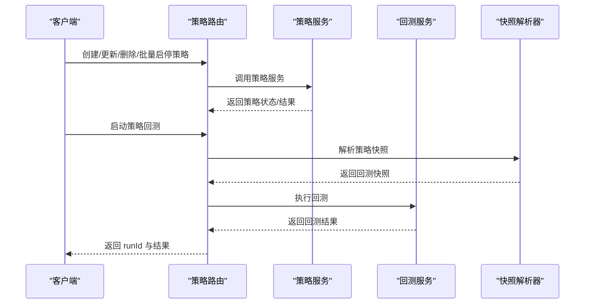
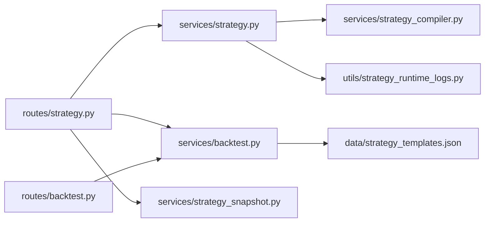

# 策略管理API

<cite>
**本文档引用的文件**
- [backend_api_python/app/routes/strategy.py](file://backend_api_python/app/routes/strategy.py)
- [backend_api_python/app/routes/backtest.py](file://backend_api_python/app/routes/backtest.py)
- [backend_api_python/app/services/strategy.py](file://backend_api_python/app/services/strategy.py)
- [backend_api_python/app/services/backtest.py](file://backend_api_python/app/services/backtest.py)
- [backend_api_python/app/services/strategy_compiler.py](file://backend_api_python/app/services/strategy_compiler.py)
- [backend_api_python/app/services/strategy_snapshot.py](file://backend_api_python/app/services/strategy_snapshot.py)
- [backend_api_python/app/data/strategy_templates.json](file://backend_api_python/app/data/strategy_templates.json)
- [backend_api_python/app/utils/strategy_runtime_logs.py](file://backend_api_python/app/utils/strategy_runtime_logs.py)
- [backend_api_python/app/routers/agent_v1/strategies.py](file://backend_api_python/app/routes/agent_v1/strategies.py)
</cite>

## 目录
1. [简介](#简介)
2. [项目结构](#项目结构)
3. [核心组件](#核心组件)
4. [架构总览](#架构总览)
5. [详细组件分析](#详细组件分析)
6. [依赖关系分析](#依赖关系分析)
7. [性能考量](#性能考量)
8. [故障排查指南](#故障排查指南)
9. [结论](#结论)
10. [附录](#附录)

## 简介
本文件为 QuantDinger 策略管理 API 的权威参考文档，覆盖策略全生命周期管理（创建、编辑、删除、批量启停、部署、执行）、策略代码上传与编译校验、参数配置与快照保存、回测启动与结果查询、性能评估、策略模板与内置指标库调用、代码质量检查、执行状态监控与调试接口等能力。文档面向开发者与运维人员，既提供接口规范，也给出架构图与流程图帮助理解。

## 项目结构
QuantDinger 后端采用 Flask 微服务架构，策略相关能力主要集中在 routes 与 services 两大模块：
- routes 层：定义 HTTP 接口与路由，负责参数解析、鉴权、错误处理与响应封装。
- services 层：实现业务逻辑，如策略服务、回测服务、编译器、快照解析器等。

图表来源
- [backend_api_python/app/routes/strategy.py:1-2014](file://backend_api_python/app/routes/strategy.py#L1-L2014)
- [backend_api_python/app/routes/backtest.py:1-829](file://backend_api_python/app/routes/backtest.py#L1-L829)
- [backend_api_python/app/services/strategy.py:1-1374](file://backend_api_python/app/services/strategy.py#L1-L1374)
- [backend_api_python/app/services/backtest.py:1-4974](file://backend_api_python/app/services/backtest.py#L1-L4974)
- [backend_api_python/app/services/strategy_compiler.py:1-689](file://backend_api_python/app/services/strategy_compiler.py#L1-L689)
- [backend_api_python/app/services/strategy_snapshot.py:1-220](file://backend_api_python/app/services/strategy_snapshot.py#L1-L220)
- [backend_api_python/app/data/strategy_templates.json:1-191](file://backend_api_python/app/data/strategy_templates.json#L1-L191)
- [backend_api_python/app/utils/strategy_runtime_logs.py:1-30](file://backend_api_python/app/utils/strategy_runtime_logs.py#L1-L30)

章节来源
- [backend_api_python/app/routes/strategy.py:1-2014](file://backend_api_python/app/routes/strategy.py#L1-L2014)
- [backend_api_python/app/routes/backtest.py:1-829](file://backend_api_python/app/routes/backtest.py#L1-L829)
- [backend_api_python/app/services/strategy.py:1-1374](file://backend_api_python/app/services/strategy.py#L1-L1374)
- [backend_api_python/app/services/backtest.py:1-4974](file://backend_api_python/app/services/backtest.py#L1-L4974)
- [backend_api_python/app/services/strategy_compiler.py:1-689](file://backend_api_python/app/services/strategy_compiler.py#L1-L689)
- [backend_api_python/app/services/strategy_snapshot.py:1-220](file://backend_api_python/app/services/strategy_snapshot.py#L1-L220)
- [backend_api_python/app/data/strategy_templates.json:1-191](file://backend_api_python/app/data/strategy_templates.json#L1-L191)
- [backend_api_python/app/utils/strategy_runtime_logs.py:1-30](file://backend_api_python/app/utils/strategy_runtime_logs.py#L1-L30)

## 核心组件
- 策略路由与控制器：提供策略 CRUD、批量启停、回测、交易与持仓查询、模板与代码质量检查等接口。
- 策略服务：封装策略数据访问、状态更新、批量启停、交易对与交易所连通性测试等。
- 回测服务：提供标准回测与多时间框架回测、结果持久化、历史查询、指标计算与精度建议。
- 策略编译器：将配置转换为可执行策略脚本。
- 快照解析器：将策略配置解析为回测所需的快照对象。
- 策略模板：内置多种策略模板供导入。
- 运行日志工具：持久化策略运行日志，便于调试。

章节来源
- [backend_api_python/app/routes/strategy.py:295-776](file://backend_api_python/app/routes/strategy.py#L295-L776)
- [backend_api_python/app/services/strategy.py:14-1374](file://backend_api_python/app/services/strategy.py#L14-L1374)
- [backend_api_python/app/services/backtest.py:64-4974](file://backend_api_python/app/services/backtest.py#L64-L4974)
- [backend_api_python/app/services/strategy_compiler.py:1-689](file://backend_api_python/app/services/strategy_compiler.py#L1-L689)
- [backend_api_python/app/services/strategy_snapshot.py:7-220](file://backend_api_python/app/services/strategy_snapshot.py#L7-L220)
- [backend_api_python/app/data/strategy_templates.json:1-191](file://backend_api_python/app/data/strategy_templates.json#L1-L191)
- [backend_api_python/app/utils/strategy_runtime_logs.py:1-30](file://backend_api_python/app/utils/strategy_runtime_logs.py#L1-L30)

## 架构总览
策略管理 API 的典型调用链路如下：

图表来源
- [backend_api_python/app/routes/strategy.py:329-441](file://backend_api_python/app/routes/strategy.py#L329-L441)
- [backend_api_python/app/services/strategy_snapshot.py:116-220](file://backend_api_python/app/services/strategy_snapshot.py#L116-L220)
- [backend_api_python/app/services/backtest.py:444-668](file://backend_api_python/app/services/backtest.py#L444-L668)

## 详细组件分析

### 策略生命周期管理
- 列表与详情
  - GET /strategies：列出当前用户策略
  - GET /strategies/detail：获取策略详情
- 创建与更新
  - POST /strategies/create：创建策略
  - PUT /strategies/update：更新策略
  - DELETE /strategies/delete：删除策略
- 批量操作
  - POST /strategies/batch-create：批量创建策略（多标的）
  - POST /strategies/batch-start：批量启动策略
  - POST /strategies/batch-stop：批量停止策略
  - DELETE /strategies/batch-delete：批量删除策略

章节来源
- [backend_api_python/app/routes/strategy.py:295-714](file://backend_api_python/app/routes/strategy.py#L295-L714)
- [backend_api_python/app/services/strategy.py:1139-1175](file://backend_api_python/app/services/strategy.py#L1139-L1175)

### 策略代码质量检查与模板
- 代码质量检查
  - 内置正则检查 on_init/on_bar 存在性、ctx.param 使用、下单意图等，返回提示码与摘要。
- 策略模板
  - GET /strategies/templates：获取模板列表（支持按类别/难度过滤）
  - GET /strategies/templates/{key}：获取单个模板

章节来源
- [backend_api_python/app/routes/strategy.py:45-121](file://backend_api_python/app/routes/strategy.py#L45-L121)
- [backend_api_python/app/routes/strategy.py:251-274](file://backend_api_python/app/routes/strategy.py#L251-L274)
- [backend_api_python/app/data/strategy_templates.json:1-191](file://backend_api_python/app/data/strategy_templates.json#L1-L191)

### 回测接口与性能评估
- 启动策略回测
  - POST /strategies/backtest：基于策略快照执行回测，支持时间窗限制与多时间框架
- 查询回测历史与结果
  - GET /strategies/backtest/history：分页查询回测历史
  - GET /strategies/backtest/get：按 runId 获取回测详情
- 通用回测（指标）
  - POST /backtest：对指标代码进行回测，支持多时间框架与精度建议
  - GET /backtest/precision-info：根据日期范围与市场类型返回执行时间框架与预估K线数
  - POST /backtest/aiAnalyze：对多个回测运行进行分析，输出参数调优建议

章节来源
- [backend_api_python/app/routes/strategy.py:329-488](file://backend_api_python/app/routes/strategy.py#L329-L488)
- [backend_api_python/app/routes/backtest.py:149-448](file://backend_api_python/app/routes/backtest.py#L149-L448)
- [backend_api_python/app/services/backtest.py:170-225](file://backend_api_python/app/services/backtest.py#L170-L225)
- [backend_api_python/app/services/backtest.py:444-668](file://backend_api_python/app/services/backtest.py#L444-L668)

### 参数配置与快照保存
- 快照解析
  - 将策略中的交易配置映射为回测所需的风险/仓位/加仓/执行等配置，支持覆盖参数与默认值处理。
- 回测持久化
  - 回测完成后将 run 记录、交易明细与净值曲线持久化至数据库，便于后续查询与分析。

章节来源
- [backend_api_python/app/services/strategy_snapshot.py:116-220](file://backend_api_python/app/services/strategy_snapshot.py#L116-L220)
- [backend_api_python/app/services/backtest.py:233-342](file://backend_api_python/app/services/backtest.py#L233-L342)

### 交易与持仓查询
- GET /strategies/trades：获取策略交易记录（含时间戳标准化）
- GET /strategies/positions：获取策略持仓记录

章节来源
- [backend_api_python/app/routes/strategy.py:716-776](file://backend_api_python/app/routes/strategy.py#L716-L776)

### 代理策略接口（Agent）
- GET /agent_v1/strategies：列出策略（精简字段）
- GET /agent_v1/strategies/{id}：获取策略详情
- POST /agent_v1/strategies：创建策略（自动设为 stopped）
- PATCH /agent_v1/strategies/{id}：更新策略，若将状态置为 running 需额外授权范围

章节来源
- [backend_api_python/app/routes/agent_v1/strategies.py:38-130](file://backend_api_python/app/routes/agent_v1/strategies.py#L38-L130)

### 策略编译器
- 将策略配置（名称、入场规则、仓位配置、金字塔规则、风控）编译为可执行 Python 代码，包含指标计算、信号逻辑与核心循环。

章节来源
- [backend_api_python/app/services/strategy_compiler.py:1-689](file://backend_api_python/app/services/strategy_compiler.py#L1-L689)

### 执行状态监控与调试
- 批量启停策略：通过策略服务更新状态并联动执行器启动/停止。
- 运行日志：将策略运行日志写入 qd_strategy_logs 表，便于前端查看。

章节来源
- [backend_api_python/app/services/strategy.py:1139-1175](file://backend_api_python/app/services/strategy.py#L1139-L1175)
- [backend_api_python/app/utils/strategy_runtime_logs.py:11-30](file://backend_api_python/app/utils/strategy_runtime_logs.py#L11-L30)

## 依赖关系分析

图表来源
- [backend_api_python/app/routes/strategy.py:1-2014](file://backend_api_python/app/routes/strategy.py#L1-L2014)
- [backend_api_python/app/routes/backtest.py:1-829](file://backend_api_python/app/routes/backtest.py#L1-L829)
- [backend_api_python/app/services/strategy.py:1-1374](file://backend_api_python/app/services/strategy.py#L1-L1374)
- [backend_api_python/app/services/backtest.py:1-4974](file://backend_api_python/app/services/backtest.py#L1-L4974)
- [backend_api_python/app/services/strategy_compiler.py:1-689](file://backend_api_python/app/services/strategy_compiler.py#L1-L689)
- [backend_api_python/app/services/strategy_snapshot.py:1-220](file://backend_api_python/app/services/strategy_snapshot.py#L1-L220)
- [backend_api_python/app/data/strategy_templates.json:1-191](file://backend_api_python/app/data/strategy_templates.json#L1-L191)
- [backend_api_python/app/utils/strategy_runtime_logs.py:1-30](file://backend_api_python/app/utils/strategy_runtime_logs.py#L1-L30)

## 性能考量
- 多时间框架回测（MTF）仅在满足条件时启用，否则降级为标准回测，避免不必要的高精度数据拉取与模拟。
- 回测结果持久化时，交易明细与净值点位分别入库，支持分页查询与快速检索。
- K线缓存：回测服务内部维护 K 线缓存，按时间窗 TTL 控制，减少重复外部数据请求。

章节来源
- [backend_api_python/app/services/backtest.py:444-668](file://backend_api_python/app/services/backtest.py#L444-L668)
- [backend_api_python/app/services/backtest.py:25-61](file://backend_api_python/app/services/backtest.py#L25-L61)

## 故障排查指南
- 回测失败记录：回测异常时会尝试写入失败记录，便于定位问题。
- 代码质量检查：若策略代码缺失必要函数或语法错误，将返回错误类型与提示码，便于快速修复。
- 代理接口权限：将策略置为 running 需要额外授权范围，否则会返回 403。
- 日志表缺失：若 qd_strategy_logs 表不存在，相关接口会返回空列表而非报错。

章节来源
- [backend_api_python/app/routes/strategy.py:402-440](file://backend_api_python/app/routes/strategy.py#L402-L440)
- [backend_api_python/app/routes/strategy.py:45-121](file://backend_api_python/app/routes/strategy.py#L45-L121)
- [backend_api_python/app/routes/agent_v1/strategies.py:109-118](file://backend_api_python/app/routes/agent_v1/strategies.py#L109-L118)
- [backend_api_python/app/utils/strategy_runtime_logs.py:11-30](file://backend_api_python/app/utils/strategy_runtime_logs.py#L11-L30)

## 结论
QuantDinger 的策略管理 API 提供了从策略开发、编译、配置、回测到执行与监控的完整闭环。通过清晰的路由分层与服务解耦，配合模板与代码质量检查机制，能够高效支撑策略研发与生产化落地。建议在生产环境中结合回测精度建议与 AI 分析接口，持续迭代参数与信号逻辑，提升策略稳定性与收益风险比。

## 附录

### 接口一览（策略管理）
- 列表与详情
  - GET /strategies
  - GET /strategies/detail
- 创建/更新/删除
  - POST /strategies/create
  - PUT /strategies/update
  - DELETE /strategies/delete
- 批量操作
  - POST /strategies/batch-create
  - POST /strategies/batch-start
  - POST /strategies/batch-stop
  - DELETE /strategies/batch-delete
- 回测
  - POST /strategies/backtest
  - GET /strategies/backtest/history
  - GET /strategies/backtest/get
- 交易与持仓
  - GET /strategies/trades
  - GET /strategies/positions
- 模板与代码质量
  - GET /strategies/templates
  - GET /strategies/templates/{key}

章节来源
- [backend_api_python/app/routes/strategy.py:295-776](file://backend_api_python/app/routes/strategy.py#L295-L776)

### 接口一览（通用回测）
- POST /backtest
- GET /backtest/precision-info
- POST /backtest/aiAnalyze
- GET /backtest/history
- GET /backtest/get

章节来源
- [backend_api_python/app/routes/backtest.py:149-448](file://backend_api_python/app/routes/backtest.py#L149-L448)

### 代理策略接口（Agent）
- GET /agent_v1/strategies
- GET /agent_v1/strategies/{id}
- POST /agent_v1/strategies
- PATCH /agent_v1/strategies/{id}

章节来源
- [backend_api_python/app/routes/agent_v1/strategies.py:38-130](file://backend_api_python/app/routes/agent_v1/strategies.py#L38-L130)