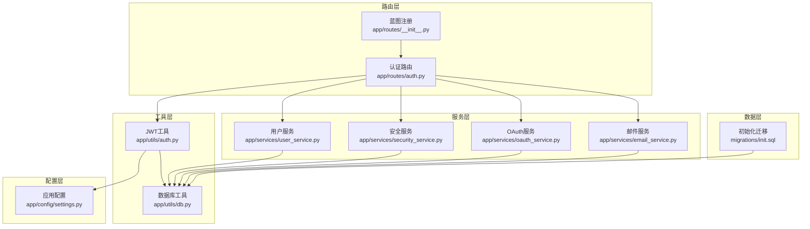
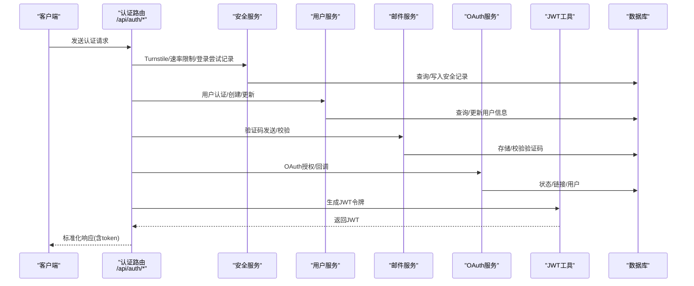
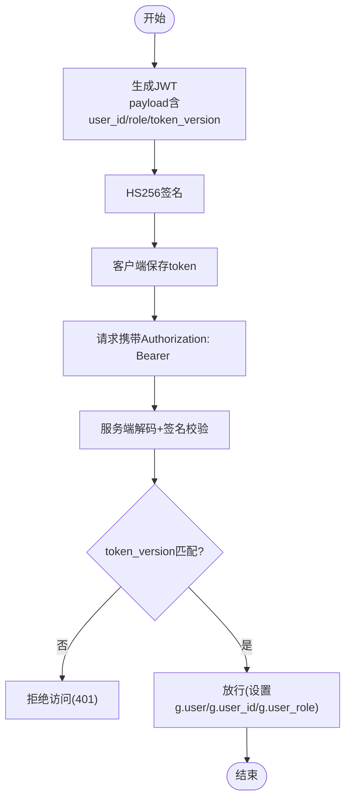
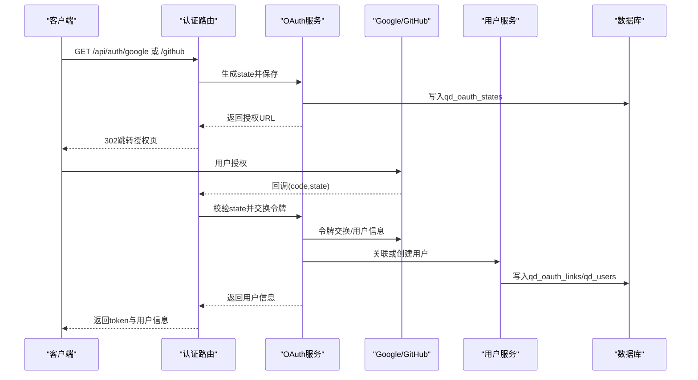
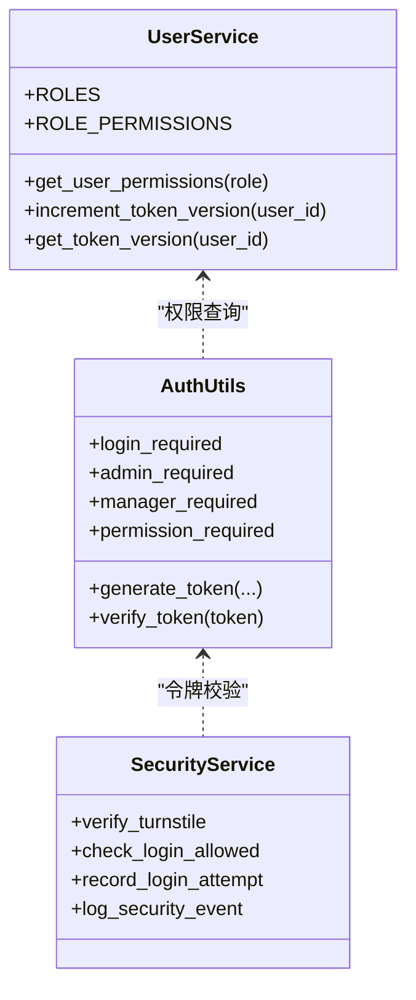
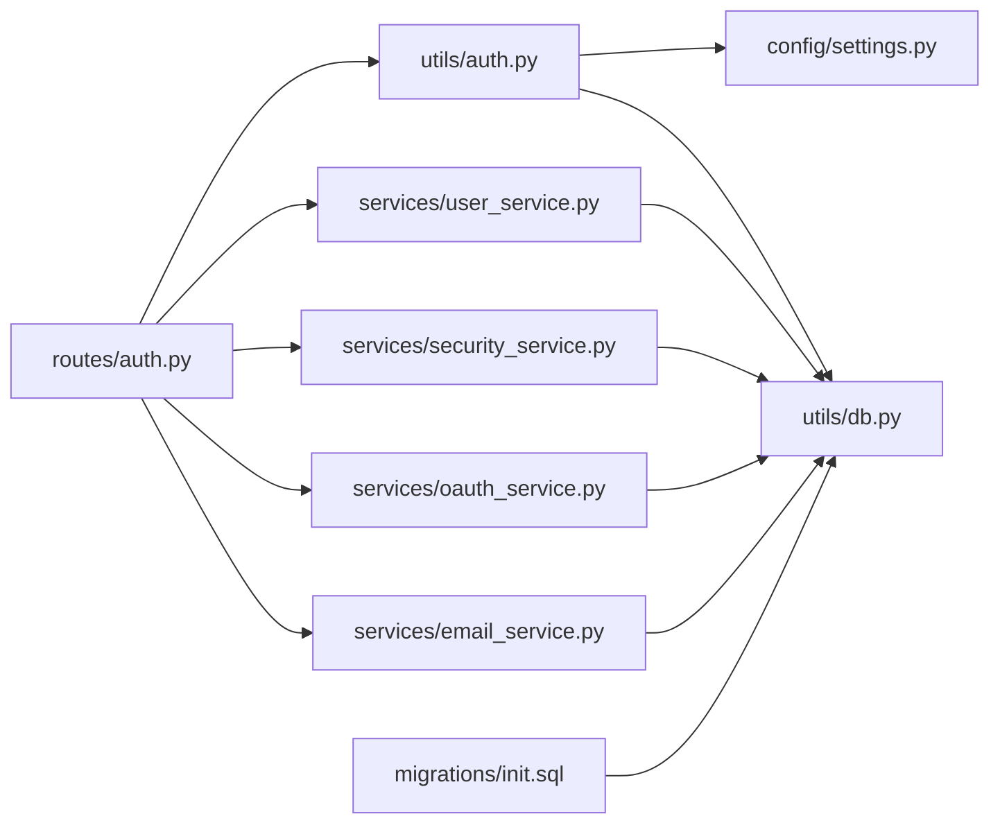

# 认证授权API

<cite>
**本文档引用的文件**
- [auth.py](file://backend_api_python/app/routes/auth.py)
- [auth.py](file://backend_api_python/app/utils/auth.py)
- [oauth_service.py](file://backend_api_python/app/services/oauth_service.py)
- [security_service.py](file://backend_api_python/app/services/security_service.py)
- [user_service.py](file://backend_api_python/app/services/user_service.py)
- [email_service.py](file://backend_api_python/app/services/email_service.py)
- [settings.py](file://backend_api_python/app/config/settings.py)
- [db.py](file://backend_api_python/app/utils/db.py)
- [init.sql](file://backend_api_python/migrations/init.sql)
- [routes/__init__.py](file://backend_api_python/app/routes/__init__.py)
</cite>

## 目录
1. [简介](#简介)
2. [项目结构](#项目结构)
3. [核心组件](#核心组件)
4. [架构总览](#架构总览)
5. [详细组件分析](#详细组件分析)
6. [依赖关系分析](#依赖关系分析)
7. [性能考量](#性能考量)
8. [故障排查指南](#故障排查指南)
9. [结论](#结论)
10. [附录](#附录)

## 简介
本文件为 QuantDinger 的认证授权 API 参考文档，覆盖用户注册、登录、登出、密码重置等认证相关端点的完整规范；详细说明 JWT 令牌的生成、刷新与验证机制；OAuth 集成流程；以及多租户环境下的权限控制策略。文档同时提供请求/响应模式、认证头格式、错误码定义、安全考虑、实际 API 调用示例与客户端实现指南，并解释会话管理、令牌过期处理与安全最佳实践。

## 项目结构
QuantDinger 后端采用 Flask 微服务架构，认证授权相关逻辑主要分布在以下模块：
- 路由层：认证路由位于 `app/routes/auth.py`，注册为 `/api/auth` 前缀蓝图
- 工具层：JWT 生成与校验、装饰器、权限检查位于 `app/utils/auth.py`
- 服务层：安全防护、OAuth、用户管理、邮件服务分别位于对应服务模块
- 配置层：密钥、管理员账户、日志级别等配置位于 `app/config/settings.py`
- 数据层：数据库连接工具与初始化迁移脚本位于 `app/utils/db.py` 与 `migrations/init.sql`

**图示来源**
- [routes/__init__.py:7-58](file://backend_api_python/app/routes/__init__.py#L7-L58)
- [auth.py:1-1180](file://backend_api_python/app/routes/auth.py#L1-L1180)
- [auth.py:1-239](file://backend_api_python/app/utils/auth.py#L1-L239)
- [security_service.py:1-399](file://backend_api_python/app/services/security_service.py#L1-L399)
- [oauth_service.py:1-715](file://backend_api_python/app/services/oauth_service.py#L1-L715)
- [user_service.py:1-701](file://backend_api_python/app/services/user_service.py#L1-L701)
- [email_service.py:1-362](file://backend_api_python/app/services/email_service.py#L1-L362)
- [settings.py:1-99](file://backend_api_python/app/config/settings.py#L1-L99)
- [db.py:1-66](file://backend_api_python/app/utils/db.py#L1-L66)
- [init.sql:1-1117](file://backend_api_python/migrations/init.sql#L1-L1117)

**章节来源**
- [routes/__init__.py:7-58](file://backend_api_python/app/routes/__init__.py#L7-L58)
- [auth.py:1-1180](file://backend_api_python/app/routes/auth.py#L1-L1180)

## 核心组件
- 认证路由与端点：负责登录、注册、验证码发送、密码重置、快速登录（邮箱验证码）、安全配置查询等
- JWT 工具：生成、验证、中间件装饰器（登录态、角色、权限）
- 安全服务：Cloudflare Turnstile 验证、登录尝试记录与限流、验证码速率限制、安全事件审计
- OAuth 服务：Google/GitHub 授权、CSRF state 管理、OAuth 用户关联与创建
- 用户服务：用户 CRUD、密码哈希/校验、角色权限映射、令牌版本控制（单设备登录）
- 邮件服务：验证码生成/存储/校验、邮件发送
- 配置与数据库：密钥、管理员账户、数据库连接与表结构

**章节来源**
- [auth.py:115-1180](file://backend_api_python/app/routes/auth.py#L115-L1180)
- [auth.py:18-239](file://backend_api_python/app/utils/auth.py#L18-L239)
- [security_service.py:26-399](file://backend_api_python/app/services/security_service.py#L26-L399)
- [oauth_service.py:27-715](file://backend_api_python/app/services/oauth_service.py#L27-L715)
- [user_service.py:56-701](file://backend_api_python/app/services/user_service.py#L56-L701)
- [email_service.py:29-362](file://backend_api_python/app/services/email_service.py#L29-L362)
- [settings.py:30-42](file://backend_api_python/app/config/settings.py#L30-L42)
- [db.py:19-66](file://backend_api_python/app/utils/db.py#L19-L66)
- [init.sql:8-190](file://backend_api_python/migrations/init.sql#L8-L190)

## 架构总览
下图展示认证授权的整体交互流程：客户端通过认证端点发起请求，服务端进行安全校验与业务处理，最终返回标准化响应；JWT 作为用户身份凭证贯穿整个生命周期。

**图示来源**
- [auth.py:140-1180](file://backend_api_python/app/routes/auth.py#L140-L1180)
- [auth.py:18-80](file://backend_api_python/app/utils/auth.py#L18-L80)
- [security_service.py:72-399](file://backend_api_python/app/services/security_service.py#L72-L399)
- [user_service.py:194-410](file://backend_api_python/app/services/user_service.py#L194-L410)
- [email_service.py:119-362](file://backend_api_python/app/services/email_service.py#L119-L362)
- [oauth_service.py:200-427](file://backend_api_python/app/services/oauth_service.py#L200-L427)
- [db.py:19-31](file://backend_api_python/app/utils/db.py#L19-L31)

## 详细组件分析

### 认证端点规范
- 登录（用户名/邮箱 + 密码）
  - 方法与路径：POST /api/auth/login
  - 请求体字段：username 或 account（字符串），password（字符串），turnstile_token（可选，启用 Turnstile 时必填）
  - 成功响应：返回 token 与 userinfo（id、username、nickname、avatar、timezone、role 权限集合）
  - 错误码：400 缺少必要字段/参数无效；401 凭据无效；403 账户禁用/待激活；429 过于频繁；500 内部错误
  - 安全特性：Turnstile 校验、登录尝试记录与限流、成功/失败审计
- 快速登录（邮箱验证码）
  - 方法与路径：POST /api/auth/login-code
  - 请求体字段：email（字符串），code（字符串），turnstile_token（可选），referral_code（可选）
  - 行为：若用户不存在且允许注册则自动创建；返回 token 与 userinfo
  - 错误码：400 参数无效/验证码无效；403 账户禁用；500 创建失败
- 发送验证码
  - 方法与路径：POST /api/auth/send-code
  - 请求体字段：email（字符串），type（字符串，register/reset_password/change_password/change_email），turnstile_token（可选）
  - 行为：根据类型执行相应速率限制与存在性检查；成功返回“已发送”
  - 错误码：400 参数无效；403 注册关闭；429 频繁请求；500 发送失败
- 注册
  - 方法与路径：POST /api/auth/register
  - 请求体字段：email、code、username、password、turnstile_token、referral_code（可选）
  - 行为：校验验证码、用户名/邮箱唯一性、密码强度；创建用户并自动登录
  - 错误码：400 参数无效/冲突；403 注册关闭；500 创建失败
- 密码重置
  - 方法与路径：POST /api/auth/reset-password
  - 请求体字段：email、code、new_password、turnstile_token（可选）
  - 行为：校验验证码并更新密码
  - 错误码：400 参数无效/验证码无效；500 更新失败
- 安全配置查询
  - 方法与路径：GET /api/auth/security-config
  - 返回：turnstile_enabled、turnstile_site_key、registration_enabled、oauth_google_enabled、oauth_github_enabled 等前端所需配置
  - 错误码：500 服务异常

**章节来源**
- [auth.py:140-1180](file://backend_api_python/app/routes/auth.py#L140-L1180)

### JWT 令牌生成、刷新与验证
- 生成：包含 payload（exp、iat、sub、user_id、role、token_version），使用 HS256 算法签名，有效期 7 天
- 验证：解码并校验签名；同时校验 token_version 与数据库一致，确保单设备登录场景下踢出旧会话
- 刷新：未实现专用刷新端点；建议客户端在过期前轮询或在 401 时重新登录换取新 token
- 中间件装饰器：login_required、admin_required、manager_required、permission_required

**图示来源**
- [auth.py:18-80](file://backend_api_python/app/utils/auth.py#L18-L80)
- [auth.py:126-171](file://backend_api_python/app/utils/auth.py#L126-L171)
- [user_service.py:274-313](file://backend_api_python/app/services/user_service.py#L274-L313)

**章节来源**
- [auth.py:18-80](file://backend_api_python/app/utils/auth.py#L18-L80)
- [auth.py:126-218](file://backend_api_python/app/utils/auth.py#L126-L218)
- [user_service.py:248-313](file://backend_api_python/app/services/user_service.py#L248-L313)

### OAuth 集成流程
- 授权发起：生成 state 并持久化至 qd_oauth_states，构造 Google/GitHub 授权 URL
- 回调处理：校验 state，交换授权码为访问令牌，拉取用户信息，关联或创建用户
- 安全要点：state 必须在回调时被消费并校验；支持允许列表 redirect；CSRF 防护
- 用户管理：OAuth 链接表 qd_oauth_links；支持解除绑定（需保留至少一种登录方式）

**图示来源**
- [oauth_service.py:200-427](file://backend_api_python/app/services/oauth_service.py#L200-L427)
- [auth.py:1-1180](file://backend_api_python/app/routes/auth.py#L1-L1180)
- [init.sql:104-171](file://backend_api_python/migrations/init.sql#L104-L171)

**章节来源**
- [oauth_service.py:27-715](file://backend_api_python/app/services/oauth_service.py#L27-L715)
- [auth.py:1-1180](file://backend_api_python/app/routes/auth.py#L1-L1180)
- [init.sql:104-171](file://backend_api_python/migrations/init.sql#L104-L171)

### 多租户与权限控制
- 角色与权限：内置 viewer/user/manager/admin 四级角色，每级拥有不同权限集合
- 装饰器：基于角色的访问控制（admin_required、manager_required、permission_required）
- 单设备登录：通过 token_version 字段强制旧 token 失效，实现踢出重复登录
- 安全审计：登录/注册/重置等关键事件记录到 qd_security_logs

**图示来源**
- [user_service.py:56-659](file://backend_api_python/app/services/user_service.py#L56-L659)
- [auth.py:126-218](file://backend_api_python/app/utils/auth.py#L126-L218)
- [security_service.py:26-399](file://backend_api_python/app/services/security_service.py#L26-L399)

**章节来源**
- [user_service.py:56-659](file://backend_api_python/app/services/user_service.py#L56-L659)
- [auth.py:126-218](file://backend_api_python/app/utils/auth.py#L126-L218)
- [security_service.py:26-399](file://backend_api_python/app/services/security_service.py#L26-L399)

### 会话管理与令牌过期处理
- 令牌有效期：默认 7 天
- 过期处理：服务端在验证时区分过期与无效；客户端应在 401 时触发重新登录
- 单设备登录：每次登录/创建用户会递增 token_version，旧 token 即刻失效
- 登出：未实现专用登出端点；可通过撤销密钥或缩短密钥有效期实现（建议）

**章节来源**
- [auth.py:32-44](file://backend_api_python/app/utils/auth.py#L32-L44)
- [user_service.py:274-313](file://backend_api_python/app/services/user_service.py#L274-L313)

### 安全考虑与最佳实践
- 强制启用 Turnstile（可选但推荐）以抵御机器人攻击
- 登录尝试记录与限流：IP 与账户维度双重保护
- 验证码防刷：单位时间内频率限制与小时级上限
- 密码强度：最小长度与字符集要求
- 审计日志：记录关键安全事件，便于追踪
- HTTPS 传输：生产环境必须启用 TLS
- 最小权限原则：使用装饰器精确控制端点访问

**章节来源**
- [security_service.py:72-357](file://backend_api_python/app/services/security_service.py#L72-L357)
- [email_service.py:119-213](file://backend_api_python/app/services/email_service.py#L119-L213)
- [user_service.py:368-410](file://backend_api_python/app/services/user_service.py#L368-L410)

## 依赖关系分析
认证相关模块之间的依赖关系如下：

**图示来源**
- [auth.py:1-1180](file://backend_api_python/app/routes/auth.py#L1-L1180)
- [auth.py:1-239](file://backend_api_python/app/utils/auth.py#L1-L239)
- [security_service.py:1-399](file://backend_api_python/app/services/security_service.py#L1-L399)
- [oauth_service.py:1-715](file://backend_api_python/app/services/oauth_service.py#L1-L715)
- [user_service.py:1-701](file://backend_api_python/app/services/user_service.py#L1-L701)
- [email_service.py:1-362](file://backend_api_python/app/services/email_service.py#L1-L362)
- [settings.py:1-99](file://backend_api_python/app/config/settings.py#L1-L99)
- [db.py:1-66](file://backend_api_python/app/utils/db.py#L1-L66)
- [init.sql:1-1117](file://backend_api_python/migrations/init.sql#L1-L1117)

**章节来源**
- [auth.py:1-1180](file://backend_api_python/app/routes/auth.py#L1-L1180)
- [auth.py:1-239](file://backend_api_python/app/utils/auth.py#L1-L239)
- [security_service.py:1-399](file://backend_api_python/app/services/security_service.py#L1-L399)
- [oauth_service.py:1-715](file://backend_api_python/app/services/oauth_service.py#L1-L715)
- [user_service.py:1-701](file://backend_api_python/app/services/user_service.py#L1-L701)
- [email_service.py:1-362](file://backend_api_python/app/services/email_service.py#L1-L362)
- [settings.py:1-99](file://backend_api_python/app/config/settings.py#L1-L99)
- [db.py:1-66](file://backend_api_python/app/utils/db.py#L1-L66)
- [init.sql:1-1117](file://backend_api_python/migrations/init.sql#L1-L1117)

## 性能考量
- JWT 解码为纯 CPU 操作，开销极低；建议在网关层缓存常用用户权限以减少数据库查询
- OAuth state 使用数据库持久化，注意 qd_oauth_states 的索引与定期清理
- 登录尝试与验证码记录表应按时间维度建立索引，避免全表扫描
- 大规模部署时，Turnstile 服务可用性直接影响认证吞吐，建议监控其可用性

## 故障排查指南
- 400 缺少必要字段：检查请求体字段是否正确传递
- 401 令牌无效或过期：确认 Authorization 头格式与令牌未过期；必要时重新登录
- 403 账户状态异常：检查用户状态（disabled/pending），或权限不足
- 429 频繁请求：触发了登录/验证码速率限制，等待冷却或调整策略
- Turnstile 失败：检查站点密钥与服务端网络连通性
- OAuth state 无效：确认回调时 state 已被消费且未过期

**章节来源**
- [auth.py:140-1180](file://backend_api_python/app/routes/auth.py#L140-L1180)
- [security_service.py:200-241](file://backend_api_python/app/services/security_service.py#L200-L241)
- [oauth_service.py:125-144](file://backend_api_python/app/services/oauth_service.py#L125-L144)

## 结论
QuantDinger 的认证授权体系以 JWT 为核心，结合 Turnstile、速率限制、验证码与安全审计，提供了完整的多租户与权限控制能力。通过装饰器与服务层协作，系统在保证安全性的同时具备良好的扩展性。建议在生产环境中启用 Turnstile、TLS 与完善的日志审计，并遵循最小权限原则与单设备登录策略。

## 附录

### API 调用示例（路径引用）
- 登录
  - 请求：POST /api/auth/login
  - 示例路径：[auth.py:140-279](file://backend_api_python/app/routes/auth.py#L140-L279)
- 快速登录（邮箱验证码）
  - 请求：POST /api/auth/login-code
  - 示例路径：[auth.py:285-484](file://backend_api_python/app/routes/auth.py#L285-L484)
- 发送验证码
  - 请求：POST /api/auth/send-code
  - 示例路径：[auth.py:491-579](file://backend_api_python/app/routes/auth.py#L491-L579)
- 注册
  - 请求：POST /api/auth/register
  - 示例路径：[auth.py:581-771](file://backend_api_python/app/routes/auth.py#L581-L771)
- 密码重置
  - 请求：POST /api/auth/reset-password
  - 示例路径：[auth.py:773-860](file://backend_api_python/app/routes/auth.py#L773-L860)
- 安全配置
  - 请求：GET /api/auth/security-config
  - 示例路径：[auth.py:115-134](file://backend_api_python/app/routes/auth.py#L115-L134)

### 认证头格式
- Authorization: Bearer <token>

**章节来源**
- [auth.py:134-148](file://backend_api_python/app/utils/auth.py#L134-L148)

### 错误码定义
- 400：参数缺失/无效
- 401：缺少令牌/令牌无效/令牌过期
- 403：账户禁用/待激活/权限不足/注册关闭
- 429：登录/验证码过于频繁
- 500：内部错误

**章节来源**
- [auth.py:140-1180](file://backend_api_python/app/routes/auth.py#L140-L1180)
- [security_service.py:200-241](file://backend_api_python/app/services/security_service.py#L200-L241)

### 数据模型（关键表）
- qd_users：用户基本信息、角色、状态、token_version、时区等
- qd_oauth_states：OAuth state 持久化
- qd_verification_codes：验证码与尝试次数
- qd_login_attempts：登录尝试记录
- qd_oauth_links：OAuth 第三方账号关联
- qd_security_logs：安全审计日志

**章节来源**
- [init.sql:8-190](file://backend_api_python/migrations/init.sql#L8-L190)