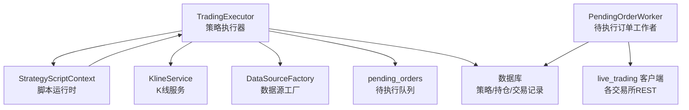
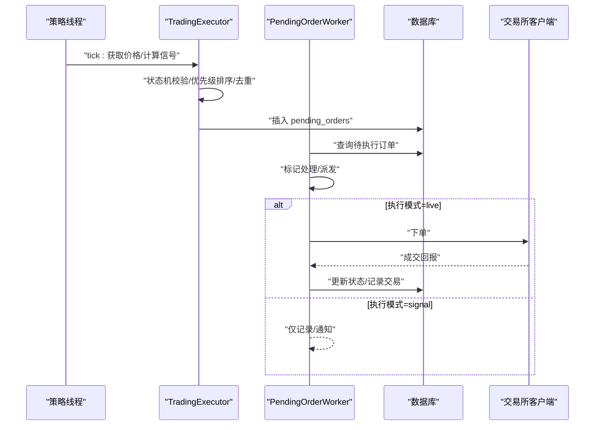
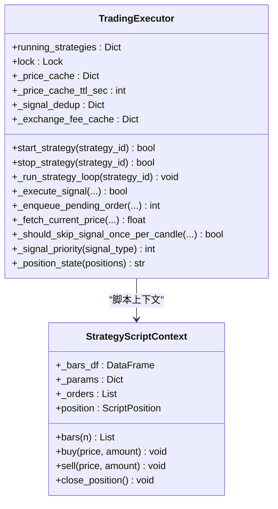
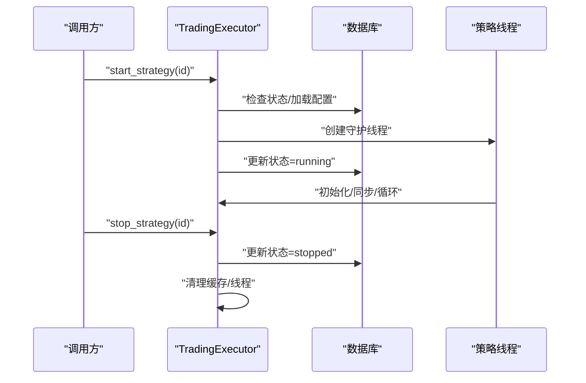
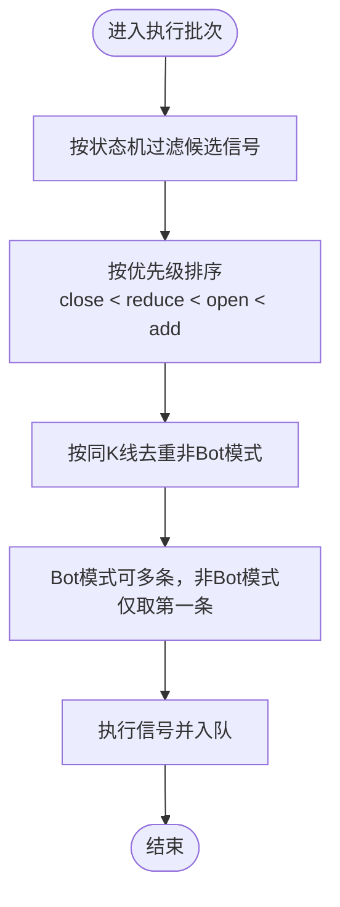
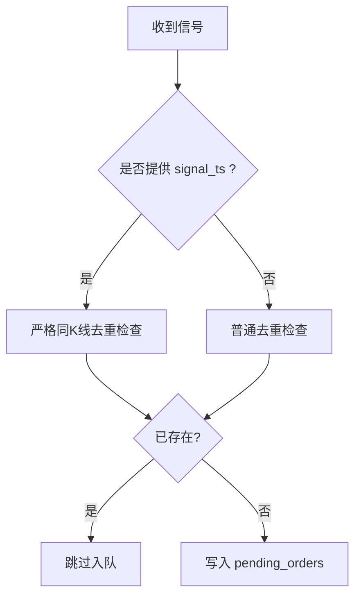
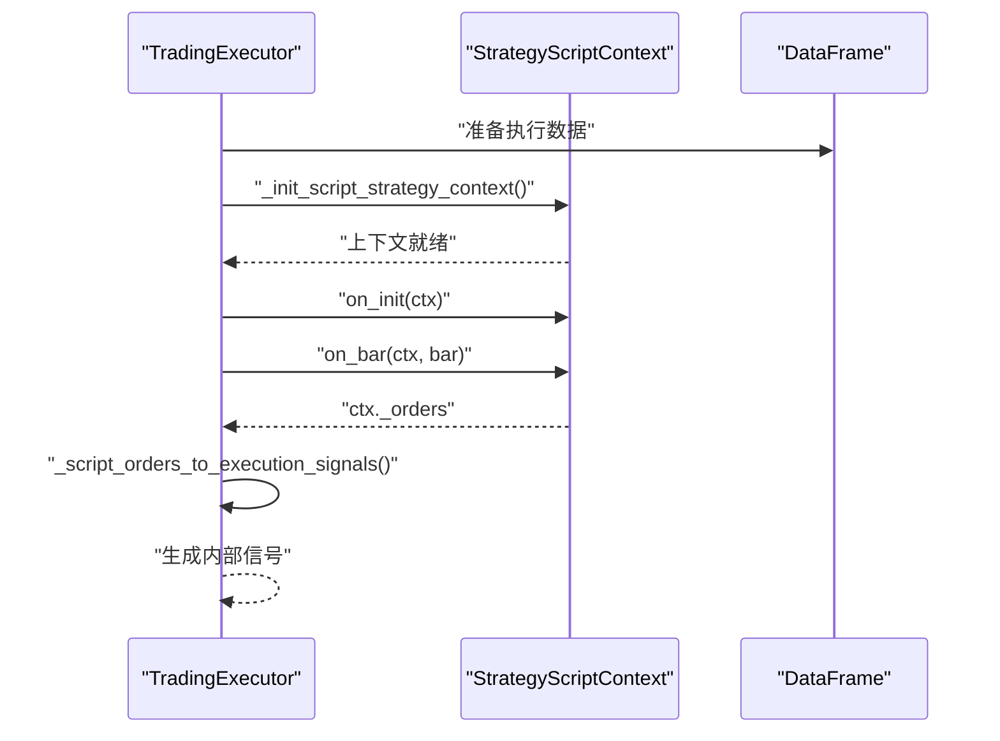
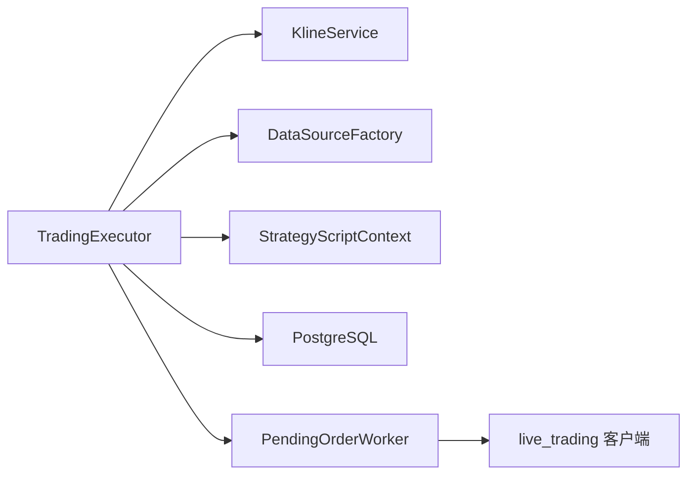

# 交易执行器核心

<cite>
**本文档引用的文件**
- [trading_executor.py](file://backend_api_python/app/services/trading_executor.py)
- [strategy_script_runtime.py](file://backend_api_python/app/services/strategy_script_runtime.py)
- [pending_order_worker.py](file://backend_api_python/app/services/pending_order_worker.py)
- [init.sql](file://backend_api_python/migrations/init.sql)
</cite>

## 目录
1. [简介](#简介)
2. [项目结构](#项目结构)
3. [核心组件](#核心组件)
4. [架构总览](#架构总览)
5. [详细组件分析](#详细组件分析)
6. [依赖关系分析](#依赖关系分析)
7. [性能考虑](#性能考虑)
8. [故障排除指南](#故障排除指南)
9. [结论](#结论)

## 简介
本文件面向交易执行器核心模块，系统化阐述 TradingExecutor 类的设计架构与实现原理，覆盖策略线程管理、信号去重机制、价格缓存系统、资源限制控制、策略启动/停止流程、线程安全机制、内存管理策略、信号优先级排序算法、状态机控制逻辑、重复订单防护机制、脚本策略上下文初始化、订单转换与持久化状态管理、线程池管理、资源监控与错误处理等主题，并提供性能优化建议与故障排除指南。

## 项目结构
交易执行器核心位于后端服务层，围绕实时交易执行与信号分发展开：
- TradingExecutor：策略线程生命周期管理、信号生成与执行、风控与状态机、价格缓存与去重、持久化与日志。
- StrategyScriptContext：脚本策略运行时上下文，提供 buy/sell/close_position 等接口，支持参数化与历史K线访问。
- PendingOrderWorker：轮询 pending_orders 队列，负责订单派发与位置同步，支撑信号模式与实盘模式的解耦。
- 数据库迁移：定义 pending_orders 等核心表结构，支撑订单持久化与状态追踪。

图表来源
- [trading_executor.py:37-120](file://backend_api_python/app/services/trading_executor.py#L37-L120)
- [strategy_script_runtime.py:114-157](file://backend_api_python/app/services/strategy_script_runtime.py#L114-L157)
- [pending_order_worker.py:52-98](file://backend_api_python/app/services/pending_order_worker.py#L52-L98)
- [init.sql:309-338](file://backend_api_python/migrations/init.sql#L309-L338)

章节来源
- [trading_executor.py:1-120](file://backend_api_python/app/services/trading_executor.py#L1-L120)
- [strategy_script_runtime.py:1-191](file://backend_api_python/app/services/strategy_script_runtime.py#L1-L191)
- [pending_order_worker.py:1-120](file://backend_api_python/app/services/pending_order_worker.py#L1-L120)
- [init.sql:309-338](file://backend_api_python/migrations/init.sql#L309-L338)

## 核心组件
- TradingExecutor：核心执行器，负责策略线程生命周期、信号生成与执行、风控与状态机、价格缓存与去重、持久化与日志。
- StrategyScriptContext：脚本策略运行时上下文，封装K线数据、参数、订单队列与位置状态，支持 on_init/on_bar 生命周期。
- PendingOrderWorker：订单派发与位置同步，支撑信号模式与实盘模式的解耦。
- 数据库表 pending_orders：订单持久化载体，包含信号类型、价格、杠杆、执行模式、状态与重试次数等字段。

章节来源
- [trading_executor.py:37-120](file://backend_api_python/app/services/trading_executor.py#L37-L120)
- [strategy_script_runtime.py:114-157](file://backend_api_python/app/services/strategy_script_runtime.py#L114-L157)
- [pending_order_worker.py:52-98](file://backend_api_python/app/services/pending_order_worker.py#L52-L98)
- [init.sql:309-338](file://backend_api_python/migrations/init.sql#L309-L338)

## 架构总览
交易执行器采用“策略线程 + 信号队列 + 订单派发”的解耦架构：
- 策略线程：每策略一个守护线程，按统一节拍拉取价格、计算信号、生成待执行订单。
- 信号队列：将信号持久化至 pending_orders，支持信号模式与实盘模式。
- 订单派发：PendingOrderWorker 轮询队列，按执行模式派发至交易所或仅记录通知。

图表来源
- [trading_executor.py:790-1599](file://backend_api_python/app/services/trading_executor.py#L790-L1599)
- [pending_order_worker.py:91-122](file://backend_api_python/app/services/pending_order_worker.py#L91-L122)
- [init.sql:309-338](file://backend_api_python/migrations/init.sql#L309-L338)

## 详细组件分析

### TradingExecutor 类设计与实现
- 线程管理
  - 通过 running_strategies 字典维护策略ID到线程的映射，使用锁保护并发访问。
  - 通过 max_threads 限制单进程线程总数，避免资源耗尽。
  - 启动时清理已退出线程，防止计数膨胀。
- 信号去重
  - 本地去重：基于 (strategy_id, symbol, signal_type, signal_ts) 构建键，配合 TTL 与定期清理，避免同一K线信号重复入队。
  - 数据库去重：enqueue_pending_order 中按“同K线严格去重”和“冷却期去重”规则，防止重复订单进入队列。
- 价格缓存
  - 内存缓存：按 market_category:symbol 维度缓存价格，支持 TTL 控制，默认10秒。
  - 缓存命中优先于数据源拉取，降低外部依赖压力。
- 状态机与优先级
  - 状态机：flat/long/short 三态，严格限定允许的信号类型组合。
  - 优先级：close_* > reduce_* > open_* > add_*，确保先平仓再开仓/加仓。
- 脚本策略上下文
  - StrategyScriptContext 提供 bars、param、buy/sell/close_position 等接口，支持 on_init/on_bar 生命周期。
  - 订单转换：脚本侧 buy/sell/close_position 统一转换为内部信号类型，结合杠杆/市价类型计算数量。
- 订单持久化与执行
  - _execute_exchange_order 将信号写入 pending_orders，携带风控参数与执行模式。
  - _enqueue_pending_order 提供严格去重与冷却期保护，避免重复/过早重复入队。
- 风控与服务器端止盈止损
  - 服务器端止盈/止损：基于配置与持仓状态，按百分比阈值生成平仓信号。
  - 服务器端跟踪：记录最高/最低价，重启后继续跟踪，避免重复触发。
- 资源监控与错误处理
  - _log_resource_status 输出内存与线程数，辅助定位 can't start new thread 根因。
  - 自动停止策略：连续错误阈值触发自动停止，避免无限错误噪声。
  - 线程退出清理：确保线程退出后 DB 状态一致性。

图表来源
- [trading_executor.py:37-120](file://backend_api_python/app/services/trading_executor.py#L37-L120)
- [strategy_script_runtime.py:114-157](file://backend_api_python/app/services/strategy_script_runtime.py#L114-L157)

章节来源
- [trading_executor.py:37-120](file://backend_api_python/app/services/trading_executor.py#L37-L120)
- [trading_executor.py:395-496](file://backend_api_python/app/services/trading_executor.py#L395-L496)
- [trading_executor.py:790-1599](file://backend_api_python/app/services/trading_executor.py#L790-L1599)
- [trading_executor.py:241-331](file://backend_api_python/app/services/trading_executor.py#L241-L331)
- [trading_executor.py:1767-1809](file://backend_api_python/app/services/trading_executor.py#L1767-L1809)
- [trading_executor.py:2060-2089](file://backend_api_python/app/services/trading_executor.py#L2060-L2089)
- [trading_executor.py:2578-2909](file://backend_api_python/app/services/trading_executor.py#L2578-L2909)
- [trading_executor.py:3109-3196](file://backend_api_python/app/services/trading_executor.py#L3109-L3196)
- [trading_executor.py:3198-3362](file://backend_api_python/app/services/trading_executor.py#L3198-L3362)
- [strategy_script_runtime.py:114-157](file://backend_api_python/app/services/strategy_script_runtime.py#L114-L157)

### 策略启动/停止流程
- 启动流程
  - 检查线程上限与运行中状态，创建守护线程并加入 running_strategies。
  - 初始化策略配置、数据源、手续费缓存、初始持仓同步。
  - 进入统一节拍循环，按需拉取K线、计算信号、执行订单。
- 停止流程
  - 更新 DB 状态为 stopped，移除线程注册，清理手续费缓存。
  - 线程退出后进行最终一致性检查，避免僵尸状态。

图表来源
- [trading_executor.py:395-496](file://backend_api_python/app/services/trading_executor.py#L395-L496)
- [trading_executor.py:1659-1702](file://backend_api_python/app/services/trading_executor.py#L1659-L1702)

章节来源
- [trading_executor.py:395-496](file://backend_api_python/app/services/trading_executor.py#L395-L496)
- [trading_executor.py:1659-1702](file://backend_api_python/app/services/trading_executor.py#L1659-L1702)

### 信号优先级排序与状态机控制
- 优先级规则
  - close_* 优先生效，随后 reduce_*，再 open_*，最后 add_*。
  - 同一时刻仅执行一条信号（非Bot模式）。
- 状态机规则
  - flat：仅允许 open_long/open_short。
  - long：仅允许 add_long/reduce_long/close_long。
  - short：仅允许 add_short/reduce_short/close_short。
- Bot模式特殊处理
  - Bot脚本可在一个tick内多次状态切换，以满足网格/DCA等策略需求。

图表来源
- [trading_executor.py:1414-1465](file://backend_api_python/app/services/trading_executor.py#L1414-L1465)
- [trading_executor.py:203-233](file://backend_api_python/app/services/trading_executor.py#L203-L233)
- [trading_executor.py:241-291](file://backend_api_python/app/services/trading_executor.py#L241-L291)

章节来源
- [trading_executor.py:1414-1465](file://backend_api_python/app/services/trading_executor.py#L1414-L1465)
- [trading_executor.py:203-233](file://backend_api_python/app/services/trading_executor.py#L203-L233)
- [trading_executor.py:241-291](file://backend_api_python/app/services/trading_executor.py#L241-L291)

### 重复订单防护机制
- 本地去重
  - 基于 (strategy_id, symbol, signal_type, signal_ts) 构建键，TTL 覆盖至少两个K线周期。
  - 定期清理过期键，避免内存膨胀。
- 数据库去重
  - 同K线严格去重：open/close 信号在同一K线仅允许一次。
  - 冷却期去重：非同K线信号在冷却期内（默认30秒）跳过重复入队。
  - 飞单保护：若已有 pending/processing 订单，跳过重复入队。

图表来源
- [trading_executor.py:3238-3315](file://backend_api_python/app/services/trading_executor.py#L3238-L3315)
- [trading_executor.py:241-291](file://backend_api_python/app/services/trading_executor.py#L241-L291)

章节来源
- [trading_executor.py:3238-3315](file://backend_api_python/app/services/trading_executor.py#L3238-L3315)
- [trading_executor.py:241-291](file://backend_api_python/app/services/trading_executor.py#L241-L291)

### 脚本策略上下文初始化与订单转换
- 上下文初始化
  - 从 trading_config 恢复脚本运行时参数与持久化状态，合并 bot_params。
  - hydrate 时根据当前持仓与价格刷新 balance/equity。
- 订单转换
  - buy/sell/close_position 统一转换为 open/add/reduce/close 信号。
  - Bot脚本与非Bot脚本在数量计算上区分：Bot脚本传入的是USDT名义金额，需换算为数量。

图表来源
- [trading_executor.py:547-575](file://backend_api_python/app/services/trading_executor.py#L547-L575)
- [trading_executor.py:1068-1086](file://backend_api_python/app/services/trading_executor.py#L1068-L1086)
- [trading_executor.py:615-732](file://backend_api_python/app/services/trading_executor.py#L615-L732)
- [strategy_script_runtime.py:114-157](file://backend_api_python/app/services/strategy_script_runtime.py#L114-L157)

章节来源
- [trading_executor.py:547-575](file://backend_api_python/app/services/trading_executor.py#L547-L575)
- [trading_executor.py:1068-1086](file://backend_api_python/app/services/trading_executor.py#L1068-L1086)
- [trading_executor.py:615-732](file://backend_api_python/app/services/trading_executor.py#L615-L732)
- [strategy_script_runtime.py:114-157](file://backend_api_python/app/services/strategy_script_runtime.py#L114-L157)

### 订单持久化状态管理
- 持久化字段
  - pending_orders：包含 user_id、strategy_id、symbol、signal_type、signal_ts、market_type、order_type、amount、price、execution_mode、status、priority、attempts/max_attempts、payload_json、exchange_id、exchange_order_id、filled/avg_price/executed_at 等。
- 状态流转
  - pending → processing → 成功/失败，失败时记录 last_error，支持重试。
- 通知与日志
  - 执行成功/失败均写入策略日志，便于前端展示与审计。

章节来源
- [init.sql:309-338](file://backend_api_python/migrations/init.sql#L309-L338)
- [trading_executor.py:3109-3196](file://backend_api_python/app/services/trading_executor.py#L3109-L3196)
- [trading_executor.py:3198-3362](file://backend_api_python/app/services/trading_executor.py#L3198-L3362)

### 线程池管理与资源监控
- 线程池
  - 策略线程为守护线程，按策略独立运行，避免阻塞主进程。
  - 通过 max_threads 限制并发策略数量，防止资源耗尽。
- 资源监控
  - _log_resource_status 输出内存与线程数，辅助定位 can't start new thread 根因。
  - _console_print 提供控制台可观测性输出。

章节来源
- [trading_executor.py:40-70](file://backend_api_python/app/services/trading_executor.py#L40-L70)
- [trading_executor.py:149-175](file://backend_api_python/app/services/trading_executor.py#L149-L175)
- [trading_executor.py:1531-1533](file://backend_api_python/app/services/trading_executor.py#L1531-L1533)

### 错误处理与自动停止策略
- 自动停止策略
  - 连续错误阈值触发自动停止，避免无限错误噪声。
  - fatal 错误（如 UnsupportedMarketError、认证失败、产品不存在）立即停止。
- 日志与告警
  - 循环错误写入策略日志，控制台输出便于排查。
  - _set_db_stopped_best_effort 确保 DB 状态一致性。

章节来源
- [trading_executor.py:800-857](file://backend_api_python/app/services/trading_executor.py#L800-L857)
- [trading_executor.py:1539-1581](file://backend_api_python/app/services/trading_executor.py#L1539-L1581)

## 依赖关系分析
- 组件耦合
  - TradingExecutor 依赖 KlineService、DataSourceFactory、StrategyScriptContext、PendingOrderWorker（通过数据库交互）。
  - PendingOrderWorker 依赖 live_trading 客户端族，实现不同交易所对接。
- 外部依赖
  - 数据库：PostgreSQL，提供策略、持仓、交易、通知、待执行订单等表。
  - 第三方库：pandas、numpy、psutil（可选）、ccxt（数据层使用，下单不直连）。

图表来源
- [trading_executor.py:25-32](file://backend_api_python/app/services/trading_executor.py#L25-L32)
- [pending_order_worker.py:17-39](file://backend_api_python/app/services/pending_order_worker.py#L17-L39)

章节来源
- [trading_executor.py:25-32](file://backend_api_python/app/services/trading_executor.py#L25-L32)
- [pending_order_worker.py:17-39](file://backend_api_python/app/services/pending_order_worker.py#L17-L39)

## 性能考虑
- 价格缓存
  - 内存缓存 + TTL，减少外部数据源调用频率；可通过环境变量调整 TTL。
- 信号去重
  - 本地与数据库双重去重，避免重复入队与重复下单。
- 统一节拍
  - 策略线程按统一节拍运行，避免CPU自旋；Tick间隔可通过环境变量配置。
- 服务器端风控
  - 止损/止盈/追踪止损在服务器端计算，减少脚本复杂度与回测差异。
- 数据库索引
  - pending_orders 表具备常用查询索引，提升派发效率。

章节来源
- [trading_executor.py:44-49](file://backend_api_python/app/services/trading_executor.py#L44-L49)
- [trading_executor.py:1122-1127](file://backend_api_python/app/services/trading_executor.py#L1122-L1127)
- [init.sql:340-341](file://backend_api_python/migrations/init.sql#L340-L341)

## 故障排除指南
- 策略无法启动
  - 检查 max_threads 限制与 running_strategies 清理情况。
  - 查看 _last_start_failure 与控制台输出，确认资源状态。
- 线程过多或内存不足
  - 使用 _log_resource_status 观察内存与线程数，适当降低 STRATEGY_MAX_THREADS。
- 信号重复下单
  - 检查本地去重与数据库去重逻辑，确认 signal_ts 与冷却期设置。
- 订单未派发
  - 检查 pending_orders 状态与 PendingOrderWorker 轮询间隔。
- 自动停止频繁
  - 关注连续错误计数与 fatal 错误类型，修正配置或权限问题。

章节来源
- [trading_executor.py:413-424](file://backend_api_python/app/services/trading_executor.py#L413-L424)
- [trading_executor.py:149-175](file://backend_api_python/app/services/trading_executor.py#L149-L175)
- [trading_executor.py:3238-3315](file://backend_api_python/app/services/trading_executor.py#L3238-L3315)
- [pending_order_worker.py:91-122](file://backend_api_python/app/services/pending_order_worker.py#L91-L122)

## 结论
TradingExecutor 通过“策略线程 + 信号队列 + 订单派发”的架构实现了高可靠、可扩展的实时交易执行能力。其内置的价格缓存、信号去重、状态机与优先级控制、服务器端风控、脚本策略上下文与持久化机制，共同构成了完整的执行闭环。配合 PendingOrderWorker 的订单派发与位置同步，系统在信号模式与实盘模式间保持了解耦与一致性。建议在生产环境中合理配置线程上限、缓存TTL与错误阈值，并持续监控资源使用与订单状态，以获得稳定高效的执行体验。