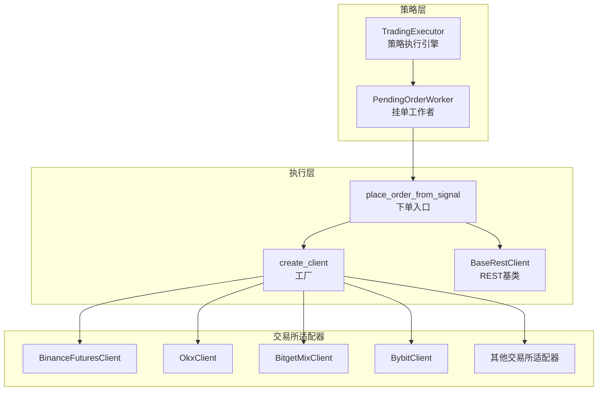
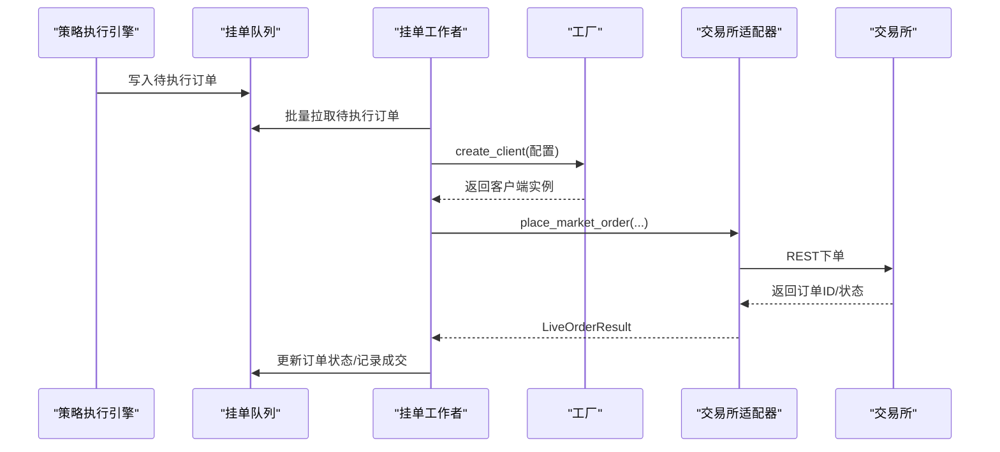
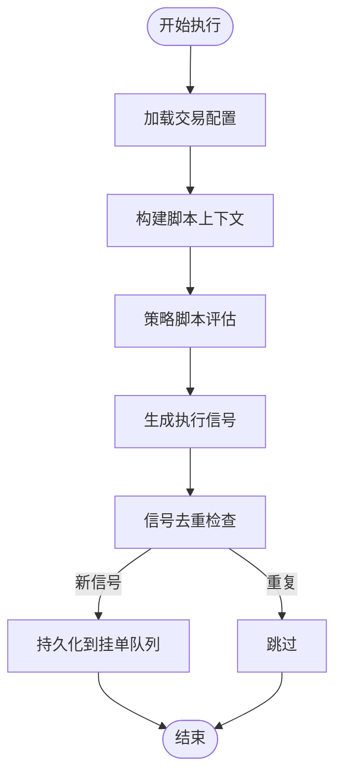
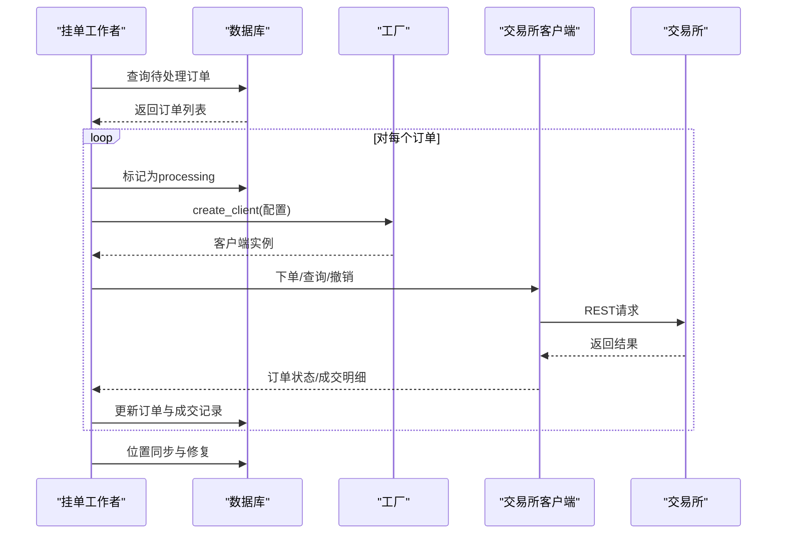
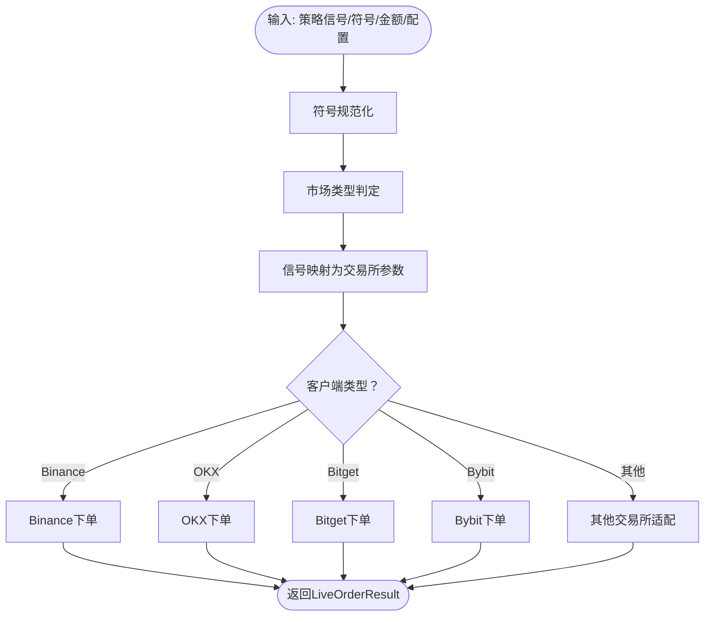
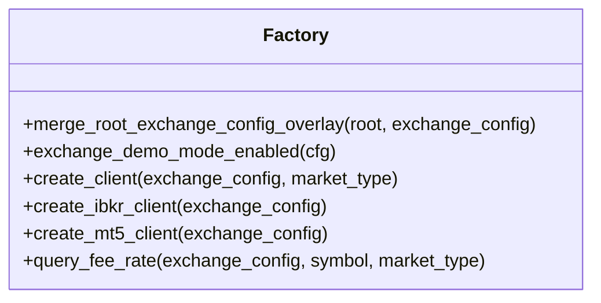
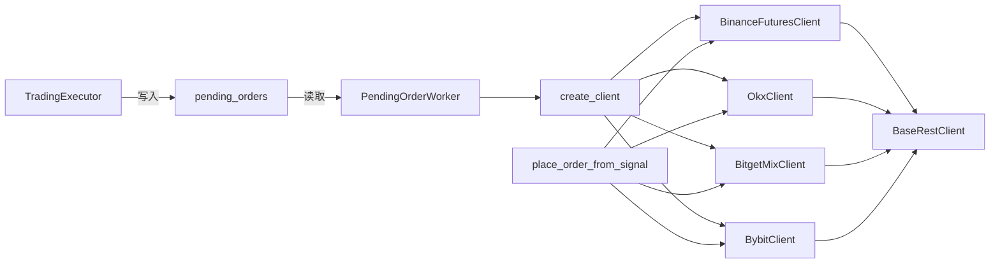

# 交易执行系统

<cite>
**本文档引用的文件**
- [execution.py](file://backend_api_python/app/services/live_trading/execution.py)
- [factory.py](file://backend_api_python/app/services/live_trading/factory.py)
- [base.py](file://backend_api_python/app/services/live_trading/base.py)
- [trading_executor.py](file://backend_api_python/app/services/trading_executor.py)
- [binance.py](file://backend_api_python/app/services/live_trading/binance.py)
- [okx.py](file://backend_api_python/app/services/live_trading/okx.py)
- [bitget.py](file://backend_api_python/app/services/live_trading/bitget.py)
- [bybit.py](file://backend_api_python/app/services/live_trading/bybit.py)
- [symbols.py](file://backend_api_python/app/services/live_trading/symbols.py)
- [pending_order_worker.py](file://backend_api_python/app/services/pending_order_worker.py)
</cite>

## 目录
1. [简介](#简介)
2. [项目结构](#项目结构)
3. [核心组件](#核心组件)
4. [架构总览](#架构总览)
5. [详细组件分析](#详细组件分析)
6. [依赖关系分析](#依赖关系分析)
7. [性能考虑](#性能考虑)
8. [故障排除指南](#故障排除指南)
9. [结论](#结论)
10. [附录](#附录)

## 简介
本系统是一个面向多交易所的实时交易执行平台，支持加密货币与传统市场的多种执行器（Binance、OKX、Bitget、Bybit、Coinbase、Kraken、KuCoin、Gate.io、Deepcoin、HTX、IBKR、MT5）。其核心目标是将策略信号转化为标准化的交易所订单，并通过统一的工厂与适配层实现跨平台一致性。系统同时提供挂单处理、订单状态跟踪、资金管理、手续费与滑点处理、以及风控与止盈止损等能力。

## 项目结构
后端采用模块化设计，核心交易执行相关代码集中在 live_trading 子目录，策略执行与挂单调度在 services 层：

- live_trading：统一的 REST 客户端基类与各交易所适配器
- services：策略执行引擎、挂单工作者、工厂与工具
- data_providers、routes、utils：数据源、接口路由与通用工具

**图表来源**
- [trading_executor.py:1-800](file://backend_api_python/app/services/trading_executor.py#L1-800)
- [pending_order_worker.py:1-800](file://backend_api_python/app/services/pending_order_worker.py#L1-800)
- [execution.py:1-426](file://backend_api_python/app/services/live_trading/execution.py#L1-426)
- [factory.py:1-441](file://backend_api_python/app/services/live_trading/factory.py#L1-441)
- [base.py:1-168](file://backend_api_python/app/services/live_trading/base.py#L1-168)

**章节来源**
- [trading_executor.py:1-800](file://backend_api_python/app/services/trading_executor.py#L1-800)
- [pending_order_worker.py:1-800](file://backend_api_python/app/services/pending_order_worker.py#L1-800)
- [execution.py:1-426](file://backend_api_python/app/services/live_trading/execution.py#L1-426)
- [factory.py:1-441](file://backend_api_python/app/services/live_trading/factory.py#L1-441)
- [base.py:1-168](file://backend_api_python/app/services/live_trading/base.py#L1-168)

## 核心组件
- 交易执行引擎（TradingExecutor）
  - 负责策略线程生命周期、信号去重、脚本上下文构建、订单生成与持久化
  - 支持网格/定投/趋势策略的参数化与状态机控制
- 挂单工作者（PendingOrderWorker）
  - 批量轮询待执行订单，创建交易所客户端，执行下单并进行位置同步
  - 提供位置自检与修复，避免“幽灵持仓”
- 统一下单入口（place_order_from_signal）
  - 将策略信号映射为具体交易所的下单参数，处理现货/永续差异、保证金模式、对冲模式等
- 交易所工厂（create_client）
  - 基于配置动态创建对应交易所客户端，支持模拟/测试网切换
- REST 基类（BaseRestClient）
  - 统一请求封装、签名、超时与证书校验策略

**章节来源**
- [trading_executor.py:1-800](file://backend_api_python/app/services/trading_executor.py#L1-800)
- [pending_order_worker.py:1-800](file://backend_api_python/app/services/pending_order_worker.py#L1-800)
- [execution.py:123-426](file://backend_api_python/app/services/live_trading/execution.py#L123-426)
- [factory.py:126-285](file://backend_api_python/app/services/live_trading/factory.py#L126-285)
- [base.py:95-168](file://backend_api_python/app/services/live_trading/base.py#L95-168)

## 架构总览
系统采用“策略-挂单-执行-适配”的分层架构。策略侧产生信号，进入挂单队列；挂单工作者批量取出订单，通过工厂创建交易所客户端，调用下单入口，最终由各交易所适配器完成 REST 请求与结果回填。

**图表来源**
- [trading_executor.py:1-800](file://backend_api_python/app/services/trading_executor.py#L1-800)
- [pending_order_worker.py:1-800](file://backend_api_python/app/services/pending_order_worker.py#L1-800)
- [execution.py:123-426](file://backend_api_python/app/services/live_trading/execution.py#L123-426)
- [factory.py:126-285](file://backend_api_python/app/services/live_trading/factory.py#L126-285)

## 详细组件分析

### 交易执行引擎（TradingExecutor）
- 线程管理与资源限制：最大线程数受环境变量控制，避免资源耗尽
- 信号去重：基于策略ID、符号、信号类型与时间戳的去重缓存，防止同一K线重复下单
- 脚本上下文：将策略脚本输出转换为标准化的执行信号，支持网格/趋势加仓/减仓
- 位置状态机：严格的状态机控制（开多/开空/加仓/减仓/平仓），避免非法状态转换
- 资金与杠杆：根据交易配置推导默认头寸比例，结合杠杆与市场类型计算本地数量

**图表来源**
- [trading_executor.py:577-732](file://backend_api_python/app/services/trading_executor.py#L577-732)

**章节来源**
- [trading_executor.py:1-800](file://backend_api_python/app/services/trading_executor.py#L1-800)

### 挂单工作者（PendingOrderWorker）
- 批量处理：按批大小轮询待执行订单，标记为“处理中”，避免并发冲突
- 位置同步：定期与交易所对账，删除“幽灵持仓”、更新尺寸与入场价、必要时自动插入新持仓
- 错误处理：对致命认证/权限错误自动停止策略，避免无限重试
- 可扩展性：支持新增交易所适配器，通过类型分支与工厂解耦

**图表来源**
- [pending_order_worker.py:1-800](file://backend_api_python/app/services/pending_order_worker.py#L1-800)
- [factory.py:126-285](file://backend_api_python/app/services/live_trading/factory.py#L126-285)

**章节来源**
- [pending_order_worker.py:1-800](file://backend_api_python/app/services/pending_order_worker.py#L1-800)

### 统一下单入口（place_order_from_signal）
- 信号映射：将策略信号（开多/开空/加仓/减仓/平仓）映射为交易所侧的 side/pos_side/reduce_only
- 符号规范化：统一处理裸符号（如 PI、TRX）与含冒号的合约格式
- 市场类型适配：区分现货/永续，处理不同交易所的参数差异（保证金模式、对冲模式、产品类型等）
- 实例分发：根据客户端类型调用对应交易所的下单方法

**图表来源**
- [execution.py:123-426](file://backend_api_python/app/services/live_trading/execution.py#L123-426)

**章节来源**
- [execution.py:1-426](file://backend_api_python/app/services/live_trading/execution.py#L1-426)

### 交易所工厂（create_client）
- 配置合并：支持根级覆盖键（测试网、网络、基础URL等）合并到 exchange_config
- 模式检测：自动识别模拟/测试网模式，选择对应 baseURL
- 客户端创建：按 exchange_id 动态创建对应交易所客户端，支持现货/永续、对冲/单向模式、通道码等差异化参数

**图表来源**
- [factory.py:76-441](file://backend_api_python/app/services/live_trading/factory.py#L76-441)

**章节来源**
- [factory.py:1-441](file://backend_api_python/app/services/live_trading/factory.py#L1-441)

### REST 基类（BaseRestClient）
- 统一请求：封装请求构造、签名、超时与证书校验
- 安全策略：支持禁用验证（开发环境）、自定义 CA Bundle、系统证书探测
- 结果解析：兼容 JSON 与非 JSON 文本，统一返回状态码、解析体与原始文本

**章节来源**
- [base.py:1-168](file://backend_api_python/app/services/live_trading/base.py#L1-168)

### 多交易所适配器

#### Binance（USDT-M 币本位永续）
- 精度与过滤：通过 exchangeInfo 获取 LOT_SIZE/PRICE_FILTER，严格量化下单精度
- 时间同步：对齐服务器时间，避免 -1021 时钟偏差错误
- 杠杆与持仓模式：支持 USDT-M 永续，读取 hedge/one-way 模式并设置 positionSide
- 成交费计算：优先从 userTrades 汇总，失败时回退 commissionRate

**章节来源**
- [binance.py:1-800](file://backend_api_python/app/services/live_trading/binance.py#L1-800)

#### OKX（永续/现货）
- 仪器元数据：缓存 instrument 信息，按 lotSz/minSz 对下单量进行归一化
- 保证金模式：支持 cash/交叉/逐仓，posSide 与 net/long/short 模式兼容
- 杠杆设置：缓存 set-leverage 调用，避免频繁设置
- 成交费：从 trade-fee 接口查询，或通过 fills 汇总

**章节来源**
- [okx.py:1-800](file://backend_api_python/app/services/live_trading/okx.py#L1-800)

#### Bitget（Mix USDT 永续）
- 合约元数据：缓存 contracts 信息，按 sizeMultiplier/pricePlace 归一化
- 模式兼容：hedge_mode 与 one_way_mode 的 position 字段差异处理
- 杠杆设置：私有接口 set-leverage 缓存
- 成交费：feeDetail 解析与汇总

**章节来源**
- [bitget.py:1-800](file://backend_api_python/app/services/live_trading/bitget.py#L1-800)

#### Bybit（Linear/Spot）
- 时间同步：通过 market/time 获取服务器时间，计算偏移
- 仪器信息：缓存 instrument info，按 qtyStep/priceFilter 归一化
- 模式兼容：hedge 模式下 positionIdx 映射
- 成交费：cumExecFee/cumFeeDetail 字段提取

**章节来源**
- [bybit.py:1-747](file://backend_api_python/app/services/live_trading/bybit.py#L1-747)

### 符号规范化（symbols.py）
- 统一输入格式：支持 "SOL/USDT:USDT"、"SOL/USDT"、"BTCUSDT" 等多种输入
- 交易所映射：将符号转换为各交易所的内部标识（如 OKX 永续 INST_ID、Bybit 合约名等）

**章节来源**
- [symbols.py:1-235](file://backend_api_python/app/services/live_trading/symbols.py#L1-235)

## 依赖关系分析
- 组件耦合
  - TradingExecutor 与 PendingOrderWorker 通过数据库共享状态（挂单队列）
  - PendingOrderWorker 依赖工厂创建客户端，客户端继承 BaseRestClient
  - 统一下单入口根据客户端类型分派至具体适配器
- 外部依赖
  - 交易所 REST API（各交易所 v5/v2 文档）
  - 数据库（PostgreSQL）用于持久化订单、位置与日志
  - 可选外部库（IBKR、MT5）按需导入

**图表来源**
- [trading_executor.py:1-800](file://backend_api_python/app/services/trading_executor.py#L1-800)
- [pending_order_worker.py:1-800](file://backend_api_python/app/services/pending_order_worker.py#L1-800)
- [execution.py:123-426](file://backend_api_python/app/services/live_trading/execution.py#L123-426)
- [factory.py:126-285](file://backend_api_python/app/services/live_trading/factory.py#L126-285)
- [base.py:95-168](file://backend_api_python/app/services/live_trading/base.py#L95-168)

**章节来源**
- [trading_executor.py:1-800](file://backend_api_python/app/services/trading_executor.py#L1-800)
- [pending_order_worker.py:1-800](file://backend_api_python/app/services/pending_order_worker.py#L1-800)
- [execution.py:123-426](file://backend_api_python/app/services/live_trading/execution.py#L123-426)
- [factory.py:126-285](file://backend_api_python/app/services/live_trading/factory.py#L126-285)
- [base.py:95-168](file://backend_api_python/app/services/live_trading/base.py#L95-168)

## 性能考虑
- 线程与资源
  - 策略线程上限受环境变量控制，避免 OOM 与线程耗尽
  - 信号去重缓存带 TTL，定期清理过期键，降低内存占用
- 批量与轮询
  - 挂单工作者按批处理，减少数据库压力；位置同步周期可配置
- 精度与合规
  - 各交易所过滤器与步进精度严格校验，避免被拒单与 -1111
- 证书与代理
  - 统一证书校验策略，支持企业 TLS 检查与代理场景

[本节为通用指导，无需特定文件引用]

## 故障排除指南
- 常见错误与处理
  - 时钟偏差（-1021/10002）：启用服务器时间同步，检查本地时间
  - 权限/密钥错误：检查 API Key/Passphrase，确认交易所权限已开启
  - 测试网未配置：部分交易所需要显式 base_url 或 futures_base_url
  - 重复下单：检查信号去重逻辑与 K线时间戳
- 自动停止策略
  - 位置同步或下单出现致命认证/权限错误时，系统会自动停止策略以避免无限重试
- 日志与诊断
  - 使用策略运行日志与挂单工作者日志定位问题
  - 位置同步日志包含当前交易所持仓摘要，便于核对

**章节来源**
- [binance.py:173-236](file://backend_api_python/app/services/live_trading/binance.py#L173-236)
- [bybit.py:202-297](file://backend_api_python/app/services/live_trading/bybit.py#L202-297)
- [pending_order_worker.py:268-298](file://backend_api_python/app/services/pending_order_worker.py#L268-298)
- [factory.py:246-261](file://backend_api_python/app/services/live_trading/factory.py#L246-261)

## 结论
本交易执行系统通过统一的工厂与适配层，实现了多交易所的一致化下单体验；配合策略执行引擎与挂单工作者，形成从信号到成交的完整闭环。系统在精度控制、时间同步、位置同步与错误处理方面具备完善的工程实践，适合在生产环境中稳定运行。

[本节为总结，无需特定文件引用]

## 附录

### 实时下单流程（代码路径）
- 策略生成信号并写入挂单队列：[trading_executor.py:754-788](file://backend_api_python/app/services/trading_executor.py#L754-788)
- 挂单工作者批量拉取并处理：[pending_order_worker.py:752-800](file://backend_api_python/app/services/pending_order_worker.py#L752-800)
- 统一下单入口与客户端分发：[execution.py:123-426](file://backend_api_python/app/services/live_trading/execution.py#L123-426)
- 工厂创建客户端：[factory.py:126-285](file://backend_api_python/app/services/live_trading/factory.py#L126-285)

### 风险控制与资金管理要点
- 止损止盈：通过策略配置中的比例参数与脚本上下文，系统在下单阶段即考虑风险边界
- 加仓/减仓：支持趋势加仓与逆市减仓，严格遵循状态机规则
- 杠杆与保证金：各交易所客户端负责设置杠杆与保证金模式，避免过度杠杆化

**章节来源**
- [trading_executor.py:320-393](file://backend_api_python/app/services/trading_executor.py#L320-393)
- [binance.py:508-530](file://backend_api_python/app/services/live_trading/binance.py#L508-530)
- [okx.py:465-514](file://backend_api_python/app/services/live_trading/okx.py#L465-514)
- [bitget.py:657-711](file://backend_api_python/app/services/live_trading/bitget.py#L657-711)
- [bybit.py:727-744](file://backend_api_python/app/services/live_trading/bybit.py#L727-744)