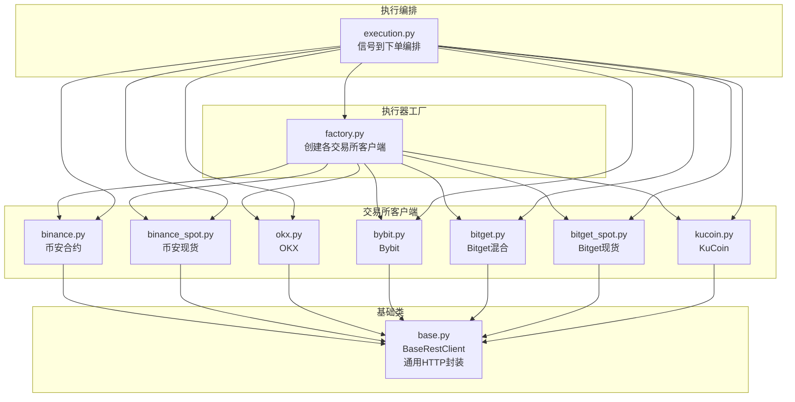
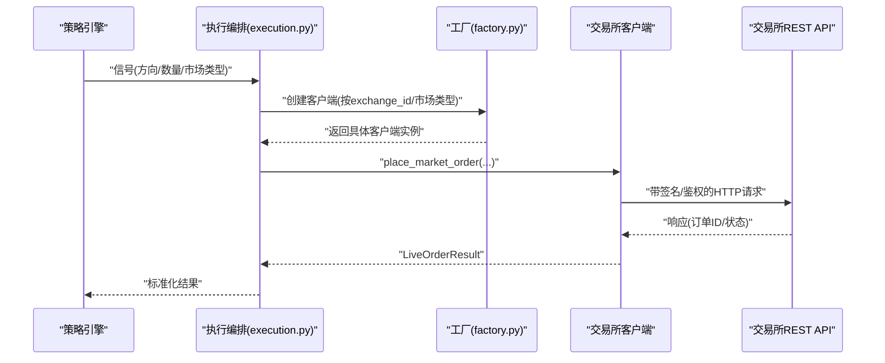
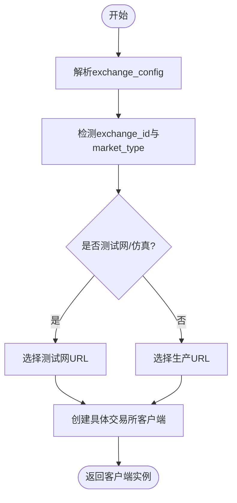
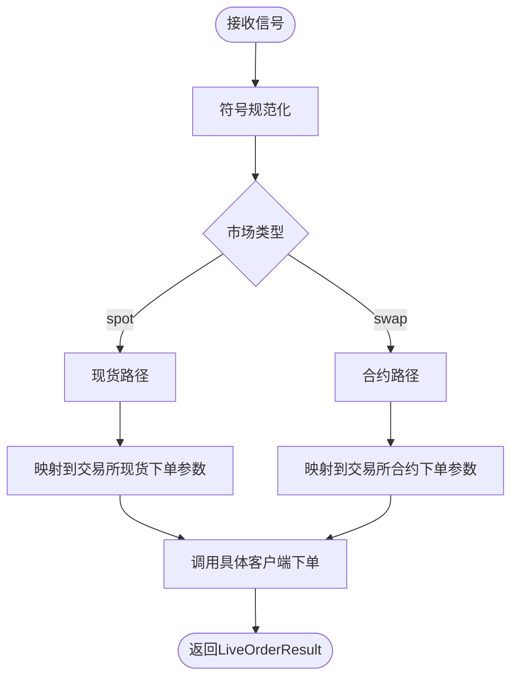
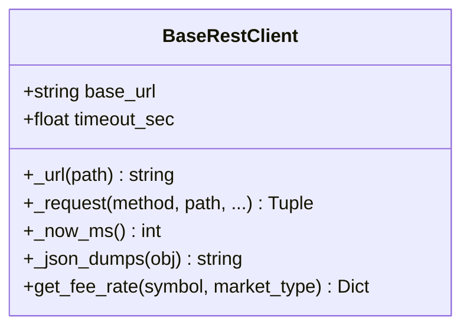
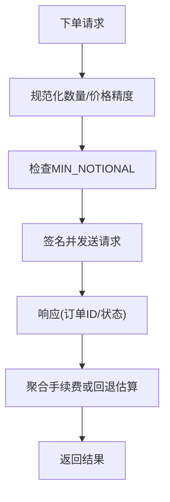
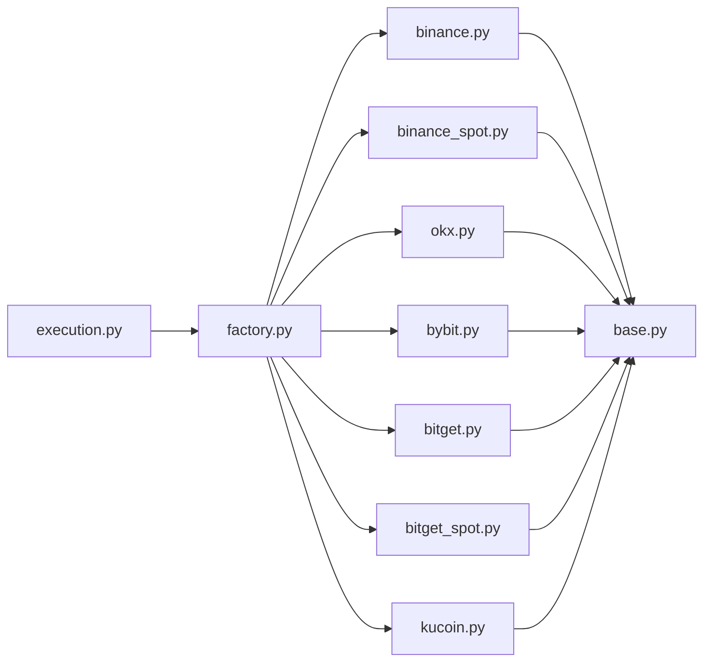

# 交易所执行器

<cite>
**本文档引用的文件**
- [factory.py](file://backend_api_python/app/services/live_trading/factory.py)
- [base.py](file://backend_api_python/app/services/live_trading/base.py)
- [execution.py](file://backend_api_python/app/services/live_trading/execution.py)
- [binance.py](file://backend_api_python/app/services/live_trading/binance.py)
- [binance_spot.py](file://backend_api_python/app/services/live_trading/binance_spot.py)
- [okx.py](file://backend_api_python/app/services/live_trading/okx.py)
- [bybit.py](file://backend_api_python/app/services/live_trading/bybit.py)
- [bitget.py](file://backend_api_python/app/services/live_trading/bitget.py)
- [bitget_spot.py](file://backend_api_python/app/services/live_trading/bitget_spot.py)
- [kucoin.py](file://backend_api_python/app/services/live_trading/kucoin.py)
</cite>

## 目录
1. [简介](#简介)
2. [项目结构](#项目结构)
3. [核心组件](#核心组件)
4. [架构总览](#架构总览)
5. [详细组件分析](#详细组件分析)
6. [依赖关系分析](#依赖关系分析)
7. [性能考虑](#性能考虑)
8. [故障排除指南](#故障排除指南)
9. [结论](#结论)

## 简介
本文件为量化交易系统中的“交易所执行器”模块提供全面开发文档。该模块负责将策略信号转化为各主流交易所的直接REST下单调用，覆盖币安（现货/合约）、OKX、Bybit、Bitget（混合/现货）、KuCoin（现货/合约）、Gate.io、Deepcoin、HTX、Kraken（现货/合约）以及传统市场（IBKR美股、MT5外汇）。

重点内容包括：
- 工厂模式创建与配置策略
- 认证机制与签名流程
- 连接池与超时设置
- 订单类型支持与交易对过滤
- 杠杆交易、期货合约、期权等差异化处理
- 费率计算、最小交易单位、价格精度与下单限制
- 错误处理、重试机制、风控措施与性能优化

## 项目结构
执行器位于后端Python服务的`live_trading`子模块下，采用“工厂 + 每交易所独立客户端”的架构设计，便于扩展与维护。

**图表来源**
- [factory.py:126-285](file://backend_api_python/app/services/live_trading/factory.py#L126-L285)
- [execution.py:123-310](file://backend_api_python/app/services/live_trading/execution.py#L123-L310)
- [base.py:95-167](file://backend_api_python/app/services/live_trading/base.py#L95-L167)

**章节来源**
- [factory.py:1-441](file://backend_api_python/app/services/live_trading/factory.py#L1-L441)
- [execution.py:1-426](file://backend_api_python/app/services/live_trading/execution.py#L1-L426)
- [base.py:1-168](file://backend_api_python/app/services/live_trading/base.py#L1-L168)

## 核心组件
- 工厂模式（create_client）：根据配置动态创建对应交易所客户端实例，支持测试网/仿真模式切换、URL覆盖、参数归一化。
- 执行编排（place_order_from_signal）：将策略信号映射为具体交易所下单参数，处理现货/合约差异、买/卖方向、开仓/减仓逻辑。
- 基础HTTP客户端（BaseRestClient）：统一请求封装、超时控制、SSL验证策略、错误解析与重试提示。
- 交易所客户端：各交易所独立实现，包含签名、精度处理、缓存、风控与查询接口。

关键特性：
- 统一的LiveOrderResult输出结构，便于上层汇总与展示。
- 针对不同交易所的“最佳努力”缓存（如合约/仪器信息、账户配置、手续费率），降低请求频率。
- 对时间偏移与服务器时间的同步处理，避免签名或时钟偏差导致的错误。

**章节来源**
- [factory.py:126-285](file://backend_api_python/app/services/live_trading/factory.py#L126-L285)
- [execution.py:123-310](file://backend_api_python/app/services/live_trading/execution.py#L123-L310)
- [base.py:95-167](file://backend_api_python/app/services/live_trading/base.py#L95-L167)

## 架构总览
执行器整体工作流：策略信号 → 执行编排 → 工厂创建客户端 → 交易所下单 → 返回标准化结果。

**图表来源**
- [execution.py:123-310](file://backend_api_python/app/services/live_trading/execution.py#L123-L310)
- [factory.py:126-285](file://backend_api_python/app/services/live_trading/factory.py#L126-L285)

## 详细组件分析

### 工厂模式与客户端创建
- 支持的交易所：币安（现货/合约）、OKX、Bitget（混合/现货）、Bybit、Coinbase、Kraken（现货/合约）、KuCoin（现货/合约）、Gate.io、Deepcoin、HTX、IBKR（美股）、MT5（外汇）。
- 测试网/仿真模式：通过统一的开关判断与URL覆盖，确保测试环境与生产环境隔离。
- 参数归一化：对exchange_config进行键名兼容处理（如enable_demo_trading、use_testnet、base_url等），保证前端/后端命名差异不影响创建。

**图表来源**
- [factory.py:76-120](file://backend_api_python/app/services/live_trading/factory.py#L76-L120)
- [factory.py:126-285](file://backend_api_python/app/services/live_trading/factory.py#L126-L285)

**章节来源**
- [factory.py:1-441](file://backend_api_python/app/services/live_trading/factory.py#L1-L441)

### 执行编排与信号映射
- 信号到方向映射：支持开多、加多、开空、加空、平多、减多、平空、减空等。
- 市场类型归一：将futures/future/perp/perpetual统一为swap。
- 现货不支持做空：在执行前进行校验，避免错误信号。
- 符号规范化：统一处理裸符号（如PI、TRX）与含冒号的合约标识，确保与交易所格式一致。
- 不同交易所下单差异：
  - 币安合约：支持position_side与reduce_only。
  - OKX：支持td_mode（保证金模式）与pos_side（多空方向）。
  - Bitget混合：支持margin_coin、product_type、margin_mode与pos_side字段。
  - KuCoin现货：支持quote_size标记以区分买入时按报价金额下单。
  - Gate/Bybit/Kraken等：按各自API字段映射下单。

**图表来源**
- [execution.py:41-151](file://backend_api_python/app/services/live_trading/execution.py#L41-L151)
- [execution.py:153-310](file://backend_api_python/app/services/live_trading/execution.py#L153-L310)

**章节来源**
- [execution.py:1-426](file://backend_api_python/app/services/live_trading/execution.py#L1-L426)

### 基础HTTP客户端（BaseRestClient）
- 统一的请求封装：支持GET/POST，自动拼接URL、设置超时、SSL验证策略。
- SSL验证策略：优先使用环境变量/LDAP证书包，其次系统CA，最后certifi；可禁用（仅用于开发）。
- 错误处理：对Unicode编码、TLS验证失败、非JSON响应进行分类处理与日志记录。
- 时间戳工具：提供毫秒级时间戳与JSON序列化辅助。

**图表来源**
- [base.py:95-167](file://backend_api_python/app/services/live_trading/base.py#L95-L167)

**章节来源**
- [base.py:1-168](file://backend_api_python/app/services/live_trading/base.py#L1-L168)

### 币安（Binance）执行器
- 认证机制：HMAC-SHA256签名，X-MBX-APIKEY头，时间同步（-1021错误自动重同步）。
- 精度与过滤：通过exchangeInfo获取LOT_SIZE/PRICE_FILTER等约束，使用Decimal量化与向下取整，避免-1111精度错误。
- 最小成交额（MIN_NOTIONAL）校验：基于markPrice近似notional，防止过小订单被拒绝。
- 双向/单向持仓模式：通过positionSide/dualSide判断下单时是否需要显式pos_side。
- 费率与手续费：优先从fills聚合，回退到commissionRate估算。
- 下单字段：支持reduce_only、position_side、client_order_id前缀化（带broker_id）。

**图表来源**
- [binance.py:364-426](file://backend_api_python/app/services/live_trading/binance.py#L364-L426)
- [binance.py:735-800](file://backend_api_python/app/services/live_trading/binance.py#L735-L800)

**章节来源**
- [binance.py:1-1036](file://backend_api_python/app/services/live_trading/binance.py#L1-L1036)
- [binance_spot.py:1-717](file://backend_api_python/app/services/live_trading/binance_spot.py#L1-L717)

### OKX执行器
- 认证机制：HMAC-SHA256签名，包含OK-ACCESS-*系列头，支持仿真交易标签。
- 仪器元数据缓存：instrument信息（lotSz、minSz、ctVal等）缓存，减少请求。
- 仓位模式兼容：net_mode与long_short_mode分别处理posSide与reduceOnly。
- 下单字段：td_mode（cross/isolated）、pos_side（net/long/short）、reduceOnly、clOrdId、tag（broker）。
- 成交与费率：通过fills接口聚合，支持ctVal转换基数量。

**章节来源**
- [okx.py:1-884](file://backend_api_python/app/services/live_trading/okx.py#L1-L884)

### Bybit执行器
- 认证机制：HMAC-SHA256签名，X-BAPI-*系列头，严格时间同步（retCode 10002重试）。
- 仪器信息缓存：category+symbol维度缓存，支持线性/现货两类。
- 数量/价格规范化：依据qtyStep/priceFilter与tickSize，结合精度推断。
- 下单字段：category（linear/spot）、positionIdx（对冲模式）、reduceOnly、orderLinkId。
- 成交与费率：支持cumExecFee/cumFeeDetail提取，线性合约默认USDT计费。

**章节来源**
- [bybit.py:1-747](file://backend_api_python/app/services/live_trading/bybit.py#L1-L747)

### Bitget执行器（混合/现货）
- 认证机制：HMAC-SHA256签名，ACCESS-*系列头，支持通道码（X-CHANNEL-API-CODE）。
- 混合合约：支持posMode（hedge_mode/one_way_mode）与tradeSide/open/close字段映射，支持reduceOnly。
- 现货：按symbol元数据（quantityScale/quantityStep等）规范化下单数量。
- 费用解析：feeDetail可能为列表/字典/JSON字符串，统一解析求和。
- 杠杆设置：按productType+symbol+marginCoin+marginMode+holdSide+lever缓存，避免频繁设置。

**章节来源**
- [bitget.py:1-1084](file://backend_api_python/app/services/live_trading/bitget.py#L1-L1084)
- [bitget_spot.py:1-598](file://backend_api_python/app/services/live_trading/bitget_spot.py#L1-L598)

### KuCoin执行器（现货/合约）
- 认证机制：KC-API-*系列头，v2版本passphrase签名。
- 现货：支持quote_size标记，使买入按报价金额下单；下单字段简洁，支持clientOid。
- 合约：按multiplier将基数量转换为合约数，下单字段包含reduceOnly/postOnly。
- 成交与费率：dealSize/dealValue转换为基数量与均价，费用通常为USDT。

**章节来源**
- [kucoin.py:1-538](file://backend_api_python/app/services/live_trading/kucoin.py#L1-L538)

### 其他交易所（Gate.io、Deepcoin、HTX、Kraken、Coinbase、IBKR、MT5）
- Gate.io：支持现货与USDT合约，按category与symbol缓存仪器信息，支持channel_id。
- Deepcoin：支持自定义base_url与market_type，按需延迟初始化。
- HTX：支持现货与合约，按broker_id与URL配置，按需延迟初始化。
- Kraken：现货REST无独立沙箱URL，合约使用独立域名；支持费率查询。
- Coinbase：仅支持现货，按sandbox与生产URL切换。
- IBKR：美股股票交易，需预先建立TWS/Gateway连接，不支持做空。
- MT5：外汇专用，需Windows平台与终端，按symbol规范化后下单。

**章节来源**
- [factory.py:236-421](file://backend_api_python/app/services/live_trading/factory.py#L236-L421)

## 依赖关系分析
- 组件内聚：每个交易所客户端独立实现，职责清晰，便于单元测试与演进。
- 组件耦合：执行编排依赖工厂创建的具体客户端；所有客户端继承BaseRestClient，共享HTTP与错误处理能力。
- 外部依赖：各交易所API、时间同步、SSL证书链；部分客户端依赖特定库（如ib_insync、MetaTrader5）。

**图表来源**
- [execution.py:14-38](file://backend_api_python/app/services/live_trading/execution.py#L14-L38)
- [factory.py:18-31](file://backend_api_python/app/services/live_trading/factory.py#L18-L31)
- [base.py:18-18](file://backend_api_python/app/services/live_trading/base.py#L18-L18)

**章节来源**
- [execution.py:1-426](file://backend_api_python/app/services/live_trading/execution.py#L1-L426)
- [factory.py:1-441](file://backend_api_python/app/services/live_trading/factory.py#L1-L441)
- [base.py:1-168](file://backend_api_python/app/services/live_trading/base.py#L1-L168)

## 性能考虑
- 缓存策略：各客户端对仪器/合约/账户配置/手续费率进行“最佳努力”缓存，降低重复请求。
- 精度控制：使用Decimal量化与向下取整，避免因精度不足导致的下单失败。
- 时间同步：对关键交易所进行服务器时间同步，减少因时钟偏差导致的签名失败。
- 请求合并：在可行场景下合并多次查询，减少网络往返。
- 超时与重试：统一超时设置与错误提示，避免阻塞；对特定错误码进行有限重试。

[本节为通用指导，无需列出具体文件来源]

## 故障排除指南
常见问题与定位要点：
- 认证失败（非ASCII字符）：检查API Key/Secret/Passphrase是否包含非ASCII字符或隐藏空白。
- TLS验证失败：检查LIVE_TRADING_SSL_VERIFY、LIVE_TRADING_CA_BUNDLE等环境变量，确保系统CA链可用。
- 时钟偏差（-1021/10002）：启用服务器时间同步，确保本地时间与交易所时间差在窗口内。
- 精度错误（-1111）：检查LOT_SIZE/PRICE_FILTER与stepSize/priceStep，确保下单数量/价格匹配精度。
- 最小成交额（MIN_NOTIONAL）：使用markPrice近似notional，确保订单价值满足最低要求。
- 权限不足（401/50120）：确认API Key已启用相应权限（如交易权限）。
- 仿真/测试网配置缺失：确保测试网URL或开关已正确设置。

**章节来源**
- [base.py:138-146](file://backend_api_python/app/services/live_trading/base.py#L138-L146)
- [binance.py:210-236](file://backend_api_python/app/services/live_trading/binance.py#L210-L236)
- [bybit.py:257-297](file://backend_api_python/app/services/live_trading/bybit.py#L257-L297)
- [okx.py:356-401](file://backend_api_python/app/services/live_trading/okx.py#L356-L401)

## 结论
本执行器模块通过工厂模式与标准化客户端设计，实现了对主流交易所的一致接入与差异化适配。其核心优势在于：
- 统一的信号到下单流程与结果结构；
- 针对各交易所的精度、过滤、认证与风控策略；
- 完善的缓存与时间同步机制；
- 清晰的错误处理与重试策略。

建议在扩展新交易所时遵循以下步骤：
- 在factory.py中注册新客户端与URL映射；
- 实现BaseRestClient派生类，完成签名与请求封装；
- 设计精度与过滤处理逻辑，必要时引入缓存；
- 编写信号映射与下单参数适配；
- 补充错误处理与测试用例。

[本节为总结性内容，无需列出具体文件来源]