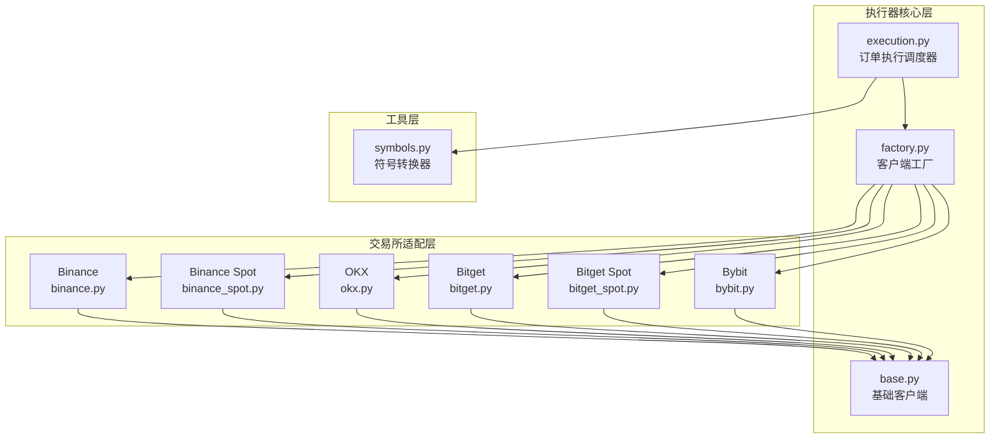
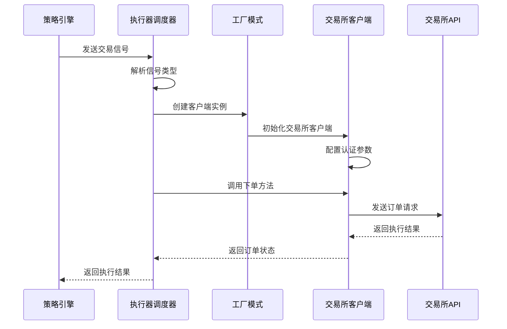
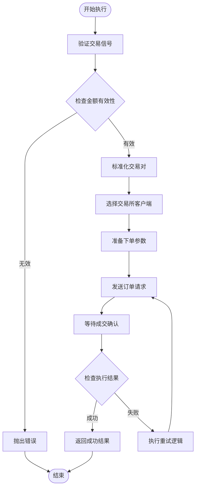
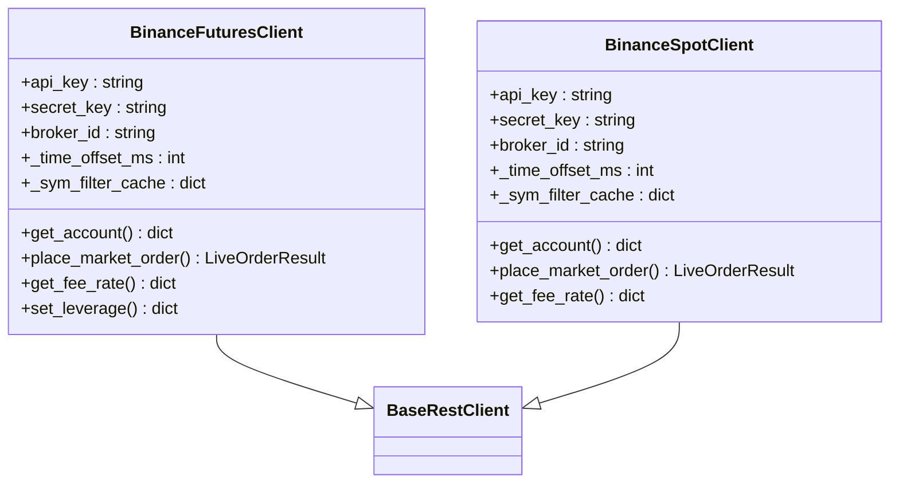
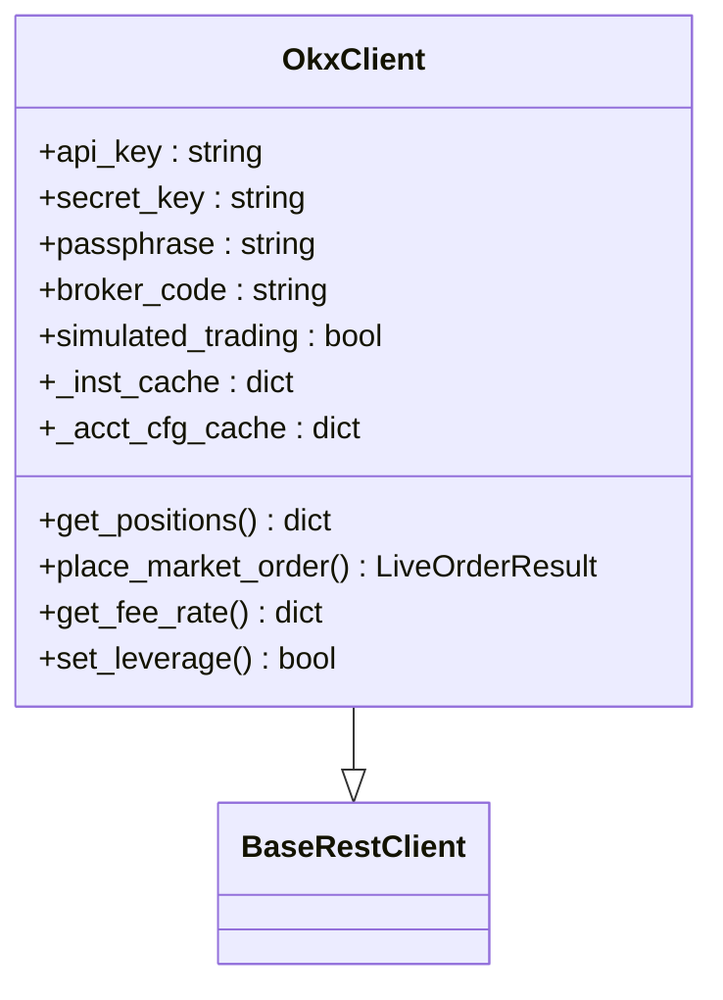
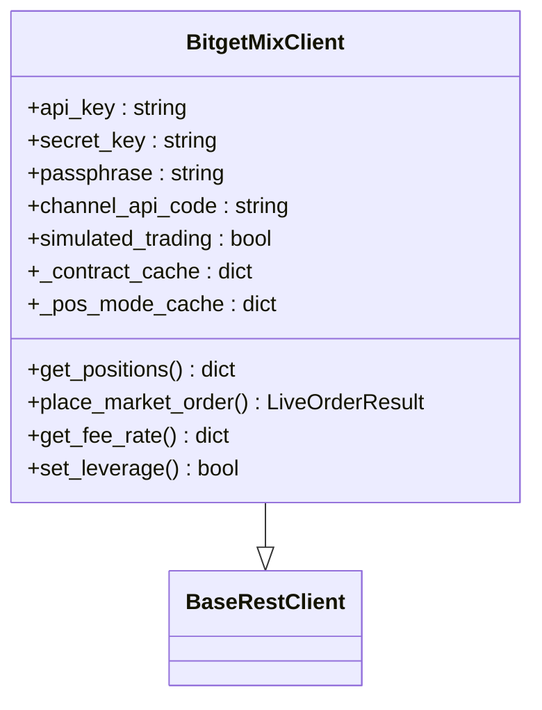
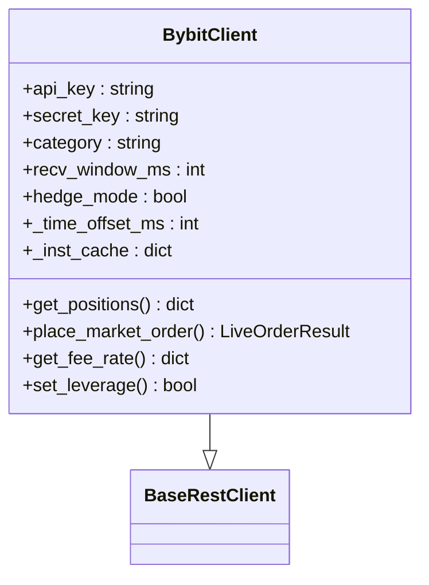
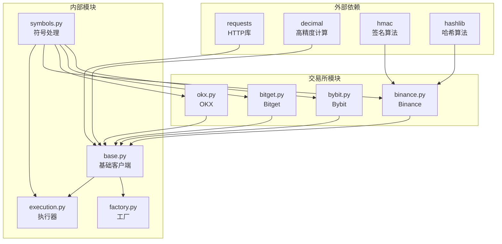

# 实时交易执行器

<cite>
**本文档引用的文件**
- [execution.py](file://backend_api_python/app/services/live_trading/execution.py)
- [factory.py](file://backend_api_python/app/services/live_trading/factory.py)
- [base.py](file://backend_api_python/app/services/live_trading/base.py)
- [binance.py](file://backend_api_python/app/services/live_trading/binance.py)
- [binance_spot.py](file://backend_api_python/app/services/live_trading/binance_spot.py)
- [okx.py](file://backend_api_python/app/services/live_trading/okx.py)
- [bitget.py](file://backend_api_python/app/services/live_trading/bitget.py)
- [bitget_spot.py](file://backend_api_python/app/services/live_trading/bitget_spot.py)
- [bybit.py](file://backend_api_python/app/services/live_trading/bybit.py)
- [symbols.py](file://backend_api_python/app/services/live_trading/symbols.py)
</cite>

## 目录
1. [简介](#简介)
2. [项目结构](#项目结构)
3. [核心组件](#核心组件)
4. [架构概览](#架构概览)
5. [详细组件分析](#详细组件分析)
6. [依赖关系分析](#依赖关系分析)
7. [性能考虑](#性能考虑)
8. [故障排除指南](#故障排除指南)
9. [结论](#结论)

## 简介

QuantDinger 实时交易执行器是一个高度模块化的多交易所交易系统，支持包括 Binance、OKX、Bitget、Bybit、Coinbase、Kraken、KuCoin、Gate、Deepcoin 和 HTX 在内的多个主流加密货币交易所。该系统采用工厂模式设计，提供了统一的订单执行接口，同时针对每个交易所的特定要求进行优化。

系统的核心功能包括：
- 统一的订单执行接口，支持市价单和限价单
- 多交易所适配，支持期货和现货市场
- 智能符号规范化处理
- 完整的错误处理和重试机制
- 实时仓位管理和风险管理

## 项目结构

实时交易执行器模块位于 `backend_api_python/app/services/live_trading/` 目录下，采用清晰的分层架构：

**图表来源**
- [execution.py:1-426](file://backend_api_python/app/services/live_trading/execution.py#L1-L426)
- [factory.py:1-441](file://backend_api_python/app/services/live_trading/factory.py#L1-L441)
- [base.py:1-168](file://backend_api_python/app/services/live_trading/base.py#L1-L168)

**章节来源**
- [execution.py:1-40](file://backend_api_python/app/services/live_trading/execution.py#L1-L40)
- [factory.py:1-41](file://backend_api_python/app/services/live_trading/factory.py#L1-L41)

## 核心组件

### 执行器调度器

执行器调度器是整个系统的协调中心，负责将策略信号转换为具体的交易所订单操作。其主要职责包括：

- **信号到订单映射**：将策略信号转换为具体的买卖方向和仓位操作
- **交易所适配**：根据不同的交易所特性调用相应的下单方法
- **参数标准化**：统一处理不同交易所的参数差异
- **错误处理**：提供统一的异常处理机制

### 工厂模式实现

工厂模式用于创建和管理不同交易所的客户端实例，具有以下特点：

- **延迟加载**：仅在需要时才导入特定交易所的客户端
- **配置驱动**：通过配置参数动态选择合适的交易所客户端
- **统一接口**：为所有交易所提供一致的客户端接口

### 基础客户端框架

基础客户端定义了所有交易所客户端的通用接口和基础设施：

- **HTTP 请求封装**：提供统一的 HTTP 请求处理机制
- **签名验证**：支持不同交易所的签名算法
- **错误处理**：标准化的错误处理和日志记录
- **SSL 验证**：灵活的 SSL 证书验证配置

**章节来源**
- [execution.py:123-310](file://backend_api_python/app/services/live_trading/execution.py#L123-L310)
- [factory.py:126-285](file://backend_api_python/app/services/live_trading/factory.py#L126-L285)
- [base.py:95-167](file://backend_api_python/app/services/live_trading/base.py#L95-L167)

## 架构概览

系统采用分层架构设计，确保了良好的可扩展性和维护性：

**图表来源**
- [execution.py:123-310](file://backend_api_python/app/services/live_trading/execution.py#L123-L310)
- [factory.py:126-285](file://backend_api_python/app/services/live_trading/factory.py#L126-L285)

### 订单执行流程

系统实现了完整的订单执行生命周期管理：

**图表来源**
- [execution.py:123-310](file://backend_api_python/app/services/live_trading/execution.py#L123-L310)

**章节来源**
- [execution.py:1-426](file://backend_api_python/app/services/live_trading/execution.py#L1-L426)

## 详细组件分析

### Binance 交易所适配

Binance 是系统支持的主要交易所之一，提供了全面的期货和现货交易功能：

#### 认证机制
- **API 密钥管理**：支持标准的 API Key/Secret Key 认证
- **时间同步**：自动同步服务器时间，避免时间戳错误
- **签名算法**：使用 HMAC-SHA256 进行请求签名

#### 精度控制
- **数量精度**：严格遵循交易所的步进大小要求
- **价格精度**：精确控制价格的小数位数
- **最小交易量**：检查并满足交易所的最小交易量要求

#### 仓位管理
- **双向模式**：支持 hedge 模式和 one-way 模式
- **杠杆设置**：动态设置和管理杠杆水平
- **保证金管理**：跟踪和管理保证金使用情况

**图表来源**
- [binance.py:24-800](file://backend_api_python/app/services/live_trading/binance.py#L24-L800)
- [binance_spot.py:21-717](file://backend_api_python/app/services/live_trading/binance_spot.py#L21-L717)

**章节来源**
- [binance.py:1-800](file://backend_api_python/app/services/live_trading/binance.py#L1-L800)
- [binance_spot.py:1-717](file://backend_api_python/app/services/live_trading/binance_spot.py#L1-L717)

### OKX 交易所适配

OKX 提供了专业的衍生品交易服务，系统对其进行了深度适配：

#### 仪表盘集成
- **Broker Code**：支持通过 Broker Code 进行交易员识别
- **模拟交易**：内置模拟交易模式支持
- **账户配置**：动态获取和缓存账户配置信息

#### 仓位模式兼容
- **net_mode**：支持净头寸模式
- **long_short_mode**：支持双向持仓模式
- **自动模式检测**：自动检测和适应账户的仓位模式

#### 风险管理
- **保证金模式**：支持交叉保证金和逐仓保证金
- **杠杆设置**：动态设置和管理杠杆水平
- **风险控制**：实施严格的风险控制措施

**图表来源**
- [okx.py:25-800](file://backend_api_python/app/services/live_trading/okx.py#L25-L800)

**章节来源**
- [okx.py:1-800](file://backend_api_python/app/services/live_trading/okx.py#L1-L800)

### Bitget 交易所适配

Bitget 提供了创新的混合交易服务，系统支持其独特的交易模式：

#### 混合模式支持
- **hedge_mode**：支持双向持仓模式
- **one_way_mode**：支持单向持仓模式
- **自动切换**：根据账户配置自动切换模式

#### 产品类型管理
- **USDT-FUTURES**：支持 USDT 保证金合约
- **COIN-FUTURES**：支持币本位合约
- **SPOT**：支持现货交易

#### 通道 API 支持
- **X-CHANNEL-API-CODE**：支持通过通道 API 进行交易
- **批量订单**：支持批量订单处理
- **计划订单**：支持条件订单设置

**图表来源**
- [bitget.py:26-800](file://backend_api_python/app/services/live_trading/bitget.py#L26-L800)

**章节来源**
- [bitget.py:1-800](file://backend_api_python/app/services/live_trading/bitget.py#L1-L800)

### Bybit 交易所适配

Bybit 提供了高性能的衍生品交易平台，系统对其进行了全面适配：

#### 时间同步机制
- **服务器时间校准**：自动同步 Bybit 服务器时间
- **时钟偏移补偿**：处理本地时钟与服务器时钟的差异
- **重试机制**：在时间不匹配时自动重试

#### 价格精度控制
- **步进大小管理**：严格遵循交易所的价格步进要求
- **小数位数控制**：精确控制价格的小数位数
- **最小价格检查**：确保价格不低于最小限制

#### 仓位索引管理
- **positionIdx 支持**：支持双向持仓的精确控制
- **自动模式检测**：自动检测和适应 hedge 模式
- **仓位方向管理**：精确管理多头和空头仓位

**图表来源**
- [bybit.py:27-747](file://backend_api_python/app/services/live_trading/bybit.py#L27-L747)

**章节来源**
- [bybit.py:1-747](file://backend_api_python/app/services/live_trading/bybit.py#L1-L747)

### 符号规范化系统

系统提供了统一的符号规范化处理机制，确保不同交易所的符号格式一致性：

#### 符号转换规则
- **Binance 格式**：BTCUSDT（无分隔符）
- **OKX 格式**：BTC-USDT-SWAP（连字符分隔）
- **Bybit 格式**：BTCUSDT（无分隔符）
- **Kraken 格式**：XBTUSDT（基础货币映射）

#### 输入格式支持
- **CCXT 格式**：SOL/USDT:USDT
- **简化格式**：BTCUSDT
- **带冒号格式**：BTC/USDT:USDT
- **默认报价货币**：对于没有报价货币的符号，默认使用 USDT

**章节来源**
- [symbols.py:1-235](file://backend_api_python/app/services/live_trading/symbols.py#L1-L235)

## 依赖关系分析

系统采用了松耦合的设计原则，通过接口和抽象类实现模块间的解耦：

**图表来源**
- [base.py:11-18](file://backend_api_python/app/services/live_trading/base.py#L11-L18)
- [execution.py:10-39](file://backend_api_python/app/services/live_trading/execution.py#L10-L39)

### 循环依赖避免

系统通过以下机制避免循环依赖：

- **延迟导入**：使用字符串形式的导入语句
- **接口抽象**：通过抽象基类定义接口契约
- **工厂模式**：通过工厂函数创建对象实例
- **配置驱动**：通过配置参数控制行为

**章节来源**
- [execution.py:28-39](file://backend_api_python/app/services/live_trading/execution.py#L28-L39)
- [factory.py:33-39](file://backend_api_python/app/services/live_trading/factory.py#L33-L39)

## 性能考虑

### 缓存策略

系统实现了多层次的缓存机制以提高性能：

#### 公共缓存
- **符号过滤器缓存**：缓存交易所的符号过滤信息
- **账户配置缓存**：缓存账户配置和参数
- **时间偏移缓存**：缓存服务器时间偏移信息

#### 交易所特定缓存
- **合约元数据缓存**：缓存合约的详细信息
- **价格精度缓存**：缓存价格和数量的精度要求
- **费用率缓存**：缓存当前的交易费用率

### 并发处理

系统支持并发操作，但需要注意以下限制：

- **API 速率限制**：遵守各交易所的 API 速率限制
- **请求去重**：避免重复的请求发送
- **状态同步**：确保多线程环境下的状态一致性

### 内存管理

- **缓存 TTL**：设置合理的缓存过期时间
- **内存清理**：定期清理过期的缓存数据
- **资源释放**：及时释放不再使用的资源

## 故障排除指南

### 常见错误类型

#### 认证错误
- **API Key 无效**：检查 API Key 和 Secret Key 的正确性
- **权限不足**：确认 API Key 具有必要的交易权限
- **IP 白名单**：确保服务器 IP 在交易所的白名单中

#### 参数错误
- **符号格式错误**：使用系统提供的符号规范化功能
- **数量精度错误**：检查数量是否符合交易所的步进要求
- **价格精度错误**：确保价格符合交易所的价格精度要求

#### 网络错误
- **连接超时**：检查网络连接和代理设置
- **SSL 证书验证**：配置正确的 SSL 证书路径
- **防火墙阻拦**：确保必要的端口未被防火墙阻拦

### 调试技巧

#### 日志分析
- **启用详细日志**：设置适当的日志级别进行调试
- **请求响应追踪**：记录完整的请求和响应信息
- **错误堆栈分析**：分析错误发生的完整调用链

#### 性能监控
- **响应时间监控**：监控各交易所的响应时间
- **错误率统计**：统计各类错误的发生频率
- **资源使用监控**：监控内存和 CPU 使用情况

**章节来源**
- [base.py:138-146](file://backend_api_python/app/services/live_trading/base.py#L138-L146)
- [binance.py:218-236](file://backend_api_python/app/services/live_trading/binance.py#L218-L236)

## 结论

QuantDinger 实时交易执行器模块展现了优秀的软件工程实践，通过模块化设计、工厂模式和统一接口实现了对多个交易所的高效支持。系统的关键优势包括：

### 技术优势
- **高度模块化**：清晰的分层架构便于维护和扩展
- **统一接口**：为不同交易所提供一致的编程接口
- **智能适配**：自动处理各交易所的参数差异
- **完善缓存**：多层次缓存机制提升性能

### 扩展性
- **易于新增交易所**：通过继承基础客户端类即可支持新交易所
- **灵活的配置**：通过配置参数控制行为和参数
- **插件化设计**：支持第三方交易所的插件集成

### 生产就绪
- **完善的错误处理**：全面的异常处理和恢复机制
- **性能优化**：经过优化的缓存和并发处理
- **安全考虑**：严格的认证和数据保护措施

该系统为量化交易提供了坚实的技术基础，能够支持复杂的交易策略和大规模的实盘交易需求。