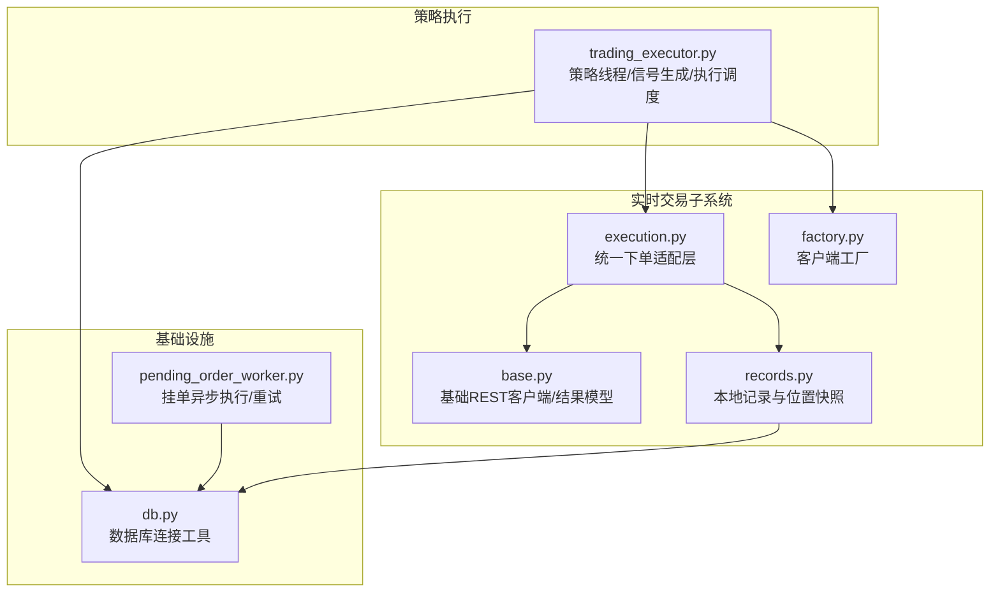
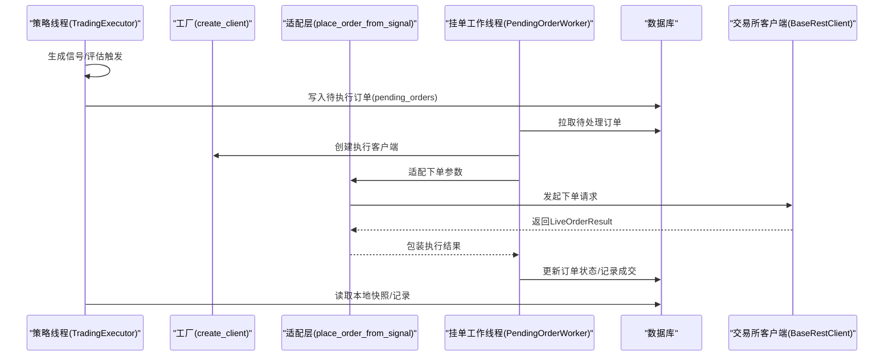
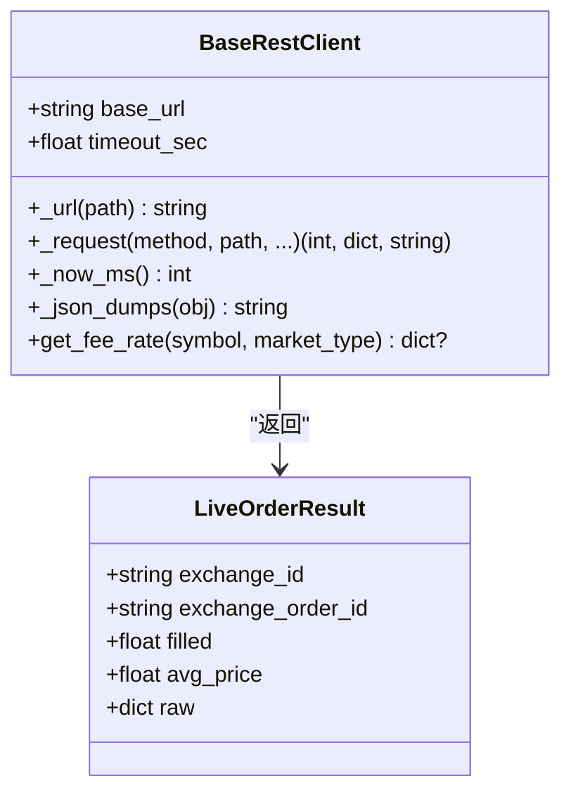
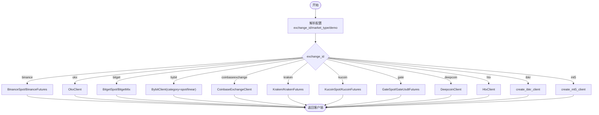
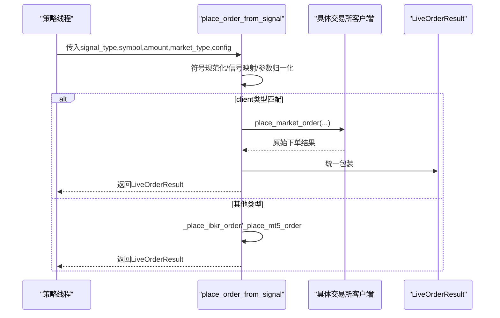
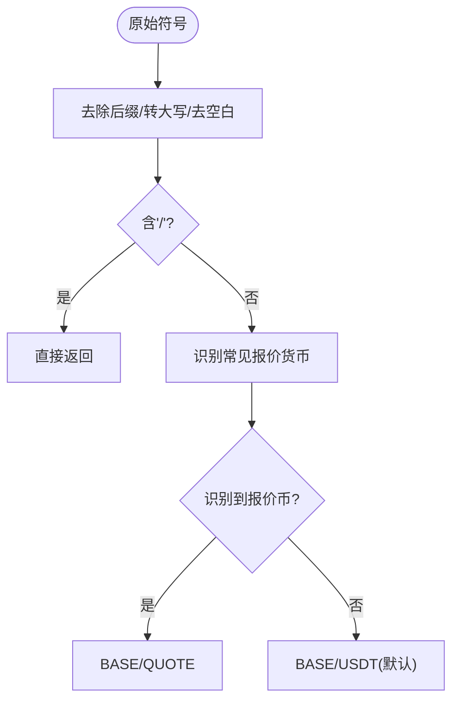
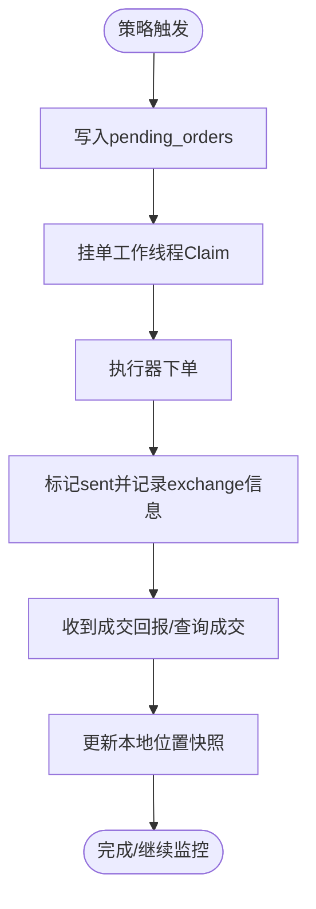
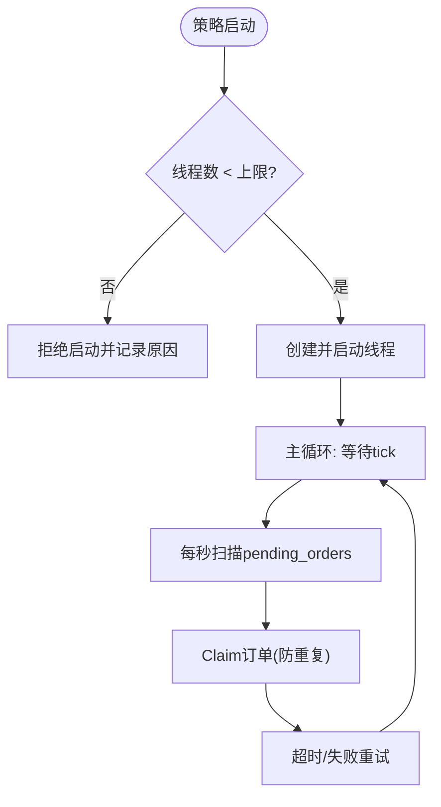
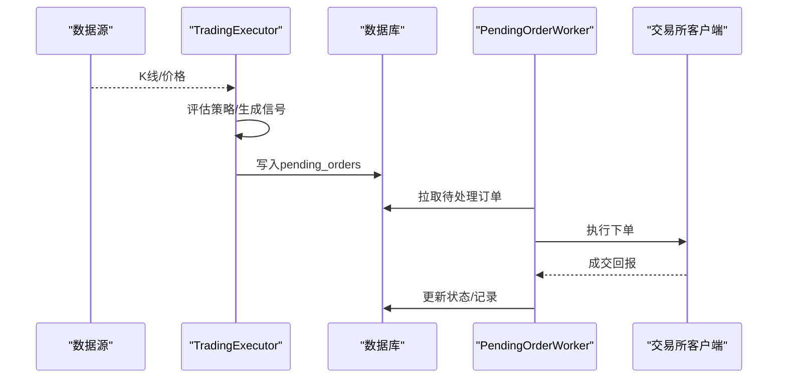
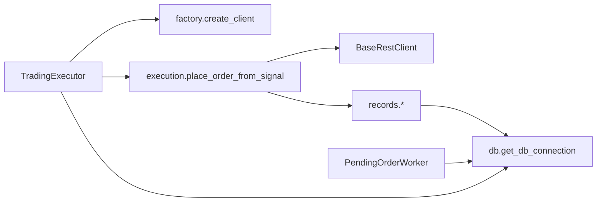

# 执行引擎

<cite>
**本文引用的文件**
- [execution.py](file://backend_api_python/app/services/live_trading/execution.py)
- [factory.py](file://backend_api_python/app/services/live_trading/factory.py)
- [base.py](file://backend_api_python/app/services/live_trading/base.py)
- [records.py](file://backend_api_python/app/services/live_trading/records.py)
- [trading_executor.py](file://backend_api_python/app/services/trading_executor.py)
- [db.py](file://backend_api_python/app/utils/db.py)
- [pending_order_worker.py](file://backend_api_python/app/services/pending_order_worker.py)
</cite>

## 目录
1. [简介](#简介)
2. [项目结构](#项目结构)
3. [核心组件](#核心组件)
4. [架构总览](#架构总览)
5. [详细组件分析](#详细组件分析)
6. [依赖分析](#依赖分析)
7. [性能考虑](#性能考虑)
8. [故障排查指南](#故障排查指南)
9. [结论](#结论)
10. [附录](#附录)

## 简介
本文件面向执行引擎核心模块，系统化阐述其架构设计与实现要点，覆盖以下主题：
- 基类与统一接口：BaseRestClient 的抽象与 LiveOrderResult 的标准化输出
- 工厂模式：create_client 的多交易所/多市场类型客户端创建机制
- 符号管理：跨交易所符号规范化与映射策略
- 订单生命周期：从策略信号到挂单提交、执行、回写与状态跟踪
- 并发与队列：策略线程模型、PendingOrderWorker 的异步执行与重试
- 统一适配层：place_order_from_signal 对不同执行器的适配与转换
- 配置与调优：环境变量、超时、去重、心跳与错误阈值
- 错误恢复与监控：自动停机策略、致命错误判定、日志与可观测性
- 与策略引擎集成：TradingExecutor 的信号生成、触发与执行闭环

## 项目结构
执行引擎相关代码集中于 live_trading 子模块，并与策略执行器、数据库工具、挂单工作线程协同工作。

**图表来源**
- [execution.py:123-311](file://backend_api_python/app/services/live_trading/execution.py#L123-L311)
- [factory.py:126-285](file://backend_api_python/app/services/live_trading/factory.py#L126-L285)
- [base.py:82-167](file://backend_api_python/app/services/live_trading/base.py#L82-L167)
- [records.py:85-125](file://backend_api_python/app/services/live_trading/records.py#L85-L125)
- [trading_executor.py:395-456](file://backend_api_python/app/services/trading_executor.py#L395-L456)
- [db.py:19-25](file://backend_api_python/app/utils/db.py#L19-L25)
- [pending_order_worker.py:73-82](file://backend_api_python/app/services/pending_order_worker.py#L73-L82)

**章节来源**
- [execution.py:1-426](file://backend_api_python/app/services/live_trading/execution.py#L1-L426)
- [factory.py:1-441](file://backend_api_python/app/services/live_trading/factory.py#L1-L441)
- [base.py:1-168](file://backend_api_python/app/services/live_trading/base.py#L1-L168)
- [records.py:1-280](file://backend_api_python/app/services/live_trading/records.py#L1-L280)
- [trading_executor.py:1-1599](file://backend_api_python/app/services/trading_executor.py#L1-L1599)
- [db.py:1-66](file://backend_api_python/app/utils/db.py#L1-L66)
- [pending_order_worker.py:73-82](file://backend_api_python/app/services/pending_order_worker.py#L73-L82)

## 核心组件
- BaseRestClient 与 LiveOrderResult：定义统一的请求封装、TLS/CA 证书验证策略、标准化返回结构，作为所有直连交易所客户端的基础。
- 工厂函数 create_client：依据 exchange_id、market_type、演示/仿真模式等配置，动态创建并初始化具体交易所客户端。
- 统一下单适配层 place_order_from_signal：将策略信号映射为各交易所/市场的下单参数，屏蔽差异。
- 本地记录与位置快照：标准化符号、插入/更新/删除本地交易记录与持仓快照，支撑 UI 展示与策略状态。
- 策略执行器 TradingExecutor：策略线程管理、信号生成、触发评估、批量执行与错误自愈。
- 挂单工作线程 PendingOrderWorker：从数据库队列取出待执行订单，异步调用执行器，处理重试、回滚与状态更新。

**章节来源**
- [base.py:82-167](file://backend_api_python/app/services/live_trading/base.py#L82-L167)
- [factory.py:126-285](file://backend_api_python/app/services/live_trading/factory.py#L126-L285)
- [execution.py:123-311](file://backend_api_python/app/services/live_trading/execution.py#L123-L311)
- [records.py:85-184](file://backend_api_python/app/services/live_trading/records.py#L85-L184)
- [trading_executor.py:395-456](file://backend_api_python/app/services/trading_executor.py#L395-L456)
- [pending_order_worker.py:73-82](file://backend_api_python/app/services/pending_order_worker.py#L73-L82)

## 架构总览
执行引擎采用“策略线程 + 工厂 + 适配层 + 异步挂单”的分层架构：
- 策略线程负责信号生成与触发评估；
- 工厂负责按配置创建合适的执行客户端；
- 适配层负责信号到下单参数的映射与兼容；
- 挂单工作线程负责异步执行与状态回写；
- 本地记录模块负责最佳努力的本地快照与统计。

**图表来源**
- [trading_executor.py:1414-1526](file://backend_api_python/app/services/trading_executor.py#L1414-L1526)
- [factory.py:126-285](file://backend_api_python/app/services/live_trading/factory.py#L126-L285)
- [execution.py:123-311](file://backend_api_python/app/services/live_trading/execution.py#L123-L311)
- [pending_order_worker.py:780-799](file://backend_api_python/app/services/pending_order_worker.py#L780-L799)
- [base.py:82-167](file://backend_api_python/app/services/live_trading/base.py#L82-L167)
- [records.py:85-125](file://backend_api_python/app/services/live_trading/records.py#L85-L125)

## 详细组件分析

### BaseRestClient 与 LiveOrderResult
- 统一请求封装：构造完整 URL、设置超时、处理响应解析与异常。
- TLS/CA 策略：优先使用环境变量指定的 CA Bundle，其次系统默认证书，最后尝试 certifi。
- 标准化结果：LiveOrderResult 提供 exchange_id、exchange_order_id、filled、avg_price、raw 字段，便于上层统一处理。

**图表来源**
- [base.py:95-167](file://backend_api_python/app/services/live_trading/base.py#L95-L167)

**章节来源**
- [base.py:34-167](file://backend_api_python/app/services/live_trading/base.py#L34-L167)

### 工厂模式：create_client
- 输入：exchange_config（含 exchange_id、api_key、secret、passphrase、market_type、演示开关等）
- 行为：解析配置、选择市场类型（swap/spot）、判断演示模式、按 exchange_id 分派到具体交易所客户端构造器
- 输出：BaseRestClient 子类实例（如 BinanceFuturesClient、OkxClient、BybitClient 等）

**图表来源**
- [factory.py:126-285](file://backend_api_python/app/services/live_trading/factory.py#L126-L285)

**章节来源**
- [factory.py:126-285](file://backend_api_python/app/services/live_trading/factory.py#L126-L285)

### 统一下单适配层：place_order_from_signal
- 输入：client（BaseRestClient 子类）、signal_type、symbol、amount、market_type、exchange_config、client_order_id
- 行为：
  - 参数校验与归一化（amount、signal_type 映射、market_type 归一化、符号规范化）
  - 针对不同 client 类型调用对应 place_market_order，并传递交易所特定参数
  - 对 IBKR/MT5 提供专用适配函数，统一返回 LiveOrderResult
- 输出：LiveOrderResult（标准化）

**图表来源**
- [execution.py:123-311](file://backend_api_python/app/services/live_trading/execution.py#L123-L311)

**章节来源**
- [execution.py:123-311](file://backend_api_python/app/services/live_trading/execution.py#L123-L311)

### 符号管理与映射
- 符号规范化：统一处理 BTCUSDT、BTC/USDT、BTC/USDT:USDT 等多种输入格式，确保交易所期望格式一致
- 信号映射：将策略信号 open_long/add_long/close_long/reduce_long 等映射为 buy/sell/pos_side/td_mode/减少开仓等参数
- 特殊处理：针对 spot 市场禁用 short 信号；针对不同交易所的 quote_size、margin_mode、product_type 等参数进行适配

**图表来源**
- [execution.py:41-82](file://backend_api_python/app/services/live_trading/execution.py#L41-L82)

**章节来源**
- [execution.py:41-101](file://backend_api_python/app/services/live_trading/execution.py#L41-L101)

### 订单生命周期与状态跟踪
- 本地记录：record_trade 插入交易明细；normalize_strategy_symbol 统一符号键
- 位置快照：upsert_position/apply_fill_to_local_position 维护本地持仓（size、entry_price、highest/lowest_price）
- 执行回写：PendingOrderWorker 根据交易所返回更新 pending_orders 状态（sent/processing/failed/deferred）

**图表来源**
- [records.py:85-184](file://backend_api_python/app/services/live_trading/records.py#L85-L184)
- [pending_order_worker.py:2504-2564](file://backend_api_python/app/services/pending_order_worker.py#L2504-L2564)

**章节来源**
- [records.py:85-278](file://backend_api_python/app/services/live_trading/records.py#L85-L278)
- [pending_order_worker.py:780-799](file://backend_api_python/app/services/pending_order_worker.py#L780-L799)

### 并发处理、队列与异步执行
- 策略线程模型：TradingExecutor.start_strategy 限制最大线程数（STRATEGY_MAX_THREADS），避免资源耗尽
- Tick 节奏：统一 tick 间隔（STRATEGY_TICK_INTERVAL_SEC，默认10s），降低 CPU 占用
- 去重与过期：按 (strategy_id, symbol, signal_type, ts) 去重，结合 K 线周期 TTL 控制重复下单
- 挂单队列：PendingOrderWorker 每次最多拉取一定数量订单，按优先级与 id 排序，支持重试与回收长时间处理中的订单

**图表来源**
- [trading_executor.py:413-424](file://backend_api_python/app/services/trading_executor.py#L413-L424)
- [pending_order_worker.py:73-82](file://backend_api_python/app/services/pending_order_worker.py#L73-L82)

**章节来源**
- [trading_executor.py:395-456](file://backend_api_python/app/services/trading_executor.py#L395-L456)
- [pending_order_worker.py:73-82](file://backend_api_python/app/services/pending_order_worker.py#L73-L82)

### 与策略引擎的集成与数据流
- 信号生成：TradingExecutor 在每个 K 线闭合或 Tick 时评估策略，生成待触发信号
- 触发评估：按即时/价格触发模式、状态机与优先级排序，过滤过期信号
- 执行提交：将信号写入 pending_orders，交由挂单工作线程异步执行
- 回写与通知：执行结果回写数据库，触发本地位置快照更新与 UI 通知

**图表来源**
- [trading_executor.py:1118-1538](file://backend_api_python/app/services/trading_executor.py#L1118-L1538)
- [pending_order_worker.py:780-799](file://backend_api_python/app/services/pending_order_worker.py#L780-L799)

**章节来源**
- [trading_executor.py:1118-1599](file://backend_api_python/app/services/trading_executor.py#L1118-L1599)

## 依赖分析
- 组件耦合
  - TradingExecutor 依赖工厂与适配层，间接依赖数据库工具
  - 适配层依赖基础客户端与交易所客户端
  - 挂单工作线程依赖数据库与适配层
  - 本地记录模块独立依赖数据库工具
- 外部依赖
  - requests（HTTP/TLS）
  - PostgreSQL（数据库）
  - 可选：MetaTrader5、ib_insync（传统/外汇特化）

**图表来源**
- [trading_executor.py:1036-1042](file://backend_api_python/app/services/trading_executor.py#L1036-L1042)
- [factory.py:126-285](file://backend_api_python/app/services/live_trading/factory.py#L126-L285)
- [execution.py:123-311](file://backend_api_python/app/services/live_trading/execution.py#L123-L311)
- [records.py:85-125](file://backend_api_python/app/services/live_trading/records.py#L85-L125)
- [db.py:19-25](file://backend_api_python/app/utils/db.py#L19-L25)
- [pending_order_worker.py:73-82](file://backend_api_python/app/services/pending_order_worker.py#L73-L82)

**章节来源**
- [db.py:19-25](file://backend_api_python/app/utils/db.py#L19-L25)

## 性能考虑
- 线程与资源
  - 通过 STRATEGY_MAX_THREADS 限制策略线程总数，避免 OOM 与线程耗尽
  - tick 间隔默认 10s，可根据市场波动率调整
- 数据库写入
  - 本地记录采用最佳努力策略，避免阻塞主流程
  - 位置快照使用 upsert 与冲突更新，减少写放大
- 网络与证书
  - 统一的 TLS/CA 解析策略，减少握手失败与重试
- 去重与过期
  - 信号去重与 TTL 控制，避免重复下单与堆积

[本节为通用建议，无需特定文件引用]

## 故障排查指南
- 自动停机策略
  - 连续错误阈值（STRATEGY_MAX_CONSECUTIVE_ERRORS）触发自动停机，避免噪声
  - 致命错误判定：API key 无效、产品不存在、SaaS 禁用等
- 日志与可观测性
  - 控制台打印与策略日志表记录，便于快速定位
  - 挂单工作线程记录失败原因与重试状态
- 常见问题
  - 交易所证书验证失败：设置 LIVE_TRADING_CA_BUNDLE 或使用系统证书
  - 线程启动失败：检查系统线程上限与资源占用
  - 挂单卡住：检查 PENDING_ORDER_STALE_SEC 与 POSITION_SYNC_ENABLED

**章节来源**
- [trading_executor.py:800-857](file://backend_api_python/app/services/trading_executor.py#L800-L857)
- [pending_order_worker.py:62-71](file://backend_api_python/app/services/pending_order_worker.py#L62-L71)

## 结论
执行引擎通过“工厂 + 适配层 + 统一结果模型”的设计，实现了多交易所、多市场的统一接入；配合策略线程与挂单工作线程的解耦，形成高可靠、可扩展的实时交易执行体系。本地记录与位置快照提供了良好的 UI 支撑与状态一致性保障。建议在生产环境中合理配置线程上限、tick 间隔与错误阈值，并完善监控告警与证书策略。

[本节为总结，无需特定文件引用]

## 附录

### 关键配置项与调优参数
- 策略线程与资源
  - STRATEGY_MAX_THREADS：策略线程上限
  - STRATEGY_TICK_INTERVAL_SEC：统一 tick 间隔
  - STRATEGY_MAX_CONSECUTIVE_ERRORS：连续错误阈值
- 交易所与证书
  - LIVE_TRADING_SSL_VERIFY / LIVE_TRADING_CA_BUNDLE / REQUESTS_CA_BUNDLE / SSL_CERT_FILE / CURL_CA_BUNDLE
- 挂单与同步
  - PENDING_ORDER_STALE_SEC：挂单回收阈值
  - POSITION_SYNC_ENABLED / POSITION_SYNC_INTERVAL_SEC：位置同步开关与周期

**章节来源**
- [trading_executor.py:60-66](file://backend_api_python/app/services/trading_executor.py#L60-L66)
- [trading_executor.py:1122-1127](file://backend_api_python/app/services/trading_executor.py#L1122-L1127)
- [trading_executor.py:803-808](file://backend_api_python/app/services/trading_executor.py#L803-L808)
- [pending_order_worker.py:62-71](file://backend_api_python/app/services/pending_order_worker.py#L62-L71)
- [base.py:34-79](file://backend_api_python/app/services/live_trading/base.py#L34-L79)