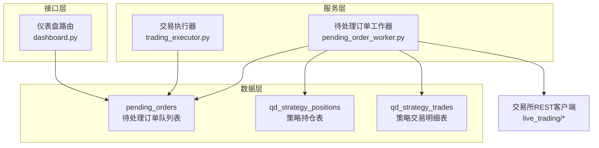
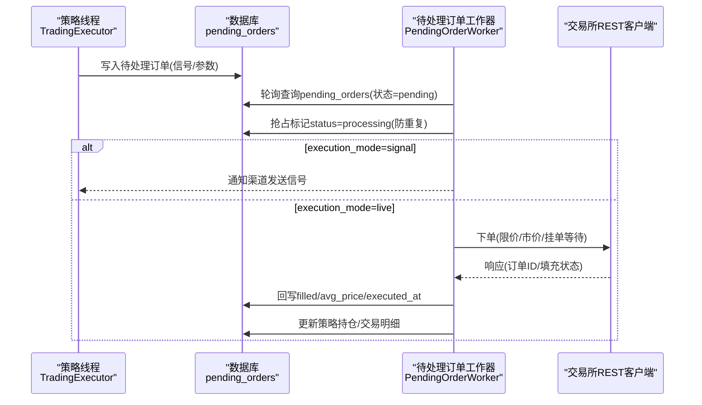
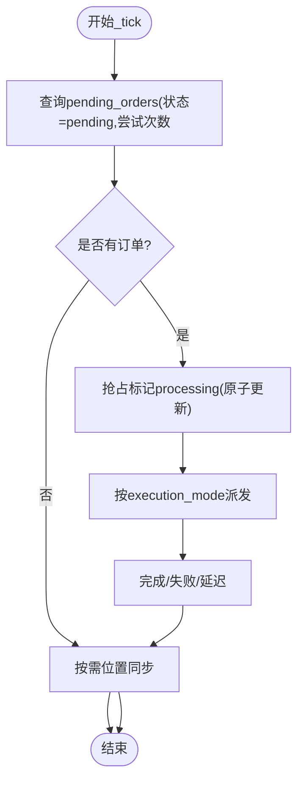
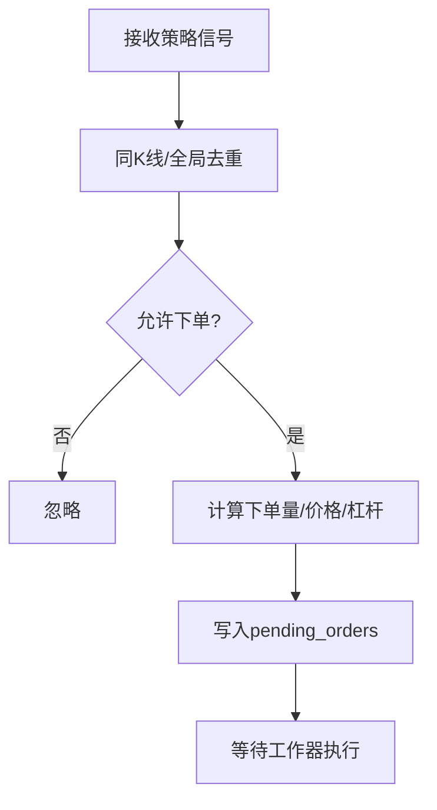
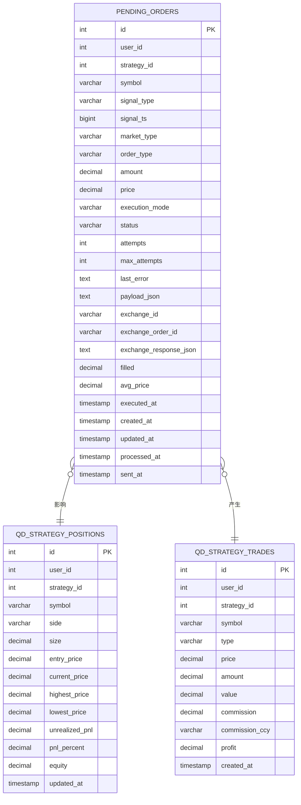
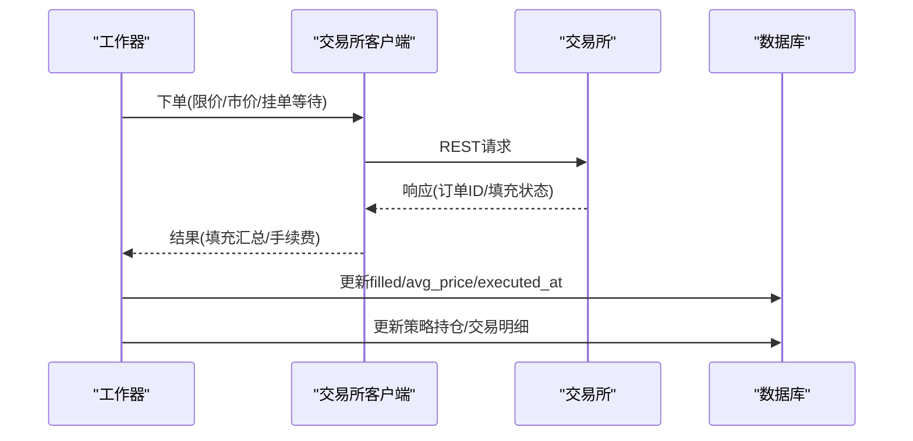
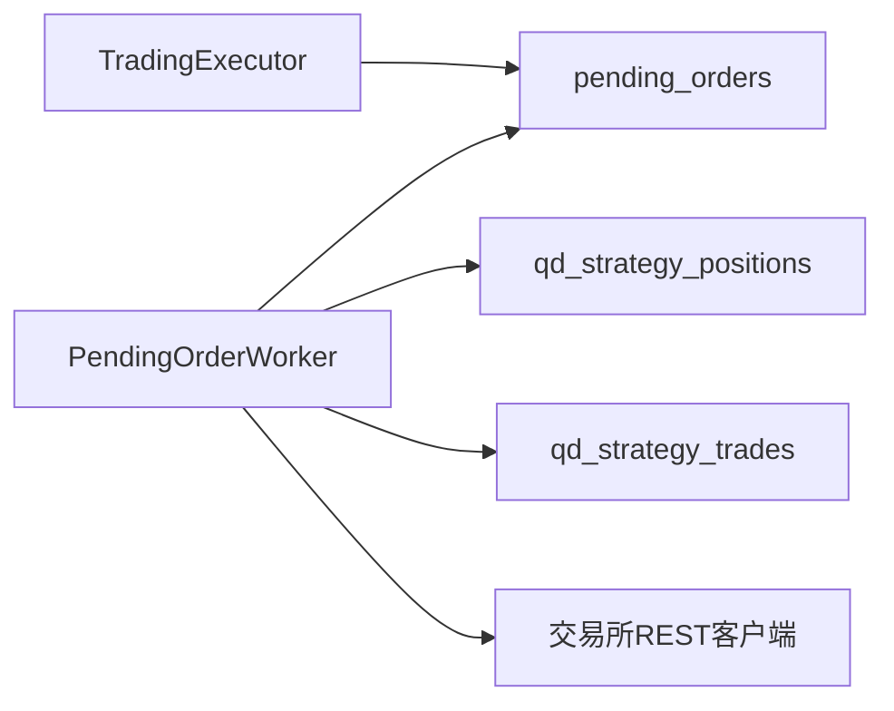
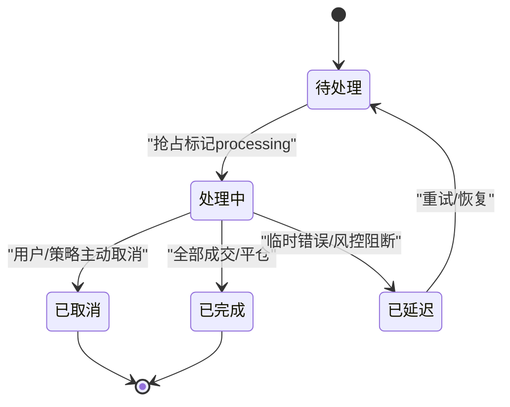

# 订单管理

<cite>
**本文引用的文件**
- [pending_order_worker.py](file://backend_api_python/app/services/pending_order_worker.py)
- [trading_executor.py](file://backend_api_python/app/services/trading_executor.py)
- [init.sql](file://backend_api_python/migrations/init.sql)
- [dashboard.py](file://backend_api_python/app/routes/dashboard.py)
- [base.py](file://backend_api_python/app/services/live_trading/base.py)
</cite>

## 目录
1. [简介](#简介)
2. [项目结构](#项目结构)
3. [核心组件](#核心组件)
4. [架构总览](#架构总览)
5. [详细组件分析](#详细组件分析)
6. [依赖关系分析](#依赖关系分析)
7. [性能考虑](#性能考虑)
8. [故障排查指南](#故障排查指南)
9. [结论](#结论)
10. [附录](#附录)

## 简介
本文件面向订单管理系统，围绕“订单生命周期管理”“待处理订单工作器”“订单存储与状态同步”“与交易所API交互”等主题，提供从架构到实现细节的系统化文档。重点覆盖以下方面：
- 订单从“创建/提交/执行/取消/完成”的全链路状态流转
- 待处理队列的轮询、批量处理与错误重试机制
- 幂等与去重、并发安全与持久化策略
- 订单查询、历史检索与统计分析能力
- 订单超时、部分成交与异常清理的实现要点
- 与多交易所REST客户端的交互模式与响应处理

## 项目结构
订单管理相关的关键模块与表结构分布如下：
- 服务层
  - 待处理订单工作器：负责轮询、派发、执行与状态更新
  - 交易执行器：策略侧将信号转化为待处理订单并落库
- 数据层
  - pending_orders：待处理订单队列表
  - qd_strategy_positions：策略持仓表
  - qd_strategy_trades：策略交易明细表
- 接口层
  - 仪表盘路由提供待处理订单查询与删除等操作

**图示来源**
- [pending_order_worker.py:52-122](file://backend_api_python/app/services/pending_order_worker.py#L52-L122)
- [trading_executor.py:3109-3196](file://backend_api_python/app/services/trading_executor.py#L3109-L3196)
- [init.sql:309-342](file://backend_api_python/migrations/init.sql#L309-L342)
- [dashboard.py:670-700](file://backend_api_python/app/routes/dashboard.py#L670-L700)

**章节来源**
- [pending_order_worker.py:52-122](file://backend_api_python/app/services/pending_order_worker.py#L52-L122)
- [trading_executor.py:3109-3196](file://backend_api_python/app/services/trading_executor.py#L3109-L3196)
- [init.sql:309-342](file://backend_api_python/migrations/init.sql#L309-L342)
- [dashboard.py:670-700](file://backend_api_python/app/routes/dashboard.py#L670-L700)

## 核心组件
- 待处理订单工作器（PendingOrderWorker）
  - 轮询pending_orders，批量抓取待处理订单
  - 采用“抢占式”标记status=processing，避免重复执行
  - 支持按execution_mode执行通知或实盘下单
  - 提供位置同步（position sync）以对齐本地与交易所状态
  - 错误时标记失败/延迟/降级状态，并支持重试与告警
- 交易执行器（TradingExecutor）
  - 将策略信号转换为订单参数，写入pending_orders
  - 提供信号去重、冷却与同K线去重，保障幂等
  - 支持AI入口过滤、风控阈值与下单量计算
- 数据模型
  - pending_orders：订单主表，包含状态、重试次数、错误、交易所映射等
  - qd_strategy_positions：策略持仓，用于位置同步与风控
  - qd_strategy_trades：策略交易明细，用于历史与统计

**章节来源**
- [pending_order_worker.py:52-122](file://backend_api_python/app/services/pending_order_worker.py#L52-L122)
- [trading_executor.py:240-331](file://backend_api_python/app/services/trading_executor.py#L240-L331)
- [init.sql:309-342](file://backend_api_python/migrations/init.sql#L309-L342)

## 架构总览
订单管理采用“策略生成信号 → 落库待处理 → 工作器轮询执行”的解耦架构。工作器根据execution_mode选择通知或实盘执行；实盘执行通过各交易所REST客户端对接，完成后回写本地持仓与交易明细。

**图示来源**
- [trading_executor.py:3109-3196](file://backend_api_python/app/services/trading_executor.py#L3109-L3196)
- [pending_order_worker.py:827-914](file://backend_api_python/app/services/pending_order_worker.py#L827-L914)
- [pending_order_worker.py:949-1137](file://backend_api_python/app/services/pending_order_worker.py#L949-L1137)

## 详细组件分析

### 组件A：待处理订单工作器（PendingOrderWorker）
- 轮询与批量
  - 以poll_interval_sec为周期扫描pending_orders
  - 通过LIMIT批量抓取，降低锁竞争与查询开销
- 抢占式派发
  - 使用“状态=pending且尝试次数<最大重试次数”的条件更新，原子性地将订单标记为processing
  - 仅当实际影响行数>0时视为成功，避免重复处理
- 执行模式
  - signal：仅发送通知，不进行真实交易
  - live：调用交易所REST客户端下单，支持maker先行（限价挂单等待）与市价尾单
- 错误与重试
  - 异常时标记failed或deferred，记录last_error
  - 支持stale_processing_sec自动回收卡住的processing订单
- 位置同步（Position Sync）
  - 定期/按需对齐本地持仓与交易所快照，清理“幽灵持仓”
  - 支持多交易所客户端差异处理与致命错误自动停策略

**图示来源**
- [pending_order_worker.py:91-122](file://backend_api_python/app/services/pending_order_worker.py#L91-L122)
- [pending_order_worker.py:752-798](file://backend_api_python/app/services/pending_order_worker.py#L752-L798)
- [pending_order_worker.py:800-825](file://backend_api_python/app/services/pending_order_worker.py#L800-L825)

**章节来源**
- [pending_order_worker.py:52-122](file://backend_api_python/app/services/pending_order_worker.py#L52-L122)
- [pending_order_worker.py:752-825](file://backend_api_python/app/services/pending_order_worker.py#L752-L825)
- [pending_order_worker.py:827-914](file://backend_api_python/app/services/pending_order_worker.py#L827-L914)
- [pending_order_worker.py:949-1137](file://backend_api_python/app/services/pending_order_worker.py#L949-L1137)

### 组件B：交易执行器（TradingExecutor）
- 信号去重与幂等
  - 基于策略+符号+信号类型+K线时间戳的去重键，配合TTL避免重复下单
  - 同K线内去重，防止“确认信号”在整根K线上重复触发
- 订单入队
  - 将信号转换为订单参数，写入pending_orders，包含execution_mode、ref_price、order_mode等
  - 严格的状态机校验（开仓/加仓/减仓/平仓）与风控阈值
- 量额计算与风控
  - 支持Bot脚本与非Bot脚本两种下单量计算方式
  - 提供AI入口过滤、最大仓位、单日最大亏损等风控

**图示来源**
- [trading_executor.py:240-331](file://backend_api_python/app/services/trading_executor.py#L240-L331)
- [trading_executor.py:2578-2791](file://backend_api_python/app/services/trading_executor.py#L2578-L2791)
- [trading_executor.py:3198-3290](file://backend_api_python/app/services/trading_executor.py#L3198-L3290)

**章节来源**
- [trading_executor.py:240-331](file://backend_api_python/app/services/trading_executor.py#L240-L331)
- [trading_executor.py:2578-2791](file://backend_api_python/app/services/trading_executor.py#L2578-L2791)
- [trading_executor.py:3198-3290](file://backend_api_python/app/services/trading_executor.py#L3198-L3290)

### 组件C：数据模型与持久化
- pending_orders
  - 主键id、用户/策略关联、信号与订单参数、执行模式、状态与重试、交易所映射、填充统计、时间戳
  - 索引：user_id、status、strategy_id
- qd_strategy_positions
  - 策略+符号+方向唯一约束，记录size、entry_price、最高/最低价、未实现盈亏等
- qd_strategy_trades
  - 记录每笔交易的类型、价格、数量、手续费、利润等

**图示来源**
- [init.sql:309-342](file://backend_api_python/migrations/init.sql#L309-L342)
- [init.sql:261-277](file://backend_api_python/migrations/init.sql#L261-L277)
- [init.sql:286-299](file://backend_api_python/migrations/init.sql#L286-L299)

**章节来源**
- [init.sql:309-342](file://backend_api_python/migrations/init.sql#L309-L342)
- [init.sql:261-277](file://backend_api_python/migrations/init.sql#L261-L277)
- [init.sql:286-299](file://backend_api_python/migrations/init.sql#L286-L299)

### 组件D：与交易所API的交互模式
- 客户端选择
  - 根据策略配置与市场类别动态创建对应交易所客户端
  - 支持多交易所（Binance、OKX、Bybit、Kraken、Gate等）与差异化参数（如杠杆、保证金模式）
- 限价/市价/挂单等待
  - maker先行：按参考价偏移挂单，等待成交
  - 市价尾单：若仍有剩余，发起市价单
  - 风险控制：对Close/Reduce信号自动校准数量，避免超仓
- 响应处理
  - 记录交易所返回的订单ID、填充数量与均价
  - 汇总手续费与币种，回写至pending_orders
  - 发送最佳努力的通知，便于用户感知

**图示来源**
- [pending_order_worker.py:1139-1157](file://backend_api_python/app/services/pending_order_worker.py#L1139-L1157)
- [pending_order_worker.py:1425-1433](file://backend_api_python/app/services/pending_order_worker.py#L1425-L1433)
- [pending_order_worker.py:1708-1721](file://backend_api_python/app/services/pending_order_worker.py#L1708-L1721)
- [base.py:140-167](file://backend_api_python/app/services/live_trading/base.py#L140-L167)

**章节来源**
- [pending_order_worker.py:949-1137](file://backend_api_python/app/services/pending_order_worker.py#L949-L1137)
- [pending_order_worker.py:1139-1157](file://backend_api_python/app/services/pending_order_worker.py#L1139-L1157)
- [pending_order_worker.py:1425-1433](file://backend_api_python/app/services/pending_order_worker.py#L1425-L1433)
- [pending_order_worker.py:1708-1721](file://backend_api_python/app/services/pending_order_worker.py#L1708-L1721)
- [base.py:140-167](file://backend_api_python/app/services/live_trading/base.py#L140-L167)

## 依赖关系分析
- 组件耦合
  - TradingExecutor与PendingOrderWorker通过pending_orders解耦
  - PendingOrderWorker与交易所客户端通过工厂/适配器模式解耦
- 外部依赖
  - PostgreSQL：订单与持仓/交易数据持久化
  - 交易所REST：实盘执行与行情/手续费查询
- 潜在风险
  - 重复执行：通过抢占式标记与去重机制缓解
  - 死锁/卡死：通过stale_processing_sec自动回收
  - 位置不同步：通过定期位置同步与致命错误停策略保护

**图示来源**
- [trading_executor.py:3109-3196](file://backend_api_python/app/services/trading_executor.py#L3109-L3196)
- [pending_order_worker.py:52-122](file://backend_api_python/app/services/pending_order_worker.py#L52-L122)
- [init.sql:309-342](file://backend_api_python/migrations/init.sql#L309-L342)

**章节来源**
- [trading_executor.py:3109-3196](file://backend_api_python/app/services/trading_executor.py#L3109-L3196)
- [pending_order_worker.py:52-122](file://backend_api_python/app/services/pending_order_worker.py#L52-L122)
- [init.sql:309-342](file://backend_api_python/migrations/init.sql#L309-L342)

## 性能考虑
- 轮询与批量
  - 通过batch_size与poll_interval_sec平衡吞吐与延迟
  - LIMIT抓取减少锁持有时间
- 去重与幂等
  - 同K线与全局去重键，避免重复下单带来的网络与数据库压力
- 位置同步
  - 定期同步降低本地与交易所偏差，减少反复下单与错误
- 数据库索引
  - pending_orders按user_id/status等建立索引，提升查询效率

[本节为通用指导，无需列出具体文件来源]

## 故障排查指南
- 订单长时间处于processing
  - 检查stale_processing_sec配置，确认是否被自动回收
  - 查看last_error与dispatch_note，定位异常原因
- 订单失败/延迟
  - 查看max_attempts与attempts，确认是否已达上限
  - 检查exchange_response_json与last_error，定位交易所错误
- 位置不同步
  - 触发位置同步，核对交易所返回与本地记录差异
  - 若出现致命认证/权限错误，策略将自动停止，需检查凭证
- 查询与删除待处理订单
  - 通过仪表盘接口查询列表与详情
  - 仅可删除属于当前用户的待处理订单，且状态不可为processing

**章节来源**
- [pending_order_worker.py:752-798](file://backend_api_python/app/services/pending_order_worker.py#L752-L798)
- [pending_order_worker.py:2565-2580](file://backend_api_python/app/services/pending_order_worker.py#L2565-L2580)
- [dashboard.py:670-700](file://backend_api_python/app/routes/dashboard.py#L670-L700)
- [dashboard.py:713-734](file://backend_api_python/app/routes/dashboard.py#L713-L734)

## 结论
订单管理系统通过“策略入队+工作器执行”的双层设计，实现了高可靠、可扩展的订单生命周期管理。工作器在保证幂等与并发安全的同时，提供了灵活的实盘执行与位置同步能力；交易执行器则在策略侧提供去重、风控与量额计算，确保下单质量。配合完善的数据库模型与接口能力，系统能够满足复杂市场的订单管理需求。

[本节为总结性内容，无需列出具体文件来源]

## 附录

### 订单生命周期状态机

[本图为概念示意，无需列出具体文件来源]

### 订单查询与历史检索接口要点
- 查询待处理订单
  - 仪表盘接口支持分页、过滤与时间范围查询
  - 返回字段包含订单ID、符号、信号类型、状态、交易所映射、时间戳等
- 删除待处理订单
  - 仅允许删除属于当前用户的待处理订单，且状态不可为processing
- 历史与统计
  - 通过qd_strategy_trades与qd_strategy_positions可做收益、胜率、最大回撤等统计

**章节来源**
- [dashboard.py:670-700](file://backend_api_python/app/routes/dashboard.py#L670-L700)
- [dashboard.py:713-734](file://backend_api_python/app/routes/dashboard.py#L713-L734)