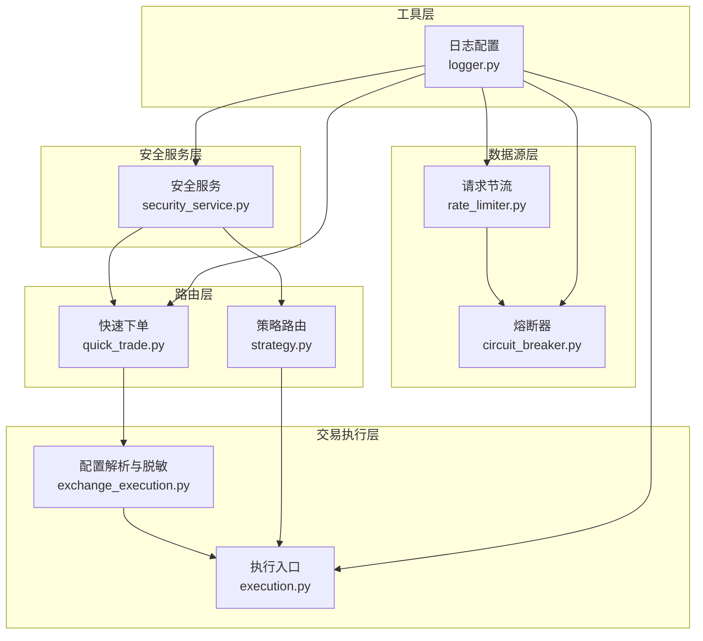
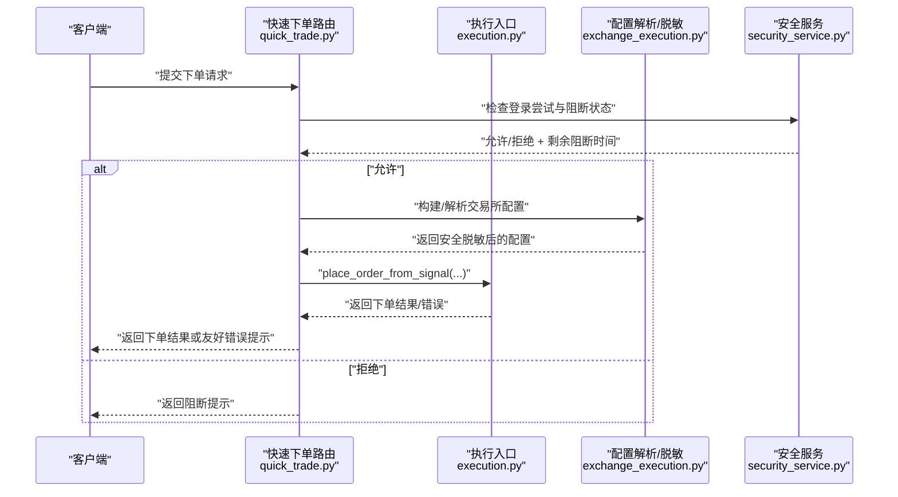
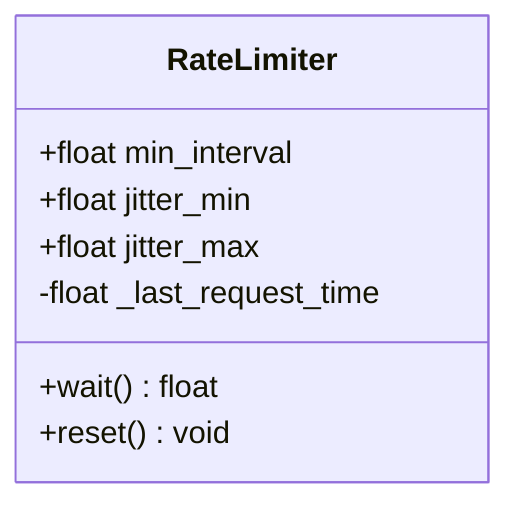
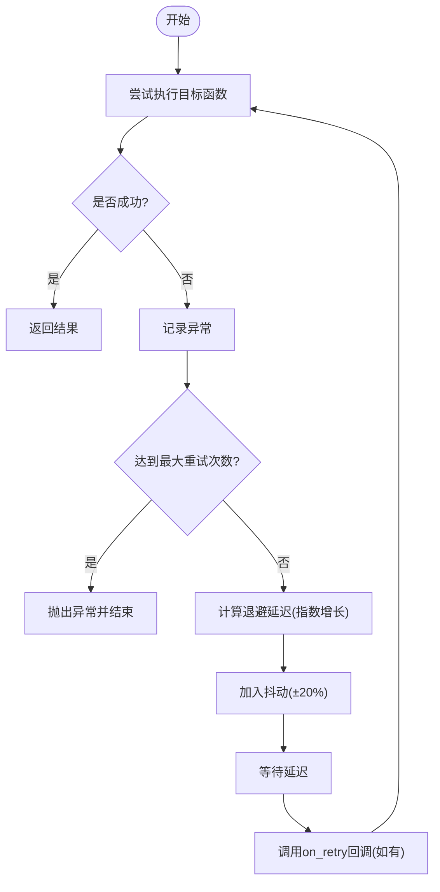
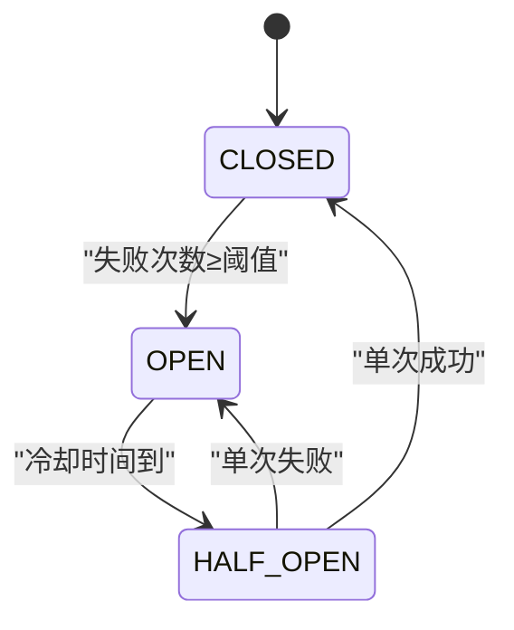
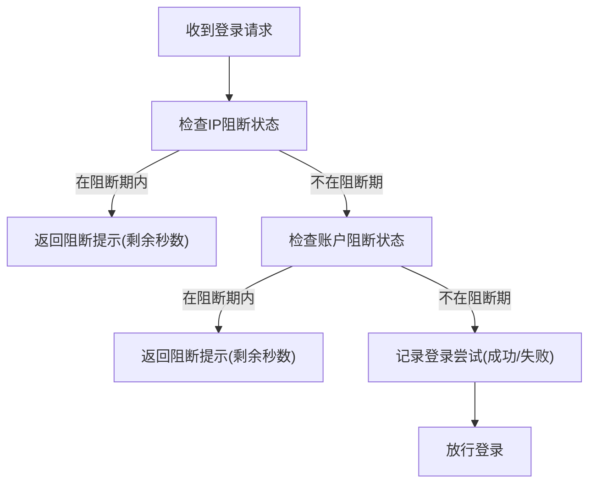
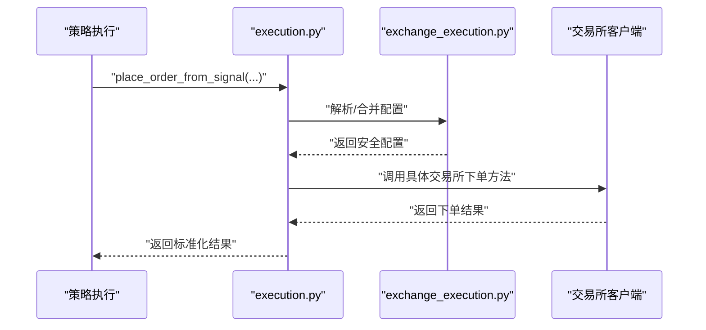
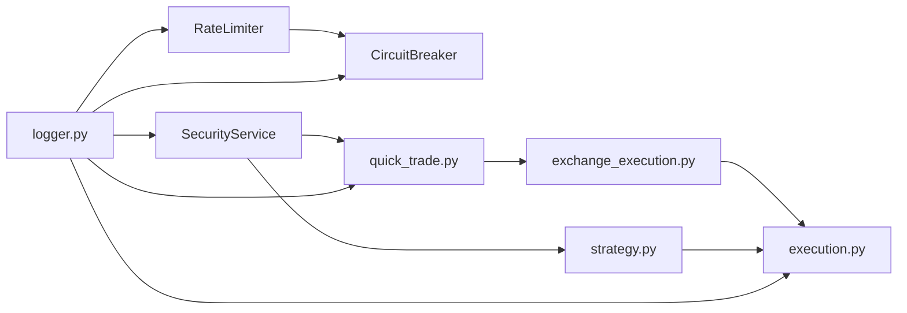

# 风控管理

<cite>
**本文引用的文件**
- [rate_limiter.py](file://backend_api_python/app/data_sources/rate_limiter.py)
- [circuit_breaker.py](file://backend_api_python/app/data_sources/circuit_breaker.py)
- [security_service.py](file://backend_api_python/app/services/security_service.py)
- [logger.py](file://backend_api_python/app/utils/logger.py)
- [exchange_execution.py](file://backend_api_python/app/services/exchange_execution.py)
- [quick_trade.py](file://backend_api_python/app/routes/quick_trade.py)
- [execution.py](file://backend_api_python/app/services/live_trading/execution.py)
- [strategy.py](file://backend_api_python/app/routes/strategy.py)
</cite>

## 目录
1. [引言](#引言)
2. [项目结构](#项目结构)
3. [核心组件](#核心组件)
4. [架构总览](#架构总览)
5. [详细组件分析](#详细组件分析)
6. [依赖分析](#依赖分析)
7. [性能考虑](#性能考虑)
8. [故障排查指南](#故障排查指南)
9. [结论](#结论)
10. [附录](#附录)

## 引言
本文件面向风控管理系统，系统性梳理并文档化风控体系的架构与实现要点，覆盖以下方面：
- 熔断机制：故障检测、快速失败与恢复策略
- 速率限制：请求节流、指数退避与全局限流器
- 风险阈值控制：登录尝试阻断、验证码速率限制与账户安全
- 风控规则配置、动态调整与实时监控
- 风控事件记录、报警与人工干预流程
- 与交易执行的集成方式与风控决策的执行时机

本文件以仓库现有实现为依据，结合代码级图示与流程图，帮助开发者与运维人员快速理解与扩展风控能力。

## 项目结构
风控相关能力主要分布在如下模块：
- 数据源层：请求节流与熔断（rate_limiter.py、circuit_breaker.py）
- 安全服务层：登录尝试统计、账户阻断、验证码速率限制与安全审计（security_service.py）
- 交易执行层：订单落单前的统一入口与日志脱敏（exchange_execution.py、execution.py）
- 路由层：快速下单与错误提示映射（quick_trade.py）
- 工具层：日志配置与输出（logger.py）
- 策略路由：策略生命周期与风控在策略执行中的衔接（strategy.py）

图表来源
- [rate_limiter.py:109-164](file://backend_api_python/app/data_sources/rate_limiter.py#L109-L164)
- [circuit_breaker.py:31-158](file://backend_api_python/app/data_sources/circuit_breaker.py#L31-L158)
- [security_service.py:26-399](file://backend_api_python/app/services/security_service.py#L26-L399)
- [exchange_execution.py:118-148](file://backend_api_python/app/services/exchange_execution.py#L118-L148)
- [execution.py:123-311](file://backend_api_python/app/services/live_trading/execution.py#L123-L311)
- [quick_trade.py:364-614](file://backend_api_python/app/routes/quick_trade.py#L364-L614)
- [strategy.py:545-634](file://backend_api_python/app/routes/strategy.py#L545-L634)
- [logger.py:9-63](file://backend_api_python/app/utils/logger.py#L9-L63)

章节来源
- [rate_limiter.py:1-273](file://backend_api_python/app/data_sources/rate_limiter.py#L1-L273)
- [circuit_breaker.py:1-175](file://backend_api_python/app/data_sources/circuit_breaker.py#L1-L175)
- [security_service.py:1-399](file://backend_api_python/app/services/security_service.py#L1-L399)
- [exchange_execution.py:1-150](file://backend_api_python/app/services/exchange_execution.py#L1-L150)
- [quick_trade.py:1-800](file://backend_api_python/app/routes/quick_trade.py#L1-L800)
- [execution.py:1-426](file://backend_api_python/app/services/live_trading/execution.py#L1-L426)
- [strategy.py:1-800](file://backend_api_python/app/routes/strategy.py#L1-L800)
- [logger.py:1-63](file://backend_api_python/app/utils/logger.py#L1-L63)

## 核心组件
- 请求节流器（RateLimiter）：保证请求最小间隔与抖动，降低被封禁风险
- 指数退避重试（retry_with_backoff）：对可重试异常进行带抖动的指数退避
- 熔断器（CircuitBreaker）：基于失败次数与冷却时间的状态机，实现快速失败与半开试探
- 登录尝试阻断与验证码限流（SecurityService）：基于数据库的滑动窗口与阻断周期
- 执行入口与日志脱敏（execution.py、exchange_execution.py）：统一下单入口与敏感信息掩码
- 快速下单错误提示映射（quick_trade.py）：将底层错误归类为前端友好提示

章节来源
- [rate_limiter.py:109-273](file://backend_api_python/app/data_sources/rate_limiter.py#L109-L273)
- [circuit_breaker.py:31-175](file://backend_api_python/app/data_sources/circuit_breaker.py#L31-L175)
- [security_service.py:26-399](file://backend_api_python/app/services/security_service.py#L26-L399)
- [exchange_execution.py:118-148](file://backend_api_python/app/services/exchange_execution.py#L118-L148)
- [execution.py:123-311](file://backend_api_python/app/services/live_trading/execution.py#L123-L311)
- [quick_trade.py:34-69](file://backend_api_python/app/routes/quick_trade.py#L34-L69)

## 架构总览
风控体系采用“分层防护”思路：
- 数据源层：通过节流与熔断保护上游数据源与API
- 应用层：通过安全服务实现登录与验证码等风控
- 交易层：通过统一执行入口与日志脱敏，确保落单与审计可控
- 路由层：对错误进行归类与提示，辅助用户与系统理解失败原因

图表来源
- [quick_trade.py:364-614](file://backend_api_python/app/routes/quick_trade.py#L364-L614)
- [execution.py:123-311](file://backend_api_python/app/services/live_trading/execution.py#L123-L311)
- [exchange_execution.py:118-148](file://backend_api_python/app/services/exchange_execution.py#L118-L148)
- [security_service.py:200-241](file://backend_api_python/app/services/security_service.py#L200-L241)

## 详细组件分析

### 组件A：请求节流器（RateLimiter）
- 设计目标：在请求间引入最小间隔与抖动，降低被封禁概率
- 关键点：
  - 最小间隔控制：wait()在上次请求后若未达到最小间隔，则等待补齐
  - 随机抖动：在每次请求后追加抖动，模拟人类行为
  - 全局限流器：针对不同数据源提供独立实例，便于差异化配置

图表来源
- [rate_limiter.py:109-164](file://backend_api_python/app/data_sources/rate_limiter.py#L109-L164)

章节来源
- [rate_limiter.py:109-164](file://backend_api_python/app/data_sources/rate_limiter.py#L109-L164)

### 组件B：指数退避重试（retry_with_backoff）
- 设计目标：对瞬时异常进行指数退避重试，避免雪崩效应
- 关键点：
  - 支持自定义最大重试次数、基础延迟、最大延迟与指数基数
  - 重试延迟含±20%抖动，防止“群体重试”
  - 可传入回调函数，便于观测重试过程

图表来源
- [rate_limiter.py:170-231](file://backend_api_python/app/data_sources/rate_limiter.py#L170-L231)

章节来源
- [rate_limiter.py:170-231](file://backend_api_python/app/data_sources/rate_limiter.py#L170-L231)

### 组件C：熔断器（CircuitBreaker）
- 设计目标：在上游失败时快速失败，冷却后半开试探，逐步恢复
- 状态机：
  - CLOSED：正常
  - OPEN：熔断中，冷却期跳过请求
  - HALF_OPEN：冷却结束，单次试探，成功则回到CLOSED，失败则回到OPEN

图表来源
- [circuit_breaker.py:24-40](file://backend_api_python/app/data_sources/circuit_breaker.py#L24-L40)

章节来源
- [circuit_breaker.py:31-158](file://backend_api_python/app/data_sources/circuit_breaker.py#L31-L158)

### 组件D：安全服务（SecurityService）
- 登录尝试阻断：
  - 滑动窗口内统计失败次数，超过阈值进入阻断周期
  - 支持按IP与账户维度分别配置
- 验证码速率限制：
  - 单邮箱每秒/分钟级限流
  - IP每小时级限流
- 安全审计：
  - 记录登录、注册、密码重置等事件，便于追踪与回溯

图表来源
- [security_service.py:200-241](file://backend_api_python/app/services/security_service.py#L200-L241)

章节来源
- [security_service.py:26-399](file://backend_api_python/app/services/security_service.py#L26-L399)

### 组件E：交易执行与日志脱敏
- 统一执行入口：
  - 将策略信号转换为各交易所的下单调用，屏蔽差异
- 配置解析与脱敏：
  - 解析策略与凭证配置，合并覆盖
  - 对密钥类字段进行掩码，避免日志泄露
- 错误提示映射：
  - 将底层错误字符串匹配为前端友好提示，提升可观测性

图表来源
- [execution.py:123-311](file://backend_api_python/app/services/live_trading/execution.py#L123-L311)
- [exchange_execution.py:118-148](file://backend_api_python/app/services/exchange_execution.py#L118-L148)

章节来源
- [execution.py:123-311](file://backend_api_python/app/services/live_trading/execution.py#L123-L311)
- [exchange_execution.py:118-148](file://backend_api_python/app/services/exchange_execution.py#L118-L148)
- [quick_trade.py:364-614](file://backend_api_python/app/routes/quick_trade.py#L364-L614)

## 依赖分析
- 组件耦合与内聚：
  - RateLimiter与retry_with_backoff均属于数据源层，彼此解耦，可独立启用
  - CircuitBreaker与RateLimiter共同作用于上游数据源访问路径
  - SecurityService与路由层（quick_trade.py、strategy.py）强耦合，负责前置风控
  - Execution与ExchangeExecution形成“配置解析—执行”的清晰边界
- 外部依赖：
  - 数据库：SecurityService依赖数据库记录登录尝试与验证码
  - 日志：logger.py集中配置日志级别与输出，保障风控日志可读性

图表来源
- [rate_limiter.py:109-273](file://backend_api_python/app/data_sources/rate_limiter.py#L109-L273)
- [circuit_breaker.py:31-175](file://backend_api_python/app/data_sources/circuit_breaker.py#L31-L175)
- [security_service.py:26-399](file://backend_api_python/app/services/security_service.py#L26-L399)
- [exchange_execution.py:118-148](file://backend_api_python/app/services/exchange_execution.py#L118-L148)
- [execution.py:123-311](file://backend_api_python/app/services/live_trading/execution.py#L123-L311)
- [quick_trade.py:364-614](file://backend_api_python/app/routes/quick_trade.py#L364-L614)
- [strategy.py:545-634](file://backend_api_python/app/routes/strategy.py#L545-L634)
- [logger.py:9-63](file://backend_api_python/app/utils/logger.py#L9-L63)

章节来源
- [rate_limiter.py:1-273](file://backend_api_python/app/data_sources/rate_limiter.py#L1-L273)
- [circuit_breaker.py:1-175](file://backend_api_python/app/data_sources/circuit_breaker.py#L1-L175)
- [security_service.py:1-399](file://backend_api_python/app/services/security_service.py#L1-L399)
- [exchange_execution.py:1-150](file://backend_api_python/app/services/exchange_execution.py#L1-L150)
- [execution.py:1-426](file://backend_api_python/app/services/live_trading/execution.py#L1-L426)
- [quick_trade.py:1-800](file://backend_api_python/app/routes/quick_trade.py#L1-L800)
- [strategy.py:1-800](file://backend_api_python/app/routes/strategy.py#L1-L800)
- [logger.py:1-63](file://backend_api_python/app/utils/logger.py#L1-L63)

## 性能考虑
- 请求节流与抖动：
  - 通过最小间隔与抖动平衡吞吐与稳定性，避免触发上游限流
- 指数退避：
  - 降低重试风暴概率，缓解上游压力
- 熔断器：
  - 在失败时快速失败，避免无效调用与资源浪费
- 登录阻断与验证码限流：
  - 通过滑动窗口与阻断周期，抑制暴力破解与刷量
- 日志与脱敏：
  - 通过掩码与分级日志，兼顾可观测性与安全性

## 故障排查指南
- 熔断器告警
  - 现象：数据源被跳过或频繁冷却
  - 排查：查看熔断器状态与最后错误，确认冷却时间是否合理
- 重试风暴
  - 现象：短时间内大量重试导致上游超时
  - 排查：核对最大重试次数、基础延迟与抖动范围
- 登录被阻断
  - 现象：IP或账户频繁失败后被阻断
  - 排查：检查滑动窗口与阻断周期配置，确认是否误判
- 下单失败与友好提示
  - 现象：下单报错但提示不明确
  - 排查：对照错误提示映射表，定位具体错误类别并修正参数

章节来源
- [circuit_breaker.py:138-158](file://backend_api_python/app/data_sources/circuit_breaker.py#L138-L158)
- [rate_limiter.py:170-231](file://backend_api_python/app/data_sources/rate_limiter.py#L170-L231)
- [security_service.py:146-241](file://backend_api_python/app/services/security_service.py#L146-L241)
- [quick_trade.py:34-69](file://backend_api_python/app/routes/quick_trade.py#L34-L69)

## 结论
本风控体系通过“节流+熔断+重试+登录阻断+验证码限流+统一执行入口+日志脱敏”的组合拳，在保障系统稳定的同时提升了安全性与可观测性。建议在生产环境中：
- 为不同数据源与API设置差异化节流与熔断参数
- 动态调整登录阻断与验证码限流阈值，结合业务场景优化体验
- 在关键路径增加日志与告警，配合人工干预流程闭环

## 附录
- 风控事件记录与审计
  - 登录尝试与验证码发送均写入数据库，支持清理与查询
- 风控规则配置
  - 通过环境变量与数据库配置项动态调整
- 与交易执行的集成
  - 快速下单与策略执行均经由统一入口，确保风控前置与一致性

章节来源
- [security_service.py:128-241](file://backend_api_python/app/services/security_service.py#L128-L241)
- [exchange_execution.py:118-148](file://backend_api_python/app/services/exchange_execution.py#L118-L148)
- [quick_trade.py:364-614](file://backend_api_python/app/routes/quick_trade.py#L364-L614)
- [strategy.py:545-634](file://backend_api_python/app/routes/strategy.py#L545-L634)