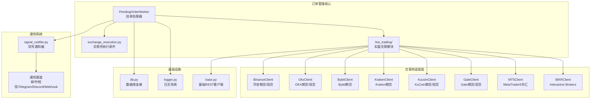
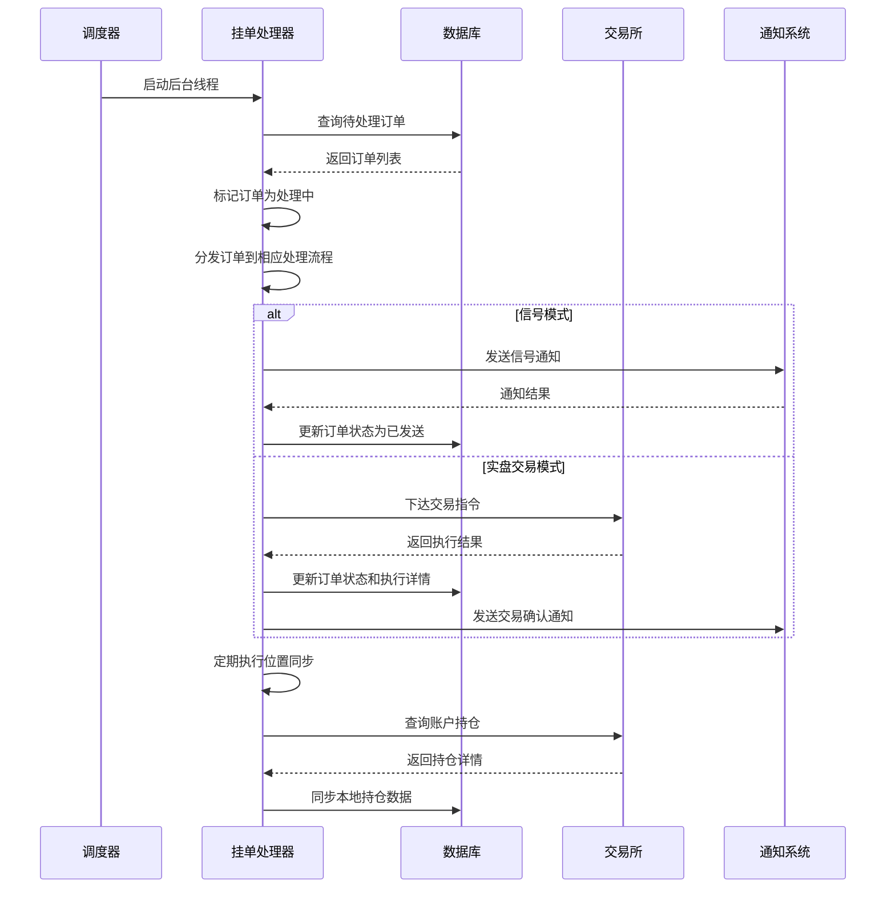
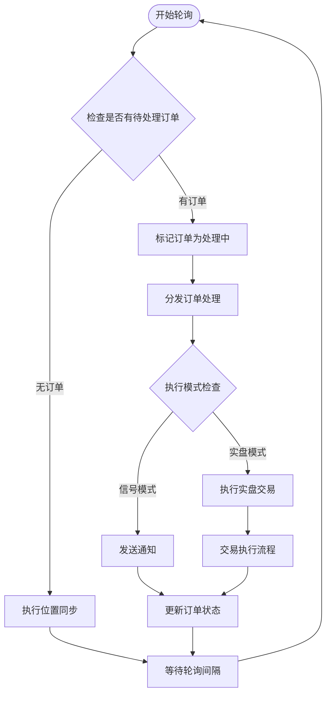
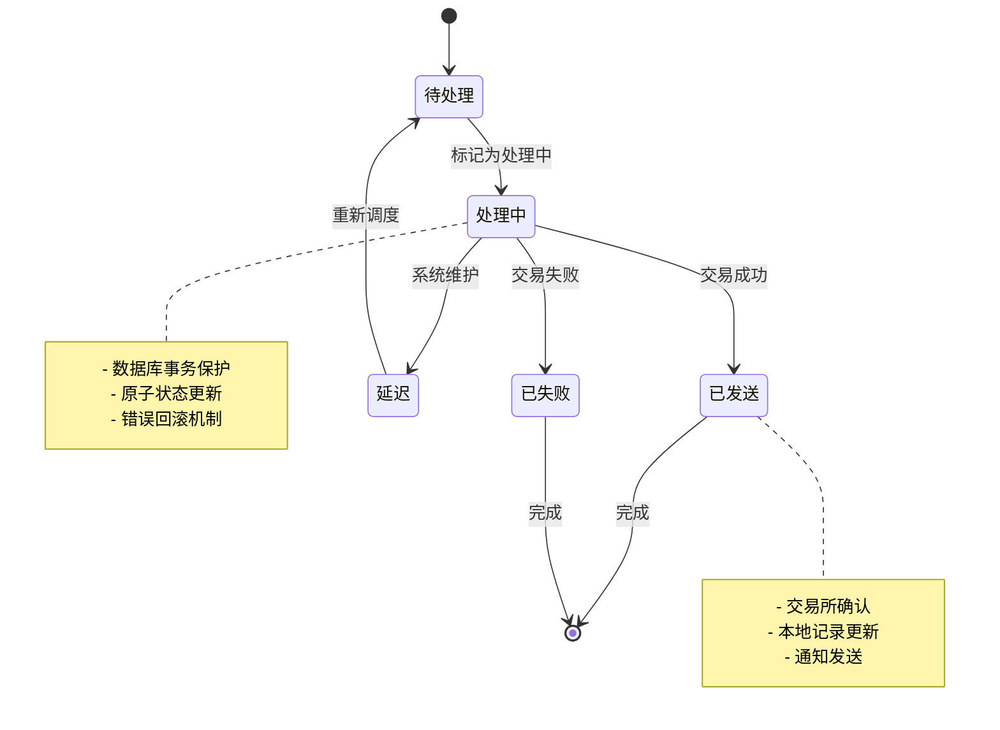
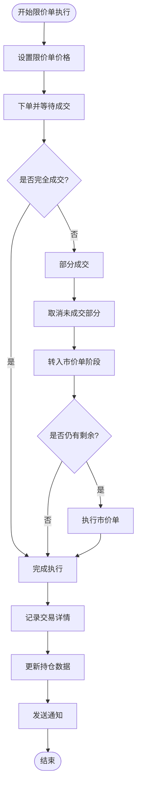
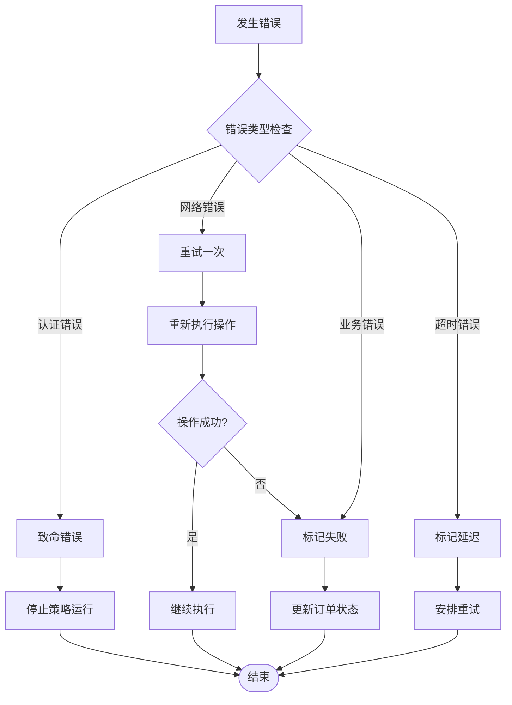
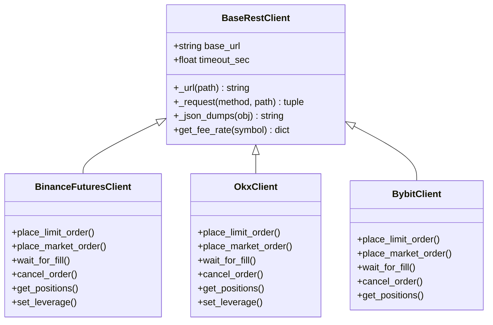
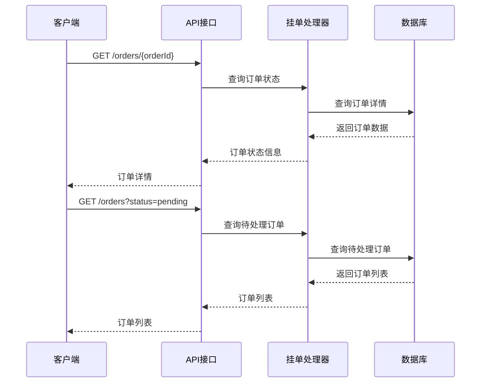
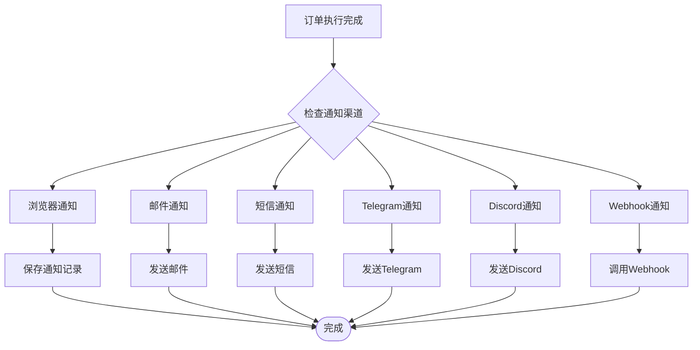
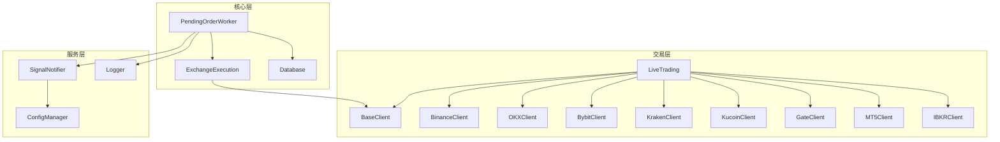

# 订单管理系统

<cite>
**本文档引用的文件**
- [pending_order_worker.py](file://backend_api_python/app/services/pending_order_worker.py)
- [exchange_execution.py](file://backend_api_python/app/services/exchange_execution.py)
- [execution.py](file://backend_api_python/app/services/live_trading/execution.py)
- [base.py](file://backend_api_python/app/services/live_trading/base.py)
- [signal_notifier.py](file://backend_api_python/app/services/signal_notifier.py)
- [logger.py](file://backend_api_python/app/utils/logger.py)
- [db.py](file://backend_api_python/app/utils/db.py)
</cite>

## 目录
1. [简介](#简介)
2. [项目结构](#项目结构)
3. [核心组件](#核心组件)
4. [架构概览](#架构概览)
5. [详细组件分析](#详细组件分析)
6. [依赖关系分析](#依赖关系分析)
7. [性能考虑](#性能考虑)
8. [故障排除指南](#故障排除指南)
9. [结论](#结论)

## 简介

QuantDinger 订单管理系统是一个基于 Python 的实时交易执行框架，专注于为量化策略提供可靠、高性能的订单处理能力。该系统采用异步挂单处理器(PendingOrderWorker)为核心，实现了完整的订单生命周期管理，支持多种加密货币交易所和传统金融市场的直连交易。

系统的主要特点包括：
- **多交易所支持**：覆盖 Binance、OKX、Bybit、Kraken、KuCoin、Gate 等主流加密货币交易所
- **实时订单处理**：通过后台线程持续轮询待处理订单队列
- **灵活的执行模式**：支持信号模式(signal)和实盘交易(live)两种执行方式
- **智能位置同步**：定期与交易所对账，保持本地持仓数据一致性
- **完善的错误处理**：提供重试机制和错误恢复策略
- **多渠道通知**：支持邮件、短信、Telegram、Discord等多种通知方式

## 项目结构

订单管理系统位于 `backend_api_python/app/services/` 目录下，主要由以下核心模块组成：

**图表来源**
- [pending_order_worker.py:1-100](file://backend_api_python/app/services/pending_order_worker.py#L1-L100)
- [exchange_execution.py:1-150](file://backend_api_python/app/services/exchange_execution.py#L1-L150)
- [signal_notifier.py:1-150](file://backend_api_python/app/services/signal_notifier.py#L1-L150)

**章节来源**
- [pending_order_worker.py:1-100](file://backend_api_python/app/services/pending_order_worker.py#L1-L100)
- [exchange_execution.py:1-150](file://backend_api_python/app/services/exchange_execution.py#L1-L150)
- [signal_notifier.py:1-150](file://backend_api_python/app/services/signal_notifier.py#L1-L150)

## 核心组件

### PendingOrderWorker 挂单处理器

PendingOrderWorker 是整个订单管理系统的核心组件，负责轮询待处理订单队列并执行相应的交易逻辑。

#### 主要职责
- **订单轮询**：定时从数据库获取待处理订单
- **状态管理**：跟踪订单执行状态(待处理/已发送/已失败)
- **批量处理**：支持批量订单处理以提高效率
- **位置同步**：定期与交易所对账，保持持仓数据一致
- **错误恢复**：处理订单执行过程中的异常情况

#### 关键配置参数
- **轮询间隔**：默认1秒，可通过 `poll_interval_sec` 参数调整
- **批量大小**：默认50个订单，可通过 `batch_size` 参数调整
- **过期时间**：默认90秒，用于回收崩溃的挂起订单
- **位置同步**：默认启用，间隔10秒执行一次

**章节来源**
- [pending_order_worker.py:52-90](file://backend_api_python/app/services/pending_order_worker.py#L52-L90)
- [pending_order_worker.py:91-122](file://backend_api_python/app/services/pending_order_worker.py#L91-L122)

### 交易所执行助手

exchange_execution.py 提供了交易所配置解析和安全日志记录功能，是订单执行的基础支撑模块。

#### 主要功能
- **配置解析**：合并策略配置和凭证配置
- **安全日志**：掩码敏感信息，防止泄露API密钥
- **凭证管理**：解密存储的交易所凭证
- **配置验证**：确保执行配置的有效性

**章节来源**
- [exchange_execution.py:59-92](file://backend_api_python/app/services/exchange_execution.py#L59-L92)
- [exchange_execution.py:118-147](file://backend_api_python/app/services/exchange_execution.py#L118-L147)

### 实盘交易执行器

live_trading/execution.py 提供了统一的订单执行接口，支持多种交易所的直连交易。

#### 支持的交易所
- **加密货币交易所**：Binance、OKX、Bitget、Bybit、Coinbase、Kraken、KuCoin、Gate、Deepcoin、HTX
- **传统券商**：Interactive Brokers(US股票)
- **外汇平台**：MetaTrader 5(Forex)

#### 执行模式
- **市价单**：立即执行，适用于流动性充足的市场
- **限价单**：按指定价格或更好价格执行，适用于追求价格精度的场景
- **Maker-then-Market**：先尝试限价单，未完全成交后自动转为市价单

**章节来源**
- [execution.py:123-310](file://backend_api_python/app/services/live_trading/execution.py#L123-L310)
- [execution.py:313-425](file://backend_api_python/app/services/live_trading/execution.py#L313-L425)

## 架构概览

订单管理系统采用分层架构设计，确保了模块间的松耦合和高内聚。

**图表来源**
- [pending_order_worker.py:91-122](file://backend_api_python/app/services/pending_order_worker.py#L91-L122)
- [pending_order_worker.py:827-914](file://backend_api_python/app/services/pending_order_worker.py#L827-L914)
- [signal_notifier.py:171-283](file://backend_api_python/app/services/signal_notifier.py#L171-L283)

## 详细组件分析

### 挂单处理器工作原理

#### 订单轮询机制
挂单处理器采用后台线程持续轮询的方式管理订单队列：

**图表来源**
- [pending_order_worker.py:91-122](file://backend_api_python/app/services/pending_order_worker.py#L91-L122)
- [pending_order_worker.py:827-914](file://backend_api_python/app/services/pending_order_worker.py#L827-L914)

#### 批量处理机制
系统支持批量订单处理以提高执行效率：

1. **批量获取**：每次轮询最多获取 `batch_size` 个订单
2. **并发处理**：每个订单独立处理，避免相互阻塞
3. **原子操作**：使用数据库事务确保订单状态的一致性
4. **错误隔离**：单个订单失败不影响其他订单的处理

#### 状态同步策略
系统实现了多层次的状态同步机制：

**图表来源**
- [pending_order_worker.py:2504-2580](file://backend_api_python/app/services/pending_order_worker.py#L2504-L2580)

**章节来源**
- [pending_order_worker.py:752-798](file://backend_api_python/app/services/pending_order_worker.py#L752-L798)
- [pending_order_worker.py:800-825](file://backend_api_python/app/services/pending_order_worker.py#L800-L825)

### 订单生命周期管理

#### 订单类型分类
系统支持多种订单类型，每种类型对应不同的交易行为：

| 订单类型 | 说明 | 适用市场 | 交易方向 |
|---------|------|----------|----------|
| open_long | 开多头仓位 | 所有市场 | 买入/做多 |
| add_long | 增加多头仓位 | 所有市场 | 买入/做多 |
| close_long | 平多头仓位 | 所有市场 | 卖出/做空 |
| reduce_long | 减少多头仓位 | 所有市场 | 卖出/做空 |
| open_short | 开空头仓位 | 所有市场 | 卖出/做空 |
| add_short | 增加空头仓位 | 所有市场 | 卖出/做空 |
| close_short | 平空头仓位 | 所有市场 | 买入/做多 |
| reduce_short | 减少空头仓位 | 所有市场 | 买入/做多 |

#### 价格处理规则
系统提供了灵活的价格处理机制：

1. **参考价格**：使用 `ref_price` 作为基准价格
2. **偏移调整**：通过 `maker_offset_bps` 参数调整限价单价格
3. **自动定价**：对于限价单，系统自动根据方向调整价格
4. **价格验证**：确保价格参数的有效性和合理性

#### 数量计算规则
数量计算遵循严格的风控原则：

1. **最小单位**：根据交易所的最小交易单位进行四舍五入
2. **滑点控制**：通过 `maker_wait_sec` 参数控制等待时间
3. **尾部保护**：避免剩余小额订单导致的执行失败
4. **风险控制**：对平仓订单进行持仓检查，防止超额平仓

**章节来源**
- [pending_order_worker.py:1188-1198](file://backend_api_python/app/services/pending_order_worker.py#L1188-L1198)
- [pending_order_worker.py:1175-1182](file://backend_api_python/app/services/pending_order_worker.py#L1175-L1182)
- [pending_order_worker.py:1224-1256](file://backend_api_python/app/services/pending_order_worker.py#L1224-L1256)

### 执行确认流程

#### 限价单执行流程
系统采用限价单优先的执行策略：

**图表来源**
- [pending_order_worker.py:1435-1796](file://backend_api_python/app/services/pending_order_worker.py#L1435-L1796)
- [pending_order_worker.py:1797-2091](file://backend_api_python/app/services/pending_order_worker.py#L1797-L2091)

#### 市价单执行流程
对于无法完全成交的限价单，系统会自动转入市价单执行：

1. **等待成交**：在指定时间内等待限价单完全成交
2. **取消未成交**：对未成交部分发起撤销请求
3. **市价单执行**：使用市价单执行剩余数量
4. **尾部保护**：避免执行过小的剩余订单

**章节来源**
- [pending_order_worker.py:1639-1721](file://backend_api_python/app/services/pending_order_worker.py#L1639-L1721)
- [pending_order_worker.py:1991-2068](file://backend_api_python/app/services/pending_order_worker.py#L1991-L2068)

### 错误重试机制

#### 错误分类与处理
系统对不同类型的错误采用差异化的处理策略：

**图表来源**
- [pending_order_worker.py:1785-1795](file://backend_api_python/app/services/pending_order_worker.py#L1785-L1795)
- [pending_order_worker.py:2069-2090](file://backend_api_python/app/services/pending_order_worker.py#L2069-L2090)

#### 重试策略
系统实现了多层次的重试机制：

1. **单次重试**：对临时性网络错误进行一次性重试
2. **延迟重试**：对429/5xx错误进行指数退避重试
3. **策略停止**：对致命错误自动停止相关策略
4. **状态回滚**：确保重试前的状态一致性

**章节来源**
- [pending_order_worker.py:1785-1795](file://backend_api_python/app/services/pending_order_worker.py#L1785-L1795)
- [signal_notifier.py:540-628](file://backend_api_python/app/services/signal_notifier.py#L540-L628)

### 与交易所的异步通信模式

#### 连接管理
系统采用连接池和懒加载策略管理与交易所的连接：

**图表来源**
- [base.py:95-167](file://backend_api_python/app/services/live_trading/base.py#L95-L167)
- [execution.py:153-173](file://backend_api_python/app/services/live_trading/execution.py#L153-L173)

#### 超时处理
系统为不同类型的交易所请求设置了合理的超时时间：

| 操作类型 | 默认超时(秒) | 最长等待(秒) | 说明 |
|---------|-------------|-------------|------|
| 限价单等待 | 10 | 12 | 等待限价单成交 |
| 市价单等待 | 5 | 12 | 等待市价单成交 |
| 交易所查询 | 15 | 30 | 查询账户信息 |
| 位置同步 | 30 | 60 | 同步持仓数据 |
| 通知发送 | 6 | 10 | 发送通知消息 |

**章节来源**
- [base.py:96-98](file://backend_api_python/app/services/live_trading/base.py#L96-L98)
- [pending_order_worker.py:1640-1720](file://backend_api_python/app/services/pending_order_worker.py#L1640-L1720)

### 订单查询接口、状态更新和通知机制

#### 订单查询接口
系统提供了多种查询接口来获取订单状态：

**图表来源**
- [pending_order_worker.py:752-798](file://backend_api_python/app/services/pending_order_worker.py#L752-L798)

#### 状态更新机制
系统实现了实时的状态更新机制：

1. **即时更新**：订单状态变更时立即更新数据库
2. **批量更新**：定期批量同步订单状态
3. **事件驱动**：通过数据库触发器监听状态变化
4. **缓存同步**：保持内存缓存与数据库的一致性

#### 通知机制
系统支持多种通知渠道，确保用户能够及时收到订单执行状态：

**图表来源**
- [signal_notifier.py:171-283](file://backend_api_python/app/services/signal_notifier.py#L171-L283)
- [signal_notifier.py:484-538](file://backend_api_python/app/services/signal_notifier.py#L484-L538)

**章节来源**
- [signal_notifier.py:130-170](file://backend_api_python/app/services/signal_notifier.py#L130-L170)
- [signal_notifier.py:540-628](file://backend_api_python/app/services/signal_notifier.py#L540-L628)

## 依赖关系分析

### 组件耦合度分析

**图表来源**
- [pending_order_worker.py:17-41](file://backend_api_python/app/services/pending_order_worker.py#L17-L41)
- [execution.py:14-38](file://backend_api_python/app/services/live_trading/execution.py#L14-L38)

### 外部依赖管理

系统对外部依赖采用了严格的版本管理和安全控制：

1. **依赖隔离**：使用虚拟环境隔离第三方包
2. **版本锁定**：通过 requirements.txt 锁定依赖版本
3. **安全扫描**：定期扫描依赖包的安全漏洞
4. **更新策略**：制定计划性的依赖更新策略

**章节来源**
- [pending_order_worker.py:43-47](file://backend_api_python/app/services/pending_order_worker.py#L43-L47)
- [execution.py:28-38](file://backend_api_python/app/services/live_trading/execution.py#L28-L38)

## 性能考虑

### 并发处理优化

系统采用了多种并发处理技术来提升性能：

1. **线程池管理**：使用后台线程处理订单轮询，避免阻塞主线程
2. **数据库连接池**：复用数据库连接，减少连接开销
3. **异步I/O**：交易所API调用采用异步方式，提高响应速度
4. **批量操作**：支持批量订单处理，减少数据库往返次数

### 内存管理

系统实现了高效的内存管理策略：

1. **对象复用**：复用常用的对象实例，减少垃圾回收压力
2. **缓存策略**：合理使用缓存，避免重复计算
3. **资源清理**：及时释放不再使用的资源
4. **内存监控**：监控内存使用情况，及时发现内存泄漏

### 网络性能优化

针对网络通信进行了专门的优化：

1. **连接复用**：复用HTTP连接，减少TCP握手开销
2. **压缩传输**：对JSON数据进行压缩传输
3. **超时控制**：设置合理的超时时间，避免长时间阻塞
4. **重试策略**：实现智能重试，提高成功率

## 故障排除指南

### 常见问题诊断

#### 订单状态异常
当遇到订单状态异常时，可以按照以下步骤进行诊断：

1. **检查数据库连接**：确认数据库连接正常
2. **查看日志文件**：分析错误日志获取详细信息
3. **验证配置参数**：检查交易所配置和API密钥
4. **监控系统资源**：检查CPU、内存、磁盘使用情况

#### 交易所连接问题
对于交易所连接问题，建议采取以下措施：

1. **检查网络连接**：确认服务器能够访问交易所API
2. **验证API密钥**：确保API密钥有效且权限正确
3. **测试代理设置**：如果使用代理，确认代理配置正确
4. **查看防火墙设置**：确保防火墙允许出站连接

#### 通知发送失败
当通知发送失败时，可以检查：

1. **检查通知配置**：确认各渠道的配置参数正确
2. **验证凭据信息**：检查邮件SMTP、短信Twilio等凭据
3. **查看网络状态**：确认外网连接正常
4. **检查配额限制**：确认各渠道的发送配额未用尽

**章节来源**
- [logger.py:9-48](file://backend_api_python/app/utils/logger.py#L9-L48)
- [signal_notifier.py:741-785](file://backend_api_python/app/services/signal_notifier.py#L741-L785)

### 错误恢复策略

系统提供了完善的错误恢复机制：

1. **自动重试**：对临时性错误进行自动重试
2. **状态回滚**：确保错误发生时状态的一致性
3. **降级处理**：在极端情况下提供降级功能
4. **告警通知**：对严重错误及时发出告警

## 结论

QuantDinger 订单管理系统是一个功能完整、性能优异的实时交易执行框架。通过挂单处理器(PendingOrderWorker)的核心设计，系统实现了可靠的订单生命周期管理，支持多种交易所和执行模式。

系统的主要优势包括：

1. **高可靠性**：完善的错误处理和重试机制确保系统稳定运行
2. **高性能**：采用并发处理和优化的网络通信提升执行效率
3. **灵活性**：支持多种订单类型和执行策略满足不同需求
4. **可观测性**：全面的日志记录和监控功能便于问题诊断
5. **安全性**：严格的配置管理和安全防护措施保护用户资产

未来的发展方向包括：
- 扩展更多交易所的支持
- 增强风险管理功能
- 优化算法性能
- 提升用户体验

通过持续的优化和改进，QuantDinger 订单管理系统将继续为量化交易提供强有力的技术支撑。