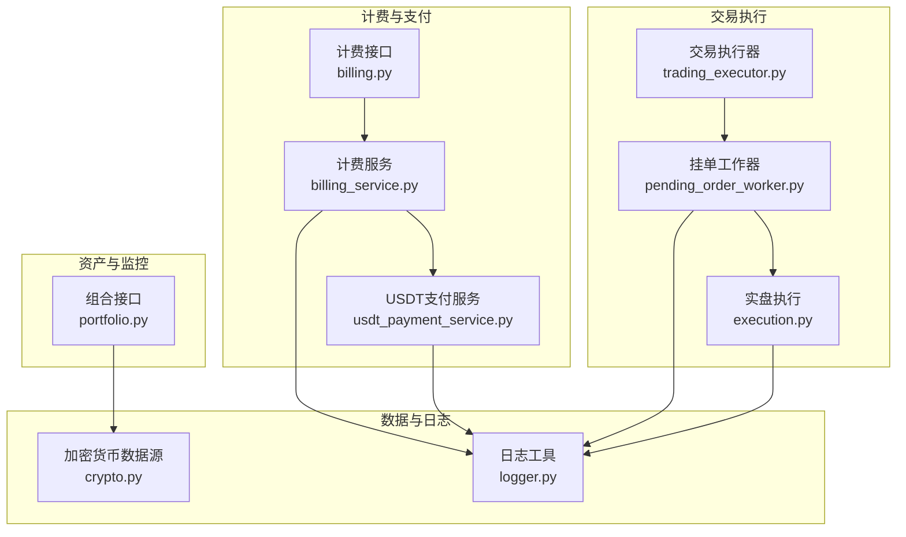
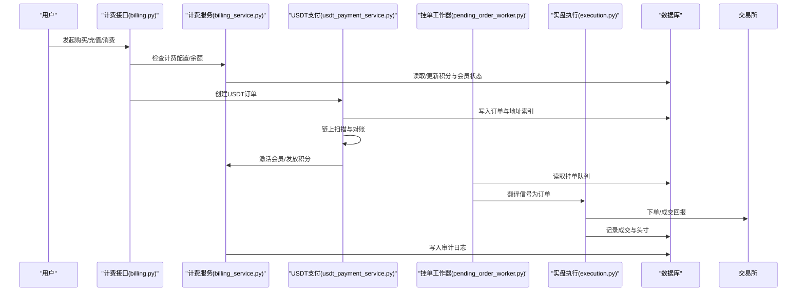
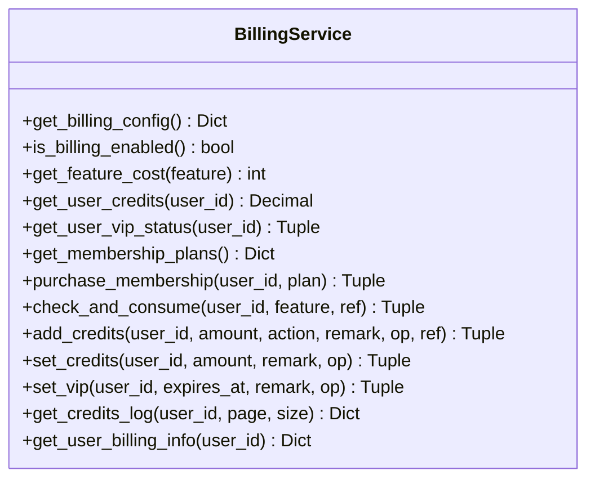
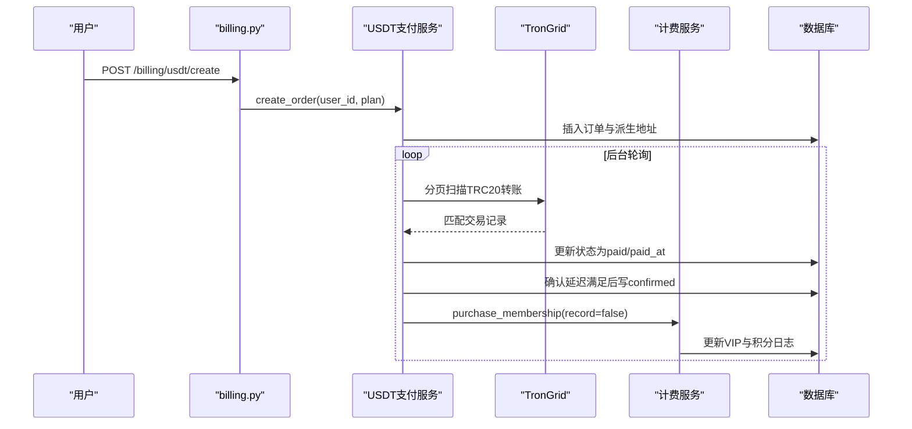
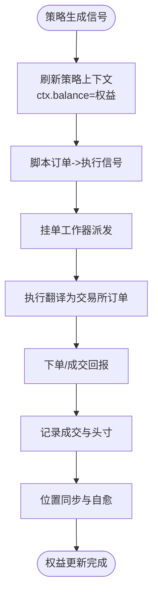
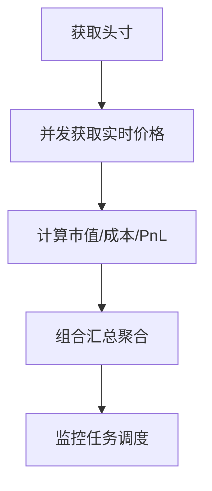
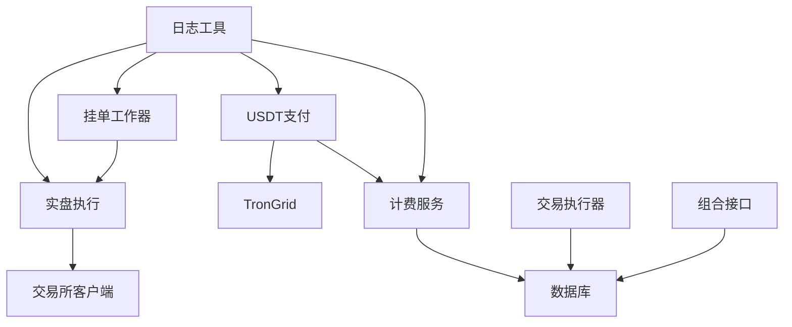

# 资金管理系统

<cite>
**本文档引用的文件**
- [billing_service.py](file://backend_api_python/app/services/billing_service.py)
- [billing.py](file://backend_api_python/app/routes/billing.py)
- [usdt_payment_service.py](file://backend_api_python/app/services/usdt_payment_service.py)
- [pending_order_worker.py](file://backend_api_python/app/services/pending_order_worker.py)
- [execution.py](file://backend_api_python/app/services/live_trading/execution.py)
- [trading_executor.py](file://backend_api_python/app/services/trading_executor.py)
- [portfolio.py](file://backend_api_python/app/routes/portfolio.py)
- [logger.py](file://backend_api_python/app/utils/logger.py)
- [crypto.py](file://backend_api_python/app/data_sources/crypto.py)
</cite>

## 目录
1. [简介](#简介)
2. [项目结构](#项目结构)
3. [核心组件](#核心组件)
4. [架构总览](#架构总览)
5. [详细组件分析](#详细组件分析)
6. [依赖关系分析](#依赖关系分析)
7. [性能考虑](#性能考虑)
8. [故障排除指南](#故障排除指南)
9. [结论](#结论)
10. [附录](#附录)

## 简介
本技术文档面向资金管理系统，围绕以下目标展开：  
- 资金计算模型：初始资金、已实现盈亏、未实现盈亏的计算方法与权益更新机制  
- 手续费与滑点：交易手续费、滑点处理与资金冻结/解冻流程  
- 资金划转：充值、提现与余额查询的实现细节  
- 杠杆交易：保证金计算与强平机制  
- 资金安全：异常处理与审计日志  
- 统计报表与风控：资金统计、风险指标与合规要求  

本系统采用模块化设计，计费与资金相关的核心能力集中在计费服务与USDT支付服务中，交易执行链路由挂单工作器与实盘执行模块协同完成。

## 项目结构
资金管理相关的关键模块与文件如下：
- 计费与积分：billing_service.py（计费配置、积分增减、会员状态）、billing.py（计费接口）
- USDT支付：usdt_payment_service.py（订单创建、链上对账、自动激活）
- 交易执行：pending_order_worker.py（挂单轮询与位置同步）、execution.py（信号到订单的翻译）、trading_executor.py（策略上下文与权益刷新）
- 资产与组合：portfolio.py（手动头寸与监控）
- 数据与日志：crypto.py（行情数据）、logger.py（日志配置）

**图表来源**
- [billing_service.py:1-758](file://backend_api_python/app/services/billing_service.py#L1-L758)
- [billing.py:1-95](file://backend_api_python/app/routes/billing.py#L1-L95)
- [usdt_payment_service.py:1-830](file://backend_api_python/app/services/usdt_payment_service.py#L1-L830)
- [pending_order_worker.py:1-800](file://backend_api_python/app/services/pending_order_worker.py#L1-L800)
- [execution.py:1-426](file://backend_api_python/app/services/live_trading/execution.py#L1-L426)
- [trading_executor.py:1-800](file://backend_api_python/app/services/trading_executor.py#L1-L800)
- [portfolio.py:1-800](file://backend_api_python/app/routes/portfolio.py#L1-L800)
- [crypto.py:1-428](file://backend_api_python/app/data_sources/crypto.py#L1-L428)
- [logger.py:1-63](file://backend_api_python/app/utils/logger.py#L1-L63)

**章节来源**
- [billing_service.py:1-758](file://backend_api_python/app/services/billing_service.py#L1-L758)
- [billing.py:1-95](file://backend_api_python/app/routes/billing.py#L1-L95)
- [usdt_payment_service.py:1-830](file://backend_api_python/app/services/usdt_payment_service.py#L1-L830)
- [pending_order_worker.py:1-800](file://backend_api_python/app/services/pending_order_worker.py#L1-L800)
- [execution.py:1-426](file://backend_api_python/app/services/live_trading/execution.py#L1-L426)
- [trading_executor.py:1-800](file://backend_api_python/app/services/trading_executor.py#L1-L800)
- [portfolio.py:1-800](file://backend_api_python/app/routes/portfolio.py#L1-L800)
- [crypto.py:1-428](file://backend_api_python/app/data_sources/crypto.py#L1-L428)
- [logger.py:1-63](file://backend_api_python/app/utils/logger.py#L1-L63)

## 核心组件
- 计费服务（BillingService）：统一计费、积分余额、会员状态与套餐发放，支持配置缓存与审计日志
- USDT支付服务（UsdtPaymentService）：每单独立地址、链上对账、自动激活会员
- 挂单工作器（PendingOrderWorker）：轮询挂单队列、标记处理、位置同步与异常自愈
- 实盘执行（Execution）：信号到交易所订单的翻译与下单
- 交易执行器（TradingExecutor）：策略脚本上下文、权益刷新、脚本订单转换
- 组合接口（Portfolio）：手动头寸、监控与汇总

**章节来源**
- [billing_service.py:47-758](file://backend_api_python/app/services/billing_service.py#L47-L758)
- [usdt_payment_service.py:23-830](file://backend_api_python/app/services/usdt_payment_service.py#L23-L830)
- [pending_order_worker.py:52-800](file://backend_api_python/app/services/pending_order_worker.py#L52-L800)
- [execution.py:123-426](file://backend_api_python/app/services/live_trading/execution.py#L123-L426)
- [trading_executor.py:37-800](file://backend_api_python/app/services/trading_executor.py#L37-L800)
- [portfolio.py:142-800](file://backend_api_python/app/routes/portfolio.py#L142-L800)

## 架构总览
资金管理贯穿“计费/支付—挂单—执行—记录/审计”的闭环：

**图表来源**
- [billing.py:20-95](file://backend_api_python/app/routes/billing.py#L20-L95)
- [billing_service.py:47-758](file://backend_api_python/app/services/billing_service.py#L47-L758)
- [usdt_payment_service.py:132-830](file://backend_api_python/app/services/usdt_payment_service.py#L132-L830)
- [pending_order_worker.py:99-800](file://backend_api_python/app/services/pending_order_worker.py#L99-L800)
- [execution.py:123-426](file://backend_api_python/app/services/live_trading/execution.py#L123-L426)

## 详细组件分析

### 计费与积分系统（BillingService）
- 功能计费配置：通过环境变量动态加载，支持全局开关与单项功能积分消耗
- 积分余额：原子性更新与审计日志，支持管理员调整
- 会员状态：VIP到期时间、计划类型、生命周期会员的周期性积分发放
- 审计日志：统一写入积分变动日志表，支持分页查询与UTC时间序列

**图表来源**
- [billing_service.py:47-758](file://backend_api_python/app/services/billing_service.py#L47-L758)

**章节来源**
- [billing_service.py:47-758](file://backend_api_python/app/services/billing_service.py#L47-L758)
- [billing.py:20-95](file://backend_api_python/app/routes/billing.py#L20-L95)

### USDT支付与自动激活（UsdtPaymentService）
- 订单创建：派生地址索引、唯一索引约束、订单有效期
- 链上对账：TronGrid分页扫描、匹配规则、确认延迟
- 自动激活：幂等确认、触发会员购买流程
- 批量刷新：后台工作器定期扫描，避免长事务阻塞

**图表来源**
- [billing.py:55-95](file://backend_api_python/app/routes/billing.py#L55-L95)
- [usdt_payment_service.py:132-830](file://backend_api_python/app/services/usdt_payment_service.py#L132-L830)
- [billing_service.py:202-346](file://backend_api_python/app/services/billing_service.py#L202-L346)

**章节来源**
- [usdt_payment_service.py:23-830](file://backend_api_python/app/services/usdt_payment_service.py#L23-L830)
- [billing.py:55-95](file://backend_api_python/app/routes/billing.py#L55-L95)

### 交易执行与权益计算（TradingExecutor/PendingOrderWorker/Execution）
- 策略上下文：脚本订单转换为执行信号，刷新ctx.balance/ctx.equity为当前权益
- 权益计算：初始资金 + 已实现盈亏 + 未实现盈亏
- 挂单处理：批量拉取、标记处理、回收卡住订单、位置同步
- 实盘执行：按交易所客户端翻译信号下单，记录成交与头寸

**图表来源**
- [trading_executor.py:513-546](file://backend_api_python/app/services/trading_executor.py#L513-L546)
- [pending_order_worker.py:99-800](file://backend_api_python/app/services/pending_order_worker.py#L99-L800)
- [execution.py:123-426](file://backend_api_python/app/services/live_trading/execution.py#L123-L426)

**章节来源**
- [trading_executor.py:513-546](file://backend_api_python/app/services/trading_executor.py#L513-L546)
- [pending_order_worker.py:99-800](file://backend_api_python/app/services/pending_order_worker.py#L99-L800)
- [execution.py:123-426](file://backend_api_python/app/services/live_trading/execution.py#L123-L426)

### 手动头寸与组合监控（Portfolio）
- 手动头寸：增删改查、实时价格获取、PnL计算
- 组合汇总：总成本、总市值、总盈亏、市场分布
- 监控告警：AI监控、价格/盈亏阈值提醒

**图表来源**
- [portfolio.py:142-518](file://backend_api_python/app/routes/portfolio.py#L142-L518)

**章节来源**
- [portfolio.py:142-518](file://backend_api_python/app/routes/portfolio.py#L142-L518)

## 依赖关系分析
- 计费服务依赖数据库与日志工具，提供积分与会员状态的原子操作
- USDT支付服务依赖计费服务进行激活，依赖TronGrid链上接口
- 挂单工作器依赖交易所客户端与数据库，负责订单派发与位置同步
- 实盘执行模块按交易所类型分发，统一输出标准化结果
- 交易执行器在策略脚本侧刷新权益，确保脚本使用真实资金规模

**图表来源**
- [billing_service.py:18-21](file://backend_api_python/app/services/billing_service.py#L18-L21)
- [usdt_payment_service.py:16-20](file://backend_api_python/app/services/usdt_payment_service.py#L16-L20)
- [pending_order_worker.py:19-49](file://backend_api_python/app/services/pending_order_worker.py#L19-L49)
- [execution.py:14-39](file://backend_api_python/app/services/live_trading/execution.py#L14-L39)
- [trading_executor.py:22-34](file://backend_api_python/app/services/trading_executor.py#L22-L34)
- [portfolio.py:15-26](file://backend_api_python/app/routes/portfolio.py#L15-L26)
- [logger.py:9-63](file://backend_api_python/app/utils/logger.py#L9-L63)

**章节来源**
- [billing_service.py:18-21](file://backend_api_python/app/services/billing_service.py#L18-L21)
- [usdt_payment_service.py:16-20](file://backend_api_python/app/services/usdt_payment_service.py#L16-L20)
- [pending_order_worker.py:19-49](file://backend_api_python/app/services/pending_order_worker.py#L19-L49)
- [execution.py:14-39](file://backend_api_python/app/services/live_trading/execution.py#L14-L39)
- [trading_executor.py:22-34](file://backend_api_python/app/services/trading_executor.py#L22-L34)
- [portfolio.py:15-26](file://backend_api_python/app/routes/portfolio.py#L15-L26)
- [logger.py:9-63](file://backend_api_python/app/utils/logger.py#L9-L63)

## 性能考虑
- 计费配置缓存：配置缓存TTL降低频繁读取环境变量的成本
- 并发与限流：组合接口使用线程池并发取价，内置请求间隔避免API限流
- 数据库连接：短事务读写，避免长时间持有连接；后台工作器批量扫描
- 交易所对接：按需懒加载客户端，减少初始化开销
- 日志：统一日志级别与文件滚动，避免生产环境日志噪声

[本节为通用指导，无需特定文件引用]

## 故障排除指南
- 计费/积分异常：检查计费配置缓存与数据库连接；查看积分日志与错误码
- USDT对账失败：关注TronGrid HTTP状态与分页指纹；确认最小时间窗与目标金额
- 挂单卡住：检查“处理中”超时回收；查看交易所认证与权限错误
- 实盘下单失败：核对信号类型、市场类型与符号规范化；检查交易所限流与风控
- 日志定位：通过日志工具设置级别与文件路径，结合审计日志定位问题

**章节来源**
- [billing_service.py:113-115](file://backend_api_python/app/services/billing_service.py#L113-L115)
- [usdt_payment_service.py:489-491](file://backend_api_python/app/services/usdt_payment_service.py#L489-L491)
- [pending_order_worker.py:754-798](file://backend_api_python/app/services/pending_order_worker.py#L754-L798)
- [execution.py:100,310:100-101](file://backend_api_python/app/services/live_trading/execution.py#L100-L101)
- [logger.py:9-63](file://backend_api_python/app/utils/logger.py#L9-L63)

## 结论
资金管理系统通过“计费/支付—挂单—执行—记录/审计”的闭环，实现了积分与会员的灵活计费、USDT链上对账与自动激活、策略脚本权益刷新与实盘执行的可靠落地。系统在性能与稳定性方面采取了多项工程化措施，同时通过完善的日志与审计保障资金安全与合规。

[本节为总结性内容，无需特定文件引用]

## 附录

### 资金计算模型与权益更新
- 初始资金：策略配置中的初始资本
- 已实现盈亏：历史成交累计收益（成交记录驱动）
- 未实现盈亏：当前持仓按实时价格浮动的收益
- 权益：初始资金 + 已实现盈亏 + 未实现盈亏
- 脚本侧权益刷新：交易执行器在脚本上下文中将ctx.balance/ctx.equity设为当前权益，确保脚本按真实资金规模计算

**章节来源**
- [trading_executor.py:513-546](file://backend_api_python/app/services/trading_executor.py#L513-L546)

### 手续费与滑点处理
- 手续费：通过交易所客户端下单时由交易所收取，系统不额外模拟
- 滑点：系统按市价单执行，滑点由交易所实际成交价格体现
- 资金冻结/解冻：系统不进行资金冻结/解冻操作，成交后按成交回报更新头寸与资金

**章节来源**
- [execution.py:153-310](file://backend_api_python/app/services/live_trading/execution.py#L153-L310)

### 资金划转、充值与余额查询
- 充值：通过USDT链上支付创建订单，链上确认后自动激活会员并发放积分
- 提现：系统未提供提现接口；积分可通过功能消费抵扣
- 余额查询：计费服务提供积分余额查询与审计日志分页查询

**章节来源**
- [usdt_payment_service.py:132-187](file://backend_api_python/app/services/usdt_payment_service.py#L132-L187)
- [billing_service.py:98-116](file://backend_api_python/app/services/billing_service.py#L98-L116)
- [billing_service.py:675-727](file://backend_api_python/app/services/billing_service.py#L675-L727)

### 杠杆交易与强平机制
- 保证金：由交易所客户端下单时按合约规则收取
- 强平：由交易所风控触发，系统通过位置同步检测并清理“幽灵持仓”，避免本地与交易所状态不一致

**章节来源**
- [pending_order_worker.py:138-751](file://backend_api_python/app/services/pending_order_worker.py#L138-L751)

### 资金安全、异常处理与审计日志
- 安全控制：USDT支付服务幂等确认、订单状态机严格控制；挂单工作器回收卡住订单
- 异常处理：各模块捕获异常并记录日志，避免连锁崩溃
- 审计日志：积分变动、会员激活、订单状态变更均写入审计日志表，支持UTC时间序列与分页查询

**章节来源**
- [usdt_payment_service.py:396-424](file://backend_api_python/app/services/usdt_payment_service.py#L396-L424)
- [pending_order_worker.py:754-798](file://backend_api_python/app/services/pending_order_worker.py#L754-L798)
- [billing_service.py:507-521](file://backend_api_python/app/services/billing_service.py#L507-L521)
- [logger.py:9-63](file://backend_api_python/app/utils/logger.py#L9-L63)

### 资金统计报表与风险指标
- 组合汇总：总成本、总市值、总盈亏、总盈亏百分比、市场分布
- 风险指标：建议结合实时价格与头寸规模计算最大回撤、波动率等（可在前端或扩展模块实现）
- 合规要求：审计日志保留UTC时间戳，支持监管审计与对账

**章节来源**
- [portfolio.py:401-518](file://backend_api_python/app/routes/portfolio.py#L401-L518)