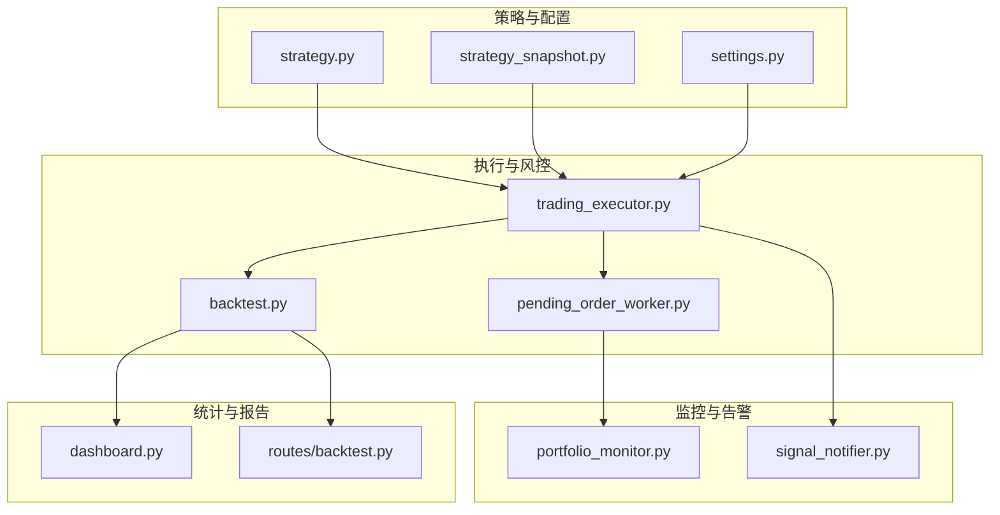
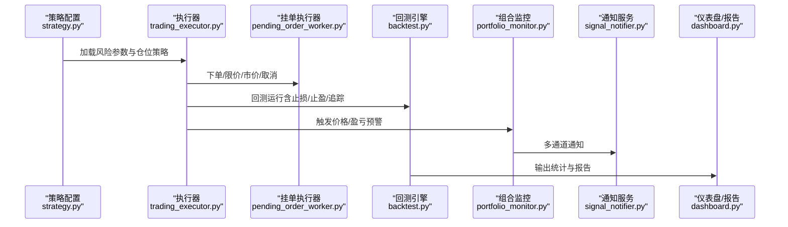
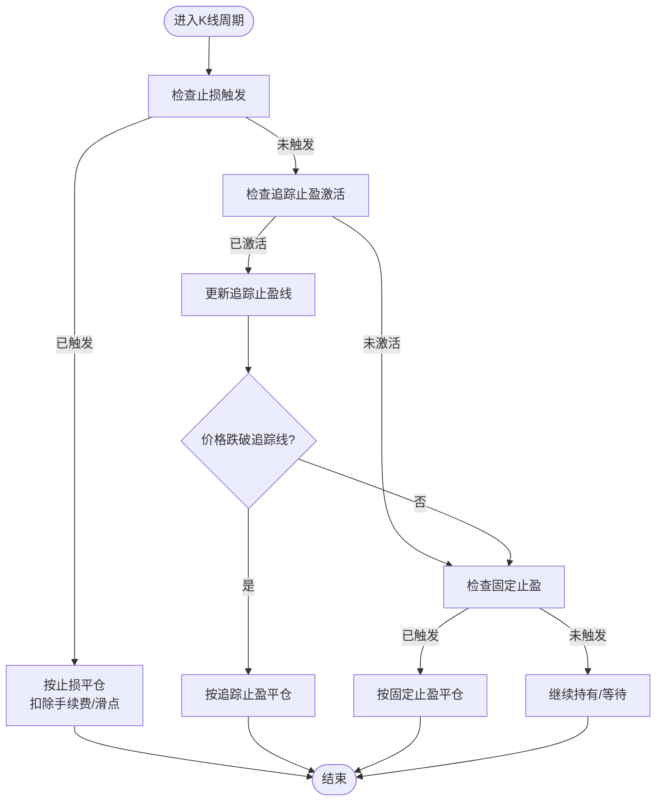
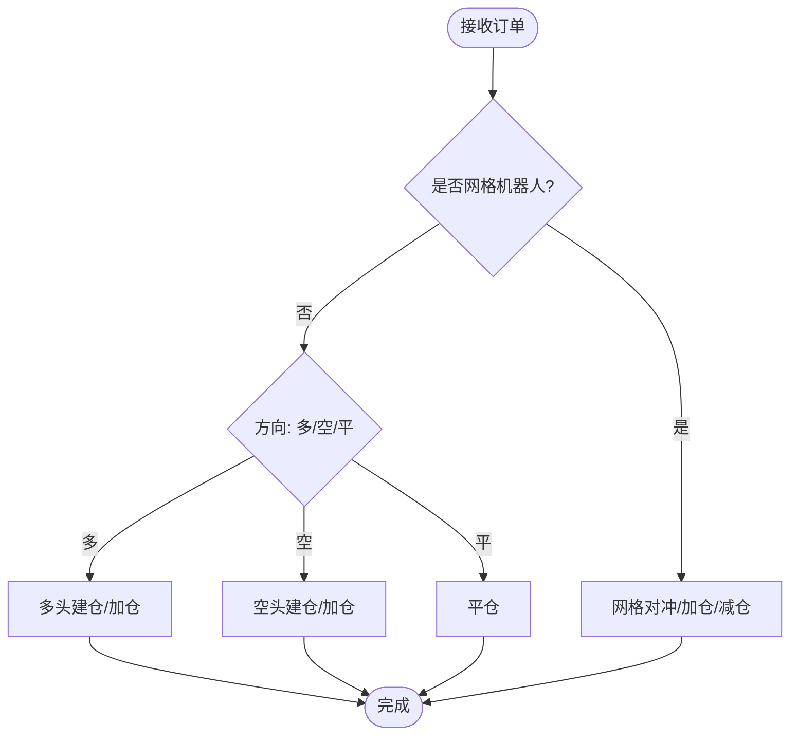
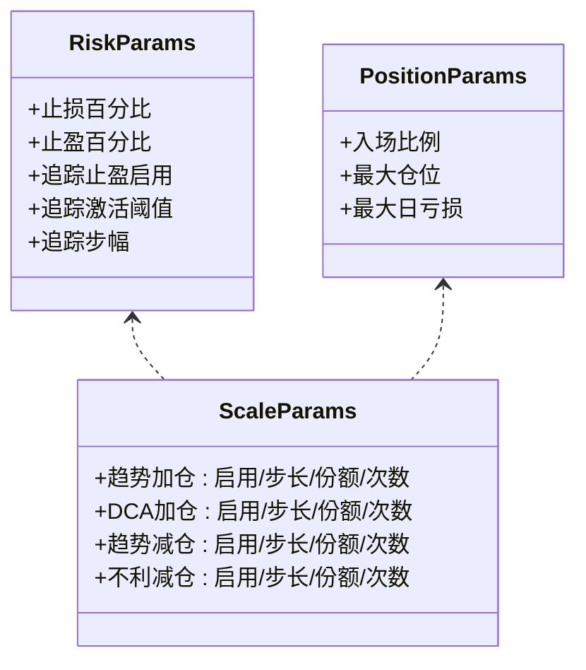
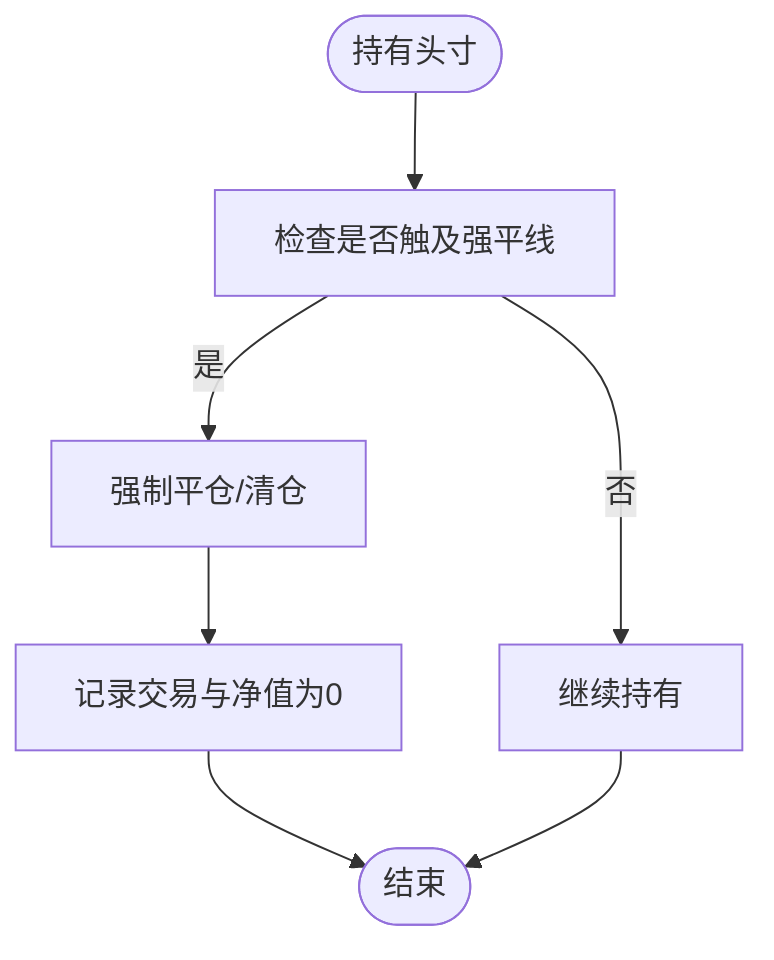
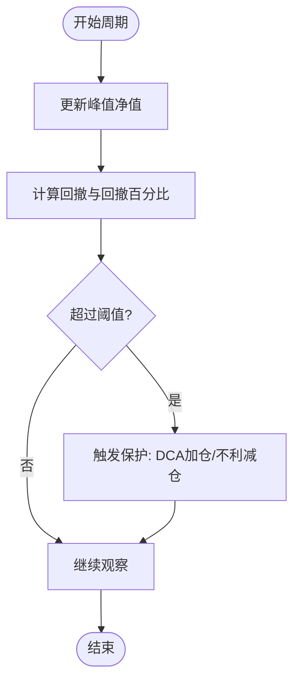
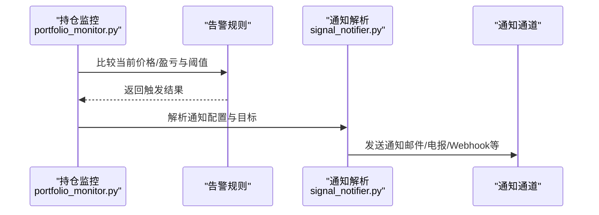
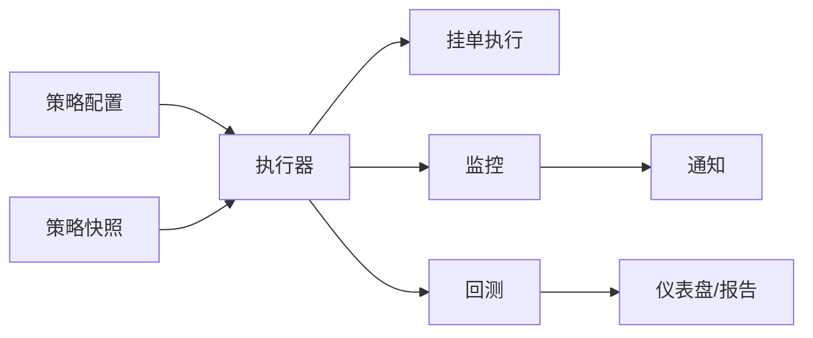

# 风险控制系统

<cite>
**本文档引用的文件**
- [trading_executor.py](file://backend_api_python/app/services/trading_executor.py)
- [backtest.py](file://backend_api_python/app/services/backtest.py)
- [strategy.py](file://backend_api_python/app/services/strategy.py)
- [strategy_snapshot.py](file://backend_api_python/app/services/strategy_snapshot.py)
- [pending_order_worker.py](file://backend_api_python/app/services/pending_order_worker.py)
- [portfolio_monitor.py](file://backend_api_python/app/services/portfolio_monitor.py)
- [signal_notifier.py](file://backend_api_python/app/services/signal_notifier.py)
- [dashboard.py](file://backend_api_python/app/routes/dashboard.py)
- [backtest.py](file://backend_api_python/app/routes/backtest.py)
- [settings.py](file://backend_api_python/app/config/settings.py)
</cite>

## 目录
1. [简介](#简介)
2. [项目结构](#项目结构)
3. [核心组件](#核心组件)
4. [架构总览](#架构总览)
5. [详细组件分析](#详细组件分析)
6. [依赖分析](#依赖分析)
7. [性能考量](#性能考量)
8. [故障排查指南](#故障排查指南)
9. [结论](#结论)
10. [附录](#附录)

## 简介
本文件面向量化交易系统中的风险控制系统，围绕止损止盈机制、仓位管理策略、风险控制参数配置与动态调整、强制平仓流程、最大回撤控制、连续亏损保护与单笔损失限制等主题进行系统化技术文档化。文档同时涵盖风险指标计算、实时监控与预警机制，并提供参数调优建议与最佳实践。

## 项目结构
风险控制相关代码主要分布在后端服务层，涉及实盘执行器、回测引擎、策略配置与快照、订单执行与风控、组合监控与告警、仪表盘统计与回测报告等模块。整体采用分层设计：策略配置与展示层、执行与风控层、监控与告警层、数据与报表层。

图表来源
- [strategy.py](file://backend_api_python/app/services/strategy.py)
- [strategy_snapshot.py](file://backend_api_python/app/services/strategy_snapshot.py)
- [settings.py](file://backend_api_python/app/config/settings.py)
- [trading_executor.py](file://backend_api_python/app/services/trading_executor.py)
- [pending_order_worker.py](file://backend_api_python/app/services/pending_order_worker.py)
- [backtest.py](file://backend_api_python/app/services/backtest.py)
- [portfolio_monitor.py](file://backend_api_python/app/services/portfolio_monitor.py)
- [signal_notifier.py](file://backend_api_python/app/services/signal_notifier.py)
- [dashboard.py](file://backend_api_python/app/routes/dashboard.py)
- [routes/backtest.py](file://backend_api_python/app/routes/backtest.py)

章节来源
- [strategy.py](file://backend_api_python/app/services/strategy.py)
- [trading_executor.py](file://backend_api_python/app/services/trading_executor.py)
- [backtest.py](file://backend_api_python/app/services/backtest.py)

## 核心组件
- 止损止盈与追踪止盈执行器：在实盘与回测中统一实现固定止损、固定止盈与追踪止盈的触发逻辑，支持激活阈值与滑点、手续费等现实因素。
- 仓位管理策略：固定比例建仓、网格交易、定投加仓（DCA）、趋势加仓与逆向减仓等扩展缩仓策略，均通过配置驱动与状态锚点实现。
- 风险控制参数与动态调整：通过策略配置与快照，集中管理止损止盈、追踪止盈、加减仓步长与次数上限、最大日亏损等参数。
- 强制平仓与爆仓处理：在回测与实盘中统一处理强平触发与资金归零场景，记录交易与净值曲线。
- 实时监控与预警：基于组合监控与告警规则，实现价格与盈亏阈值预警，并通过多通道通知发送。
- 风险指标计算与报告：仪表盘与回测报告中计算最大回撤、胜率、盈亏比、日收益分布等关键指标。

章节来源
- [trading_executor.py](file://backend_api_python/app/services/trading_executor.py)
- [backtest.py](file://backend_api_python/app/services/backtest.py)
- [strategy.py](file://backend_api_python/app/services/strategy.py)
- [strategy_snapshot.py](file://backend_api_python/app/services/strategy_snapshot.py)
- [portfolio_monitor.py](file://backend_api_python/app/services/portfolio_monitor.py)
- [signal_notifier.py](file://backend_api_python/app/services/signal_notifier.py)
- [dashboard.py](file://backend_api_python/app/routes/dashboard.py)
- [routes/backtest.py](file://backend_api_python/app/routes/backtest.py)

## 架构总览
风险控制系统贯穿策略配置、执行、风控、监控与报告环节，形成“配置-执行-风控-监控-报告”的闭环。

图表来源
- [strategy.py](file://backend_api_python/app/services/strategy.py)
- [trading_executor.py](file://backend_api_python/app/services/trading_executor.py)
- [pending_order_worker.py](file://backend_api_python/app/services/pending_order_worker.py)
- [backtest.py](file://backend_api_python/app/services/backtest.py)
- [portfolio_monitor.py](file://backend_api_python/app/services/portfolio_monitor.py)
- [signal_notifier.py](file://backend_api_python/app/services/signal_notifier.py)
- [dashboard.py](file://backend_api_python/app/routes/dashboard.py)

## 详细组件分析

### 止损止盈与追踪止盈机制
- 固定止损：在指定方向上，当价格达到或穿透止损阈值时触发平仓，考虑滑点与手续费。
- 固定止盈：在追踪禁用时生效，当价格达到止盈阈值时触发平仓。
- 追踪止盈（移动止损）：在激活阈值满足后，随价格朝有利方向移动而更新止盈线，一旦价格跌破追踪线即触发平仓。
- 执行优先级：止损优先于追踪止盈与固定止盈，避免重复触发与逻辑冲突。

图表来源
- [trading_executor.py](file://backend_api_python/app/services/trading_executor.py)
- [backtest.py](file://backend_api_python/app/services/backtest.py)

章节来源
- [trading_executor.py](file://backend_api_python/app/services/trading_executor.py)
- [backtest.py](file://backend_api_python/app/services/backtest.py)

### 仓位管理策略
- 固定比例建仓：根据策略配置的比例直接换算本地头寸单位下单。
- 网格交易：在上下轨之间按档位挂单，支持多空双向，支持在网格机器人模式下进行对冲与加仓。
- 定投加仓（DCA）：按频率与阈值在下跌时补仓，支持每日/每周等周期。
- 趋势加仓与逆向减仓：基于趋势方向与价格偏离锚点触发加仓或减仓，防止追涨杀跌。

图表来源
- [trading_executor.py](file://backend_api_python/app/services/trading_executor.py)

章节来源
- [trading_executor.py](file://backend_api_python/app/services/trading_executor.py)
- [strategy.py](file://backend_api_python/app/services/strategy.py)
- [strategy_snapshot.py](file://backend_api_python/app/services/strategy_snapshot.py)

### 风险控制参数配置与动态调整
- 风险参数：止损百分比、止盈百分比、追踪止盈启用、追踪激活阈值、追踪步幅等。
- 仓位参数：入场比例、最大仓位、最大日亏损等。
- 扩展缩仓：趋势加仓、DCA加仓、趋势减仓、不利减仓的启用、步长、份额与次数上限。
- 参数来源：策略配置与快照，支持运行时读取与校准。

图表来源
- [strategy_snapshot.py](file://backend_api_python/app/services/strategy_snapshot.py)
- [strategy.py](file://backend_api_python/app/services/strategy.py)

章节来源
- [strategy_snapshot.py](file://backend_api_python/app/services/strategy_snapshot.py)
- [strategy.py](file://backend_api_python/app/services/strategy.py)

### 强制平仓处理流程
- 触发条件：价格触及强平线或账户资金不足。
- 执行顺序：优先止损，其次强平；强平时清仓并记录交易与净值。
- 回测与实盘一致性：统一强平逻辑，确保策略回测与实盘行为一致。

图表来源
- [backtest.py](file://backend_api_python/app/services/backtest.py)
- [trading_executor.py](file://backend_api_python/app/services/trading_executor.py)

章节来源
- [backtest.py](file://backend_api_python/app/services/backtest.py)
- [trading_executor.py](file://backend_api_python/app/services/trading_executor.py)

### 最大回撤控制、连续亏损保护与单笔损失限制
- 最大回撤计算：基于净值曲线的峰值回撤与百分比回撤，支持多种回撤口径与兜底计算。
- 连续亏损保护：通过DCA加仓与不利减仓策略，在趋势不利时降低平均成本或及时减仓。
- 单笔损失限制：通过止损止盈与最大仓位控制单笔风险敞口，结合滑点与手续费计算实际损益。

图表来源
- [dashboard.py](file://backend_api_python/app/routes/dashboard.py)
- [backtest.py](file://backend_api_python/app/services/backtest.py)

章节来源
- [dashboard.py](file://backend_api_python/app/routes/dashboard.py)
- [backtest.py](file://backend_api_python/app/services/backtest.py)
- [routes/backtest.py](file://backend_api_python/app/routes/backtest.py)

### 风险指标计算、实时监控与预警机制
- 指标计算：总交易数、胜率、总盈亏、最大单笔盈亏、最大回撤、最大回撤百分比、日收益分布等。
- 实时监控：组合监控按价格与盈亏阈值触发告警，支持多语言消息模板与多通道通知。
- 通知通道：浏览器站内、邮件、Telegram、Discord、Webhook、短信等。

图表来源
- [portfolio_monitor.py](file://backend_api_python/app/services/portfolio_monitor.py)
- [signal_notifier.py](file://backend_api_python/app/services/signal_notifier.py)

章节来源
- [portfolio_monitor.py](file://backend_api_python/app/services/portfolio_monitor.py)
- [signal_notifier.py](file://backend_api_python/app/services/signal_notifier.py)
- [dashboard.py](file://backend_api_python/app/routes/dashboard.py)

## 依赖分析
- 组件耦合：执行器依赖策略配置与快照；监控依赖通知服务；回测依赖执行器与统计模块。
- 外部依赖：交易所客户端、数据库、邮件/短信/电报等第三方服务。
- 循环依赖：当前模块间无明显循环依赖，职责边界清晰。

图表来源
- [strategy.py](file://backend_api_python/app/services/strategy.py)
- [strategy_snapshot.py](file://backend_api_python/app/services/strategy_snapshot.py)
- [trading_executor.py](file://backend_api_python/app/services/trading_executor.py)
- [pending_order_worker.py](file://backend_api_python/app/services/pending_order_worker.py)
- [portfolio_monitor.py](file://backend_api_python/app/services/portfolio_monitor.py)
- [signal_notifier.py](file://backend_api_python/app/services/signal_notifier.py)
- [backtest.py](file://backend_api_python/app/services/backtest.py)
- [dashboard.py](file://backend_api_python/app/routes/dashboard.py)

章节来源
- [strategy.py](file://backend_api_python/app/services/strategy.py)
- [strategy_snapshot.py](file://backend_api_python/app/services/strategy_snapshot.py)
- [trading_executor.py](file://backend_api_python/app/services/trading_executor.py)
- [pending_order_worker.py](file://backend_api_python/app/services/pending_order_worker.py)
- [portfolio_monitor.py](file://backend_api_python/app/services/portfolio_monitor.py)
- [signal_notifier.py](file://backend_api_python/app/services/signal_notifier.py)
- [backtest.py](file://backend_api_python/app/services/backtest.py)
- [dashboard.py](file://backend_api_python/app/routes/dashboard.py)

## 性能考量
- 回测性能：多时间框架与缓存机制，限制高精度回测的时间范围以平衡性能与精度。
- 并发与限流：通知服务与外部API调用设置超时与重试策略，避免阻塞主线程。
- 数据访问：数据库索引与查询优化，减少高频查询带来的延迟。
- 内存与缓存：K线缓存与对象池化，降低重复计算与内存占用。

## 故障排查指南
- 订单执行异常：检查挂单阶段的剩余量、取消逻辑与交易所最小下单量约束，必要时降级为市价单。
- 通知失败：核对通知配置（令牌、目标地址、签名密钥），查看通知服务日志与HTTP响应码。
- 强制平仓误判：核对强平线计算、滑点与手续费设置，确认是否被止损提前触发。
- 回撤异常：检查峰值净值计算与回撤百分比的分母选择，确保在初始资金为0时的兜底逻辑有效。

章节来源
- [pending_order_worker.py](file://backend_api_python/app/services/pending_order_worker.py)
- [signal_notifier.py](file://backend_api_python/app/services/signal_notifier.py)
- [backtest.py](file://backend_api_python/app/services/backtest.py)
- [dashboard.py](file://backend_api_python/app/routes/dashboard.py)

## 结论
该风险控制系统通过统一的参数配置、严谨的执行与风控逻辑、完善的监控与预警机制，实现了对止损止盈、追踪止盈、仓位管理与强制平仓的全流程覆盖。配合回测与仪表盘指标，能够有效控制最大回撤、连续亏损与单笔损失，提升策略稳健性与可解释性。

## 附录
- 参数调优建议
  - 止损止盈：根据波动率与滑点设置合理阈值，避免频繁假突破；追踪止盈步幅应与波动率匹配。
  - 仓位管理：固定比例建仓需结合账户容量与最大回撤目标；网格档位不宜过密，避免流动性风险。
  - DCA与趋势加仓：步长与次数上限应与市场趋势强度相匹配，避免在震荡市中过度加仓。
  - 最大日亏损：结合历史回测与实盘表现设定阈值，定期复盘并动态调整。
- 最佳实践
  - 使用回测验证参数有效性，避免仅凭直觉设定。
  - 在实盘前开启小规模模拟，逐步放大仓位。
  - 建立多维度监控与告警，确保风险事件第一时间响应。
  - 定期复盘最大回撤与交易分布，持续优化策略与风控参数。