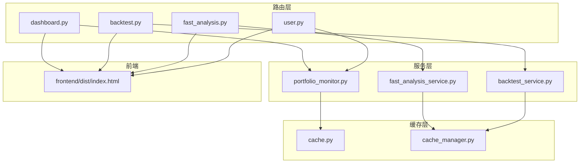
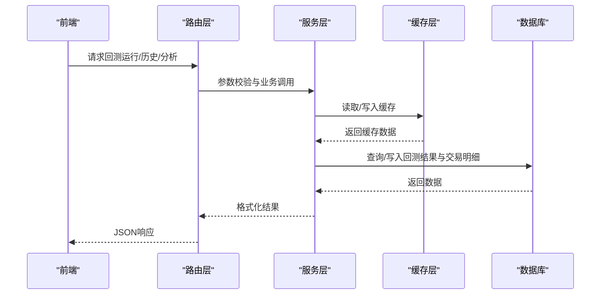
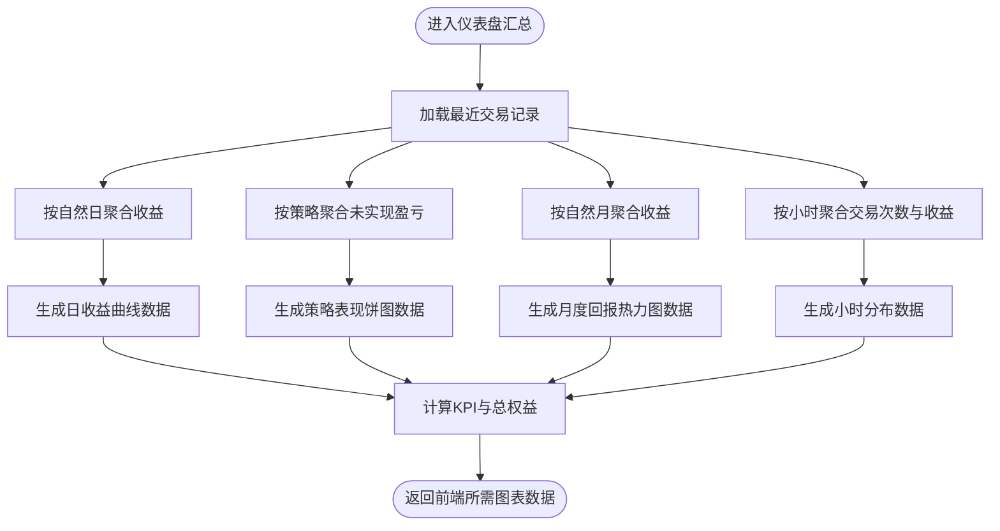
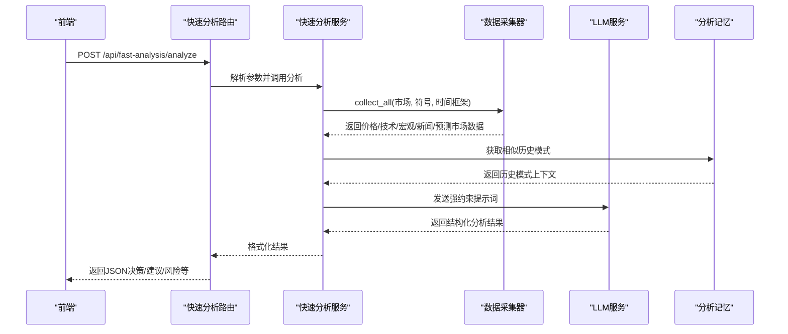
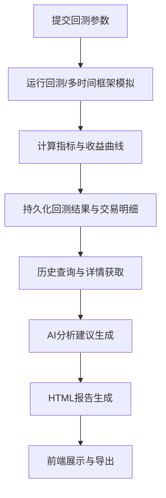
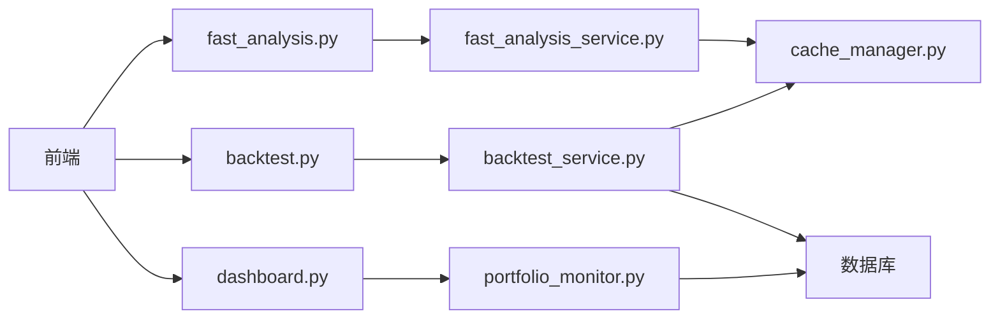

# 可视化与报告

<cite>
**本文引用的文件**
- [dashboard.py](file://backend_api_python/app/routes/dashboard.py)
- [backtest.py](file://backend_api_python/app/routes/backtest.py)
- [fast_analysis.py](file://backend_api_python/app/routes/fast_analysis.py)
- [fast_analysis_service.py](file://backend_api_python/app/services/fast_analysis.py)
- [backtest_service.py](file://backend_api_python/app/services/backtest.py)
- [portfolio_monitor.py](file://backend_api_python/app/services/portfolio_monitor.py)
- [cache.py](file://backend_api_python/app/utils/cache.py)
- [cache_manager.py](file://backend_api_python/app/data_sources/cache_manager.py)
- [user.py](file://backend_api_python/app/routes/user.py)
</cite>

## 目录
1. [简介](#简介)
2. [项目结构](#项目结构)
3. [核心组件](#核心组件)
4. [架构总览](#架构总览)
5. [详细组件分析](#详细组件分析)
6. [依赖关系分析](#依赖关系分析)
7. [性能考量](#性能考量)
8. [故障排查指南](#故障排查指南)
9. [结论](#结论)
10. [附录](#附录)

## 简介
本文件面向回测可视化与报告系统，系统性阐述收益曲线图表、交易记录表格、性能指标仪表板的设计与实现；详解快速分析(Fast Analysis)功能的数据处理流程与实时展示机制；文档化回测报告的生成模板、数据格式与导出能力；解释图表组件的交互设计、响应式布局与性能优化策略；提供自定义报告模板的开发指南与扩展方法；涵盖报告数据的缓存策略、增量更新机制与离线生成选项；并说明报告与前端界面的集成方式与数据同步机制。

## 项目结构
回测与报告相关的核心代码位于后端 Python API 中，主要分布在以下模块：
- 路由层：dashboard.py 提供仪表盘汇总数据；backtest.py 提供回测运行与历史查询；fast_analysis.py 提供快速分析接口；user.py 提供图表模板管理。
- 服务层：fast_analysis_service.py 实现快速分析服务；backtest_service.py 实现回测引擎与持久化；portfolio_monitor.py 实现组合报告生成与推送。
- 缓存层：cache.py 提供通用缓存；cache_manager.py 提供数据源缓存管理。
- 前端：frontend/dist/index.html 作为静态资源入口（由构建产物提供）。

**图示来源**
- [dashboard.py:307-588](file://backend_api_python/app/routes/dashboard.py#L307-L588)
- [backtest.py:149-376](file://backend_api_python/app/routes/backtest.py#L149-L376)
- [fast_analysis.py:113-311](file://backend_api_python/app/routes/fast_analysis.py#L113-L311)
- [fast_analysis_service.py:186-2797](file://backend_api_python/app/services/fast_analysis.py#L186-L2797)
- [backtest_service.py:64-668](file://backend_api_python/app/services/backtest.py#L64-L668)
- [portfolio_monitor.py:281-752](file://backend_api_python/app/services/portfolio_monitor.py#L281-L752)
- [cache.py:17-128](file://backend_api_python/app/utils/cache.py#L17-L128)
- [cache_manager.py:44-232](file://backend_api_python/app/data_sources/cache_manager.py#L44-L232)

**章节来源**
- [dashboard.py:1-745](file://backend_api_python/app/routes/dashboard.py#L1-L745)
- [backtest.py:1-829](file://backend_api_python/app/routes/backtest.py#L1-L829)
- [fast_analysis.py:1-667](file://backend_api_python/app/routes/fast_analysis.py#L1-L667)
- [fast_analysis_service.py:1-2805](file://backend_api_python/app/services/fast_analysis.py#L1-L2805)
- [backtest_service.py:1-4974](file://backend_api_python/app/services/backtest.py#L1-L4974)
- [portfolio_monitor.py:1-1770](file://backend_api_python/app/services/portfolio_monitor.py#L1-L1770)
- [cache.py:1-128](file://backend_api_python/app/utils/cache.py#L1-L128)
- [cache_manager.py:1-232](file://backend_api_python/app/data_sources/cache_manager.py#L1-L232)
- [user.py:762-945](file://backend_api_python/app/routes/user.py#L762-L945)

## 核心组件
- 仪表盘汇总与图表数据：dashboard.py 提供日收益曲线、策略表现饼图、月度回报热力图、小时分布、日历视图等数据，支撑前端可视化展示。
- 回测引擎与报告：backtest.py 提供回测运行、历史查询、AI分析建议生成；backtest_service.py 实现回测计算、多时间框架模拟、指标计算与持久化。
- 快速分析：fast_analysis.py 提供快速分析接口；fast_analysis_service.py 实现统一数据采集、技术指标计算、提示工程与LLM调用。
- 组合报告：portfolio_monitor.py 生成HTML组合报告，包含概览、AI建议、逐项分析、风险评估等模块。
- 缓存与性能：cache.py 与 cache_manager.py 提供本地/Redis缓存与数据源缓存，提升回测与分析的响应速度。
- 图表模板：user.py 提供图表模板的保存、读取与删除，便于用户自定义指标显示。

**章节来源**
- [dashboard.py:127-588](file://backend_api_python/app/routes/dashboard.py#L127-L588)
- [backtest.py:149-800](file://backend_api_python/app/routes/backtest.py#L149-L800)
- [backtest_service.py:444-668](file://backend_api_python/app/services/backtest.py#L444-L668)
- [fast_analysis.py:113-311](file://backend_api_python/app/routes/fast_analysis.py#L113-L311)
- [fast_analysis_service.py:186-761](file://backend_api_python/app/services/fast_analysis.py#L186-L761)
- [portfolio_monitor.py:389-752](file://backend_api_python/app/services/portfolio_monitor.py#L389-L752)
- [cache.py:17-128](file://backend_api_python/app/utils/cache.py#L17-L128)
- [cache_manager.py:44-232](file://backend_api_python/app/data_sources/cache_manager.py#L44-L232)
- [user.py:762-945](file://backend_api_python/app/routes/user.py#L762-L945)

## 架构总览
系统采用“路由层-服务层-缓存层-前端”的分层架构：
- 路由层负责接收请求、鉴权与参数校验，返回标准化JSON。
- 服务层封装业务逻辑：回测计算、快速分析、报告生成、通知推送。
- 缓存层通过内存/Redis实现高性能数据复用，降低外部API与数据库压力。
- 前端通过HTTP接口消费数据，渲染图表与表格，支持响应式布局与交互。

**图示来源**
- [backtest.py:149-376](file://backend_api_python/app/routes/backtest.py#L149-L376)
- [fast_analysis.py:113-311](file://backend_api_python/app/routes/fast_analysis.py#L113-L311)
- [cache.py:100-124](file://backend_api_python/app/utils/cache.py#L100-L124)
- [cache_manager.py:71-174](file://backend_api_python/app/data_sources/cache_manager.py#L71-L174)

## 详细组件分析

### 收益曲线图表与仪表板
- 日收益曲线：基于最近交易的 realized profit 按自然日聚合，输出日期-收益序列，支持前端折线图渲染。
- 策略表现饼图：基于未平仓头寸的未实现盈亏按策略聚合，反映各策略的相对贡献。
- 月度回报热力图：按自然月聚合收益，形成日历热力图数据。
- 小时分布：统计每小时交易次数与收益，辅助时段偏好分析。
- 仪表板KPI：总权益、总盈亏、总实盘/未实现盈亏、胜率、最大回撤、最大单日盈亏等。

**图示来源**
- [dashboard.py:464-588](file://backend_api_python/app/routes/dashboard.py#L464-L588)

**章节来源**
- [dashboard.py:127-588](file://backend_api_python/app/routes/dashboard.py#L127-L588)

### 交易记录表格
- 最近交易列表：限制数量并转换时间戳，便于前端表格展示。
- 字段设计：包含策略名称、时间、方向、价格、数量、收益、原因等，支持排序与筛选。
- 增量展示：前端可基于时间戳增量拉取，避免全量刷新。

**章节来源**
- [dashboard.py:395-442](file://backend_api_python/app/routes/dashboard.py#L395-L442)

### 性能指标仪表板
- 指标计算：总交易数、胜率、总盈亏、总亏损、盈亏比、平均赢/输、最大赢/输、最大回撤、最大回撤百分比、最佳/最差日等。
- 初始资本影响：在计算回撤时考虑初始资本，确保百分比计算合理。
- 策略级统计：按策略聚合指标，支持排序与筛选。

**章节来源**
- [dashboard.py:127-254](file://backend_api_python/app/routes/dashboard.py#L127-L254)

### 快速分析(Fast Analysis)数据流与实时展示
- 接口入口：/api/fast-analysis/analyze 提交市场、符号、语言、模型、时间框架等参数。
- 数据采集：统一 MarketDataCollector 收集价格、K线、技术指标、宏观、新闻、预测市场等数据。
- 技术指标：内置RSI、MACD、MA趋势、支撑阻力、波动率等信号解读。
- 提示工程：强约束提示词，要求输出结构化JSON，包含决策、置信度、摘要、理由、风险、目标价位等。
- 内存检索：相似历史模式检索，增强决策可信度。
- 实时展示：前端轮询或WebSocket订阅（如实现）获取分析结果，展示决策、建议与风险。

**图示来源**
- [fast_analysis.py:113-311](file://backend_api_python/app/routes/fast_analysis.py#L113-L311)
- [fast_analysis_service.py:203-761](file://backend_api_python/app/services/fast_analysis.py#L203-L761)

**章节来源**
- [fast_analysis.py:1-667](file://backend_api_python/app/routes/fast_analysis.py#L1-L667)
- [fast_analysis_service.py:186-761](file://backend_api_python/app/services/fast_analysis.py#L186-L761)

### 回测报告生成与导出
- 回测运行：支持标准与多时间框架回测，自动选择执行时间框架，计算指标并持久化。
- 历史查询：分页查询回测运行记录，支持按指标筛选。
- AI分析建议：根据多个回测运行生成参数调优建议，支持多语言。
- 报告模板：后端生成HTML报告，包含组合概览、AI建议汇总、逐项分析、风险评估等模块，支持折叠展开与响应式布局。
- 导出能力：前端可截图或打印HTML报告；也可将报告内容转存为PDF（前端扩展）。

**图示来源**
- [backtest.py:149-376](file://backend_api_python/app/routes/backtest.py#L149-L376)
- [backtest_service.py:444-668](file://backend_api_python/app/services/backtest.py#L444-L668)
- [portfolio_monitor.py:389-752](file://backend_api_python/app/services/portfolio_monitor.py#L389-L752)

**章节来源**
- [backtest.py:149-800](file://backend_api_python/app/routes/backtest.py#L149-L800)
- [backtest_service.py:64-668](file://backend_api_python/app/services/backtest.py#L64-L668)
- [portfolio_monitor.py:389-752](file://backend_api_python/app/services/portfolio_monitor.py#L389-L752)

### 图表组件交互设计与响应式布局
- 交互设计：支持缩放、平移、悬停提示、筛选器联动（时间范围、市场、符号等）。
- 响应式布局：网格布局适配移动端，关键指标卡片在窄屏下自动换行。
- 可折叠模块：报告中的“交易员详细评估”“市场概览”“风险评估”等模块支持折叠展开，提升可读性。

**章节来源**
- [portfolio_monitor.py:400-752](file://backend_api_python/app/services/portfolio_monitor.py#L400-L752)

### 自定义报告模板开发指南
- 模板存储：用户可通过 /api/user/chart-templates 保存/读取/删除图表模板，模板包含指标实例、可见性、样式等。
- 扩展方法：可在服务层增加新的报告模块（如“交易员评估”“宏观影响”），并在HTML模板中添加对应区域与折叠逻辑。
- 语言支持：报告与提示词均支持多语言，通过语言参数切换文案。

**章节来源**
- [user.py:762-945](file://backend_api_python/app/routes/user.py#L762-L945)
- [portfolio_monitor.py:400-752](file://backend_api_python/app/services/portfolio_monitor.py#L400-L752)

### 报告数据缓存策略与增量更新
- 通用缓存：CacheManager 提供本地/Redis双栈，支持TTL与序列化。
- 数据源缓存：DataCache 提供TTL+LRU，按数据类型分区管理，减少重复请求。
- 增量更新：前端基于时间戳增量拉取交易与回测结果；仪表盘按自然日聚合，避免全量重算。
- 离线生成：报告HTML可离线保存，后续通过前端工具进行二次渲染或导出。

**章节来源**
- [cache.py:17-128](file://backend_api_python/app/utils/cache.py#L17-L128)
- [cache_manager.py:44-232](file://backend_api_python/app/data_sources/cache_manager.py#L44-L232)
- [dashboard.py:464-588](file://backend_api_python/app/routes/dashboard.py#L464-L588)

### 报告与前端集成与数据同步
- 接口契约：路由层统一返回 {code, msg, data} 结构，前端按需渲染。
- 数据同步：仪表盘与回测详情分别维护独立数据流；前端通过定时轮询或事件驱动保持同步。
- 错误处理：路由层捕获异常并返回统一错误码，便于前端提示与重试。

**章节来源**
- [dashboard.py:307-588](file://backend_api_python/app/routes/dashboard.py#L307-L588)
- [backtest.py:378-448](file://backend_api_python/app/routes/backtest.py#L378-L448)

## 依赖关系分析
- 路由到服务：dashboard.py 依赖 dashboard 汇总函数；backtest.py 依赖 BacktestService；fast_analysis.py 依赖 FastAnalysisService。
- 服务到缓存：FastAnalysisService 与 BacktestService 通过 MarketDataCollector 与 DataCache 使用缓存。
- 服务到数据库：BacktestService 与 Dashboard 路由通过数据库连接读写回测运行与交易明细。
- 前端到后端：前端通过HTTP接口消费数据，支持响应式布局与交互。

**图示来源**
- [backtest.py:149-376](file://backend_api_python/app/routes/backtest.py#L149-L376)
- [dashboard.py:307-588](file://backend_api_python/app/routes/dashboard.py#L307-L588)
- [fast_analysis.py:113-311](file://backend_api_python/app/routes/fast_analysis.py#L113-L311)
- [backtest_service.py:64-668](file://backend_api_python/app/services/backtest.py#L64-L668)
- [fast_analysis_service.py:186-2797](file://backend_api_python/app/services/fast_analysis.py#L186-L2797)
- [cache_manager.py:44-232](file://backend_api_python/app/data_sources/cache_manager.py#L44-L232)

**章节来源**
- [backtest.py:1-829](file://backend_api_python/app/routes/backtest.py#L1-L829)
- [dashboard.py:1-745](file://backend_api_python/app/routes/dashboard.py#L1-L745)
- [fast_analysis.py:1-667](file://backend_api_python/app/routes/fast_analysis.py#L1-L667)
- [backtest_service.py:1-4974](file://backend_api_python/app/services/backtest.py#L1-L4974)
- [fast_analysis_service.py:1-2805](file://backend_api_python/app/services/fast_analysis.py#L1-L2805)
- [cache_manager.py:1-232](file://backend_api_python/app/data_sources/cache_manager.py#L1-L232)

## 性能考量
- 缓存策略：统一使用 CacheManager 与 DataCache，针对不同数据类型设置TTL，显著降低外部API与数据库压力。
- 并行处理：快速分析对重复标的去重并行处理，控制并发度，避免LLM调用浪费。
- 多时间框架：回测自动选择执行时间框架，避免不必要的高精度数据拉取。
- 前端优化：图表组件采用虚拟滚动与懒加载，减少DOM压力；响应式布局降低移动端渲染成本。

[本节为通用指导，不直接分析具体文件]

## 故障排查指南
- 路由异常：检查路由层返回的错误码与消息，定位参数缺失或权限问题。
- 回测失败：查看回测服务的持久化与异常捕获，确认数据库连接与指标计算逻辑。
- 快速分析失败：检查LLM服务可用性与提示词构造，确认数据采集器返回数据完整性。
- 缓存异常：确认缓存开关与Redis连通性，必要时降级为内存缓存。

**章节来源**
- [backtest.py:334-376](file://backend_api_python/app/routes/backtest.py#L334-L376)
- [fast_analysis.py:25-88](file://backend_api_python/app/routes/fast_analysis.py#L25-L88)
- [cache.py:77-98](file://backend_api_python/app/utils/cache.py#L77-L98)

## 结论
本系统通过清晰的分层架构与完善的缓存机制，实现了高效、可扩展的回测可视化与报告能力。收益曲线、交易表格、性能指标仪表板与快速分析报告共同构成完整的决策支持体系。通过自定义报告模板与响应式布局，满足多场景与多终端需求。建议持续优化缓存命中率与前端渲染性能，并扩展更多可视化维度与导出格式。

[本节为总结性内容，不直接分析具体文件]

## 附录
- 关键接口路径与用途
  - /api/dashboard/summary：仪表盘汇总数据
  - /api/backtest/backtest：运行回测
  - /api/backtest/backtest/history：回测历史查询
  - /api/backtest/backtest/get：回测详情
  - /api/fast-analysis/analyze：快速分析
  - /api/user/chart-templates：图表模板管理

**章节来源**
- [dashboard.py:307-588](file://backend_api_python/app/routes/dashboard.py#L307-L588)
- [backtest.py:149-448](file://backend_api_python/app/routes/backtest.py#L149-L448)
- [fast_analysis.py:113-311](file://backend_api_python/app/routes/fast_analysis.py#L113-L311)
- [user.py:762-945](file://backend_api_python/app/routes/user.py#L762-L945)