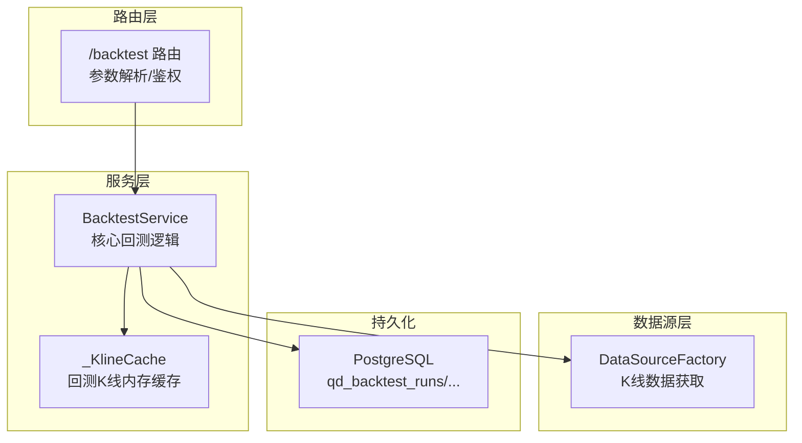
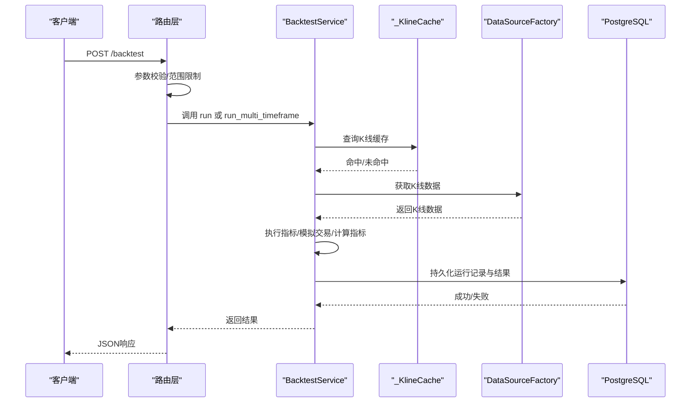
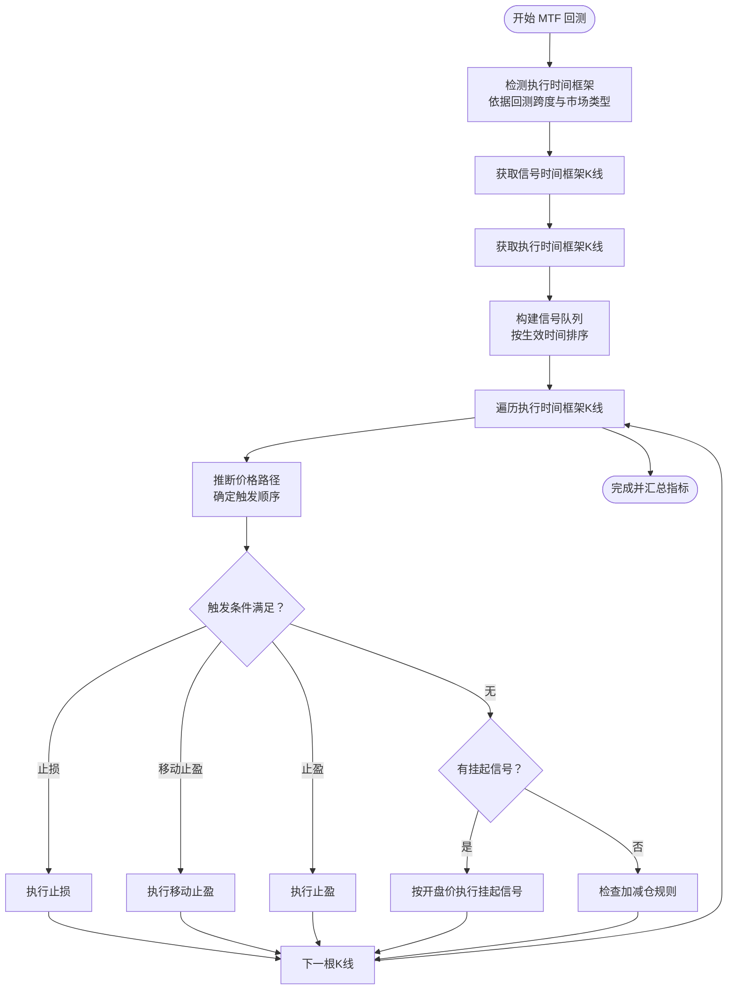
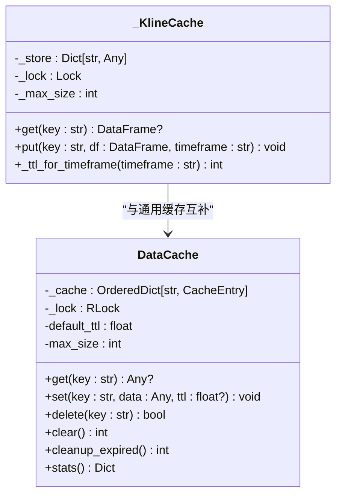
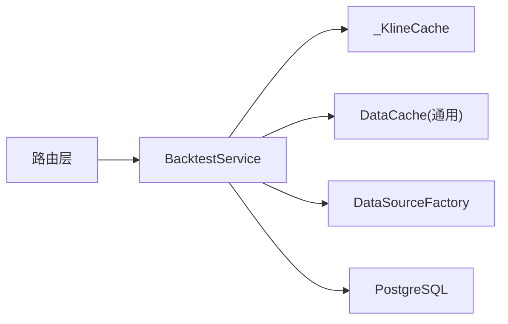

# 回测引擎架构

<cite>
**本文档引用的文件**
- [backtest.py](file://backend_api_python/app/services/backtest.py)
- [backtest.py](file://backend_api_python/app/routers/backtest.py)
- [cache_manager.py](file://backend_api_python/app/data_sources/cache_manager.py)
</cite>

## 目录
1. [引言](#引言)
2. [项目结构](#项目结构)
3. [核心组件](#核心组件)
4. [架构总览](#架构总览)
5. [详细组件分析](#详细组件分析)
6. [依赖关系分析](#依赖关系分析)
7. [性能考量](#性能考量)
8. [故障排查指南](#故障排查指南)
9. [结论](#结论)

## 引言
本技术文档面向回测引擎架构，聚焦于 BacktestService 类的设计理念、核心算法实现与数据流处理机制，系统阐述多时间框架回测（Multi-timeframe Backtest, MTF）的工作原理，包括信号生成时间框架与执行时间框架的分离策略；文档化回测缓存系统（_KlineCache）的 TTL 机制、内存管理与性能优化策略；解释回测参数配置、执行假设与精度信息的处理逻辑；并提供回测引擎的初始化流程、数据获取策略与错误处理机制，以及与系统其他组件的集成方式与扩展点。

## 项目结构
回测引擎主要位于后端服务层，采用分层设计：
- 服务层：BacktestService 提供回测核心能力，包括标准回测、多时间框架回测、策略脚本回测、缓存管理、指标执行与交易模拟等。
- 路由层：提供对外 API 接口，负责参数解析、权限校验、调用 BacktestService 并持久化运行记录。
- 数据源层：通过 DataSourceFactory 获取 K 线数据，配合缓存模块提升性能。
- 缓存层：提供两类缓存，一类是通用 DataCache（用于行情/信息缓存），另一类是 _KlineCache（用于回测 K 线的轻量内存缓存）。

图表来源
- [backtest.py:64-83](file://backend_api_python/app/services/backtest.py#L64-L83)
- [backtest.py:149-375](file://backend_api_python/app/routers/backtest.py#L149-L375)
- [cache_manager.py:44-70](file://backend_api_python/app/data_sources/cache_manager.py#L44-L70)

章节来源
- [backtest.py:64-83](file://backend_api_python/app/services/backtest.py#L64-L83)
- [backtest.py:149-375](file://backend_api_python/app/routers/backtest.py#L149-L375)
- [cache_manager.py:44-70](file://backend_api_python/app/data_sources/cache_manager.py#L44-L70)

## 核心组件
- BacktestService：回测引擎核心，提供多时间框架回测、标准回测、策略脚本回测、指标执行、交易模拟、指标计算与结果格式化等功能。
- _KlineCache：轻量内存缓存，针对回测场景优化，支持按时间框架的 TTL 控制与 LRU 淘汰。
- DataCache：通用缓存管理器，支持 TTL、LRU、线程安全与统计信息。
- 路由接口：对外提供回测请求入口，负责参数校验、范围限制、MTF 开关与持久化。

章节来源
- [backtest.py:64-83](file://backend_api_python/app/services/backtest.py#L64-L83)
- [backtest.py:25-61](file://backend_api_python/app/services/backtest.py#L25-L61)
- [cache_manager.py:44-70](file://backend_api_python/app/data_sources/cache_manager.py#L44-L70)

## 架构总览
回测引擎采用“路由层-服务层-数据源层-持久化”的分层架构。路由层负责输入参数解析与鉴权；服务层封装回测业务逻辑；数据源层负责外部数据获取；持久化层保存回测运行记录与结果。

图表来源
- [backtest.py:149-375](file://backend_api_python/app/routers/backtest.py#L149-L375)
- [backtest.py:1724-1890](file://backend_api_python/app/services/backtest.py#L1724-L1890)
- [cache_manager.py:44-70](file://backend_api_python/app/data_sources/cache_manager.py#L44-L70)

## 详细组件分析

### BacktestService 设计与职责
- 初始化与存储：确保数据库表结构存在，创建索引，保证回测运行记录与交易明细的持久化字段齐全。
- 时间框架与范围：维护 TIMEFRAME_SECONDS 映射，定义 MTF 配置阈值（如 1 分钟最多 15 天，5 分钟最多 365 天），并根据回测日期跨度自动选择执行时间框架。
- 多时间框架回测（MTF）：分离信号生成时间框架与执行时间框架，使用高精度执行时间框架进行逐根 K 线模拟，同时保留信号生成的宏观视角。
- 标准回测：在单一时间框架内执行信号生成与交易模拟。
- 策略脚本回测：支持用户自定义策略脚本，提供上下文对象与订单接口，转换为标准化信号格式后统一处理。
- 指标执行：构建安全执行环境，注入技术指标函数与参数，执行用户代码并提取信号列。
- 交易模拟：支持多方向（多头/空头/双向）、止盈止损、移动止盈、加减仓（趋势加仓、均值回归补仓、趋势减仓、不利减仓）等策略配置。
- 结果格式化与持久化：计算指标、格式化输出、附加执行假设与实际数据范围信息，并持久化到数据库。

章节来源
- [backtest.py:85-142](file://backend_api_python/app/services/backtest.py#L85-L142)
- [backtest.py:170-224](file://backend_api_python/app/services/backtest.py#L170-L224)
- [backtest.py:444-668](file://backend_api_python/app/services/backtest.py#L444-L668)
- [backtest.py:1640-1710](file://backend_api_python/app/services/backtest.py#L1640-L1710)
- [backtest.py:1458-1541](file://backend_api_python/app/services/backtest.py#L1458-L1541)
- [backtest.py:1891-2029](file://backend_api_python/app/services/backtest.py#L1891-L2029)
- [backtest.py:2332-2417](file://backend_api_python/app/services/backtest.py#L2332-L2417)
- [backtest.py:2419-3199](file://backend_api_python/app/services/backtest.py#L2419-L3199)

### 多时间框架回测（MTF）工作原理
- 信号生成时间框架：用于生成买卖信号，通常为较长周期（如 1 小时/1 天），以减少噪音并捕捉趋势。
- 执行时间框架：在 MTF 下，使用更高精度的执行时间框架（1 分钟或 5 分钟）进行逐根 K 线模拟，以更贴近真实成交路径。
- 执行时机控制：通过 execution.timing（如 next_bar_open）避免前瞻性偏差，确保信号在确认后下一个开盘价执行。
- 价格路径推断：在执行时间框架内，基于 K 线的 OHLC 推断价格路径，确定触发顺序与成交价格，从而更真实地模拟滑点与成交影响。
- 触发优先级：止损 > 移动止盈 > 止盈；在同一根 K 线内，若出现多个触发点，按优先级择一执行。
- 仓位管理：支持趋势加仓、均值回归补仓、趋势减仓、不利减仓等规则，锚定价格阈值并受杠杆换算后的有效百分比控制。

图表来源
- [backtest.py:444-668](file://backend_api_python/app/services/backtest.py#L444-L668)
- [backtest.py:670-1456](file://backend_api_python/app/services/backtest.py#L670-L1456)
- [backtest.py:2419-3199](file://backend_api_python/app/services/backtest.py#L2419-L3199)

章节来源
- [backtest.py:444-668](file://backend_api_python/app/services/backtest.py#L444-L668)
- [backtest.py:670-1456](file://backend_api_python/app/services/backtest.py#L670-L1456)
- [backtest.py:2419-3199](file://backend_api_python/app/services/backtest.py#L2419-L3199)

### 回测缓存系统（_KlineCache）设计
- 目标：避免重复拉取外部数据，降低延迟与外部依赖压力。
- 存储结构：字典映射，键为市场:符号:时间框架:起始日期:结束日期，值包含 DataFrame 副本与过期时间戳。
- TTL 策略：按时间框架区分 TTL（日内 5 分钟，日线及以上 30 分钟），减少过期检查频率。
- 内存管理：达到最大容量时，按最早过期时间淘汰最旧条目，确保缓存空间可控。
- 线程安全：使用锁保护并发访问，避免竞态条件。
- 与 DataCache 的关系：DataCache 是通用缓存管理器，_KlineCache 是针对回测场景的轻量实现，二者职责互补。

图表来源
- [backtest.py:25-61](file://backend_api_python/app/services/backtest.py#L25-L61)
- [cache_manager.py:44-70](file://backend_api_python/app/data_sources/cache_manager.py#L44-L70)

章节来源
- [backtest.py:25-61](file://backend_api_python/app/services/backtest.py#L25-L61)
- [cache_manager.py:44-70](file://backend_api_python/app/data_sources/cache_manager.py#L44-L70)

### 回测参数配置、执行假设与精度信息
- 参数配置：支持初始资本、手续费、滑点、杠杆、交易方向、策略配置（risk、position、scale、execution）等。
- 执行假设：记录请求的信号时间框架、执行时间框架、MTF 是否启用/激活、降级原因等，便于前端展示与审计。
- 精度信息：根据回测跨度与市场类型，推荐执行时间框架与估算 K 线数量，提供高/中/标准精度提示。
- 实际数据范围：当请求窗口与上游数据不完全匹配时，附加实际覆盖范围，避免误导。

章节来源
- [backtest.py:170-224](file://backend_api_python/app/services/backtest.py#L170-L224)
- [backtest.py:648-667](file://backend_api_python/app/services/backtest.py#L648-L667)
- [backtest.py:1712-1722](file://backend_api_python/app/services/backtest.py#L1712-L1722)

### 初始化流程、数据获取策略与错误处理
- 初始化：首次使用时确保数据库表结构与索引存在，避免后续持久化失败。
- 数据获取：计算所需 K 线数量与时间窗口，先查回测专用缓存，未命中则通过 DataSourceFactory 拉取，再写入缓存。
- 错误处理：对空数据、索引不匹配、信号缺失、执行超时等情况进行日志记录与异常抛出；在路由层捕获并持久化失败记录。

章节来源
- [backtest.py:85-142](file://backend_api_python/app/services/backtest.py#L85-L142)
- [backtest.py:1724-1890](file://backend_api_python/app/services/backtest.py#L1724-L1890)
- [backtest.py:334-375](file://backend_api_python/app/routers/backtest.py#L334-L375)

## 依赖关系分析
- 路由层依赖服务层：路由层通过 BacktestService 提供的 run/run_multi_timeframe 等方法执行回测。
- 服务层依赖数据源层：通过 DataSourceFactory 获取 K 线数据，并使用 _KlineCache/DataCache 缓存数据。
- 服务层依赖持久化：通过数据库连接写入回测运行记录与交易明细。
- 服务层内部模块：指标执行、交易模拟、指标计算、结果格式化等模块相互协作。

图表来源
- [backtest.py:12-23](file://backend_api_python/app/routers/backtest.py#L12-L23)
- [backtest.py:1724-1890](file://backend_api_python/app/services/backtest.py#L1724-L1890)
- [cache_manager.py:44-70](file://backend_api_python/app/data_sources/cache_manager.py#L44-L70)

章节来源
- [backtest.py:12-23](file://backend_api_python/app/routers/backtest.py#L12-L23)
- [backtest.py:1724-1890](file://backend_api_python/app/services/backtest.py#L1724-L1890)
- [cache_manager.py:44-70](file://backend_api_python/app/data_sources/cache_manager.py#L44-L70)

## 性能考量
- 缓存策略：_KlineCache 采用按时间框架区分的 TTL 与 LRU 淘汰，减少重复拉取；DataCache 支持命中率统计，便于监控与调优。
- 数据窗口与索引：在获取数据时预留冗余窗口并按时间索引过滤，避免跨天/跨周缺口导致的信号缺失。
- 交易模拟优化：在执行时间框架内按价格路径推断触发顺序，减少不必要的循环与比较；通过数组化信号与向量化操作提升吞吐。
- 并发与线程安全：缓存与持久化均采用锁保护，避免并发冲突；日志记录采用异步风格，降低阻塞。
- 参数与配置：通过 execution.timing 与 risk/position/scale 配置，平衡回测精度与性能；在长跨度回测中优先选择 5 分钟执行时间框架以兼顾性能。

## 故障排查指南
- 无信号或信号缺失：检查指标代码是否正确生成 buy/sell 或 open_long/close_long/open_short/close_short 列；确认信号索引与 K 线索引一致；查看路由层范围限制与数据覆盖比率。
- 执行时间框架不可用：当 1 分钟/5 分钟数据缺失时，回测会回退到标准回测并附带降级原因；检查上游数据源与时间窗口。
- 爆仓与资金不足：当账户余额低于最小交易阈值时，回测提前终止并记录爆仓；检查初始资本、杠杆与手续费设置。
- 持久化失败：路由层在异常时仍尝试写入失败记录，便于追踪；检查数据库连接与表结构。

章节来源
- [backtest.py:1891-2029](file://backend_api_python/app/services/backtest.py#L1891-L2029)
- [backtest.py:614-633](file://backend_api_python/app/services/backtest.py#L614-L633)
- [backtest.py:334-375](file://backend_api_python/app/routers/backtest.py#L334-L375)

## 结论
回测引擎通过 BacktestService 将信号生成与执行分离，利用多时间框架回测在保持宏观视角的同时提升执行精度；借助 _KlineCache 与 DataCache 的双重缓存体系，显著降低外部依赖与延迟；完善的参数配置、执行假设与精度信息使回测结果更具可解释性与可追溯性。该架构在保证准确性的同时兼顾性能，并提供了清晰的扩展点与集成方式，便于未来功能演进与系统扩展。