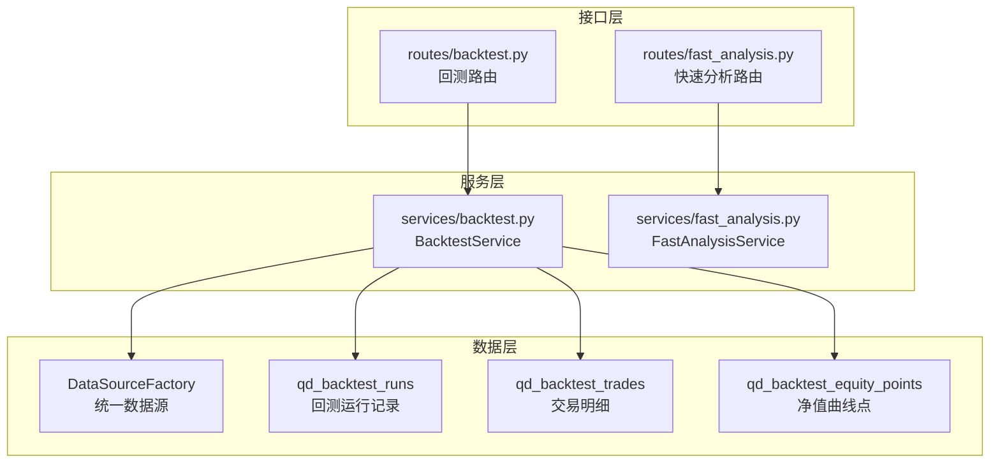
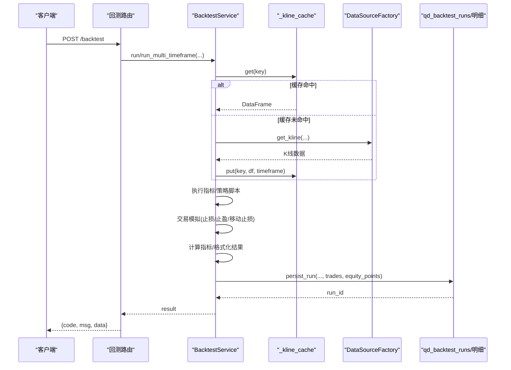
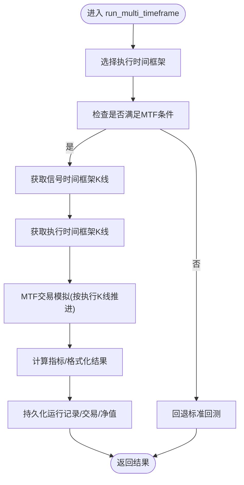
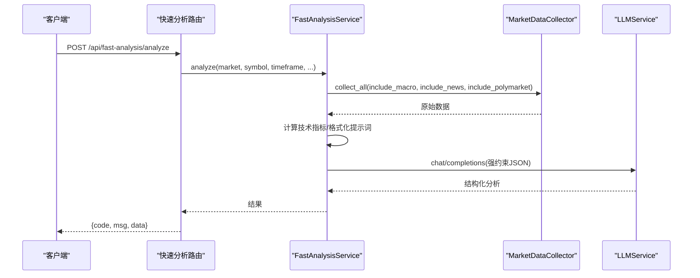
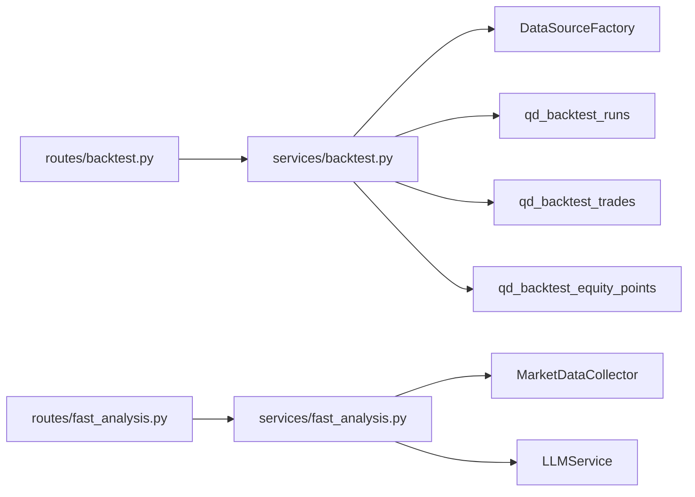

# 回测系统

<cite>
**本文引用的文件**
- [backend_api_python/app/routes/backtest.py](file://backend_api_python/app/routes/backtest.py)
- [backend_api_python/app/services/backtest.py](file://backend_api_python/app/services/backtest.py)
- [backend_api_python/app/routes/fast_analysis.py](file://backend_api_python/app/routes/fast_analysis.py)
- [backend_api_python/app/services/fast_analysis.py](file://backend_api_python/app/services/fast_analysis.py)
</cite>

## 目录
1. [引言](#引言)
2. [项目结构](#项目结构)
3. [核心组件](#核心组件)
4. [架构总览](#架构总览)
5. [详细组件分析](#详细组件分析)
6. [依赖关系分析](#依赖关系分析)
7. [性能考量](#性能考量)
8. [故障排查指南](#故障排查指南)
9. [结论](#结论)
10. [附录](#附录)

## 引言
本文件面向回测系统的使用者与维护者，系统化阐述后端回测引擎的架构设计、多时间框架高精度回测、策略脚本运行、交易模拟、指标计算与结果持久化流程；并结合快速分析（Fast Analysis）能力，给出可视化报告、统计分析与性能评估的实践路径。文档同时覆盖参数配置、数据范围设置、结果导出、并行与内存管理策略、以及与策略开发的反馈闭环。

## 项目结构
回测系统主要由三层构成：
- 接口层（Flask 蓝图路由）：负责请求解析、鉴权、参数校验、调用服务层并返回结果。
- 服务层（BacktestService/FastAnalysisService）：封装回测引擎、策略执行、K线获取与缓存、交易模拟、指标计算、结果格式化与持久化。
- 数据层（DataSourceFactory、数据库表）：统一数据源访问、回测运行记录与明细持久化。

图表来源
- [backend_api_python/app/routes/backtest.py:149-376](file://backend_api_python/app/routes/backtest.py#L149-L376)
- [backend_api_python/app/services/backtest.py:64-142](file://backend_api_python/app/services/backtest.py#L64-L142)
- [backend_api_python/app/routes/fast_analysis.py:113-304](file://backend_api_python/app/routes/fast_analysis.py#L113-L304)
- [backend_api_python/app/services/fast_analysis.py:186-233](file://backend_api_python/app/services/fast_analysis.py#L186-L233)

章节来源
- [backend_api_python/app/routes/backtest.py:149-376](file://backend_api_python/app/routes/backtest.py#L149-L376)
- [backend_api_python/app/services/backtest.py:64-142](file://backend_api_python/app/services/backtest.py#L64-L142)

## 核心组件
- 回测路由（/backtest、/backtest/history、/backtest/get、/backtest/precision-info）
  - 提供回测请求入口、历史查询、详情查询、精度建议接口。
  - 支持标准回测与多时间框架（MTF）高精度回测切换。
- 回测服务（BacktestService）
  - 统一K线缓存、信号执行、交易模拟（含止损/止盈/移动止损）、指标计算、结果格式化与持久化。
  - 支持策略脚本运行与快照回测。
- 快速分析路由（/analyze、/history、/performance、/similar-patterns 等）
  - 提供统一数据采集、一次性LLM分析、历史检索与相似模式匹配。
- 快速分析服务（FastAnalysisService）
  - 封装数据采集器、技术指标计算、新闻与宏观因子整合、LLM提示工程与结构化解析。

章节来源
- [backend_api_python/app/routes/backtest.py:112-376](file://backend_api_python/app/routes/backtest.py#L112-L376)
- [backend_api_python/app/services/backtest.py:444-668](file://backend_api_python/app/services/backtest.py#L444-L668)
- [backend_api_python/app/routes/fast_analysis.py:113-701](file://backend_api_python/app/routes/fast_analysis.py#L113-L701)
- [backend_api_python/app/services/fast_analysis.py:186-761](file://backend_api_python/app/services/fast_analysis.py#L186-L761)

## 架构总览
回测系统采用“路由-服务-数据源-持久化”的分层架构。关键特性包括：
- 多时间框架高精度回测：在加密货币市场根据回测区间自动选择1分钟或5分钟执行时间框架，提升日内模拟精度。
- 交易模拟引擎：基于K线执行时间序列的精确模拟，支持止损、止盈、移动止损、滑点与手续费。
- 指标与策略：内置常用技术指标函数，支持用户脚本与策略脚本两种输入方式。
- 结果持久化：将回测运行记录、交易明细、净值曲线点落库，便于历史查询与二次分析。

图表来源
- [backend_api_python/app/routes/backtest.py:149-376](file://backend_api_python/app/routes/backtest.py#L149-L376)
- [backend_api_python/app/services/backtest.py:25-61](file://backend_api_python/app/services/backtest.py#L25-L61)
- [backend_api_python/app/services/backtest.py:1724-1890](file://backend_api_python/app/services/backtest.py#L1724-L1890)

## 详细组件分析

### 回测路由与参数校验
- 精度建议接口：根据市场类型与起止日期，返回推荐执行时间框架与估算K线数量，指导用户合理设置回测窗口。
- 标准回测接口：接收指标代码或指标ID、标的、市场、时间框架、起止日期、初始资金、手续费、滑点、杠杆、交易方向、策略配置等；支持可选的持久化开关。
- 多时间框架回测：当启用且为加密货币市场、信号时间框架大于执行时间框架、且满足执行时机与无扩展规则限制时，自动选择1分钟或5分钟执行时间框架进行高精度模拟。
- 历史与详情：支持分页查询回测历史、按runId获取详情，便于结果复盘与导出。

章节来源
- [backend_api_python/app/routes/backtest.py:112-147](file://backend_api_python/app/routes/backtest.py#L112-L147)
- [backend_api_python/app/routes/backtest.py:149-376](file://backend_api_python/app/routes/backtest.py#L149-L376)
- [backend_api_python/app/routes/backtest.py:378-448](file://backend_api_python/app/routes/backtest.py#L378-L448)

### BacktestService：回测引擎核心
- K线缓存：基于时间框架的TTL缓存，避免重复拉取外部数据；超过容量时淘汰最旧条目。
- 执行时间框架选择：根据回测区间天数与市场类型，自动选择1分钟或5分钟执行时间框架，并返回精度信息。
- 信号执行与索引对齐：支持4路信号与简化buy/sell信号，自动对齐索引，保证信号与K线时间序列一致。
- 交易模拟（MTF）：按执行时间框架逐K推进，沿K线内价格路径判断触发顺序，支持止损、止盈、移动止损、滑点与手续费；支持“双向模式”自动对冲相反头寸。
- 指标计算与结果格式化：计算总收益、年化收益、胜率、总交易数、最大回撤、夏普比率、盈亏比等；格式化交易明细与净值曲线点。
- 结果持久化：将回测运行记录、交易明细、净值曲线点写入数据库，支持历史查询与二次分析。

图表来源
- [backend_api_python/app/services/backtest.py:444-668](file://backend_api_python/app/services/backtest.py#L444-L668)
- [backend_api_python/app/services/backtest.py:670-1456](file://backend_api_python/app/services/backtest.py#L670-L1456)
- [backend_api_python/app/services/backtest.py:1640-1710](file://backend_api_python/app/services/backtest.py#L1640-L1710)

章节来源
- [backend_api_python/app/services/backtest.py:25-61](file://backend_api_python/app/services/backtest.py#L25-L61)
- [backend_api_python/app/services/backtest.py:170-224](file://backend_api_python/app/services/backtest.py#L170-L224)
- [backend_api_python/app/services/backtest.py:444-668](file://backend_api_python/app/services/backtest.py#L444-L668)
- [backend_api_python/app/services/backtest.py:670-1456](file://backend_api_python/app/services/backtest.py#L670-L1456)
- [backend_api_python/app/services/backtest.py:1640-1710](file://backend_api_python/app/services/backtest.py#L1640-L1710)

### 快速分析（Fast Analysis）：高吞吐一次性分析
- 数据采集：统一使用市场数据采集器，聚合价格、K线、技术指标、基本面、宏观、新闻、预测市场等多维数据。
- 一次性LLM分析：通过强约束提示词，要求模型输出结构化JSON，包含决策、置信度、摘要、分析要点、风险、目标价等。
- 历史与相似模式：提供历史分析检索、相似模式匹配，辅助策略开发与回测参数优化。

图表来源
- [backend_api_python/app/routes/fast_analysis.py:113-304](file://backend_api_python/app/routes/fast_analysis.py#L113-L304)
- [backend_api_python/app/services/fast_analysis.py:186-761](file://backend_api_python/app/services/fast_analysis.py#L186-L761)

章节来源
- [backend_api_python/app/routes/fast_analysis.py:113-304](file://backend_api_python/app/routes/fast_analysis.py#L113-L304)
- [backend_api_python/app/services/fast_analysis.py:203-356](file://backend_api_python/app/services/fast_analysis.py#L203-L356)
- [backend_api_python/app/services/fast_analysis.py:486-761](file://backend_api_python/app/services/fast_analysis.py#L486-L761)

## 依赖关系分析
- 路由依赖服务：回测路由依赖BacktestService；快速分析路由依赖FastAnalysisService。
- 服务依赖数据源：BacktestService依赖DataSourceFactory获取K线数据；FastAnalysisService依赖MarketDataCollector。
- 持久化依赖：BacktestService依赖数据库表qd_backtest_runs/qd_backtest_trades/qd_backtest_equity_points进行结果落库。
- 并发与内存：BacktestService内部使用线程锁保护K线缓存；快速分析路由使用内存锁避免重复计费。

图表来源
- [backend_api_python/app/routes/backtest.py:12-23](file://backend_api_python/app/routes/backtest.py#L12-L23)
- [backend_api_python/app/services/backtest.py:17-22](file://backend_api_python/app/services/backtest.py#L17-L22)
- [backend_api_python/app/routes/fast_analysis.py:12-18](file://backend_api_python/app/routes/fast_analysis.py#L12-L18)
- [backend_api_python/app/services/fast_analysis.py:18-22](file://backend_api_python/app/services/fast_analysis.py#L18-L22)

章节来源
- [backend_api_python/app/routes/backtest.py:12-23](file://backend_api_python/app/routes/backtest.py#L12-L23)
- [backend_api_python/app/services/backtest.py:17-22](file://backend_api_python/app/services/backtest.py#L17-L22)
- [backend_api_python/app/routes/fast_analysis.py:12-18](file://backend_api_python/app/routes/fast_analysis.py#L12-L18)
- [backend_api_python/app/services/fast_analysis.py:18-22](file://backend_api_python/app/services/fast_analysis.py#L18-L22)

## 性能考量
- 多时间框架高精度回测
  - 仅在加密货币市场、且回测区间不超过阈值时启用1分钟或5分钟执行时间框架，避免过大数据量导致的性能问题。
  - 自动降级：若无法获取更高精度K线或不满足条件，则回退至标准回测。
- K线缓存
  - 基于时间框架的TTL缓存，减少重复拉取；容量上限淘汰最旧项，避免内存膨胀。
- 交易模拟优化
  - 信号队列按有效时间排序，逐K推进，沿K线内价格路径判断触发顺序，兼顾精度与性能。
  - 对于双向模式，自动对冲相反头寸，减少无效交易。
- 数据范围与窗口调整
  - 若上游数据不足或时间范围不匹配，系统会自动调整有效回测区间并在结果中附加实际区间信息，避免用户误判。
- 快速分析
  - 一次性LLM调用，强约束提示词，减少上下文长度与重复推理，提升吞吐。

章节来源
- [backend_api_python/app/services/backtest.py:170-224](file://backend_api_python/app/services/backtest.py#L170-L224)
- [backend_api_python/app/services/backtest.py:25-61](file://backend_api_python/app/services/backtest.py#L25-L61)
- [backend_api_python/app/services/backtest.py:1724-1890](file://backend_api_python/app/services/backtest.py#L1724-L1890)
- [backend_api_python/app/routes/fast_analysis.py:113-304](file://backend_api_python/app/routes/fast_analysis.py#L113-L304)

## 故障排查指南
- 回测失败
  - 现象：返回错误信息或无交易执行。
  - 排查要点：
    - 指标代码是否生成buy/sell或4路信号列；索引是否与K线对齐。
    - 信号队列是否为空；执行时间框架与信号时间框架是否匹配。
    - 资金是否不足以下单；是否提前爆仓。
    - 上游K线数据是否为空或时间范围不匹配。
  - 参考定位：
    - 信号队列构建与调试日志、空信号队列处理、索引对齐与修正。
- 多时间框架回测未生效
  - 现象：仍使用标准回测。
  - 排查要点：
    - 是否为加密货币市场；区间是否超过阈值；是否存在扩展规则或执行时机不支持。
- 快速分析失败
  - 现象：返回错误或需要退款。
  - 排查要点：
    - 计费扣费是否成功；失败后是否触发异步退款；内存锁是否被占用导致重复提交。
- 结果导出与历史查询
  - 使用历史查询接口与详情接口获取runId，结合持久化记录进行二次导出与分析。

章节来源
- [backend_api_python/app/services/backtest.py:817-908](file://backend_api_python/app/services/backtest.py#L817-L908)
- [backend_api_python/app/services/backtest.py:904-1456](file://backend_api_python/app/services/backtest.py#L904-L1456)
- [backend_api_python/app/routes/backtest.py:378-448](file://backend_api_python/app/routes/backtest.py#L378-L448)
- [backend_api_python/app/routes/fast_analysis.py:25-84](file://backend_api_python/app/routes/fast_analysis.py#L25-L84)

## 结论
回测系统通过“路由-服务-数据源-持久化”的清晰分层，提供了从请求接入到结果落库的完整链路。其核心优势在于：
- 多时间框架高精度回测，显著提升日内策略的模拟精度；
- 完整的交易模拟引擎，覆盖止损、止盈、移动止损、滑点与手续费；
- 统一的数据采集与一次性LLM分析能力，支撑快速洞察与策略迭代；
- 结果持久化与历史查询，形成策略开发的反馈闭环。

## 附录

### 回测参数配置与使用建议
- 关键参数
  - 指标代码或指标ID、标的、市场、时间框架、起止日期、初始资金、手续费、滑点、杠杆、交易方向、策略配置、是否持久化。
- 建议
  - 加密货币日内策略优先使用MTF（1分钟/5分钟）以提升精度；长周期策略可使用标准回测。
  - 交易方向按需选择long/short/both；双向模式可自动对冲相反头寸。
  - 策略配置中的风控参数（止损、止盈、移动止损）应与杠杆匹配，避免过早爆仓。

章节来源
- [backend_api_python/app/routes/backtest.py:149-376](file://backend_api_python/app/routes/backtest.py#L149-L376)
- [backend_api_python/app/services/backtest.py:670-1456](file://backend_api_python/app/services/backtest.py#L670-L1456)

### 数据范围设置与精度建议
- 系统根据起止日期与时间框架自动推荐执行时间框架与估算K线数量，避免超限。
- 若上游数据不足，系统会自动调整有效回测区间并在结果中附加实际区间信息。

章节来源
- [backend_api_python/app/routes/backtest.py:112-147](file://backend_api_python/app/routes/backtest.py#L112-L147)
- [backend_api_python/app/services/backtest.py:170-224](file://backend_api_python/app/services/backtest.py#L170-L224)
- [backend_api_python/app/services/backtest.py:1868-1882](file://backend_api_python/app/services/backtest.py#L1868-L1882)

### 回测结果可视化与统计分析
- 结果字段：总收益、年化收益、胜率、总交易数、最大回撤、夏普比率、盈亏比、交易明细、净值曲线点。
- 可视化建议：基于净值曲线点绘制净值走势，叠加交易标记点；按交易明细统计胜率与盈亏分布。
- 与策略开发的反馈：利用历史查询与详情接口导出结果，结合快速分析的历史与相似模式，持续优化策略参数与信号质量。

章节来源
- [backend_api_python/app/services/backtest.py:1640-1710](file://backend_api_python/app/services/backtest.py#L1640-L1710)
- [backend_api_python/app/routes/backtest.py:378-448](file://backend_api_python/app/routes/backtest.py#L378-L448)
- [backend_api_python/app/routes/fast_analysis.py:454-701](file://backend_api_python/app/routes/fast_analysis.py#L454-L701)

### 快速分析（实时洞察）与增量回测
- 快速分析：一次性LLM分析，输出结构化建议，适合快速洞察与参数初筛。
- 增量回测：可在快速分析基础上，针对特定参数区间进行小范围网格测试，逐步收敛最优参数组合。

章节来源
- [backend_api_python/app/routes/fast_analysis.py:113-304](file://backend_api_python/app/routes/fast_analysis.py#L113-L304)
- [backend_api_python/app/services/fast_analysis.py:486-761](file://backend_api_python/app/services/fast_analysis.py#L486-L761)