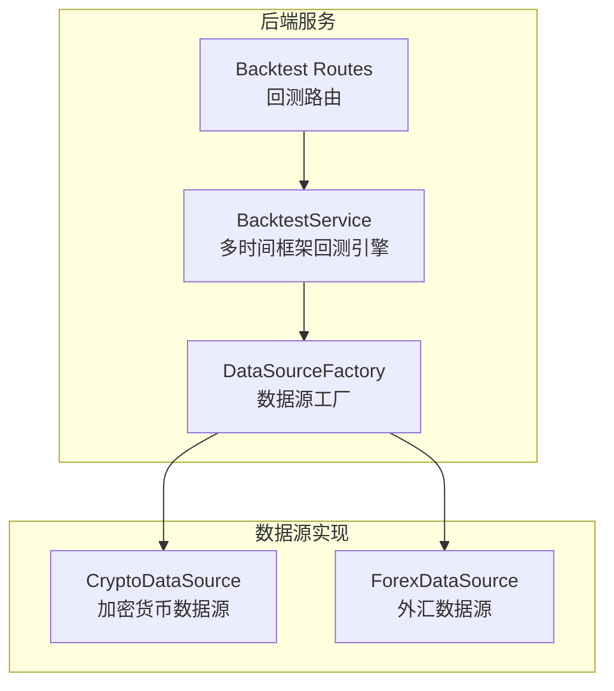
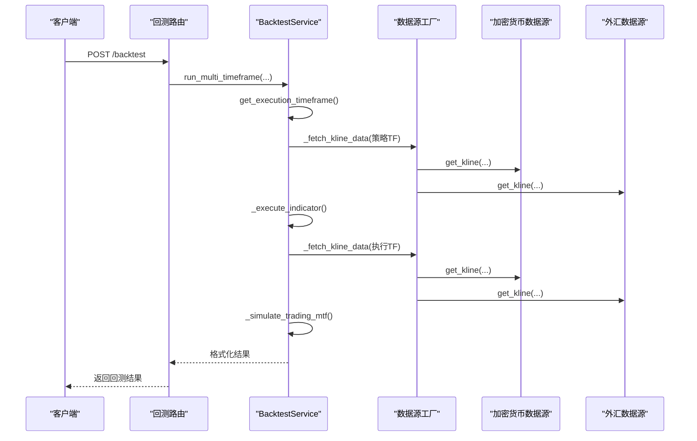
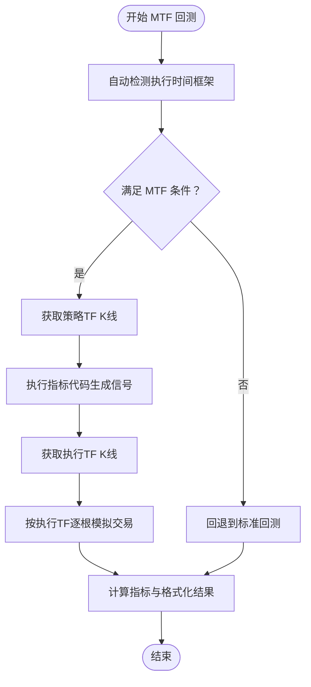
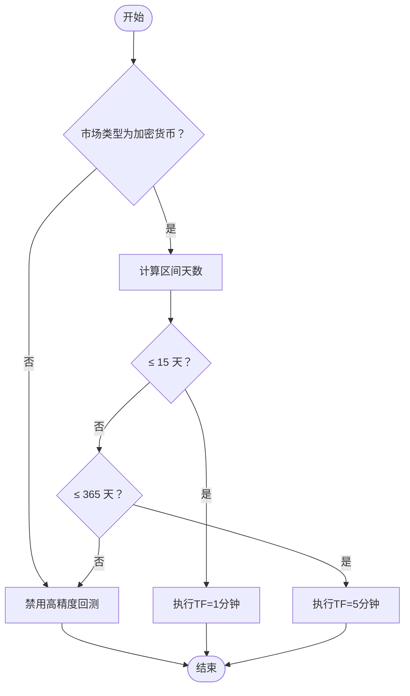
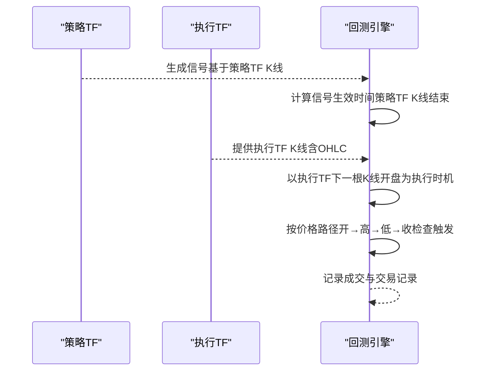
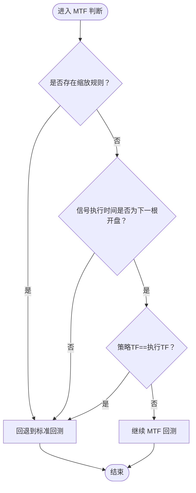
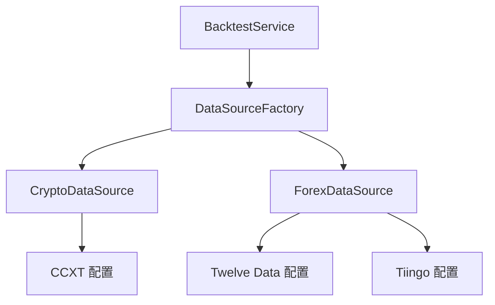

# 多时间框架支持

<cite>
**本文档引用的文件**
- [backtest.py](file://backend_api_python/app/services/backtest.py)
- [backtest.py](file://backend_api_python/app/routes/backtest.py)
- [crypto.py](file://backend_api_python/app/data_sources/crypto.py)
- [forex.py](file://backend_api_python/app/data_sources/forex.py)
- [factory.py](file://backend_api_python/app/data_sources/factory.py)
- [data_sources.py](file://backend_api_python/app/config/data_sources.py)
</cite>

## 目录
1. [简介](#简介)
2. [项目结构](#项目结构)
3. [核心组件](#核心组件)
4. [架构总览](#架构总览)
5. [详细组件分析](#详细组件分析)
6. [依赖分析](#依赖分析)
7. [性能考量](#性能考量)
8. [故障排查指南](#故障排查指南)
9. [结论](#结论)
10. [附录](#附录)

## 简介
本文件系统性阐述 QuantDinger 项目中的多时间框架（Multi-Timeframe，简称 MTF）回测支持。内容涵盖：
- 多时间框架回测的核心概念与适用场景
- 信号时间框架与执行时间框架的协调机制
- 1 分钟与 5 分钟精度的选择策略与自动检测算法
- 缩放规则（scale rules）对 MTF 的影响与限制
- 不同市场类型下的配置建议与最佳实践
- 精度评估、误差分析与结果验证方法
- 回退机制（fallback）的触发条件与处理逻辑
- 调试技巧与性能监控方法

## 项目结构
多时间框架回测能力主要由后端服务模块提供，涉及回测引擎、数据源抽象与路由入口：
- 回测服务：负责信号生成、执行时间框架选择、MTF 执行与回退、结果格式化
- 数据源：为不同市场提供 K 线数据获取与时间周期映射
- 路由：对外提供回测 API，接收参数并调用回测服务

**图表来源**
- [backtest.py](file://backend_api_python/app/services/backtest.py)
- [factory.py](file://backend_api_python/app/data_sources/factory.py)
- [crypto.py](file://backend_api_python/app/data_sources/crypto.py)
- [forex.py](file://backend_api_python/app/data_sources/forex.py)

**章节来源**
- [backtest.py](file://backend_api_python/app/services/backtest.py)
- [backtest.py](file://backend_api_python/app/routes/backtest.py)
- [factory.py](file://backend_api_python/app/data_sources/factory.py)

## 核心组件
- 多时间框架回测服务（BacktestService）
  - 提供 MTF 回测入口、执行时间框架自动检测、信号与执行数据的双轨处理、回退机制与结果封装
- 数据源工厂（DataSourceFactory）
  - 统一管理各市场数据源，提供 K 线与实时报价获取
- 加密货币数据源（CryptoDataSource）
  - 基于 CCXT 的多交易所适配，支持时间周期映射与分页拉取
- 外汇数据源（ForexDataSource）
  - 三级降级：Twelve Data → Tiingo → yfinance，支持时间周期映射与聚合

**章节来源**
- [backtest.py](file://backend_api_python/app/services/backtest.py)
- [factory.py](file://backend_api_python/app/data_sources/factory.py)
- [crypto.py](file://backend_api_python/app/data_sources/crypto.py)
- [forex.py](file://backend_api_python/app/data_sources/forex.py)

## 架构总览
多时间框架回测的整体流程如下：
1. 路由接收请求，校验参数与时间范围
2. 回测服务根据回测区间与市场类型，自动选择执行时间框架（1 分钟或 5 分钟）
3. 若满足 MTF 条件，则使用策略时间框架生成信号，使用执行时间框架进行高精度模拟
4. 若不满足 MTF 条件，则回退到标准回测
5. 结果包含精度信息、执行假设与回测指标

**图表来源**
- [backtest.py](file://backend_api_python/app/services/backtest.py)
- [backtest.py](file://backend_api_python/app/routes/backtest.py)
- [factory.py](file://backend_api_python/app/data_sources/factory.py)
- [crypto.py](file://backend_api_python/app/data_sources/crypto.py)
- [forex.py](file://backend_api_python/app/data_sources/forex.py)

## 详细组件分析

### 1. 多时间框架回测核心流程
- 信号时间框架（策略 TF）：用于生成买卖信号
- 执行时间框架（执行 TF）：1 分钟或 5 分钟，用于高精度模拟成交
- 协调机制：
  - 信号在策略 TF 的 K 线结束后确认
  - 执行在执行 TF 的下一个开盘价进行（避免前瞻偏差）
  - 使用每根执行 TF K 线内的价格路径（开盘→最高→最低→收盘）确定触发顺序

**图表来源**
- [backtest.py](file://backend_api_python/app/services/backtest.py)

**章节来源**
- [backtest.py](file://backend_api_python/app/services/backtest.py)

### 2. 执行时间框架自动检测算法
- 输入：回测起止日期、市场类型
- 输出：推荐的执行时间框架（'1m' 或 '5m'）与精度信息
- 策略：
  - 仅加密货币市场支持高精度回测
  - 区间 ≤ 15 天：推荐 1 分钟
  - 区间 15 天到 1 年：推荐 5 分钟
  - 超过 1 年：不支持高精度回测，返回禁用状态

**图表来源**
- [backtest.py](file://backend_api_python/app/services/backtest.py)

**章节来源**
- [backtest.py](file://backend_api_python/app/services/backtest.py)

### 3. 信号与执行时间框架的协调机制
- 信号确认时间：策略 TF 的 K 线结束时刻
- 执行时间：执行 TF 下一根 K 线的开盘价（避免前瞻偏差）
- 价格路径触发：在执行 TF 的 K 线内，按“开盘→最高→最低→收盘”的顺序检查触发条件，确保公平性

**图表来源**
- [backtest.py](file://backend_api_python/app/services/backtest.py)

**章节来源**
- [backtest.py](file://backend_api_python/app/services/backtest.py)

### 4. 缩放规则（Scale Rules）对 MTF 的影响与限制
- MTF 回测当前不支持缩放规则（scale rules），原因：
  - 缩放规则与信号时间框架存在冲突：缩放通常在信号确认后执行，但在 MTF 中信号在策略 TF 确认，执行在执行 TF，两者时间轴不一致
  - 执行时间框架的“同根 K 线”冲突：主信号与缩放动作不能在同一根执行 TF K 线同时发生
- 回退条件：
  - 存在缩放规则（趋势加仓、定投加仓、趋势减仓、逆势减仓）
  - 信号执行时间不在“下一根开盘”模式
  - 策略 TF 与执行 TF 相等（无精度提升）

**图表来源**
- [backtest.py](file://backend_api_python/app/services/backtest.py)

**章节来源**
- [backtest.py](file://backend_api_python/app/services/backtest.py)

### 5. 不同市场类型的配置建议与最佳实践
- 加密货币（推荐）
  - 支持高精度回测（1 分钟或 5 分钟）
  - 建议在短期（≤15 天）使用 1 分钟以获得更高精度
  - 建议在中期（15 天到 1 年）使用 5 分钟以平衡性能与精度
- 外汇
  - 支持时间周期有限（1 分钟在部分数据源需付费）
  - 建议优先使用 5 分钟或更高周期，避免高频数据的限制
- 股票/期货/其他
  - 本项目未提供专门的数据源实现，建议通过数据源工厂扩展或使用现有数据源

**章节来源**
- [forex.py](file://backend_api_python/app/data_sources/forex.py)
- [crypto.py](file://backend_api_python/app/data_sources/crypto.py)
- [factory.py](file://backend_api_python/app/data_sources/factory.py)

### 6. 精度评估、误差分析与结果验证方法
- 精度评估维度
  - 信号与执行时间框架的匹配度：检查信号生效时间与执行时间是否一致
  - 价格路径触发的公平性：确保在执行 TF K 线内按开→高→低→收顺序检查
  - 回撤与胜率：对比 MTF 与标准回测的回撤与胜率差异
- 误差来源
  - 数据源缺失：执行 TF 数据不可用时回退到标准回测
  - 缩放规则：存在缩放规则时回退到标准回测
  - 信号执行时间：非“下一根开盘”模式时回退到标准回测
- 验证方法
  - 对比相同参数下 MTF 与标准回测的结果
  - 检查 precision_info 与 executionAssumptions 中的回退原因
  - 核对交易记录的时间与价格是否符合价格路径触发逻辑

**章节来源**
- [backtest.py](file://backend_api_python/app/services/backtest.py)

### 7. 回退机制（Fallback）的触发条件与处理逻辑
- 触发条件
  - 禁用 MTF 或不支持 MTF
  - 执行 TF 数据不可用
  - 存在缩放规则
  - 信号执行时间不在“下一根开盘”模式
  - 策略 TF 与执行 TF 相等（无精度提升）
- 处理逻辑
  - 记录回退原因（fallback_reason）
  - 使用标准回测流程生成结果
  - 在 precision_info 中标注回退原因与消息
  - 在 executionAssumptions 中标记 mtfRequested 与 mtfActive

**章节来源**
- [backtest.py](file://backend_api_python/app/services/backtest.py)

### 8. 调试技巧与性能监控方法
- 调试技巧
  - 查看日志：关注信号队列构建、执行进度、回退原因等关键日志
  - 核对索引一致性：确保信号序列与策略 TF 的索引一致
  - 检查价格路径：确认每根执行 TF K 线的价格路径与触发顺序
  - 验证回退：检查 precision_info 与 executionAssumptions 中的回退标记
- 性能监控
  - K 线缓存：利用 _KlineCache 减少重复外部 API 调用
  - 时间范围限制：根据时间周期限制最大回测范围，避免超大数据集
  - 执行 TF 选择：根据区间天数自动选择 1 分钟或 5 分钟，平衡性能与精度

**章节来源**
- [backtest.py](file://backend_api_python/app/services/backtest.py)

## 依赖分析
- 回测服务依赖数据源工厂，数据源工厂根据市场类型返回具体数据源
- 加密货币数据源基于 CCXT，支持多交易所与时间周期映射
- 外汇数据源采用三级降级策略，确保在不同 API 限制下的稳定性

**图表来源**
- [backtest.py](file://backend_api_python/app/services/backtest.py)
- [factory.py](file://backend_api_python/app/data_sources/factory.py)
- [crypto.py](file://backend_api_python/app/data_sources/crypto.py)
- [forex.py](file://backend_api_python/app/data_sources/forex.py)
- [data_sources.py](file://backend_api_python/app/config/data_sources.py)

**章节来源**
- [factory.py](file://backend_api_python/app/data_sources/factory.py)
- [crypto.py](file://backend_api_python/app/data_sources/crypto.py)
- [forex.py](file://backend_api_python/app/data_sources/forex.py)
- [data_sources.py](file://backend_api_python/app/config/data_sources.py)

## 性能考量
- K 线缓存：_KlineCache 通过 TTL 与容量控制，减少重复请求
- 时间范围估算：根据区间天数与时间周期估算 K 线数量，避免超大数据集
- 执行 TF 选择：1 分钟回测上限为 15 天，5 分钟回测上限为 365 天，超出则禁用高精度回测
- 数据源限制：部分数据源对 1 分钟数据有付费或限流限制，需合理规划回测范围

**章节来源**
- [backtest.py](file://backend_api_python/app/services/backtest.py)

## 故障排查指南
- 无信号或信号为空
  - 检查指标代码是否正确生成 buy/sell 或 open_long/close_long/open_short/close_short
  - 确认信号序列索引与策略 TF 一致
- 无交易执行
  - 检查信号队列是否为空或索引不匹配
  - 确认信号生效时间与执行时间框架是否一致
- 回退到标准回测
  - 查看 precision_info 中的 fallback_reason
  - 检查是否存在缩放规则或信号执行时间不符合要求
- 数据不可用
  - 检查执行 TF 的数据拉取是否成功
  - 关注数据源的 API 限制与时间周期支持情况

**章节来源**
- [backtest.py](file://backend_api_python/app/services/backtest.py)

## 结论
多时间框架回测通过“策略 TF 生成信号 + 执行 TF 高精度模拟”的方式，在保证公平性的前提下提升了回测精度。系统实现了自动执行 TF 选择、严格的回退机制与完善的日志与诊断信息，适用于加密货币等高频市场。对于存在缩放规则或非“下一根开盘”执行时间的场景，系统会自动回退到标准回测，确保结果的可靠性。

## 附录
- API 定义（节选）
  - GET /backtest/precision-info：获取回测精度信息（推荐执行 TF 与预估 K 线数量）
  - POST /backtest：运行回测，支持 enableMtf 参数控制是否启用 MTF

**章节来源**
- [backtest.py](file://backend_api_python/app/routes/backtest.py)