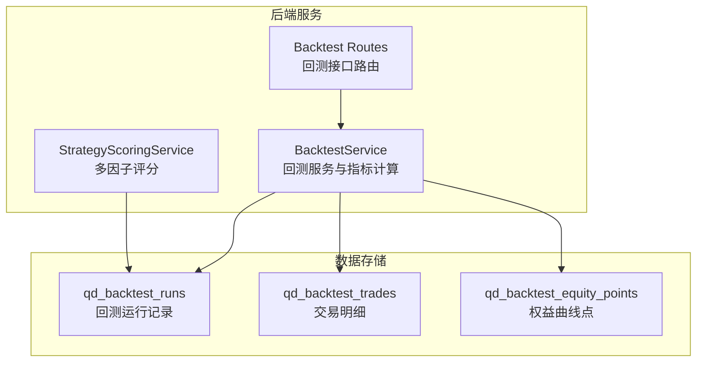
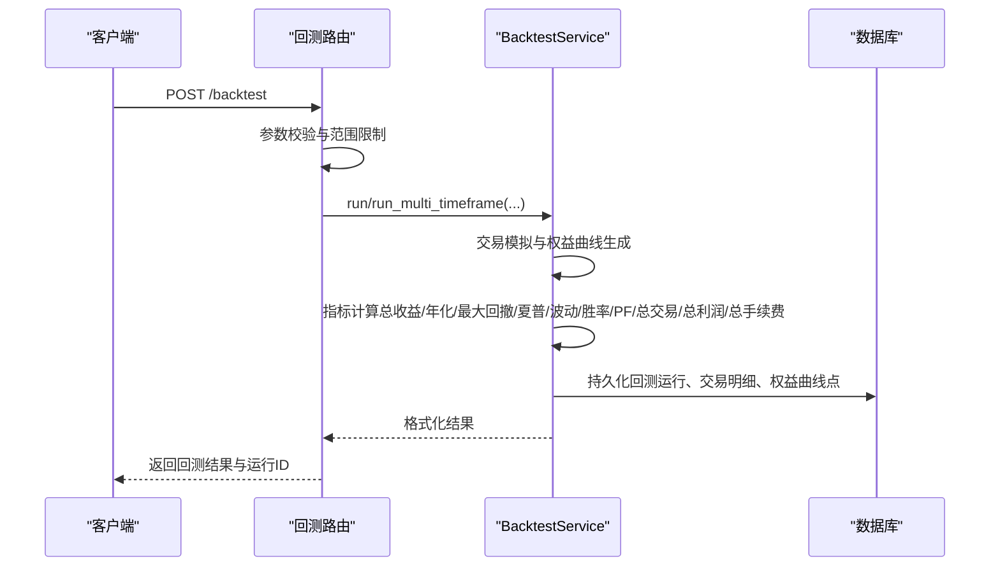
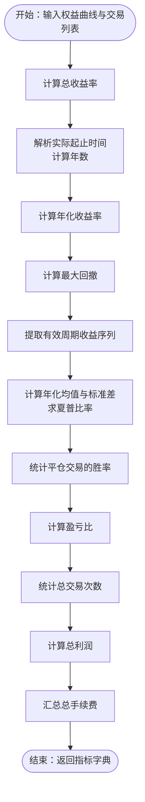
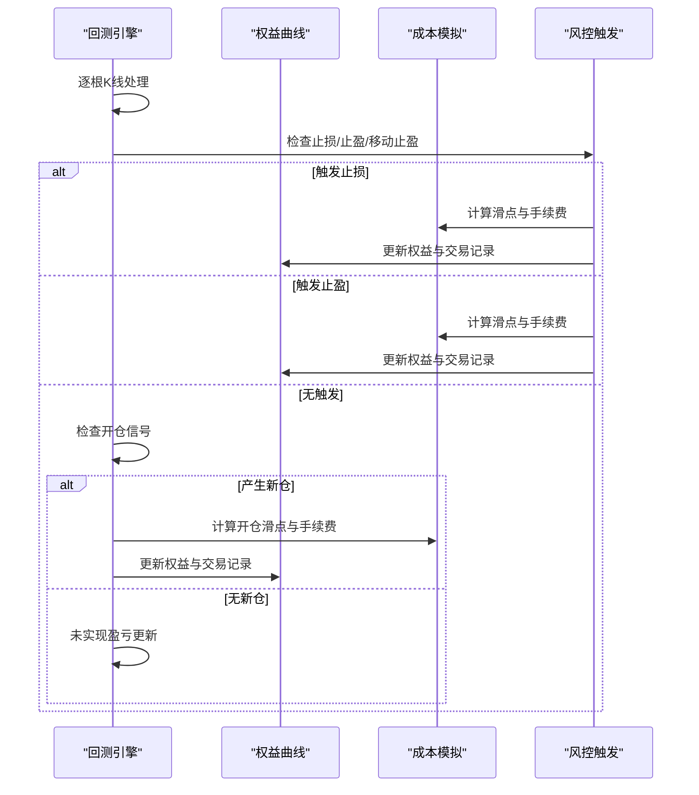
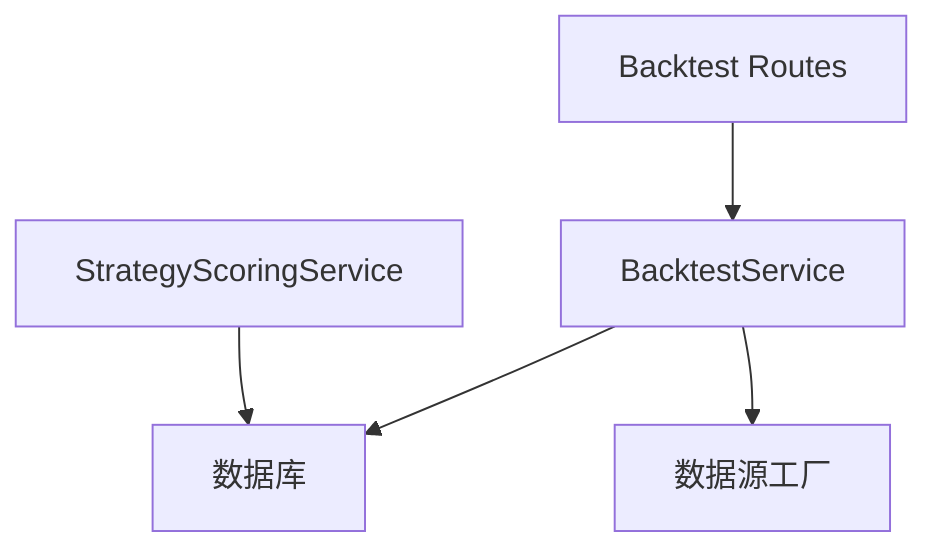

# 性能指标计算

<cite>
**本文档引用的文件**
- [backtest.py](file://backend_api_python/app/services/backtest.py)
- [backtest.py](file://backend_api_python/app/routers/backtest.py)
- [scoring.py](file://backend_api_python/app/services/experiment/scoring.py)
- [init.sql](file://backend_api_python/migrations/init.sql)
</cite>

## 目录
1. [简介](#简介)
2. [项目结构](#项目结构)
3. [核心组件](#核心组件)
4. [架构概览](#架构概览)
5. [详细组件分析](#详细组件分析)
6. [依赖分析](#依赖分析)
7. [性能考量](#性能考量)
8. [故障排除指南](#故障排除指南)
9. [结论](#结论)
10. [附录](#附录)

## 简介
本技术文档聚焦于量化交易系统中的回测性能指标计算，系统性阐述总收益率、年化收益率、胜率、总交易次数、最大回撤、夏普比率、波动率、收益曲线、交易成本与滑点模拟、不同市场类型的指标调整策略、边界条件处理、异常值检测与数据验证机制，以及指标存储格式与查询优化策略。文档基于实际代码实现，提供可操作的实现路径与可视化图示，帮助开发者与使用者准确理解与应用这些指标。

## 项目结构
回测性能指标相关的核心代码分布在以下模块：
- 回测服务与指标计算：backend_api_python/app/services/backtest.py
- 回测接口路由：backend_api_python/app/routers/backtest.py
- 多因子评分与稳定性评估：backend_api_python/app/services/experiment/scoring.py
- 数据持久化与索引：backend_api_python/migrations/init.sql

**图表来源**
- [backtest.py:460-140](file://backend_api_python/app/services/backtest.py#L460-L140)
- [backtest.py:149-376](file://backend_api_python/app/routers/backtest.py#L149-L376)
- [scoring.py:10-140](file://backend_api_python/app/services/experiment/scoring.py#L10-L140)
- [init.sql:464-525](file://backend_api_python/migrations/init.sql#L464-L525)

**章节来源**
- [backtest.py:1-120](file://backend_api_python/app/services/backtest.py#L1-L120)
- [backtest.py:1-120](file://backend_api_python/app/routers/backtest.py#L1-L120)
- [scoring.py:1-40](file://backend_api_python/app/services/experiment/scoring.py#L1-L40)
- [init.sql:464-525](file://backend_api_python/migrations/init.sql#L464-L525)

## 核心组件
- 回测服务（BacktestService）：负责回测引擎、交易模拟、指标计算、结果格式化与持久化。
- 回测路由（Backtest Routes）：接收前端请求，调用回测服务并返回结果。
- 多因子评分服务（StrategyScoringService）：将回测结果转换为可比较的多因子评分，辅助策略筛选与回归测试。
- 数据持久化：通过数据库表结构存储回测运行、交易明细与权益曲线点，配套索引提升查询效率。

关键职责与边界：
- 指标计算：总收益率、年化收益率、最大回撤、夏普比率、波动率、胜率、总交易次数、总利润、总手续费。
- 收益曲线：按时间序列生成权益曲线，支持多时间框架与高精度回测。
- 成本与滑点：在开平仓与止盈止损触发时模拟佣金与滑点影响。
- 市场类型适配：针对加密货币与传统股票市场的差异进行参数与执行假设调整。
- 存储与查询：标准化字段、索引设计、JSON序列化清理，支持高效检索与分析。

**章节来源**
- [backtest.py:4738-4812](file://backend_api_python/app/services/backtest.py#L4738-L4812)
- [backtest.py:4925-4972](file://backend_api_python/app/services/backtest.py#L4925-L4972)
- [scoring.py:23-75](file://backend_api_python/app/services/experiment/scoring.py#L23-L75)
- [init.sql:464-525](file://backend_api_python/migrations/init.sql#L464-L525)

## 架构概览
回测流程从路由入口开始，经过参数校验与范围限制，调用回测服务执行交易模拟与指标计算，最终将结果持久化到数据库并返回给前端。

**图表来源**
- [backtest.py:149-376](file://backend_api_python/app/routers/backtest.py#L149-L376)
- [backtest.py:460-140](file://backend_api_python/app/services/backtest.py#L460-L140)
- [backtest.py:4738-4972](file://backend_api_python/app/services/backtest.py#L4738-L4972)
- [init.sql:464-525](file://backend_api_python/migrations/init.sql#L464-L525)

## 详细组件分析

### 指标计算组件
BacktestService 提供统一的指标计算接口，涵盖总收益率、年化收益率、最大回撤、夏普比率、波动率、胜率、总交易次数、总利润、总手续费等核心指标。

- 总收益率（totalReturn）
  - 公式：(期末权益 - 初始资本) / 初始资本 × 100%
  - 实现要点：使用权益曲线末尾值与初始资本计算，避免负值导致的误判。
  - 参考路径：[backtest.py:4752-4753](file://backend_api_python/app/services/backtest.py#L4752-L4753)

- 年化收益率（annualReturn）
  - 实现：简单年化 = 总收益 / 年数（基于权益曲线实际起止时间）
  - 边界：若实际天数为0或解析失败，采用请求日期范围；避免除零。
  - 参考路径：[backtest.py:4759-4777](file://backend_api_python/app/services/backtest.py#L4759-L4777)

- 最大回撤（maxDrawdown）
  - 算法：滚动峰值法，计算每个时点相对于历史峰值的百分比回撤，取最大值。
  - 参考路径：[backtest.py:4814-4829](file://backend_api_python/app/services/backtest.py#L4814-L4829)

- 夏普比率（sharpeRatio）
  - 实现：基于周期收益序列，过滤无效值，计算年化均值与标准差，再减去无风险利率后求比值。
  - 年化因子：根据时间周期映射（1m至1W），避免低频数据导致的偏差。
  - 参考路径：[backtest.py:4831-4883](file://backend_api_python/app/services/backtest.py#L4831-L4883)

- 波动率（volatility）
  - 实现：夏普比率中已计算年化标准差，即波动率的年化形式。
  - 参考路径：[backtest.py:4872-4873](file://backend_api_python/app/services/backtest.py#L4872-L4873)

- 胜率（winRate）
  - 定义：平仓交易中盈利交易数占比。
  - 参考路径：[backtest.py:4791-4795](file://backend_api_python/app/services/backtest.py#L4791-L4795)

- 总交易次数（totalTrades）
  - 定义：所有平仓交易的数量。
  - 参考路径：[backtest.py](file://backend_api_python/app/services/backtest.py#L4794)

- 盈亏比（profitFactor）
  - 定义：总盈利 / 绝对总亏损。
  - 参考路径：[backtest.py:4797-4800](file://backend_api_python/app/services/backtest.py#L4797-L4800)

- 总利润（totalProfit）
  - 定义：期末权益 - 初始资本。
  - 参考路径：[backtest.py](file://backend_api_python/app/services/backtest.py#L4787)

- 总手续费（totalCommission）
  - 定义：累计交易手续费。
  - 参考路径：[backtest.py](file://backend_api_python/app/services/backtest.py#L4811)

**图表来源**
- [backtest.py:4738-4812](file://backend_api_python/app/services/backtest.py#L4738-L4812)

**章节来源**
- [backtest.py:4738-4812](file://backend_api_python/app/services/backtest.py#L4738-L4812)

### 收益曲线生成与滑点/成本模拟
BacktestService 在交易模拟过程中实时生成权益曲线，同时在开仓、平仓、止损、止盈、移动止盈等场景中模拟滑点与手续费。

- 权益曲线生成
  - 实时更新：每根K线结束后根据持仓状态计算未实现盈亏，累加至资本形成当前权益。
  - 爆仓处理：当权益降至0时标记爆仓并停止后续回测。
  - 参考路径：[backtest.py:1419-1433](file://backend_api_python/app/services/backtest.py#L1419-L1433)

- 滑点与手续费模拟
  - 开仓/平仓价格：根据方向加入/减去滑点（百分比），随后按成交均价乘以委托量与费率计算手续费。
  - 参考路径：[backtest.py:1237-1280](file://backend_api_python/app/services/backtest.py#L1237-L1280)

- 止损/止盈/移动止盈
  - 止损：按入场价设定百分比阈值，触发后按对应方向的滑点执行平仓。
  - 止盈：固定止盈或移动止盈（激活阈值与跟踪幅度），优先于止损执行。
  - 参考路径：[backtest.py:1027-1227](file://backend_api_python/app/services/backtest.py#L1027-L1227)

**图表来源**
- [backtest.py:936-1433](file://backend_api_python/app/services/backtest.py#L936-L1433)

**章节来源**
- [backtest.py:936-1433](file://backend_api_python/app/services/backtest.py#L936-L1433)

### 不同市场类型的指标调整策略
系统区分加密货币与传统股票市场，在执行时间框架选择、信号时机与参数换算上有所差异：

- 执行时间框架选择
  - 加密货币：支持高精度1分钟与5分钟回测，依据回测区间自动推荐执行时间框架。
  - 传统股票：仅支持标准K线回测，不启用高精度多时间框架模式。
  - 参考路径：[backtest.py:170-224](file://backend_api_python/app/services/backtest.py#L170-L224)

- 风险参数换算
  - 加密货币杠杆：风险阈值（止损/止盈/移动止盈）按杠杆换算，避免保证金口径与价格变动口径混淆。
  - 参考路径：[backtest.py:3705-3709](file://backend_api_python/app/services/backtest.py#L3705-L3709)

- 执行时机
  - 信号确认与执行：支持“同根K线收盘”与“下一根K线开盘”两种执行时机，避免前瞻性偏差。
  - 参考路径：[backtest.py:3766-3770](file://backend_api_python/app/services/backtest.py#L3766-L3770)

**章节来源**
- [backtest.py:170-224](file://backend_api_python/app/services/backtest.py#L170-L224)
- [backtest.py:3705-3709](file://backend_api_python/app/services/backtest.py#L3705-L3709)
- [backtest.py:3766-3770](file://backend_api_python/app/services/backtest.py#L3766-L3770)

### 多因子评分与稳定性评估
StrategyScoringService 将回测结果转换为可比较的多因子评分，便于策略对比与回归测试：

- 组件评分
  - 收益类：总收益、年化收益
  - 风险类：最大回撤（逆向评分）
  - 风险调整收益：夏普比率
  - 盈利质量：胜率、盈亏比
  - 稳定性：单调性评分（基于权益曲线相邻点变化）
  - 样本量：交易次数
  - 参考路径：[scoring.py:23-42](file://backend_api_python/app/services/experiment/scoring.py#L23-L42)

- 权重与综合评分
  - 默认权重：收益、年化收益、夏普、盈亏比、胜率、最大回撤、稳定性。
  - 样本量惩罚：交易次数小于阈值时降低综合评分。
  - 参考路径：[scoring.py:13-21](file://backend_api_python/app/services/experiment/scoring.py#L13-L21)
  - [scoring.py:49-64](file://backend_api_python/app/services/experiment/scoring.py#L49-L64)

- 稳定性评分
  - 基于权益曲线单调性（连续上涨比例）计算。
  - 参考路径：[scoring.py:95-106](file://backend_api_python/app/services/experiment/scoring.py#L95-L106)

**章节来源**
- [scoring.py:10-140](file://backend_api_python/app/services/experiment/scoring.py#L10-L140)

### 存储格式与查询优化
回测结果以结构化方式持久化，配套索引提升查询效率：

- 表结构
  - qd_backtest_runs：回测运行记录（含市场、符号、时间框架、参数、结果JSON等）
  - qd_backtest_trades：交易明细（按运行ID关联）
  - qd_backtest_equity_points：权益曲线点（按运行ID关联）
  - 参考路径：[init.sql:464-525](file://backend_api_python/migrations/init.sql#L464-L525)

- 索引设计
  - 对用户ID、指标ID、策略ID、运行类型建立索引，加速历史查询与筛选。
  - 对交易与权益点按运行ID建立索引，支持快速定位与聚合。
  - 参考路径：[init.sql:491-525](file://backend_api_python/migrations/init.sql#L491-L525)

- 结果格式化与清洗
  - 指标、权益曲线、交易明细在返回前进行数值清洗（NaN/Inf转0），确保JSON序列化稳定。
  - 权益曲线进行采样压缩（最多保留固定点数），平衡精度与传输体积。
  - 参考路径：[backtest.py:4939-4972](file://backend_api_python/app/services/backtest.py#L4939-L4972)

**章节来源**
- [init.sql:464-525](file://backend_api_python/migrations/init.sql#L464-L525)
- [backtest.py:4925-4972](file://backend_api_python/app/services/backtest.py#L4925-L4972)

## 依赖分析
回测服务与指标计算依赖于交易模拟、K线数据获取、数据库持久化与评分服务。

**图表来源**
- [backtest.py:460-140](file://backend_api_python/app/services/backtest.py#L460-L140)
- [backtest.py:149-376](file://backend_api_python/app/routers/backtest.py#L149-L376)
- [scoring.py:10-140](file://backend_api_python/app/services/experiment/scoring.py#L10-L140)

**章节来源**
- [backtest.py:460-140](file://backend_api_python/app/services/backtest.py#L460-L140)
- [backtest.py:149-376](file://backend_api_python/app/routers/backtest.py#L149-L376)
- [scoring.py:10-140](file://backend_api_python/app/services/experiment/scoring.py#L10-L140)

## 性能考量
- 计算复杂度
  - 指标计算：O(n)，其中n为权益曲线长度；夏普比率涉及收益序列差分与统计，整体仍为线性。
  - 多时间框架回测：在执行时间框架上进行逐K线模拟，时间复杂度与执行K线数量成正比。
- 内存与序列化
  - 权益曲线与交易明细在返回前进行采样与清洗，控制内存占用与网络传输。
- 查询优化
  - 数据库存储与索引设计支持按用户、策略、运行类型快速检索，避免全表扫描。
- 异常与边界
  - 当权益曲线为空或无效时返回空指标字典；对解析失败的时间范围回退到请求范围。
  - 对夏普比率计算中的无效收益序列进行过滤与保护，避免除零与无穷值。

[本节为通用性能讨论，无需具体文件分析]

## 故障排除指南
- 无交易执行
  - 现象：信号队列为空或无交易被记录。
  - 排查：检查指标代码是否正确生成买入/卖出信号，确认信号索引与K线索引匹配。
  - 参考路径：[backtest.py:1437-1454](file://backend_api_python/app/services/backtest.py#L1437-L1454)

- 爆仓与资金归零
  - 现象：权益降至0并停止回测。
  - 排查：检查止损阈值、杠杆与入场金额设置，确认滑点与手续费累积是否导致资金不足。
  - 参考路径：[backtest.py:960-964](file://backend_api_python/app/services/backtest.py#L960-L964)
  - [backtest.py:1128-1132](file://backend_api_python/app/services/backtest.py#L1128-L1132)

- 夏普比率异常
  - 现象：返回0或NaN。
  - 排查：检查收益序列有效性、时间周期映射、无风险利率设置与数值稳定性。
  - 参考路径：[backtest.py:4840-4883](file://backend_api_python/app/services/backtest.py#L4840-L4883)

- 多时间框架回测失败
  - 现象：无法获取执行时间框架数据或回退到标准回测。
  - 排查：确认市场类型支持、数据可用性与信号时机兼容性。
  - 参考路径：[backtest.py:581-609](file://backend_api_python/app/services/backtest.py#L581-L609)

**章节来源**
- [backtest.py:960-964](file://backend_api_python/app/services/backtest.py#L960-L964)
- [backtest.py:1128-1132](file://backend_api_python/app/services/backtest.py#L1128-L1132)
- [backtest.py:1437-1454](file://backend_api_python/app/services/backtest.py#L1437-L1454)
- [backtest.py:581-609](file://backend_api_python/app/services/backtest.py#L581-L609)
- [backtest.py:4840-4883](file://backend_api_python/app/services/backtest.py#L4840-L4883)

## 结论
该系统通过严谨的交易模拟与指标计算，提供了覆盖收益、风险、稳定性与样本量的多维度评估体系。针对不同市场类型的参数换算与执行时机设计，确保了回测结果的准确性与可比性。配合完善的数据库存储与索引策略，实现了高效的回测结果管理与查询。建议在实际应用中结合多因子评分与历史回测对比，持续优化策略参数与风控阈值。

[本节为总结性内容，无需具体文件分析]

## 附录
- 关键实现路径参考
  - 指标计算：[backtest.py:4738-4812](file://backend_api_python/app/services/backtest.py#L4738-L4812)
  - 收益曲线与成本模拟：[backtest.py:936-1433](file://backend_api_python/app/services/backtest.py#L936-L1433)
  - 夏普比率与波动率：[backtest.py:4831-4883](file://backend_api_python/app/services/backtest.py#L4831-L4883)
  - 多因子评分：[scoring.py:23-75](file://backend_api_python/app/services/experiment/scoring.py#L23-L75)
  - 存储与索引：[init.sql:464-525](file://backend_api_python/migrations/init.sql#L464-L525)

[本节为补充信息，无需具体文件分析]