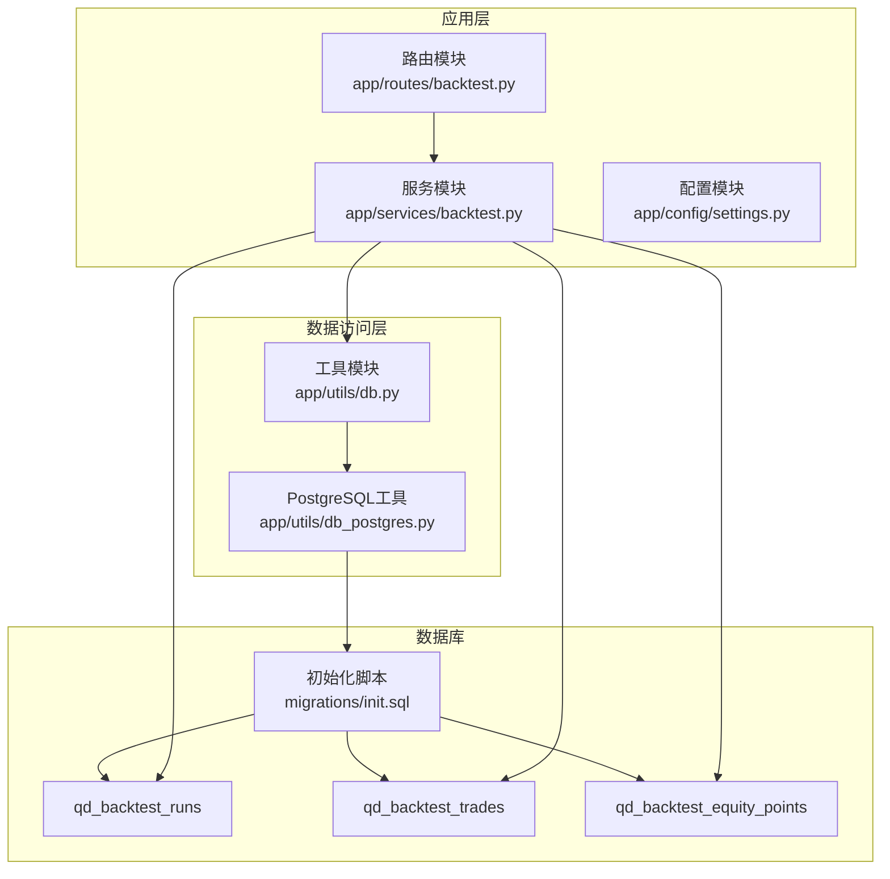
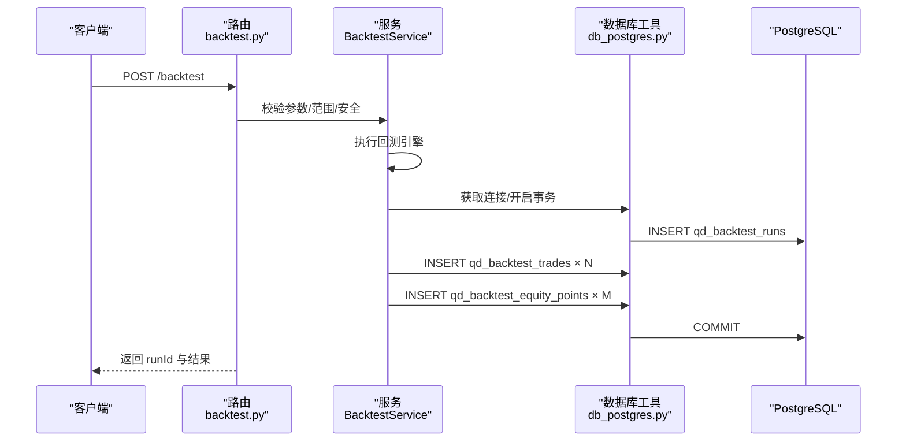
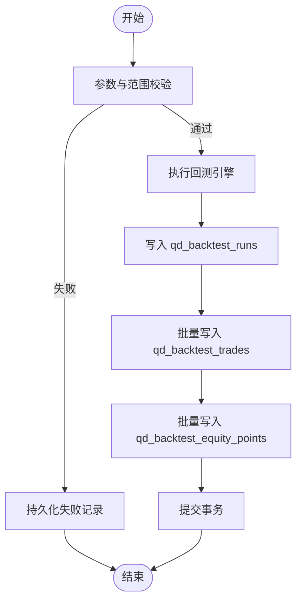
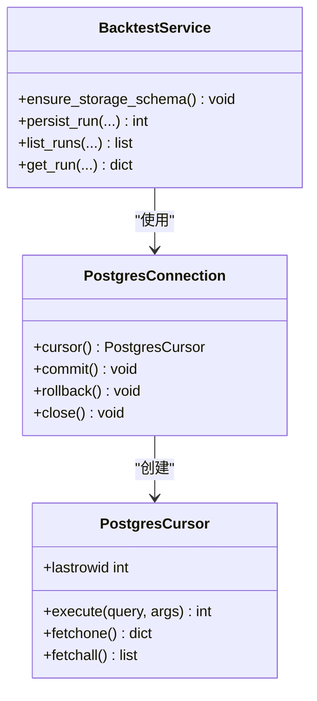
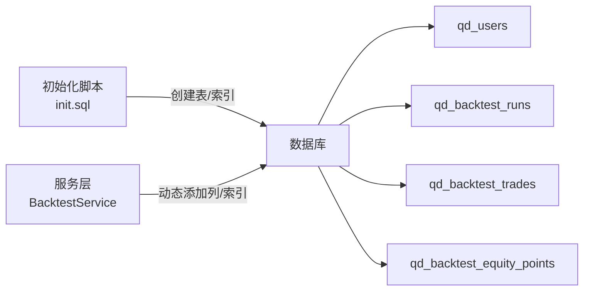
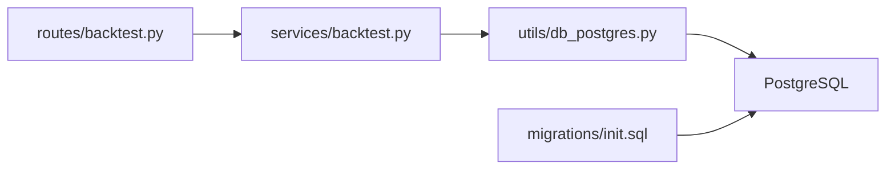

# 数据库存储设计

<cite>
**本文引用的文件**
- [init.sql](file://backend_api_python/migrations/init.sql)
- [backtest.py](file://backend_api_python/app/services/backtest.py)
- [db.py](file://backend_api_python/app/utils/db.py)
- [db_postgres.py](file://backend_api_python/app/utils/db_postgres.py)
- [backtest.py（路由）](file://backend_api_python/app/routes/backtest.py)
- [settings.py](file://backend_api_python/app/config/settings.py)
- [v3_1_0_agent_gateway.sql](file://backend_api_python/migrations/v3_1_0_agent_gateway.sql)
</cite>

## 目录
1. [简介](#简介)
2. [项目结构](#项目结构)
3. [核心组件](#核心组件)
4. [架构总览](#架构总览)
5. [详细组件分析](#详细组件分析)
6. [依赖关系分析](#依赖关系分析)
7. [性能考量](#性能考量)
8. [故障排查指南](#故障排查指南)
9. [结论](#结论)
10. [附录](#附录)

## 简介
本文件面向回测数据库存储设计，系统化阐述回测运行记录、交易明细与净值曲线三大核心表的设计目标、字段语义、索引策略与查询优化，并覆盖运行状态管理、结果持久化、数据完整性保障、版本演进与向后兼容、并发与事务控制、错误重试、批量写入、内存管理、监控与容量规划等主题。文档同时给出架构图、流程图与类图，帮助读者快速理解并落地实施。

## 项目结构
回测数据库存储由初始化脚本定义核心表结构，服务层负责运行状态与结果的持久化，路由层负责对外接口与参数校验，工具层提供统一的 PostgreSQL 连接池与事务封装，配置层提供运行参数与环境变量。

**图表来源**
- [init.sql](file://backend_api_python/migrations/init.sql)
- [backtest.py（路由）](file://backend_api_python/app/routes/backtest.py)
- [backtest.py](file://backend_api_python/app/services/backtest.py)
- [db.py](file://backend_api_python/app/utils/db.py)
- [db_postgres.py](file://backend_api_python/app/utils/db_postgres.py)

**章节来源**
- [init.sql](file://backend_api_python/migrations/init.sql)
- [backtest.py（路由）](file://backend_api_python/app/routes/backtest.py)
- [backtest.py](file://backend_api_python/app/services/backtest.py)
- [db.py](file://backend_api_python/app/utils/db.py)
- [db_postgres.py](file://backend_api_python/app/utils/db_postgres.py)

## 核心组件
- 回测运行记录表 qd_backtest_runs：保存一次回测的元数据、配置快照、引擎版本、状态与结果摘要。
- 回测交易明细表 qd_backtest_trades：保存逐笔交易的时序明细，便于复盘与可视化。
- 回测净值曲线表 qd_backtest_equity_points：保存净值时序采样点，支撑可视化与统计分析。
- 服务层 BacktestService：负责模式演进、持久化、查询与范围校验。
- 工具层数据库连接：提供连接池、占位符转换、事务提交/回滚与健康检查。
- 路由层：对外提供回测执行、历史查询与详情接口，负责参数校验与错误兜底持久化。

**章节来源**
- [init.sql](file://backend_api_python/migrations/init.sql)
- [backtest.py](file://backend_api_python/app/services/backtest.py)
- [db_postgres.py](file://backend_api_python/app/utils/db_postgres.py)

## 架构总览
回测数据流从路由进入，经服务层完成参数校验与范围限制，随后执行回测引擎生成结果，最后通过服务层将运行元数据、交易明细与净值点写入数据库。所有写入均在事务中进行，失败时也会持久化错误状态，确保可观测性与可追溯性。

**图表来源**
- [backtest.py（路由）](file://backend_api_python/app/routes/backtest.py)
- [backtest.py](file://backend_api_python/app/services/backtest.py)
- [db_postgres.py](file://backend_api_python/app/utils/db_postgres.py)

## 详细组件分析

### 表结构与字段语义
- qd_backtest_runs（回测运行记录）
  - 主键：id
  - 关联：user_id（外键）、indicator_id、strategy_id
  - 运行参数：market、symbol、timeframe、start_date、end_date、initial_capital、commission、slippage、leverage、trade_direction
  - 配置快照：strategy_config、config_snapshot、engine_version、code_hash
  - 状态与结果：run_type、status、error_message、result_json、created_at
  - 索引：idx_backtest_runs_user_id、idx_backtest_runs_indicator_id、idx_backtest_runs_strategy_id、idx_backtest_runs_run_type
- qd_backtest_trades（回测交易明细）
  - 主键：id
  - 关联：run_id（外键）、user_id、strategy_id
  - 明细：trade_index、trade_time、trade_type、side、price、amount、profit、balance、reason、payload_json、created_at
  - 索引：idx_backtest_trades_run_id
- qd_backtest_equity_points（回测净值曲线）
  - 主键：id
  - 关联：run_id（外键）
  - 曲线：point_index、point_time、point_value、created_at
  - 索引：idx_backtest_equity_points_run_id

字段命名与类型选择兼顾可读性与存储效率，数值型采用高精度类型以保留回测细节；JSON 字段用于灵活承载配置与结果，便于未来扩展。

**章节来源**
- [init.sql](file://backend_api_python/migrations/init.sql)

### 运行状态管理与结果持久化
- 状态字段：run_type、status、error_message
- 成功路径：写入 qd_backtest_runs 后，批量写入 qd_backtest_trades 与 qd_backtest_equity_points
- 失败兜底：即使回测异常，仍会持久化失败状态与错误信息，确保可观测性
- 版本与快照：engine_version、code_hash、config_snapshot 用于追踪引擎变更与配置差异

**图表来源**
- [backtest.py](file://backend_api_python/app/services/backtest.py)
- [backtest.py（路由）](file://backend_api_python/app/routes/backtest.py)

**章节来源**
- [backtest.py](file://backend_api_python/app/services/backtest.py)
- [backtest.py（路由）](file://backend_api_python/app/routes/backtest.py)

### 数据完整性与一致性
- 外键约束：qd_backtest_trades.user_id、qd_backtest_trades.strategy_id、qd_backtest_equity_points.run_id 等
- 唯一性与去重：qd_backtest_runs.code_hash 用于识别重复运行；qd_backtest_trades 与 qd_backtest_equity_points 通过 run_id 关联，保证明细与曲线与运行一一对应
- 事务边界：所有写入在单事务内完成，失败自动回滚，避免部分写入导致的数据不一致

**章节来源**
- [init.sql](file://backend_api_python/migrations/init.sql)
- [db_postgres.py](file://backend_api_python/app/utils/db_postgres.py)

### 索引设计与查询优化
- qd_backtest_runs
  - 用户维度：idx_backtest_runs_user_id
  - 资源维度：idx_backtest_runs_indicator_id、idx_backtest_runs_strategy_id
  - 类型维度：idx_backtest_runs_run_type
- qd_backtest_trades
  - 运行维度：idx_backtest_trades_run_id（高频按 run_id 查询明细）
- qd_backtest_equity_points
  - 运行维度：idx_backtest_equity_points_run_id（高频按 run_id 查询净值）

查询优化建议：
- 按用户/资源/类型过滤时优先使用对应索引
- 大数据量场景下，明细与净值查询建议限定时间窗口与分页
- 使用 EXPLAIN 分析慢查询，必要时补充复合索引

**章节来源**
- [init.sql](file://backend_api_python/migrations/init.sql)

### 大数据量处理与批量写入
- 批量插入：服务层对明细与净值采用批量写入，减少往返与事务开销
- 写入策略：先写运行记录，再批量写明细与净值，最后提交事务
- 错误处理：任一步骤失败均回滚，确保一致性

**章节来源**
- [backtest.py](file://backend_api_python/app/services/backtest.py)

### 并发访问控制与事务处理
- 连接池：PostgreSQL 工具提供连接池，支持最小/最大连接数、获取超时与健康检查
- 事务封装：上下文管理器自动提交/回滚，异常时回滚并记录日志
- 并发冲突：通过唯一索引与外键约束避免脏写；连接池等待策略缓解瞬时拥塞

**图表来源**
- [db_postgres.py](file://backend_api_python/app/utils/db_postgres.py)
- [backtest.py](file://backend_api_python/app/services/backtest.py)

**章节来源**
- [db_postgres.py](file://backend_api_python/app/utils/db_postgres.py)
- [backtest.py](file://backend_api_python/app/services/backtest.py)

### 错误重试机制
- 连接池等待：当连接池耗尽时，自动等待至超时，避免立即失败
- 健康检查：可选的连接健康检查，剔除坏连接
- 事务回滚：异常自动回滚，避免部分写入
- 建议：对外部依赖（如模型服务）增加指数退避重试与熔断

**章节来源**
- [db_postgres.py](file://backend_api_python/app/utils/db_postgres.py)

### 存储过程与批量操作
- 存储过程：当前实现未使用存储过程，采用批量 SQL 与连接池优化
- 批量操作：服务层对明细与净值采用批量插入，提升吞吐
- 内存管理：游标使用实时字典游标，避免一次性加载大量结果；批量写入时按批次提交

**章节来源**
- [backtest.py](file://backend_api_python/app/services/backtest.py)
- [db_postgres.py](file://backend_api_python/app/utils/db_postgres.py)

### 版本管理、Schema 演进与向后兼容
- 初始化脚本：集中定义核心表结构与索引
- 模式演进：服务层在首次使用时动态添加列与索引，保证部署即用
- 向后兼容：通过可选列与 JSON 字段承载新能力，不影响既有数据

**图表来源**
- [init.sql](file://backend_api_python/migrations/init.sql)
- [backtest.py](file://backend_api_python/app/services/backtest.py)

**章节来源**
- [init.sql](file://backend_api_python/migrations/init.sql)
- [backtest.py](file://backend_api_python/app/services/backtest.py)

### 数据备份、恢复与迁移
- 备份策略：定期导出关键表（qd_backtest_runs、qd_backtest_trades、qd_backtest_equity_points）与 schema；结合 WAL 归档实现增量备份
- 恢复策略：在新实例上先执行初始化脚本，再导入数据；注意外键顺序与索引重建
- 迁移建议：使用只读副本进行迁移演练；对大表使用分批导入与索引延迟重建

[本节为通用实践建议，无需特定文件引用]

### 监控、性能调优与容量规划
- 监控指标：连接池利用率、平均等待时间、慢查询数、事务回滚率、表大小与索引命中率
- 性能调优：根据 EXPLAIN 分析慢查询；为高频过滤字段补充索引；拆分冷热数据（按时间分区或独立表）
- 容量规划：估算每条回测记录的平均大小，结合并发与保留周期计算存储需求；预留 20%-30% 空间应对峰值

[本节为通用实践建议，无需特定文件引用]

## 依赖关系分析
- 路由依赖服务：路由负责参数校验与错误兜底持久化，调用服务层执行回测与持久化
- 服务依赖工具：服务层通过数据库工具获取连接、执行 SQL、管理事务
- 工具依赖数据库：工具层封装连接池、占位符转换与事务控制
- 数据库依赖初始化脚本：表结构与索引由初始化脚本定义

**图表来源**
- [backtest.py（路由）](file://backend_api_python/app/routes/backtest.py)
- [backtest.py](file://backend_api_python/app/services/backtest.py)
- [db_postgres.py](file://backend_api_python/app/utils/db_postgres.py)
- [init.sql](file://backend_api_python/migrations/init.sql)

**章节来源**
- [backtest.py（路由）](file://backend_api_python/app/routes/backtest.py)
- [backtest.py](file://backend_api_python/app/services/backtest.py)
- [db_postgres.py](file://backend_api_python/app/utils/db_postgres.py)
- [init.sql](file://backend_api_python/migrations/init.sql)

## 性能考量
- 连接池参数：最小/最大连接数、获取超时、健康检查开关
- 写入优化：批量插入、事务合并、索引延迟重建
- 查询优化：基于过滤条件选择合适索引，避免全表扫描
- 监控告警：慢查询阈值、连接池耗尽告警、事务回滚率

**章节来源**
- [db_postgres.py](file://backend_api_python/app/utils/db_postgres.py)
- [init.sql](file://backend_api_python/migrations/init.sql)

## 故障排查指南
- 连接池耗尽：检查 DB_POOL_MAX 与 DB_POOL_ACQUIRE_TIMEOUT；查看等待日志
- 健康检查失败：确认 DB_POOL_HEALTH_CHECK；排查网络与认证问题
- 事务回滚：查看错误日志与回滚原因；核对参数与约束
- 大数据量写入卡顿：检查批量大小与事务大小；评估索引数量与重建策略

**章节来源**
- [db_postgres.py](file://backend_api_python/app/utils/db_postgres.py)
- [backtest.py（路由）](file://backend_api_python/app/routes/backtest.py)

## 结论
该回测数据库存储设计以清晰的三层结构（路由/服务/数据访问）与标准化的表结构为核心，配合连接池、事务与索引策略，在保证数据完整性的同时兼顾性能与可维护性。通过版本化演进与错误兜底持久化，系统具备良好的可扩展性与可观测性。建议在生产环境中持续监控连接池与慢查询，按需优化索引与分区策略，并建立完善的备份与迁移流程。

## 附录
- 环境变量与配置项参考：数据库连接、连接池参数、日志级别等
- 相关迁移脚本：初始化脚本与代理网关迁移脚本

**章节来源**
- [settings.py](file://backend_api_python/app/config/settings.py)
- [v3_1_0_agent_gateway.sql](file://backend_api_python/migrations/v3_1_0_agent_gateway.sql)