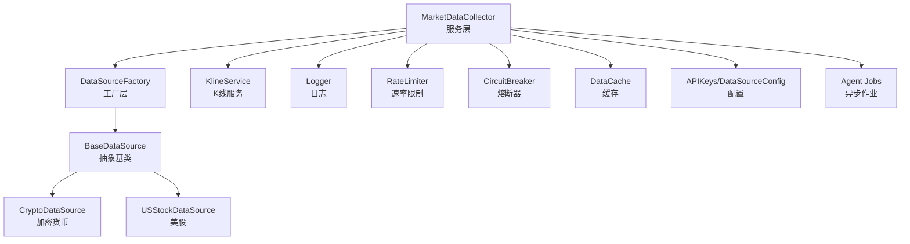
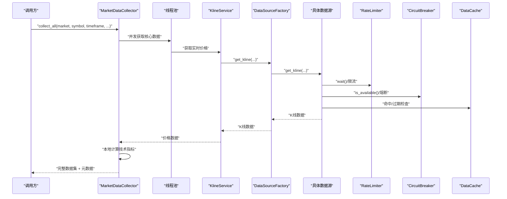
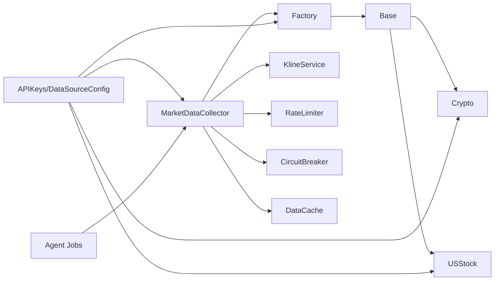

# 市场数据收集器

<cite>
**本文引用的文件**
- [market_data_collector.py](file://backend_api_python/app/services/market_data_collector.py)
- [rate_limiter.py](file://backend_api_python/app/data_sources/rate_limiter.py)
- [circuit_breaker.py](file://backend_api_python/app/data_sources/circuit_breaker.py)
- [cache_manager.py](file://backend_api_python/app/data_sources/cache_manager.py)
- [factory.py](file://backend_api_python/app/data_sources/factory.py)
- [base.py](file://backend_api_python/app/data_sources/base.py)
- [crypto.py](file://backend_api_python/app/data_sources/crypto.py)
- [us_stock.py](file://backend_api_python/app/data_sources/us_stock.py)
- [errors.py](file://backend_api_python/app/data_sources/errors.py)
- [settings.py](file://backend_api_python/app/config/settings.py)
- [api_keys.py](file://backend_api_python/app/config/api_keys.py)
- [data_sources.py](file://backend_api_python/app/config/data_sources.py)
- [jobs.py](file://backend_api_python/app/routes/agent_v1/jobs.py)
- [agent_jobs.py](file://backend_api_python/app/utils/agent_jobs.py)
</cite>

## 目录
1. [简介](#简介)
2. [项目结构](#项目结构)
3. [核心组件](#核心组件)
4. [架构总览](#架构总览)
5. [详细组件分析](#详细组件分析)
6. [依赖分析](#依赖分析)
7. [性能考量](#性能考量)
8. [故障排查指南](#故障排查指南)
9. [结论](#结论)
10. [附录](#附录)

## 简介
本文件为“市场数据收集器”的技术文档，面向需要理解与扩展数据采集系统的技术读者。文档聚焦以下目标：
- 解释数据收集器的架构设计与工作流程
- 详述定时任务调度、并发数据抓取与异常处理机制
- 文档化速率限制器的实现原理与配置方法
- 解释熔断器模式在数据收集中的应用
- 提供数据收集任务的配置项、优先级与资源管理策略
- 说明数据质量检查、重复数据处理与数据完整性验证机制
- 解释与外部数据源的连接管理、超时与重试策略
- 提供性能监控指标与故障诊断方法

## 项目结构
围绕市场数据收集器的关键模块如下：
- 服务层：市场数据收集器负责编排与聚合
- 数据源层：抽象基类与具体数据源（加密货币、美股等）
- 工厂层：根据市场类型选择合适的数据源
- 基础设施：速率限制、熔断器、缓存
- 配置层：API密钥、数据源超时与重试、全局功能开关
- 异步作业：作业提交、进度流与SSE

图表来源
- [market_data_collector.py](file://backend_api_python/app/services/market_data_collector.py)
- [factory.py](file://backend_api_python/app/data_sources/factory.py)
- [base.py](file://backend_api_python/app/data_sources/base.py)
- [crypto.py](file://backend_api_python/app/data_sources/crypto.py)
- [us_stock.py](file://backend_api_python/app/data_sources/us_stock.py)
- [rate_limiter.py](file://backend_api_python/app/data_sources/rate_limiter.py)
- [circuit_breaker.py](file://backend_api_python/app/data_sources/circuit_breaker.py)
- [cache_manager.py](file://backend_api_python/app/data_sources/cache_manager.py)
- [api_keys.py](file://backend_api_python/app/config/api_keys.py)
- [data_sources.py](file://backend_api_python/app/config/data_sources.py)
- [agent_jobs.py](file://backend_api_python/app/utils/agent_jobs.py)

章节来源
- [market_data_collector.py](file://backend_api_python/app/services/market_data_collector.py)
- [factory.py](file://backend_api_python/app/data_sources/factory.py)
- [base.py](file://backend_api_python/app/data_sources/base.py)
- [crypto.py](file://backend_api_python/app/data_sources/crypto.py)
- [us_stock.py](file://backend_api_python/app/data_sources/us_stock.py)
- [rate_limiter.py](file://backend_api_python/app/data_sources/rate_limiter.py)
- [circuit_breaker.py](file://backend_api_python/app/data_sources/circuit_breaker.py)
- [cache_manager.py](file://backend_api_python/app/data_sources/cache_manager.py)
- [api_keys.py](file://backend_api_python/app/config/api_keys.py)
- [data_sources.py](file://backend_api_python/app/config/data_sources.py)
- [agent_jobs.py](file://backend_api_python/app/utils/agent_jobs.py)

## 核心组件
- 市场数据收集器：统一编排价格、K线、技术指标、基本面、宏观、新闻、情绪与预测市场数据的采集流程，并记录元数据与耗时。
- 数据源工厂：依据市场类型返回对应数据源实例，屏蔽上层差异。
- 抽象数据源基类：定义统一接口与通用能力（时间窗计算、过滤截断、日志延迟检测）。
- 具体数据源：加密货币（CCXT）、美股（yfinance/finnhub）等。
- 速率限制器：请求间隔控制、随机抖动、指数退避重试装饰器。
- 熔断器：失败阈值触发熔断、冷却时间、半开试探与状态恢复。
- 缓存管理：TTL过期、LRU淘汰、线程安全、命中率统计。
- 配置系统：API密钥、数据源超时与重试、全局功能开关。
- 异步作业：作业提交、线程池执行、进度事件发布与SSE流。

章节来源
- [market_data_collector.py](file://backend_api_python/app/services/market_data_collector.py)
- [factory.py](file://backend_api_python/app/data_sources/factory.py)
- [base.py](file://backend_api_python/app/data_sources/base.py)
- [rate_limiter.py](file://backend_api_python/app/data_sources/rate_limiter.py)
- [circuit_breaker.py](file://backend_api_python/app/data_sources/circuit_breaker.py)
- [cache_manager.py](file://backend_api_python/app/data_sources/cache_manager.py)
- [api_keys.py](file://backend_api_python/app/config/api_keys.py)
- [data_sources.py](file://backend_api_python/app/config/data_sources.py)
- [agent_jobs.py](file://backend_api_python/app/utils/agent_jobs.py)

## 架构总览
市场数据收集器通过工厂与数据源抽象解耦具体实现，利用并发与本地指标计算提升吞吐，结合速率限制、熔断器与缓存保障稳定性与可靠性。异步作业框架支持长耗时任务的提交与进度流式输出。

图表来源
- [market_data_collector.py](file://backend_api_python/app/services/market_data_collector.py)
- [factory.py](file://backend_api_python/app/data_sources/factory.py)
- [base.py](file://backend_api_python/app/data_sources/base.py)
- [crypto.py](file://backend_api_python/app/data_sources/crypto.py)
- [us_stock.py](file://backend_api_python/app/data_sources/us_stock.py)
- [rate_limiter.py](file://backend_api_python/app/data_sources/rate_limiter.py)
- [circuit_breaker.py](file://backend_api_python/app/data_sources/circuit_breaker.py)
- [cache_manager.py](file://backend_api_python/app/data_sources/cache_manager.py)

## 详细组件分析

### 市场数据收集器（服务层）
职责与流程要点：
- 统一入口：接收市场、标的、周期等参数，返回标准化数据包。
- 分阶段采集：
  - 阶段1：核心数据（价格、K线、基本面/公司信息、加密货币因子）并行获取。
  - 阶段1.5：加密货币交易大数据因子（若适用）。
  - 阶段2：宏观数据（可选）。
  - 阶段3：新闻与情绪（可选）。
  - 阶段4：预测市场数据（可选）。
- 本地指标计算：在获取K线后进行RSI、MACD、布林带、ATR、支撑阻力等计算，不依赖外部API。
- 元数据记录：成功/失败项清单、总耗时，便于可观测性与重试策略制定。

并发与超时：
- 使用线程池并发执行核心数据获取，设置阶段级超时与单项超时，避免阻塞。
- 价格回退：当K线服务失败时，从K线数据中提取最新K线作为价格来源。

异常处理：
- 每个阶段捕获异常并记录，不影响其他阶段；最终汇总成功/失败项。

章节来源
- [market_data_collector.py](file://backend_api_python/app/services/market_data_collector.py)

### 数据源工厂与抽象基类
- 工厂：支持市场别名归一化、按需创建数据源实例、便捷获取K线与报价。
- 抽象基类：定义统一接口、时间窗计算、数据过滤与截断、延迟检测日志。

章节来源
- [factory.py](file://backend_api_python/app/data_sources/factory.py)
- [base.py](file://backend_api_python/app/data_sources/base.py)

### 加密货币数据源（CCXT）
- 符号规范化：兼容多种输入格式，自动识别基础/报价货币组合。
- 交易所适配：针对不同交易所的符号映射与市场加载。
- 分页拉取：支持按时间窗口分批获取OHLCV，去重与排序，保证完整性。
- 备用方案：主方法失败时回退到备用fetch_ohlcv_fallback。
- 延迟检测：记录最新K线UTC时间与阈值比较，发出延迟告警。

章节来源
- [crypto.py](file://backend_api_python/app/data_sources/crypto.py)

### 美股数据源（yfinance/finnhub）
- 实时报价：优先Finnhub，降级到yfinance fast_info/info/history回退链路。
- K线获取：按周期映射与天数估算，支持回测时间窗过滤与合并。
- 备用方案：日线回退到Finnhub。

章节来源
- [us_stock.py](file://backend_api_python/app/data_sources/us_stock.py)

### 速率限制器
实现要点：
- 请求间隔控制：记录上次请求时间，等待达到最小间隔后再放行。
- 随机抖动：在每次请求前后加入随机延迟，降低被封禁概率。
- 指数退避重试装饰器：对指定异常类型进行最多N次重试，延迟按指数增长并叠加抖动。
- 全局实例：为不同数据源（如东方财富、腾讯、Akshare）提供独立限流器。

配置方法：
- 通过构造参数设置最小间隔与抖动范围。
- 使用装饰器包装易失败的网络请求函数。

章节来源
- [rate_limiter.py](file://backend_api_python/app/data_sources/rate_limiter.py)

### 熔断器模式
状态机：
- CLOSED（正常）→失败N次→OPEN（熔断）→冷却时间到→HALF_OPEN（半开）→成功→CLOSED；半开失败→OPEN。
- 保护机制：冷却期内跳过该数据源，半开仅允许有限次试探请求。

配置与使用：
- 失败阈值、冷却时间、半开最大尝试次数可配置。
- 对每个数据源维护独立状态，支持重置与查询。

章节来源
- [circuit_breaker.py](file://backend_api_python/app/data_sources/circuit_breaker.py)

### 缓存管理
特性：
- TTL过期：条目按时间戳与TTL判断是否过期。
- LRU淘汰：容量满时淘汰最久未访问条目。
- 线程安全：内部锁保护读写。
- 统计指标：命中/未命中计数、命中率、默认TTL等。

使用场景：
- 实时行情缓存、K线缓存、股票信息缓存等。

章节来源
- [cache_manager.py](file://backend_api_python/app/data_sources/cache_manager.py)

### 配置系统
- API密钥：集中管理第三方API密钥，支持环境变量与附加配置文件。
- 数据源配置：超时、重试次数、回退系数等。
- 全局功能开关：缓存启用、请求日志等。

章节来源
- [api_keys.py](file://backend_api_python/app/config/api_keys.py)
- [data_sources.py](file://backend_api_python/app/config/data_sources.py)
- [settings.py](file://backend_api_python/app/config/settings.py)

### 异步作业与进度流
- 作业提交：线程池执行器，持久化作业状态与进度快照。
- 进度流：内存环形缓冲+数据库快照，SSE推送事件，支持断点续连。
- 适用场景：长耗时数据采集任务、批量回测、实验管线。

章节来源
- [agent_jobs.py](file://backend_api_python/app/utils/agent_jobs.py)
- [jobs.py](file://backend_api_python/app/routes/agent_v1/jobs.py)

## 依赖分析
- 服务层依赖工厂与K线服务，间接依赖具体数据源实现。
- 数据源层依赖抽象基类，遵循统一接口。
- 基础设施（限流、熔断、缓存）被服务层与数据源层共同使用。
- 配置层为全局提供密钥与参数，贯穿各层。
- 异步作业框架为上层提供任务编排与可观测性。

图表来源
- [market_data_collector.py](file://backend_api_python/app/services/market_data_collector.py)
- [factory.py](file://backend_api_python/app/data_sources/factory.py)
- [base.py](file://backend_api_python/app/data_sources/base.py)
- [crypto.py](file://backend_api_python/app/data_sources/crypto.py)
- [us_stock.py](file://backend_api_python/app/data_sources/us_stock.py)
- [rate_limiter.py](file://backend_api_python/app/data_sources/rate_limiter.py)
- [circuit_breaker.py](file://backend_api_python/app/data_sources/circuit_breaker.py)
- [cache_manager.py](file://backend_api_python/app/data_sources/cache_manager.py)
- [api_keys.py](file://backend_api_python/app/config/api_keys.py)
- [data_sources.py](file://backend_api_python/app/config/data_sources.py)
- [agent_jobs.py](file://backend_api_python/app/utils/agent_jobs.py)

## 性能考量
- 并发抓取：核心数据阶段使用线程池并行，缩短总采集时间。
- 本地计算：技术指标在本地计算，避免外部依赖带来的延迟与失败。
- 缓存命中：合理TTL与LRU策略降低重复请求与外部依赖压力。
- 限流与熔断：防止触发外部服务限流或封禁，提高整体稳定性。
- 超时与重试：阶段级与单项超时，指数退避重试，平衡成功率与响应时间。
- 延迟检测：对K线最新时间进行阈值判断，及时发现数据源延迟问题。

## 故障排查指南
- 采集失败定位：
  - 查看元数据中的成功/失败项清单，确认具体失败阶段与项。
  - 检查日志级别与输出，关注警告与错误信息。
- 外部服务异常：
  - 速率限制：适当增大最小间隔或抖动范围，或切换到更高配额的API。
  - 熔断状态：等待冷却时间结束，或手动重置熔断器状态。
  - 缓存问题：清理过期缓存或调整TTL，观察命中率变化。
- 数据质量：
  - K线缺失或延迟：检查延迟检测日志，确认数据源是否正常。
  - 重复数据：分页拉取时已做去重与排序，确认实现是否正确调用。
- 配置问题：
  - API密钥未配置或无效：检查环境变量与附加配置文件。
  - 超时与重试：根据外部服务SLA调整超时与重试参数。
- 异步作业：
  - 作业长时间未推进：检查线程池最大工作者数与任务队列。
  - SSE断连：使用since参数或Last-Event-ID头进行断点续连。

章节来源
- [market_data_collector.py](file://backend_api_python/app/services/market_data_collector.py)
- [rate_limiter.py](file://backend_api_python/app/data_sources/rate_limiter.py)
- [circuit_breaker.py](file://backend_api_python/app/data_sources/circuit_breaker.py)
- [cache_manager.py](file://backend_api_python/app/data_sources/cache_manager.py)
- [agent_jobs.py](file://backend_api_python/app/utils/agent_jobs.py)

## 结论
市场数据收集器通过清晰的分层设计、并发抓取、本地指标计算与完善的基础设施（限流、熔断、缓存），在保证数据质量的同时提升了采集效率与系统稳定性。配合异步作业框架与可观测性日志，能够满足复杂场景下的数据需求。建议在生产环境中结合业务负载与外部服务SLA，持续优化配置参数与资源分配。

## 附录

### 数据收集任务配置选项
- 基本参数
  - market：市场类型（如 Crypto、USStock、Forex、Futures、CNStock、HKStock、MOEX）
  - symbol：标的代码
  - timeframe：K线周期（如 1m、5m、15m、30m、1H、4H、1D、1W）
  - include_macro/include_news/include_polymarket：是否采集宏观、新闻、预测市场数据
  - timeout：总超时时间（秒）
- 并发与超时
  - 核心数据阶段使用线程池并行，单项超时与阶段超时协同
- 本地指标
  - RSI、MACD、移动平均、布林带、ATR、支撑阻力、波动率、止盈止损建议等
- 元数据
  - success_items、failed_items、duration_ms

章节来源
- [market_data_collector.py](file://backend_api_python/app/services/market_data_collector.py)

### 速率限制器配置方法
- 构造参数
  - min_interval：最小请求间隔（秒）
  - jitter_min/jitter_max：随机抖动范围（秒）
- 装饰器
  - retry_with_backoff：指数退避重试，支持最大重试次数、基础延迟、最大延迟、指数基数与异常类型
- 全局实例
  - 为不同数据源提供独立限流器实例，便于差异化配置

章节来源
- [rate_limiter.py](file://backend_api_python/app/data_sources/rate_limiter.py)

### 熔断器模式应用
- 状态机：CLOSED → OPEN（冷却）→ HALF_OPEN → CLOSED（成功）或再次OPEN（半开失败）
- 配置项：失败阈值、冷却时间、半开最大尝试次数
- 使用建议：对易失败或高风险外部接口启用，定期检查状态与日志

章节来源
- [circuit_breaker.py](file://backend_api_python/app/data_sources/circuit_breaker.py)

### 数据质量检查与完整性验证
- 延迟检测：对K线最新时间进行阈值判断，发出延迟告警
- 重复数据处理：分页拉取时按时间戳去重与排序
- 缺失数据回退：价格获取失败时回退到K线最后一根K线
- 缓存一致性：TTL过期与LRU淘汰，避免脏数据影响

章节来源
- [base.py](file://backend_api_python/app/data_sources/base.py)
- [crypto.py](file://backend_api_python/app/data_sources/crypto.py)
- [market_data_collector.py](file://backend_api_python/app/services/market_data_collector.py)
- [cache_manager.py](file://backend_api_python/app/data_sources/cache_manager.py)

### 外部数据源连接管理、超时与重试
- 连接管理：CCXT配置超时、启用速率限制、代理支持；yfinance/finnhub按周期与天数估算范围
- 超时：全局数据源超时与重试配置，以及阶段级超时
- 重试：指数退避重试装饰器，支持异常类型筛选与抖动

章节来源
- [data_sources.py](file://backend_api_python/app/config/data_sources.py)
- [crypto.py](file://backend_api_python/app/data_sources/crypto.py)
- [us_stock.py](file://backend_api_python/app/data_sources/us_stock.py)
- [rate_limiter.py](file://backend_api_python/app/data_sources/rate_limiter.py)

### 性能监控指标与故障诊断
- 指标
  - 采集耗时（duration_ms）、成功/失败项清单
  - 缓存命中率、命中/未命中计数
  - 熔断器状态（状态、失败次数、最后错误）
- 诊断
  - 日志级别与输出、延迟检测告警、SSE断点续连
  - 作业状态与进度快照，便于追踪与复现

章节来源
- [market_data_collector.py](file://backend_api_python/app/services/market_data_collector.py)
- [cache_manager.py](file://backend_api_python/app/data_sources/cache_manager.py)
- [circuit_breaker.py](file://backend_api_python/app/data_sources/circuit_breaker.py)
- [agent_jobs.py](file://backend_api_python/app/utils/agent_jobs.py)
- [jobs.py](file://backend_api_python/app/routes/agent_v1/jobs.py)