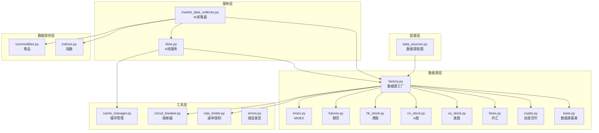
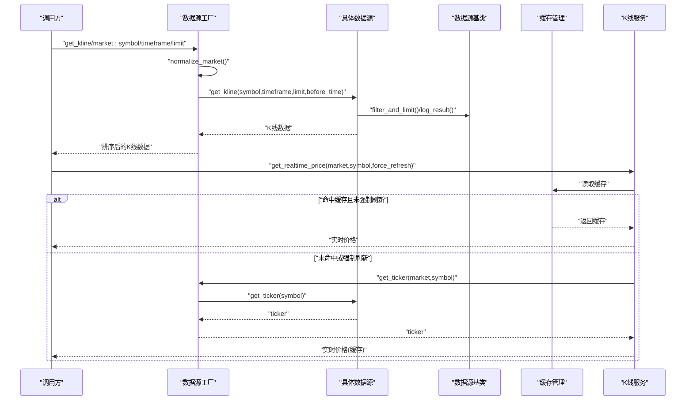
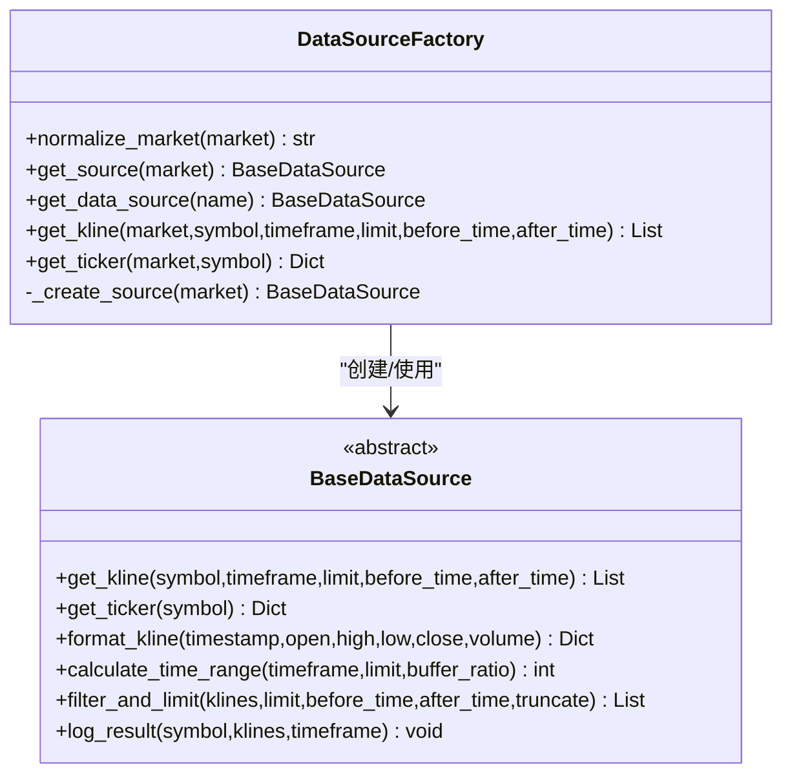
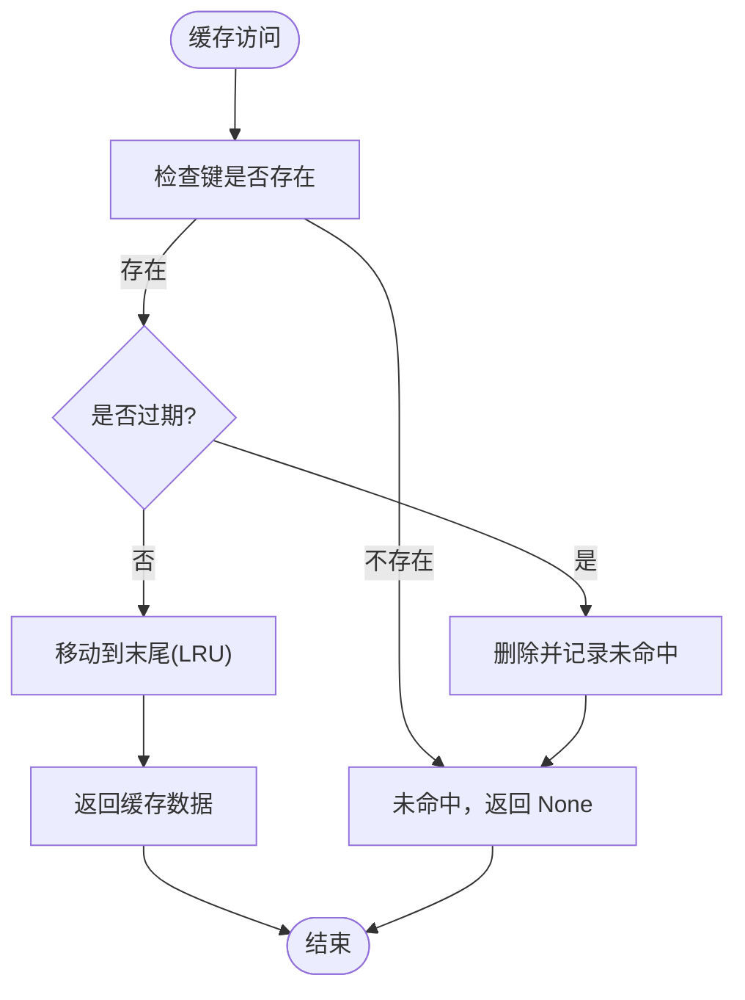
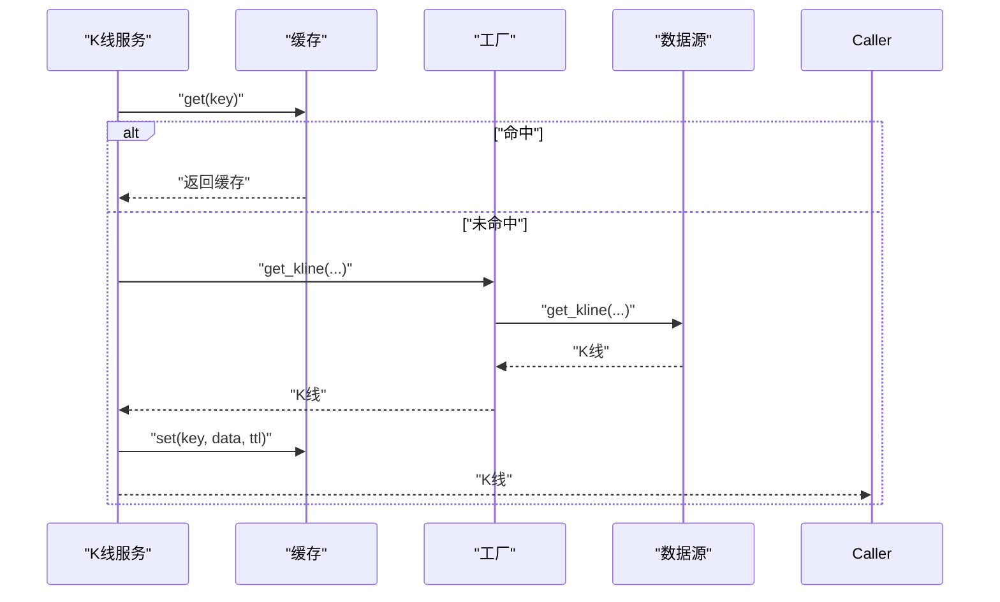
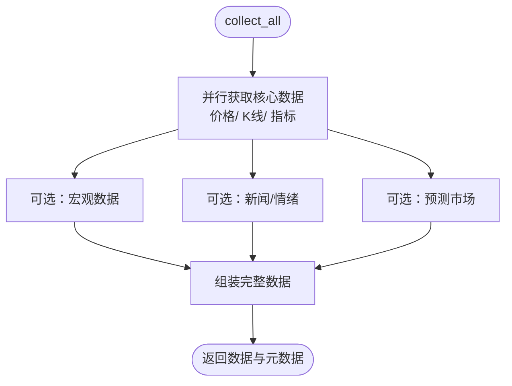
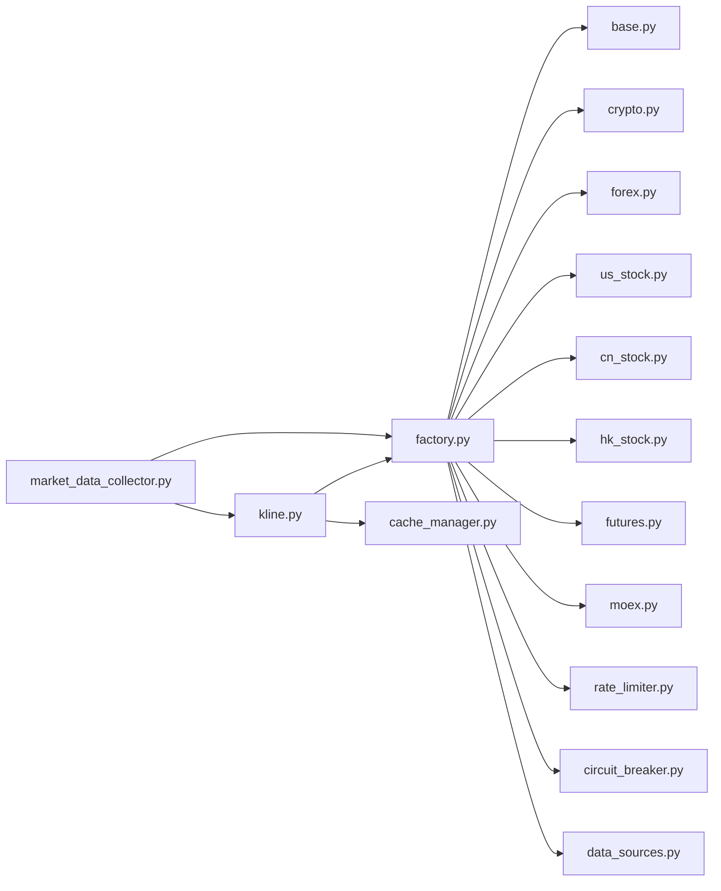

# 市场数据服务

<cite>
**本文引用的文件**
- [factory.py](file://backend_api_python/app/data_sources/factory.py)
- [base.py](file://backend_api_python/app/data_sources/base.py)
- [cache_manager.py](file://backend_api_python/app/data_sources/cache_manager.py)
- [market_data_collector.py](file://backend_api_python/app/services/market_data_collector.py)
- [crypto.py](file://backend_api_python/app/data_sources/crypto.py)
- [forex.py](file://backend_api_python/app/data_sources/forex.py)
- [us_stock.py](file://backend_api_python/app/data_sources/us_stock.py)
- [cn_stock.py](file://backend_api_python/app/data_sources/cn_stock.py)
- [hk_stock.py](file://backend_api_python/app/data_sources/hk_stock.py)
- [futures.py](file://backend_api_python/app/data_sources/futures.py)
- [moex.py](file://backend_api_python/app/data_sources/moex.py)
- [kline.py](file://backend_api_python/app/services/kline.py)
- [data_sources.py](file://backend_api_python/app/config/data_sources.py)
- [rate_limiter.py](file://backend_api_python/app/data_sources/rate_limiter.py)
- [circuit_breaker.py](file://backend_api_python/app/data_sources/circuit_breaker.py)
- [errors.py](file://backend_api_python/app/data_sources/errors.py)
- [indices.py](file://backend_api_python/app/data_providers/indices.py)
- [commodities.py](file://backend_api_python/app/data_providers/commodities.py)
</cite>

## 目录
1. [简介](#简介)
2. [项目结构](#项目结构)
3. [核心组件](#核心组件)
4. [架构概览](#架构概览)
5. [详细组件分析](#详细组件分析)
6. [依赖关系分析](#依赖关系分析)
7. [性能考量](#性能考量)
8. [故障排查指南](#故障排查指南)
9. [结论](#结论)
10. [附录](#附录)

## 简介
本技术文档面向市场数据服务，系统性阐述以下主题：
- 数据源工厂模式的实现与扩展
- 缓存管理策略与数据一致性保障
- 市场数据采集器的工作原理与数据质量保证
- 支持的数据源类型（加密货币、外汇、指数、商品、期货、MOEX等）及其配置方法
- 实时数据流处理、历史数据管理与回测窗口控制
- 数据去重、时间戳处理与异常处理方案
- 与策略引擎的数据交互模式

## 项目结构
市场数据服务位于后端 Python 应用中，核心目录包括：
- 数据源层：抽象基类与具体数据源实现（加密货币、外汇、美股、A/H股、期货、MOEX）
- 服务层：K线服务与AI驱动的市场数据采集器
- 配置层：数据源配置与环境变量加载
- 工具层：缓存管理、速率限制、熔断器、错误类型

**图表来源**
- [factory.py:33-112](file://backend_api_python/app/data_sources/factory.py#L33-L112)
- [base.py:28-180](file://backend_api_python/app/data_sources/base.py#L28-L180)
- [cache_manager.py:44-175](file://backend_api_python/app/data_sources/cache_manager.py#L44-L175)
- [kline.py:14-66](file://backend_api_python/app/services/kline.py#L14-L66)
- [market_data_collector.py:34-225](file://backend_api_python/app/services/market_data_collector.py#L34-L225)
- [data_sources.py:26-152](file://backend_api_python/app/config/data_sources.py#L26-L152)
- [rate_limiter.py:109-164](file://backend_api_python/app/data_sources/rate_limiter.py#L109-L164)
- [circuit_breaker.py:31-101](file://backend_api_python/app/data_sources/circuit_breaker.py#L31-L101)

**章节来源**
- [factory.py:13-112](file://backend_api_python/app/data_sources/factory.py#L13-L112)
- [base.py:14-180](file://backend_api_python/app/data_sources/base.py#L14-L180)
- [cache_manager.py:44-233](file://backend_api_python/app/data_sources/cache_manager.py#L44-L233)
- [kline.py:14-191](file://backend_api_python/app/services/kline.py#L14-L191)
- [market_data_collector.py:34-225](file://backend_api_python/app/services/market_data_collector.py#L34-L225)
- [data_sources.py:26-173](file://backend_api_python/app/config/data_sources.py#L26-L173)
- [rate_limiter.py:109-273](file://backend_api_python/app/data_sources/rate_limiter.py#L109-L273)
- [circuit_breaker.py:31-175](file://backend_api_python/app/data_sources/circuit_breaker.py#L31-L175)

## 核心组件
- 数据源工厂：集中管理市场类型到具体数据源的映射，提供标准化入口与便捷方法
- 数据源基类：统一接口、时间周期映射、过滤与限制、日志与延迟检测
- 缓存管理：TTL/LRU 策略、全局缓存实例、键生成与统计
- K线服务：缓存封装、实时价格获取与降级策略
- 市场数据采集器：并行采集、技术指标计算、宏观/新闻/情绪/预测市场数据整合
- 配置系统：数据源、超时、重试、时间周期映射、代理等
- 速率限制与熔断器：请求节流、指数退避、失败熔断与恢复

**章节来源**
- [factory.py:33-178](file://backend_api_python/app/data_sources/factory.py#L33-L178)
- [base.py:28-180](file://backend_api_python/app/data_sources/base.py#L28-L180)
- [cache_manager.py:44-233](file://backend_api_python/app/data_sources/cache_manager.py#L44-L233)
- [kline.py:14-191](file://backend_api_python/app/services/kline.py#L14-L191)
- [market_data_collector.py:34-225](file://backend_api_python/app/services/market_data_collector.py#L34-L225)
- [data_sources.py:26-173](file://backend_api_python/app/config/data_sources.py#L26-L173)
- [rate_limiter.py:109-273](file://backend_api_python/app/data_sources/rate_limiter.py#L109-L273)
- [circuit_breaker.py:31-175](file://backend_api_python/app/data_sources/circuit_breaker.py#L31-L175)

## 架构概览
数据流从调用方进入工厂，工厂根据市场类型选择具体数据源，数据源通过统一基类接口获取数据，并在必要时应用过滤、限制与日志。K线服务负责缓存与实时价格降级，采集器并行拉取多源数据并计算指标。

**图表来源**
- [factory.py:52-178](file://backend_api_python/app/data_sources/factory.py#L52-L178)
- [base.py:33-141](file://backend_api_python/app/data_sources/base.py#L33-L141)
- [cache_manager.py:71-128](file://backend_api_python/app/data_sources/cache_manager.py#L71-L128)
- [kline.py:74-191](file://backend_api_python/app/services/kline.py#L74-L191)

**章节来源**
- [factory.py:52-178](file://backend_api_python/app/data_sources/factory.py#L52-L178)
- [base.py:33-141](file://backend_api_python/app/data_sources/base.py#L33-L141)
- [kline.py:74-191](file://backend_api_python/app/services/kline.py#L74-L191)

## 详细组件分析

### 数据源工厂模式
- 市场规范化：支持别名映射与大小写归一，确保路由与调用入口一致
- 工厂缓存：按市场类型缓存数据源实例，避免重复初始化
- 便捷方法：提供统一的 K 线与实时报价获取入口，内置异常捕获与降级日志
- 错误处理：未知市场类型抛出专用错误，便于上层识别

**图表来源**
- [factory.py:33-112](file://backend_api_python/app/data_sources/factory.py#L33-L112)
- [base.py:28-180](file://backend_api_python/app/data_sources/base.py#L28-L180)

**章节来源**
- [factory.py:41-112](file://backend_api_python/app/data_sources/factory.py#L41-L112)
- [errors.py:8-15](file://backend_api_python/app/data_sources/errors.py#L8-L15)

### 缓存管理策略
- TTL 与 LRU：全局缓存实例按类型分区，支持默认 TTL、最大容量与 LRU 淘汰
- 实时/历史区分：实时行情短 TTL、K线与股票信息长 TTL；历史数据不缓存
- 键生成：K线缓存键包含 symbol、timeframe、limit、before_time
- 统计与清理：命中/未命中计数、过期清理、容量上限保护

**图表来源**
- [cache_manager.py:71-128](file://backend_api_python/app/data_sources/cache_manager.py#L71-L128)

**章节来源**
- [cache_manager.py:44-233](file://backend_api_python/app/data_sources/cache_manager.py#L44-L233)

### K线服务与实时价格
- 缓存策略：仅缓存最新数据，历史数据不缓存；不同周期 TTL 不同
- 实时价格降级：优先 ticker，失败则 1 分钟 K 线，最后日线 K 线
- 统一接口：对外暴露 get_kline 与 get_realtime_price，内部复用工厂与缓存

**图表来源**
- [kline.py:21-66](file://backend_api_python/app/services/kline.py#L21-L66)
- [cache_manager.py:100-128](file://backend_api_python/app/data_sources/cache_manager.py#L100-L128)

**章节来源**
- [kline.py:14-191](file://backend_api_python/app/services/kline.py#L14-L191)
- [cache_manager.py:181-233](file://backend_api_python/app/data_sources/cache_manager.py#L181-L233)

### 市场数据采集器（AI分析专用）
- 设计理念：统一数据源、复用 K 线服务、快速稳定、可选宏观/新闻/情绪/预测市场
- 并行采集：核心数据（价格/K线/指标）与基本面、宏观、新闻、预测市场并行获取
- 指标计算：本地计算 RSI、MACD、布林带、ATR、支撑/阻力、波动率、止盈止损建议
- 失败容错：阶段化失败项记录，超时与异常捕获，最终返回元数据

**图表来源**
- [market_data_collector.py:72-225](file://backend_api_python/app/services/market_data_collector.py#L72-L225)

**章节来源**
- [market_data_collector.py:34-225](file://backend_api_python/app/services/market_data_collector.py#L34-L225)

### 支持的数据源类型与配置

#### 加密货币（Crypto）
- 数据源：CCXT（支持多交易所），自动符号规范化与有效符号查找
- 时间周期：映射至 CCXT 支持周期
- 符号处理：支持 BTC/USDT、BTCUSDT、BTC/USDT:USDT 等格式
- 备用获取：分页拉取与去重，异常时回退

**章节来源**
- [crypto.py:16-428](file://backend_api_python/app/data_sources/crypto.py#L16-L428)
- [data_sources.py:102-152](file://backend_api_python/app/config/data_sources.py#L102-L152)

#### 外汇（Forex）
- 三级降级：Twelve Data → Tiingo → yfinance
- 实时报价：全局缓存（TTL 60 秒），优先 Twelve Data
- K线：Twelve Data 为主，Tiingo 为辅，yfinance 为降级
- 符号映射：EURUSD、XAUUSD 等映射与 yfinance 兼容

**章节来源**
- [forex.py:104-709](file://backend_api_python/app/data_sources/forex.py#L104-L709)
- [data_sources.py:58-100](file://backend_api_python/app/config/data_sources.py#L58-L100)

#### 美股（USStock）
- 实时报价：优先 Finnhub，降级 yfinance fast_info/info/1 分钟 K 线
- K线：yfinance 为主，Finndhub 日线为辅
- 周期映射与天数估算：针对不同周期计算起止日期

**章节来源**
- [us_stock.py:17-361](file://backend_api_python/app/data_sources/us_stock.py#L17-L361)
- [data_sources.py:75-99](file://backend_api_python/app/config/data_sources.py#L75-L99)

#### A股（CNStock）与港股（HKStock）
- 多层降级：Twelve Data → 腾讯日/周线 → yfinance → AkShare
- 日/周线：腾讯 fqkline 优先；分钟线：AkShare 为降级
- 符号规范化：统一转换为 tencent 代码格式

**章节来源**
- [cn_stock.py:30-125](file://backend_api_python/app/data_sources/cn_stock.py#L30-L125)
- [hk_stock.py:30-125](file://backend_api_python/app/data_sources/hk_stock.py#L30-L125)

#### 期货（Futures）
- 传统期货：Twelve Data → yfinance → Tiingo（贵金属）
- 加密货币期货：CCXT Binance Futures
- 符号与周期：传统期货映射 yfinance/CCXT 周期

**章节来源**
- [futures.py:60-468](file://backend_api_python/app/data_sources/futures.py#L60-L468)
- [data_sources.py:102-152](file://backend_api_python/app/config/data_sources.py#L102-L152)

#### MOEX（俄罗斯股市）
- 仅历史与实时快照：基于 ISS 公共 API，不支持实盘委托
- 时间周期映射：1m/5m/15m/30m/4H 通过 1 分钟/60 分钟聚合
- 符号清洗：去除后缀与非法字符，支持 TQBR 板块

**章节来源**
- [moex.py:57-314](file://backend_api_python/app/data_sources/moex.py#L57-L314)

### 数据格式、时间戳与去重
- 统一格式：K线包含 time、open、high、low、close、volume
- 时间戳：统一为 Unix 秒（UTC），日志中进行 UTC 对比避免时区误差
- 去重与排序：CCXT 分页拉取后按时间戳去重与排序，确保连续性
- 过滤与限制：按 before_time/after_time 过滤，按 limit 截断

**章节来源**
- [base.py:33-141](file://backend_api_python/app/data_sources/base.py#L33-L141)
- [crypto.py:308-427](file://backend_api_python/app/data_sources/crypto.py#L308-L427)
- [forex.py:346-392](file://backend_api_python/app/data_sources/forex.py#L346-L392)

### 异常处理与一致性保障
- 工厂降级：get_ticker 未实现时返回默认结构并记录警告
- 采集器容错：阶段化并行，失败项记录，超时保护
- 延迟检测：按周期阈值判断数据延迟，避免误判周末节假日
- 熔断器：连续失败触发熔断，冷却后半开试探，失败继续熔断
- 速率限制：随机抖动、指数退避、User-Agent 轮换

**章节来源**
- [factory.py:150-178](file://backend_api_python/app/data_sources/factory.py#L150-L178)
- [market_data_collector.py:127-225](file://backend_api_python/app/services/market_data_collector.py#L127-L225)
- [base.py:142-179](file://backend_api_python/app/data_sources/base.py#L142-L179)
- [circuit_breaker.py:31-175](file://backend_api_python/app/data_sources/circuit_breaker.py#L31-L175)
- [rate_limiter.py:109-273](file://backend_api_python/app/data_sources/rate_limiter.py#L109-L273)

### 与策略引擎的数据交互
- K线服务：策略引擎通过 KlineService 获取历史 K 线与实时价格，自动缓存与降级
- 采集器：AI 分析侧一次性拉取完整数据集，策略引擎可复用缓存与历史数据
- 数据一致性：统一时间戳、过滤与限制、延迟检测，确保回测与实盘一致性

**章节来源**
- [kline.py:14-191](file://backend_api_python/app/services/kline.py#L14-L191)
- [market_data_collector.py:72-225](file://backend_api_python/app/services/market_data_collector.py#L72-L225)

## 依赖关系分析

**图表来源**
- [factory.py:33-112](file://backend_api_python/app/data_sources/factory.py#L33-L112)
- [kline.py:14-66](file://backend_api_python/app/services/kline.py#L14-L66)
- [market_data_collector.py:26-52](file://backend_api_python/app/services/market_data_collector.py#L26-L52)
- [cache_manager.py:44-175](file://backend_api_python/app/data_sources/cache_manager.py#L44-L175)
- [rate_limiter.py:109-164](file://backend_api_python/app/data_sources/rate_limiter.py#L109-L164)
- [circuit_breaker.py:31-101](file://backend_api_python/app/data_sources/circuit_breaker.py#L31-L101)
- [data_sources.py:26-152](file://backend_api_python/app/config/data_sources.py#L26-L152)

**章节来源**
- [factory.py:33-112](file://backend_api_python/app/data_sources/factory.py#L33-L112)
- [kline.py:14-66](file://backend_api_python/app/services/kline.py#L14-L66)
- [market_data_collector.py:26-52](file://backend_api_python/app/services/market_data_collector.py#L26-L52)

## 性能考量
- 并行采集：采集器阶段内并行获取核心数据，缩短总耗时
- 缓存策略：实时/历史/指标分别设置 TTL，降低外部依赖压力
- 降级路径：实时失败回退到 K 线，极端情况下使用日线，保证可用性
- 速率限制与熔断：避免被外部 API 限流或封禁，提升稳定性
- 历史回测：after_time 与 before_time 精确控制窗口，避免截断丢失

[本节为通用指导，无需特定文件引用]

## 故障排查指南
- 工厂错误：市场类型不受支持时抛出专用错误，检查市场枚举与别名
- 实时价格失败：检查 ticker 接口可用性，确认缓存是否命中，查看降级路径
- 外汇数据：确认 Twelve Data/Tiingo API Key 配置，注意 1 分钟数据付费限制
- 加密货币：检查 CCXT 交易所可用性与代理配置，关注分页与去重
- 期货数据：传统期货与加密货币期货路径不同，确认符号格式与周期映射
- MOEX：符号清洗与 ISS 限制，注意莫斯科时区与聚合逻辑
- 熔断器：观察冷却时间与半开试探，避免频繁失败导致熔断

**章节来源**
- [errors.py:8-15](file://backend_api_python/app/data_sources/errors.py#L8-L15)
- [factory.py:150-178](file://backend_api_python/app/data_sources/factory.py#L150-L178)
- [forex.py:122-128](file://backend_api_python/app/data_sources/forex.py#L122-L128)
- [crypto.py:40-49](file://backend_api_python/app/data_sources/crypto.py#L40-L49)
- [futures.py:90-107](file://backend_api_python/app/data_sources/futures.py#L90-L107)
- [moex.py:62-84](file://backend_api_python/app/data_sources/moex.py#L62-L84)
- [circuit_breaker.py:67-101](file://backend_api_python/app/data_sources/circuit_breaker.py#L67-L101)

## 结论
本市场数据服务通过工厂模式统一抽象、缓存与限流熔断保障稳定性、采集器并行化提升效率，覆盖主流资产类别并提供可扩展的配置与插件能力。结合严格的去重、时间戳处理与延迟检测，满足回测与实盘的一致性需求。

[本节为总结，无需特定文件引用]

## 附录

### 数据源插件开发指南
- 继承基类：实现 get_kline 与可选 get_ticker，遵循统一格式与时间戳规范
- 符号与周期：提供符号规范化与周期映射，必要时实现分页与去重
- 错误与日志：捕获异常并记录，利用 log_result 进行延迟检测
- 配置集成：在工厂中注册新市场类型，提供默认配置与可选参数
- 测试与验证：覆盖正常/异常/边界场景，确保与现有缓存与限流机制兼容

**章节来源**
- [base.py:28-180](file://backend_api_python/app/data_sources/base.py#L28-L180)
- [factory.py:86-112](file://backend_api_python/app/data_sources/factory.py#L86-L112)
- [data_sources.py:26-173](file://backend_api_python/app/config/data_sources.py#L26-L173)