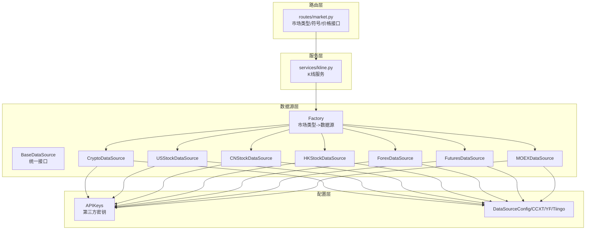
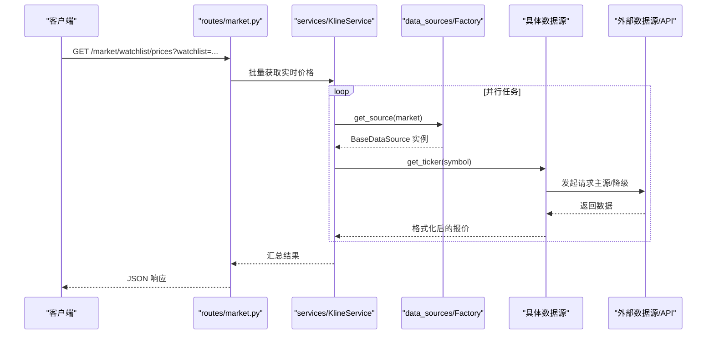
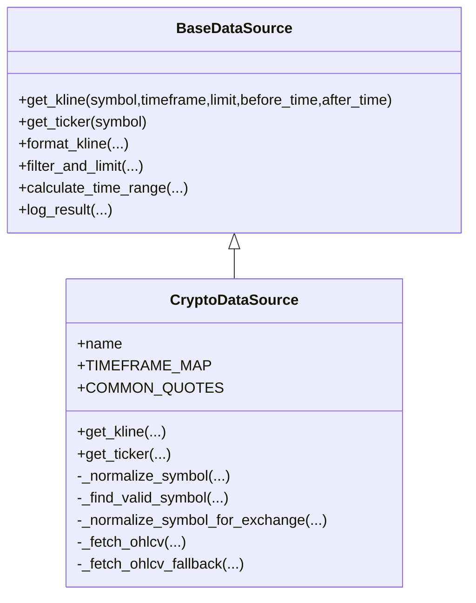
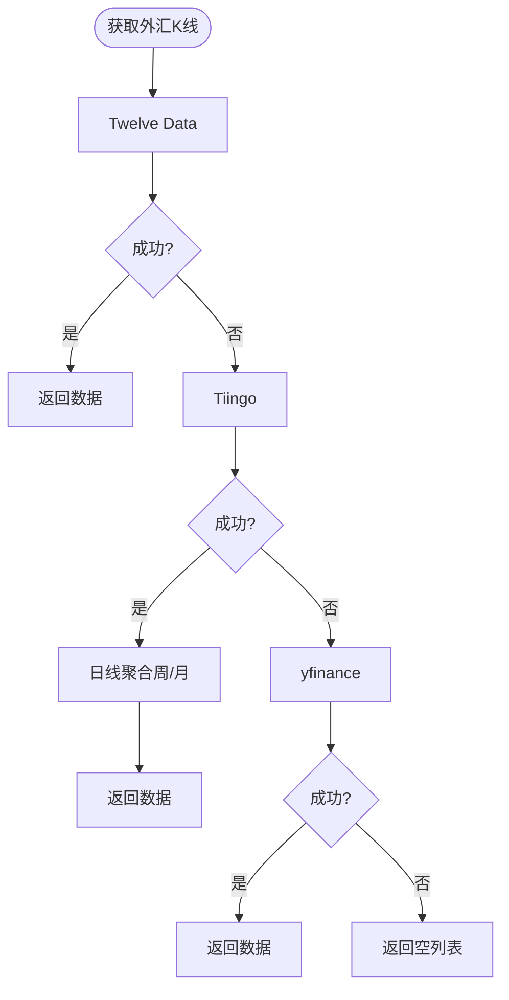
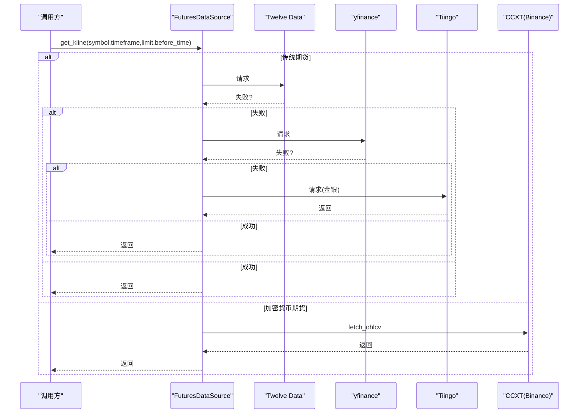
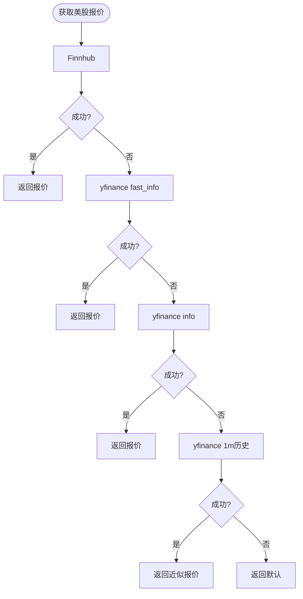
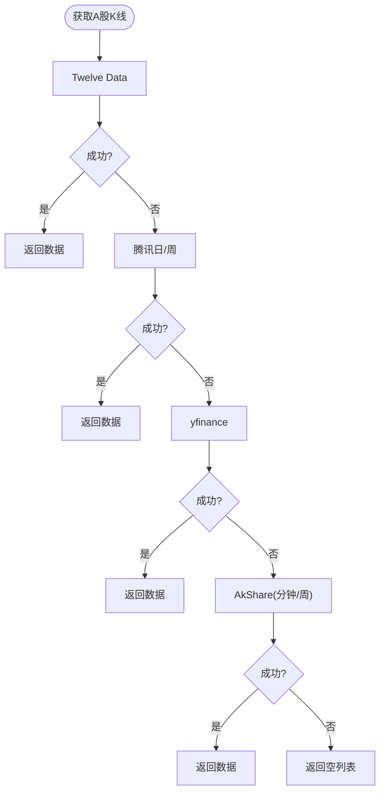
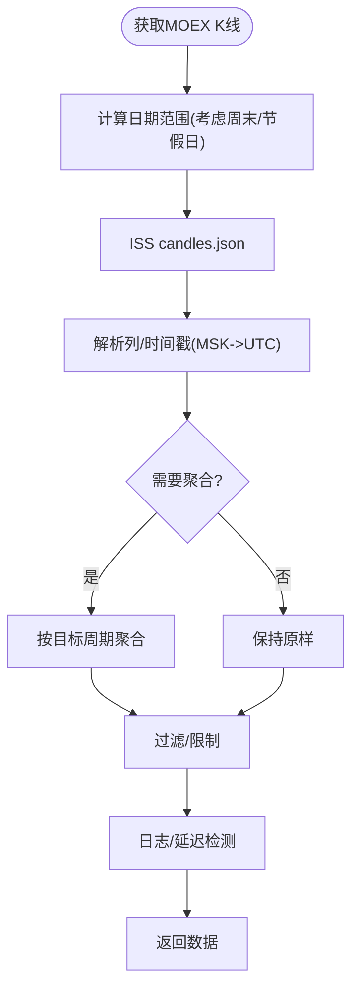
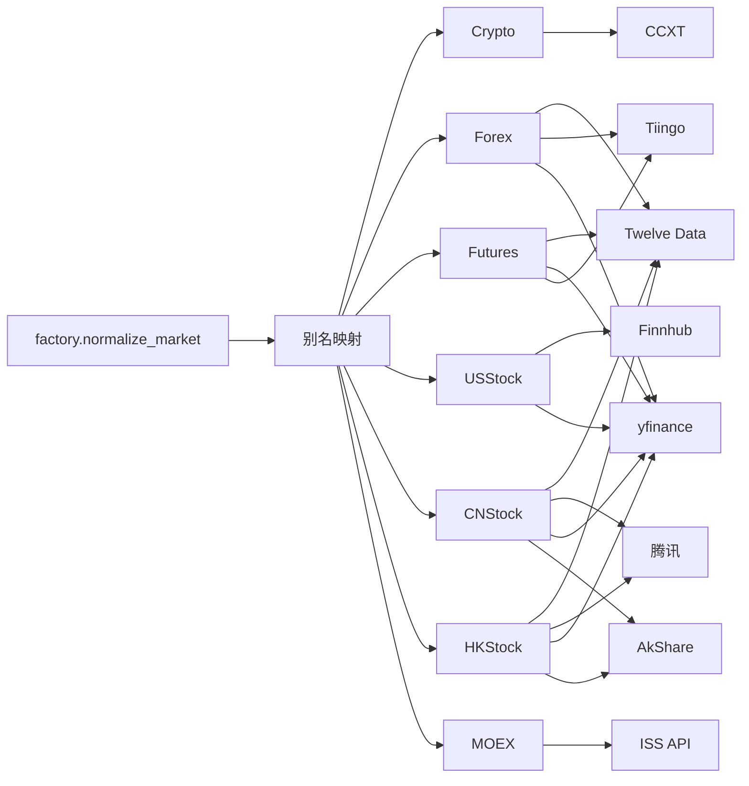

# 支持的市场类型

<cite>
**本文引用的文件**
- [base.py](file://backend_api_python/app/data_sources/base.py)
- [factory.py](file://backend_api_python/app/data_sources/factory.py)
- [crypto.py](file://backend_api_python/app/data_sources/crypto.py)
- [forex.py](file://backend_api_python/app/data_sources/forex.py)
- [futures.py](file://backend_api_python/app/data_sources/futures.py)
- [us_stock.py](file://backend_api_python/app/data_sources/us_stock.py)
- [cn_stock.py](file://backend_api_python/app/data_sources/cn_stock.py)
- [hk_stock.py](file://backend_api_python/app/data_sources/hk_stock.py)
- [moex.py](file://backend_api_python/app/data_sources/moex.py)
- [tencent.py](file://backend_api_python/app/data_sources/tencent.py)
- [asia_stock_kline.py](file://backend_api_python/app/data_sources/asia_stock_kline.py)
- [data_sources.py](file://backend_api_python/app/config/data_sources.py)
- [api_keys.py](file://backend_api_python/app/config/api_keys.py)
- [market.py](file://backend_api_python/app/routes/market.py)
</cite>

## 目录
1. [简介](#简介)
2. [项目结构](#项目结构)
3. [核心组件](#核心组件)
4. [架构总览](#架构总览)
5. [详细组件分析](#详细组件分析)
6. [依赖分析](#依赖分析)
7. [性能考量](#性能考量)
8. [故障排查指南](#故障排查指南)
9. [结论](#结论)
10. [附录](#附录)

## 简介
本文件系统性梳理 QuantDinger 支持的市场类型及其数据源实现与配置方法，覆盖加密货币、股票（美股、A股、港股、俄罗斯MOEX）、外汇、期货等市场。内容包括：
- 各市场的数据来源、时间周期映射、时间戳处理与交易时间规则
- 数据获取方式、API 限制与数据质量差异
- 配置示例、参数设置与使用注意事项
- 市场切换机制、数据标准化与跨市场数据整合方法
- 特殊处理需求与性能优化策略

## 项目结构
- 数据源层：以统一的基类接口定义 K 线与实时报价获取能力，具体市场通过工厂模式按“市场类型”选择对应数据源。
- 配置层：集中管理第三方 API Key 与数据源通用配置（超时、重试、限流等）。
- 路由层：对外暴露市场类型、符号搜索、自选股价格批量获取等接口。

图表来源
- [factory.py:33-112](file://backend_api_python/app/data_sources/factory.py#L33-L112)
- [base.py:28-180](file://backend_api_python/app/data_sources/base.py#L28-L180)
- [crypto.py:16-53](file://backend_api_python/app/data_sources/crypto.py#L16-L53)
- [us_stock.py:17-63](file://backend_api_python/app/data_sources/us_stock.py#L17-L63)
- [cn_stock.py:30-51](file://backend_api_python/app/data_sources/cn_stock.py#L30-L51)
- [hk_stock.py:30-51](file://backend_api_python/app/data_sources/hk_stock.py#L30-L51)
- [forex.py:104-127](file://backend_api_python/app/data_sources/forex.py#L104-L127)
- [futures.py:60-106](file://backend_api_python/app/data_sources/futures.py#L60-L106)
- [moex.py:57-70](file://backend_api_python/app/data_sources/moex.py#L57-L70)
- [data_sources.py:26-152](file://backend_api_python/app/config/data_sources.py#L26-L152)
- [api_keys.py:168-184](file://backend_api_python/app/config/api_keys.py#L168-L184)

章节来源
- [factory.py:13-112](file://backend_api_python/app/data_sources/factory.py#L13-L112)
- [market.py:93-143](file://backend_api_python/app/routes/market.py#L93-L143)

## 核心组件
- 统一基类 BaseDataSource：定义 get_kline、get_ticker、格式化与过滤工具、时间范围计算与延迟检测等通用能力。
- 工厂 DataSourceFactory：根据市场类型字符串映射到具体数据源实例，支持别名与向后兼容。
- 各市场数据源：分别实现 get_kline 与可选的 get_ticker，内置降级链路与错误处理。
- 配置模块：集中管理 API Key 与数据源通用配置（超时、重试、CCXT 时间周期映射、代理等）。

章节来源
- [base.py:28-180](file://backend_api_python/app/data_sources/base.py#L28-L180)
- [factory.py:33-112](file://backend_api_python/app/data_sources/factory.py#L33-L112)
- [data_sources.py:26-152](file://backend_api_python/app/config/data_sources.py#L26-L152)
- [api_keys.py:168-184](file://backend_api_python/app/config/api_keys.py#L168-L184)

## 架构总览
- 市场类型到数据源的映射通过工厂完成，路由层通过 K 线服务调用工厂获取数据源并执行查询。
- 数据源内部采用“主源 + 多级降级”的策略，保证在不同 API 限制与网络条件下稳定获取数据。
- 统一的时间戳处理与过滤逻辑确保跨市场的数据一致性。

图表来源
- [market.py:396-481](file://backend_api_python/app/routes/market.py#L396-L481)
- [factory.py:52-84](file://backend_api_python/app/data_sources/factory.py#L52-L84)
- [base.py:58-65](file://backend_api_python/app/data_sources/base.py#L58-L65)

## 详细组件分析

### 加密货币（Crypto）
- 数据源：基于 CCXT，支持主流交易所（默认可配置），自动加载 markets、符号规范化与交易所特性适配。
- 时间周期映射：使用 CCXTConfig.TIMEFRAME_MAP，支持 1m/5m/15m/30m/1H/4H/1D/1W。
- 符号规范化：支持多种输入格式（含 swap/futures 后缀、不同报价货币），自动查找有效符号并适配交易所格式。
- K 线获取：支持 before_time 与 after_time 边界，分页拉取避免交易所限制，去重与排序，最终截断与过滤。
- 实时报价：fetch_ticker，失败时回退至备用符号或返回默认值。
- 配置要点：CCXT 默认交易所、超时、代理、启用速率限制；可通过环境变量或附加配置覆盖。
- 性能与稳定性：分页与空档跳过、错误降级、日志记录与延迟检测。

图表来源
- [base.py:28-180](file://backend_api_python/app/data_sources/base.py#L28-L180)
- [crypto.py:16-428](file://backend_api_python/app/data_sources/crypto.py#L16-L428)
- [data_sources.py:102-152](file://backend_api_python/app/config/data_sources.py#L102-L152)

章节来源
- [crypto.py:16-428](file://backend_api_python/app/data_sources/crypto.py#L16-L428)
- [data_sources.py:102-152](file://backend_api_python/app/config/data_sources.py#L102-L152)

### 外汇（Forex）
- 数据源：三级降级链路（Twelve Data → Tiingo → yfinance），优先使用 Twelve Data，Tiingo 提供日线与周线聚合，yfinance 作为最后降级。
- 符号处理：统一 EURUSD/XAUUSD 等内部格式，映射到各服务商格式（Twelve Data、Tiingo、yfinance）。
- K 线获取：Twelve Data 直接返回 OHLC；Tiingo 日线聚合周线/月线；yfinance 读取历史数据。
- 实时报价：三路获取，缓存 60 秒，Tiingo 429 时返回旧缓存。
- 配置要点：Twelve Data 与 Tiingo API Key；Tiingo 1 分钟数据需付费；yfinance 无需密钥。
- 时间戳与周期：统一转换为 UTC 秒；周线/月线通过日线聚合实现。

图表来源
- [forex.py:314-344](file://backend_api_python/app/data_sources/forex.py#L314-L344)
- [forex.py:394-578](file://backend_api_python/app/data_sources/forex.py#L394-L578)
- [forex.py:663-708](file://backend_api_python/app/data_sources/forex.py#L663-L708)

章节来源
- [forex.py:104-709](file://backend_api_python/app/data_sources/forex.py#L104-L709)
- [api_keys.py:168-184](file://backend_api_python/app/config/api_keys.py#L168-L184)

### 期货（Futures）
- 数据源：传统期货（Twelve Data → yfinance → Tiingo 金银）与加密货币期货（CCXT Binance Futures）双通道。
- 符号识别：根据后缀（=F）或内置映射区分传统期货与加密货币期货。
- K 线获取：传统期货优先 Twelve Data，其次 yfinance，最后 Tiingo；加密货币期货直接走 CCXT。
- 实时报价：传统期货三路，加密货币期货走 CCXT。
- 配置要点：CCXT 默认交易所与时间周期映射；Tiingo API Key；Twelve Data API Key。

图表来源
- [futures.py:217-241](file://backend_api_python/app/data_sources/futures.py#L217-L241)
- [futures.py:242-261](file://backend_api_python/app/data_sources/futures.py#L242-L261)
- [futures.py:418-467](file://backend_api_python/app/data_sources/futures.py#L418-L467)

章节来源
- [futures.py:60-468](file://backend_api_python/app/data_sources/futures.py#L60-L468)
- [data_sources.py:102-152](file://backend_api_python/app/config/data_sources.py#L102-L152)

### 美国股票（USStock）
- 数据源：优先 Finnhub（实时），降级 yfinance（fast_info/info/history），最后近 1 分钟 K 线近似。
- 时间周期映射：INTERVAL_MAP 与 DAYS_MAP 控制请求天数与合并因子，分钟级支持 3m 合并。
- 实时报价：包含涨跌额、涨跌幅、昨收、当日高低价等字段。
- 配置要点：Finnhub API Key（可选）；yfinance 无需密钥。

图表来源
- [us_stock.py:64-174](file://backend_api_python/app/data_sources/us_stock.py#L64-L174)
- [us_stock.py:283-318](file://backend_api_python/app/data_sources/us_stock.py#L283-L318)

章节来源
- [us_stock.py:17-361](file://backend_api_python/app/data_sources/us_stock.py#L17-L361)
- [api_keys.py:168-184](file://backend_api_python/app/config/api_keys.py#L168-L184)

### 中国A股（CNStock）
- 数据源：多层降级（Twelve Data → 腾讯日/周 → yfinance → AkShare），分钟/小时优先 yfinance/AkShare。
- 符号处理：normalize_cn_code；腾讯 fqkline 日/周；yfinance 与 AkShare 作为降级。
- 配置要点：Twelve Data API Key（推荐）；腾讯无需密钥；AkShare 仅在海外不稳定时使用。

图表来源
- [cn_stock.py:53-124](file://backend_api_python/app/data_sources/cn_stock.py#L53-L124)
- [asia_stock_kline.py:170-268](file://backend_api_python/app/data_sources/asia_stock_kline.py#L170-L268)
- [tencent.py:193-239](file://backend_api_python/app/data_sources/tencent.py#L193-L239)

章节来源
- [cn_stock.py:30-125](file://backend_api_python/app/data_sources/cn_stock.py#L30-L125)
- [asia_stock_kline.py:1-605](file://backend_api_python/app/data_sources/asia_stock_kline.py#L1-L605)
- [tencent.py:24-239](file://backend_api_python/app/data_sources/tencent.py#L24-L239)

### 港股/H股（HKStock）
- 数据源：与 A 股类似，Twelve Data → 腾讯日/周 → yfinance → AkShare。
- 符号处理：normalize_hk_code；腾讯 fqkline 日/周；yfinance 与 AkShare 作为降级。
- 配置要点：Twelve Data API Key（推荐）；腾讯无需密钥；AkShare 仅在海外不稳定时使用。

章节来源
- [hk_stock.py:30-125](file://backend_api_python/app/data_sources/hk_stock.py#L30-L125)
- [asia_stock_kline.py:1-605](file://backend_api_python/app/data_sources/asia_stock_kline.py#L1-L605)
- [tencent.py:50-66](file://backend_api_python/app/data_sources/tencent.py#L50-L66)

### 俄罗斯MOEX（俄罗斯股票）
- 数据源：ISS 公共 API，仅支持历史 K 线与最新报价；不支持实盘下单。
- 时间周期映射：1m/1H/1D/1W；非原生周期（5m/15m/30m/4H）通过更高频聚合实现。
- 时间戳处理：ISS 返回莫斯科本地时间字符串，转换为 UTC 秒。
- 配置要点：无需 API Key；支持自定义 board；默认 TQBR。

图表来源
- [moex.py:158-268](file://backend_api_python/app/data_sources/moex.py#L158-L268)
- [moex.py:126-155](file://backend_api_python/app/data_sources/moex.py#L126-L155)

章节来源
- [moex.py:57-314](file://backend_api_python/app/data_sources/moex.py#L57-L314)

## 依赖分析
- 市场类型与数据源映射：工厂通过 normalize_market 与别名表将用户输入映射到具体数据源类。
- 外部依赖：各数据源依赖第三方 API（Twelve Data、Tiingo、Finnhub、CCXT、yfinance、AkShare、腾讯）。
- 配置依赖：API Key 与通用配置通过元类动态读取环境变量或附加配置。
- 路由依赖：市场类型接口、符号搜索、自选股价格批量获取依赖工厂与数据源。

图表来源
- [factory.py:42-50](file://backend_api_python/app/data_sources/factory.py#L42-L50)
- [factory.py:13-30](file://backend_api_python/app/data_sources/factory.py#L13-L30)
- [forex.py:122-127](file://backend_api_python/app/data_sources/forex.py#L122-L127)
- [futures.py:90-106](file://backend_api_python/app/data_sources/futures.py#L90-L106)
- [us_stock.py:53-62](file://backend_api_python/app/data_sources/us_stock.py#L53-L62)
- [cn_stock.py:65-76](file://backend_api_python/app/data_sources/cn_stock.py#L65-L76)
- [hk_stock.py:65-76](file://backend_api_python/app/data_sources/hk_stock.py#L65-L76)
- [moex.py:47-51](file://backend_api_python/app/data_sources/moex.py#L47-L51)

章节来源
- [factory.py:33-112](file://backend_api_python/app/data_sources/factory.py#L33-L112)
- [api_keys.py:168-184](file://backend_api_python/app/config/api_keys.py#L168-L184)

## 性能考量
- 统一过滤与截断：filter_and_limit 在回测场景中支持保留左边界，避免误删。
- 分页与聚合：加密货币与 MOEX 使用分页与聚合减少往返与提升覆盖率。
- 缓存与降级：外汇报价缓存 60 秒；当 API 限流时返回旧缓存；多级降级链路提升可用性。
- 并发与超时：批量价格获取使用线程池并发，设置超时与默认值兜底。
- 时区与时间戳：统一使用 UTC 秒，避免本地时区差异导致的延迟误判。

章节来源
- [base.py:106-180](file://backend_api_python/app/data_sources/base.py#L106-L180)
- [crypto.py:317-390](file://backend_api_python/app/data_sources/crypto.py#L317-L390)
- [forex.py:28-31](file://backend_api_python/app/data_sources/forex.py#L28-L31)
- [moex.py:126-155](file://backend_api_python/app/data_sources/moex.py#L126-L155)
- [market.py:31-41](file://backend_api_python/app/routes/market.py#L31-L41)

## 故障排查指南
- API Key 未配置
  - 现象：Twelve Data、Tiingo、Finnhub、CCXT 等数据源不可用或降级。
  - 排查：检查环境变量或附加配置中的 API Key 是否正确；确认计划等级满足需求。
  - 参考
    - [api_keys.py:168-184](file://backend_api_python/app/config/api_keys.py#L168-L184)
    - [forex.py:122-127](file://backend_api_python/app/data_sources/forex.py#L122-L127)
    - [us_stock.py:53-62](file://backend_api_python/app/data_sources/us_stock.py#L53-L62)
    - [futures.py:90-106](file://backend_api_python/app/data_sources/futures.py#L90-L106)
- 速率限制（429/配额不足）
  - 现象：Tiingo、Twelve Data 返回 429 或配额耗尽。
  - 排查：降低请求频率、升级计划、使用缓存或降级链路。
  - 参考
    - [forex.py:206-224](file://backend_api_python/app/data_sources/forex.py#L206-L224)
    - [forex.py:475-506](file://backend_api_python/app/data_sources/forex.py#L475-L506)
    - [asia_stock_kline.py:204-232](file://backend_api_python/app/data_sources/asia_stock_kline.py#L204-L232)
- 符号无效或交易所不支持
  - 现象：加密货币符号找不到、交易所返回 market does not exist。
  - 排查：使用符号规范化与有效符号查找；切换默认交易所或手动指定。
  - 参考
    - [crypto.py:70-174](file://backend_api_python/app/data_sources/crypto.py#L70-L174)
    - [crypto.py:200-230](file://backend_api_python/app/data_sources/crypto.py#L200-L230)
- 数据为空或延迟过大
  - 现象：K 线为空或最新时间戳远落后于当前时间。
  - 排查：检查 before_time/after_time 边界；确认时间周期映射与日历日/交易日差异。
  - 参考
    - [base.py:142-179](file://backend_api_python/app/data_sources/base.py#L142-L179)
    - [forex.py:570-661](file://backend_api_python/app/data_sources/forex.py#L570-L661)
    - [moex.py:177-194](file://backend_api_python/app/data_sources/moex.py#L177-L194)

章节来源
- [api_keys.py:168-184](file://backend_api_python/app/config/api_keys.py#L168-L184)
- [forex.py:206-224](file://backend_api_python/app/data_sources/forex.py#L206-L224)
- [crypto.py:70-174](file://backend_api_python/app/data_sources/crypto.py#L70-L174)
- [base.py:142-179](file://backend_api_python/app/data_sources/base.py#L142-L179)

## 结论
QuantDinger 通过统一的基类接口与工厂模式，将多市场、多数据源整合为一致的查询体验。各市场在 API 限制、数据质量与时区处理方面各有侧重，但均采用多级降级与缓存策略保障稳定性。建议在生产环境中：
- 明确配置 API Key 与超时参数
- 合理设置 before_time/after_time 与时间周期
- 利用缓存与降级链路提升可用性
- 在回测中使用 filter_and_limit 的 truncate 选项谨慎控制边界

## 附录

### 市场类型与别名对照
- 支持的市场类型：Crypto、USStock、CNStock、HKStock、Forex、Futures、MOEX
- 别名映射：如 crypto → Crypto，us_stocks → USStock，fx → Forex 等

章节来源
- [factory.py:13-50](file://backend_api_python/app/data_sources/factory.py#L13-L50)

### 时间周期与映射
- 统一周期映射（秒）：1m/5m/15m/30m/1H/4H/1D/1W
- 各数据源时间周期映射：
  - CCXT：1m/5m/15m/30m/1H/4H/1D/1W
  - yfinance（美股）：1m/5m/15m/30m/1H/4H/1D/1W
  - 十二数据（外汇/期货）：1m/5m/15m/30m/1H/4H/1D/1W（部分）
  - Tiingo（外汇/期货）：1m/5m/15m/30m/1H/4H/1D（部分）

章节来源
- [base.py:14-25](file://backend_api_python/app/data_sources/base.py#L14-L25)
- [data_sources.py:120-131](file://backend_api_python/app/config/data_sources.py#L120-L131)
- [us_stock.py:22-33](file://backend_api_python/app/data_sources/us_stock.py#L22-L33)
- [forex.py:109-113](file://backend_api_python/app/data_sources/forex.py#L109-L113)
- [futures.py:65-78](file://backend_api_python/app/data_sources/futures.py#L65-L78)

### 配置清单与示例要点
- API Key
  - TWELVE_DATA_API_KEY、TIINGO_API_KEY、FINNHUB_API_KEY、COINGLASS_API_KEY、CRYPTOQUANT_API_KEY 等
- 数据源通用配置
  - DATA_SOURCE_TIMEOUT、DATA_SOURCE_RETRY、DATA_SOURCE_RETRY_BACKOFF
  - CCXT_DEFAULT_EXCHANGE、CCXT_TIMEOUT、CCXT_PROXY
  - YFINANCE_TIMEOUT、FINNHUB_TIMEOUT、TIINGO_TIMEOUT
- 使用注意事项
  - 十二数据与 Tiingo 的免费额度有限，分钟级数据需付费
  - CCXT 代理需正确设置（PROXY_URL/HTTPS_PROXY/HTTP_PROXY/ALL_PROXY）
  - yfinance 在部分地区可能受限，建议配合 AkShare 降级

章节来源
- [api_keys.py:168-184](file://backend_api_python/app/config/api_keys.py#L168-L184)
- [data_sources.py:8-28](file://backend_api_python/app/config/data_sources.py#L8-L28)
- [data_sources.py:102-152](file://backend_api_python/app/config/data_sources.py#L102-L152)