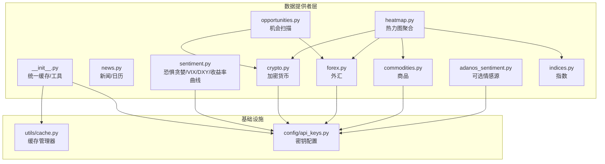
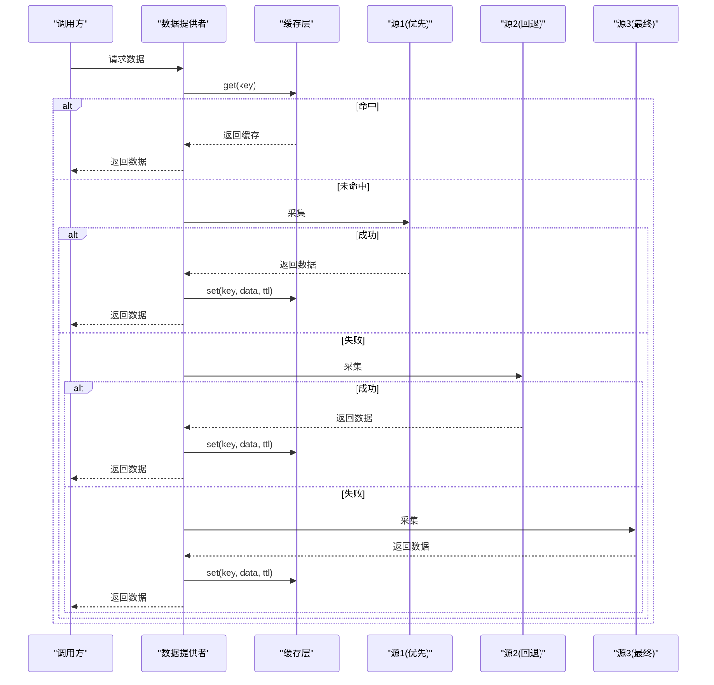
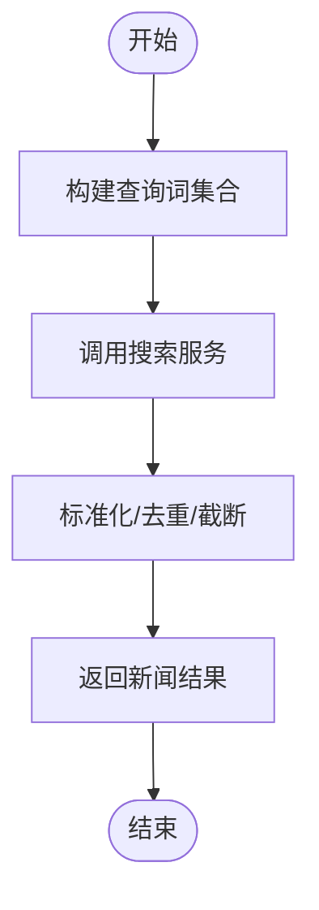
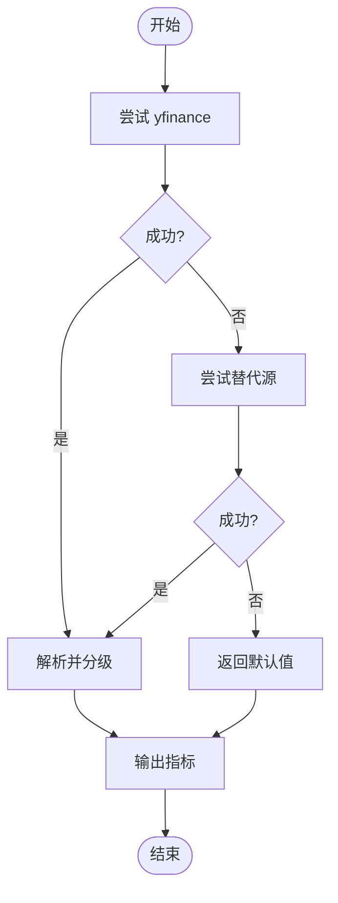
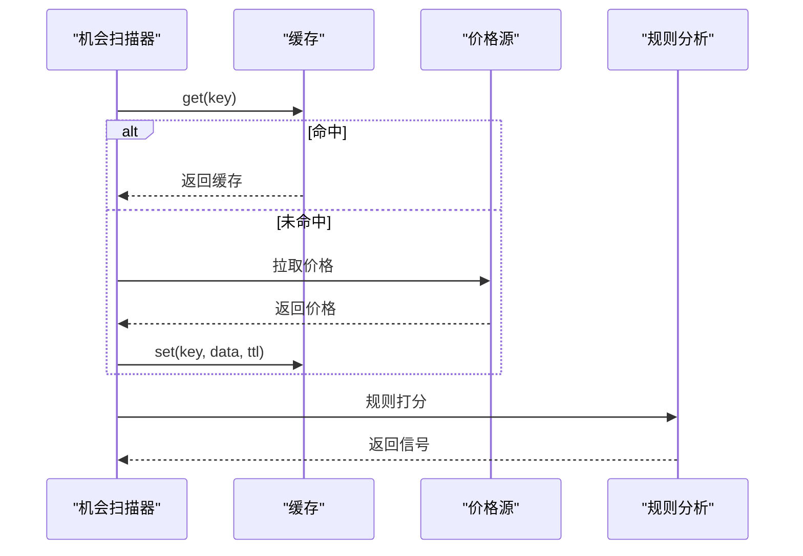
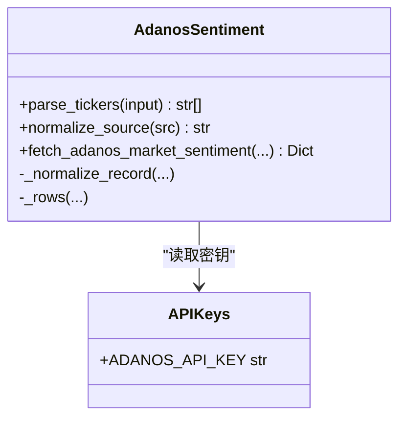
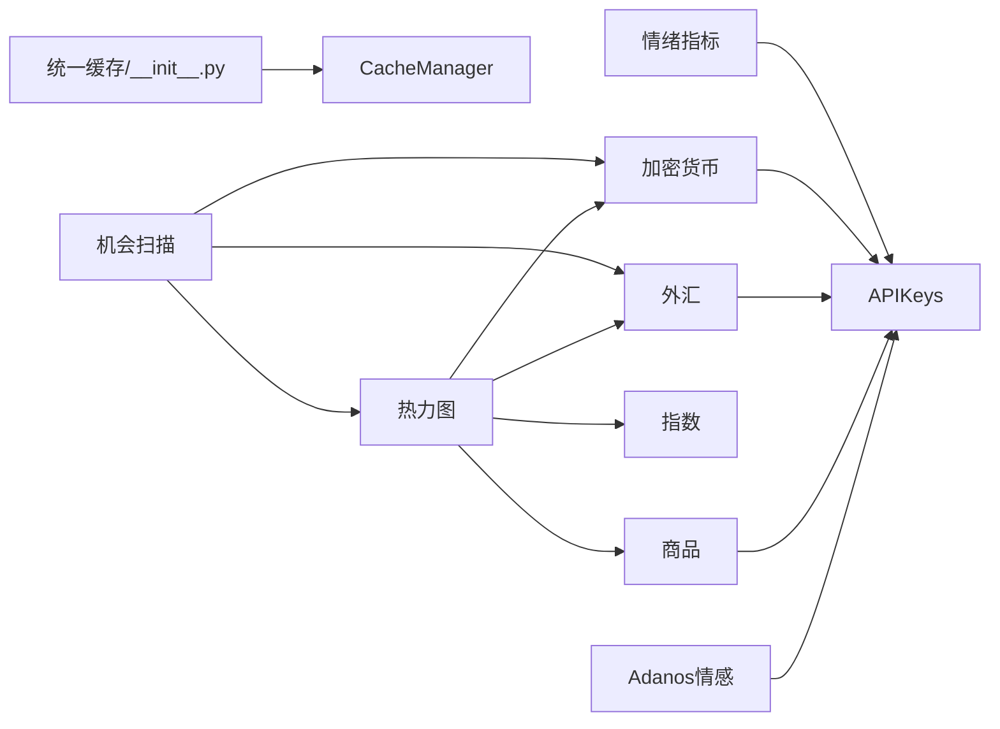

# 数据提供者

<cite>
**本文引用的文件**
- [backend_api_python/app/data_providers/__init__.py](file://backend_api_python/app/data_providers/__init__.py)
- [backend_api_python/app/data_providers/news.py](file://backend_api_python/app/data_providers/news.py)
- [backend_api_python/app/data_providers/sentiment.py](file://backend_api_python/app/data_providers/sentiment.py)
- [backend_api_python/app/data_providers/opportunities.py](file://backend_api_python/app/data_providers/opportunities.py)
- [backend_api_python/app/data_providers/adanos_sentiment.py](file://backend_api_python/app/data_providers/adanos_sentiment.py)
- [backend_api_python/app/data_providers/crypto.py](file://backend_api_python/app/data_providers/crypto.py)
- [backend_api_python/app/data_providers/forex.py](file://backend_api_python/app/data_providers/forex.py)
- [backend_api_python/app/data_providers/commodities.py](file://backend_api_python/app/data_providers/commodities.py)
- [backend_api_python/app/data_providers/indices.py](file://backend_api_python/app/data_providers/indices.py)
- [backend_api_python/app/data_providers/heatmap.py](file://backend_api_python/app/data_providers/heatmap.py)
- [backend_api_python/app/utils/cache.py](file://backend_api_python/app/utils/cache.py)
- [backend_api_python/app/config/api_keys.py](file://backend_api_python/app/config/api_keys.py)
</cite>

## 目录
1. [简介](#简介)
2. [项目结构](#项目结构)
3. [核心组件](#核心组件)
4. [架构总览](#架构总览)
5. [详细组件分析](#详细组件分析)
6. [依赖分析](#依赖分析)
7. [性能考虑](#性能考虑)
8. [故障排查指南](#故障排查指南)
9. [结论](#结论)
10. [附录](#附录)

## 简介
本文件系统化梳理“数据提供者”模块的设计与实现，覆盖新闻、市场情绪、机会识别、宏观与商品、外汇、指数、加密货币以及热力图聚合等辅助数据的采集、清洗、标准化与缓存策略。文档同时给出接口规范、数据格式、质量标准、更新频率与可靠性保障、配置方法、参数设置、使用示例，以及与主数据流的集成与融合策略。

## 项目结构
数据提供者位于后端应用的统一层，负责对各市场的基础与辅助数据进行采集与聚合，并通过统一缓存层对外提供服务。核心目录与文件如下：
- 统一入口与缓存：data_providers/__init__.py
- 辅助数据子模块：news.py、sentiment.py、opportunities.py、adanos_sentiment.py
- 市场数据子模块：crypto.py、forex.py、commodities.py、indices.py、heatmap.py
- 缓存基础设施：utils/cache.py
- 配置与密钥：config/api_keys.py

**图表来源**
- [backend_api_python/app/data_providers/__init__.py:1-86](file://backend_api_python/app/data_providers/__init__.py#L1-L86)
- [backend_api_python/app/data_providers/heatmap.py:1-147](file://backend_api_python/app/data_providers/heatmap.py#L1-L147)
- [backend_api_python/app/utils/cache.py:1-129](file://backend_api_python/app/utils/cache.py#L1-L129)
- [backend_api_python/app/config/api_keys.py:1-184](file://backend_api_python/app/config/api_keys.py#L1-L184)

**章节来源**
- [backend_api_python/app/data_providers/__init__.py:1-86](file://backend_api_python/app/data_providers/__init__.py#L1-L86)
- [backend_api_python/app/data_providers/heatmap.py:1-147](file://backend_api_python/app/data_providers/heatmap.py#L1-L147)
- [backend_api_python/app/utils/cache.py:1-129](file://backend_api_python/app/utils/cache.py#L1-L129)
- [backend_api_python/app/config/api_keys.py:1-184](file://backend_api_python/app/config/api_keys.py#L1-L184)

## 核心组件
- 统一缓存与工具
  - 提供统一的缓存键前缀(dp:)、默认TTL映射、按需懒加载缓存管理器、清理缓存、安全数值转换等能力。
  - TTL键包括：crypto_heatmap、forex_pairs、stock_indices、market_overview、market_heatmap、commodities、market_news、economic_calendar、market_sentiment、trading_opportunities；默认TTL为60秒。
- 失败开路设计
  - 对外提供“可选情感源”适配器，当未配置密钥时返回禁用状态而非抛错，确保系统可用性。

**章节来源**
- [backend_api_python/app/data_providers/__init__.py:23-86](file://backend_api_python/app/data_providers/__init__.py#L23-L86)
- [backend_api_python/app/data_providers/adanos_sentiment.py:144-205](file://backend_api_python/app/data_providers/adanos_sentiment.py#L144-L205)

## 架构总览
数据提供者采用“分层采集 + 多源回退 + 统一缓存”的架构：
- 分层采集：优先使用付费或高质量源，失败则回退到免费或替代源。
- 多源回退：如外汇优先Twelve Data，其次yfinance，最后Tiingo；商品同理。
- 统一缓存：通过统一的缓存管理器写入/读取，支持Redis与内存双栈，自动过期。

**图表来源**
- [backend_api_python/app/data_providers/forex.py:154-172](file://backend_api_python/app/data_providers/forex.py#L154-L172)
- [backend_api_python/app/data_providers/commodities.py:155-181](file://backend_api_python/app/data_providers/commodities.py#L155-L181)
- [backend_api_python/app/data_providers/crypto.py:118-170](file://backend_api_python/app/data_providers/crypto.py#L118-L170)
- [backend_api_python/app/data_providers/__init__.py:45-58](file://backend_api_python/app/data_providers/__init__.py#L45-L58)
- [backend_api_python/app/utils/cache.py:100-117](file://backend_api_python/app/utils/cache.py#L100-L117)

## 详细组件分析

### 新闻与经济日历
- 功能要点
  - 新闻抓取：按中英文查询词集合检索，去重并限制数量，输出统一字段集。
  - 经济日历：生成模板事件，按日期与时序分布，计算实际值与影响方向，标注重要性与影响描述。
- 输出规范
  - 新闻：字段包含标题、链接、摘要、来源、发布时间、分类、语言等。
  - 日历：字段包含名称、国家、日期时间、重要性、预测/前值、影响方向、是否已发布等。
- 更新频率与可靠性
  - 新闻：按天维度检索，去重后限制输出数量；依赖搜索引擎服务，失败不中断。
  - 日历：基于模板与随机扰动生成，实时性取决于是否已发布。
- 使用示例
  - 获取新闻：调用获取函数，传入语言参数，得到按语言分组的结果列表。
  - 获取日历：调用获取函数，得到排序后的事件列表。

**图表来源**
- [backend_api_python/app/data_providers/news.py:13-70](file://backend_api_python/app/data_providers/news.py#L13-L70)

**章节来源**
- [backend_api_python/app/data_providers/news.py:1-150](file://backend_api_python/app/data_providers/news.py#L1-L150)

### 市场情绪指标
- 支持指标
  - 恐惧与贪婪指数、VIX、美元指数(DXY)、10年期-2年期收益率曲线、VXN、GVZ、期权看跌/看涨比率代理。
- 数据来源与回退
  - 优先使用yfinance；失败则尝试国内替代库；最终返回默认值以保证可用性。
- 输出规范
  - 数值型字段：当前值、变化百分比、级别、解释文本等。
  - 特殊指标：如收益率曲线包含期限、利差、变化量与信号等级。
- 可靠性与容错
  - 指数为空或异常时返回默认值；网络请求设置超时；异常记录日志但不中断流程。

**图表来源**
- [backend_api_python/app/data_providers/sentiment.py:45-112](file://backend_api_python/app/data_providers/sentiment.py#L45-L112)
- [backend_api_python/app/data_providers/sentiment.py:114-182](file://backend_api_python/app/data_providers/sentiment.py#L114-L182)
- [backend_api_python/app/data_providers/sentiment.py:184-251](file://backend_api_python/app/data_providers/sentiment.py#L184-L251)

**章节来源**
- [backend_api_python/app/data_providers/sentiment.py:1-377](file://backend_api_python/app/data_providers/sentiment.py#L1-L377)

### 机会识别
- 能力范围
  - 加密货币、美股、港股/A股、外汇、预测市场等多市场机会扫描。
  - 基于24小时/7日涨跌幅阈值与趋势强度生成信号与影响方向。
- 数据来源
  - 加密货币：优先系统已有数据源，回退至yfinance或第三方API。
  - 股票：yfinance批量获取历史数据计算涨跌幅。
  - 外汇：Twelve Data优先，回退至yfinance/Tiingo。
  - 预测市场：调用专用数据源与分析器。
- 输出规范
  - 字段包含标的标识、名称、价格、涨跌幅、信号强度、原因、影响方向、市场类型、时间戳等。
- 缓存策略
  - 对常用数据设置缓存与TTL，降低重复拉取压力。

**图表来源**
- [backend_api_python/app/data_providers/opportunities.py:131-176](file://backend_api_python/app/data_providers/opportunities.py#L131-L176)
- [backend_api_python/app/data_providers/opportunities.py:178-216](file://backend_api_python/app/data_providers/opportunities.py#L178-L216)
- [backend_api_python/app/data_providers/opportunities.py:218-277](file://backend_api_python/app/data_providers/opportunities.py#L218-L277)
- [backend_api_python/app/data_providers/opportunities.py:279-319](file://backend_api_python/app/data_providers/opportunities.py#L279-L319)
- [backend_api_python/app/data_providers/opportunities.py:321-360](file://backend_api_python/app/data_providers/opportunities.py#L321-L360)

**章节来源**
- [backend_api_python/app/data_providers/opportunities.py:1-360](file://backend_api_python/app/data_providers/opportunities.py#L1-L360)

### 可选情感源（Adanos）
- 设计原则
  - 失败开路：未配置密钥时返回禁用状态，避免阻塞主流程。
  - 参数校验：支持多种输入形式与去重，严格校验票据代码格式。
  - 多源支持：支持Reddit/X/新闻/预测市场等源。
- 输出规范
  - 包含票据、公司名、来源、情感分数、热度、提及数、趋势历史等字段。
- 配置与密钥
  - 通过环境变量或附加配置注入API密钥；支持自定义基础URL与超时。

**图表来源**
- [backend_api_python/app/data_providers/adanos_sentiment.py:135-205](file://backend_api_python/app/data_providers/adanos_sentiment.py#L135-L205)
- [backend_api_python/app/config/api_keys.py:44-51](file://backend_api_python/app/config/api_keys.py#L44-L51)

**章节来源**
- [backend_api_python/app/data_providers/adanos_sentiment.py:1-205](file://backend_api_python/app/data_providers/adanos_sentiment.py#L1-L205)
- [backend_api_python/app/config/api_keys.py:1-184](file://backend_api_python/app/config/api_keys.py#L1-L184)

### 加密货币
- 数据来源与回退
  - 优先系统已有数据源；其次yfinance；最后第三方API。
- 输出规范
  - 字段包含符号、名称、价格、24小时涨跌幅、7日涨跌幅、市值、成交量、图片、类别等。
- 热力图
  - 支持从多个API抓取热力图数据并合并，按市值排序取前若干。

**章节来源**
- [backend_api_python/app/data_providers/crypto.py:1-232](file://backend_api_python/app/data_providers/crypto.py#L1-L232)

### 外汇
- 数据来源与回退
  - 优先Twelve Data；其次yfinance；最后Tiingo。
- 输出规范
  - 字段包含符号、名称、价格、涨跌幅、基础/报价货币、类别等。
- 适用场景
  - 作为机会扫描与热力图的基础数据。

**章节来源**
- [backend_api_python/app/data_providers/forex.py:1-172](file://backend_api_python/app/data_providers/forex.py#L1-L172)

### 商品
- 数据来源与回退
  - 优先Twelve Data；其次yfinance；Tiingo仅用于特定标的。
- 输出规范
  - 字段包含符号、名称、价格、涨跌幅、单位、类别等。

**章节来源**
- [backend_api_python/app/data_providers/commodities.py:1-181](file://backend_api_python/app/data_providers/commodities.py#L1-L181)

### 指数
- 数据来源
  - 使用yfinance批量获取主要股指的历史数据，计算涨跌幅。
- 输出规范
  - 字段包含符号、名称、价格、涨跌幅、地区、经纬度、类别等。

**章节来源**
- [backend_api_python/app/data_providers/indices.py:1-88](file://backend_api_python/app/data_providers/indices.py#L1-L88)

### 热力图聚合
- 聚合范围
  - 加密货币（按市值排序）、外汇、商品、股指板块、主要指数。
- 数据来源
  - 调用各子模块的缓存/抓取逻辑，统一标准化输出。
- 输出规范
  - 字段包含名称、中文名、英文名、数值（涨跌幅）、价格、单位/市值/成交量等。

**章节来源**
- [backend_api_python/app/data_providers/heatmap.py:1-147](file://backend_api_python/app/data_providers/heatmap.py#L1-L147)

## 依赖分析
- 组件耦合
  - 统一缓存层被所有数据提供者共享，降低重复实现与提升一致性。
  - 机会扫描与热力图聚合依赖各子模块的数据抓取与缓存。
- 外部依赖
  - yfinance、requests、第三方API（Twelve Data、Tiingo、CoinGecko、CoinCap、Adanos等）。
- 配置依赖
  - API密钥通过集中配置类读取，支持环境变量与附加配置。

**图表来源**
- [backend_api_python/app/data_providers/__init__.py:39-58](file://backend_api_python/app/data_providers/__init__.py#L39-L58)
- [backend_api_python/app/data_providers/opportunities.py:1-360](file://backend_api_python/app/data_providers/opportunities.py#L1-L360)
- [backend_api_python/app/data_providers/heatmap.py:1-147](file://backend_api_python/app/data_providers/heatmap.py#L1-L147)
- [backend_api_python/app/config/api_keys.py:1-184](file://backend_api_python/app/config/api_keys.py#L1-L184)

**章节来源**
- [backend_api_python/app/data_providers/__init__.py:1-86](file://backend_api_python/app/data_providers/__init__.py#L1-L86)
- [backend_api_python/app/data_providers/opportunities.py:1-360](file://backend_api_python/app/data_providers/opportunities.py#L1-L360)
- [backend_api_python/app/data_providers/heatmap.py:1-147](file://backend_api_python/app/data_providers/heatmap.py#L1-L147)
- [backend_api_python/app/config/api_keys.py:1-184](file://backend_api_python/app/config/api_keys.py#L1-L184)

## 性能考虑
- 缓存策略
  - 为高频访问的数据设置合理的TTL，减少外部依赖压力；支持Redis与内存双栈，按需启用。
- 批量拉取
  - 对yfinance等批量接口进行批量Ticker请求，降低HTTP次数。
- 回退链路
  - 优先级明确、短路条件合理，避免无效重试。
- 数值清洗
  - 统一的安全数值转换函数，防止异常导致流程中断。

**章节来源**
- [backend_api_python/app/data_providers/__init__.py:23-86](file://backend_api_python/app/data_providers/__init__.py#L23-L86)
- [backend_api_python/app/utils/cache.py:1-129](file://backend_api_python/app/utils/cache.py#L1-L129)
- [backend_api_python/app/data_providers/crypto.py:74-112](file://backend_api_python/app/data_providers/crypto.py#L74-L112)
- [backend_api_python/app/data_providers/forex.py:68-102](file://backend_api_python/app/data_providers/forex.py#L68-L102)
- [backend_api_python/app/data_providers/commodities.py:67-105](file://backend_api_python/app/data_providers/commodities.py#L67-L105)

## 故障排查指南
- 常见问题
  - 外部API密钥未配置：检查对应密钥项是否在配置中正确设置。
  - 网络超时或返回异常：查看日志中的错误信息，确认超时与状态码。
  - 数据为空：确认回退链路是否全部失败，必要时切换到备用源或调整参数。
- 定位步骤
  - 查看统一日志输出，定位具体模块与调用栈。
  - 清理缓存后重试，验证是否为缓存污染。
  - 检查Redis连接状态（若启用），或切换为内存缓存模式。
- 建议
  - 为关键路径设置更短TTL以快速恢复，同时保留默认TTL作为稳定态。
  - 对可选功能（如Adanos）保持失败开路，确保主流程不受影响。

**章节来源**
- [backend_api_python/app/data_providers/sentiment.py:34-42](file://backend_api_python/app/data_providers/sentiment.py#L34-L42)
- [backend_api_python/app/data_providers/adanos_sentiment.py:177-197](file://backend_api_python/app/data_providers/adanos_sentiment.py#L177-L197)
- [backend_api_python/app/utils/cache.py:77-98](file://backend_api_python/app/utils/cache.py#L77-L98)

## 结论
数据提供者模块通过统一缓存、多源回退与标准化输出，实现了对新闻、情绪、机会、宏观与商品、外汇、指数、加密货币及热力图的高效集成。其失败开路设计与灵活配置，既保证了系统的鲁棒性，也为扩展更多数据源提供了清晰的接口与最佳实践。

## 附录

### 接口规范与数据格式
- 通用
  - 统一缓存键前缀：dp:xxx；默认TTL：60秒；可配置TTL键集合参见统一初始化文件。
  - 安全数值转换：统一的数值清洗函数，异常时返回默认值。
- 新闻
  - 输入：语言参数（all/cn/en）。
  - 输出：按语言分组的新闻列表，每条包含标题、链接、摘要、来源、发布时间、分类、语言等字段。
- 经济日历
  - 输出：事件列表，包含名称、国家、日期时间、重要性、预测/前值、影响方向、是否已发布等。
- 情绪指标
  - 输出：指标字典，包含数值、变化、级别、解释文本、来源等。
- 机会扫描
  - 输出：信号列表，包含标的、名称、价格、涨跌幅、信号强度、原因、影响方向、市场类型、时间戳等。
- 热力图
  - 输出：聚合字典，包含加密货币、外汇、商品、板块、指数等子项，每项包含名称、数值、价格等字段。

**章节来源**
- [backend_api_python/app/data_providers/__init__.py:23-86](file://backend_api_python/app/data_providers/__init__.py#L23-L86)
- [backend_api_python/app/data_providers/news.py:13-70](file://backend_api_python/app/data_providers/news.py#L13-L70)
- [backend_api_python/app/data_providers/sentiment.py:12-42](file://backend_api_python/app/data_providers/sentiment.py#L12-L42)
- [backend_api_python/app/data_providers/opportunities.py:131-176](file://backend_api_python/app/data_providers/opportunities.py#L131-L176)
- [backend_api_python/app/data_providers/heatmap.py:20-147](file://backend_api_python/app/data_providers/heatmap.py#L20-L147)

### 更新频率与可靠性
- 更新频率
  - 新闻：按天检索；日历：模板生成；机会扫描：按缓存TTL刷新；热力图：按各自TTL刷新。
- 可靠性
  - 多源回退链路；失败开路；日志记录；默认值兜底；缓存过期控制。

**章节来源**
- [backend_api_python/app/data_providers/__init__.py:23-36](file://backend_api_python/app/data_providers/__init__.py#L23-L36)
- [backend_api_python/app/data_providers/opportunities.py:180-185](file://backend_api_python/app/data_providers/opportunities.py#L180-L185)
- [backend_api_python/app/data_providers/heatmap.py:30-55](file://backend_api_python/app/data_providers/heatmap.py#L30-L55)

### 配置方法与参数
- 密钥配置
  - 通过环境变量或附加配置注入，支持多源密钥；Adanos情感支持自定义基础URL与超时。
- 缓存配置
  - 通过配置开关启用Redis，否则使用内存缓存；统一的TTL映射与默认TTL。
- 参数设置
  - 机会扫描：阈值、市场类型、数量限制等；情感源：源类型、天数、超时等。

**章节来源**
- [backend_api_python/app/config/api_keys.py:1-184](file://backend_api_python/app/config/api_keys.py#L1-L184)
- [backend_api_python/app/data_providers/adanos_sentiment.py:124-143](file://backend_api_python/app/data_providers/adanos_sentiment.py#L124-L143)
- [backend_api_python/app/data_providers/opportunities.py:59-124](file://backend_api_python/app/data_providers/opportunities.py#L59-L124)
- [backend_api_python/app/data_providers/__init__.py:23-36](file://backend_api_python/app/data_providers/__init__.py#L23-L36)

### 使用示例
- 获取新闻与日历
  - 调用相应函数，传入语言或无需参数，获得结构化结果。
- 获取情绪指标
  - 直接调用各指标函数，得到标准化字典。
- 扫描机会
  - 调用机会扫描函数，传入市场类型与参数，得到信号列表。
- 生成热力图
  - 调用热力图聚合函数，得到跨市场的标准化数据。

**章节来源**
- [backend_api_python/app/data_providers/news.py:13-70](file://backend_api_python/app/data_providers/news.py#L13-L70)
- [backend_api_python/app/data_providers/sentiment.py:12-42](file://backend_api_python/app/data_providers/sentiment.py#L12-L42)
- [backend_api_python/app/data_providers/opportunities.py:131-176](file://backend_api_python/app/data_providers/opportunities.py#L131-L176)
- [backend_api_python/app/data_providers/heatmap.py:20-147](file://backend_api_python/app/data_providers/heatmap.py#L20-L147)

### 数据清洗与标准化
- 清洗策略
  - 统一数值转换、异常捕获、默认值填充、字段规范化。
- 标准化
  - 统一字段命名与类型，确保跨模块一致的数据契约。

**章节来源**
- [backend_api_python/app/data_providers/__init__.py:80-86](file://backend_api_python/app/data_providers/__init__.py#L80-L86)
- [backend_api_python/app/data_providers/crypto.py:144-169](file://backend_api_python/app/data_providers/crypto.py#L144-L169)
- [backend_api_python/app/data_providers/forex.py:44-54](file://backend_api_python/app/data_providers/forex.py#L44-L54)
- [backend_api_python/app/data_providers/commodities.py:42-50](file://backend_api_python/app/data_providers/commodities.py#L42-L50)

### 与主数据流的集成与融合
- 集成点
  - 机会扫描与热力图作为主数据流的辅助输入，驱动策略建议与可视化。
- 融合策略
  - 以标准化字段为契约，按市场类型与信号强度进行加权融合，输出统一的信号矩阵。

**章节来源**
- [backend_api_python/app/data_providers/opportunities.py:131-176](file://backend_api_python/app/data_providers/opportunities.py#L131-L176)
- [backend_api_python/app/data_providers/heatmap.py:43-147](file://backend_api_python/app/data_providers/heatmap.py#L43-L147)