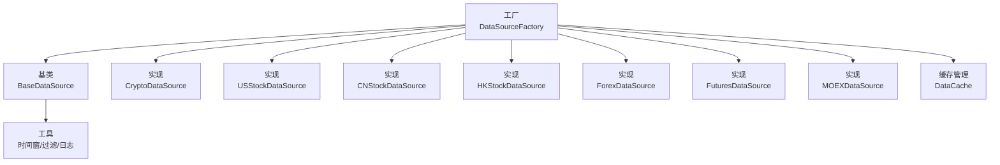
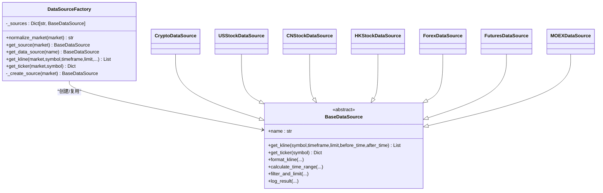
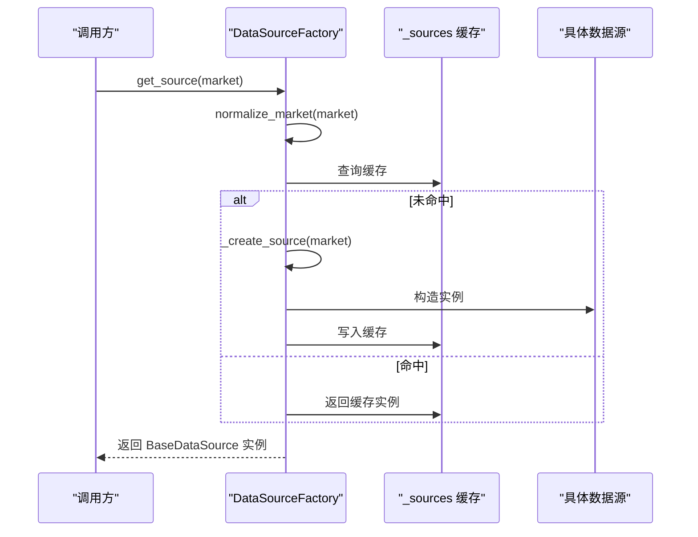
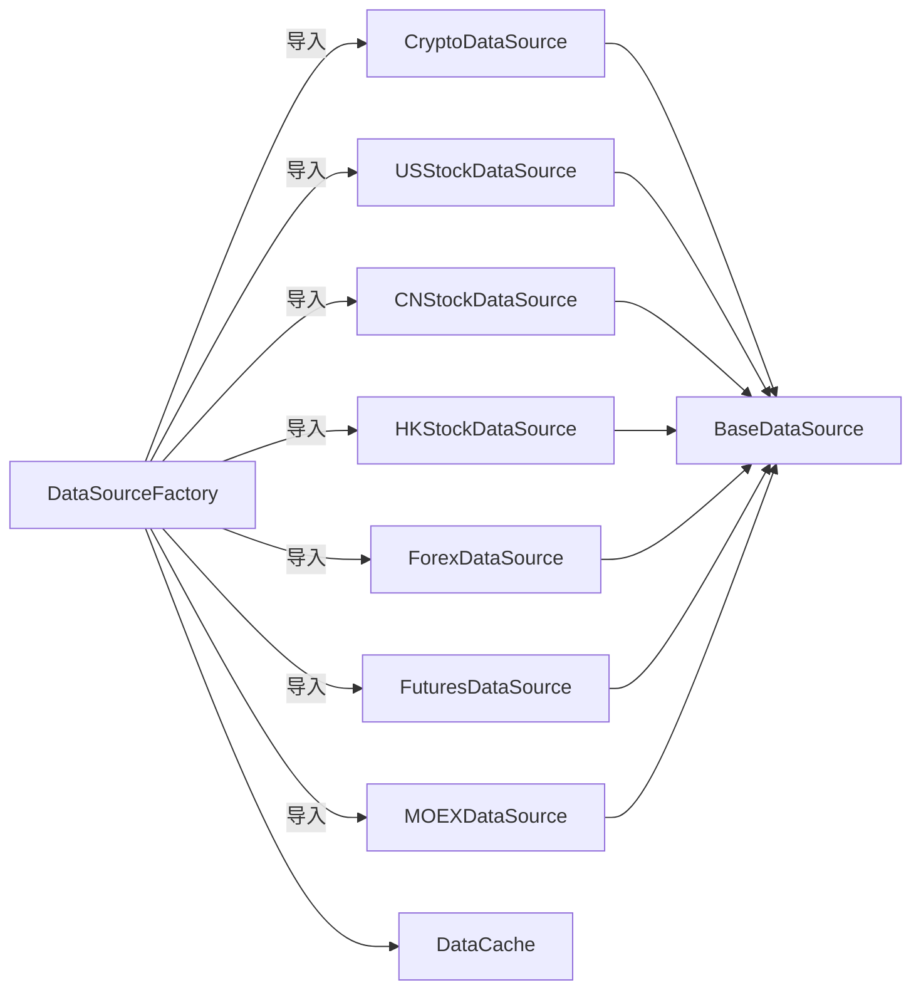

# 数据源工厂

<cite>
**本文引用的文件**
- [factory.py](file://backend_api_python/app/data_sources/factory.py)
- [base.py](file://backend_api_python/app/data_sources/base.py)
- [cache_manager.py](file://backend_api_python/app/data_sources/cache_manager.py)
- [errors.py](file://backend_api_python/app/data_sources/errors.py)
- [crypto.py](file://backend_api_python/app/data_sources/crypto.py)
- [us_stock.py](file://backend_api_python/app/data_sources/us_stock.py)
- [cn_stock.py](file://backend_api_python/app/data_sources/cn_stock.py)
- [hk_stock.py](file://backend_api_python/app/data_sources/hk_stock.py)
- [forex.py](file://backend_api_python/app/data_sources/forex.py)
- [futures.py](file://backend_api_python/app/data_sources/futures.py)
- [moex.py](file://backend_api_python/app/data_sources/moex.py)
- [__init__.py](file://backend_api_python/app/data_sources/__init__.py)
- [test_moex_data_source.py](file://tests/test_moex_data_source.py)
</cite>

## 目录
1. [简介](#简介)
2. [项目结构](#项目结构)
3. [核心组件](#核心组件)
4. [架构总览](#架构总览)
5. [详细组件分析](#详细组件分析)
6. [依赖关系分析](#依赖关系分析)
7. [性能考量](#性能考量)
8. [故障排查指南](#故障排查指南)
9. [结论](#结论)
10. [附录](#附录)

## 简介
本文件系统化阐述“数据源工厂”的设计与实现，重点包括：
- 工厂模式的设计理念与优势
- 市场类型标准化与别名映射机制
- 数据源实例缓存策略
- 支持的市场类型及对应实现类
- 数据源获取方法与便捷接口
- 错误处理与容错策略
- 性能优化建议与扩展新数据源的方法

## 项目结构
数据源工厂位于后端 Python 包的 data_sources 子模块中，采用“工厂 + 基类 + 多实现 + 缓存”的分层组织方式：
- 工厂层：集中创建与复用各市场数据源实例
- 基类层：统一接口与通用工具（时间窗计算、过滤、日志）
- 实现层：按市场划分的具体数据源（加密货币、美股、A股、港股、外汇、期货、MOEX）
- 缓存层：全局数据缓存管理器，提供 TTL/LRU 等能力

图表来源
- [factory.py:33-112](file://backend_api_python/app/data_sources/factory.py#L33-L112)
- [base.py:28-180](file://backend_api_python/app/data_sources/base.py#L28-L180)
- [cache_manager.py:44-233](file://backend_api_python/app/data_sources/cache_manager.py#L44-L233)

章节来源
- [factory.py:1-178](file://backend_api_python/app/data_sources/factory.py#L1-L178)
- [__init__.py:1-52](file://backend_api_python/app/data_sources/__init__.py#L1-L52)

## 核心组件
- 工厂类 DataSourceFactory：负责市场类型标准化、实例缓存、便捷接口与错误处理
- 基类 BaseDataSource：定义统一接口与通用工具（时间窗、过滤、日志）
- 实现类：按市场划分的具体数据源，均继承自 BaseDataSource
- 缓存管理：DataCache 提供 TTL/LRU/线程安全等能力

章节来源
- [factory.py:33-178](file://backend_api_python/app/data_sources/factory.py#L33-L178)
- [base.py:28-180](file://backend_api_python/app/data_sources/base.py#L28-L180)
- [cache_manager.py:44-233](file://backend_api_python/app/data_sources/cache_manager.py#L44-L233)

## 架构总览
工厂模式在此处体现为：
- 统一入口：通过市场类型字符串创建对应数据源实例
- 单例缓存：同一市场类型仅创建一次实例，避免重复初始化
- 接口统一：所有实现遵循 BaseDataSource 的 get_kline/get_ticker 约定
- 可扩展：新增市场只需在工厂映射与创建分支中添加实现

图表来源
- [factory.py:33-112](file://backend_api_python/app/data_sources/factory.py#L33-L112)
- [base.py:28-180](file://backend_api_python/app/data_sources/base.py#L28-L180)
- [crypto.py:16-428](file://backend_api_python/app/data_sources/crypto.py#L16-L428)
- [us_stock.py:17-361](file://backend_api_python/app/data_sources/us_stock.py#L17-L361)
- [cn_stock.py:30-125](file://backend_api_python/app/data_sources/cn_stock.py#L30-L125)
- [hk_stock.py:30-125](file://backend_api_python/app/data_sources/hk_stock.py#L30-L125)
- [forex.py:104-709](file://backend_api_python/app/data_sources/forex.py#L104-L709)
- [futures.py:60-468](file://backend_api_python/app/data_sources/futures.py#L60-L468)
- [moex.py:57-314](file://backend_api_python/app/data_sources/moex.py#L57-L314)

## 详细组件分析

### 工厂类：DataSourceFactory
- 市场标准化与别名映射
  - normalize_market：将输入标准化为 PascalCase 市场键，内置别名表覆盖常见拼写
  - 支持别名：crypto/cryptocurrency → Crypto；forex/fx → Forex；usstock/us_stocks/stock → USStock；cnstock → CNStock；hkstock → HKStock；futures → Futures；moex/rustock/rustocks/russianstock/russia → MOEX
- 实例缓存
  - _sources 字典按市场键缓存已创建实例，避免重复初始化
- 创建与兼容接口
  - _create_source：根据标准化市场键导入对应实现类并构造实例
  - get_data_source：向后兼容旧调用路径（如历史模块使用交易所名称获取 Crypto）
- 便捷接口
  - get_kline：统一获取 K 线，自动排序并记录日志
  - get_ticker：统一获取实时报价，具备降级与容错
- 错误处理
  - 对未知市场抛出 UnsupportedMarketError
  - 对异常进行捕获与日志记录，必要时返回空结果或默认值

图表来源
- [factory.py:41-112](file://backend_api_python/app/data_sources/factory.py#L41-L112)

章节来源
- [factory.py:33-178](file://backend_api_python/app/data_sources/factory.py#L33-L178)
- [errors.py:8-15](file://backend_api_python/app/data_sources/errors.py#L8-L15)

### 基类：BaseDataSource
- 统一接口
  - get_kline：获取 K 线，支持 before_time/after_time 窗口过滤
  - get_ticker：可选接口，默认抛出 NotImplmentedError
- 通用工具
  - format_kline：统一格式化输出字段精度
  - calculate_time_range：基于时间周期估算请求范围
  - filter_and_limit：按时间窗过滤与截断
  - log_result：记录最新 K 线时间差并给出延迟告警

章节来源
- [base.py:28-180](file://backend_api_python/app/data_sources/base.py#L28-L180)

### 缓存管理：DataCache
- 特性
  - TTL 过期、LRU 淘汰、最大容量控制、线程安全
- 全局缓存实例
  - 实时行情缓存、K线缓存、股票信息缓存，分别设定默认 TTL 与容量
- 关键方法
  - get/set/delete/clear/cleanup_expired/stats：读写删清、清理过期与统计

章节来源
- [cache_manager.py:44-233](file://backend_api_python/app/data_sources/cache_manager.py#L44-L233)

### 支持的市场类型与实现类
- Crypto（加密货币）
  - 实现类：CryptoDataSource
  - 特点：基于 CCXT，支持多交易所、符号规范化、降级获取
- USStock（美股）
  - 实现类：USStockDataSource
  - 特点：优先 Finnhub，降级 yfinance，支持多周期映射与合并
- CNStock（中国A股）
  - 实现类：CNStockDataSource
  - 特点：多层降级（TwelveData → Tencent → yfinance → AkShare）
- HKStock（港股/H股）
  - 实现类：HKStockDataSource
  - 特点：与 CNStock 类似的多层降级策略
- Forex（外汇）
  - 实现类：ForexDataSource
  - 特点：Twelve Data → Tiingo → yfinance 三级降级；内部符号归一化与缓存
- Futures（期货）
  - 实现类：FuturesDataSource
  - 特点：传统期货（Twelve Data → yfinance → Tiingo）与加密货币期货（CCXT）
- MOEX（俄罗斯交易所）
  - 实现类：MOEXDataSource
  - 特点：ISS 公共 API，支持日/周等原生周期与细粒度周期的重采样

章节来源
- [factory.py:87-112](file://backend_api_python/app/data_sources/factory.py#L87-L112)
- [crypto.py:16-428](file://backend_api_python/app/data_sources/crypto.py#L16-L428)
- [us_stock.py:17-361](file://backend_api_python/app/data_sources/us_stock.py#L17-L361)
- [cn_stock.py:30-125](file://backend_api_python/app/data_sources/cn_stock.py#L30-L125)
- [hk_stock.py:30-125](file://backend_api_python/app/data_sources/hk_stock.py#L30-L125)
- [forex.py:104-709](file://backend_api_python/app/data_sources/forex.py#L104-L709)
- [futures.py:60-468](file://backend_api_python/app/data_sources/futures.py#L60-L468)
- [moex.py:57-314](file://backend_api_python/app/data_sources/moex.py#L57-L314)

### 数据源获取方法与便捷接口
- 获取实例
  - get_source(market)：按标准化市场键获取数据源实例（带缓存）
  - get_data_source(name)：向后兼容，按名称映射到对应市场
- 获取数据
  - get_kline(market, symbol, timeframe, limit, before_time, after_time)：统一 K 线入口，自动排序与异常处理
  - get_ticker(market, symbol)：统一报价入口，具备降级与容错
- 使用示例（路径引用）
  - 获取加密货币 K 线：[factory.py:114-149](file://backend_api_python/app/data_sources/factory.py#L114-L149)
  - 获取实时报价：[factory.py:150-177](file://backend_api_python/app/data_sources/factory.py#L150-L177)

章节来源
- [factory.py:52-178](file://backend_api_python/app/data_sources/factory.py#L52-L178)

### 错误处理机制
- 未知市场类型
  - 抛出 UnsupportedMarketError，并记录错误日志
- 接口未实现
  - get_ticker 未实现时返回默认结构并记录警告
- 异常捕获
  - get_kline/get_ticker 捕获异常并记录日志，返回空结果或默认值，保证调用方健壮性

章节来源
- [errors.py:8-15](file://backend_api_python/app/data_sources/errors.py#L8-L15)
- [factory.py:146-177](file://backend_api_python/app/data_sources/factory.py#L146-L177)

## 依赖关系分析
- 工厂对实现类的依赖为运行时导入，降低启动时耦合
- 实现类均依赖 BaseDataSource，共享统一工具与日志
- 缓存管理器独立于工厂，可被实现类复用（如 ForexDataSource 内部缓存）

图表来源
- [factory.py:87-112](file://backend_api_python/app/data_sources/factory.py#L87-L112)
- [base.py:28-180](file://backend_api_python/app/data_sources/base.py#L28-L180)
- [cache_manager.py:44-233](file://backend_api_python/app/data_sources/cache_manager.py#L44-L233)

章节来源
- [factory.py:33-112](file://backend_api_python/app/data_sources/factory.py#L33-L112)
- [__init__.py:10-51](file://backend_api_python/app/data_sources/__init__.py#L10-L51)

## 性能考量
- 实例缓存
  - 工厂缓存避免重复初始化，降低网络与解析开销
- 时间窗与过滤
  - calculate_time_range 与 filter_and_limit 减少无效数据传输与处理
- 缓存管理
  - DataCache 的 TTL/LRU 与线程安全提升并发场景下的命中率与稳定性
- 降级策略
  - 多实现类的降级链路在上游不可用时快速切换，保障可用性
- 注意事项
  - 对高频调用建议结合 DataCache 或业务侧缓存
  - 注意外部 API 的速率限制与退避策略（实现类中已有相应处理）

[本节为通用指导，无需特定文件引用]

## 故障排查指南
- 常见问题
  - 市场类型不识别：检查 normalize_market 输入是否符合别名规则
  - get_ticker 未实现：确认目标市场是否提供实时报价接口
  - 空结果：检查 before_time/after_time 是否导致过滤后为空
- 定位手段
  - 查看工厂日志：get_kline/get_ticker 的异常捕获与错误记录
  - 核对实现类：确认对应市场数据源是否支持目标周期与符号
- 单元测试参考
  - MOEX 工厂识别与实例化：[test_moex_data_source.py:26-32](file://tests/test_moex_data_source.py#L26-L32)

章节来源
- [factory.py:146-177](file://backend_api_python/app/data_sources/factory.py#L146-L177)
- [test_moex_data_source.py:26-32](file://tests/test_moex_data_source.py#L26-L32)

## 结论
数据源工厂通过工厂模式实现了“按市场类型动态创建实例 + 统一接口 + 可扩展”的架构目标。配合基类提供的通用工具与缓存管理器，整体具备良好的可维护性、性能与扩展性。对于新增市场，只需在工厂映射与创建分支中注册实现类，并在实现类中遵循 BaseDataSource 约定即可。

[本节为总结性内容，无需特定文件引用]

## 附录

### 市场类型标准化与别名映射
- 标准化流程
  - 输入清洗：去除空白、转小写、替换空格与连字符
  - 别名映射：查表映射到 PascalCase 市场键
  - 默认值：空输入默认为 Crypto
- 别名覆盖
  - 加密货币：crypto、cryptocurrency
  - 外汇：forex、fx
  - 美股：usstock、us_stocks、stock
  - A股：cnstock
  - 港股：hkstock
  - 期货：futures
  - MOEX：moex、rustock、rustocks、russianstock、russia

章节来源
- [factory.py:42-50](file://backend_api_python/app/data_sources/factory.py#L42-L50)
- [factory.py:14-30](file://backend_api_python/app/data_sources/factory.py#L14-L30)

### 便捷接口使用示例（路径引用）
- 获取 K 线
  - [factory.py:114-149](file://backend_api_python/app/data_sources/factory.py#L114-L149)
- 获取实时报价
  - [factory.py:150-177](file://backend_api_python/app/data_sources/factory.py#L150-L177)

### 扩展新数据源的方法
- 在工厂中注册
  - 在 _create_source 分支中添加新市场的导入与实例化
  - 在 normalize_market 别名表中补充别名（如需）
- 实现类规范
  - 继承 BaseDataSource，实现 get_kline/get_ticker
  - 使用 format_kline/filter_and_limit/log_result 保持一致性
- 测试与验证
  - 编写单元测试验证工厂识别与实例化
  - 参考：[test_moex_data_source.py:26-32](file://tests/test_moex_data_source.py#L26-L32)

章节来源
- [factory.py:87-112](file://backend_api_python/app/data_sources/factory.py#L87-L112)
- [base.py:28-180](file://backend_api_python/app/data_sources/base.py#L28-L180)
- [test_moex_data_source.py:26-32](file://tests/test_moex_data_source.py#L26-L32)