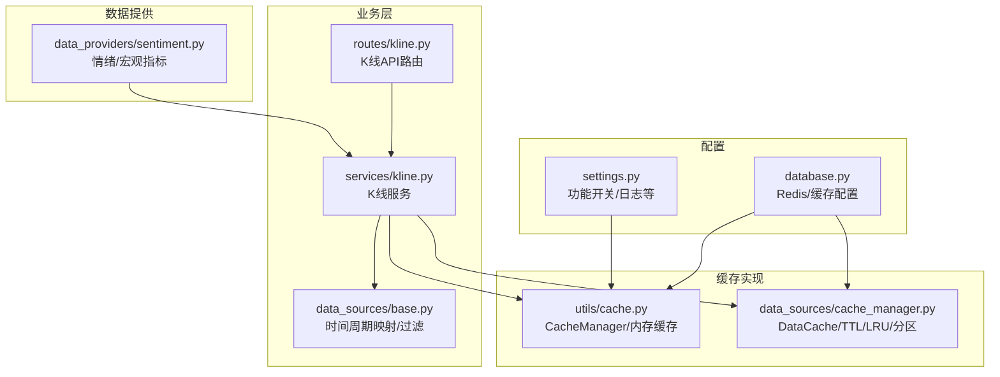
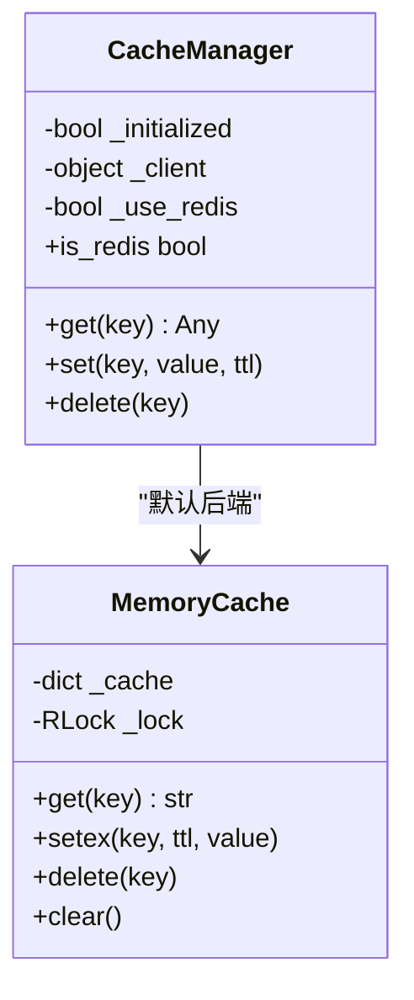
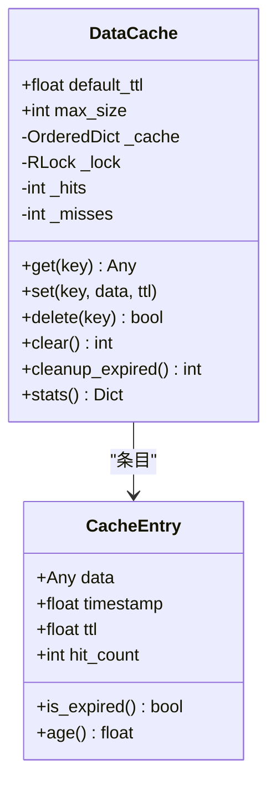
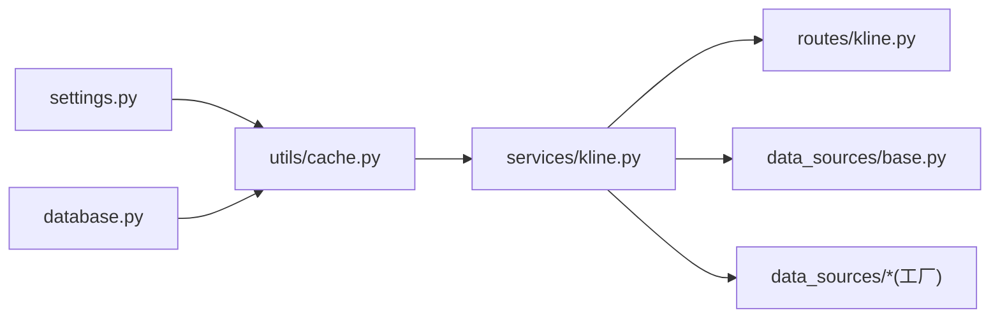

# 缓存管理

<cite>
**本文引用的文件**
- [cache_manager.py](file://backend_api_python/app/data_sources/cache_manager.py)
- [cache.py](file://backend_api_python/app/utils/cache.py)
- [settings.py](file://backend_api_python/app/config/settings.py)
- [database.py](file://backend_api_python/app/config/database.py)
- [base.py](file://backend_api_python/app/data_sources/base.py)
- [kline.py](file://backend_api_python/app/routes/kline.py)
- [kline_service.py](file://backend_api_python/app/services/kline.py)
- [sentiment.py](file://backend_api_python/app/data_providers/sentiment.py)
</cite>

## 目录
1. [简介](#简介)
2. [项目结构](#项目结构)
3. [核心组件](#核心组件)
4. [架构总览](#架构总览)
5. [详细组件分析](#详细组件分析)
6. [依赖分析](#依赖分析)
7. [性能考虑](#性能考虑)
8. [故障排查指南](#故障排查指南)
9. [结论](#结论)
10. [附录](#附录)

## 简介
本文件面向缓存管理系统，系统性阐述缓存策略设计原理与实现机制，涵盖本地内存缓存与可选的 Redis 缓存两种模式；详细说明缓存键命名规则、过期策略与内存管理；解释不同数据类型的缓存策略（K线数据、实时报价、市场情绪等）；提供命中率优化、缓存穿透防护与缓存雪崩预防的解决方案；并给出缓存配置参数、性能监控与故障处理机制，以及缓存与数据库一致性保障与更新策略。

## 项目结构
缓存相关能力分布在以下模块：
- 本地内存缓存与通用缓存管理器：app/utils/cache.py
- 专用数据缓存（TTL/LRU/分区）：app/data_sources/cache_manager.py
- 配置体系：app/config/settings.py、app/config/database.py
- 业务路由与服务：app/routes/kline.py、app/services/kline.py
- 数据源基类与时间周期映射：app/data_sources/base.py
- 市场情绪数据提供者：app/data_providers/sentiment.py



图表来源
- [settings.py:1-99](file://backend_api_python/app/config/settings.py#L1-L99)
- [database.py:1-90](file://backend_api_python/app/config/database.py#L1-L90)
- [cache.py:1-129](file://backend_api_python/app/utils/cache.py#L1-L129)
- [cache_manager.py:1-233](file://backend_api_python/app/data_sources/cache_manager.py#L1-L233)
- [kline.py:1-124](file://backend_api_python/app/routes/kline.py#L1-L124)
- [kline_service.py:1-191](file://backend_api_python/app/services/kline.py#L1-L191)
- [base.py:1-180](file://backend_api_python/app/data_sources/base.py#L1-L180)
- [sentiment.py:1-200](file://backend_api_python/app/data_providers/sentiment.py#L1-L200)

章节来源
- [settings.py:1-99](file://backend_api_python/app/config/settings.py#L1-L99)
- [database.py:1-90](file://backend_api_python/app/config/database.py#L1-L90)
- [cache.py:1-129](file://backend_api_python/app/utils/cache.py#L1-L129)
- [cache_manager.py:1-233](file://backend_api_python/app/data_sources/cache_manager.py#L1-L233)
- [kline.py:1-124](file://backend_api_python/app/routes/kline.py#L1-L124)
- [kline_service.py:1-191](file://backend_api_python/app/services/kline.py#L1-L191)
- [base.py:1-180](file://backend_api_python/app/data_sources/base.py#L1-L180)
- [sentiment.py:1-200](file://backend_api_python/app/data_providers/sentiment.py#L1-L200)

## 核心组件
- 通用缓存管理器（CacheManager）
  - 支持本地内存缓存与可选 Redis 后端，通过配置开关启用。
  - 提供统一的 get/set/delete 接口，自动序列化/反序列化 JSON。
  - 在 Redis 不可用时自动降级到内存缓存，保证系统可用性。
- 专用数据缓存（DataCache）
  - 面向高频数据的 TTL 过期、LRU 淘汰、最大容量控制与线程安全。
  - 内置命中/未命中统计与命中率计算，便于性能观测。
  - 提供按数据类型分区的全局实例（实时行情、K线、股票信息）。
- 配置体系
  - 功能开关：是否启用缓存、是否记录请求日志等。
  - Redis 配置：主机、端口、密码、DB、连接/套接字超时、最大连接数。
  - 缓存业务配置：缓存是否启用、默认过期时间、K线/分析/价格等 TTL 映射。
- 业务集成
  - K线服务在获取最新数据时进行缓存读写，针对不同时间周期采用差异化 TTL。
  - 实时价格获取优先使用 ticker API，失败时降级到 K 线或日线，均带短期缓存。
  - 路由层负责参数解析与错误处理，服务层负责缓存与数据源交互。

章节来源
- [cache.py:49-129](file://backend_api_python/app/utils/cache.py#L49-L129)
- [cache_manager.py:44-175](file://backend_api_python/app/data_sources/cache_manager.py#L44-L175)
- [settings.py:74-90](file://backend_api_python/app/config/settings.py#L74-L90)
- [database.py:49-90](file://backend_api_python/app/config/database.py#L49-L90)
- [kline_service.py:14-191](file://backend_api_python/app/services/kline.py#L14-L191)

## 架构总览
缓存系统采用“本地优先”的双栈设计：默认使用内存缓存，当显式启用 Redis 且可用时切换至 Redis。业务层通过统一的 CacheManager 接口进行读写，内部根据配置选择具体实现。数据源层提供 K 线与实时价格等高频数据，配合 TTL/LRU 与键空间分区实现高效缓存。

```mermaid
sequenceDiagram
participant Client as "客户端"
participant Route as "K线路由"
participant Service as "K线服务"
participant Cache as "缓存管理器"
participant Redis as "Redis(可选)"
participant Mem as "内存缓存"
participant DS as "数据源工厂"
Client->>Route : "GET /kline?market&symbol&timeframe&limit"
Route->>Service : "get_kline(...)"
Service->>Cache : "get(key)"
alt 命中
Cache-->>Service : "缓存数据"
else 未命中
Service->>DS : "获取K线数据"
DS-->>Service : "K线数据"
Service->>Cache : "set(key, data, ttl)"
opt Redis可用
Cache->>Redis : "setex(key, ttl, json)"
else 内存缓存
Cache->>Mem : "setex(key, ttl, json)"
end
end
Service-->>Route : "K线数据"
Route-->>Client : "JSON响应"
```

图表来源
- [kline.py:17-84](file://backend_api_python/app/routes/kline.py#L17-L84)
- [kline_service.py:21-65](file://backend_api_python/app/services/kline.py#L21-L65)
- [cache.py:100-124](file://backend_api_python/app/utils/cache.py#L100-L124)

## 详细组件分析

### 通用缓存管理器（CacheManager）
- 设计要点
  - 单例模式，延迟初始化，避免不必要的资源占用。
  - 本地优先：默认使用内存缓存；仅在显式启用且 Redis 可用时才连接 Redis。
  - 自动降级：Redis 初始化失败或不可达时，静默切换到内存缓存。
  - 序列化：统一以 JSON 字符串存储，读取时反序列化。
- 关键行为
  - get：命中返回对象，未命中返回 None。
  - set：按 TTL 存储，单位秒。
  - delete：删除键。
  - is_redis：指示当前使用的后端是否为 Redis。
- 性能与可靠性
  - 读写异常被捕获并记录日志，不影响主流程。
  - 适合轻量级、进程内缓存场景；Redis 可选增强分布式能力。



图表来源
- [cache.py:49-129](file://backend_api_python/app/utils/cache.py#L49-L129)

章节来源
- [cache.py:49-129](file://backend_api_python/app/utils/cache.py#L49-L129)

### 专用数据缓存（DataCache）
- 设计要点
  - 面向高频、小体量数据的本地缓存，支持 TTL、LRU、最大容量与线程安全。
  - 内置命中/未命中计数与命中率统计，便于监控。
  - 提供按数据类型分区的全局实例，如实时行情、K线、股票信息。
- 关键行为
  - get：存在且未过期则返回，否则返回 None 并计入未命中。
  - set：若容量超限则按 LRU 淘汰最久未使用项。
  - delete/clear/cleanup_expired：维护缓存健康。
- 键空间分区
  - 实时行情：默认 TTL 20 分钟，容量较大。
  - K线数据：默认 TTL 5 分钟，容量较小，按交易对维度控制。
  - 股票信息：默认 TTL 24 小时，容量较大。



图表来源
- [cache_manager.py:44-175](file://backend_api_python/app/data_sources/cache_manager.py#L44-L175)

章节来源
- [cache_manager.py:27-175](file://backend_api_python/app/data_sources/cache_manager.py#L27-L175)

### 缓存键命名规则
- K线数据
  - 规则：kline:{market}:{symbol}:{timeframe}:{limit}
  - 说明：仅对“最新”数据进行缓存，历史回溯（含 before_time）不缓存，避免缓存污染。
- 实时价格
  - 规则：realtime_price:{market}:{symbol}
  - 说明：短 TTL（30 秒），优先使用 ticker API；失败时降级到 1 分钟或日线 K 线。
- K线键生成工具
  - 提供生成 K 线缓存键的辅助函数，支持可选的 before_time 参数，便于扩展。

章节来源
- [kline_service.py:42-65](file://backend_api_python/app/services/kline.py#L42-L65)
- [kline_service.py:95-131](file://backend_api_python/app/services/kline.py#L95-L131)
- [cache_manager.py:218-233](file://backend_api_python/app/data_sources/cache_manager.py#L218-L233)

### 过期策略与内存管理
- 过期策略
  - 通用缓存：通过 setex 指定 TTL，到期自动失效。
  - 专用数据缓存：条目自有 TTL，访问时检查过期并清理。
- 内存管理
  - 通用缓存：内存缓存基于 dict，容量受进程内存限制；异常时自动降级。
  - 专用数据缓存：LRU 淘汰最旧条目，确保容量上限。
- 清理机制
  - 专用数据缓存提供主动清理过期条目接口。
  - 通用缓存不提供主动清理，依赖 TTL 自然过期。

章节来源
- [cache.py:34-47](file://backend_api_python/app/utils/cache.py#L34-L47)
- [cache_manager.py:114-128](file://backend_api_python/app/data_sources/cache_manager.py#L114-L128)
- [cache_manager.py:146-158](file://backend_api_python/app/data_sources/cache_manager.py#L146-L158)

### 不同类型数据的缓存策略
- K线数据
  - TTL：按时间周期差异化配置，分钟级周期 TTL 更短，日线/周线相对更长。
  - 命中策略：仅对最新数据缓存，历史回溯不缓存。
  - 适用场景：技术分析、策略回测、图表展示。
- 实时报价
  - TTL：短 TTL（30 秒），优先使用 ticker API；失败时降级到 K 线或日线。
  - 适用场景：交易执行、实时监控面板。
- 市场情绪
  - TTL：宏观与情绪指标变化较慢，可采用较长 TTL（如 1 小时以上）。
  - 适用场景：策略信号前置因子、风险偏好评估。
- 股票基本信息
  - TTL：较长（如 24 小时），变更频率低。
  - 适用场景：列表页、详情页基础信息。

章节来源
- [kline_service.py:67-191](file://backend_api_python/app/services/kline.py#L67-L191)
- [database.py:62-85](file://backend_api_python/app/config/database.py#L62-L85)
- [sentiment.py:12-42](file://backend_api_python/app/data_providers/sentiment.py#L12-L42)

### 缓存命中率优化
- 命中率优化策略
  - 键空间设计：区分“最新”与“历史”，仅对高频访问的最新数据缓存。
  - TTL 精细化：按数据类型与访问模式设置合理 TTL，避免过早过期或长期滞留。
  - LRU 与容量：为不同分区设置合适的 max_size，平衡热点与冷数据。
  - 读写分离：热点数据优先走缓存，冷数据直接透传。
- 监控与调优
  - 使用 stats 接口获取命中率，结合业务流量调整 TTL 与容量。
  - 对于突发访问，可引入预热策略或分片缓存。

章节来源
- [cache_manager.py:160-174](file://backend_api_python/app/data_sources/cache_manager.py#L160-L174)
- [kline_service.py:42-65](file://backend_api_python/app/services/kline.py#L42-L65)

### 缓存穿透防护
- 防护手段
  - 短 TTL + 命中率监控：对空结果设置短 TTL，避免长期穿透。
  - 白名单/布隆过滤器：对不存在的键进行快速判定（可选）。
  - 严格参数校验：确保查询参数合法，减少无效请求。
- 业务实践
  - 对历史回溯请求不缓存，避免将空结果写入缓存。

章节来源
- [kline_service.py:42-49](file://backend_api_python/app/services/kline.py#L42-L49)

### 缓存雪崩预防
- 预防策略
  - TTL 随机抖动：为相同键设置随机偏移，避免同时过期。
  - 分层缓存：热点数据使用多级缓存（本地+Redis），降低单一节点压力。
  - 降级与熔断：Redis 不可用时自动降级到内存缓存，保证服务可用。
- 业务实践
  - 通用缓存对异常进行捕获与降级，避免影响主流程。

章节来源
- [cache.py:77-99](file://backend_api_python/app/utils/cache.py#L77-L99)

### 缓存一致性与更新策略
- 一致性模型
  - 最终一致：缓存与数据源之间存在时间差，通过 TTL 与主动清理保证一致性。
- 更新策略
  - 写后失效：对关键数据写入后主动删除缓存，确保下次读取到最新值。
  - 增量更新：对高频数据采用短 TTL，定期刷新。
  - 回源校验：在极端情况下，对缓存数据进行回源校验。
- 与数据库的关系
  - 缓存作为数据库的加速层，不替代数据库；数据库变更应触发缓存失效。

章节来源
- [cache.py:100-124](file://backend_api_python/app/utils/cache.py#L100-L124)
- [cache_manager.py:114-128](file://backend_api_python/app/data_sources/cache_manager.py#L114-L128)

## 依赖分析
- 组件耦合
  - 业务层（K线服务）依赖缓存管理器与数据源工厂，耦合度适中。
  - 缓存管理器依赖配置模块，实现与后端解耦。
- 外部依赖
  - Redis：可选依赖，通过环境变量控制启用；不可用时自动降级。
  - 第三方数据源：通过数据源工厂抽象，便于替换与扩展。
- 循环依赖
  - 未发现循环依赖迹象，模块职责清晰。



图表来源
- [settings.py:74-90](file://backend_api_python/app/config/settings.py#L74-L90)
- [database.py:49-90](file://backend_api_python/app/config/database.py#L49-L90)
- [cache.py:63-99](file://backend_api_python/app/utils/cache.py#L63-L99)
- [kline_service.py:17-19](file://backend_api_python/app/services/kline.py#L17-L19)
- [kline.py:14](file://backend_api_python/app/routes/kline.py#L14)

章节来源
- [settings.py:74-90](file://backend_api_python/app/config/settings.py#L74-L90)
- [database.py:49-90](file://backend_api_python/app/config/database.py#L49-L90)
- [cache.py:63-99](file://backend_api_python/app/utils/cache.py#L63-L99)
- [kline_service.py:17-19](file://backend_api_python/app/services/kline.py#L17-L19)
- [kline.py:14](file://backend_api_python/app/routes/kline.py#L14)

## 性能考虑
- 读写路径
  - 读路径：优先命中缓存，未命中再回源；回源后写入缓存。
  - 写路径：对关键数据写入后删除缓存，确保后续读取到最新值。
- TTL 与容量
  - 根据访问模式设置 TTL，避免过短导致频繁回源或过长导致数据陈旧。
  - 为不同分区设置合理的 max_size，防止内存膨胀。
- 监控指标
  - 命中率：通过 stats 接口获取，持续观察趋势。
  - 响应时间：结合日志与指标系统，定位慢查询与回源热点。
- 扩展性
  - Redis 可选启用，满足多实例部署与共享缓存需求。
  - 专用数据缓存适合进程内高频小数据，通用缓存适合跨模块复用。

## 故障排查指南
- Redis 不可用
  - 现象：启用 Redis 但连接失败，系统自动降级到内存缓存。
  - 处理：检查 Redis 地址、端口、密码、DB、超时等配置；确认网络连通性。
- 缓存读写异常
  - 现象：get/set/delete 抛出异常，日志记录错误信息。
  - 处理：检查序列化/反序列化、键长度、TTL 合法性；必要时清理缓存。
- 命中率低
  - 现象：命中率显著下降，回源频繁。
  - 处理：检查键空间设计、TTL 设置、max_size；对历史回溯请求避免缓存。
- 数据陈旧
  - 现象：显示数据落后于实际。
  - 处理：缩短 TTL；对关键数据写后失效；检查回源逻辑。

章节来源
- [cache.py:94-99](file://backend_api_python/app/utils/cache.py#L94-L99)
- [cache.py:107-109](file://backend_api_python/app/utils/cache.py#L107-L109)
- [cache_manager.py:86-90](file://backend_api_python/app/data_sources/cache_manager.py#L86-L90)

## 结论
本缓存系统通过“本地优先”的双栈设计，在保证可用性的前提下兼顾性能与扩展性。通用缓存与专用数据缓存各司其职：前者提供跨模块的统一缓存能力，后者专注高频小数据的 TTL/LRU 管理。结合合理的键空间设计、差异化 TTL 与容量控制，系统能够在高并发场景下维持稳定的命中率与较低的回源比例。通过配置化的 Redis 支持与完善的降级机制，系统具备良好的弹性与韧性。

## 附录

### 缓存配置参数
- 功能开关
  - ENABLE_CACHE：是否启用缓存（环境变量）
- Redis 配置
  - REDIS_HOST/PORT/PASSWORD/DB/CONNECT_TIMEOUT/SOCKET_TIMEOUT/MAX_CONNECTIONS
- 缓存业务配置
  - CACHE_ENABLED：缓存是否启用
  - CACHE_EXPIRE：默认过期时间（秒）
  - KLINE_CACHE_TTL：按时间周期的 K 线 TTL 映射
  - ANALYSIS_CACHE_TTL：分析类数据 TTL
  - PRICE_CACHE_TTL：价格类数据 TTL

章节来源
- [settings.py:76-90](file://backend_api_python/app/config/settings.py#L76-L90)
- [database.py:9-36](file://backend_api_python/app/config/database.py#L9-L36)
- [database.py:52-85](file://backend_api_python/app/config/database.py#L52-L85)

### K线时间周期映射
- 用途：计算时间范围、过滤与限制 K 线数据。
- 周期映射（秒）：1m、3m、5m、15m、30m、1H、4H、1D、1W。

章节来源
- [base.py:14-25](file://backend_api_python/app/data_sources/base.py#L14-L25)