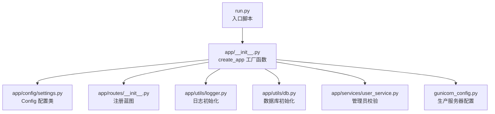
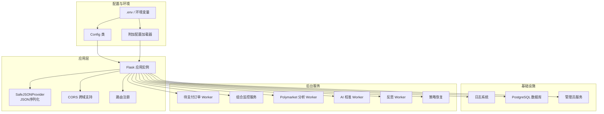
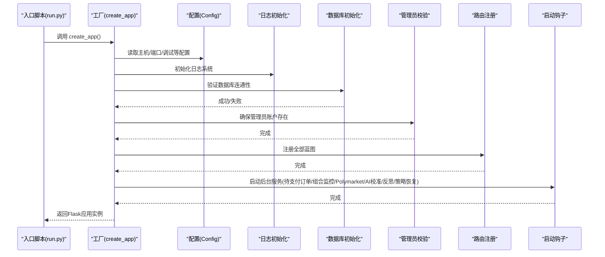
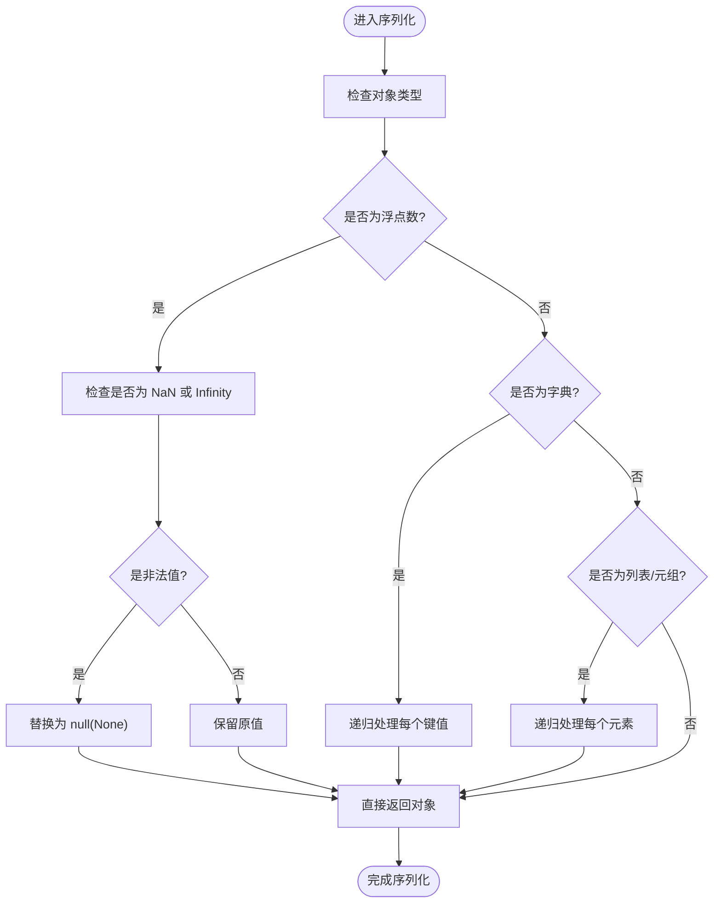
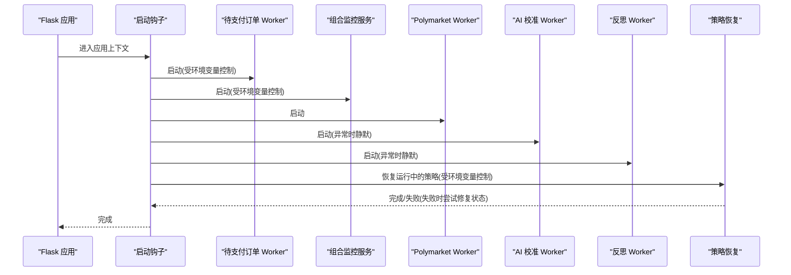
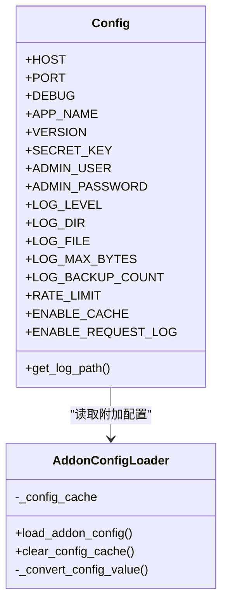
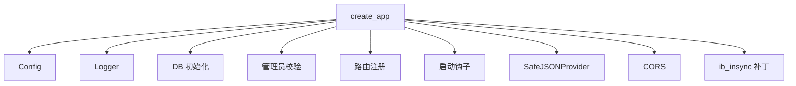

# Flask应用工厂模式

<cite>
**本文引用的文件**
- [app/__init__.py](file://app/__init__.py)
- [run.py](file://run.py)
- [app/config/settings.py](file://app/config/settings.py)
- [app/config/__init__.py](file://app/config/__init__.py)
- [app/utils/db.py](file://app/utils/db.py)
- [app/routes/__init__.py](file://app/routes/__init__.py)
- [app/services/user_service.py](file://app/services/user_service.py)
- [app/utils/logger.py](file://app/utils/logger.py)
- [gunicorn_config.py](file://gunicorn_config.py)
- [app/utils/config_loader.py](file://app/utils/config_loader.py)
</cite>

## 目录
1. [引言](#引言)
2. [项目结构](#项目结构)
3. [核心组件](#核心组件)
4. [架构总览](#架构总览)
5. [详细组件分析](#详细组件分析)
6. [依赖分析](#依赖分析)
7. [性能考虑](#性能考虑)
8. [故障排除指南](#故障排除指南)
9. [结论](#结论)
10. [附录](#附录)

## 引言
本文件系统性阐述QuantDinger后端Flask应用工厂模式的设计与实现，重点覆盖以下方面：
- create_app函数的设计原理与初始化流程（应用实例创建、配置加载、CORS设置、日志初始化等）
- SafeJSONProvider类的作用与实现细节，如何处理NaN/Infinity等非标准数值的序列化问题
- 应用启动时的服务初始化流程（数据库连接、管理员用户创建、后台服务启动等）
- 应用工厂模式的优势与最佳实践（配置管理、服务注册、启动钩子等）

## 项目结构
QuantDinger后端采用“应用工厂 + 模块化路由 + 服务层”的分层组织方式。入口脚本负责加载环境变量与配置，随后通过工厂函数创建Flask应用实例；应用实例在启动阶段完成数据库初始化、管理员账户校验、CORS跨域支持、日志系统配置以及一系列后台服务的启动钩子。

图表来源
- [run.py:100-101](file://run.py#L100-L101)
- [app/__init__.py:213-278](file://app/__init__.py#L213-L278)
- [app/config/settings.py:92-99](file://app/config/settings.py#L92-L99)
- [app/routes/__init__.py:7-58](file://app/routes/__init__.py#L7-L58)
- [app/utils/logger.py:9-48](file://app/utils/logger.py#L9-L48)
- [app/utils/db.py:38-48](file://app/utils/db.py#L38-L48)
- [app/services/user_service.py:56-100](file://app/services/user_service.py#L56-L100)
- [gunicorn_config.py:12-36](file://gunicorn_config.py#L12-L36)

章节来源
- [run.py:96-101](file://run.py#L96-L101)
- [app/__init__.py:213-278](file://app/__init__.py#L213-L278)
- [app/config/settings.py:92-99](file://app/config/settings.py#L92-L99)
- [app/routes/__init__.py:7-58](file://app/routes/__init__.py#L7-L58)
- [app/utils/logger.py:9-48](file://app/utils/logger.py#L9-L48)
- [app/utils/db.py:38-48](file://app/utils/db.py#L38-L48)
- [app/services/user_service.py:56-100](file://app/services/user_service.py#L56-L100)
- [gunicorn_config.py:12-36](file://gunicorn_config.py#L12-L36)

## 核心组件
- 应用工厂函数 create_app：负责创建Flask实例、设置JSON提供者、启用CORS、初始化日志、加载配置、注册路由、执行启动钩子等。
- SafeJSONProvider：自定义JSON序列化提供者，确保NaN/Infinity等非标准数值被替换为null，输出符合RFC 8259规范的JSON。
- 启动钩子集合：包含待支付订单处理、组合投资监控、Polymarket分析、AI校准与反思、运行中策略恢复等后台服务的启动逻辑。
- 配置体系：通过Config类与环境变量结合，提供主机、端口、调试模式、日志级别、功能开关等统一配置入口。
- 数据库与管理员：在应用启动时验证数据库连通性，并确保管理员账户存在。

章节来源
- [app/__init__.py:15-51](file://app/__init__.py#L15-L51)
- [app/__init__.py:213-278](file://app/__init__.py#L213-L278)
- [app/config/settings.py:6-99](file://app/config/settings.py#L6-L99)
- [app/utils/db.py:38-48](file://app/utils/db.py#L38-L48)
- [app/services/user_service.py:56-100](file://app/services/user_service.py#L56-L100)

## 架构总览
下图展示了应用工厂模式在QuantDinger中的整体架构与交互关系：

图表来源
- [app/__init__.py:213-278](file://app/__init__.py#L213-L278)
- [app/config/settings.py:92-99](file://app/config/settings.py#L92-L99)
- [app/utils/config_loader.py:24-160](file://app/utils/config_loader.py#L24-L160)
- [app/utils/logger.py:9-48](file://app/utils/logger.py#L9-L48)
- [app/utils/db.py:38-48](file://app/utils/db.py#L38-L48)
- [app/services/user_service.py:56-100](file://app/services/user_service.py#L56-L100)

## 详细组件分析

### 应用工厂函数 create_app 设计与实现
- 应用实例创建：通过Flask构造函数创建应用实例，并设置自定义JSON提供者与CORS支持。
- 配置加载：读取Config类中的主机、端口、调试模式等基础配置；同时通过附加配置加载器支持多厂商LLM、数据源等扩展配置。
- 日志初始化：在应用创建早期调用日志初始化函数，确保后续所有模块的日志输出一致。
- 数据库初始化：验证PostgreSQL连通性；在多用户模式下确保管理员账户存在。
- 路由注册：集中注册所有蓝图，形成统一的API表面。
- 启动钩子：在应用上下文中依次启动多个后台服务，包括待支付订单处理、组合监控、Polymarket分析、AI校准与反思、运行中策略恢复等。

图表来源
- [run.py:96-101](file://run.py#L96-L101)
- [app/__init__.py:213-278](file://app/__init__.py#L213-L278)
- [app/config/settings.py:92-99](file://app/config/settings.py#L92-L99)
- [app/utils/logger.py:9-48](file://app/utils/logger.py#L9-L48)
- [app/utils/db.py:38-48](file://app/utils/db.py#L38-L48)
- [app/services/user_service.py:56-100](file://app/services/user_service.py#L56-L100)

章节来源
- [app/__init__.py:213-278](file://app/__init__.py#L213-L278)
- [run.py:96-101](file://run.py#L96-L101)
- [app/config/settings.py:92-99](file://app/config/settings.py#L92-L99)
- [app/utils/logger.py:9-48](file://app/utils/logger.py#L9-L48)
- [app/utils/db.py:38-48](file://app/utils/db.py#L38-L48)
- [app/services/user_service.py:56-100](file://app/services/user_service.py#L56-L100)

### SafeJSONProvider 类：处理NaN/Infinity序列化
- 设计目标：解决Python的json.dumps在allow_nan=True时会输出NaN/Infinity字面量的问题，这些字面量不符合RFC 8259规范，会导致前端解析失败。
- 实现要点：
  - 继承DefaultJSONProvider，重写dumps方法，使用自定义的递归清理函数对对象进行预处理。
  - 在序列化前将浮点数NaN/Infinity替换为None（对应JSON的null），保证输出始终合规。
  - 对字典、列表、元组等复合结构进行深度遍历，确保所有层级的非法数值都被修正。
- 使用场景：在API响应中返回包含统计计算结果或指标数据的JSON时，避免因NaN/Infinity导致前端解析异常。

图表来源
- [app/__init__.py:15-51](file://app/__init__.py#L15-L51)

章节来源
- [app/__init__.py:15-51](file://app/__init__.py#L15-L51)

### 启动时服务初始化流程
- 数据库连接与可用性验证：在应用启动时验证PostgreSQL连通性，确保服务正常。
- 管理员用户创建：在多用户模式下确保管理员账户存在，避免权限缺失。
- 后台服务启动：
  - 待支付订单处理：扫描并确认支付状态，保证交易闭环。
  - 组合监控服务：按需启用，支持组合投资的实时监控。
  - Polymarket分析：启动Polymarket相关分析任务。
  - AI校准与反思：启动AI阈值自适应与历史决策反思任务。
  - 运行中策略恢复：在允许的情况下恢复之前运行的策略实例，避免资源浪费或僵尸状态。

图表来源
- [app/__init__.py:258-277](file://app/__init__.py#L258-L277)
- [app/__init__.py:77-150](file://app/__init__.py#L77-L150)
- [app/__init__.py:152-211](file://app/__init__.py#L152-L211)

章节来源
- [app/__init__.py:258-277](file://app/__init__.py#L258-L277)
- [app/__init__.py:77-150](file://app/__init__.py#L77-L150)
- [app/__init__.py:152-211](file://app/__init__.py#L152-L211)

### 配置管理与加载
- 基础配置：Config类通过环境变量提供主机、端口、调试模式、日志级别、功能开关等。
- 附加配置：通过附加配置加载器将扁平的环境变量映射为嵌套的配置树，兼容旧版PHP风格键名，支持多厂商LLM、数据源、搜索等扩展配置。
- 配置缓存：为避免重复解析，加载器内部维护配置缓存，必要时可清除以刷新配置。

图表来源
- [app/config/settings.py:6-99](file://app/config/settings.py#L6-L99)
- [app/utils/config_loader.py:24-160](file://app/utils/config_loader.py#L24-L160)

章节来源
- [app/config/settings.py:6-99](file://app/config/settings.py#L6-L99)
- [app/utils/config_loader.py:24-160](file://app/utils/config_loader.py#L24-L160)

### 生产部署与并发模型
- Gunicorn配置：默认单工作进程+多线程（gthread）模型，保持与开发服务器相似的并发模型，同时提升稳定性与连接处理能力；通过环境变量调整工作进程数与线程数。
- 预加载禁用：明确禁止预加载，以确保后台线程在实际工作进程中启动，避免fork后丢失线程的问题。

章节来源
- [gunicorn_config.py:12-36](file://gunicorn_config.py#L12-L36)

## 依赖分析
- 组件耦合与内聚：
  - 工厂函数对配置、日志、数据库、管理员服务、路由注册与启动钩子具有强依赖，但通过模块化设计保持高内聚。
  - SafeJSONProvider与Flask JSON序列化机制紧密耦合，但仅影响序列化行为，不引入额外外部依赖。
- 外部依赖与集成点：
  - ib_insync补丁：为稳定第三方券商连接而进行异步事件循环补丁。
  - CORS：全局启用跨域支持，便于前端与后端分离部署。
  - 环境变量与附加配置：统一从环境变量与附加配置加载器读取，避免硬编码。

图表来源
- [app/__init__.py:213-278](file://app/__init__.py#L213-L278)

章节来源
- [app/__init__.py:213-278](file://app/__init__.py#L213-L278)

## 性能考虑
- 并发模型：生产环境推荐使用gthread模型，默认1个工作进程+4条线程，可根据CPU核数与业务吞吐需求调整工作进程数。
- 启动钩子幂等性：后台服务启动逻辑具备幂等特性，配合数据库锁协调，尽量避免重复工作。
- 日志与请求噪声过滤：对特定子系统的日志进行降噪，减少控制台噪音，提高可观测性。
- JSON序列化：SafeJSONProvider在序列化前进行深度清理，避免无效值导致的解析错误，间接提升前后端交互稳定性。

## 故障排除指南
- 数据库无法连接：检查DATABASE_URL与网络连通性；若不可达，初始化会抛出错误，需先修复数据库服务。
- 管理员账户缺失：在多用户模式下，启动时会尝试创建默认管理员账户；若失败，请检查数据库权限与初始化流程。
- 后台服务启动失败：启动钩子对各服务启动进行了异常捕获与日志记录，查看对应服务日志定位问题。
- CORS跨域问题：全局启用了CORS，如遇跨域失败，请检查前端请求头与后端CORS配置。
- ib_insync连接不稳定：若未安装ib_insync，将跳过补丁；安装后自动启用异步事件循环补丁以稳定连接。

章节来源
- [app/utils/db.py:38-48](file://app/utils/db.py#L38-L48)
- [app/services/user_service.py:56-100](file://app/services/user_service.py#L56-L100)
- [app/__init__.py:235-242](file://app/__init__.py#L235-L242)

## 结论
QuantDinger的Flask应用工厂模式通过清晰的职责划分与模块化设计，实现了从配置加载、日志初始化、数据库连接到路由注册与后台服务启动的一体化流程。SafeJSONProvider确保了JSON输出的规范性，避免前端解析异常；启动钩子机制提供了灵活的服务注册与恢复能力。结合Gunicorn的生产配置，该模式既适合本地开发，也能满足生产环境的稳定性与可扩展性要求。

## 附录
- 最佳实践清单
  - 将所有敏感配置置于环境变量或.env文件，避免硬编码。
  - 使用工厂函数集中初始化应用，便于测试与多环境部署。
  - 对启动钩子进行幂等设计，配合数据库锁避免重复执行。
  - 在生产环境中禁用预加载，确保后台线程在工作进程中正确启动。
  - 对关键服务（如数据库、第三方SDK）增加健康检查与告警。