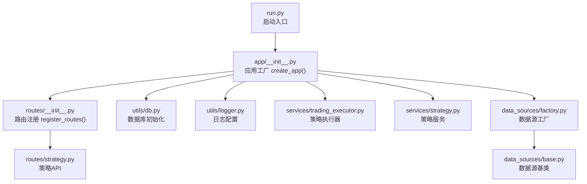
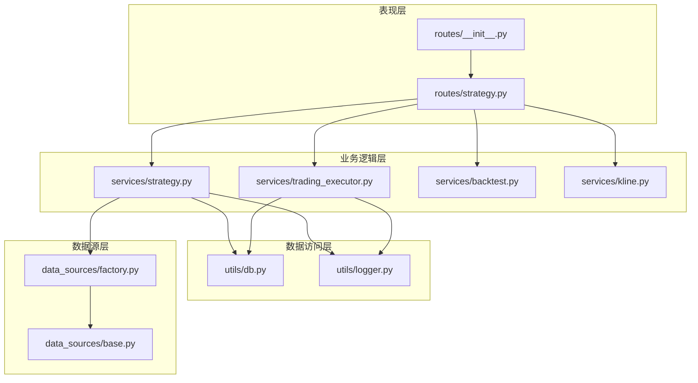
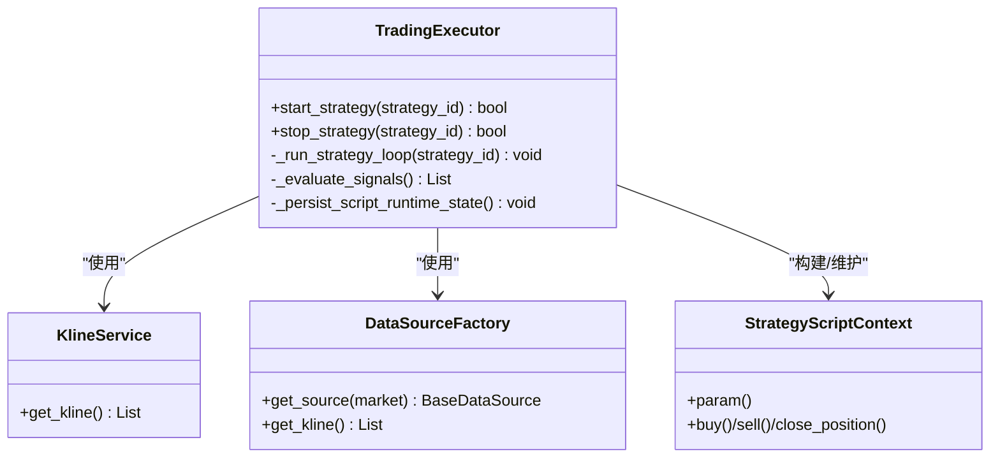
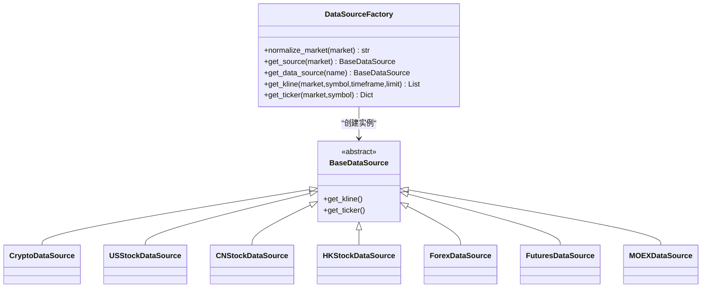
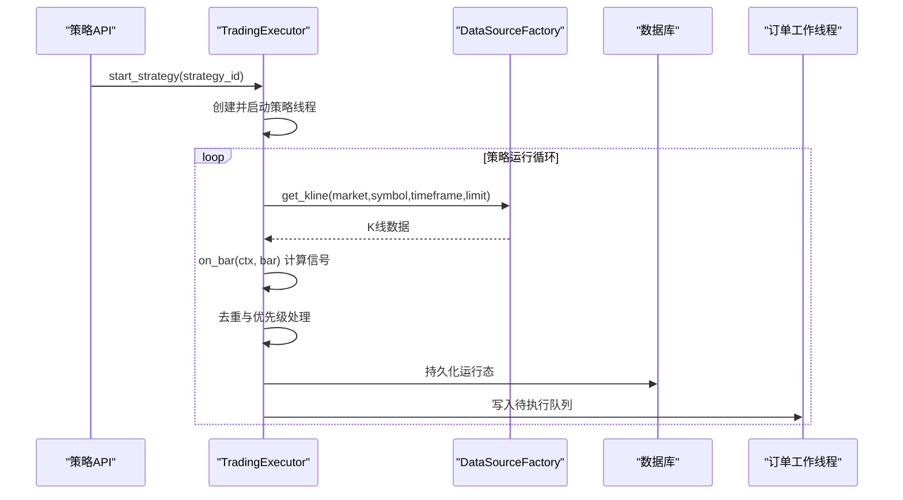
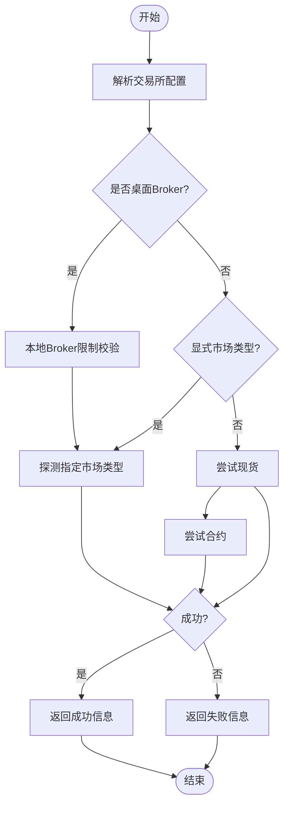
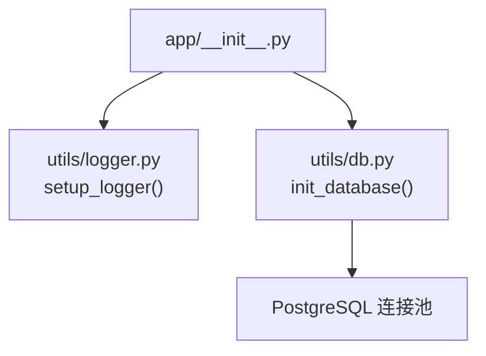
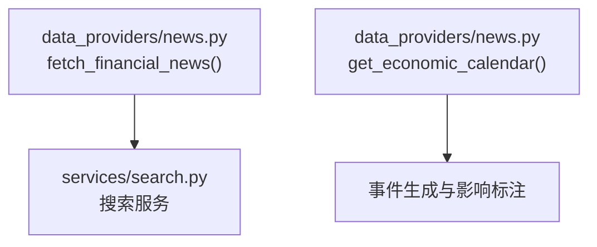
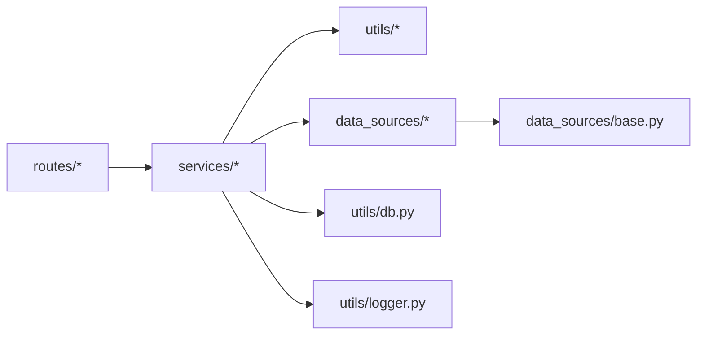

# 代码结构说明

<cite>
**本文档引用的文件**
- [run.py](file://backend_api_python/run.py)
- [app/__init__.py](file://backend_api_python/app/__init__.py)
- [routes/__init__.py](file://backend_api_python/app/routes/__init__.py)
- [config/settings.py](file://backend_api_python/app/config/settings.py)
- [data_sources/base.py](file://backend_api_python/app/data_sources/base.py)
- [data_sources/factory.py](file://backend_api_python/app/data_sources/factory.py)
- [services/trading_executor.py](file://backend_api_python/app/services/trading_executor.py)
- [services/strategy.py](file://backend_api_python/app/services/strategy.py)
- [utils/logger.py](file://backend_api_python/app/utils/logger.py)
- [utils/db.py](file://backend_api_python/app/utils/db.py)
- [routes/strategy.py](file://backend_api_python/app/routes/strategy.py)
- [data_providers/news.py](file://backend_api_python/app/data_providers/news.py)
</cite>

## 目录
1. [引言](#引言)
2. [项目结构](#项目结构)
3. [核心组件](#核心组件)
4. [架构总览](#架构总览)
5. [详细组件分析](#详细组件分析)
6. [依赖分析](#依赖分析)
7. [性能考虑](#性能考虑)
8. [故障排除指南](#故障排除指南)
9. [结论](#结论)
10. [附录](#附录)

## 引言
本文件面向QuantDinger后端Python API的开发者与维护者，系统化梳理项目的目录组织原则、模块划分与文件命名规范，深入解析Flask应用的启动流程、路由注册机制以及服务层架构设计。文档重点阐述表现层、业务逻辑层、数据访问层的职责分工，详解核心组件如策略引擎、数据源工厂、执行器的设计模式，并提供代码导航指南与架构图，帮助读者快速定位功能模块并高效开展二次开发。

## 项目结构
后端采用“应用工厂 + 蓝图路由 + 分层服务”的组织方式，遵循“按功能域分层、按领域模型聚合”的原则：
- 应用工厂与启动入口：run.py负责环境准备、代理配置、路径注入与应用实例创建。
- Flask应用：app/__init__.py提供应用工厂create_app，集中初始化CORS、日志、数据库、路由注册与启动钩子。
- 路由层：routes/__init__.py统一注册所有蓝图，按API前缀进行命名空间隔离。
- 配置层：config/settings.py以元类封装环境变量，提供主机、端口、认证、日志、安全与功能开关等配置。
- 数据访问层：utils/db.py提供PostgreSQL连接与初始化工具。
- 服务层：services目录按业务域拆分，包含策略、回测、K线、交易执行、实验、分析等服务。
- 数据源层：data_sources目录按市场类型拆分，统一继承BaseDataSource，通过工厂模式对外暴露。
- 工具层：utils目录提供日志、缓存、认证、HTTP、数据库适配等通用能力。
- 数据提供器：data_providers目录提供新闻、宏观日历等辅助数据服务。

**图表来源**
- [run.py:1-134](file://backend_api_python/run.py#L1-L134)
- [app/__init__.py:213-279](file://backend_api_python/app/__init__.py#L213-L279)
- [routes/__init__.py:7-58](file://backend_api_python/app/routes/__init__.py#L7-L58)
- [utils/db.py:38-48](file://backend_api_python/app/utils/db.py#L38-L48)
- [utils/logger.py:9-48](file://backend_api_python/app/utils/logger.py#L9-L48)
- [services/trading_executor.py:37-70](file://backend_api_python/app/services/trading_executor.py#L37-L70)
- [services/strategy.py:14-22](file://backend_api_python/app/services/strategy.py#L14-L22)
- [data_sources/factory.py:33-112](file://backend_api_python/app/data_sources/factory.py#L33-L112)
- [data_sources/base.py:28-66](file://backend_api_python/app/data_sources/base.py#L28-L66)

**章节来源**
- [run.py:1-134](file://backend_api_python/run.py#L1-L134)
- [app/__init__.py:213-279](file://backend_api_python/app/__init__.py#L213-L279)
- [routes/__init__.py:7-58](file://backend_api_python/app/routes/__init__.py#L7-L58)
- [utils/db.py:38-48](file://backend_api_python/app/utils/db.py#L38-L48)
- [utils/logger.py:9-48](file://backend_api_python/app/utils/logger.py#L9-L48)

## 核心组件
- 应用工厂与启动流程
  - run.py负责加载.env、设置代理、注入项目根路径，随后导入create_app并创建Flask应用实例。
  - app/__init__.py的create_app完成CORS、日志、数据库初始化、管理员账户校验、蓝图注册与启动钩子（挂载策略执行器、订单工作线程、组合监控、USDT支付工作线程、Polymarket工作线程、AI校准与反思任务、运行中策略恢复）。
- 路由注册机制
  - routes/__init__.py集中导入各蓝图并按URL前缀注册，形成清晰的命名空间隔离，例如/api/auth、/api/users、/api/strategy等。
- 配置体系
  - config/settings.py通过元类读取环境变量，提供主机、端口、调试、版本、认证、日志、安全与功能开关等配置项。
- 数据访问层
  - utils/db.py封装PostgreSQL连接池与初始化，提供统一的上下文管理器接口，保证连接生命周期与并发安全。
- 服务层架构
  - services目录下按业务域拆分，如策略服务、回测服务、K线服务、交易执行器、实验与分析服务等，体现高内聚低耦合的设计。

**章节来源**
- [run.py:96-134](file://backend_api_python/run.py#L96-L134)
- [app/__init__.py:213-279](file://backend_api_python/app/__init__.py#L213-L279)
- [routes/__init__.py:7-58](file://backend_api_python/app/routes/__init__.py#L7-L58)
- [config/settings.py:66-99](file://backend_api_python/app/config/settings.py#L66-L99)
- [utils/db.py:19-31](file://backend_api_python/app/utils/db.py#L19-L31)

## 架构总览
QuantDinger后端采用三层架构与多层解耦：
- 表现层（Flask路由）：接收HTTP请求，调用服务层处理业务逻辑，返回标准化响应。
- 业务逻辑层（服务层）：封装策略编译、回测、交易执行、实验与分析等核心业务。
- 数据访问层（工具层）：提供数据库连接、日志、缓存、HTTP客户端等基础设施。

**图表来源**
- [routes/strategy.py:1-200](file://backend_api_python/app/routes/strategy.py#L1-L200)
- [routes/__init__.py:7-58](file://backend_api_python/app/routes/__init__.py#L7-L58)
- [services/strategy.py:14-22](file://backend_api_python/app/services/strategy.py#L14-L22)
- [services/trading_executor.py:37-70](file://backend_api_python/app/services/trading_executor.py#L37-L70)
- [utils/db.py:19-31](file://backend_api_python/app/utils/db.py#L19-L31)
- [utils/logger.py:9-48](file://backend_api_python/app/utils/logger.py#L9-L48)
- [data_sources/factory.py:33-112](file://backend_api_python/app/data_sources/factory.py#L33-L112)
- [data_sources/base.py:28-66](file://backend_api_python/app/data_sources/base.py#L28-L66)

## 详细组件分析

### 策略引擎（TradingExecutor）
策略引擎是实时交易执行的核心，负责：
- 策略线程管理：限制最大线程数、清理僵尸线程、线程安全控制。
- K线与信号处理：通过KlineService与数据源工厂获取K线，驱动策略脚本计算信号。
- 信号去重与优先级：基于时间窗与信号类型进行去重，严格的状态机约束下单顺序。
- 仓位与资金管理：根据交易配置构建风险/规模参数，维护脚本运行时状态与持久化。
- 执行与日志：将生成的信号写入待执行队列，配合订单工作线程与实盘执行器完成成交。

**图表来源**
- [services/trading_executor.py:37-70](file://backend_api_python/app/services/trading_executor.py#L37-L70)
- [services/trading_executor.py:395-456](file://backend_api_python/app/services/trading_executor.py#L395-L456)
- [services/trading_executor.py:790-800](file://backend_api_python/app/services/trading_executor.py#L790-L800)
- [data_sources/factory.py:114-149](file://backend_api_python/app/data_sources/factory.py#L114-L149)

**章节来源**
- [services/trading_executor.py:37-70](file://backend_api_python/app/services/trading_executor.py#L37-L70)
- [services/trading_executor.py:395-456](file://backend_api_python/app/services/trading_executor.py#L395-L456)
- [services/trading_executor.py:790-800](file://backend_api_python/app/services/trading_executor.py#L790-L800)

### 数据源工厂（DataSourceFactory）
数据源工厂通过市场类型统一抽象，屏蔽不同交易所/数据提供商的差异：
- 市场枚举归一化：支持别名映射与大小写归一，确保调用侧无需关心具体实现。
- 工厂创建：按市场类型动态导入并实例化具体数据源。
- 快捷查询：提供获取K线与实时报价的便捷方法，内部自动排序与错误兜底。

**图表来源**
- [data_sources/factory.py:33-112](file://backend_api_python/app/data_sources/factory.py#L33-L112)
- [data_sources/base.py:28-66](file://backend_api_python/app/data_sources/base.py#L28-L66)
- [data_sources/factory.py:87-111](file://backend_api_python/app/data_sources/factory.py#L87-L111)

**章节来源**
- [data_sources/factory.py:33-112](file://backend_api_python/app/data_sources/factory.py#L33-L112)
- [data_sources/base.py:28-66](file://backend_api_python/app/data_sources/base.py#L28-L66)

### 执行器（TradingExecutor）运行流程
策略执行器的运行循环包含以下关键步骤：初始化上下文、拉取K线、评估信号、去重与优先级处理、持久化运行态、写入待执行队列。

**图表来源**
- [services/trading_executor.py:395-456](file://backend_api_python/app/services/trading_executor.py#L395-L456)
- [services/trading_executor.py:734-788](file://backend_api_python/app/services/trading_executor.py#L734-L788)
- [data_sources/factory.py:114-149](file://backend_api_python/app/data_sources/factory.py#L114-L149)

**章节来源**
- [services/trading_executor.py:395-456](file://backend_api_python/app/services/trading_executor.py#L395-L456)
- [services/trading_executor.py:734-788](file://backend_api_python/app/services/trading_executor.py#L734-L788)

### 策略服务（StrategyService）
策略服务负责策略的连接测试、符号列表获取、策略状态管理与显示参数构建：
- 连接测试：针对不同交易所与市场类型进行公共与私有接口探测，输出用户可读的诊断信息。
- 符号列表：优先使用REST直连获取，其次通过CCXT加载市场，过滤USDT交易对。
- 显示参数：根据机器人类型与参数构建前端展示所需的标签与数值。

**图表来源**
- [services/strategy.py:292-606](file://backend_api_python/app/services/strategy.py#L292-L606)

**章节来源**
- [services/strategy.py:292-606](file://backend_api_python/app/services/strategy.py#L292-L606)

### 日志与数据库初始化
- 日志：统一配置日志级别、格式与文件轮转，过滤噪声日志，确保生产环境可观测性。
- 数据库：PostgreSQL连接池初始化，确保表结构与字段存在，提供上下文管理器接口。

**图表来源**
- [app/__init__.py:243-254](file://backend_api_python/app/__init__.py#L243-L254)
- [utils/logger.py:9-48](file://backend_api_python/app/utils/logger.py#L9-L48)
- [utils/db.py:38-48](file://backend_api_python/app/utils/db.py#L38-L48)

**章节来源**
- [utils/logger.py:9-48](file://backend_api_python/app/utils/logger.py#L9-L48)
- [utils/db.py:38-48](file://backend_api_python/app/utils/db.py#L38-L48)

### 数据提供器（新闻与经济日历）
- 新闻：按语言聚合搜索结果，去重并限制数量，便于前端展示。
- 经济日历：生成事件列表，标注预期与实际影响，支持中英文描述。

**图表来源**
- [data_providers/news.py:13-70](file://backend_api_python/app/data_providers/news.py#L13-L70)
- [data_providers/news.py:90-149](file://backend_api_python/app/data_providers/news.py#L90-L149)

**章节来源**
- [data_providers/news.py:13-70](file://backend_api_python/app/data_providers/news.py#L13-L70)
- [data_providers/news.py:90-149](file://backend_api_python/app/data_providers/news.py#L90-L149)

## 依赖分析
- 组件耦合与内聚
  - 路由层仅依赖服务层接口，不直接操作数据源，降低耦合。
  - 服务层通过工厂与工具层解耦具体实现，提升可替换性。
  - 数据源层统一继承基类，通过工厂创建，便于扩展新市场。
- 外部依赖
  - Flask、Flask-CORS、PostgreSQL、ccxt、requests等。
- 循环依赖
  - 当前结构未发现循环导入；若新增模块需遵循“上层依赖下层”的原则。

**图表来源**
- [routes/__init__.py:7-58](file://backend_api_python/app/routes/__init__.py#L7-L58)
- [services/trading_executor.py:25-32](file://backend_api_python/app/services/trading_executor.py#L25-L32)
- [data_sources/factory.py:7-8](file://backend_api_python/app/data_sources/factory.py#L7-L8)
- [utils/db.py:19-25](file://backend_api_python/app/utils/db.py#L19-L25)
- [utils/logger.py:9-17](file://backend_api_python/app/utils/logger.py#L9-L17)

**章节来源**
- [routes/__init__.py:7-58](file://backend_api_python/app/routes/__init__.py#L7-L58)
- [services/trading_executor.py:25-32](file://backend_api_python/app/services/trading_executor.py#L25-L32)
- [data_sources/factory.py:7-8](file://backend_api_python/app/data_sources/factory.py#L7-L8)
- [utils/db.py:19-25](file://backend_api_python/app/utils/db.py#L19-L25)
- [utils/logger.py:9-17](file://backend_api_python/app/utils/logger.py#L9-L17)

## 性能考虑
- 线程与资源限制
  - 策略执行器限制最大线程数，避免资源耗尽；提供资源状态打印便于诊断。
- 缓存与去重
  - 价格缓存与信号去重缓存降低重复计算与重复下单风险。
- 数据延迟检测
  - 数据源基类对K线延迟进行阈值告警，避免使用过期数据。
- 并发与限流
  - 服务层对连接测试引入信号量，避免CPU与网络抖动。

**章节来源**
- [services/trading_executor.py:59-66](file://backend_api_python/app/services/trading_executor.py#L59-L66)
- [services/trading_executor.py:241-291](file://backend_api_python/app/services/trading_executor.py#L241-L291)
- [data_sources/base.py:142-179](file://backend_api_python/app/data_sources/base.py#L142-L179)
- [services/strategy.py:18-18](file://backend_api_python/app/services/strategy.py#L18-L18)

## 故障排除指南
- 启动阶段
  - SECRET_KEY默认值：生产环境必须替换，否则自动随机生成并提示。
  - 数据库不可达：init_database抛出异常，检查DATABASE_URL。
- 运行阶段
  - 策略无法启动：查看线程上限与资源状态打印；检查策略状态更新与恢复逻辑。
  - 交易所连接失败：参考连接测试返回的诊断信息，核对市场类型、IP白名单、密钥权限与base_url。
  - 日志噪声：调整日志级别与过滤规则，关注特定模块的INFO级别保留。

**章节来源**
- [run.py:114-120](file://backend_api_python/run.py#L114-L120)
- [utils/db.py:43-48](file://backend_api_python/app/utils/db.py#L43-L48)
- [services/trading_executor.py:413-424](file://backend_api_python/app/services/trading_executor.py#L413-L424)
- [services/strategy.py:292-606](file://backend_api_python/app/services/strategy.py#L292-L606)
- [utils/logger.py:19-33](file://backend_api_python/app/utils/logger.py#L19-L33)

## 结论
QuantDinger后端通过应用工厂与蓝图路由实现了清晰的启动与注册流程，服务层围绕策略、回测、交易执行与分析展开，数据源层以工厂模式屏蔽差异。日志与数据库初始化保障了可观测性与稳定性。整体架构具备良好的扩展性与可维护性，适合在多市场、多交易所场景下演进。

## 附录
- 代码导航指南
  - 启动入口：backend_api_python/run.py
  - 应用工厂：backend_api_python/app/__init__.py
  - 路由注册：backend_api_python/app/routes/__init__.py
  - 策略API：backend_api_python/app/routes/strategy.py
  - 策略服务：backend_api_python/app/services/strategy.py
  - 策略执行器：backend_api_python/app/services/trading_executor.py
  - 数据源基类：backend_api_python/app/data_sources/base.py
  - 数据源工厂：backend_api_python/app/data_sources/factory.py
  - 日志工具：backend_api_python/app/utils/logger.py
  - 数据库工具：backend_api_python/app/utils/db.py
  - 新闻与日历：backend_api_python/app/data_providers/news.py