# 工具模块设计

<cite>
**本文引用的文件**
- [backend_api_python/app/utils/__init__.py](file://backend_api_python/app/utils/__init__.py)
- [backend_api_python/app/utils/auth.py](file://backend_api_python/app/utils/auth.py)
- [backend_api_python/app/utils/logger.py](file://backend_api_python/app/utils/logger.py)
- [backend_api_python/app/utils/db.py](file://backend_api_python/app/utils/db.py)
- [backend_api_python/app/utils/db_postgres.py](file://backend_api_python/app/utils/db_postgres.py)
- [backend_api_python/app/utils/http.py](file://backend_api_python/app/utils/http.py)
- [backend_api_python/app/utils/cache.py](file://backend_api_python/app/utils/cache.py)
- [backend_api_python/app/utils/config_loader.py](file://backend_api_python/app/utils/config_loader.py)
- [backend_api_python/app/utils/safe_exec.py](file://backend_api_python/app/utils/safe_exec.py)
- [backend_api_python/app/utils/credential_crypto.py](file://backend_api_python/app/utils/credential_crypto.py)
- [backend_api_python/app/config/settings.py](file://backend_api_python/app/config/settings.py)
- [backend_api_python/app/config/database.py](file://backend_api_python/app/config/database.py)
- [backend_api_python/app/config/api_keys.py](file://backend_api_python/app/config/api_keys.py)
- [backend_api_python/env.example](file://backend_api_python/env.example)
</cite>

## 目录
1. [简介](#简介)
2. [项目结构](#项目结构)
3. [核心组件](#核心组件)
4. [架构总览](#架构总览)
5. [详细组件分析](#详细组件分析)
6. [依赖分析](#依赖分析)
7. [性能考量](#性能考量)
8. [故障排查指南](#故障排查指南)
9. [结论](#结论)
10. [附录](#附录)

## 简介
本设计文档聚焦QuantDinger后端工具模块，系统阐述认证工具、日志工具、数据库工具、HTTP客户端、缓存、配置加载、安全执行与凭据加密等通用能力的设计原则、组织方式与使用方法。文档同时给出复用性设计、扩展机制、配置参数、异常处理与性能优化建议，并提供最佳实践与常见问题解决方案，帮助开发者在不同场景下高效、安全地集成与扩展这些工具。

## 项目结构
工具模块位于后端Python应用的app/utils目录下，采用“按功能域划分”的组织方式，每个工具独立成模块，通过统一的导出入口集中暴露接口。配置相关位于app/config目录，通过环境变量驱动，确保本地化与可移植性。

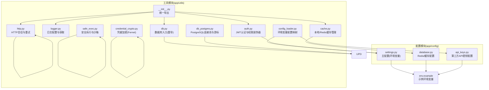

图表来源
- [backend_api_python/app/utils/__init__.py:1-10](file://backend_api_python/app/utils/__init__.py#L1-L10)
- [backend_api_python/app/utils/auth.py:1-239](file://backend_api_python/app/utils/auth.py#L1-L239)
- [backend_api_python/app/utils/logger.py:1-63](file://backend_api_python/app/utils/logger.py#L1-L63)
- [backend_api_python/app/utils/db.py:1-66](file://backend_api_python/app/utils/db.py#L1-L66)
- [backend_api_python/app/utils/db_postgres.py:1-508](file://backend_api_python/app/utils/db_postgres.py#L1-L508)
- [backend_api_python/app/utils/http.py:1-42](file://backend_api_python/app/utils/http.py#L1-L42)
- [backend_api_python/app/utils/cache.py:1-129](file://backend_api_python/app/utils/cache.py#L1-L129)
- [backend_api_python/app/utils/config_loader.py:1-251](file://backend_api_python/app/utils/config_loader.py#L1-L251)
- [backend_api_python/app/utils/safe_exec.py:1-471](file://backend_api_python/app/utils/safe_exec.py#L1-L471)
- [backend_api_python/app/utils/credential_crypto.py:1-50](file://backend_api_python/app/utils/credential_crypto.py#L1-L50)
- [backend_api_python/app/config/settings.py:1-99](file://backend_api_python/app/config/settings.py#L1-L99)
- [backend_api_python/app/config/database.py:1-90](file://backend_api_python/app/config/database.py#L1-L90)
- [backend_api_python/app/config/api_keys.py:1-184](file://backend_api_python/app/config/api_keys.py#L1-L184)
- [backend_api_python/env.example:1-319](file://backend_api_python/env.example#L1-L319)

章节来源
- [backend_api_python/app/utils/__init__.py:1-10](file://backend_api_python/app/utils/__init__.py#L1-L10)
- [backend_api_python/env.example:1-319](file://backend_api_python/env.example#L1-L319)

## 核心组件
- 认证工具(auth): 提供JWT生成、校验、单客户端强制版本控制、Flask中间件装饰器(login_required/admin_required/manager_required/permission_required)，以及兼容旧版单用户模式的认证入口。
- 日志工具(logger): 提供全局日志初始化、过滤特定模块噪声、文件滚动日志输出与便捷Logger获取。
- 数据库工具(db/db_postgres): 统一PostgreSQL入口与连接池实现，支持环境变量配置、健康检查、超时等待、异常回滚与连接归还，提供上下文管理器与同步获取两种使用方式。
- HTTP客户端(http): 基于requests的带重试Session工厂，支持自定义重试次数、退避因子与状态码列表，并提供全局共享Session。
- 缓存(cache): 本地优先的缓存管理器，可选启用Redis，自动降级至内存缓存；提供JSON序列化、TTL设置与线程安全。
- 配置加载(config_loader): 将环境变量映射为嵌套配置树，兼容旧版扁平键风格，支持类型转换与缓存，提供内部API密钥读取与缓存清理。
- 安全执行(safe_exec): 提供白名单内置函数、受限导入模块、超时控制、内存限制与子进程隔离执行，支持AST与正则双重安全校验。
- 凭据加密(credential_crypto): 基于Fernet对交易所凭据进行对称加密，密钥来自环境SECRET_KEY派生。

章节来源
- [backend_api_python/app/utils/auth.py:1-239](file://backend_api_python/app/utils/auth.py#L1-L239)
- [backend_api_python/app/utils/logger.py:1-63](file://backend_api_python/app/utils/logger.py#L1-L63)
- [backend_api_python/app/utils/db.py:1-66](file://backend_api_python/app/utils/db.py#L1-L66)
- [backend_api_python/app/utils/db_postgres.py:1-508](file://backend_api_python/app/utils/db_postgres.py#L1-L508)
- [backend_api_python/app/utils/http.py:1-42](file://backend_api_python/app/utils/http.py#L1-L42)
- [backend_api_python/app/utils/cache.py:1-129](file://backend_api_python/app/utils/cache.py#L1-L129)
- [backend_api_python/app/utils/config_loader.py:1-251](file://backend_api_python/app/utils/config_loader.py#L1-L251)
- [backend_api_python/app/utils/safe_exec.py:1-471](file://backend_api_python/app/utils/safe_exec.py#L1-L471)
- [backend_api_python/app/utils/credential_crypto.py:1-50](file://backend_api_python/app/utils/credential_crypto.py#L1-L50)

## 架构总览
工具模块围绕“环境变量驱动 + 上下文管理器 + 装饰器中间件”的设计原则构建，强调可测试性、可维护性与可扩展性。认证与日志贯穿所有业务流程；数据库与HTTP作为外部依赖通过连接池与重试策略保障稳定性；缓存提供透明的性能增强；配置加载与凭据加密保证安全与可移植。

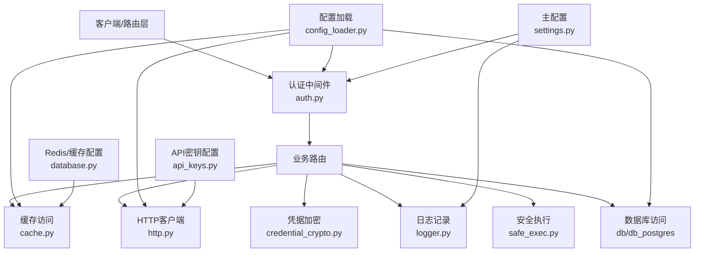

图表来源
- [backend_api_python/app/utils/auth.py:126-217](file://backend_api_python/app/utils/auth.py#L126-L217)
- [backend_api_python/app/utils/db_postgres.py:415-451](file://backend_api_python/app/utils/db_postgres.py#L415-L451)
- [backend_api_python/app/utils/http.py:9-42](file://backend_api_python/app/utils/http.py#L9-L42)
- [backend_api_python/app/utils/cache.py:49-129](file://backend_api_python/app/utils/cache.py#L49-L129)
- [backend_api_python/app/utils/logger.py:9-63](file://backend_api_python/app/utils/logger.py#L9-L63)
- [backend_api_python/app/utils/safe_exec.py:157-244](file://backend_api_python/app/utils/safe_exec.py#L157-L244)
- [backend_api_python/app/utils/credential_crypto.py:25-49](file://backend_api_python/app/utils/credential_crypto.py#L25-L49)
- [backend_api_python/app/utils/config_loader.py:24-161](file://backend_api_python/app/utils/config_loader.py#L24-L161)
- [backend_api_python/app/config/settings.py:30-91](file://backend_api_python/app/config/settings.py#L30-L91)
- [backend_api_python/app/config/database.py:6-90](file://backend_api_python/app/config/database.py#L6-L90)
- [backend_api_python/app/config/api_keys.py:7-184](file://backend_api_python/app/config/api_keys.py#L7-L184)

## 详细组件分析

### 认证工具(auth)
- 设计要点
  - 使用HS256算法生成含过期时间、用户信息与角色的JWT。
  - 支持“单客户端登录”控制：通过token_version与数据库中当前版本比对，实现踢出重复登录。
  - 提供Flask装饰器链：login_required、admin_required、manager_required、permission_required，统一在g对象中注入用户上下文。
  - 兼容旧版单用户模式，从环境变量读取管理员凭据。
- 关键流程
  - 令牌签发：构造payload并签名，异常时记录错误并返回None。
  - 令牌校验：解码payload并验证过期；若包含token_version则查询数据库比对，失败即拒绝。
  - 装饰器：从Authorization头提取Bearer token，校验失败返回401/403；成功将用户信息写入g。
- 扩展建议
  - 新增权限粒度：在permission_required中支持资源级权限与操作集合。
  - 多租户支持：在payload中加入tenant_id并在校验时校验租户绑定。
- 使用示例路径
  - [生成令牌:18-47](file://backend_api_python/app/utils/auth.py#L18-L47)
  - [校验令牌:50-79](file://backend_api_python/app/utils/auth.py#L50-L79)
  - [登录装饰器:126-157](file://backend_api_python/app/utils/auth.py#L126-L157)
  - [管理员装饰器:160-171](file://backend_api_python/app/utils/auth.py#L160-L171)
  - [权限装饰器:188-217](file://backend_api_python/app/utils/auth.py#L188-L217)

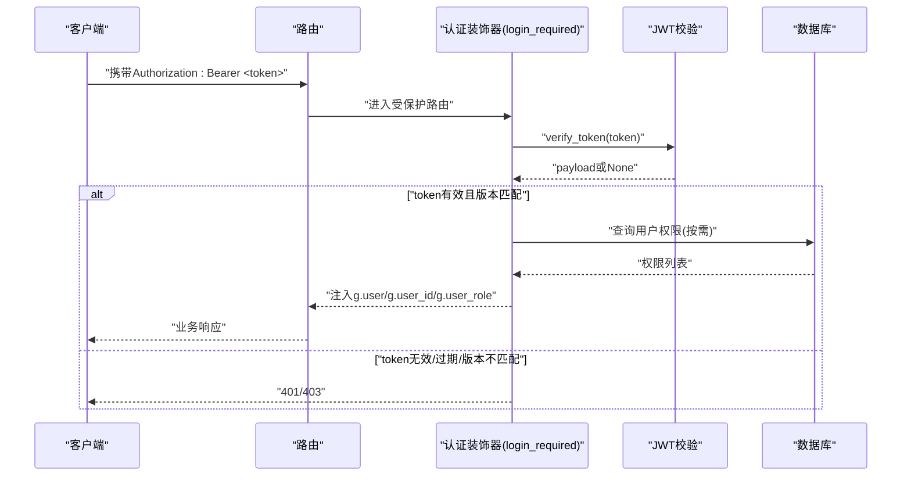

图表来源
- [backend_api_python/app/utils/auth.py:126-157](file://backend_api_python/app/utils/auth.py#L126-L157)
- [backend_api_python/app/utils/auth.py:50-79](file://backend_api_python/app/utils/auth.py#L50-L79)
- [backend_api_python/app/utils/auth.py:82-113](file://backend_api_python/app/utils/auth.py#L82-L113)

章节来源
- [backend_api_python/app/utils/auth.py:1-239](file://backend_api_python/app/utils/auth.py#L1-L239)

### 日志工具(logger)
- 设计要点
  - 启动时根据环境变量设置全局日志级别与格式。
  - 针对特定模块(如Werkzeug、kline路由)降低噪声，保留关键日志。
  - 为特定服务(如USDT支付、账单路由)在低级别下仍保留INFO以便排障。
  - 自动创建logs目录并使用RotatingFileHandler进行文件轮转。
- 使用建议
  - 在应用启动早期调用setup_logger，避免遗漏初始化。
  - 通过get_logger(name)获取命名Logger，便于区分模块与服务。
- 使用示例路径
  - [全局日志初始化:9-48](file://backend_api_python/app/utils/logger.py#L9-L48)
  - [获取Logger实例:51-61](file://backend_api_python/app/utils/logger.py#L51-L61)

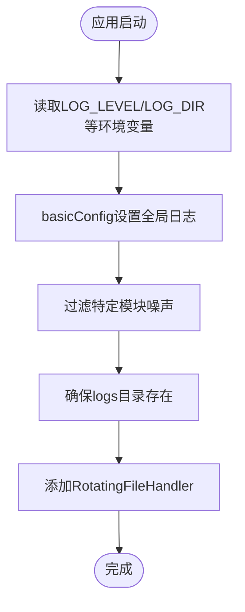

图表来源
- [backend_api_python/app/utils/logger.py:9-48](file://backend_api_python/app/utils/logger.py#L9-L48)

章节来源
- [backend_api_python/app/utils/logger.py:1-63](file://backend_api_python/app/utils/logger.py#L1-L63)

### 数据库工具(db/db_postgres)
- 设计要点
  - 通过ThreadedConnectionPool实现线程安全连接池，支持最小/最大连接数、获取超时与健康检查。
  - 提供上下文管理器get_pg_connection，自动处理异常回滚与连接归还，避免泄漏。
  - 支持占位符转换与INSERT RETURNING兼容，向后兼容旧SQL语法。
  - 环境变量驱动：DATABASE_URL、DB_POOL_MIN/MAX/ACQUIRE_TIMEOUT/HEALTH_CHECK。
- 关键流程
  - 连接池创建：解析DATABASE_URL，初始化连接池并记录配置。
  - 获取连接：等待DB_POOL_ACQUIRE_TIMEOUT秒，必要时进行轻量健康检查。
  - 执行SQL：转换占位符，处理INSERT返回ID，统一返回字典行。
- 性能与稳定性
  - 建议将路由级并行执行器工作线程与连接池上限协调，避免池耗尽。
  - 开启健康检查以剔除死连接，但注意额外round-trip开销。
- 使用示例路径
  - [连接池配置与创建:107-161](file://backend_api_python/app/utils/db_postgres.py#L107-L161)
  - [获取连接(等待+健康检查):184-234](file://backend_api_python/app/utils/db_postgres.py#L184-L234)
  - [上下文管理器使用:415-451](file://backend_api_python/app/utils/db_postgres.py#L415-L451)
  - [占位符转换与INSERT兼容:247-328](file://backend_api_python/app/utils/db_postgres.py#L247-L328)

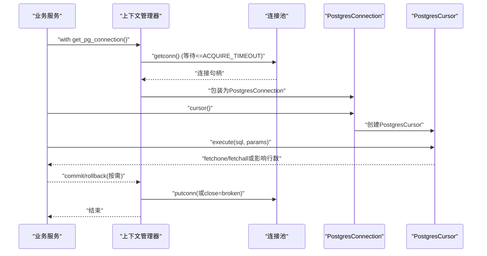

图表来源
- [backend_api_python/app/utils/db_postgres.py:415-451](file://backend_api_python/app/utils/db_postgres.py#L415-L451)
- [backend_api_python/app/utils/db_postgres.py:184-234](file://backend_api_python/app/utils/db_postgres.py#L184-L234)
- [backend_api_python/app/utils/db_postgres.py:237-382](file://backend_api_python/app/utils/db_postgres.py#L237-L382)

章节来源
- [backend_api_python/app/utils/db.py:1-66](file://backend_api_python/app/utils/db.py#L1-L66)
- [backend_api_python/app/utils/db_postgres.py:1-508](file://backend_api_python/app/utils/db_postgres.py#L1-L508)

### HTTP客户端(http)
- 设计要点
  - 基于requests.Session与urllib3.Retry实现自动重试，支持连接/读取/重试总次数与退避策略。
  - 默认挂载到http/https前缀，提供全局共享Session以复用TCP连接。
  - 可通过参数调整重试次数、状态码列表与退避因子。
- 使用建议
  - 对外请求统一使用get_retry_session或全局global_session，避免重复创建连接。
  - 针对不同服务设置不同的重试策略与超时，避免全局重试影响整体吞吐。
- 使用示例路径
  - [创建带重试的Session:9-36](file://backend_api_python/app/utils/http.py#L9-L36)
  - [全局共享Session:39-42](file://backend_api_python/app/utils/http.py#L39-L42)

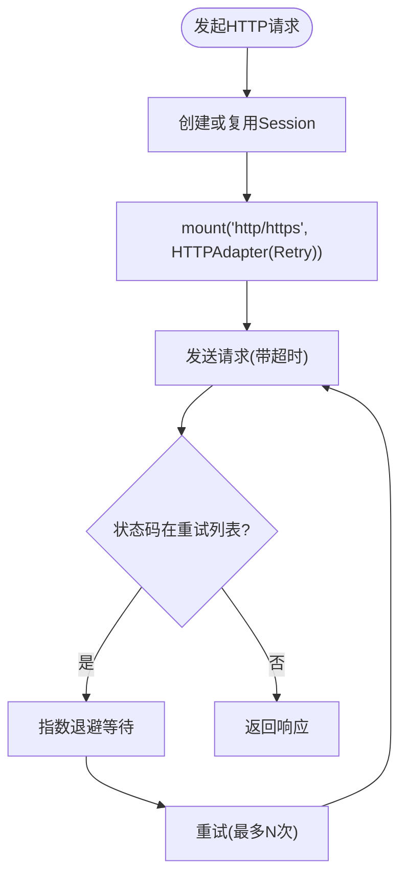

图表来源
- [backend_api_python/app/utils/http.py:9-36](file://backend_api_python/app/utils/http.py#L9-L36)

章节来源
- [backend_api_python/app/utils/http.py:1-42](file://backend_api_python/app/utils/http.py#L1-L42)

### 缓存(cache)
- 设计要点
  - 本地优先：默认使用内存缓存(MemoryCache)，支持TTL与线程锁保证一致性。
  - 可选Redis：当CacheConfig.ENABLED为真时尝试连接Redis，失败静默降级为内存缓存。
  - 统一接口：get/set/delete，内部进行JSON序列化/反序列化。
- 使用建议
  - 明确TTL策略，热点数据短TTL，冷数据长TTL，避免内存膨胀。
  - 对于跨进程/多实例部署，务必启用Redis并正确配置连接参数。
- 使用示例路径
  - [缓存管理器初始化与降级:63-99](file://backend_api_python/app/utils/cache.py#L63-L99)
  - [读写缓存(JSON序列化):100-124](file://backend_api_python/app/utils/cache.py#L100-L124)

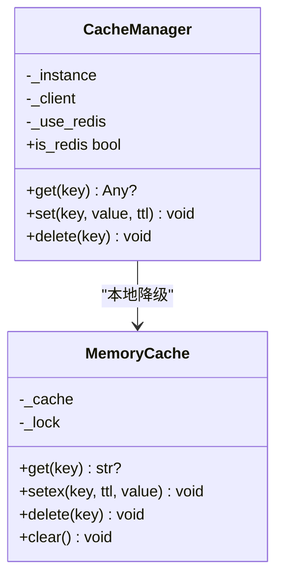

图表来源
- [backend_api_python/app/utils/cache.py:49-129](file://backend_api_python/app/utils/cache.py#L49-L129)

章节来源
- [backend_api_python/app/utils/cache.py:1-129](file://backend_api_python/app/utils/cache.py#L1-L129)
- [backend_api_python/app/config/database.py:49-90](file://backend_api_python/app/config/database.py#L49-L90)

### 配置加载(config_loader)
- 设计要点
  - 将环境变量映射为嵌套配置树，兼容旧版扁平键风格(openrouter.api_key → {...}结构)。
  - 支持字符串/整型/浮点/布尔/JSON等多种类型转换，失败时返回默认值。
  - 提供配置缓存，避免重复解析；支持清空缓存以适配热更新。
  - 提供内部API密钥读取，优先从环境变量获取，其次从映射配置中读取。
- 使用建议
  - 在应用启动时调用load_addon_config，后续通过字典访问。
  - 更新配置后调用clear_config_cache，确保下次读取生效。
- 使用示例路径
  - [环境变量映射与嵌套构造:41-160](file://backend_api_python/app/utils/config_loader.py#L41-L160)
  - [类型转换与默认值处理:163-215](file://backend_api_python/app/utils/config_loader.py#L163-L215)
  - [内部API密钥读取:217-240](file://backend_api_python/app/utils/config_loader.py#L217-L240)

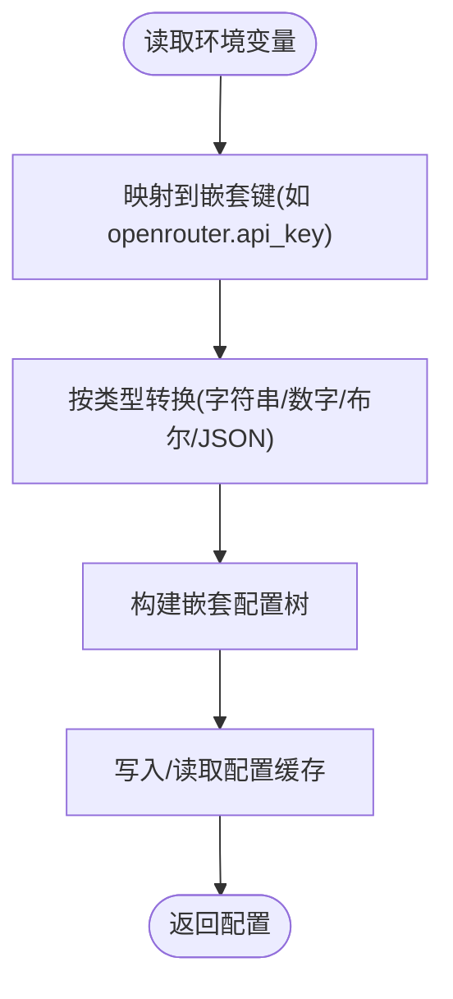

图表来源
- [backend_api_python/app/utils/config_loader.py:41-160](file://backend_api_python/app/utils/config_loader.py#L41-L160)
- [backend_api_python/app/utils/config_loader.py:163-215](file://backend_api_python/app/utils/config_loader.py#L163-L215)

章节来源
- [backend_api_python/app/utils/config_loader.py:1-251](file://backend_api_python/app/utils/config_loader.py#L1-L251)
- [backend_api_python/app/config/settings.py:66-91](file://backend_api_python/app/config/settings.py#L66-L91)
- [backend_api_python/env.example:311-319](file://backend_api_python/env.example#L311-L319)

### 安全执行(safe_exec)
- 设计要点
  - 白名单内置函数与受限导入模块，禁止危险API与I/O/反射能力。
  - 超时控制：Unix主线程使用SIGALRM，非主线程/Windows使用异步异常注入。
  - 内存限制：在支持平台通过RLIMIT_AS设置进程地址空间上限。
  - 子进程隔离：通过multiprocessing在独立进程中执行，结果仅返回picklable对象。
  - AST与正则双重校验：覆盖常见危险模式与模块导入。
- 使用建议
  - 对用户脚本执行必须先validate_code_safety，再注入受限__builtins__。
  - 设置合理的timeout与max_memory_mb，避免资源滥用。
  - 子进程隔离适合高风险场景，但有额外开销，需权衡。
- 使用示例路径
  - [白名单内置函数与导入模块:24-61](file://backend_api_python/app/utils/safe_exec.py#L24-L61)
  - [超时上下文(跨平台):97-153](file://backend_api_python/app/utils/safe_exec.py#L97-L153)
  - [安全执行与错误处理:157-205](file://backend_api_python/app/utils/safe_exec.py#L157-L205)
  - [预导入与一次性执行:207-244](file://backend_api_python/app/utils/safe_exec.py#L207-L244)
  - [子进程隔离执行:248-354](file://backend_api_python/app/utils/safe_exec.py#L248-L354)
  - [AST/正则双重安全校验:358-471](file://backend_api_python/app/utils/safe_exec.py#L358-L471)

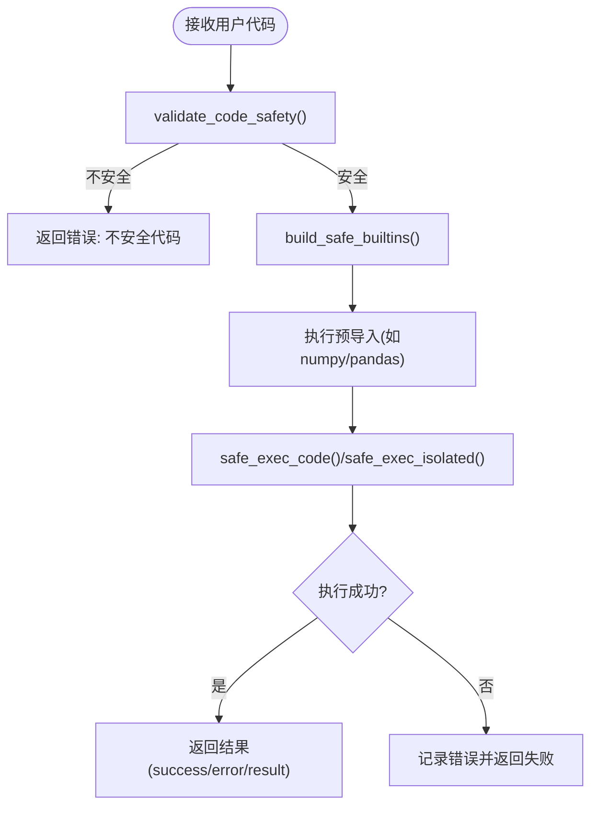

图表来源
- [backend_api_python/app/utils/safe_exec.py:207-244](file://backend_api_python/app/utils/safe_exec.py#L207-L244)
- [backend_api_python/app/utils/safe_exec.py:157-205](file://backend_api_python/app/utils/safe_exec.py#L157-L205)
- [backend_api_python/app/utils/safe_exec.py:358-471](file://backend_api_python/app/utils/safe_exec.py#L358-L471)

章节来源
- [backend_api_python/app/utils/safe_exec.py:1-471](file://backend_api_python/app/utils/safe_exec.py#L1-L471)

### 凭据加密(credential_crypto)
- 设计要点
  - 基于Fernet对称加密，密钥由环境变量SECRET_KEY经SHA-256与URL安全Base64编码生成。
  - 支持加密与解密，解密失败抛出明确异常提示密钥不匹配或数据未加密。
- 使用建议
  - SECRET_KEY应妥善保管，变更密钥会导致历史数据无法解密。
  - 仅对敏感字段(如交易所凭据)进行加密存储。
- 使用示例路径
  - [从SECRET_KEY派生Fernet密钥:17-22](file://backend_api_python/app/utils/credential_crypto.py#L17-L22)
  - [加密JSON文本:25-30](file://backend_api_python/app/utils/credential_crypto.py#L25-L30)
  - [解密存储值:33-49](file://backend_api_python/app/utils/credential_crypto.py#L33-L49)

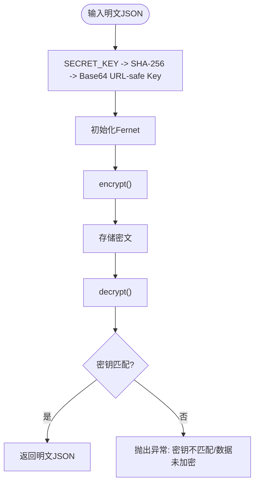

图表来源
- [backend_api_python/app/utils/credential_crypto.py:17-49](file://backend_api_python/app/utils/credential_crypto.py#L17-L49)

章节来源
- [backend_api_python/app/utils/credential_crypto.py:1-50](file://backend_api_python/app/utils/credential_crypto.py#L1-L50)

## 依赖分析
- 模块耦合
  - 认证依赖主配置(Config)与日志；权限装饰器依赖用户服务(延迟导入避免循环)。
  - 数据库工具依赖日志与环境变量；上下文管理器负责异常回滚与连接归还。
  - HTTP工具依赖requests与urllib3；全局Session复用连接。
  - 缓存依赖配置模块；Redis不可用时自动降级。
  - 配置加载被多个模块依赖，提供统一的环境变量映射。
  - 安全执行依赖内置白名单与AST/正则校验；子进程隔离依赖multiprocessing。
  - 凭据加密依赖Cryptography库与环境SECRET_KEY。
- 外部依赖
  - PostgreSQL: psycopg2与ThreadedConnectionPool。
  - Redis: redis库(可选)。
  - HTTP: requests + urllib3 Retry。
  - 加密: cryptography(Fernet)。
- 循环依赖规避
  - 权限装饰器中延迟导入用户服务，避免auth与service互相导入。

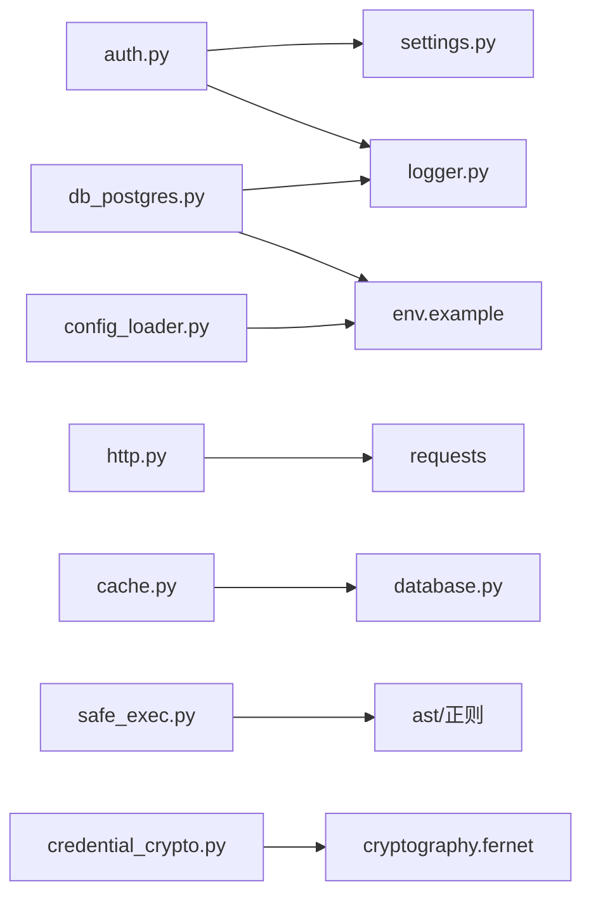

图表来源
- [backend_api_python/app/utils/auth.py:10-15](file://backend_api_python/app/utils/auth.py#L10-L15)
- [backend_api_python/app/utils/db_postgres.py:22-31](file://backend_api_python/app/utils/db_postgres.py#L22-L31)
- [backend_api_python/app/utils/http.py:4-6](file://backend_api_python/app/utils/http.py#L4-L6)
- [backend_api_python/app/utils/cache.py:11-12](file://backend_api_python/app/utils/cache.py#L11-L12)
- [backend_api_python/app/utils/config_loader.py:13-18](file://backend_api_python/app/utils/config_loader.py#L13-L18)
- [backend_api_python/app/utils/safe_exec.py:10-16](file://backend_api_python/app/utils/safe_exec.py#L10-L16)
- [backend_api_python/app/utils/credential_crypto.py:14-14](file://backend_api_python/app/utils/credential_crypto.py#L14-L14)

章节来源
- [backend_api_python/app/utils/auth.py:1-239](file://backend_api_python/app/utils/auth.py#L1-L239)
- [backend_api_python/app/utils/db_postgres.py:1-508](file://backend_api_python/app/utils/db_postgres.py#L1-L508)
- [backend_api_python/app/utils/http.py:1-42](file://backend_api_python/app/utils/http.py#L1-L42)
- [backend_api_python/app/utils/cache.py:1-129](file://backend_api_python/app/utils/cache.py#L1-L129)
- [backend_api_python/app/utils/config_loader.py:1-251](file://backend_api_python/app/utils/config_loader.py#L1-L251)
- [backend_api_python/app/utils/safe_exec.py:1-471](file://backend_api_python/app/utils/safe_exec.py#L1-L471)
- [backend_api_python/app/utils/credential_crypto.py:1-50](file://backend_api_python/app/utils/credential_crypto.py#L1-L50)

## 性能考量
- 连接池与等待
  - 合理设置DB_POOL_MIN/MAX与ACQUIRE_TIMEOUT，避免频繁PoolError与长时间等待。
  - 健康检查提升稳定性但增加开销，可根据SLA权衡开启。
- HTTP重试
  - 为易波动的外部服务设置更积极的重试策略，但避免对幂等性差的请求过度重试。
- 缓存策略
  - 热点数据短TTL，冷数据长TTL；Redis可显著降低数据库压力，但需关注网络抖动。
- 安全执行
  - 适度提高timeout与max_memory_mb，避免误杀合法计算；子进程隔离成本更高但更安全。
- 日志
  - 控制日志级别与文件轮转大小，避免磁盘IO成为瓶颈。

## 故障排查指南
- 认证
  - 401/403：检查Authorization头格式、token是否过期、token_version是否与数据库一致。
  - 单客户端被踢：确认新登录导致token_version递增，旧token失效属预期行为。
- 数据库
  - PoolError: connection pool exhausted：增大DB_POOL_MAX或优化查询，检查是否存在长事务未提交。
  - 连接不可用：检查DATABASE_URL格式与可达性，确认PG最大连接数配置。
- HTTP
  - 请求失败/超时：检查重试策略与超时设置，确认代理与证书配置。
- 缓存
  - Redis不可用：确认RedisConfig参数与连通性；工具会自动降级为内存缓存。
- 配置
  - 配置读取为空：检查环境变量命名与映射规则，必要时调用clear_config_cache刷新。
- 安全执行
  - 超时/内存不足：适当提高timeout与max_memory_mb；必要时启用子进程隔离。
- 凭据加密
  - 解密失败：确认SECRET_KEY未变更，数据确为该密钥加密。

章节来源
- [backend_api_python/app/utils/auth.py:143-157](file://backend_api_python/app/utils/auth.py#L143-L157)
- [backend_api_python/app/utils/db_postgres.py:205-210](file://backend_api_python/app/utils/db_postgres.py#L205-L210)
- [backend_api_python/app/utils/http.py:9-36](file://backend_api_python/app/utils/http.py#L9-L36)
- [backend_api_python/app/utils/cache.py:94-98](file://backend_api_python/app/utils/cache.py#L94-L98)
- [backend_api_python/app/utils/config_loader.py:243-249](file://backend_api_python/app/utils/config_loader.py#L243-L249)
- [backend_api_python/app/utils/safe_exec.py:189-204](file://backend_api_python/app/utils/safe_exec.py#L189-L204)
- [backend_api_python/app/utils/credential_crypto.py:46-49](file://backend_api_python/app/utils/credential_crypto.py#L46-L49)

## 结论
QuantDinger工具模块以“环境变量驱动 + 上下文管理器 + 装饰器中间件”为核心设计思想，实现了认证、日志、数据库、HTTP、缓存、配置、安全执行与凭据加密等通用能力。通过连接池、重试、降级与白名单等机制，兼顾了性能、稳定与安全。建议在生产环境中结合业务特性合理配置参数，持续监控关键指标，并遵循最佳实践以获得最佳体验。

## 附录
- 环境变量参考
  - 认证与安全：SECRET_KEY、ADMIN_USER、ADMIN_PASSWORD、RATE_LIMIT、ENABLE_CACHE、ENABLE_REQUEST_LOG。
  - 数据库：DATABASE_URL、DB_POOL_MIN、DB_POOL_MAX、DB_POOL_ACQUIRE_TIMEOUT、DB_POOL_HEALTH_CHECK。
  - 缓存：REDIS_HOST、REDIS_PORT、REDIS_PASSWORD、REDIS_DB、CACHE_ENABLED、CACHE_EXPIRE。
  - 第三方API：OPENROUTER_API_KEY、OPENAI_API_KEY、GOOGLE_API_KEY、FINNHUB_API_KEY等。
- 使用清单
  - 认证：在路由上叠加@login_required/@admin_required/@permission_required。
  - 日志：在应用启动早期调用setup_logger，按模块获取Logger。
  - 数据库：优先使用上下文管理器，避免忘记commit/rollback。
  - HTTP：统一使用get_retry_session或global_session。
  - 缓存：明确TTL策略，Redis不可用时自动降级。
  - 配置：通过load_addon_config读取嵌套配置，必要时clear_config_cache。
  - 安全执行：先validate_code_safety，再注入受限__builtins__，最后执行。
  - 凭据加密：使用SECRET_KEY进行对称加解密，妥善保管密钥。

章节来源
- [backend_api_python/env.example:1-319](file://backend_api_python/env.example#L1-L319)
- [backend_api_python/app/config/settings.py:66-91](file://backend_api_python/app/config/settings.py#L66-L91)
- [backend_api_python/app/config/database.py:6-90](file://backend_api_python/app/config/database.py#L6-L90)
- [backend_api_python/app/config/api_keys.py:10-184](file://backend_api_python/app/config/api_keys.py#L10-L184)
- [backend_api_python/app/utils/config_loader.py:24-161](file://backend_api_python/app/utils/config_loader.py#L24-L161)