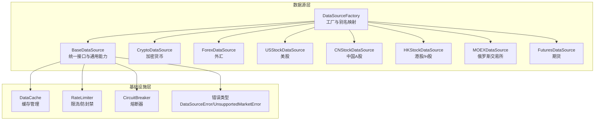
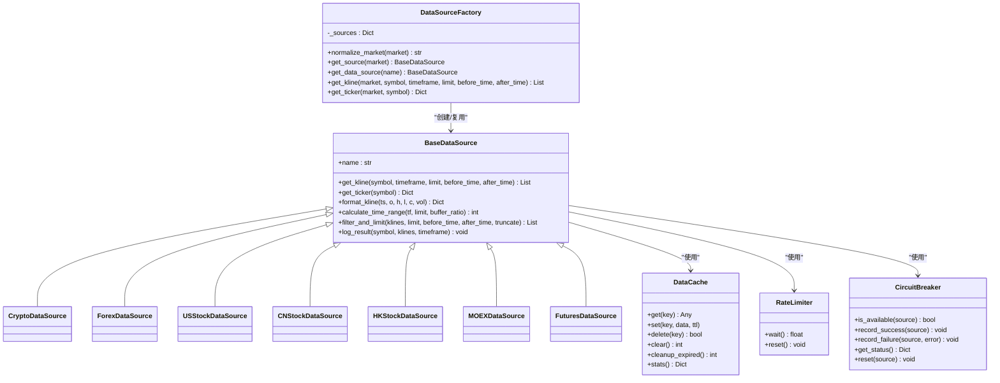
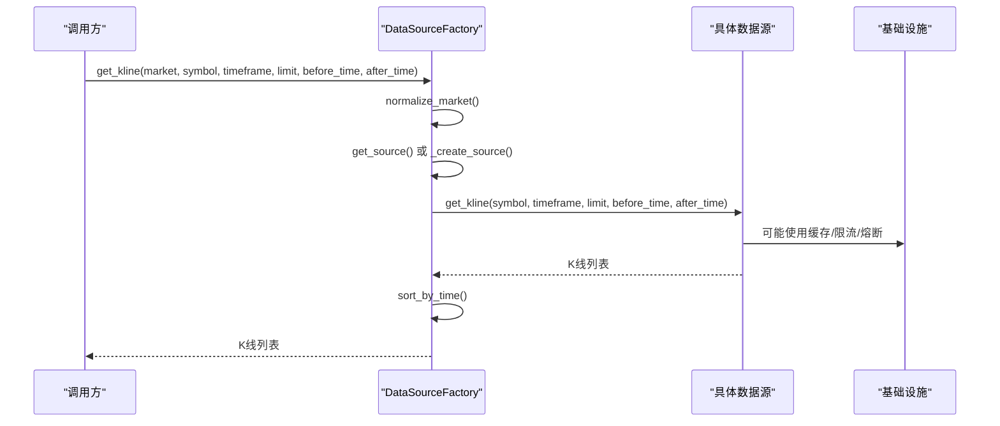
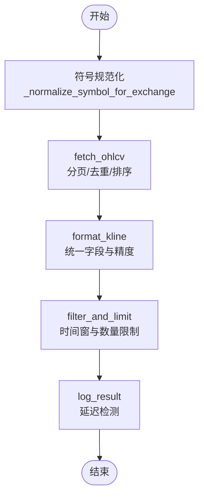
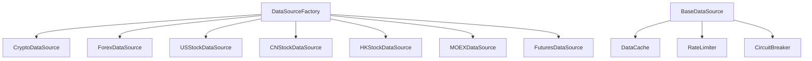

# 数据源架构设计

<cite>
**本文档引用的文件**
- [backend_api_python/app/data_sources/base.py](file://backend_api_python/app/data_sources/base.py)
- [backend_api_python/app/data_sources/factory.py](file://backend_api_python/app/data_sources/factory.py)
- [backend_api_python/app/data_sources/crypto.py](file://backend_api_python/app/data_sources/crypto.py)
- [backend_api_python/app/data_sources/forex.py](file://backend_api_python/app/data_sources/forex.py)
- [backend_api_python/app/data_sources/us_stock.py](file://backend_api_python/app/data_sources/us_stock.py)
- [backend_api_python/app/data_sources/cn_stock.py](file://backend_api_python/app/data_sources/cn_stock.py)
- [backend_api_python/app/data_sources/hk_stock.py](file://backend_api_python/app/data_sources/hk_stock.py)
- [backend_api_python/app/data_sources/moex.py](file://backend_api_python/app/data_sources/moex.py)
- [backend_api_python/app/data_sources/futures.py](file://backend_api_python/app/data_sources/futures.py)
- [backend_api_python/app/data_sources/cache_manager.py](file://backend_api_python/app/data_sources/cache_manager.py)
- [backend_api_python/app/data_sources/rate_limiter.py](file://backend_api_python/app/data_sources/rate_limiter.py)
- [backend_api_python/app/data_sources/circuit_breaker.py](file://backend_api_python/app/data_sources/circuit_breaker.py)
- [backend_api_python/app/data_sources/errors.py](file://backend_api_python/app/data_sources/errors.py)
- [backend_api_python/app/data_sources/__init__.py](file://backend_api_python/app/data_sources/__init__.py)
</cite>

## 目录
1. [引言](#引言)
2. [项目结构](#项目结构)
3. [核心组件](#核心组件)
4. [架构总览](#架构总览)
5. [详细组件分析](#详细组件分析)
6. [依赖关系分析](#依赖关系分析)
7. [性能考虑](#性能考虑)
8. [故障排除指南](#故障排除指南)
9. [结论](#结论)
10. [附录](#附录)

## 引言
本设计文档面向QuantDinger项目的“数据源架构”，系统阐述数据源工厂模式的设计原理与实现机制，涵盖数据源的动态创建、配置管理与生命周期控制；详解BaseDataSource基类的统一接口、错误处理与性能优化；对比分析加密货币、股票、外汇等各类数据源的实现特点与差异；并提供扩展指南，帮助开发者安全地新增或修改数据源。

## 项目结构
数据源相关代码集中于backend_api_python/app/data_sources目录，采用“按领域/市场类型”组织的模块化布局：
- 基类与工厂：base.py、factory.py
- 具体数据源：crypto.py、forex.py、us_stock.py、cn_stock.py、hk_stock.py、moex.py、futures.py
- 基础设施：cache_manager.py（缓存）、rate_limiter.py（限流/防封禁）、circuit_breaker.py（熔断器）、errors.py（错误类型）
- 导出入口：__init__.py

图表来源
- [backend_api_python/app/data_sources/base.py:28-180](file://backend_api_python/app/data_sources/base.py#L28-L180)
- [backend_api_python/app/data_sources/factory.py:33-178](file://backend_api_python/app/data_sources/factory.py#L33-L178)
- [backend_api_python/app/data_sources/crypto.py:16-428](file://backend_api_python/app/data_sources/crypto.py#L16-L428)
- [backend_api_python/app/data_sources/forex.py:104-709](file://backend_api_python/app/data_sources/forex.py#L104-L709)
- [backend_api_python/app/data_sources/us_stock.py:17-361](file://backend_api_python/app/data_sources/us_stock.py#L17-L361)
- [backend_api_python/app/data_sources/cn_stock.py:30-125](file://backend_api_python/app/data_sources/cn_stock.py#L30-L125)
- [backend_api_python/app/data_sources/hk_stock.py:30-125](file://backend_api_python/app/data_sources/hk_stock.py#L30-L125)
- [backend_api_python/app/data_sources/moex.py:57-314](file://backend_api_python/app/data_sources/moex.py#L57-L314)
- [backend_api_python/app/data_sources/futures.py:60-468](file://backend_api_python/app/data_sources/futures.py#L60-L468)
- [backend_api_python/app/data_sources/cache_manager.py:44-233](file://backend_api_python/app/data_sources/cache_manager.py#L44-L233)
- [backend_api_python/app/data_sources/rate_limiter.py:109-273](file://backend_api_python/app/data_sources/rate_limiter.py#L109-L273)
- [backend_api_python/app/data_sources/circuit_breaker.py:31-175](file://backend_api_python/app/data_sources/circuit_breaker.py#L31-L175)
- [backend_api_python/app/data_sources/errors.py:4-15](file://backend_api_python/app/data_sources/errors.py#L4-L15)

章节来源
- [backend_api_python/app/data_sources/__init__.py:1-52](file://backend_api_python/app/data_sources/__init__.py#L1-L52)

## 核心组件
本节聚焦数据源架构的核心构件：工厂模式、基类抽象、基础设施三大部分。

- 工厂模式（DataSourceFactory）
  - 职责：根据市场类型字符串动态创建并复用对应数据源实例；提供便捷的K线与实时报价获取方法；维护市场别名映射与标准化逻辑。
  - 关键点：懒加载、单例缓存、异常捕获与降级返回空结果或默认值。
- 基类（BaseDataSource）
  - 职责：定义统一的get_kline与可选get_ticker接口；提供K线格式化、时间范围计算、过滤截断、延迟检测等通用能力；保证各子类的一致行为。
  - 关键点：抽象接口约束、可选接口默认抛出NotImplementedError；统一的K线字段与精度处理；基于UTC时间的延迟告警策略。
- 基础设施
  - 缓存（DataCache）：TTL过期、LRU淘汰、线程安全、命中率统计。
  - 限流/防封禁（RateLimiter）：最小间隔、抖动、指数退避重试、UA轮换。
  - 熔断器（CircuitBreaker）：三态状态机（Closed/Open/Half-Open），失败阈值与冷却时间控制。

章节来源
- [backend_api_python/app/data_sources/factory.py:33-178](file://backend_api_python/app/data_sources/factory.py#L33-L178)
- [backend_api_python/app/data_sources/base.py:28-180](file://backend_api_python/app/data_sources/base.py#L28-L180)
- [backend_api_python/app/data_sources/cache_manager.py:44-233](file://backend_api_python/app/data_sources/cache_manager.py#L44-L233)
- [backend_api_python/app/data_sources/rate_limiter.py:109-273](file://backend_api_python/app/data_sources/rate_limiter.py#L109-L273)
- [backend_api_python/app/data_sources/circuit_breaker.py:31-175](file://backend_api_python/app/data_sources/circuit_breaker.py#L31-L175)

## 架构总览
下图展示工厂、基类与各数据源之间的关系，以及与基础设施的协作：

图表来源
- [backend_api_python/app/data_sources/base.py:28-180](file://backend_api_python/app/data_sources/base.py#L28-L180)
- [backend_api_python/app/data_sources/factory.py:33-178](file://backend_api_python/app/data_sources/factory.py#L33-L178)
- [backend_api_python/app/data_sources/crypto.py:16-428](file://backend_api_python/app/data_sources/crypto.py#L16-L428)
- [backend_api_python/app/data_sources/forex.py:104-709](file://backend_api_python/app/data_sources/forex.py#L104-L709)
- [backend_api_python/app/data_sources/us_stock.py:17-361](file://backend_api_python/app/data_sources/us_stock.py#L17-L361)
- [backend_api_python/app/data_sources/cn_stock.py:30-125](file://backend_api_python/app/data_sources/cn_stock.py#L30-L125)
- [backend_api_python/app/data_sources/hk_stock.py:30-125](file://backend_api_python/app/data_sources/hk_stock.py#L30-L125)
- [backend_api_python/app/data_sources/moex.py:57-314](file://backend_api_python/app/data_sources/moex.py#L57-L314)
- [backend_api_python/app/data_sources/futures.py:60-468](file://backend_api_python/app/data_sources/futures.py#L60-L468)
- [backend_api_python/app/data_sources/cache_manager.py:44-233](file://backend_api_python/app/data_sources/cache_manager.py#L44-L233)
- [backend_api_python/app/data_sources/rate_limiter.py:109-273](file://backend_api_python/app/data_sources/rate_limiter.py#L109-L273)
- [backend_api_python/app/data_sources/circuit_breaker.py:31-175](file://backend_api_python/app/data_sources/circuit_breaker.py#L31-L175)

## 详细组件分析

### 工厂模式：DataSourceFactory
- 市场别名与标准化
  - 提供_normalize_market，将用户输入归一化为标准枚举（如Crypto、Forex、USStock、CNStock、HKStock、Futures、MOEX），并支持空值默认。
  - 内部_alias表覆盖常用别名，便于前端/路由层灵活传参。
- 实例化与缓存
  - _create_source按标准枚举导入对应模块并构造实例，首次访问时创建并缓存于内存字典。
  - get_source返回缓存实例，避免重复初始化。
- 便捷接口
  - get_kline与get_ticker封装异常捕获，统一排序与日志记录；失败时返回空结果或默认值，保障上层健壮性。
- 错误处理
  - 对未知市场类型抛出UnsupportedMarketError；对实现缺失的get_ticker返回默认值并记录告警。

图表来源
- [backend_api_python/app/data_sources/factory.py:52-149](file://backend_api_python/app/data_sources/factory.py#L52-L149)

章节来源
- [backend_api_python/app/data_sources/factory.py:33-178](file://backend_api_python/app/data_sources/factory.py#L33-L178)
- [backend_api_python/app/data_sources/errors.py:8-15](file://backend_api_python/app/data_sources/errors.py#L8-L15)

### 基类：BaseDataSource
- 统一接口
  - get_kline：必须实现；参数包含symbol、timeframe、limit及可选的时间窗过滤after_time/before_time。
  - get_ticker：可选实现；默认抛出NotImplementedError，由工厂层进行降级处理。
- 通用能力
  - format_kline：统一K线字段与精度（time、open、high、low、close、volume）。
  - calculate_time_range：基于timeframe映射计算请求窗口秒数，含buffer_ratio。
  - filter_and_limit：按时间边界过滤与数量截断，支持回测场景的“不截断左端”策略。
  - log_result：基于UTC时间计算最新K线与当前时间差，按周期阈值发出延迟告警。
- 设计原则
  - 通过抽象接口约束子类行为，确保上层调用一致性。
  - 将错误处理与日志记录下沉至基类，降低重复代码。

章节来源
- [backend_api_python/app/data_sources/base.py:28-180](file://backend_api_python/app/data_sources/base.py#L28-L180)

### 加密货币数据源：CryptoDataSource
- 特点
  - 基于CCXT，支持多交易所（默认可配置，不支持时回退）。
  - 符号规范化与交易所适配：处理含冒号的永续/交割合约、不同交易所的符号差异（如Coinbase USD vs USDT）。
  - K线获取：支持分页拉取（针对特定交易所限制），去重与排序，最终格式化与过滤。
  - 实时报价：优先规范化符号，失败时尝试在markets中查找替代符号。
- 性能与鲁棒性
  - fallback路径：fetch_ohlcv失败时自动切换到备用实现。
  - 严格的时间边界处理：before_time安全上限、起止时间计算与分页推进。
  - 详细的日志与trace输出，便于回测窗口校验。

图表来源
- [backend_api_python/app/data_sources/crypto.py:232-306](file://backend_api_python/app/data_sources/crypto.py#L232-L306)

章节来源
- [backend_api_python/app/data_sources/crypto.py:16-428](file://backend_api_python/app/data_sources/crypto.py#L16-L428)

### 外汇数据源：ForexDataSource
- 特点
  - 三级降级：Twelve Data（主）→ Tiingo（备）→ yfinance（末备）。
  - 符号映射：提供Twelve Data、Tiingo、yfinance的符号映射与格式转换。
  - K线聚合：Tiingo日线聚合为周线/月线，支持时间范围限制与免费额度控制。
  - 实时报价：全局缓存（TTL）+多源尝试，失败时返回默认值。
- 性能与鲁棒性
  - 速率限制处理：Tiingo 429时的重试与降级策略。
  - 缓存：ticker结果短期缓存，减少重复请求。
  - 多种时间周期映射，满足不同粒度需求。

章节来源
- [backend_api_python/app/data_sources/forex.py:104-709](file://backend_api_python/app/data_sources/forex.py#L104-L709)

### 美股数据源：USStockDataSource
- 特点
  - 优先级：Finnhub（实时）→ yfinance fast_info → yfinance info → 历史1分钟回退。
  - K线获取：按timeframe映射yfinance interval，结合天数估算计算日期范围；支持合并（如3分钟合成）。
  - 实时报价：综合多个字段，计算涨跌与涨跌幅。
- 性能与鲁棒性
  - 多路径降级，提升可用性。
  - 严格的时间边界与过滤，避免越界数据。

章节来源
- [backend_api_python/app/data_sources/us_stock.py:17-361](file://backend_api_python/app/data_sources/us_stock.py#L17-L361)

### 中国A股数据源：CNStockDataSource
- 特点
  - 多层降级：Twelve Data（主，付费）→ 腾讯日/周线 → yfinance → AkShare。
  - 代码规范化与多源适配，支持分钟/日/周线。
- 性能与鲁棒性
  - 根据是否配置API Key选择不同路径，兼顾免费与付费场景。
  - 对AkShare等第三方库的脆弱性采取最后手段策略。

章节来源
- [backend_api_python/app/data_sources/cn_stock.py:30-125](file://backend_api_python/app/data_sources/cn_stock.py#L30-L125)

### 港股/H股数据源：HKStockDataSource
- 特点
  - 与A股类似，多层降级路径，针对港股特性优化。
- 性能与鲁棒性
  - 腾讯日/周线优先，yfinance与AkShare作为后备。

章节来源
- [backend_api_python/app/data_sources/hk_stock.py:30-125](file://backend_api_python/app/data_sources/hk_stock.py#L30-L125)

### 俄罗斯交易所数据源：MOEXDataSource
- 特点
  - 仅提供历史数据与最新报价，基于ISS公共API。
  - 时间周期映射与原生区间映射，非原生周期进行重采样。
  - 符号清洗与莫斯科时间处理（UTC+3）。
- 性能与鲁棒性
  - 分页拉取（最多50页），列索引解析与异常容错。
  - 非原生周期（5/15/30分钟、4H）进行桶聚合。

章节来源
- [backend_api_python/app/data_sources/moex.py:57-314](file://backend_api_python/app/data_sources/moex.py#L57-L314)

### 期货数据源：FuturesDataSource
- 特点
  - 传统期货：Twelve Data → yfinance → Tiingo（贵金属）。
  - 加密货币期货：CCXT（Binance Futures）。
  - 符号与周期映射：区分传统合约与加密货币期货。
- 性能与鲁棒性
  - 传统期货K线按时间范围与周期映射获取，贵金属通过Tiingo FX。
  - 加密货币期货直接使用CCXT OHLCV。

章节来源
- [backend_api_python/app/data_sources/futures.py:60-468](file://backend_api_python/app/data_sources/futures.py#L60-L468)

### 缓存管理：DataCache
- 能力
  - TTL过期、LRU淘汰、线程安全、命中统计。
  - 提供实时行情、K线、股票信息三类缓存实例与键生成工具。
- 使用建议
  - K线缓存键包含symbol、timeframe、limit与可选before_time，避免缓存污染。
  - 合理设置TTL与容量，平衡内存占用与命中率。

章节来源
- [backend_api_python/app/data_sources/cache_manager.py:44-233](file://backend_api_python/app/data_sources/cache_manager.py#L44-L233)

### 限流与防封禁：RateLimiter
- 能力
  - 最小间隔、抖动、指数退避重试、UA轮换。
  - 针对不同第三方接口提供专用限流器实例。
- 使用建议
  - 在高频请求场景启用随机休眠与UA轮换。
  - 对易触发限流的接口（如东方财富、AkShare）使用更严格限流器。

章节来源
- [backend_api_python/app/data_sources/rate_limiter.py:109-273](file://backend_api_python/app/data_sources/rate_limiter.py#L109-L273)

### 熔断器：CircuitBreaker
- 能力
  - 三态状态机：Closed/Open/Half-Open；失败阈值与冷却时间控制。
  - 半开状态限制尝试次数，成功则完全恢复，失败则继续熔断。
- 使用建议
  - 对不稳定第三方接口启用熔断器，避免雪崩效应。
  - 结合日志监控熔断状态变化。

章节来源
- [backend_api_python/app/data_sources/circuit_breaker.py:31-175](file://backend_api_python/app/data_sources/circuit_breaker.py#L31-L175)

## 依赖关系分析
- 组件耦合
  - 工厂与具体数据源：弱耦合，通过字符串枚举与动态导入解耦。
  - 基类与基础设施：松耦合，通过组合方式被子类复用。
  - 具体数据源间：无直接依赖，各自独立实现。
- 外部依赖
  - 加密货币：CCXT（交易所库）
  - 外汇：Twelve Data、Tiingo、yfinance
  - 股票：yfinance、finnhub（可选）
  - 俄罗斯交易所：HTTP ISS API
- 循环依赖
  - 未发现循环导入；工厂按需导入具体数据源类。

图表来源
- [backend_api_python/app/data_sources/factory.py:87-111](file://backend_api_python/app/data_sources/factory.py#L87-L111)
- [backend_api_python/app/data_sources/base.py:9-11](file://backend_api_python/app/data_sources/base.py#L9-L11)

章节来源
- [backend_api_python/app/data_sources/factory.py:33-178](file://backend_api_python/app/data_sources/factory.py#L33-L178)
- [backend_api_python/app/data_sources/base.py:28-180](file://backend_api_python/app/data_sources/base.py#L28-L180)

## 性能考虑
- 请求频率控制
  - 使用RateLimiter在请求间引入随机抖动，模拟人类行为，降低被封禁风险。
  - 对高限流风险接口（如东方财富、AkShare）采用更严格限流器。
- 缓存策略
  - K线缓存TTL短（5分钟），避免过期数据影响策略回测；实时行情缓存较长（20分钟）。
  - 缓存键包含关键参数，避免跨参数污染。
- 数据获取优化
  - 基于timeframe映射与buffer_ratio估算合理的时间窗口，减少无效请求。
  - 分页拉取与去重排序，确保数据完整性与一致性。
- 熔断器保护
  - 对不稳定接口启用熔断器，避免连续失败导致系统雪崩。

## 故障排除指南
- 常见问题
  - 未知市场类型：检查工厂的_normalize_market与_alias映射，确认传入值是否合法。
  - get_ticker未实现：工厂层会降级返回默认值，确认目标数据源是否实现了该接口。
  - 数据延迟告警：检查log_result输出，确认timeframe阈值与latest bar时间差。
  - 外汇数据受限：Twelve Data或Tiingo API Key缺失会导致数据受限，检查环境变量与配置。
  - 加密货币符号错误：使用符号规范化流程，必要时在markets中查找有效符号。
- 排查步骤
  - 查看工厂日志与错误堆栈，定位失败环节。
  - 检查缓存命中情况与TTL设置。
  - 对不稳定接口启用熔断器并观察状态变化。
  - 验证限流器配置与UA轮换是否生效。

章节来源
- [backend_api_python/app/data_sources/factory.py:146-177](file://backend_api_python/app/data_sources/factory.py#L146-L177)
- [backend_api_python/app/data_sources/base.py:142-178](file://backend_api_python/app/data_sources/base.py#L142-L178)
- [backend_api_python/app/data_sources/forex.py:122-128](file://backend_api_python/app/data_sources/forex.py#L122-L128)
- [backend_api_python/app/data_sources/crypto.py:210-230](file://backend_api_python/app/data_sources/crypto.py#L210-L230)
- [backend_api_python/app/data_sources/circuit_breaker.py:67-100](file://backend_api_python/app/data_sources/circuit_breaker.py#L67-L100)

## 结论
QuantDinger的数据源架构通过工厂模式实现了“按需创建、统一接口、可插拔扩展”的设计目标。BaseDataSource提供了稳定的抽象与通用能力，配合缓存、限流与熔断器等基础设施，显著提升了系统的鲁棒性与性能。各类数据源在保持统一接口的同时，针对自身领域特性（如加密货币的多交易所适配、外汇的多源降级、MOEX的重采样）实现了差异化实现。整体架构清晰、扩展性强，适合持续演进与新数据源接入。

## 附录

### 新增数据源技术要求与最佳实践
- 必须继承BaseDataSource并实现以下内容
  - get_kline：按参数返回K线列表，遵循基类格式约定。
  - get_ticker：可选实现；若不支持，保持默认抛出NotImplementedError。
- 命名与导出
  - 文件命名采用小写，类名采用PascalCase；在__init__.py中导出以便工厂识别。
- 工厂注册
  - 在工厂的_create_source中增加分支，返回新数据源实例。
- 配置与依赖
  - 如需外部API，提供配置项与错误处理；避免硬编码密钥。
- 性能与稳定性
  - 使用RateLimiter与DataCache；对外部接口实现指数退避与熔断器保护。
- 测试与验证
  - 提供单元测试覆盖关键路径；验证时间窗过滤、符号规范化、降级策略等。

章节来源
- [backend_api_python/app/data_sources/base.py:28-66](file://backend_api_python/app/data_sources/base.py#L28-L66)
- [backend_api_python/app/data_sources/factory.py:87-111](file://backend_api_python/app/data_sources/factory.py#L87-L111)
- [backend_api_python/app/data_sources/rate_limiter.py:170-232](file://backend_api_python/app/data_sources/rate_limiter.py#L170-L232)
- [backend_api_python/app/data_sources/cache_manager.py:203-233](file://backend_api_python/app/data_sources/cache_manager.py#L203-L233)
- [backend_api_python/app/data_sources/circuit_breaker.py:31-100](file://backend_api_python/app/data_sources/circuit_breaker.py#L31-L100)