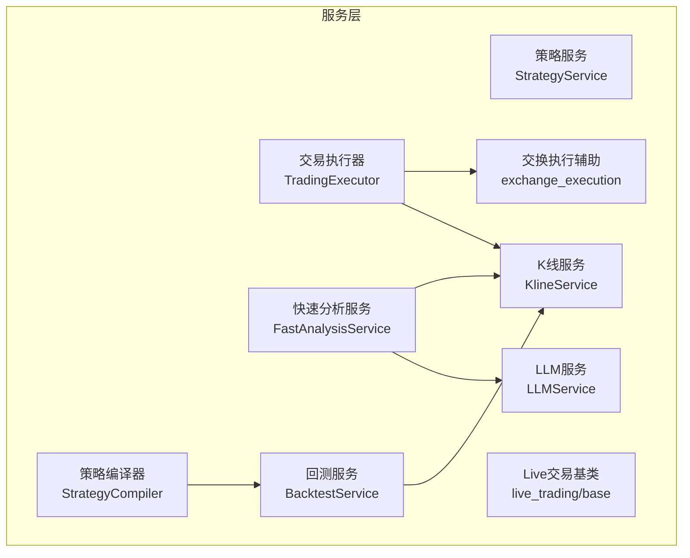
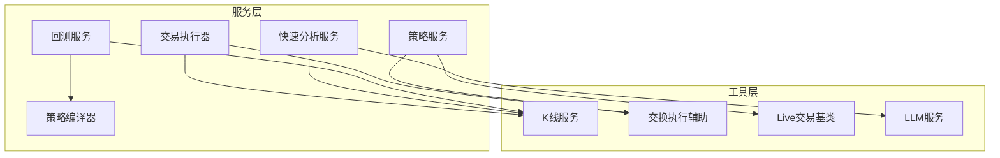
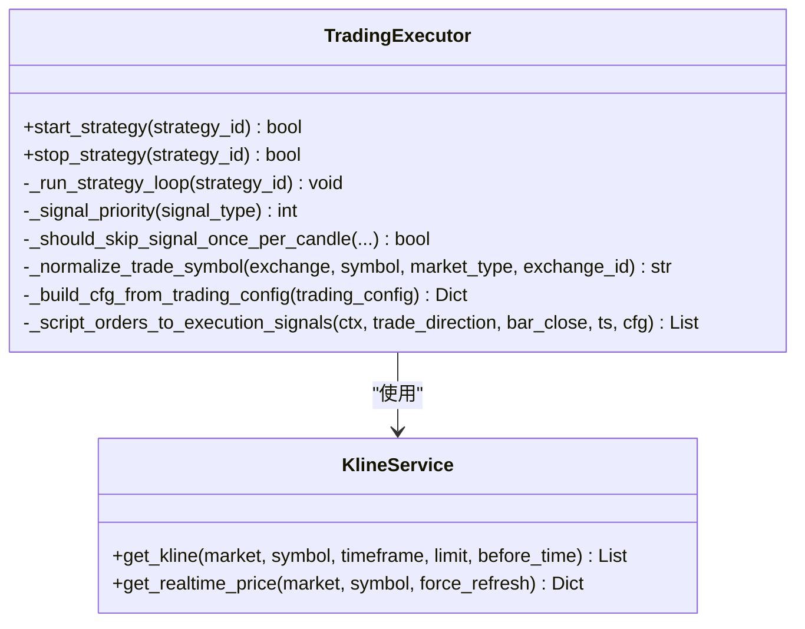
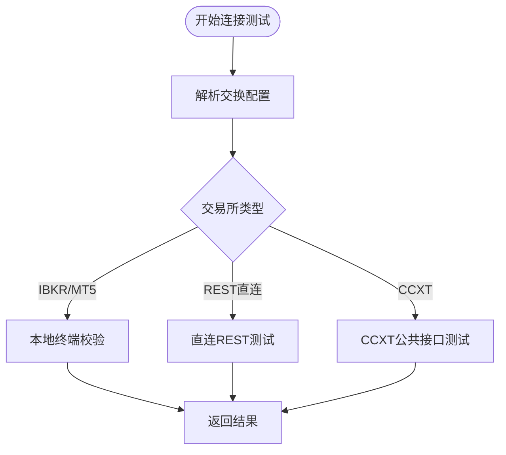
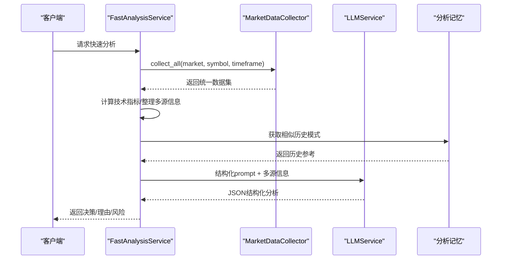
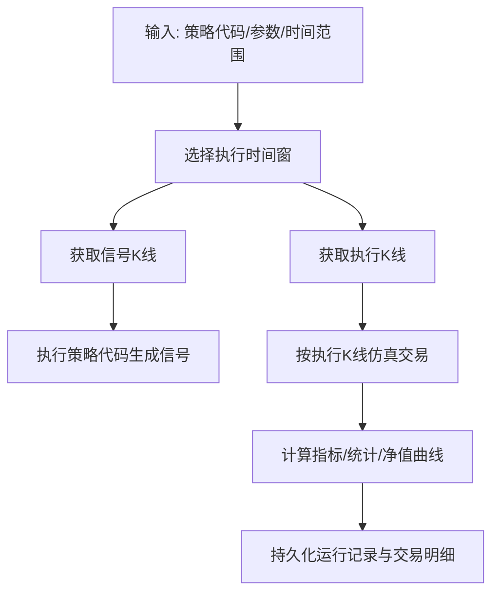
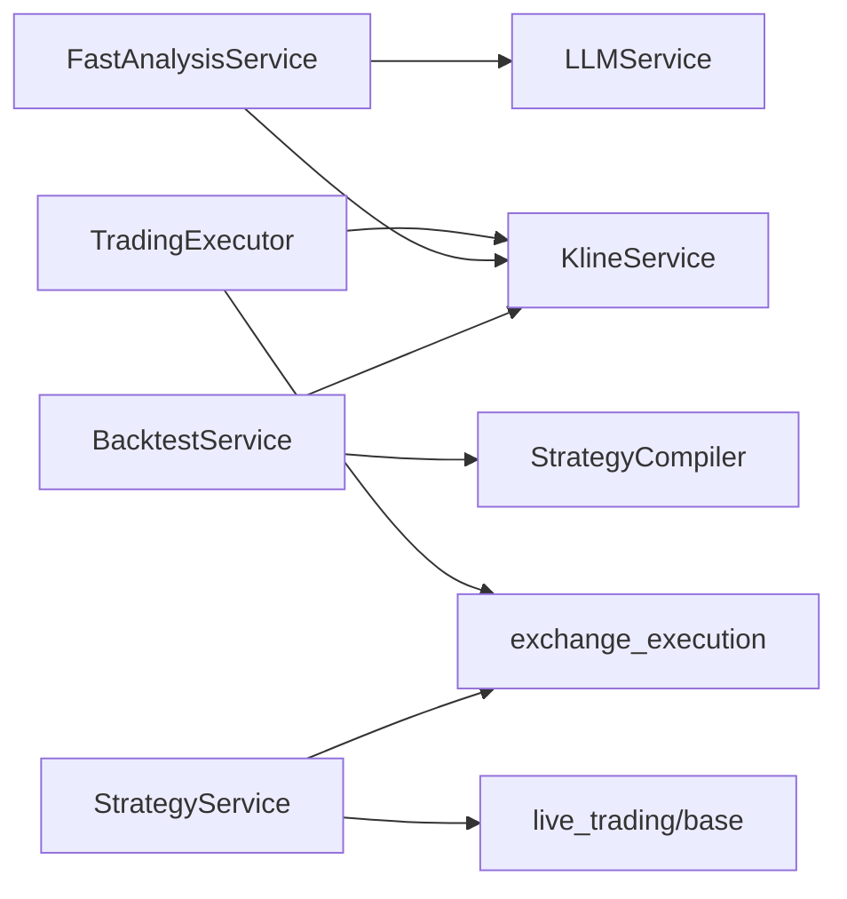

# 服务层架构设计

<cite>
**本文档引用的文件**
- [services/__init__.py](file://backend_api_python/app/services/__init__.py)
- [trading_executor.py](file://backend_api_python/app/services/trading_executor.py)
- [strategy.py](file://backend_api_python/app/services/strategy.py)
- [kline.py](file://backend_api_python/app/services/kline.py)
- [fast_analysis.py](file://backend_api_python/app/services/fast_analysis.py)
- [backtest.py](file://backend_api_python/app/services/backtest.py)
- [strategy_compiler.py](file://backend_api_python/app/services/strategy_compiler.py)
- [llm.py](file://backend_api_python/app/services/llm.py)
- [exchange_execution.py](file://backend_api_python/app/services/exchange_execution.py)
- [live_trading/base.py](file://backend_api_python/app/services/live_trading/base.py)
</cite>

## 目录
1. [引言](#引言)
2. [项目结构](#项目结构)
3. [核心组件](#核心组件)
4. [架构总览](#架构总览)
5. [详细组件分析](#详细组件分析)
6. [依赖关系分析](#依赖关系分析)
7. [性能考量](#性能考量)
8. [故障排除指南](#故障排除指南)
9. [结论](#结论)
10. [附录](#附录)

## 引言
本设计文档面向QuantDinger服务层，系统阐述服务层的设计理念、职责边界与协作关系。服务层负责业务逻辑封装、数据访问抽象、跨模块协调与对外能力暴露，是连接数据源与上层应用的核心桥梁。本文重点覆盖策略服务、交易执行器、数据源服务、AI分析服务等核心组件，并给出扩展指南与最佳实践。

## 项目结构
服务层位于后端Python应用的app/services目录下，采用按功能域分层组织：
- 业务服务：策略编译、回测、快速分析、实验管理等
- 交易相关：策略执行、实盘交易适配、挂单处理等
- 数据访问：K线服务、数据源工厂、缓存与限流等
- AI与分析：LLM服务、宏观/新闻/预测市场整合分析
- 工具与支撑：凭证解析、REST客户端基类、Live交易客户端工厂等

图表来源
- [services/__init__.py:1-26](file://backend_api_python/app/services/__init__.py#L1-L26)
- [strategy.py:14-800](file://backend_api_python/app/services/strategy.py#L14-L800)
- [trading_executor.py:37-800](file://backend_api_python/app/services/trading_executor.py#L37-L800)
- [kline.py:14-191](file://backend_api_python/app/services/kline.py#L14-L191)
- [fast_analysis.py:186-800](file://backend_api_python/app/services/fast_analysis.py#L186-L800)
- [backtest.py:64-800](file://backend_api_python/app/services/backtest.py#L64-L800)
- [strategy_compiler.py:4-689](file://backend_api_python/app/services/strategy_compiler.py#L4-L689)
- [llm.py:70-629](file://backend_api_python/app/services/llm.py#L70-L629)
- [exchange_execution.py:118-150](file://backend_api_python/app/services/exchange_execution.py#L118-L150)
- [live_trading/base.py:95-168](file://backend_api_python/app/services/live_trading/base.py#L95-L168)

章节来源
- [services/__init__.py:1-26](file://backend_api_python/app/services/__init__.py#L1-L26)

## 核心组件
- 策略服务（StrategyService）
  - 职责：查询运行中策略、解析交易所配置、测试连接、展示机器人参数等
  - 关键点：线程信号量控制并发连接测试；对多种交易所与本地终端（IBKR/MT5）进行差异化处理
- 交易执行器（TradingExecutor）
  - 职责：策略线程生命周期管理、信号去重、价格缓存、脚本上下文构建、订单转换与持久化
  - 关键点：线程上限保护、信号去重窗口、脚本到执行信号映射、多市场符号规范化
- K线服务（KlineService）
  - 职责：统一K线与实时价格获取、缓存策略、降级回退
  - 关键点：缓存键构建、TTL策略、ticker与K线双通道降级
- 快速分析服务（FastAnalysisService）
  - 职责：统一数据采集、技术指标计算、多源信息融合、LLM结构化分析、记忆检索
  - 关键点：强约束prompt工程、多因子决策规则、历史模式检索增强
- 回测服务（BacktestService）
  - 职责：多时间框架回测、交易仿真、指标计算、结果持久化
  - 关键点：信号与执行时间窗分离、滑点与手续费建模、多时间框架精度控制
- 策略编译器（StrategyCompiler）
  - 职责：将配置转化为可执行Python代码，生成信号与绘图输出
  - 关键点：指标计算、条件拼接、核心循环与输出格式化
- LLM服务（LLMService）
  - 职责：多提供商统一接入、模型名称归一、错误与回退处理
  - 关键点：OpenRouter/OpenAI/Google/DeepSeek/Grok/Minimax/CUSTOM支持
- 交换执行辅助（exchange_execution）
  - 职责：策略配置加载、凭证解密、安全脱敏、执行配置解析
- Live交易基类（live_trading/base）
  - 职责：统一HTTPS证书验证策略、请求封装、错误分类
  - 关键点：SSL验证自动检测、请求头编码校验、统一错误类型

章节来源
- [strategy.py:14-800](file://backend_api_python/app/services/strategy.py#L14-L800)
- [trading_executor.py:37-800](file://backend_api_python/app/services/trading_executor.py#L37-L800)
- [kline.py:14-191](file://backend_api_python/app/services/kline.py#L14-L191)
- [fast_analysis.py:186-800](file://backend_api_python/app/services/fast_analysis.py#L186-L800)
- [backtest.py:64-800](file://backend_api_python/app/services/backtest.py#L64-L800)
- [strategy_compiler.py:4-689](file://backend_api_python/app/services/strategy_compiler.py#L4-L689)
- [llm.py:70-629](file://backend_api_python/app/services/llm.py#L70-L629)
- [exchange_execution.py:118-150](file://backend_api_python/app/services/exchange_execution.py#L118-L150)
- [live_trading/base.py:95-168](file://backend_api_python/app/services/live_trading/base.py#L95-L168)

## 架构总览
服务层采用“服务-工具-数据源”三层协作：
- 服务层：封装业务语义与流程编排（策略、执行、分析、回测）
- 工具层：通用能力（缓存、日志、加密、HTTP、脚本运行时）
- 数据源层：统一数据访问（K线、实时价格、外部API、本地缓存）

图表来源
- [trading_executor.py:37-800](file://backend_api_python/app/services/trading_executor.py#L37-L800)
- [fast_analysis.py:186-800](file://backend_api_python/app/services/fast_analysis.py#L186-L800)
- [backtest.py:64-800](file://backend_api_python/app/services/backtest.py#L64-L800)
- [strategy.py:14-800](file://backend_api_python/app/services/strategy.py#L14-L800)
- [strategy_compiler.py:4-689](file://backend_api_python/app/services/strategy_compiler.py#L4-L689)
- [kline.py:14-191](file://backend_api_python/app/services/kline.py#L14-L191)
- [exchange_execution.py:118-150](file://backend_api_python/app/services/exchange_execution.py#L118-L150)
- [live_trading/base.py:95-168](file://backend_api_python/app/services/live_trading/base.py#L95-L168)
- [llm.py:70-629](file://backend_api_python/app/services/llm.py#L70-L629)

## 详细组件分析

### 交易执行器（TradingExecutor）
- 设计模式
  - 线程池/线程管理：每个策略独立线程，受最大线程数限制，避免资源耗尽
  - 单例式轻量实例：服务内聚合共享组件（K线服务、缓存、锁）
  - 状态机与优先级：严格的状态转移与信号优先级，保证平仓优先于开仓
- 关键实现
  - 信号去重：基于策略ID、符号、信号类型与时间戳的组合键，配合TTL清理
  - 价格缓存：内存级短期缓存，降低重复查询成本
  - 脚本上下文：将策略脚本输出标准化为执行信号，支持网格/趋势/DCA等机器人模式
  - 符号规范化：针对不同交易所（如OKX永续）进行符号标准化
- 线程安全
  - 全局字典与缓存均使用锁保护；线程注册表定期清理已退出线程
- 异步处理
  - 策略运行在独立守护线程；UI心跳与日志写入通过轻量队列化手段减少阻塞

图表来源
- [trading_executor.py:37-800](file://backend_api_python/app/services/trading_executor.py#L37-L800)
- [kline.py:14-191](file://backend_api_python/app/services/kline.py#L14-L191)

章节来源
- [trading_executor.py:37-800](file://backend_api_python/app/services/trading_executor.py#L37-L800)

### 策略服务（StrategyService）
- 设计模式
  - 工具类：无状态方法集合，集中处理策略元数据与连接测试
  - 差异化路由：根据交易所类型选择REST或CCXT路径，对本地终端做特殊处理
- 关键实现
  - 连接测试：限制并发，自动探测市场类型，针对币安等特定错误提供中文提示
  - 交易所符号：统一返回USDT计价的交易对清单，支持多交易所差异
  - 展示参数：将机器人配置转换为前端友好的显示结构

图表来源
- [strategy.py:292-610](file://backend_api_python/app/services/strategy.py#L292-L610)

章节来源
- [strategy.py:14-800](file://backend_api_python/app/services/strategy.py#L14-L800)

### K线服务（KlineService）
- 设计模式
  - 数据访问抽象：统一入口DataSourceFactory，屏蔽具体数据源差异
  - 缓存策略：不同时间周期采用不同TTL，热点数据短缓存，历史数据不缓存
- 关键实现
  - 实时价格：优先ticker API，降级到1分钟K线，最后日线K线
  - 缓存键：按市场、符号、时间窗与限制条数构建

```mermaid
sequenceDiagram
participant Caller as "调用方"
participant KS as "KlineService"
participant Cache as "CacheManager"
participant DS as "DataSourceFactory"
Caller->>KS : get_realtime_price(market, symbol, force_refresh)
KS->>Cache : get(key)
alt 命中缓存
Cache-->>KS : 缓存值
KS-->>Caller : 返回缓存
else 未命中
KS->>DS : get_ticker(market, symbol)
alt ticker成功
DS-->>KS : ticker数据
KS->>Cache : set(key, value, ttl)
KS-->>Caller : 返回ticker结果
else ticker失败
KS->>DS : get_kline(market, symbol, "1m", 2)
DS-->>KS : K线数据
KS->>Cache : set(key, value, ttl)
KS-->>Caller : 返回K线推导结果
end
end
```

图表来源
- [kline.py:74-191](file://backend_api_python/app/services/kline.py#L74-L191)

章节来源
- [kline.py:14-191](file://backend_api_python/app/services/kline.py#L14-L191)

### 快速分析服务（FastAnalysisService）
- 设计模式
  - 统一数据采集：通过MarketDataCollector聚合价格、技术、宏观、新闻、预测市场
  - 结构化LLM：单次调用强约束prompt，输出JSON结构，避免长链路不确定性
  - 记忆增强：相似历史模式检索，提升决策可信度
- 关键实现
  - 技术指标：RSI/MACD/均线/支撑阻力/波动率等，提供明确买卖信号
  - 地缘政治检测：正则与关键词识别，区分严重与中等级别事件
  - 决策规则：多因子权重与优先级，宏观/新闻/技术冲突时的裁决逻辑

图表来源
- [fast_analysis.py:186-800](file://backend_api_python/app/services/fast_analysis.py#L186-L800)
- [llm.py:70-629](file://backend_api_python/app/services/llm.py#L70-L629)

章节来源
- [fast_analysis.py:186-800](file://backend_api_python/app/services/fast_analysis.py#L186-L800)
- [llm.py:70-629](file://backend_api_python/app/services/llm.py#L70-L629)

### 回测服务（BacktestService）
- 设计模式
  - 多时间框架：信号时间窗与执行时间窗分离，提升仿真精度
  - 指标驱动：通过策略编译器生成信号，再进行交易仿真
  - 结果持久化：统一schema，支持回测运行、交易明细与净值曲线
- 关键实现
  - 执行时间窗选择：根据回测跨度自动选择1分钟或5分钟精度
  - 交易仿真：滑点与手续费建模，止盈止损与追踪止损
  - 指标计算：内置技术指标计算，支持多时间框架一致性

图表来源
- [backtest.py:444-800](file://backend_api_python/app/services/backtest.py#L444-L800)
- [strategy_compiler.py:4-689](file://backend_api_python/app/services/strategy_compiler.py#L4-L689)

章节来源
- [backtest.py:64-800](file://backend_api_python/app/services/backtest.py#L64-L800)
- [strategy_compiler.py:4-689](file://backend_api_python/app/services/strategy_compiler.py#L4-L689)

### 策略编译器（StrategyCompiler）
- 设计模式
  - 配置驱动：将策略配置转为可执行Python代码，便于回测与部署
  - 指标与信号：统一指标计算与信号拼接，核心循环与输出格式化
- 关键实现
  - 支持指标：SuperTrend、EMA、RSI、MACD、布林带、KDJ、MA等
  - 信号逻辑：多条件组合，支持交叉、阈值、方向等规则
  - 输出：生成绘图配置与信号序列，便于可视化与复盘

章节来源
- [strategy_compiler.py:4-689](file://backend_api_python/app/services/strategy_compiler.py#L4-L689)

### LLM服务（LLMService）
- 设计模式
  - 多提供商抽象：统一调用接口，自动探测与回退
  - 模型归一：OpenRouter风格模型名自动映射到目标提供商
- 关键实现
  - 提供商优先级：DeepSeek > Grok > MiniMax > OpenAI > Google > OpenRouter
  - 错误处理：402/403等关键错误自动切换提供商，404/429等尝试回退模型
  - JSON模式：默认JSON响应，增强结构化输出稳定性

章节来源
- [llm.py:70-629](file://backend_api_python/app/services/llm.py#L70-L629)

### 交换执行辅助（exchange_execution）
- 设计模式
  - 配置合并：凭证与策略配置叠加，安全脱敏日志
  - 加载与解析：统一加载策略配置，解析执行参数
- 关键实现
  - 凭证解密：基于Fernet与SECRET_KEY的解密流程
  - 安全日志：敏感字段掩码输出，避免泄露

章节来源
- [exchange_execution.py:95-150](file://backend_api_python/app/services/exchange_execution.py#L95-L150)

### Live交易基类（live_trading/base）
- 设计模式
  - 请求封装：统一HTTP(S)请求、超时与SSL验证策略
  - 错误分类：区分编码错误、TLS验证失败等，提供明确告警
- 关键实现
  - SSL验证：自动检测系统CA、certifi或自定义PEM路径
  - 请求头：严格ASCII编码校验，避免非ASCII字符导致认证失败

章节来源
- [live_trading/base.py:95-168](file://backend_api_python/app/services/live_trading/base.py#L95-L168)

## 依赖关系分析
- 低耦合高内聚
  - 服务间通过明确接口交互，避免循环依赖
  - 工具层（缓存、日志、HTTP）被多服务复用
- 外部依赖
  - LLM服务支持多家提供商，具备回退与自动探测能力
  - 交易执行器依赖K线服务与交换执行辅助，形成清晰的数据-执行链路
- 潜在风险
  - 线程数与资源限制需通过环境变量与监控保障
  - LLM调用失败路径需完善重试与降级策略

图表来源
- [trading_executor.py:37-800](file://backend_api_python/app/services/trading_executor.py#L37-L800)
- [fast_analysis.py:186-800](file://backend_api_python/app/services/fast_analysis.py#L186-L800)
- [backtest.py:64-800](file://backend_api_python/app/services/backtest.py#L64-L800)
- [strategy.py:14-800](file://backend_api_python/app/services/strategy.py#L14-L800)
- [strategy_compiler.py:4-689](file://backend_api_python/app/services/strategy_compiler.py#L4-L689)
- [kline.py:14-191](file://backend_api_python/app/services/kline.py#L14-L191)
- [exchange_execution.py:118-150](file://backend_api_python/app/services/exchange_execution.py#L118-L150)
- [live_trading/base.py:95-168](file://backend_api_python/app/services/live_trading/base.py#L95-L168)
- [llm.py:70-629](file://backend_api_python/app/services/llm.py#L70-L629)

## 性能考量
- 缓存策略
  - K线服务对最新数据设置TTL，历史数据不缓存，平衡时效性与成本
  - 交易执行器内部价格缓存与信号去重，减少重复计算与重复下单
- 并发控制
  - 连接测试使用信号量限制并发，避免CPU与网络压力过大
  - 交易执行器限制策略线程总数，防止OOM与线程耗尽
- I/O优化
  - LLM调用支持回退模型与替代提供商，提升成功率与稳定性
  - Live交易基类统一SSL验证与请求封装，减少重复开销

## 故障排除指南
- 交易执行器
  - 线程上限被触发：检查STRATEGY_MAX_THREADS，停止部分策略后再启动
  - 信号重复：确认信号去重窗口与TTL配置，检查同一K线内的重复触发
  - 符号不匹配：检查交易所符号规范化逻辑，确保永续合约格式正确
- 策略服务
  - 连接测试失败：查看并发限制与错误提示，针对币安等错误提供中文提示
  - 交易所符号为空：确认市场类型与base_url配置，检查REST接口返回
- K线服务
  - ticker不可用：观察降级到K线与日线的回退逻辑，确认缓存TTL
- 快速分析服务
  - LLM输出解析失败：检查JSON模式与模型兼容性，查看回退策略
- 回测服务
  - 多时间框架回退：检查信号时间窗与执行时间窗关系，确认是否满足MTF条件
- LLM服务
  - API Key缺失：检查提供商配置，必要时切换替代提供商
  - 403/402错误：检查密钥有效性、余额与模型权限

章节来源
- [trading_executor.py:395-495](file://backend_api_python/app/services/trading_executor.py#L395-L495)
- [strategy.py:292-610](file://backend_api_python/app/services/strategy.py#L292-L610)
- [kline.py:74-191](file://backend_api_python/app/services/kline.py#L74-L191)
- [fast_analysis.py:186-800](file://backend_api_python/app/services/fast_analysis.py#L186-L800)
- [backtest.py:444-800](file://backend_api_python/app/services/backtest.py#L444-L800)
- [llm.py:428-562](file://backend_api_python/app/services/llm.py#L428-L562)

## 结论
QuantDinger服务层通过清晰的职责划分与稳健的实现模式，实现了从数据获取、策略编译、回测仿真到实盘执行的全链路闭环。服务间低耦合、工具层复用、外部依赖可控，既保证了扩展性，也兼顾了性能与可靠性。建议在新增服务时遵循本文的扩展指南，确保与既有组件的协作顺畅与一致性。

## 附录
- 扩展指南
  - 新增服务
    - 明确职责边界，避免与现有服务重叠
    - 优先复用工具层能力（缓存、日志、HTTP、加密）
    - 通过最小接口暴露能力，避免引入循环依赖
  - 修改现有服务
    - 保持向后兼容的接口签名
    - 对并发与资源使用进行评估，必要时增加限流或隔离
    - 完善错误处理与日志记录，便于问题定位
  - 单例与线程安全
    - 服务内共享组件应使用锁保护
    - 避免全局状态污染，尽量通过构造函数注入依赖
  - 异步与并发
    - 对外暴露同步接口，内部使用线程池或异步任务
    - 对高频操作（如缓存、LLM调用）增加重试与熔断策略