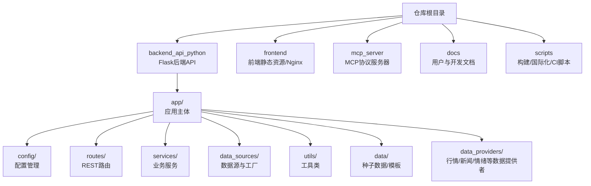
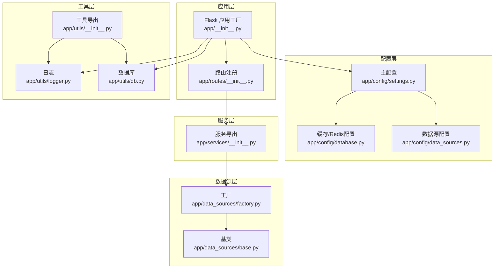
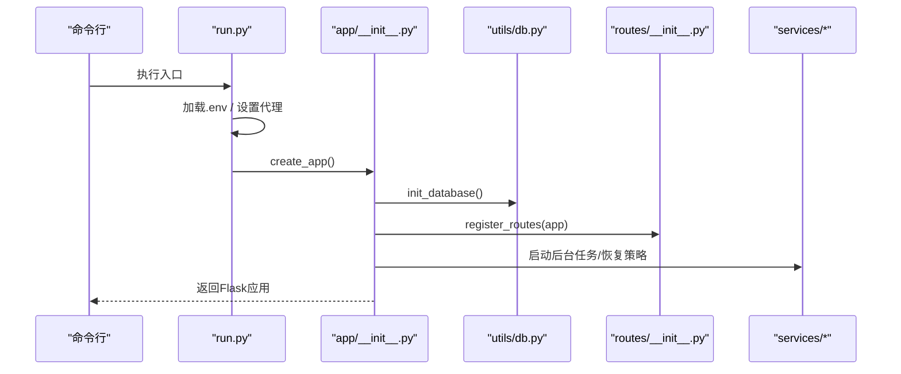
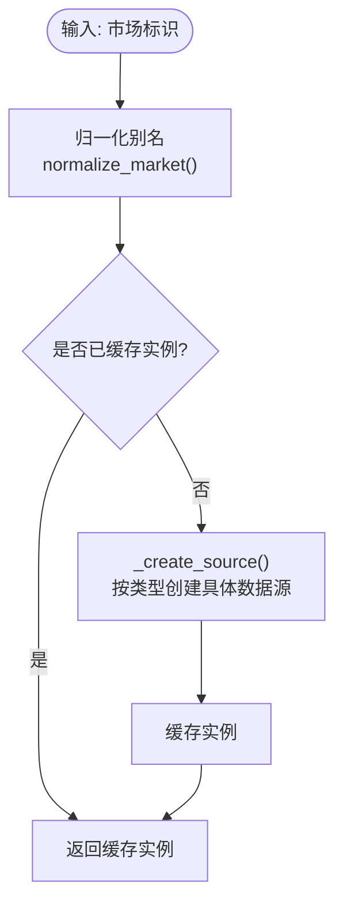
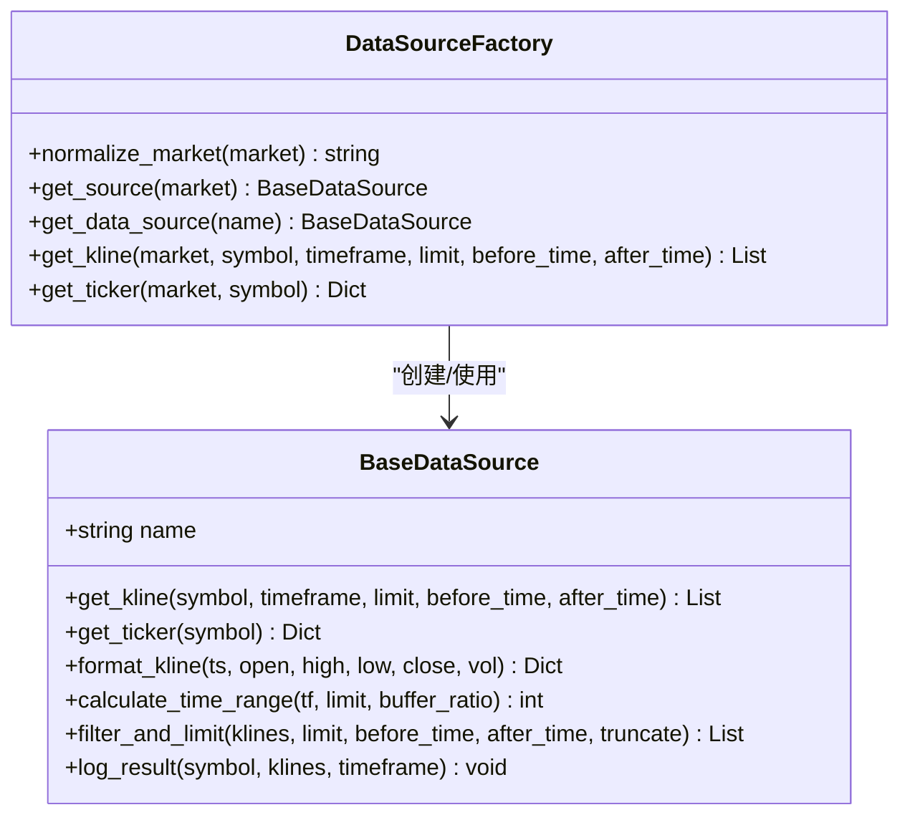
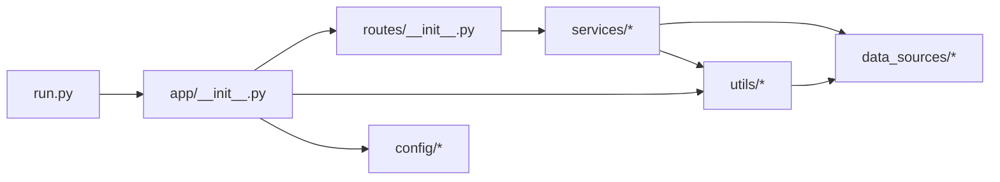

# 目录结构组织

<cite>
**本文引用的文件**
- [backend_api_python/README.md](file://backend_api_python/README.md)
- [backend_api_python/run.py](file://backend_api_python/run.py)
- [backend_api_python/app/__init__.py](file://backend_api_python/app/__init__.py)
- [backend_api_python/app/routing注册/__init__.py](file://backend_api_python/app/routes/__init__.py)
- [backend_api_python/app/utils/__init__.py](file://backend_api_python/app/utils/__init__.py)
- [backend_api_python/app/data_sources/factory.py](file://backend_api_python/app/data_sources/factory.py)
- [backend_api_python/app/services/__init__.py](file://backend_api_python/app/services/__init__.py)
- [backend_api_python/app/config/settings.py](file://backend_api_python/app/config/settings.py)
- [backend_api_python/app/config/database.py](file://backend_api_python/app/config/database.py)
- [backend_api_python/app/config/data_sources.py](file://backend_api_python/app/config/data_sources.py)
- [backend_api_python/app/utils/logger.py](file://backend_api_python/app/utils/logger.py)
- [backend_api_python/app/utils/db.py](file://backend_api_python/app/utils/db.py)
- [backend_api_python/app/data_sources/base.py](file://backend_api_python/app/data_sources/base.py)
- [mcp_server/README.md](file://mcp_server/README.md)
- [frontend/Dockerfile](file://frontend/Dockerfile)
</cite>

## 目录索引
1. [简介](#简介)
2. [项目结构](#项目结构)
3. [核心组件](#核心组件)
4. [架构总览](#架构总览)
5. [详细组件分析](#详细组件分析)
6. [依赖关系分析](#依赖关系分析)
7. [性能考量](#性能考量)
8. [故障排查指南](#故障排查指南)
9. [结论](#结论)
10. [附录](#附录)

## 简介
本文件面向QuantDinger项目的开发者与维护者，系统性梳理后端Python API、前端与MCP服务器的目录组织原则与设计理念，重点解释backend_api_python中的app目录子结构（config、routes、services、data_sources、utils）的职责划分、模块间依赖关系与导入规则，并提供目录导航指南，帮助快速定位功能模块与扩展点。

## 项目结构
QuantDinger采用“多子项目并行”的仓库布局：
- backend_api_python：基于Flask的后端API，负责REST路由、业务服务、数据源抽象、配置与工具集。
- frontend：前端静态资源与Nginx容器化部署。
- mcp_server：MCP协议服务器，将Agent网关能力以MCP工具形式暴露给支持MCP的客户端。
- docs、scripts等：文档与辅助脚本。

图表来源
- [backend_api_python/README.md:15-33](file://backend_api_python/README.md#L15-L33)
- [frontend/Dockerfile:1-25](file://frontend/Dockerfile#L1-L25)
- [mcp_server/README.md:1-115](file://mcp_server/README.md#L1-L115)

章节来源
- [backend_api_python/README.md:15-33](file://backend_api_python/README.md#L15-L33)
- [frontend/Dockerfile:1-25](file://frontend/Dockerfile#L1-L25)
- [mcp_server/README.md:1-115](file://mcp_server/README.md#L1-L115)

## 核心组件
- 后端入口与应用工厂
  - run.py：加载环境变量、代理配置、创建Flask应用实例，提供开发与生产启动入口。
  - app/__init__.py：Flask应用工厂，注册CORS、安全JSON序列化、数据库初始化、管理员账户校验、启动各类后台工作线程与恢复运行中策略。
- 配置体系
  - app/config/settings.py：主配置元类，集中管理主机、端口、调试、密钥、日志、限流、功能开关等。
  - app/config/database.py：Redis与缓存配置。
  - app/config/data_sources.py：各外部数据源（如Finnhub、Tiingo、YFinance、CCXT、Akshare）的配置项与默认映射。
- 路由层
  - app/routes/__init__.py：集中注册所有蓝图，按URL前缀分组，包含认证、用户、指标、策略、组合、IBKR/MT5、全球市场、社区、快速分析、计费、快捷交易、PolyMarket、实验等。
- 服务层
  - app/services/__init__.py：导出核心服务（K线、回测、策略编译、快速分析、实验相关服务等）。
- 数据源层
  - app/data_sources/base.py：抽象基类，定义K线与报价接口、时间范围计算、过滤截断、延迟检测等通用逻辑。
  - app/data_sources/factory.py：市场到具体数据源的工厂，支持别名归一化与懒加载。
- 工具层
  - app/utils/logger.py：全局日志配置与文件轮转。
  - app/utils/db.py：PostgreSQL连接封装与初始化检查。
  - app/utils/__init__.py：导出常用工具（日志、缓存、重试会话）。

章节来源
- [backend_api_python/run.py:1-134](file://backend_api_python/run.py#L1-L134)
- [backend_api_python/app/__init__.py:1-280](file://backend_api_python/app/__init__.py#L1-L280)
- [backend_api_python/app/config/settings.py:1-99](file://backend_api_python/app/config/settings.py#L1-L99)
- [backend_api_python/app/config/database.py:1-90](file://backend_api_python/app/config/database.py#L1-L90)
- [backend_api_python/app/config/data_sources.py:1-173](file://backend_api_python/app/config/data_sources.py#L1-L173)
- [backend_api_python/app/routes/__init__.py:1-58](file://backend_api_python/app/routes/__init__.py#L1-L58)
- [backend_api_python/app/services/__init__.py:1-26](file://backend_api_python/app/services/__init__.py#L1-L26)
- [backend_api_python/app/data_sources/base.py:1-180](file://backend_api_python/app/data_sources/base.py#L1-L180)
- [backend_api_python/app/data_sources/factory.py:1-178](file://backend_api_python/app/data_sources/factory.py#L1-L178)
- [backend_api_python/app/utils/logger.py:1-63](file://backend_api_python/app/utils/logger.py#L1-L63)
- [backend_api_python/app/utils/db.py:1-66](file://backend_api_python/app/utils/db.py#L1-L66)
- [backend_api_python/app/utils/__init__.py:1-10](file://backend_api_python/app/utils/__init__.py#L1-L10)

## 架构总览
后端采用“应用工厂 + 蓝图 + 服务层 + 数据源抽象”的分层设计，通过工厂模式解耦不同市场与数据源，通过配置元类实现环境驱动的可插拔能力，通过工具模块提供日志、缓存、数据库连接等横切关注点。

图表来源
- [backend_api_python/app/__init__.py:213-279](file://backend_api_python/app/__init__.py#L213-L279)
- [backend_api_python/app/routes/__init__.py:7-58](file://backend_api_python/app/routes/__init__.py#L7-L58)
- [backend_api_python/app/config/settings.py:6-99](file://backend_api_python/app/config/settings.py#L6-L99)
- [backend_api_python/app/config/database.py:6-90](file://backend_api_python/app/config/database.py#L6-L90)
- [backend_api_python/app/config/data_sources.py:6-173](file://backend_api_python/app/config/data_sources.py#L6-L173)
- [backend_api_python/app/services/__init__.py:4-26](file://backend_api_python/app/services/__init__.py#L4-L26)
- [backend_api_python/app/data_sources/factory.py:33-178](file://backend_api_python/app/data_sources/factory.py#L33-L178)
- [backend_api_python/app/data_sources/base.py:28-180](file://backend_api_python/app/data_sources/base.py#L28-L180)
- [backend_api_python/app/utils/logger.py:9-63](file://backend_api_python/app/utils/logger.py#L9-L63)
- [backend_api_python/app/utils/db.py:19-66](file://backend_api_python/app/utils/db.py#L19-L66)
- [backend_api_python/app/utils/__init__.py:4-10](file://backend_api_python/app/utils/__init__.py#L4-L10)

## 详细组件分析

### 配置管理（config）
- 设计理念
  - 使用元类MetaConfig集中声明配置属性，结合环境变量与附加配置加载器，实现“环境优先、可插拔”的配置体系。
  - 关键域：服务参数（HOST/PORT/DEBUG）、认证（SECRET_KEY/ADMIN_*）、日志（LOG_*）、安全与功能开关（RATE_LIMIT/ENABLE_CACHE/ENABLE_REQUEST_LOG）。
- 文件组织
  - settings.py：主配置元类与Config类。
  - database.py：Redis与缓存配置（HOST/PORT/PASSWORD/DB/TIMEOUT/MAX_CONNECTIONS、缓存TTL策略）。
  - data_sources.py：外部数据源超时、重试、速率限制、映射表等配置。
- 导入规则
  - 在其他模块中通过“from app.config.* import Config/...”直接访问属性，无需实例化。
  - 配置读取顺序：附加配置文件优先于环境变量，确保部署灵活性。

章节来源
- [backend_api_python/app/config/settings.py:6-99](file://backend_api_python/app/config/settings.py#L6-L99)
- [backend_api_python/app/config/database.py:6-90](file://backend_api_python/app/config/database.py#L6-L90)
- [backend_api_python/app/config/data_sources.py:6-173](file://backend_api_python/app/config/data_sources.py#L6-L173)

### 路由定义（routes）
- 设计理念
  - 以蓝图为中心，按功能域分组注册，统一前缀管理，降低命名冲突与URL硬编码风险。
  - 支持版本化的Agent网关（agent_v1）作为独立注册入口。
- 文件组织
  - routes/__init__.py：集中导入并注册所有蓝图，按API域设置url_prefix。
  - 子目录包含认证、用户、指标、策略、组合、IBKR/MT5、全球市场、社区、快速分析、计费、快捷交易、PolyMarket、实验等。
- 导入规则
  - 在注册函数内动态导入各蓝图模块，避免循环依赖；蓝图内部再按需导入服务与工具。

章节来源
- [backend_api_python/app/routes/__init__.py:7-58](file://backend_api_python/app/routes/__init__.py#L7-L58)

### 业务服务（services）
- 设计理念
  - 服务层薄而清晰，聚焦领域职责（K线、回测、策略编译、快速分析、实验、交易执行、市场采集等）。
  - 通过__all__导出公共API，便于上层按需引入。
- 文件组织
  - services/__init__.py：导出核心服务集合。
  - 子目录包含实验、IBKR交易、实盘交易、MT5交易、指标、市场数据采集、LLM、策略编译与运行、信号通知、用户服务等。
- 导入规则
  - 蓝图在处理请求时按需导入具体服务类，避免全局导入导致的启动开销与循环依赖。

章节来源
- [backend_api_python/app/services/__init__.py:4-26](file://backend_api_python/app/services/__init__.py#L4-L26)

### 数据源（data_sources）
- 设计理念
  - 通过工厂模式将“市场类型”映射到具体数据源，支持别名归一化与懒加载，屏蔽底层差异。
  - 基类定义统一接口与通用逻辑（时间范围计算、过滤截断、延迟检测），子类仅实现差异化细节。
- 文件组织
  - base.py：抽象基类与通用工具。
  - factory.py：工厂类，提供normalize_market、get_source、get_kline、get_ticker等。
  - 子模块：crypto、us_stock、cn_stock、hk_stock、forex、futures、moex、cache_manager、rate_limiter、errors等。
- 导入规则
  - 工厂内部按需导入具体数据源类，避免一次性加载全部实现。

章节来源
- [backend_api_python/app/data_sources/base.py:28-180](file://backend_api_python/app/data_sources/base.py#L28-L180)
- [backend_api_python/app/data_sources/factory.py:33-178](file://backend_api_python/app/data_sources/factory.py#L33-L178)

### 工具类（utils）
- 设计理念
  - 提供横切关注点：日志、数据库连接、缓存、HTTP重试会话、配置加载、安全执行、语言与本地Broker适配等。
- 文件组织
  - logger.py：全局日志配置、文件轮转、噪声过滤。
  - db.py/db_postgres.py：PostgreSQL连接池与可用性检查。
  - cache.py：缓存管理（与配置层配合）。
  - http.py、config_loader.py、auth.py、safe_exec.py、language.py、local_brokers.py等。
- 导入规则
  - 通过utils/__init__.py统一导出，上层模块按需导入。

章节来源
- [backend_api_python/app/utils/logger.py:9-63](file://backend_api_python/app/utils/logger.py#L9-L63)
- [backend_api_python/app/utils/db.py:19-66](file://backend_api_python/app/utils/db.py#L19-L66)
- [backend_api_python/app/utils/__init__.py:4-10](file://backend_api_python/app/utils/__init__.py#L4-L10)

### 后端入口与启动流程
- 设计理念
  - run.py负责环境准备（.env加载、代理注入、路径修正）、创建应用实例、安全检查（SECRET_KEY）与启动信息输出。
  - app/__init__.py的应用工厂负责：CORS、安全JSON序列化、数据库初始化、管理员账户校验、启动后台任务（挂单、组合监控、USDT订单、Polymarket、AI标定与反思、恢复运行中策略）。
- 流程图

图表来源
- [backend_api_python/run.py:17-134](file://backend_api_python/run.py#L17-L134)
- [backend_api_python/app/__init__.py:213-279](file://backend_api_python/app/__init__.py#L213-L279)
- [backend_api_python/app/utils/db.py:38-48](file://backend_api_python/app/utils/db.py#L38-L48)
- [backend_api_python/app/routes/__init__.py:7-58](file://backend_api_python/app/routes/__init__.py#L7-L58)

章节来源
- [backend_api_python/run.py:17-134](file://backend_api_python/run.py#L17-L134)
- [backend_api_python/app/__init__.py:213-279](file://backend_api_python/app/__init__.py#L213-L279)

### 数据源工厂与市场别名
- 流程图

图表来源
- [backend_api_python/app/data_sources/factory.py:42-111](file://backend_api_python/app/data_sources/factory.py#L42-L111)

章节来源
- [backend_api_python/app/data_sources/factory.py:42-111](file://backend_api_python/app/data_sources/factory.py#L42-L111)

### 类关系图（数据源层）

图表来源
- [backend_api_python/app/data_sources/base.py:28-180](file://backend_api_python/app/data_sources/base.py#L28-L180)
- [backend_api_python/app/data_sources/factory.py:33-178](file://backend_api_python/app/data_sources/factory.py#L33-L178)

## 依赖关系分析
- 组件耦合与内聚
  - 路由层仅依赖服务层接口，不直接操作数据源，保持高内聚低耦合。
  - 服务层通过工厂与工具模块间接依赖数据源与配置，避免硬编码。
  - 工具模块提供横切能力，被广泛复用。
- 直接与间接依赖
  - run.py → app/__init__.py → routes/__init__.py → services/* → data_sources/*。
  - 配置层被app/__init__.py与各服务模块读取。
- 外部依赖与集成点
  - PostgreSQL（数据库）、Redis（缓存）、Flask生态（CORS、蓝图）、第三方数据源（Finnhub、Tiingo、YFinance、CCXT、Akshare）。
- 接口契约
  - 数据源基类定义统一接口，确保工厂与上层调用的一致性。

图表来源
- [backend_api_python/run.py:96-101](file://backend_api_python/run.py#L96-L101)
- [backend_api_python/app/__init__.py:255-256](file://backend_api_python/app/__init__.py#L255-L256)
- [backend_api_python/app/routes/__init__.py:9-31](file://backend_api_python/app/routes/__init__.py#L9-L31)
- [backend_api_python/app/utils/db.py:19-25](file://backend_api_python/app/utils/db.py#L19-L25)

章节来源
- [backend_api_python/run.py:96-101](file://backend_api_python/run.py#L96-L101)
- [backend_api_python/app/__init__.py:255-256](file://backend_api_python/app/__init__.py#L255-L256)
- [backend_api_python/app/routes/__init__.py:9-31](file://backend_api_python/app/routes/__init__.py#L9-L31)
- [backend_api_python/app/utils/db.py:19-25](file://backend_api_python/app/utils/db.py#L19-L25)

## 性能考量
- JSON序列化安全：内置SafeJSONProvider，避免NaN/Infinity导致的前端解析异常，保障输出合规。
- 数据源延迟检测：数据源基类对最新K线时间进行阈值判断，分钟/日/周级别分别设定不同容忍度，及时告警。
- 缓存策略：配置层提供K线、分析、价格等TTL策略，结合工厂与缓存管理器减少重复拉取。
- 后台任务与恢复：启动阶段自动恢复运行中策略，避免重启丢失；挂单、组合监控、USDT订单等后台任务按环境变量控制启停。
- 日志与噪音过滤：对特定子系统（如Werkzeug、K线路由）进行日志级别调整，减少控制台噪音。

章节来源
- [backend_api_python/app/__init__.py:15-51](file://backend_api_python/app/__init__.py#L15-L51)
- [backend_api_python/app/data_sources/base.py:142-179](file://backend_api_python/app/data_sources/base.py#L142-L179)
- [backend_api_python/app/config/database.py:52-85](file://backend_api_python/app/config/database.py#L52-L85)
- [backend_api_python/app/utils/logger.py:19-34](file://backend_api_python/app/utils/logger.py#L19-L34)

## 故障排查指南
- 数据库连接失败
  - 检查DATABASE_URL格式与PostgreSQL服务状态；确认初始化SQL已在容器启动时执行。
- 出站请求失败
  - 配置PROXY_URL；对于国内金融数据源（如AkShare），确保NO_PROXY已合并国内域名列表。
- 安全密钥问题
  - 生产环境必须替换默认SECRET_KEY；run.py在DEBUG=False且使用默认密钥时会自动生成随机密钥并提示持久化。
- 后台任务未启动
  - 检查ENABLE_*相关环境变量（如ENABLE_PENDING_ORDER_WORKER、ENABLE_PORTFOLIO_MONITOR、USDT_PAY_ENABLED）。
- 日志排查
  - 使用app/utils/logger.py提供的日志配置，关注文件轮转与噪声过滤设置。

章节来源
- [backend_api_python/run.py:109-120](file://backend_api_python/run.py#L109-L120)
- [backend_api_python/app/utils/logger.py:9-48](file://backend_api_python/app/utils/logger.py#L9-L48)
- [backend_api_python/README.md:231-237](file://backend_api_python/README.md#L231-L237)

## 结论
QuantDinger的目录结构遵循“应用工厂 + 蓝图 + 服务层 + 数据源抽象 + 工具模块”的分层设计，通过配置元类与环境变量实现灵活部署，通过工厂模式与抽象基类实现多市场数据源的统一接入。该组织方式既保证了模块内聚与低耦合，又为扩展与维护提供了清晰的路径。

## 附录
- 目录导航指南
  - 后端入口：backend_api_python/run.py
  - 应用工厂：backend_api_python/app/__init__.py
  - 配置：backend_api_python/app/config/*
  - 路由：backend_api_python/app/routes/*
  - 服务：backend_api_python/app/services/*
  - 数据源：backend_api_python/app/data_sources/*
  - 工具：backend_api_python/app/utils/*
  - 前端：frontend/Dockerfile与Nginx模板
  - MCP服务器：mcp_server/README.md

章节来源
- [backend_api_python/README.md:15-33](file://backend_api_python/README.md#L15-L33)
- [frontend/Dockerfile:1-25](file://frontend/Dockerfile#L1-25)
- [mcp_server/README.md:1-115](file://mcp_server/README.md#L1-115)