# 路由系统架构

<cite>
**本文档引用的文件**
- [routes/__init__.py](file://backend_api_python/app/route/__init__.py)
- [routes/auth.py](file://backend_api_python/app/routes/auth.py)
- [routes/strategy.py](file://backend_api_python/app/routes/strategy.py)
- [routes/market.py](file://backend_api_python/app/routes/market.py)
- [routes/portfolio.py](file://backend_api_python/app/routes/portfolio.py)
- [routes/quick_trade.py](file://backend_api_python/app/routes/quick_trade.py)
- [routes/credentials.py](file://backend_api_python/app/routes/credentials.py)
- [routes/user.py](file://backend_api_python/app/routes/user.py)
- [routes/health.py](file://backend_api_python/app/routes/health.py)
- [routes/agent_v1/__init__.py](file://backend_api_python/app/routes/agent_v1/__init__.py)
- [routes/agent_v1/health.py](file://backend_api_python/app/routes/agent_v1/health.py)
- [routes/agent_v1/markets.py](file://backend_api_python/app/routes/agent_v1/markets.py)
- [routes/agent_v1/strategies.py](file://backend_api_python/app/routes/agent_v1/strategies.py)
- [utils/auth.py](file://backend_api_python/app/utils/auth.py)
</cite>

## 目录
1. [简介](#简介)
2. [项目结构](#项目结构)
3. [核心组件](#核心组件)
4. [架构总览](#架构总览)
5. [详细组件分析](#详细组件分析)
6. [依赖关系分析](#依赖关系分析)
7. [性能考虑](#性能考虑)
8. [故障排除指南](#故障排除指南)
9. [结论](#结论)

## 简介
本文件系统性阐述 QuantDinger 后端的路由系统架构，重点覆盖：
- Flask 蓝图的组织方式与路由注册机制
- 主路由注册函数的实现与调用链
- 各路由模块的职责划分：认证、策略、市场数据、交易执行、用户管理、凭证管理、健康检查等
- 路由装饰器的使用、请求参数校验、响应格式化等通用处理逻辑
- 路由设计最佳实践：URL 设计原则、HTTP 方法选择、状态码使用
- 路由调试与测试方法

## 项目结构
QuantDinger 的路由系统采用模块化蓝图（Blueprint）组织，所有蓝图在统一入口进行注册，形成清晰的命名空间与前缀隔离。

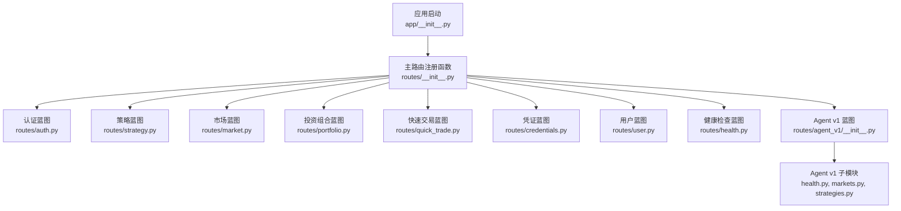

**图表来源**
- [routes/__init__.py:7-58](file://backend_api_python/app/route/__init__.py#L7-L58)
- [routes/agent_v1/__init__.py:34-49](file://backend_api_python/app/routes/agent_v1/__init__.py#L34-L49)

**章节来源**
- [routes/__init__.py:7-58](file://backend_api_python/app/route/__init__.py#L7-L58)

## 核心组件
- 路由注册中心：集中导入并注册各蓝图，统一设置 URL 前缀，确保路由表清晰可维护
- 蓝图（Blueprint）：按功能域拆分，每个蓝图独立定义路由、中间件与错误处理器
- 身份认证中间件：基于 JWT 的装饰器，统一处理鉴权与权限校验
- 通用响应格式：统一的 code/msg/data 结构，便于前端解析与错误处理

**章节来源**
- [routes/__init__.py:7-58](file://backend_api_python/app/route/__init__.py#L7-L58)
- [utils/auth.py:126-157](file://backend_api_python/app/utils/auth.py#L126-L157)

## 架构总览
路由系统采用“主注册 + 多蓝图”的分层架构：
- 主注册函数负责导入与注册，避免循环依赖
- 蓝图按领域划分，减少耦合度
- Agent v1 作为独立版本化的网关，与人类用户路由完全隔离

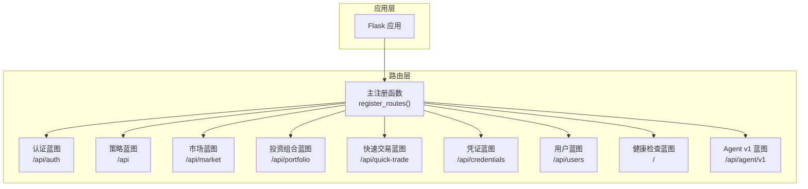

**图表来源**
- [routes/__init__.py:7-58](file://backend_api_python/app/route/__init__.py#L7-L58)
- [routes/agent_v1/__init__.py:34-49](file://backend_api_python/app/routes/agent_v1/__init__.py#L34-L49)

## 详细组件分析

### 主路由注册函数
- 负责集中导入各蓝图模块，避免循环依赖
- 统一设置 URL 前缀，明确各模块的访问路径
- 版本化 Agent 网关通过专用注册函数挂载

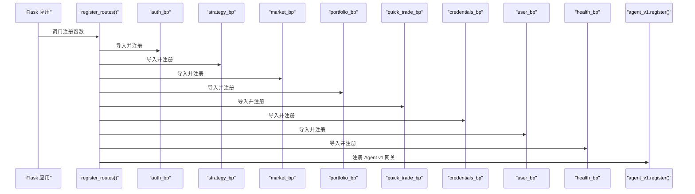

**图表来源**
- [routes/__init__.py:7-58](file://backend_api_python/app/route/__init__.py#L7-L58)
- [routes/agent_v1/__init__.py:34-49](file://backend_api_python/app/routes/agent_v1/__init__.py#L34-L49)

**章节来源**
- [routes/__init__.py:7-58](file://backend_api_python/app/route/__init__.py#L7-L58)

### 认证路由模块
- 职责：用户登录、注册、密码重置、OAuth 登录、安全配置等
- 关键点：
  - 支持多用户与单用户模式切换
  - Turnstile 人机验证、登录频率限制、失败审计
  - 令牌版本控制，支持单一客户端登录
  - 统一响应格式与错误码

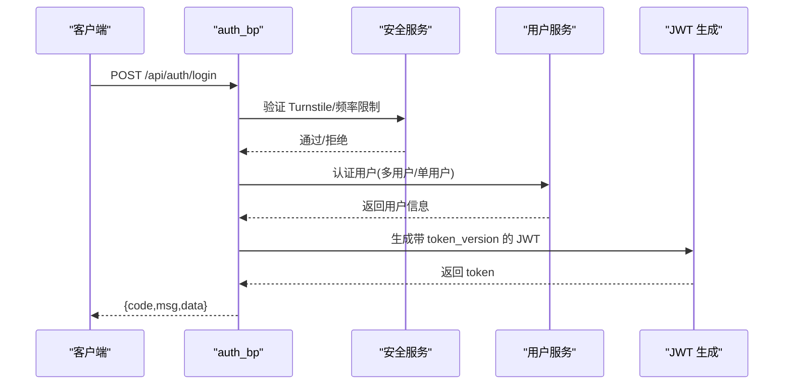

**图表来源**
- [routes/auth.py:140-278](file://backend_api_python/app/routes/auth.py#L140-L278)
- [utils/auth.py:18-47](file://backend_api_python/app/utils/auth.py#L18-L47)

**章节来源**
- [routes/auth.py:115-278](file://backend_api_python/app/routes/auth.py#L115-L278)
- [utils/auth.py:126-157](file://backend_api_python/app/utils/auth.py#L126-L157)

### 策略路由模块
- 职责：策略模板管理、策略 CRUD、回测运行、批量操作、交易记录查询
- 关键点：
  - 统一鉴权装饰器 @login_required
  - 参数校验与业务异常捕获
  - 回测范围限制与持久化
  - 与交易执行器的集成

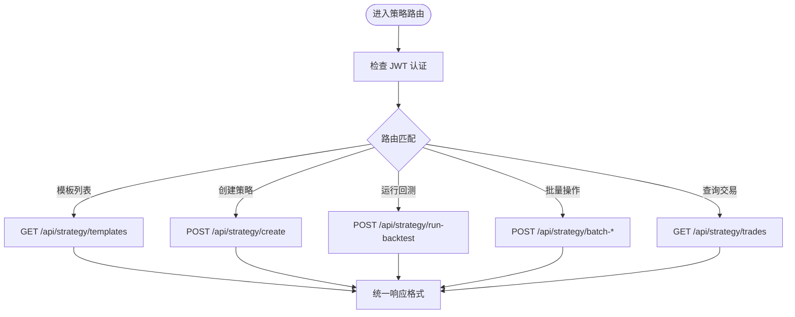

**图表来源**
- [routes/strategy.py:251-273](file://backend_api_python/app/routes/strategy.py#L251-L273)
- [routes/strategy.py:491-542](file://backend_api_python/app/routes/strategy.py#L491-L542)
- [routes/strategy.py:329-440](file://backend_api_python/app/routes/strategy.py#L329-L440)

**章节来源**
- [routes/strategy.py:295-440](file://backend_api_python/app/routes/strategy.py#L295-L440)
- [routes/strategy.py:545-678](file://backend_api_python/app/routes/strategy.py#L545-L678)

### 市场数据路由模块
- 职责：市场类型、符号搜索、热门符号、自选股、实时价格批量获取
- 关键点：
  - 并发线程池批量获取价格，带超时保护
  - 缓存与降级策略
  - 不同市场的符号解析与名称解析

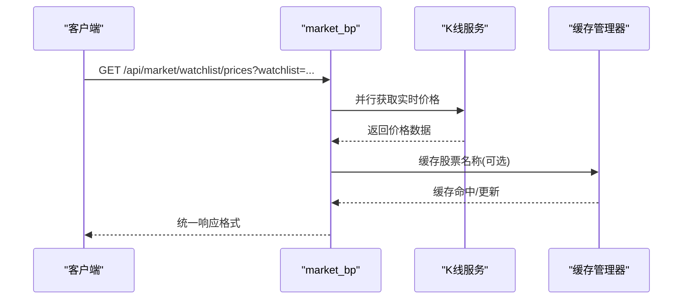

**图表来源**
- [routes/market.py:396-481](file://backend_api_python/app/routes/market.py#L396-L481)
- [routes/market.py:171-195](file://backend_api_python/app/routes/market.py#L171-L195)

**章节来源**
- [routes/market.py:53-91](file://backend_api_python/app/routes/market.py#L53-L91)
- [routes/market.py:171-261](file://backend_api_python/app/routes/market.py#L171-L261)
- [routes/market.py:396-481](file://backend_api_python/app/routes/market.py#L396-L481)

### 投资组合路由模块
- 职责：手动持仓 CRUD、组合概览、监控任务 CRUD、告警管理
- 关键点：
  - 速率限制与并发控制，避免触发外部 API 限流
  - 时间序列字段的时区规范化输出
  - 监控任务的异步执行与通知

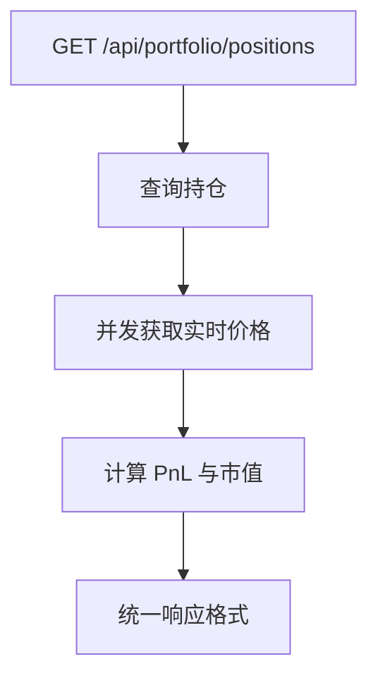

**图表来源**
- [routes/portfolio.py:142-244](file://backend_api_python/app/routes/portfolio.py#L142-L244)

**章节来源**
- [routes/portfolio.py:142-244](file://backend_api_python/app/routes/portfolio.py#L142-L244)
- [routes/portfolio.py:401-518](file://backend_api_python/app/routes/portfolio.py#L401-L518)

### 快速交易路由模块
- 职责：加密货币快速下单、余额查询、历史记录、错误提示友好化
- 关键点：
  - 统一 USDT 输入，转换为各交易所的 base 数量
  - 多交易所客户端适配与参数映射
  - 错误模式识别与 i18n 提示键

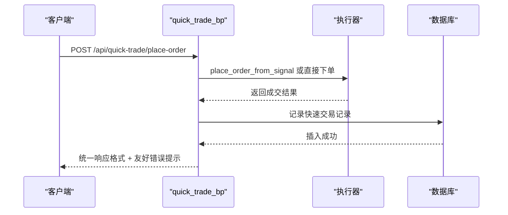

**图表来源**
- [routes/quick_trade.py:364-613](file://backend_api_python/app/routes/quick_trade.py#L364-L613)

**章节来源**
- [routes/quick_trade.py:364-613](file://backend_api_python/app/routes/quick_trade.py#L364-L613)
- [routes/quick_trade.py:668-730](file://backend_api_python/app/routes/quick_trade.py#L668-L730)

### 凭证路由模块
- 职责：加密保存交易所凭证、凭证列表、删除、解密查看、出口 IP 查询
- 关键点：
  - 本地部署下直接使用明文配置，避免不必要的加密开销
  - 支持桌面券商（IBKR/MT5）策略限制

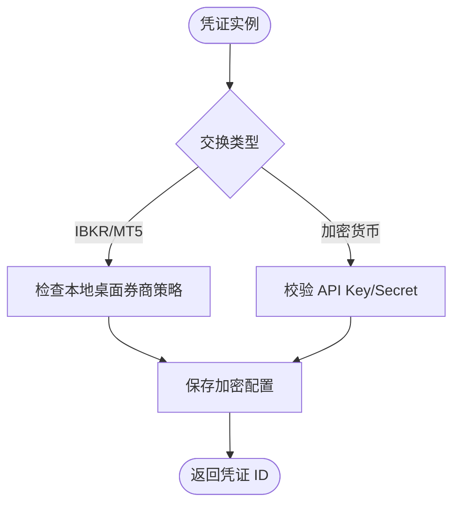

**图表来源**
- [routes/credentials.py:138-230](file://backend_api_python/app/routes/credentials.py#L138-L230)

**章节来源**
- [routes/credentials.py:55-93](file://backend_api_python/app/routes/credentials.py#L55-L93)
- [routes/credentials.py:138-230](file://backend_api_python/app/routes/credentials.py#L138-L230)

### 用户路由模块
- 职责：管理员用户管理、导出、角色权限、账单管理；普通用户资料与通知设置
- 关键点：
  - 管理员装饰器与字段白名单更新
  - 通知设置的默认值与兼容处理

**章节来源**
- [routes/user.py:41-68](file://backend_api_python/app/routes/user.py#L41-L68)
- [routes/user.py:418-524](file://backend_api_python/app/routes/user.py#L418-L524)

### 健康检查路由模块
- 职责：应用首页、健康检查、兼容路径
- 关键点：简洁统一的健康状态返回

**章节来源**
- [routes/health.py:10-33](file://backend_api_python/app/routes/health.py#L10-L33)

### Agent v1 网关
- 职责：面向 AI 代理的只读/读写接口，版本化、能力范围严格控制
- 关键点：
  - 独立的 Agent 身份体系，非人类用户会话
  - 严格的市场/工具允许列表与速率限制
  - 统一的错误封装与可重试标记

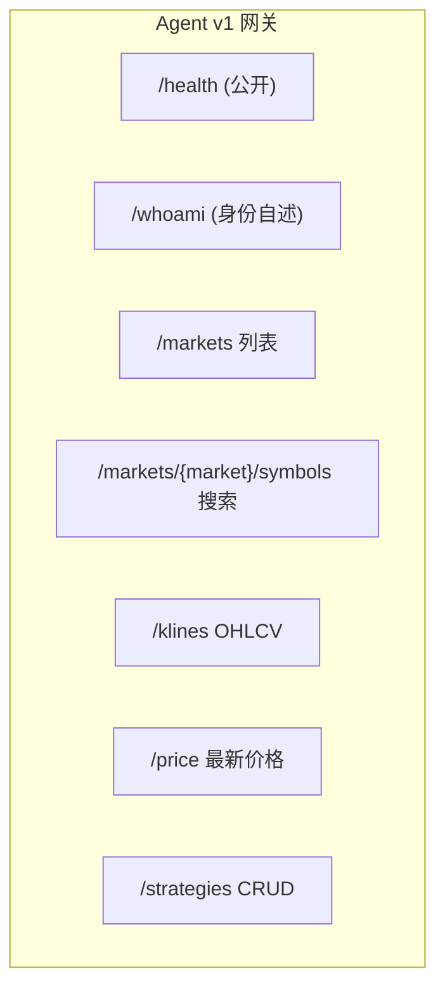

**图表来源**
- [routes/agent_v1/health.py:16-28](file://backend_api_python/app/routes/agent_v1/health.py#L16-L28)
- [routes/agent_v1/markets.py:37-71](file://backend_api_python/app/routes/agent_v1/markets.py#L37-L71)
- [routes/agent_v1/strategies.py:38-63](file://backend_api_python/app/routes/agent_v1/strategies.py#L38-L63)

**章节来源**
- [routes/agent_v1/__init__.py:34-49](file://backend_api_python/app/routes/agent_v1/__init__.py#L34-L49)
- [routes/agent_v1/health.py:16-48](file://backend_api_python/app/routes/agent_v1/health.py#L16-L48)
- [routes/agent_v1/markets.py:37-155](file://backend_api_python/app/routes/agent_v1/markets.py#L37-L155)
- [routes/agent_v1/strategies.py:38-129](file://backend_api_python/app/routes/agent_v1/strategies.py#L38-L129)

## 依赖关系分析
- 路由层依赖：
  - 蓝图内部依赖服务层（策略、用户、市场、凭证等）
  - 蓝图依赖认证工具（JWT 鉴权装饰器）
  - Agent v1 依赖专用的身份与权限校验模块
- 耦合与内聚：
  - 蓝图间低耦合，通过服务层交互
  - 主注册函数集中导入，避免循环依赖
  - Agent v1 与人类路由完全隔离，职责清晰

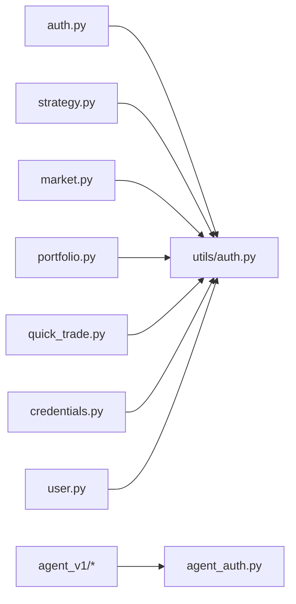

**图表来源**
- [routes/auth.py:11-12](file://backend_api_python/app/routes/auth.py#L11-L12)
- [routes/strategy.py:23-24](file://backend_api_python/app/routes/strategy.py#L23-L24)
- [routes/market.py:17-17](file://backend_api_python/app/routes/market.py#L17-L17)
- [routes/portfolio.py:18-18](file://backend_api_python/app/routes/portfolio.py#L18-L18)
- [routes/quick_trade.py:27-27](file://backend_api_python/app/routes/quick_trade.py#L27-L27)
- [routes/credentials.py:15-15](file://backend_api_python/app/routes/credentials.py#L15-L15)
- [routes/user.py:13-13](file://backend_api_python/app/routes/user.py#L13-L13)
- [routes/agent_v1/health.py:8-10](file://backend_api_python/app/routes/agent_v1/health.py#L8-L10)

**章节来源**
- [utils/auth.py:126-157](file://backend_api_python/app/utils/auth.py#L126-L157)

## 性能考虑
- 并发与限流：
  - 市场与投资组合模块使用线程池并发拉取价格，设置超时与速率限制
  - Agent v1 与快速交易模块内置速率限制与错误提示友好化
- 缓存策略：
  - 市场模块对股票名称与交易所符号列表进行短期缓存
  - 快速交易模块对价格转换失败进行日志记录与降级处理
- 数据库连接：
  - 统一使用上下文管理器获取/释放连接，避免连接泄漏
- 响应一致性：
  - 统一的 code/msg/data 结构，便于前端统一处理与错误展示

[本节为通用指导，无需特定文件引用]

## 故障排除指南
- 认证失败：
  - 检查 Authorization 头是否为 Bearer Token
  - 核对 token 是否过期或 token_version 不匹配
- 路由 404：
  - 确认 URL 前缀与模块是否正确注册
  - Agent v1 路由需使用 /api/agent/v1 前缀
- 业务错误：
  - 查看响应中的 code/msg，遵循统一错误格式
  - 快速交易模块可通过 error_hint 获取 i18n 提示键
- 日志定位：
  - 各模块均记录错误堆栈与关键参数，便于定位问题

**章节来源**
- [routes/agent_v1/__init__.py:24-31](file://backend_api_python/app/routes/agent_v1/__init__.py#L24-L31)
- [routes/quick_trade.py:608-613](file://backend_api_python/app/routes/quick_trade.py#L608-L613)
- [utils/auth.py:74-79](file://backend_api_python/app/utils/auth.py#L74-L79)

## 结论
QuantDinger 的路由系统通过蓝图化设计实现了高内聚、低耦合的模块化架构。主注册函数集中管理路由装配，认证中间件统一处理鉴权，Agent v1 网关与人类路由彻底分离，满足不同用户群体的安全与性能需求。统一的响应格式与错误处理机制提升了系统的可观测性与可维护性。建议在新增路由时遵循现有装饰器与响应规范，保持风格一致。