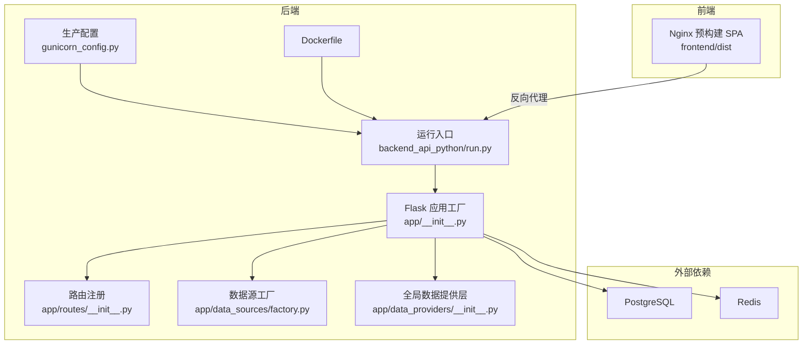
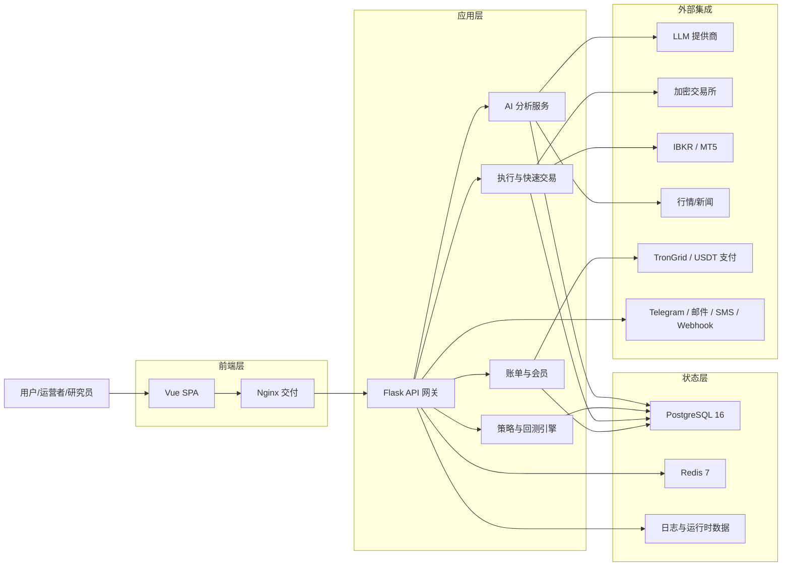
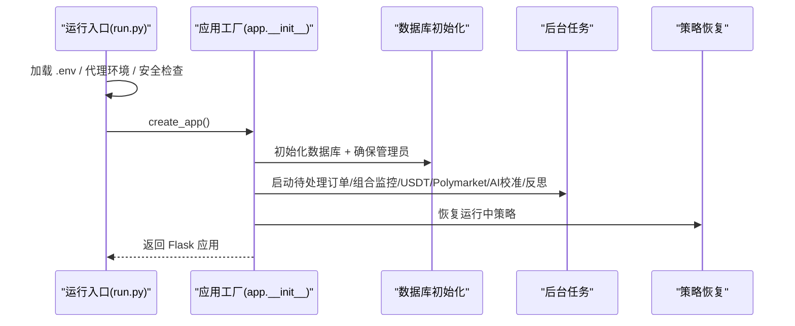
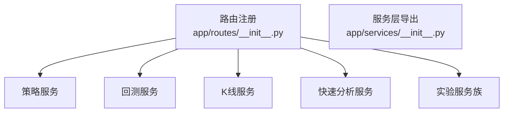
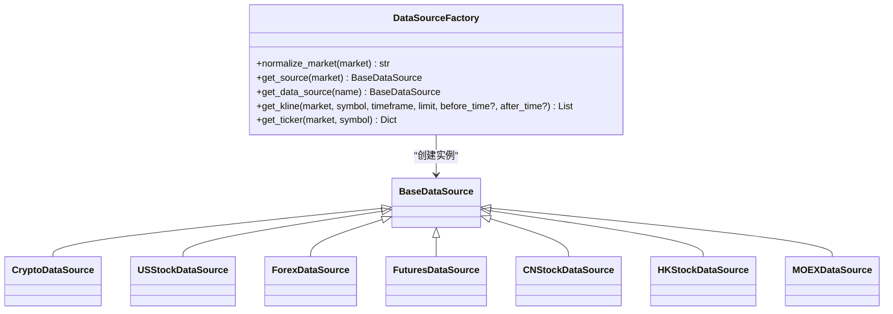
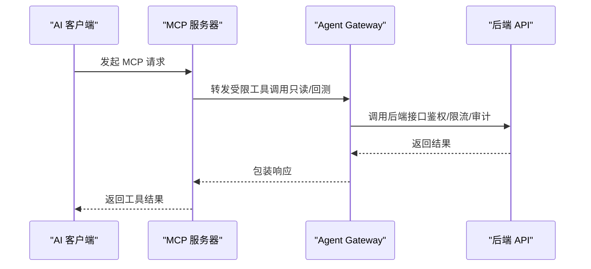
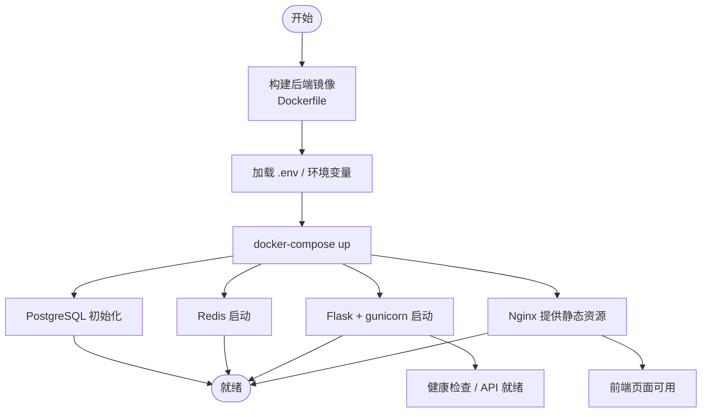

# 开发指南

<cite>
**本文引用的文件**
- [README.md](file://README.md)
- [DEVELOPMENT.md](file://DEVELOPMENT.md)
- [CONTRIBUTING.md](file://CONTRIBUTING.md)
- [docker-compose.yml](file://docker-compose.yml)
- [backend_api_python/run.py](file://backend_api_python/run.py)
- [backend_api_python/app/__init__.py](file://backend_api_python/app/__init__.py)
- [backend_api_python/app/routes/__init__.py](file://backend_api_python/app/routes/__init__.py)
- [backend_api_python/app/data_sources/factory.py](file://backend_api_python/app/data_sources/factory.py)
- [backend_api_python/app/data_providers/__init__.py](file://backend_api_python/app/data_providers/__init__.py)
- [backend_api_python/requirements.txt](file://backend_api_python/requirements.txt)
- [backend_api_python/Dockerfile](file://backend_api_python/Dockerfile)
- [backend_api_python/gunicorn_config.py](file://backend_api_python/gunicorn_config.py)
- [backend_api_python/env.example](file://backend_api_python/env.example)
- [backend_api_python/backend_api_python/README.md](file://backend_api_python/backend_api_python/README.md)
- [mcp_server/README.md](file://mcp_server/README.md)
- [scripts/README.md](file://scripts/README.md)
- [backend_api_python/tests/conftest.py](file://backend_api_python/tests/conftest.py)
</cite>

## 目录
1. [简介](#简介)
2. [项目结构](#项目结构)
3. [核心组件](#核心组件)
4. [架构总览](#架构总览)
5. [详细组件分析](#详细组件分析)
6. [依赖关系与构建脚本](#依赖关系与构建脚本)
7. [测试策略与代码质量](#测试策略与代码质量)
8. [开发流程与贡献规范](#开发流程与贡献规范)
9. [插件开发与扩展点](#插件开发与扩展点)
10. [调试、性能分析与问题诊断](#调试性能分析与问题诊断)
11. [发布流程与分支管理](#发布流程与分支管理)
12. [最佳实践与架构原则](#最佳实践与架构原则)
13. [结论](#结论)

## 简介
QuantDinger 是一个“本地优先”的自托管量化工作平台，融合 AI 辅助研究、Python 原生策略、回测、以及多市场（加密、美股、外汇等）的实盘执行。它通过单一 Compose 栈整合前端、Flask 后端、PostgreSQL、Redis，并支持可插拔的数据源与执行器适配器。

- 快速体验：一键 Docker Compose 启动，浏览器访问前端，管理员初始凭据登录后立即可用。
- 支持模式：IndicatorStrategy（基于 DataFrame 的信号策略）与 ScriptStrategy（事件驱动的显式下单策略）。
- 扩展能力：通过工厂模式接入新的数据源与交易所执行器；Agent Gateway + MCP 提供 AI 代理集成。

章节来源
- [README.md: 81-120:81-120](file://README.md#L81-L120)
- [README.md: 222-270:222-270](file://README.md#L222-L270)
- [backend_api_python/backend_api_python/README.md: 35-73:35-73](file://backend_api_python/backend_api_python/README.md#L35-L73)

## 项目结构
仓库采用“单仓多模块”的组织方式：
- backend_api_python：Flask 后端，包含配置、数据源工厂、路由蓝图、服务层、工具库与迁移脚本。
- frontend：预构建的 Vue SPA，由独立前端仓库构建后同步至该目录。
- docs：产品文档、部署指南、策略开发指南等。
- mcp_server：MCP 服务器，将 Agent Gateway 暴露为 MCP 工具集。
- scripts：国际化与前端构建辅助脚本。
- docker-compose.yml：一键编排数据库、缓存、后端、前端服务。

图表来源
- [backend_api_python/app/__init__.py: 213-279:213-279](file://backend_api_python/app/__init__.py#L213-L279)
- [backend_api_python/app/routes/__init__.py: 7-58:7-58](file://backend_api_python/app/routes/__init__.py#L7-L58)
- [backend_api_python/app/data_sources/factory.py: 33-112:33-112](file://backend_api_python/app/data_sources/factory.py#L33-L112)
- [backend_api_python/app/data_providers/__init__.py: 19-86:19-86](file://backend_api_python/app/data_providers/__init__.py#L19-L86)
- [backend_api_python/run.py: 96-134:96-134](file://backend_api_python/run.py#L96-L134)
- [backend_api_python/gunicorn_config.py: 10-36:10-36](file://backend_api_python/gunicorn_config.py#L10-L36)
- [backend_api_python/Dockerfile: 1-62:1-62](file://backend_api_python/Dockerfile#L1-L62)
- [docker-compose.yml: 25-172:25-172](file://docker-compose.yml#L25-L172)

章节来源
- [DEVELOPMENT.md: 39-63:39-63](file://DEVELOPMENT.md#L39-L63)
- [README.md: 538-556:538-556](file://README.md#L538-L556)

## 核心组件
- 应用工厂与安全 JSON 提供者：确保输出 JSON 符合 RFC 规范，避免 NaN/Inf 导致前端解析失败；初始化数据库、用户、CORS、日志等。
- 路由注册：集中注册所有蓝图，包括认证、用户、指标、回测、市场、策略、仪表盘、设置、组合、IBKR/MT5、全局市场、社区、快速交易、多市场、实验等；同时注册 Agent Gateway 版本化接口。
- 数据源工厂：按市场类型（加密、美股、港股、俄股、外汇、商品、期货）选择具体数据源实现，支持别名归一化与错误处理。
- 全局数据提供层：统一缓存封装（Redis 或内存），提供 TTL 策略、清理与安全数值转换。
- 运行入口与生产配置：加载 .env、应用代理环境、安全检查（强制更换 SECRET_KEY）、启动 gunicorn 生产服务器。
- Docker 化：镜像构建优化（国内镜像回退）、暴露端口、挂载日志与数据卷、健康检查。

章节来源
- [backend_api_python/app/__init__.py: 15-51:15-51](file://backend_api_python/app/__init__.py#L15-L51)
- [backend_api_python/app/__init__.py: 213-279:213-279](file://backend_api_python/app/__init__.py#L213-L279)
- [backend_api_python/app/routes/__init__.py: 7-58:7-58](file://backend_api_python/app/routes/__init__.py#L7-L58)
- [backend_api_python/app/data_sources/factory.py: 33-112:33-112](file://backend_api_python/app/data_sources/factory.py#L33-L112)
- [backend_api_python/app/data_providers/__init__.py: 19-86:19-86](file://backend_api_python/app/data_providers/__init__.py#L19-L86)
- [backend_api_python/run.py: 96-134:96-134](file://backend_api_python/run.py#L96-L134)
- [backend_api_python/gunicorn_config.py: 10-36:10-36](file://backend_api_python/gunicorn_config.py#L10-L36)
- [backend_api_python/Dockerfile: 1-62:1-62](file://backend_api_python/Dockerfile#L1-62)

## 架构总览
系统分为四层：前端层、应用层、状态层、外部集成层。后端通过工厂模式解耦数据源与执行器，支持多租户与多用户角色，配合 Redis 缓存与 PostgreSQL 存储。

图表来源
- [README.md: 276-330:276-330](file://README.md#L276-L330)

章节来源
- [README.md: 270-330:270-330](file://README.md#L270-L330)

## 详细组件分析

### 应用工厂与启动流程
- 安全 JSON 提供者：递归替换 NaN/Inf 为 null，保证前后端兼容。
- 启动钩子：初始化数据库、确保管理员存在、启动后台任务（待处理订单、组合监控、USDT 订单、Polymarket、AI 校准与反思）。
- 策略恢复：在非重载模式下，启动时尝试恢复运行中的策略，失败则置为停止，避免僵尸状态。

图表来源
- [backend_api_python/run.py: 96-134:96-134](file://backend_api_python/run.py#L96-L134)
- [backend_api_python/app/__init__.py: 213-279:213-279](file://backend_api_python/app/__init__.py#L213-L279)

章节来源
- [backend_api_python/run.py: 96-134:96-134](file://backend_api_python/run.py#L96-L134)
- [backend_api_python/app/__init__.py: 213-279:213-279](file://backend_api_python/app/__init__.py#L213-L279)

### 路由与服务层
- 路由注册：集中注册认证、用户、指标、回测、市场、策略、仪表盘、设置、组合、IBKR/MT5、全局市场、社区、快速交易、多市场、实验等蓝图。
- 服务层：提供 K 线、回测、策略编译、快速 AI 分析、实验运行、市场周期检测、策略演化与评分等服务。

图表来源
- [backend_api_python/app/routes/__init__.py: 7-58:7-58](file://backend_api_python/app/routes/__init__.py#L7-L58)
- [backend_api_python/app/services/__init__.py: 1-26:1-26](file://backend_api_python/app/services/__init__.py#L1-L26)

章节来源
- [backend_api_python/app/routes/__init__.py: 7-58:7-58](file://backend_api_python/app/routes/__init__.py#L7-L58)
- [backend_api_python/app/services/__init__.py: 1-26:1-26](file://backend_api_python/app/services/__init__.py#L1-L26)

### 数据源工厂与全局数据提供层
- 工厂：按市场类型映射到具体数据源类，支持别名归一化与异常处理；提供便捷的 K 线与实时报价获取。
- 全局数据提供层：统一缓存（Redis/内存）、TTL 策略、缓存清理、安全数值转换。

图表来源
- [backend_api_python/app/data_sources/factory.py: 33-112:33-112](file://backend_api_python/app/data_sources/factory.py#L33-L112)

章节来源
- [backend_api_python/app/data_sources/factory.py: 33-178:33-178](file://backend_api_python/app/data_sources/factory.py#L33-L178)
- [backend_api_python/app/data_providers/__init__.py: 19-86:19-86](file://backend_api_python/app/data_providers/__init__.py#L19-L86)

### Agent Gateway 与 MCP 集成
- Agent Gateway：版本化 REST 接口，面向 AI 代理的安全面，支持审计日志与令牌作用域控制。
- MCP 服务器：将 Agent Gateway 暴露为 MCP 工具，支持本地 stdio 与远程 HTTP/SSE 两种传输，适合 Cursor、Claude 等客户端直接使用。

图表来源
- [mcp_server/README.md: 15-34:15-34](file://mcp_server/README.md#L15-L34)
- [mcp_server/README.md: 54-88:54-88](file://mcp_server/README.md#L54-L88)

章节来源
- [mcp_server/README.md: 1-115:1-115](file://mcp_server/README.md#L1-L115)

## 依赖关系与构建脚本
- 依赖清单：Flask、Werkzeug、CORS、数据与执行相关库（yfinance、ccxt、FinHubs、MetaTrader5 可选）、PostgreSQL/Redis 客户端、gunicorn、bcrypt、ib_insync、bip-utils 等。
- Dockerfile：国内镜像优先拉取，失败回退官方源；安装系统依赖后安装 Python 依赖；暴露 5000 端口；entrypoint 启动 gunicorn。
- gunicorn 配置：线程模型（gthread）、工作进程数、线程数、超时、日志级别等；preload 关闭以避免后台线程在主进程 fork 后丢失。
- docker-compose：编排 postgres、redis、backend、frontend；挂载 .env、日志与数据卷；健康检查；端口映射；环境变量注入（数据库连接池、并发、缓存开关等）。

图表来源
- [backend_api_python/Dockerfile: 1-62:1-62](file://backend_api_python/Dockerfile#L1-L62)
- [backend_api_python/gunicorn_config.py: 10-36:10-36](file://backend_api_python/gunicorn_config.py#L10-L36)
- [docker-compose.yml: 25-172:25-172](file://docker-compose.yml#L25-L172)

章节来源
- [backend_api_python/requirements.txt: 1-37:1-37](file://backend_api_python/requirements.txt#L1-L37)
- [backend_api_python/Dockerfile: 1-62:1-62](file://backend_api_python/Dockerfile#L1-L62)
- [backend_api_python/gunicorn_config.py: 10-36:10-36](file://backend_api_python/gunicorn_config.py#L10-L36)
- [docker-compose.yml: 25-172:25-172](file://docker-compose.yml#L25-L172)

## 测试策略与代码质量
- 单元测试：pytest，共享测试夹具（导入路径、最小化环境变量、测试应用工厂）。
- 本地验证：后端本地运行 + 前端本地开发服务器；关键端点与页面验证。
- 回归测试：针对重大修复建议附带最小回归用例。
- 代码质量：遵循项目既有风格与模块职责，保持小而聚焦的改动；PR 需说明变更原因、测试方法、兼容性影响。

章节来源
- [backend_api_python/tests/conftest.py: 1-31:1-31](file://backend_api_python/tests/conftest.py#L1-L31)
- [CONTRIBUTING.md: 142-149:142-149](file://CONTRIBUTING.md#L142-L149)

## 开发流程与贡献规范
- 开发环境：Docker 快速起步；或本地 Python 环境（虚拟环境 + requirements.txt）。
- 前端更新：私有前端仓库构建后同步 dist/，再重建/启动服务。
- 新增数据源：实现接口类并注册到工厂；如服务于全局看板，补充数据提供层 fetcher。
- 新增交易所：实现执行器基类并注册工厂；注意 IBKR/MT5 需本地终端。
- 提交流程：分支命名规范（fix/feat/docs/chore）、PR 描述清晰、截图/视频（UI 变更时）、向后兼容说明。

章节来源
- [DEVELOPMENT.md: 11-28:11-28](file://DEVELOPMENT.md#L11-L28)
- [DEVELOPMENT.md: 75-109:75-109](file://DEVELOPMENT.md#L75-L109)
- [DEVELOPMENT.md: 110-124:110-124](file://DEVELOPMENT.md#L110-L124)
- [CONTRIBUTING.md: 120-140:120-140](file://CONTRIBUTING.md#L120-L140)

## 插件开发与扩展点
- 数据源扩展：在 data_sources 下新增模块，实现统一接口并通过工厂注册；支持别名映射与错误处理。
- 执行器扩展：在 live_trading 下新增模块，继承基类并注册工厂；注意令牌作用域与审计日志。
- Agent/MCP：通过 Agent Gateway 与 MCP 服务器对接第三方 AI 客户端；仅暴露只读与回测工具，默认禁止实盘。
- 配置扩展：通过 env.example 中的键进行扩展，如新增 LLM 提供商、搜索提供商、通知通道等。

章节来源
- [DEVELOPMENT.md: 110-124:110-124](file://DEVELOPMENT.md#L110-L124)
- [backend_api_python/env.example: 64-98:64-98](file://backend_api_python/env.example#L64-L98)
- [mcp_server/README.md: 15-34:15-34](file://mcp_server/README.md#L15-L34)

## 调试、性能分析与问题诊断
- 启动与安全：若 SECRET_KEY 仍为默认值，后端拒绝启动；可通过运行入口自动生成随机密钥并提示持久化。
- 代理与证书：支持统一代理环境变量与 NO_PROXY 白名单；Live 交易可配置 CA Bundle 或禁用校验（不推荐）。
- 数据问题：全局 JSON 提供者已将 NaN/Inf 转为 null；若出现“无数据”，检查数据源可用性与缓存。
- 缓存与并发：Redis 可提升多 worker 场景下的性能；数据库连接池与执行器并发需与 PG 最大连接数匹配。
- 日志与健康：查看容器日志、健康检查端点；必要时降低并发或启用只读/回测工具链。

章节来源
- [backend_api_python/run.py: 109-120:109-120](file://backend_api_python/run.py#L109-L120)
- [backend_api_python/env.example: 138-152:138-152](file://backend_api_python/env.example#L138-L152)
- [backend_api_python/app/__init__.py: 15-51:15-51](file://backend_api_python/app/__init__.py#L15-L51)
- [docker-compose.yml: 54-58:54-58](file://docker-compose.yml#L54-L58)
- [docker-compose.yml: 127-131:127-131](file://docker-compose.yml#L127-L131)

## 发布流程与分支管理
- 分支命名：fix/xxx、feat/xxx、docs/xxx、chore/xxx。
- 提交与评审：保持 PR 聚焦、可审查；附带测试方法与兼容性说明。
- 环境变量：根级 .env 用于端口与镜像前缀；后端 .env 用于数据库、密钥、AI、工作线程等。
- Docker 镜像：默认使用官方镜像，可通过 IMAGE_PREFIX 切换镜像源；国内拉取慢时可配置镜像前缀或镜像加速。

章节来源
- [CONTRIBUTING.md: 120-140:120-140](file://CONTRIBUTING.md#L120-L140)
- [docker-compose.yml: 17-24:17-24](file://docker-compose.yml#L17-L24)
- [backend_api_python/env.example: 1-L319:1-319](file://backend_api_python/env.example#L1-L319)

## 最佳实践与架构原则
- 本地优先：所有密钥与数据驻留在自管基础设施，避免泄露风险。
- 工厂模式：解耦数据源与执行器，便于扩展与替换。
- 安全默认：默认禁止实盘（Agent 令牌），需要显式开启；审计日志记录所有调用。
- 渐进增强：先验证 AI 分析与回测，再接入真实资金；策略上线前充分测试。
- 可观测性：利用健康检查、日志、缓存 TTL、数据库连接池与后台任务状态，持续监控系统健康。

章节来源
- [README.md: 133-221:133-221](file://README.md#L133-L221)
- [backend_api_python/app/data_sources/factory.py: 33-112:33-112](file://backend_api_python/app/data_sources/factory.py#L33-L112)
- [backend_api_python/env.example: 106-125:106-125](file://backend_api_python/env.example#L106-L125)

## 结论
QuantDinger 提供了从研究、策略开发、回测到实盘执行的一体化自托管方案。通过清晰的模块划分、工厂模式与 Agent/MCP 集成，开发者可以快速扩展数据源、执行器与 AI 工具链。建议在本地充分验证后再接入真实资金，严格遵循安全默认与可观测性原则，结合 CI/CD 与自动化脚本，持续提升系统的稳定性与可维护性。