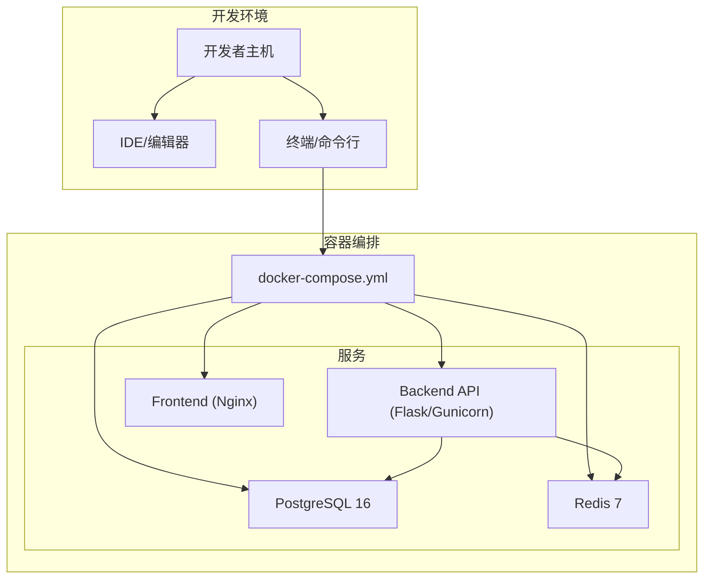
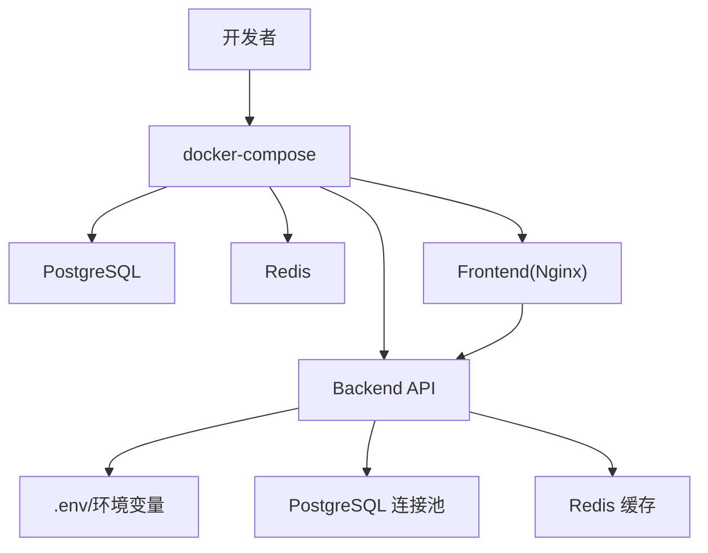
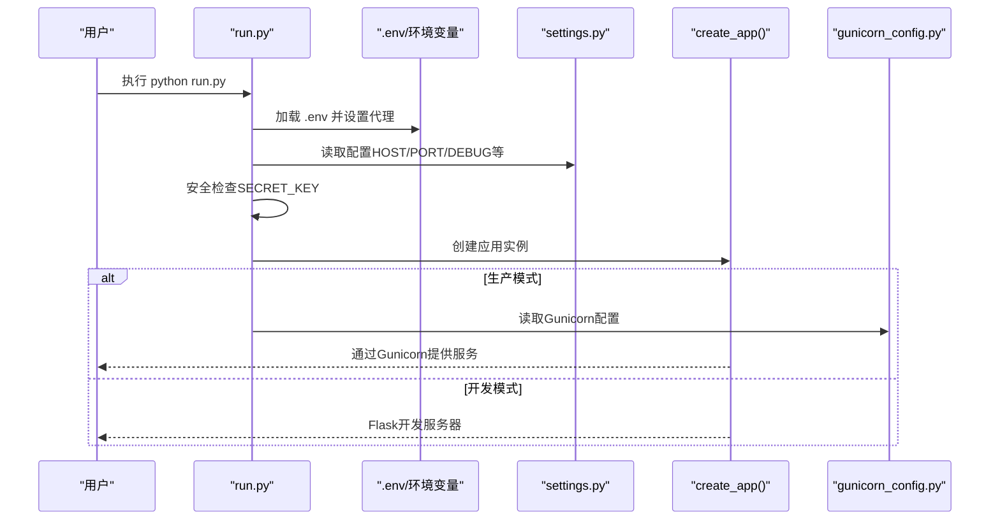
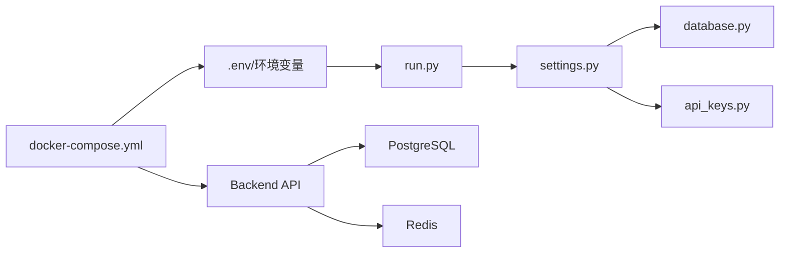

# 开发环境搭建

<cite>
**本文引用的文件**
- [backend_api_python/README.md](file://backend_api_python/README.md)
- [DEVELOPMENT.md](file://DEVELOPMENT.md)
- [docker-compose.yml](file://docker-compose.yml)
- [backend_api_python/Dockerfile](file://backend_api_python/Dockerfile)
- [backend_api_python/docker-entrypoint.sh](file://backend_api_python/docker-entrypoint.sh)
- [backend_api_python/start.sh](file://backend_api_python/start.sh)
- [backend_api_python/run.py](file://backend_api_python/run.py)
- [backend_api_python/gunicorn_config.py](file://backend_api_python/gunicorn_config.py)
- [backend_api_python/env.example](file://backend_api_python/env.example)
- [backend_api_python/requirements.txt](file://backend_api_python/requirements.txt)
- [backend_api_python/app/config/settings.py](file://backend_api_python/app/config/settings.py)
- [backend_api_python/app/config/database.py](file://backend_api_python/app/config/database.py)
- [backend_api_python/app/config/api_keys.py](file://backend_api_python/app/config/api_keys.py)
- [backend_api_python/tests/conftest.py](file://backend_api_python/tests/conftest.py)
</cite>

## 目录
1. [简介](#简介)
2. [项目结构](#项目结构)
3. [核心组件](#核心组件)
4. [架构总览](#架构总览)
5. [详细组件分析](#详细组件分析)
6. [依赖关系分析](#依赖关系分析)
7. [性能注意事项](#性能注意事项)
8. [故障排查指南](#故障排查指南)
9. [结论](#结论)
10. [附录](#附录)

## 简介
本指南面向QuantDinger项目的开发者，提供从零到可用的本地开发环境搭建流程，涵盖以下方面：
- 本地开发环境准备：Python版本、虚拟环境、依赖安装
- 环境变量配置：数据库、认证、AI/LLM、代理、第三方服务等
- Docker开发环境：一键编排与容器化部署
- IDE与代码规范：编辑器配置、格式化工具、调试环境
- 常见问题排查与解决方案

## 项目结构
QuantDinger采用前后端分离与多服务编排的架构：
- 后端：基于Flask的Python API，提供市场数据、指标计算、AI分析、回测、策略运行与多用户管理
- 数据库：PostgreSQL（含初始化SQL）
- 缓存：可选Redis（LRU）
- 前端：静态资源由Nginx提供（Vue源码在私有仓库维护）

图表来源
- [docker-compose.yml:25-172](file://docker-compose.yml#L25-L172)

章节来源
- [DEVELOPMENT.md:39-63](file://DEVELOPMENT.md#L39-L63)
- [backend_api_python/README.md:15-33](file://backend_api_python/README.md#L15-L33)

## 核心组件
- 后端API（Flask）：应用入口、路由、服务层、工具库
- 数据库（PostgreSQL）：初始化SQL、连接池、并发控制
- 缓存（Redis）：可选，提升并发与响应速度
- 前端（Nginx）：静态资源分发，代理转发至后端
- 配置体系：环境变量驱动，支持.env文件与Docker环境注入

章节来源
- [backend_api_python/README.md:15-33](file://backend_api_python/README.md#L15-L33)
- [backend_api_python/env.example:1-319](file://backend_api_python/env.example#L1-L319)
- [docker-compose.yml:25-172](file://docker-compose.yml#L25-L172)

## 架构总览
下图展示开发环境中的关键交互：开发者通过Docker Compose启动后端、数据库与前端；后端通过环境变量读取配置，访问数据库与可选缓存。

图表来源
- [docker-compose.yml:25-172](file://docker-compose.yml#L25-L172)
- [backend_api_python/env.example:1-319](file://backend_api_python/env.example#L1-L319)

## 详细组件分析

### 本地开发环境准备
- Python版本
  - 推荐Python 3.10+（本地运行）
  - 容器镜像使用Python 3.12（生产/容器）
- 虚拟环境
  - 使用标准venv创建隔离环境，并激活后安装依赖
- 依赖安装
  - 在backend_api_python目录执行依赖安装
- 启动方式
  - 容器：docker compose up -d
  - 本地：python run.py（开发服务器），或gunicorn（生产）

章节来源
- [backend_api_python/README.md:74-134](file://backend_api_python/README.md#L74-L134)
- [DEVELOPMENT.md:65-76](file://DEVELOPMENT.md#L65-L76)
- [backend_api_python/requirements.txt:1-37](file://backend_api_python/requirements.txt#L1-L37)

### 环境变量配置
- 必填项
  - SECRET_KEY：JWT签名密钥，必须修改为随机值
  - ADMIN_USER / ADMIN_PASSWORD：首次启动创建的管理员账户
  - DATABASE_URL：PostgreSQL连接串
- 可选但推荐
  - OPENROUTER_API_KEY / OPENAI_API_KEY 等：AI分析能力
  - CACHE_ENABLED：启用Redis缓存（Docker默认开启）
  - PROXY_URL：出站代理（请求库自动应用）
- 关键配置位置
  - 本地：backend_api_python/.env
  - 容器：compose文件注入环境变量，容器启动脚本自检并生成安全密钥

章节来源
- [backend_api_python/env.example:1-319](file://backend_api_python/env.example#L1-L319)
- [backend_api_python/run.py:17-29](file://backend_api_python/run.py#L17-L29)
- [backend_api_python/docker-entrypoint.sh:25-44](file://backend_api_python/docker-entrypoint.sh#L25-L44)
- [docker-compose.yml:101-124](file://docker-compose.yml#L101-L124)

### Docker开发环境
- 一键启动
  - 复制示例配置并生成安全密钥
  - docker compose up -d --build
- 服务与端口
  - 前端：8888（Nginx）
  - 后端：5000（Flask/Gunicorn）
  - 数据库：5432（PostgreSQL）
  - 缓存：6379（Redis）
- 安全检查
  - 容器启动前会校验并自动生成安全的SECRET_KEY
- 运行时配置
  - 后端通过环境变量控制主机、端口、连接池、并发线程等

章节来源
- [DEVELOPMENT.md:11-28](file://DEVELOPMENT.md#L11-L28)
- [backend_api_python/README.md:35-73](file://backend_api_python/README.md#L35-L73)
- [docker-compose.yml:25-172](file://docker-compose.yml#L25-L172)
- [backend_api_python/docker-entrypoint.sh:11-48](file://backend_api_python/docker-entrypoint.sh#L11-L48)

### 应用入口与配置加载
- 入口脚本
  - run.py负责加载.env、应用代理环境、创建应用实例
  - 提供安全检查：若使用默认SECRET_KEY则自动生成新密钥
- 配置类
  - settings.py：主机、端口、调试、日志、功能开关
  - database.py：Redis与缓存配置
  - api_keys.py：第三方API密钥统一读取

图表来源
- [backend_api_python/run.py:17-134](file://backend_api_python/run.py#L17-L134)
- [backend_api_python/gunicorn_config.py:1-36](file://backend_api_python/gunicorn_config.py#L1-L36)
- [backend_api_python/app/config/settings.py:1-99](file://backend_api_python/app/config/settings.py#L1-L99)

章节来源
- [backend_api_python/run.py:17-134](file://backend_api_python/run.py#L17-L134)
- [backend_api_python/app/config/settings.py:1-99](file://backend_api_python/app/config/settings.py#L1-L99)
- [backend_api_python/app/config/database.py:1-90](file://backend_api_python/app/config/database.py#L1-L90)
- [backend_api_python/app/config/api_keys.py:1-184](file://backend_api_python/app/config/api_keys.py#L1-L184)

### 数据库与缓存配置
- PostgreSQL
  - 初始化SQL位于migrations/init.sql
  - 连接池参数可通过环境变量调整（最小/最大连接数、获取超时、健康检查）
- Redis
  - 可选缓存层，默认在Docker中启用
  - 支持密码、DB索引、连接超时、最大连接数
  - K线、分析、价格等缓存TTL策略内置

章节来源
- [backend_api_python/env.example:41-57](file://backend_api_python/env.example#L41-L57)
- [backend_api_python/app/config/database.py:1-90](file://backend_api_python/app/config/database.py#L1-L90)

### 第三方服务与API密钥
- 支持多家LLM提供商（OpenRouter、OpenAI、Google、DeepSeek、Grok、MiniMax等）
- 支持自定义兼容接口（CUSTOM_API_URL/CUSTOM_MODEL）
- 支持新闻搜索（Tavily、SerpAPI、Bing、Google）
- 支持Adanos市场情绪（可选）
- 支持Twelve Data、Tiingo、Finnhub、AkShare等数据源

章节来源
- [backend_api_python/env.example:63-98](file://backend_api_python/env.example#L63-L98)
- [backend_api_python/env.example:260-279](file://backend_api_python/env.example#L260-L279)
- [backend_api_python/app/config/api_keys.py:1-184](file://backend_api_python/app/config/api_keys.py#L1-L184)

### 测试与验证
- 测试客户端
  - tests/conftest.py提供最小化测试环境，设置必要环境变量并创建测试应用
- 运行测试
  - 在backend_api_python目录执行pytest tests/ -v

章节来源
- [backend_api_python/tests/conftest.py:1-31](file://backend_api_python/tests/conftest.py#L1-L31)

## 依赖关系分析
- 组件耦合
  - run.py依赖dotenv加载配置，再创建应用实例
  - 应用通过settings.py读取环境变量，database.py与api_keys.py提供具体配置
  - docker-compose将环境变量注入后端容器，容器启动脚本进行安全检查
- 外部依赖
  - PostgreSQL、Redis、Nginx作为独立服务
  - Python依赖集中在requirements.txt

图表来源
- [backend_api_python/run.py:17-134](file://backend_api_python/run.py#L17-L134)
- [backend_api_python/app/config/settings.py:1-99](file://backend_api_python/app/config/settings.py#L1-L99)
- [backend_api_python/app/config/database.py:1-90](file://backend_api_python/app/config/database.py#L1-L90)
- [backend_api_python/app/config/api_keys.py:1-184](file://backend_api_python/app/config/api_keys.py#L1-L184)
- [docker-compose.yml:25-172](file://docker-compose.yml#L25-L172)

章节来源
- [backend_api_python/requirements.txt:1-37](file://backend_api_python/requirements.txt#L1-L37)
- [docker-compose.yml:25-172](file://docker-compose.yml#L25-L172)

## 性能注意事项
- 连接池与并发
  - 调整DB_POOL_MIN/MAX、ACQUIRE_TIMEOUT、HEALTH_CHECK以适配高并发场景
  - MARKET_EXECUTOR_WORKERS与PORTFOLIO_EXECUTOR_WORKERS应低于DB_POOL_MAX
- Gunicorn并发模型
  - 默认单进程多线程（gthread），可根据CPU核数增加GUNICORN_WORKERS
- 缓存策略
  - 启用Redis可显著降低数据库压力，注意TTL与内存限制
- 网络与代理
  - PROXY_URL统一出站代理，NO_PROXY对国内金融域名绕过代理

章节来源
- [backend_api_python/env.example:41-57](file://backend_api_python/env.example#L41-L57)
- [backend_api_python/env.example:137-152](file://backend_api_python/env.example#L137-L152)
- [backend_api_python/gunicorn_config.py:1-36](file://backend_api_python/gunicorn_config.py#L1-L36)

## 故障排查指南
- 数据库连接失败
  - 检查DATABASE_URL格式与PostgreSQL服务状态
  - 确认DB_POOL_MAX小于等于PostgreSQL max_connections
- 出站请求失败
  - 设置PROXY_URL；如为SOCKS，注意SSL证书验证问题
- Redis连接被拒
  - 确认redis服务已启动；可临时禁用缓存（CACHE_ENABLED=false）
- 默认密钥导致无法启动
  - 容器启动脚本会自动生成安全密钥；本地需手动替换.env中的SECRET_KEY
- 本地开发服务器
  - 使用python run.py启动，端口与主机由环境变量控制
- 生产部署
  - 使用gunicorn，参考gunicorn_config.py参数

章节来源
- [backend_api_python/README.md:231-237](file://backend_api_python/README.md#L231-L237)
- [backend_api_python/docker-entrypoint.sh:25-44](file://backend_api_python/docker-entrypoint.sh#L25-L44)
- [backend_api_python/run.py:109-120](file://backend_api_python/run.py#L109-L120)
- [DEVELOPMENT.md:146-151](file://DEVELOPMENT.md#L146-L151)

## 结论
通过本指南，开发者可以快速完成QuantDinger的本地与容器化开发环境搭建。建议优先使用Docker Compose进行一键部署，随后根据实际需求调整环境变量与并发参数。在开发过程中，合理配置缓存与代理、完善API密钥与数据库连接，是保证系统稳定性的关键。

## 附录

### 环境变量清单（节选）
- 认证与安全
  - SECRET_KEY、ADMIN_USER、ADMIN_PASSWORD、ADMIN_EMAIL
- 应用与网络
  - PYTHON_API_HOST、PYTHON_API_PORT、PYTHON_API_DEBUG、RATE_LIMIT、ENABLE_CACHE、ENABLE_REQUEST_LOG
- 数据库与缓存
  - DATABASE_URL、DB_POOL_MIN、DB_POOL_MAX、DB_POOL_ACQUIRE_TIMEOUT、DB_POOL_HEALTH_CHECK、CACHE_ENABLED、REDIS_* 等
- AI/LLM
  - LLM_PROVIDER、OPENROUTER_API_KEY、OPENAI_API_KEY、GOOGLE_API_KEY、DEEPSEEK_API_KEY、GROK_API_KEY、MINIMAX_API_KEY、CUSTOM_API_URL、CUSTOM_API_KEY、CUSTOM_MODEL
- 代理与TLS
  - PROXY_URL、LIVE_TRADING_CA_BUNDLE、LIVE_TRADING_SSL_VERIFY
- 第三方数据源
  - FINNHUB_API_KEY、TIINGO_API_KEY、TWELVE_DATA_API_KEY、ADANOS_API_KEY、TAVILY_API_KEYS、SERPAPI_KEYS
- OAuth与邮件
  - TURNSTILE_*、GOOGLE_*、GITHUB_*、SMTP_* 等

章节来源
- [backend_api_python/env.example:1-319](file://backend_api_python/env.example#L1-L319)