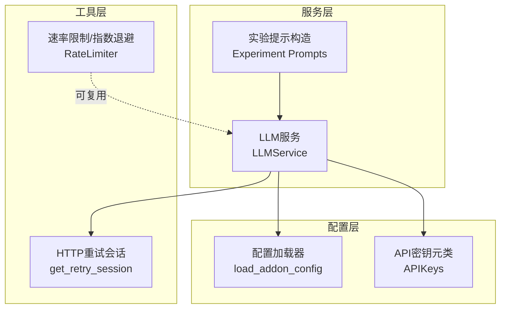
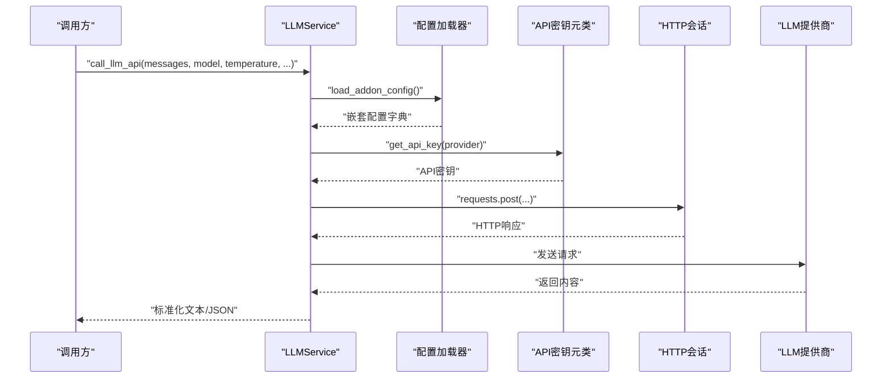
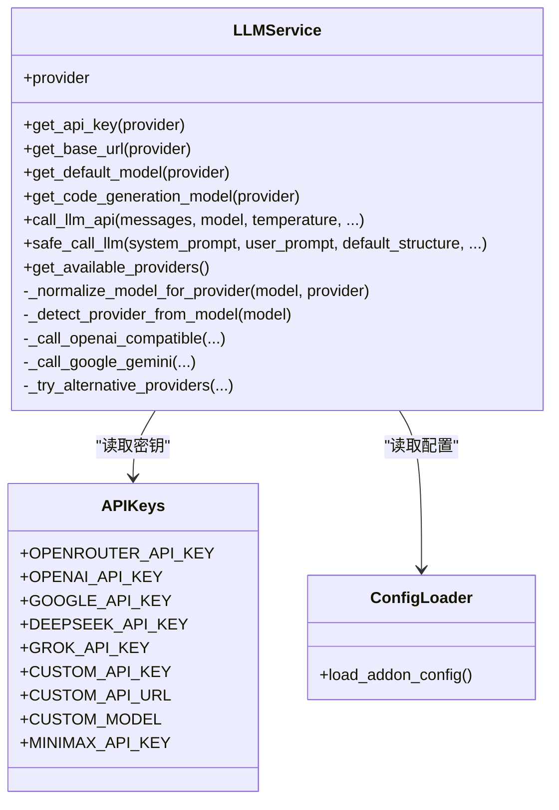
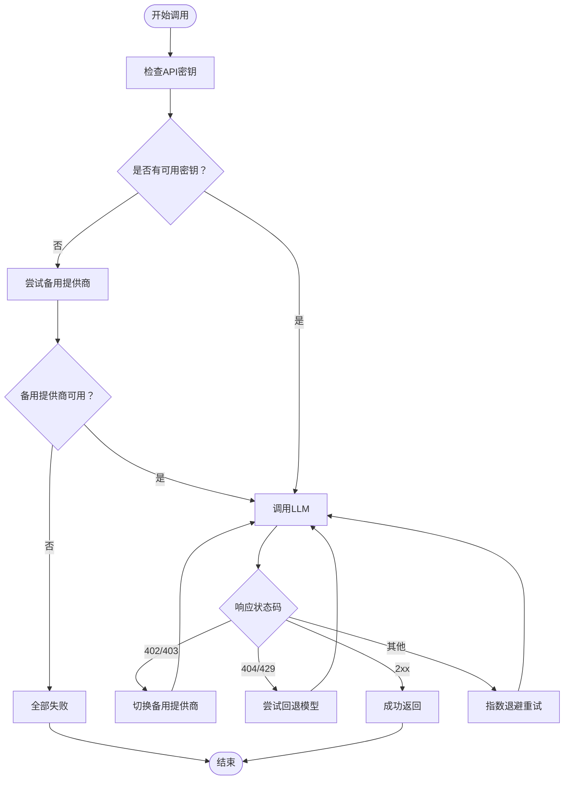
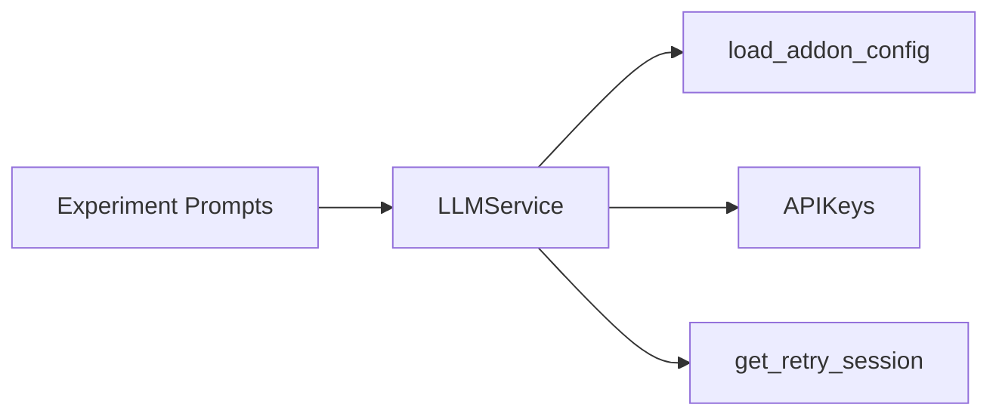

# LLM提供商插件开发

<cite>
**本文引用的文件**
- [llm.py](file://backend_api_python/app/services/llm.py)
- [api_keys.py](file://backend_api_python/app/config/api_keys.py)
- [config_loader.py](file://backend_api_python/app/utils/config_loader.py)
- [http.py](file://backend_api_python/app/utils/http.py)
- [prompts.py](file://backend_api_python/app/services/experiment/prompts.py)
- [rate_limiter.py](file://backend_api_python/app/data_sources/rate_limiter.py)
- [.env.example](file://.env.example)
</cite>

## 目录
1. [简介](#简介)
2. [项目结构](#项目结构)
3. [核心组件](#核心组件)
4. [架构总览](#架构总览)
5. [详细组件分析](#详细组件分析)
6. [依赖关系分析](#依赖关系分析)
7. [性能考虑](#性能考虑)
8. [故障排查指南](#故障排查指南)
9. [结论](#结论)
10. [附录](#附录)

## 简介
本指南面向希望为QuantDinger开发LLM提供商插件的开发者，系统阐述LLM服务抽象层的设计理念与实现方式，包括统一接口规范、响应格式标准化、API密钥管理、请求格式适配、响应解析、提示工程、上下文管理、流式响应处理、错误重试与多提供商负载均衡/故障转移策略。文档同时给出OpenAI、Anthropic、Google等主流LLM提供商的集成要点，并提供配置管理、成本控制与性能优化建议。

## 项目结构
QuantDinger后端以“服务-配置-工具”分层组织，LLM插件能力集中在LLM服务模块中，通过统一的配置加载器与API密钥元类进行集中管理，配合通用HTTP重试与速率限制工具，形成可扩展、可维护的LLM插件体系。

图示来源
- [llm.py:70-122](file://backend_api_python/app/services/llm.py#L70-L122)
- [config_loader.py:24-160](file://backend_api_python/app/utils/config_loader.py#L24-L160)
- [api_keys.py:54-141](file://backend_api_python/app/config/api_keys.py#L54-L141)
- [http.py:9-41](file://backend_api_python/app/utils/http.py#L9-L41)
- [prompts.py:16-64](file://backend_api_python/app/services/experiment/prompts.py#L16-L64)

章节来源
- [llm.py:1-629](file://backend_api_python/app/services/llm.py#L1-L629)
- [config_loader.py:1-251](file://backend_api_python/app/utils/config_loader.py#L1-L251)
- [api_keys.py:1-184](file://backend_api_python/app/config/api_keys.py#L1-L184)
- [http.py:1-42](file://backend_api_python/app/utils/http.py#L1-L42)
- [prompts.py:1-217](file://backend_api_python/app/services/experiment/prompts.py#L1-L217)

## 核心组件
- LLM服务抽象层：统一多提供商调用、模型名归一化、备用模型与备用提供商、错误处理与重试、安全JSON解析。
- 配置与密钥管理：集中于配置加载器与API密钥元类，支持环境变量与本地配置映射。
- 提示工程与上下文：实验管道中的系统提示、风险参数、市场周期与历史结果的结构化拼装。
- 错误重试与限流：基于指数退避与随机抖动的重试策略，以及请求间隔控制。

章节来源
- [llm.py:70-122](file://backend_api_python/app/services/llm.py#L70-L122)
- [config_loader.py:24-160](file://backend_api_python/app/utils/config_loader.py#L24-L160)
- [api_keys.py:54-141](file://backend_api_python/app/config/api_keys.py#L54-L141)
- [prompts.py:16-64](file://backend_api_python/app/services/experiment/prompts.py#L16-L64)

## 架构总览
下图展示LLM服务在调用链中的角色与依赖关系，以及与配置、密钥、HTTP会话的交互。

图示来源
- [llm.py:368-525](file://backend_api_python/app/services/llm.py#L368-L525)
- [config_loader.py:24-160](file://backend_api_python/app/utils/config_loader.py#L24-L160)
- [api_keys.py:54-141](file://backend_api_python/app/config/api_keys.py#L54-L141)
- [http.py:9-41](file://backend_api_python/app/utils/http.py#L9-L41)

## 详细组件分析

### LLM服务抽象层（LLMService）
- 统一接口与响应格式
  - 统一输入消息格式：OpenAI风格的role/content列表。
  - 统一输出格式：文本内容；对于JSON需求，服务内置JSON模式请求与安全解析。
- 多提供商支持
  - 支持OpenRouter、OpenAI、Google Gemini、DeepSeek、Grok、Custom、MiniMax。
  - 自动检测与优先级：按DeepSeek > Grok > MiniMax > OpenAI > Google > OpenRouter顺序尝试可用密钥。
- 模型名归一化
  - 对OpenRouter风格的“前缀/模型名”进行归一化，避免将OpenAI模型名发给其他提供商。
- 备用模型与备用提供商
  - 单提供商内：默认模型与回退模型自动尝试。
  - 跨提供商：当出现402/403等密钥相关错误时，按优先级切换其他提供商。
- 错误处理与重试
  - 对HTTP错误、请求异常、响应缺失进行分类处理与日志记录。
  - 对402/403/404/429等状态码进行可恢复性判断，必要时自动重试或切换。
- 安全JSON解析
  - 对LLM返回的JSON进行严格解析与回退提取，确保鲁棒性。

图示来源
- [llm.py:70-122](file://backend_api_python/app/services/llm.py#L70-L122)
- [llm.py:184-248](file://backend_api_python/app/services/llm.py#L184-L248)
- [llm.py:249-294](file://backend_api_python/app/services/llm.py#L249-L294)
- [llm.py:368-525](file://backend_api_python/app/services/llm.py#L368-L525)
- [llm.py:526-562](file://backend_api_python/app/services/llm.py#L526-L562)
- [api_keys.py:54-141](file://backend_api_python/app/config/api_keys.py#L54-L141)
- [config_loader.py:24-160](file://backend_api_python/app/utils/config_loader.py#L24-L160)

章节来源
- [llm.py:70-122](file://backend_api_python/app/services/llm.py#L70-L122)
- [llm.py:184-248](file://backend_api_python/app/services/llm.py#L184-L248)
- [llm.py:249-294](file://backend_api_python/app/services/llm.py#L249-L294)
- [llm.py:368-525](file://backend_api_python/app/services/llm.py#L368-L525)
- [llm.py:526-562](file://backend_api_python/app/services/llm.py#L526-L562)

### API密钥管理（APIKeys）
- 动态获取：优先从环境变量读取，其次从本地配置加载器读取。
- 支持提供商：OpenRouter、OpenAI、Google、DeepSeek、Grok、Custom、MiniMax。
- 旋转与多键：搜索模块中对多个密钥提供逗号分隔的轮换支持，可借鉴其设计思想扩展LLM密钥轮换。

章节来源
- [api_keys.py:54-141](file://backend_api_python/app/config/api_keys.py#L54-L141)

### 配置加载器（load_addon_config）
- 映射关系：将扁平的环境变量映射为嵌套配置字典，兼容旧版PHP风格。
- 支持字段：各提供商的API Key、Base URL、Model、Timeout、温度、最大Token等。
- 缓存机制：全局缓存避免重复解析，更新后可手动清理。

章节来源
- [config_loader.py:24-160](file://backend_api_python/app/utils/config_loader.py#L24-L160)
- [config_loader.py:163-215](file://backend_api_python/app/utils/config_loader.py#L163-L215)
- [config_loader.py:243-250](file://backend_api_python/app/utils/config_loader.py#L243-L250)

### HTTP重试与全局会话（get_retry_session）
- 重试策略：连接/读取/写入均支持重试，指数退避与固定因子控制等待时间。
- 状态码：针对500/502/503/504进行强制重试。
- 全局共享：提供全局会话实例，减少连接开销。

章节来源
- [http.py:9-41](file://backend_api_python/app/utils/http.py#L9-L41)

### 提示工程与上下文管理（Experiment Prompts）
- 系统提示：限定只返回有效JSON，禁止解释与Markdown围栏。
- 上下文拼装：指标参数、风险参数、市场周期特征、历史结果等结构化拼接。
- 结果解析：严格JSON解析与回退提取，规范化候选参数结构。

章节来源
- [prompts.py:16-64](file://backend_api_python/app/services/experiment/prompts.py#L16-L64)
- [prompts.py:120-149](file://backend_api_python/app/services/experiment/prompts.py#L120-L149)
- [prompts.py:152-185](file://backend_api_python/app/services/experiment/prompts.py#L152-L185)
- [prompts.py:188-217](file://backend_api_python/app/services/experiment/prompts.py#L188-L217)

### 流式响应处理
- 当前实现：LLM服务采用一次性请求/响应模式，未内置流式处理逻辑。
- 扩展建议：若需流式输出，可在底层HTTP会话中启用流式读取，并在上层逐段解析与转发；注意与现有JSON解析流程解耦。

章节来源
- [llm.py:184-248](file://backend_api_python/app/services/llm.py#L184-L248)
- [llm.py:249-294](file://backend_api_python/app/services/llm.py#L249-L294)

### 错误重试与多提供商故障转移
- 单提供商内重试：默认模型与回退模型自动尝试；对402/403/404/429进行可恢复性判断。
- 跨提供商切换：当出现402/403且当前提供商非显式指定时，按优先级尝试其他提供商。
- 重试策略：结合指数退避与随机抖动，降低并发重试导致的级联效应。

图示来源
- [llm.py:427-439](file://backend_api_python/app/services/llm.py#L427-L439)
- [llm.py:489-495](file://backend_api_python/app/services/llm.py#L489-L495)
- [llm.py:498-511](file://backend_api_python/app/services/llm.py#L498-L511)
- [llm.py:526-562](file://backend_api_python/app/services/llm.py#L526-L562)

章节来源
- [llm.py:427-439](file://backend_api_python/app/services/llm.py#L427-L439)
- [llm.py:489-495](file://backend_api_python/app/services/llm.py#L489-L495)
- [llm.py:498-511](file://backend_api_python/app/services/llm.py#L498-L511)
- [llm.py:526-562](file://backend_api_python/app/services/llm.py#L526-L562)

## 依赖关系分析
- LLMService依赖配置加载器与API密钥元类，确保运行时配置与密钥的动态获取。
- HTTP重试会话为LLM调用提供稳健的网络层保障。
- 提示工程模块依赖LLM服务进行参数生成与解析，形成闭环。

图示来源
- [llm.py:70-122](file://backend_api_python/app/services/llm.py#L70-L122)
- [config_loader.py:24-160](file://backend_api_python/app/utils/config_loader.py#L24-L160)
- [api_keys.py:54-141](file://backend_api_python/app/config/api_keys.py#L54-L141)
- [http.py:9-41](file://backend_api_python/app/utils/http.py#L9-L41)
- [prompts.py:16-64](file://backend_api_python/app/services/experiment/prompts.py#L16-L64)

章节来源
- [llm.py:70-122](file://backend_api_python/app/services/llm.py#L70-L122)
- [config_loader.py:24-160](file://backend_api_python/app/utils/config_loader.py#L24-L160)
- [api_keys.py:54-141](file://backend_api_python/app/config/api_keys.py#L54-L141)
- [http.py:9-41](file://backend_api_python/app/utils/http.py#L9-L41)
- [prompts.py:16-64](file://backend_api_python/app/services/experiment/prompts.py#L16-L64)

## 性能考虑
- 连接复用：使用全局HTTP会话减少TCP握手与TLS开销。
- 超时与背压：为不同提供商设置独立超时，避免长时间阻塞；结合速率限制器控制请求频率。
- 模型选择：优先使用默认模型，仅在失败时尝试回退模型；合理设置温度与最大Token，平衡质量与成本。
- 缓存与预热：对频繁访问的提示模板与上下文进行缓存，减少重复计算。

章节来源
- [http.py:9-41](file://backend_api_python/app/utils/http.py#L9-L41)
- [llm.py:452-453](file://backend_api_python/app/services/llm.py#L452-L453)
- [rate_limiter.py:109-164](file://backend_api_python/app/data_sources/rate_limiter.py#L109-L164)

## 故障排查指南
- API密钥问题
  - 症状：403/402错误或提示密钥未配置。
  - 处理：确认环境变量或本地配置中对应提供商的API Key已正确设置；检查提供商账户状态与配额。
- 模型不可用
  - 症状：404错误或模型名称不匹配。
  - 处理：使用提供商默认模型或回退模型；确保模型名与当前提供商匹配。
- 网络不稳定
  - 症状：超时或偶发失败。
  - 处理：启用HTTP重试与指数退避；适当增加超时时间；检查防火墙与代理。
- 解析失败
  - 症状：JSON解析异常。
  - 处理：检查LLM输出是否包含Markdown围栏；服务已内置回退提取逻辑，必要时人工校验输出。

章节来源
- [llm.py:210-238](file://backend_api_python/app/services/llm.py#L210-L238)
- [llm.py:489-495](file://backend_api_python/app/services/llm.py#L489-L495)
- [llm.py:512-517](file://backend_api_python/app/services/llm.py#L512-L517)
- [llm.py:592-611](file://backend_api_python/app/services/llm.py#L592-L611)

## 结论
QuantDinger的LLM插件体系通过统一的服务抽象层、完善的配置与密钥管理、稳健的错误重试与故障转移策略，实现了对多家LLM提供商的无缝接入。开发者可在此基础上快速扩展新提供商，同时遵循提示工程与上下文管理的最佳实践，确保输出质量与系统稳定性。

## 附录

### 开发新LLM提供商插件步骤
- 定义提供商枚举与默认配置
  - 在提供商枚举中新增条目，并在默认配置表中添加基础URL、默认模型与回退模型。
- 实现请求适配器
  - 若与OpenAI兼容，复用OpenAI兼容调用方法；否则实现专用调用器（如Google Gemini）。
- 集成密钥与配置
  - 在API密钥元类中添加对应键位；在配置加载器中映射环境变量。
- 注册与测试
  - 在LLM服务中注册新提供商；编写单元测试覆盖正常路径与错误路径。

章节来源
- [llm.py:19-67](file://backend_api_python/app/services/llm.py#L19-L67)
- [llm.py:184-248](file://backend_api_python/app/services/llm.py#L184-L248)
- [llm.py:249-294](file://backend_api_python/app/services/llm.py#L249-L294)
- [api_keys.py:104-131](file://backend_api_python/app/config/api_keys.py#L104-L131)
- [config_loader.py:60-104](file://backend_api_python/app/utils/config_loader.py#L60-L104)

### 主流LLM提供商集成要点
- OpenAI
  - 基础URL与模型：在配置中设置OpenAI Base URL与Model；可启用JSON模式。
- Anthropic（Claude）
  - 通过OpenRouter桥接：在OpenRouter中配置Anthropic模型，由OpenRouter转发。
- Google Gemini
  - 使用Google Generative Language API；消息格式需转换为contents/systemInstruction。
- 其他提供商
  - DeepSeek、Grok、MiniMax均可按OpenAI兼容方式接入；Custom支持自定义OpenAI兼容端点。

章节来源
- [llm.py:31-67](file://backend_api_python/app/services/llm.py#L31-L67)
- [llm.py:184-248](file://backend_api_python/app/services/llm.py#L184-L248)
- [llm.py:249-294](file://backend_api_python/app/services/llm.py#L249-L294)

### 配置管理与成本控制
- 配置项
  - LLM_PROVIDER：显式选择提供商。
  - 各提供商的API Key、Base URL、Model、Timeout等。
- 成本控制
  - 限制最大Token与温度；优先使用默认模型；对高频调用设置速率限制与重试上限。

章节来源
- [config_loader.py:60-104](file://backend_api_python/app/utils/config_loader.py#L60-L104)
- [llm.py:452-453](file://backend_api_python/app/services/llm.py#L452-L453)
- [rate_limiter.py:109-164](file://backend_api_python/app/data_sources/rate_limiter.py#L109-L164)

### 环境变量与本地配置
- 环境变量示例（根目录）
  - 项目根.env示例文件用于Docker/Compose覆盖，后端容器运行时的密钥与配置主要来自后端容器内的.env。
- 后端容器.env
  - 包含各提供商API Key、Base URL、Model、Timeout等键位映射。

章节来源
- [.env.example:1-26](file://.env.example#L1-L26)
- [config_loader.py:60-104](file://backend_api_python/app/utils/config_loader.py#L60-L104)