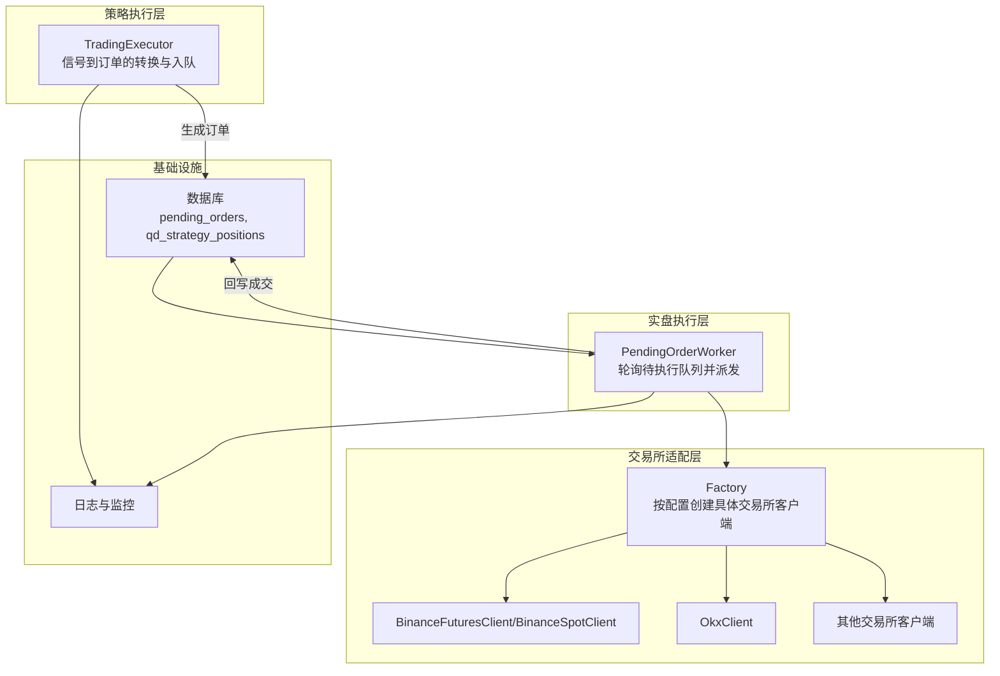
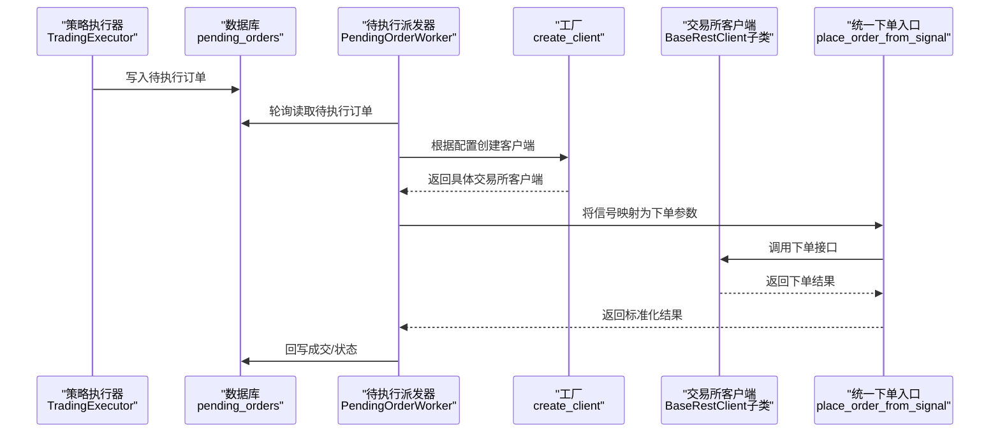
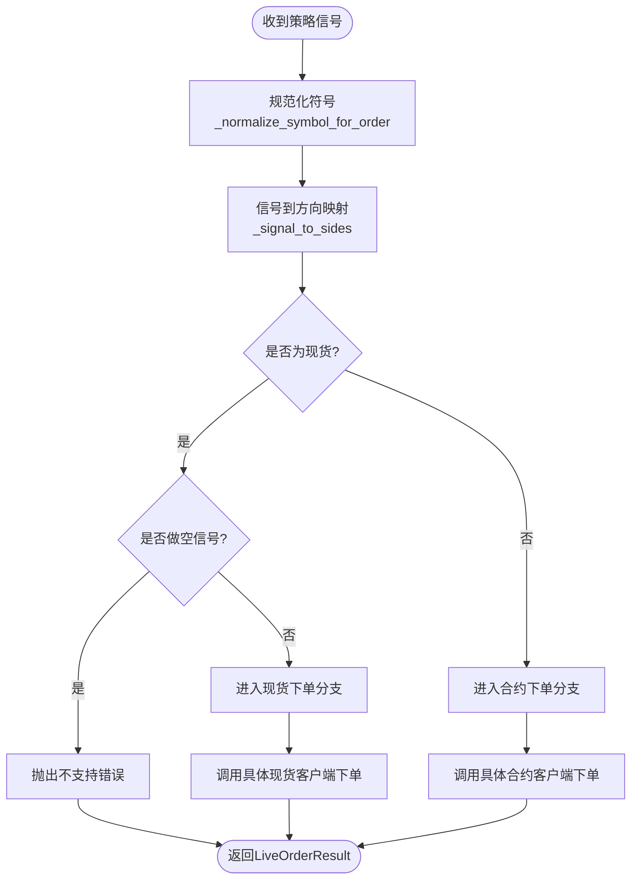
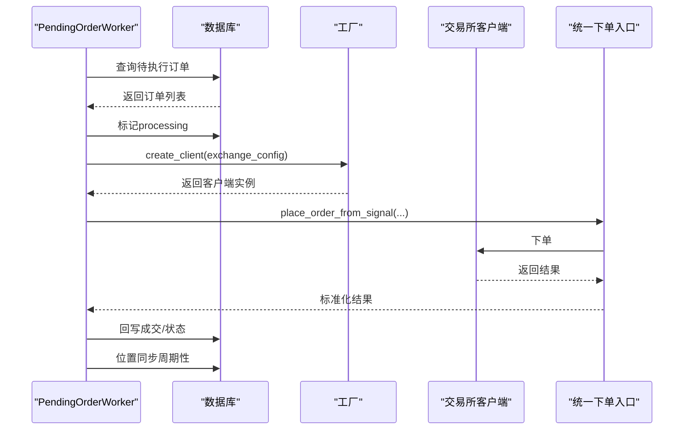
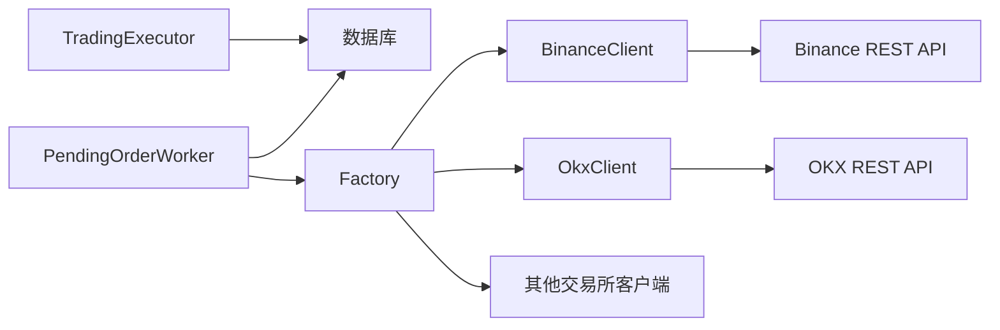

# 执行器插件开发

<cite>
**本文档引用的文件**
- [base.py](file://backend_api_python/app/services/live_trading/base.py)
- [execution.py](file://backend_api_python/app/services/live_trading/execution.py)
- [binance.py](file://backend_api_python/app/services/live_trading/binance.py)
- [binance_spot.py](file://backend_api_python/app/services/live_trading/binance_spot.py)
- [okx.py](file://backend_api_python/app/services/live_trading/okx.py)
- [factory.py](file://backend_api_python/app/services/live_trading/factory.py)
- [pending_order_worker.py](file://backend_api_python/app/services/pending_order_worker.py)
- [trading_executor.py](file://backend_api_python/app/services/trading_executor.py)
</cite>

## 目录
1. [简介](#简介)
2. [项目结构](#项目结构)
3. [核心组件](#核心组件)
4. [架构总览](#架构总览)
5. [详细组件分析](#详细组件分析)
6. [依赖分析](#依赖分析)
7. [性能考虑](#性能考虑)
8. [故障排查指南](#故障排查指南)
9. [结论](#结论)
10. [附录](#附录)

## 简介
本指南面向QuantDinger执行器插件开发者，系统阐述如何基于现有框架实现“抽象基类 + 交易所适配器 + 统一执行器”的可扩展交易执行体系。文档覆盖以下主题：
- BaseExecutionClient抽象基类的设计与实现要点（订单提交、取消、查询）
- 执行器插件架构：资金管理、风险控制、订单路由
- 中心化与去中心化交易所的差异化实现策略
- 订单执行流程、手续费计算、滑点处理与流动性管理
- 测试框架、模拟交易环境与性能监控方法

## 项目结构
QuantDinger后端采用“策略执行层 + 实盘执行层 + 交易所适配层”的分层设计：
- 策略执行层：负责信号生成与订单入队，典型实现为TradingExecutor
- 实盘执行层：负责从待执行队列取出订单并调用具体交易所客户端下单，典型实现为PendingOrderWorker
- 交易所适配层：针对不同交易所实现具体的REST客户端，统一封装下单、查询、手续费等能力

图表来源
- [trading_executor.py:395-456](file://backend_api_python/app/services/trading_executor.py#L395-L456)
- [pending_order_worker.py:91-122](file://backend_api_python/app/services/pending_order_worker.py#L91-L122)
- [factory.py:126-285](file://backend_api_python/app/services/live_trading/factory.py#L126-L285)

章节来源
- [trading_executor.py:395-456](file://backend_api_python/app/services/trading_executor.py#L395-L456)
- [pending_order_worker.py:91-122](file://backend_api_python/app/services/pending_order_worker.py#L91-L122)
- [factory.py:126-285](file://backend_api_python/app/services/live_trading/factory.py#L126-L285)

## 核心组件
本节聚焦于执行器插件的核心抽象与关键实现。

- BaseRestClient（抽象基类）
  - 提供统一的HTTP请求封装、签名与错误处理
  - 提供标准化的下单、查询、手续费查询接口占位
  - 通过子类实现具体交易所的下单细节与精度校验

- 交易所客户端（以Binance、OKX为例）
  - 实现下单前的精度归一化、最小下单量校验、时间对齐、签名与请求头设置
  - 提供订单查询、等待成交、手续费回填等能力

- 统一下单入口
  - 将策略信号映射为具体交易所的下单参数，并根据交易所差异进行适配
  - 支持现货与永续（合约）两种市场类型

- 待执行队列与派发
  - PendingOrderWorker周期性从数据库读取待执行订单，标记处理并调用对应客户端下单
  - 支持位置同步与自修复，避免“幽灵持仓”

章节来源
- [base.py:95-167](file://backend_api_python/app/services/live_trading/base.py#L95-L167)
- [binance.py:24-120](file://backend_api_python/app/services/live_trading/binance.py#L24-L120)
- [okx.py:25-120](file://backend_api_python/app/services/live_trading/okx.py#L25-L120)
- [execution.py:123-311](file://backend_api_python/app/services/live_trading/execution.py#L123-L311)
- [pending_order_worker.py:52-98](file://backend_api_python/app/services/pending_order_worker.py#L52-L98)

## 架构总览
下图展示从策略信号到交易所下单的完整链路，以及关键的错误处理与回写逻辑：

图表来源
- [trading_executor.py:3178-3211](file://backend_api_python/app/services/trading_executor.py#L3178-L3211)
- [pending_order_worker.py:99-122](file://backend_api_python/app/services/pending_order_worker.py#L99-L122)
- [execution.py:123-311](file://backend_api_python/app/services/live_trading/execution.py#L123-L311)
- [factory.py:126-285](file://backend_api_python/app/services/live_trading/factory.py#L126-L285)

## 详细组件分析

### 抽象基类 BaseRestClient 设计与实现要求
- 职责边界
  - 统一HTTP请求封装：超时、重试、SSL验证、请求头与签名
  - 提供标准化接口占位：下单、查询、手续费查询、账户信息等
  - 保持轻量化，避免引入第三方依赖

- 关键实现要点
  - 请求签名与时间对齐：不同交易所采用不同的签名算法与时间偏移校正
  - 精度与步进校验：下单数量与价格必须满足交易所过滤器要求
  - 错误分类与重试：区分网络错误、鉴权错误、业务错误并采取相应策略
  - 日志与安全：敏感信息不落盘，错误提示中避免泄露密钥

- 接口建议
  - place_market_order / place_limit_order
  - get_order / cancel_order
  - wait_for_fill（等待成交并回填手续费）
  - get_fee_rate / get_fee_for_order（手续费查询与回填）

章节来源
- [base.py:95-167](file://backend_api_python/app/services/live_trading/base.py#L95-L167)

### 交易所客户端实现模式（以Binance与OKX为例）
- Binance系列
  - 精度归一化：通过exchangeInfo过滤器获取步进与精度，使用Decimal量化
  - 时间对齐：通过服务器时间接口校正本地时间偏差，避免-1021错误
  - 最小下单量校验：结合markPrice与最小notional进行最佳努力校验
  - 手续费回填：优先从fills回查，失败时使用费率估算

- OKX系列
  - 仪器元数据缓存：instrument与account config缓存减少重复请求
  - 杠杆设置缓存：避免频繁set-leverage请求
  - 位置模式兼容：net_mode与long_short_mode下的posSide处理
  - 签名与请求路径：严格保证签名字符串与实际请求路径一致

章节来源
- [binance.py:24-120](file://backend_api_python/app/services/live_trading/binance.py#L24-L120)
- [binance.py:363-427](file://backend_api_python/app/services/live_trading/binance.py#L363-L427)
- [binance.py:462-506](file://backend_api_python/app/services/live_trading/binance.py#L462-L506)
- [binance.py:735-839](file://backend_api_python/app/services/live_trading/binance.py#L735-L839)
- [okx.py:25-120](file://backend_api_python/app/services/live_trading/okx.py#L25-L120)
- [okx.py:198-283](file://backend_api_python/app/services/live_trading/okx.py#L198-L283)
- [okx.py:428-442](file://backend_api_python/app/services/live_trading/okx.py#L428-L442)
- [okx.py:570-636](file://backend_api_python/app/services/live_trading/okx.py#L570-L636)

### 统一下单入口与信号映射
- 信号到方向映射：open_long/add_long → buy，close_long/reduce_long → sell
- 符号规范化：统一处理裸符号、冒号后缀、quote货币识别
- 市场类型适配：swap/perp映射为swap，spot不支持做空
- 交易所差异化处理：根据交易所API差异设置pos_side、td_mode、reduce_only等参数

图表来源
- [execution.py:41-101](file://backend_api_python/app/services/live_trading/execution.py#L41-L101)
- [execution.py:123-311](file://backend_api_python/app/services/live_trading/execution.py#L123-L311)

章节来源
- [execution.py:41-101](file://backend_api_python/app/services/live_trading/execution.py#L41-L101)
- [execution.py:123-311](file://backend_api_python/app/services/live_trading/execution.py#L123-L311)

### 待执行队列与派发机制
- 队列管理：轮询pending_orders，批量读取并标记processing
- 冲刺回收：对长时间处于processing的订单进行重新入队
- 位置同步：定期与交易所对账，自动删除“幽灵持仓”并更新本地记录
- 自动停机：遇到致命鉴权/权限错误时自动停止策略

图表来源
- [pending_order_worker.py:99-122](file://backend_api_python/app/services/pending_order_worker.py#L99-L122)
- [pending_order_worker.py:138-751](file://backend_api_python/app/services/pending_order_worker.py#L138-L751)
- [factory.py:126-285](file://backend_api_python/app/services/live_trading/factory.py#L126-L285)
- [execution.py:123-311](file://backend_api_python/app/services/live_trading/execution.py#L123-L311)

章节来源
- [pending_order_worker.py:99-122](file://backend_api_python/app/services/pending_order_worker.py#L99-L122)
- [pending_order_worker.py:138-751](file://backend_api_python/app/services/pending_order_worker.py#L138-L751)

### 资金管理、风险控制与订单路由
- 资金管理
  - 通过get_account或账户余额接口获取可用资金
  - 结合get_fee_rate与wait_for_fill回填的手续费，计算真实成本
  - 在合约场景下，结合leverage与ctVal进行名义金额与基础数量的换算

- 风险控制
  - 止损止盈：在脚本层生成订单时设定止盈止损参数，由策略上下文维护
  - 止损触发：通过脚本订单序列生成close/reduce信号，交由执行器处理
  - 杠杆与保证金：通过set_leverage与账户配置缓存降低重复请求

- 订单路由
  - 通过exchange_config选择目标交易所与市场类型
  - 支持多交易所并行：同一策略可配置多个symbol_list，分别路由至不同交易所

章节来源
- [binance.py:428-531](file://backend_api_python/app/services/live_trading/binance.py#L428-L531)
- [okx.py:422-538](file://backend_api_python/app/services/live_trading/okx.py#L422-L538)
- [trading_executor.py:513-546](file://backend_api_python/app/services/trading_executor.py#L513-L546)
- [trading_executor.py:615-732](file://backend_api_python/app/services/trading_executor.py#L615-L732)

### 订单执行流程、手续费计算、滑点处理与流动性管理
- 订单执行流程
  - 策略生成脚本订单 → TradingExecutor转换为执行信号 → 入队pending_orders
  - PendingOrderWorker派发 → 工厂创建客户端 → 统一下单入口 → 交易所下单
  - wait_for_fill轮询成交与手续费 → 回写成交记录

- 手续费计算
  - 优先从fills回查commission与commissionAsset
  - 失败时使用get_fee_rate乘以成交额估算
  - 对于Binance Spot，使用tradeFee接口；Binance Futures使用commissionRate接口

- 滑点处理
  - 市价单：通过wait_for_fill获取avg_price，作为最终成交均价
  - 限价单：严格按限价成交，必要时在脚本层进行价格缓冲

- 流动性管理
  - 通过get_symbol_filters与get_instrument获取最小下单量与步进
  - 在合约场景下，结合markPrice与MIN_NOTIONAL进行最佳努力校验
  - 位置同步避免“幽灵持仓”，减少重复下单造成的流动性压力

章节来源
- [binance.py:462-506](file://backend_api_python/app/services/live_trading/binance.py#L462-L506)
- [binance.py:686-734](file://backend_api_python/app/services/live_trading/binance.py#L686-L734)
- [binance_spot.py:553-584](file://backend_api_python/app/services/live_trading/binance_spot.py#L553-L584)
- [okx.py:737-839](file://backend_api_python/app/services/live_trading/okx.py#L737-L839)

### 测试框架、模拟交易环境与性能监控
- 测试框架
  - 使用pytest与conftest进行集成测试
  - 可通过exchange_config启用demo模式（如enable_demo_trading）进行模拟下单
  - 提供query_fee_rate快速查询费率，辅助测试

- 模拟交易环境
  - 通过工厂函数的demo模式开关，自动切换到测试网或沙盒地址
  - 交易所客户端内部支持模拟交易（如OKX simulated_trading、Binance demo）

- 性能监控
  - PendingOrderWorker支持位置同步间隔与自检开关
  - TradingExecutor内置线程上限与资源状态打印，便于定位线程耗尽问题
  - 建议在生产环境设置合适的轮询间隔与批大小，避免数据库压力

章节来源
- [factory.py:87-120](file://backend_api_python/app/services/live_trading/factory.py#L87-L120)
- [factory.py:126-285](file://backend_api_python/app/services/live_trading/factory.py#L126-L285)
- [pending_order_worker.py:52-98](file://backend_api_python/app/services/pending_order_worker.py#L52-L98)
- [trading_executor.py:40-70](file://backend_api_python/app/services/trading_executor.py#L40-L70)

## 依赖分析
- 组件耦合
  - TradingExecutor与PendingOrderWorker通过数据库解耦，降低耦合度
  - 工厂模式隔离了交易所客户端的创建与配置解析
  - 统一下单入口集中处理信号映射与交易所差异

- 外部依赖
  - HTTP请求：requests（BaseRestClient）
  - 交易所SDK：部分客户端依赖特定SDK（如IBKR、MT5）
  - 数据库：PostgreSQL（用于策略配置、待执行订单、位置记录）

图表来源
- [trading_executor.py:395-456](file://backend_api_python/app/services/trading_executor.py#L395-L456)
- [pending_order_worker.py:99-122](file://backend_api_python/app/services/pending_order_worker.py#L99-L122)
- [factory.py:126-285](file://backend_api_python/app/services/live_trading/factory.py#L126-L285)

章节来源
- [factory.py:126-285](file://backend_api_python/app/services/live_trading/factory.py#L126-L285)

## 性能考虑
- 轮询与批处理
  - PendingOrderWorker支持批大小与轮询间隔配置，避免高频查询
  - 建议根据订单量动态调整batch_size与poll_interval_sec

- 缓存策略
  - 交易所客户端广泛使用缓存（如instrument、account config、leverage）
  - 建议在自定义客户端中复用此类缓存模式，减少API调用

- 线程与资源
  - TradingExecutor限制最大线程数，避免OOM
  - 建议在高并发场景下增加STRATEGY_MAX_THREADS并监控资源使用

- 数据库负载
  - 位置同步可配置开关与间隔，避免频繁对账
  - 建议对pending_orders建立合适索引，提升查询性能

## 故障排查指南
- 常见错误与处理
  - 鉴权失败：HTTP 401/403，检查API Key/Secret/Passphrase与权限
  - 时间偏差：-1021错误，检查服务器时间同步
  - 最小下单量/精度：-1111/-2015错误，检查stepSize与minQty
  - 权限不足：某些交易所需要额外开通“交易”权限

- 自动停机与告警
  - PendingOrderWorker检测致命错误时自动停止策略，避免无限重试
  - 建议在UI中展示策略日志，便于定位问题

章节来源
- [binance.py:208-236](file://backend_api_python/app/services/live_trading/binance.py#L208-L236)
- [binance_spot.py:218-249](file://backend_api_python/app/services/live_trading/binance_spot.py#L218-L249)
- [okx.py:356-403](file://backend_api_python/app/services/live_trading/okx.py#L356-L403)
- [pending_order_worker.py:268-298](file://backend_api_python/app/services/pending_order_worker.py#L268-L298)
- [pending_order_worker.py:713-748](file://backend_api_python/app/services/pending_order_worker.py#L713-L748)

## 结论
QuantDinger的执行器插件体系通过“抽象基类 + 工厂 + 统一下单入口 + 待执行队列”的组合，实现了对多交易所、多市场的统一接入。开发者只需遵循BaseRestClient的接口规范，实现各自交易所的精度校验、签名与下单细节，即可无缝接入整个执行链路。配合完善的缓存、错误处理与位置同步机制，可在保证稳定性的同时获得良好的性能表现。

## 附录
- 开发步骤建议
  1) 继承BaseRestClient，实现签名、精度校验、下单与查询接口
  2) 在factory.py中注册新交易所的创建逻辑
  3) 在execution.py中补充信号到下单参数的映射
  4) 编写单元测试与集成测试，启用demo模式进行验证
  5) 在生产环境部署时，合理配置轮询间隔、批大小与缓存策略

- 参考实现
  - Binance Futures/Sport客户端：[binance.py:24-120](file://backend_api_python/app/services/live_trading/binance.py#L24-L120)、[binance_spot.py:21-120](file://backend_api_python/app/services/live_trading/binance_spot.py#L21-L120)
  - OKX客户端：[okx.py:25-120](file://backend_api_python/app/services/live_trading/okx.py#L25-L120)
  - 工厂与配置：[factory.py:126-285](file://backend_api_python/app/services/live_trading/factory.py#L126-L285)
  - 统一下单入口：[execution.py:123-311](file://backend_api_python/app/services/live_trading/execution.py#L123-L311)
  - 待执行队列与派发：[pending_order_worker.py:99-122](file://backend_api_python/app/services/pending_order_worker.py#L99-L122)
  - 策略执行器（信号到订单）：[trading_executor.py:3178-3211](file://backend_api_python/app/services/trading_executor.py#L3178-L3211)