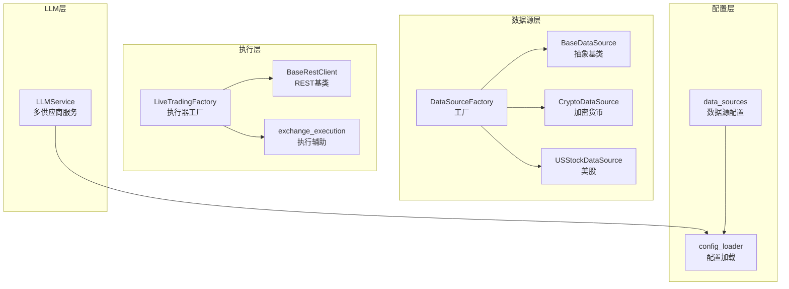
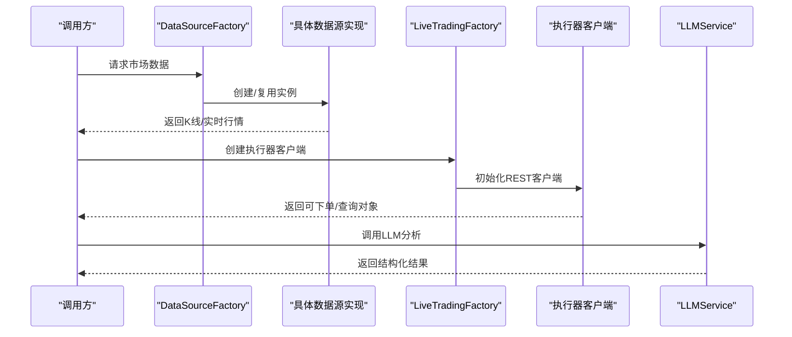
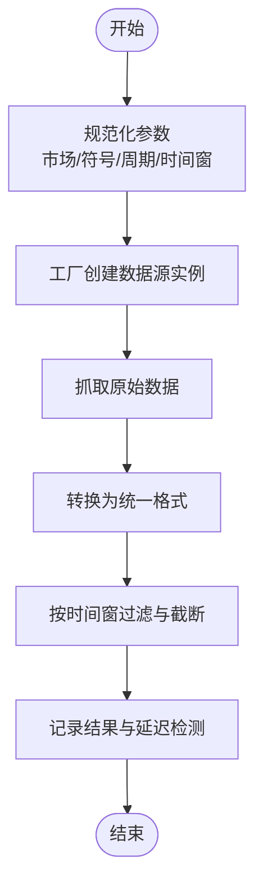
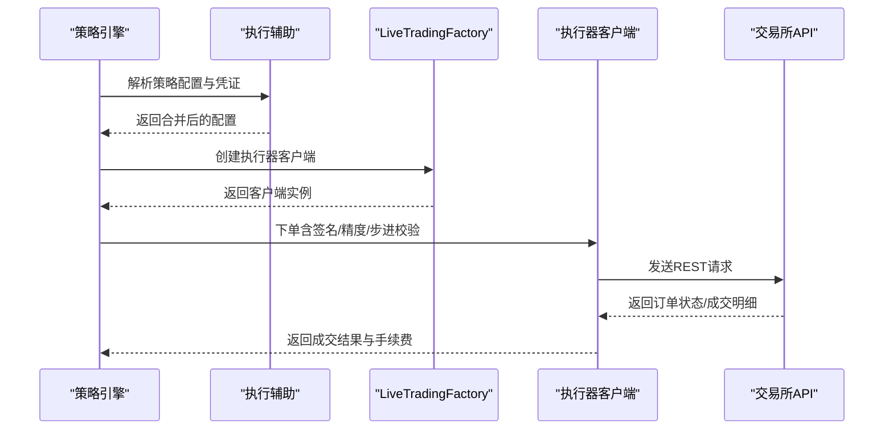
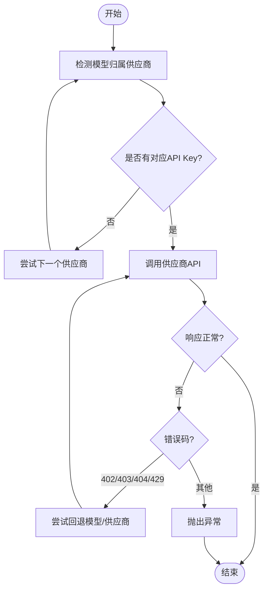
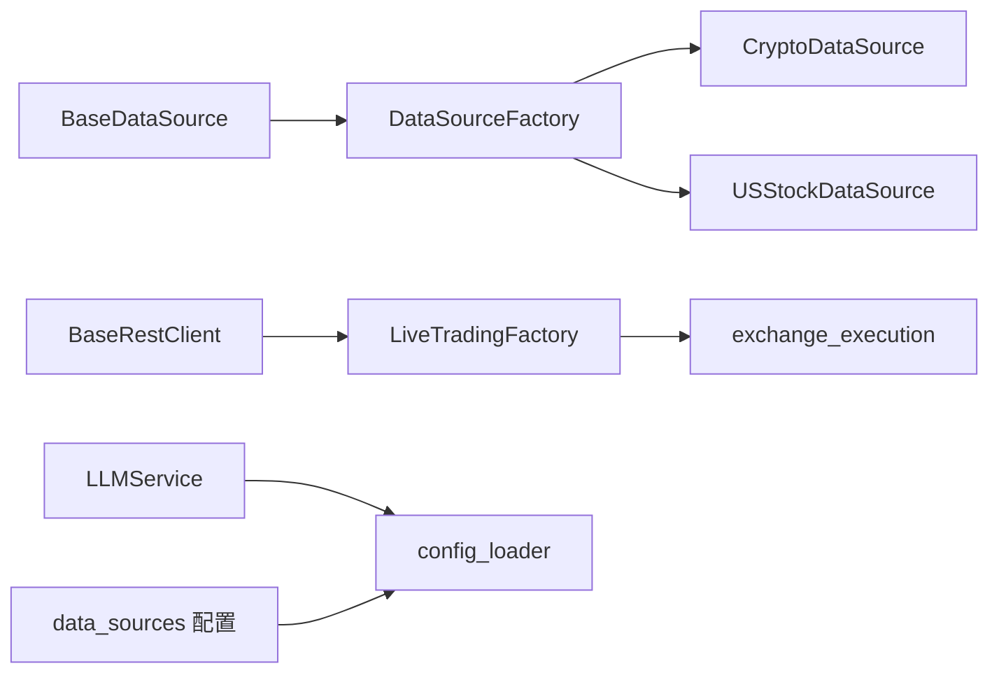

# 插件开发

<cite>
**本文引用的文件**
- [backend_api_python/app/data_sources/base.py](file://backend_api_python/app/data_sources/base.py)
- [backend_api_python/app/data_sources/factory.py](file://backend_api_python/app/data_sources/factory.py)
- [backend_api_python/app/config/data_sources.py](file://backend_api_python/app/config/data_sources.py)
- [backend_api_python/app/data_sources/crypto.py](file://backend_api_python/app/data_sources/crypto.py)
- [backend_api_python/app/data_sources/us_stock.py](file://backend_api_python/app/data_sources/us_stock.py)
- [backend_api_python/app/services/live_trading/base.py](file://backend_api_python/app/services/live_trading/base.py)
- [backend_api_python/app/services/live_trading/factory.py](file://backend_api_python/app/services/live_trading/factory.py)
- [backend_api_python/app/services/exchange_execution.py](file://backend_api_python/app/services/exchange_execution.py)
- [backend_api_python/app/services/llm.py](file://backend_api_python/app/services/llm.py)
- [backend_api_python/app/utils/config_loader.py](file://backend_api_python/app/utils/config_loader.py)
</cite>

## 目录
1. [简介](#简介)
2. [项目结构](#项目结构)
3. [核心组件](#核心组件)
4. [架构总览](#架构总览)
5. [详细组件分析](#详细组件分析)
6. [依赖分析](#依赖分析)
7. [性能考虑](#性能考虑)
8. [故障排查指南](#故障排查指南)
9. [结论](#结论)
10. [附录](#附录)

## 简介
本指南面向希望在 QuantDinger 中开发“插件”的开发者，系统性讲解插件系统的架构设计、扩展点识别与实现路径，涵盖三类插件：
- 数据源插件：负责市场数据获取、实时行情与历史数据存储
- 执行器插件：负责订单执行、资金管理与风险控制
- LLM 提供商插件：负责多模型、多供应商的统一调用与回退策略

文档同时给出接口规范、抽象基类定义、注册机制、生命周期管理与依赖注入方式，并提供测试方法、调试技巧与性能优化建议。

## 项目结构
QuantDinger 的后端以模块化组织，插件能力主要分布在以下子系统：
- 数据源层：统一抽象与工厂，屏蔽具体交易所/服务商差异
- 执行层：REST 客户端基类与执行辅助工具
- LLM 层：多供应商统一接入与回退策略
- 配置层：集中式配置加载与环境变量映射

图表来源
- [backend_api_python/app/data_sources/base.py:28-180](file://backend_api_python/app/data_sources/base.py#L28-L180)
- [backend_api_python/app/data_sources/factory.py:33-178](file://backend_api_python/app/data_sources/factory.py#L33-L178)
- [backend_api_python/app/data_sources/crypto.py:16-428](file://backend_api_python/app/data_sources/crypto.py#L16-L428)
- [backend_api_python/app/data_sources/us_stock.py:17-361](file://backend_api_python/app/data_sources/us_stock.py#L17-L361)
- [backend_api_python/app/services/live_trading/base.py:95-168](file://backend_api_python/app/services/live_trading/base.py#L95-L168)
- [backend_api_python/app/services/live_trading/factory.py:126-286](file://backend_api_python/app/services/live_trading/factory.py#L126-L286)
- [backend_api_python/app/services/exchange_execution.py:59-150](file://backend_api_python/app/services/exchange_execution.py#L59-L150)
- [backend_api_python/app/services/llm.py:70-122](file://backend_api_python/app/services/llm.py#L70-L122)
- [backend_api_python/app/utils/config_loader.py:24-161](file://backend_api_python/app/utils/config_loader.py#L24-L161)
- [backend_api_python/app/config/data_sources.py:26-173](file://backend_api_python/app/config/data_sources.py#L26-L173)

章节来源
- [backend_api_python/app/data_sources/base.py:28-180](file://backend_api_python/app/data_sources/base.py#L28-L180)
- [backend_api_python/app/data_sources/factory.py:33-178](file://backend_api_python/app/data_sources/factory.py#L33-L178)
- [backend_api_python/app/services/live_trading/base.py:95-168](file://backend_api_python/app/services/live_trading/base.py#L95-L168)
- [backend_api_python/app/services/live_trading/factory.py:126-286](file://backend_api_python/app/services/live_trading/factory.py#L126-L286)
- [backend_api_python/app/services/llm.py:70-122](file://backend_api_python/app/services/llm.py#L70-L122)
- [backend_api_python/app/utils/config_loader.py:24-161](file://backend_api_python/app/utils/config_loader.py#L24-L161)
- [backend_api_python/app/config/data_sources.py:26-173](file://backend_api_python/app/config/data_sources.py#L26-L173)

## 核心组件
本节聚焦三类插件的核心抽象与实现要点，帮助你快速定位扩展点。

- 数据源插件
  - 抽象基类：统一 K 线与实时行情接口，提供过滤、限制、格式化与延迟检测等通用能力
  - 工厂：根据市场类型返回对应数据源实例，支持别名归一化与向后兼容
  - 配置：通过元类配置加载器读取超时、重试、代理等参数
  - 示例实现：加密货币（CCXT）、美股（yfinance/finnhub）

- 执行器插件
  - REST 基类：封装请求签名、证书校验、错误处理与超时控制
  - 工厂：按交易所/市场类型创建客户端，支持模拟/沙盒模式切换
  - 执行辅助：安全加载策略配置、凭证解密、日志脱敏与费用查询

- LLM 提供商插件
  - 统一服务：OpenRouter/OpenAI/Google/DeepSeek/Grok/Custom/MiniMax 多供应商接入
  - 模型归一化：自动检测模型归属供应商并做名称转换
  - 回退策略：API 错误码与配额/余额问题时自动切换供应商或模型

章节来源
- [backend_api_python/app/data_sources/base.py:28-180](file://backend_api_python/app/data_sources/base.py#L28-L180)
- [backend_api_python/app/data_sources/factory.py:33-178](file://backend_api_python/app/data_sources/factory.py#L33-L178)
- [backend_api_python/app/config/data_sources.py:26-173](file://backend_api_python/app/config/data_sources.py#L26-L173)
- [backend_api_python/app/data_sources/crypto.py:16-428](file://backend_api_python/app/data_sources/crypto.py#L16-L428)
- [backend_api_python/app/data_sources/us_stock.py:17-361](file://backend_api_python/app/data_sources/us_stock.py#L17-L361)
- [backend_api_python/app/services/live_trading/base.py:95-168](file://backend_api_python/app/services/live_trading/base.py#L95-L168)
- [backend_api_python/app/services/live_trading/factory.py:126-286](file://backend_api_python/app/services/live_trading/factory.py#L126-L286)
- [backend_api_python/app/services/exchange_execution.py:59-150](file://backend_api_python/app/services/exchange_execution.py#L59-L150)
- [backend_api_python/app/services/llm.py:70-122](file://backend_api_python/app/services/llm.py#L70-L122)

## 架构总览
下图展示插件体系的整体交互：调用方通过工厂/服务选择具体插件，插件读取配置并通过网络或本地库访问外部系统，最终返回标准化数据。

图表来源
- [backend_api_python/app/data_sources/factory.py:52-112](file://backend_api_python/app/data_sources/factory.py#L52-L112)
- [backend_api_python/app/data_sources/crypto.py:16-428](file://backend_api_python/app/data_sources/crypto.py#L16-L428)
- [backend_api_python/app/data_sources/us_stock.py:17-361](file://backend_api_python/app/data_sources/us_stock.py#L17-L361)
- [backend_api_python/app/services/live_trading/factory.py:126-286](file://backend_api_python/app/services/live_trading/factory.py#L126-L286)
- [backend_api_python/app/services/llm.py:368-525](file://backend_api_python/app/services/llm.py#L368-L525)

## 详细组件分析

### 数据源插件开发指南
- 接口规范与抽象基类
  - 必须实现：获取 K 线、可选实现：获取实时行情
  - 建议实现：数据格式化、时间范围计算、过滤与截断、延迟检测
  - 参考路径：[BaseDataSource:28-180](file://backend_api_python/app/data_sources/base.py#L28-L180)

- 工厂与注册机制
  - 工厂根据市场类型返回对应数据源实例，支持别名归一化
  - 新增市场类型时，在工厂中添加映射与异常处理
  - 参考路径：[DataSourceFactory:33-178](file://backend_api_python/app/data_sources/factory.py#L33-L178)

- 配置与依赖注入
  - 通过配置加载器读取超时、重试、代理等参数
  - 示例：CCXT 配置、YFinance 配置、Finnhub 配置
  - 参考路径：[config_loader:24-161](file://backend_api_python/app/utils/config_loader.py#L24-L161)、[data_sources 配置:26-173](file://backend_api_python/app/config/data_sources.py#L26-L173)

- 开发步骤
  1) 继承抽象基类，实现 get_kline 与可选 get_ticker
  2) 在工厂中注册新市场类型映射
  3) 在配置模块中添加相关配置项
  4) 单元测试：构造边界场景（空数据、时间越界、过滤截断）
  5) 集成测试：与策略引擎对接，验证回测窗口一致性

- 关键流程图：K线获取与过滤

图表来源
- [backend_api_python/app/data_sources/base.py:106-140](file://backend_api_python/app/data_sources/base.py#L106-L140)
- [backend_api_python/app/data_sources/factory.py:114-149](file://backend_api_python/app/data_sources/factory.py#L114-L149)

章节来源
- [backend_api_python/app/data_sources/base.py:28-180](file://backend_api_python/app/data_sources/base.py#L28-L180)
- [backend_api_python/app/data_sources/factory.py:33-178](file://backend_api_python/app/data_sources/factory.py#L33-L178)
- [backend_api_python/app/config/data_sources.py:26-173](file://backend_api_python/app/config/data_sources.py#L26-L173)
- [backend_api_python/app/utils/config_loader.py:24-161](file://backend_api_python/app/utils/config_loader.py#L24-L161)

### 执行器插件开发指南
- 接口规范与抽象基类
  - 统一封装 REST 请求、签名、证书校验、错误处理与超时
  - 建议实现：订单查询、成交明细、手续费估算、杠杆设置、仓位模式
  - 参考路径：[BaseRestClient:95-168](file://backend_api_python/app/services/live_trading/base.py#L95-L168)

- 工厂与注册机制
  - 工厂根据 exchange_id 与市场类型创建对应客户端
  - 支持模拟/沙盒模式、代理、证书路径等环境配置
  - 参考路径：[LiveTradingFactory:126-286](file://backend_api_python/app/services/live_trading/factory.py#L126-L286)

- 生命周期与依赖注入
  - 客户端初始化时读取环境变量与配置，连接/鉴权在首次调用或显式 connect
  - 执行辅助模块负责策略配置加载、凭证解密与日志脱敏
  - 参考路径：[exchange_execution:59-150](file://backend_api_python/app/services/exchange_execution.py#L59-L150)

- 开发步骤
  1) 继承 REST 基类，实现必要的签名与请求方法
  2) 在工厂中注册 exchange_id 与构造逻辑
  3) 实现订单提交、查询、手续费估算等核心功能
  4) 单元测试：模拟网络错误、签名错误、限流与超时
  5) 集成测试：与策略引擎对接，验证信号到订单的闭环

- 序列图：下单流程（示例）

图表来源
- [backend_api_python/app/services/exchange_execution.py:59-150](file://backend_api_python/app/services/exchange_execution.py#L59-L150)
- [backend_api_python/app/services/live_trading/factory.py:126-286](file://backend_api_python/app/services/live_trading/factory.py#L126-L286)
- [backend_api_python/app/services/live_trading/base.py:106-154](file://backend_api_python/app/services/live_trading/base.py#L106-L154)

章节来源
- [backend_api_python/app/services/live_trading/base.py:95-168](file://backend_api_python/app/services/live_trading/base.py#L95-L168)
- [backend_api_python/app/services/live_trading/factory.py:126-286](file://backend_api_python/app/services/live_trading/factory.py#L126-L286)
- [backend_api_python/app/services/exchange_execution.py:59-150](file://backend_api_python/app/services/exchange_execution.py#L59-L150)

### LLM 提供商插件开发指南
- 接口规范与抽象基类
  - 统一消息格式、温度、超时、回退策略
  - 支持 OpenRouter/OpenAI/Google/DeepSeek/Grok/Custom/MiniMax
  - 参考路径：[LLMService:70-122](file://backend_api_python/app/services/llm.py#L70-L122)

- 注册与发现
  - 通过配置加载器读取各供应商 API Key 与基础 URL
  - 自动检测可用供应商，按优先级回退
  - 参考路径：[config_loader:24-161](file://backend_api_python/app/utils/config_loader.py#L24-L161)

- 开发步骤
  1) 在 PROVIDER_CONFIGS 中新增供应商配置
  2) 在 APIKeys 中添加对应的密钥字段
  3) 在 LLMService 中完善调用逻辑与错误处理
  4) 单元测试：模拟 402/403/404/429 等错误码与回退链路
  5) 集成测试：与分析服务对接，验证模型归一化与回退

- 流程图：LLM 调用与回退

图表来源
- [backend_api_python/app/services/llm.py:368-525](file://backend_api_python/app/services/llm.py#L368-L525)
- [backend_api_python/app/utils/config_loader.py:24-161](file://backend_api_python/app/utils/config_loader.py#L24-L161)

章节来源
- [backend_api_python/app/services/llm.py:70-122](file://backend_api_python/app/services/llm.py#L70-L122)
- [backend_api_python/app/utils/config_loader.py:24-161](file://backend_api_python/app/utils/config_loader.py#L24-L161)

## 依赖分析
- 组件耦合
  - 数据源层：工厂与具体实现松耦合，通过抽象基类隔离
  - 执行层：REST 基类与具体交易所客户端松耦合，通过工厂集中管理
  - LLM 层：服务与配置加载器弱耦合，通过环境变量与配置文件驱动

- 外部依赖
  - 数据源：CCXT、yfinance、finnhub 等
  - 执行层：requests、交易所 REST API
  - LLM 层：OpenAI 兼容接口、Google Gemini 等

- 循环依赖
  - 未发现循环导入；配置加载器被多个模块间接使用，但无直接反向依赖

图表来源
- [backend_api_python/app/data_sources/base.py:28-180](file://backend_api_python/app/data_sources/base.py#L28-L180)
- [backend_api_python/app/data_sources/factory.py:33-178](file://backend_api_python/app/data_sources/factory.py#L33-L178)
- [backend_api_python/app/data_sources/crypto.py:16-428](file://backend_api_python/app/data_sources/crypto.py#L16-L428)
- [backend_api_python/app/data_sources/us_stock.py:17-361](file://backend_api_python/app/data_sources/us_stock.py#L17-L361)
- [backend_api_python/app/services/live_trading/base.py:95-168](file://backend_api_python/app/services/live_trading/base.py#L95-L168)
- [backend_api_python/app/services/live_trading/factory.py:126-286](file://backend_api_python/app/services/live_trading/factory.py#L126-L286)
- [backend_api_python/app/services/exchange_execution.py:59-150](file://backend_api_python/app/services/exchange_execution.py#L59-L150)
- [backend_api_python/app/services/llm.py:70-122](file://backend_api_python/app/services/llm.py#L70-L122)
- [backend_api_python/app/utils/config_loader.py:24-161](file://backend_api_python/app/utils/config_loader.py#L24-L161)
- [backend_api_python/app/config/data_sources.py:26-173](file://backend_api_python/app/config/data_sources.py#L26-L173)

章节来源
- [backend_api_python/app/data_sources/base.py:28-180](file://backend_api_python/app/data_sources/base.py#L28-L180)
- [backend_api_python/app/data_sources/factory.py:33-178](file://backend_api_python/app/data_sources/factory.py#L33-L178)
- [backend_api_python/app/services/live_trading/base.py:95-168](file://backend_api_python/app/services/live_trading/base.py#L95-L168)
- [backend_api_python/app/services/live_trading/factory.py:126-286](file://backend_api_python/app/services/live_trading/factory.py#L126-L286)
- [backend_api_python/app/services/llm.py:70-122](file://backend_api_python/app/services/llm.py#L70-L122)
- [backend_api_python/app/utils/config_loader.py:24-161](file://backend_api_python/app/utils/config_loader.py#L24-L161)
- [backend_api_python/app/config/data_sources.py:26-173](file://backend_api_python/app/config/data_sources.py#L26-L173)

## 性能考虑
- 数据源层
  - 合理设置超时与重试，避免阻塞回测线程
  - 使用时间窗裁剪与分页拉取，减少内存占用
  - 对高频请求进行去重与缓存（注意时区与UTC一致性）

- 执行层
  - 证书校验与代理配置一次性解析，避免重复 IO
  - 数量/价格精度严格匹配交易所规则，减少失败重试
  - 批量查询与轮询间隔合理设置，规避风控

- LLM 层
  - 优先使用已配置供应商，避免自动探测开销
  - 合理设置温度与超时，避免长耗时阻塞
  - 回退策略仅在必要时触发，降低总体延迟

## 故障排查指南
- 数据源插件
  - 症状：无数据或延迟告警
  - 排查：检查时间窗参数、过滤逻辑、日志中的延迟阈值
  - 参考路径：[log_result:142-179](file://backend_api_python/app/data_sources/base.py#L142-L179)

- 执行器插件
  - 症状：签名错误、限流、证书校验失败
  - 排查：确认 API Key/Secret/Passphrase、代理与证书路径、服务器时间偏移
  - 参考路径：[BaseRestClient._request:115-154](file://backend_api_python/app/services/live_trading/base.py#L115-L154)

- LLM 插件
  - 症状：402/403/404/429 错误
  - 排查：检查 API Key 配置、余额与配额、模型名称与供应商匹配
  - 参考路径：[call_llm_api:368-525](file://backend_api_python/app/services/llm.py#L368-L525)

章节来源
- [backend_api_python/app/data_sources/base.py:142-179](file://backend_api_python/app/data_sources/base.py#L142-L179)
- [backend_api_python/app/services/live_trading/base.py:115-154](file://backend_api_python/app/services/live_trading/base.py#L115-L154)
- [backend_api_python/app/services/llm.py:368-525](file://backend_api_python/app/services/llm.py#L368-L525)

## 结论
QuantDinger 的插件体系以抽象基类与工厂为核心，实现了数据源、执行器与 LLM 供应商的高可扩展性。通过统一的配置加载与错误处理机制，开发者可以快速实现新插件并无缝接入现有工作流。建议在开发过程中遵循接口规范、做好单元与集成测试，并关注性能与稳定性。

## 附录
- 开发清单
  - 数据源：实现 get_kline/get_ticker，注册工厂映射，补充配置项
  - 执行器：继承 REST 基类，实现下单/查询/手续费，注册工厂
  - LLM：新增供应商配置与 API Key，完善调用与回退逻辑
- 测试清单
  - 边界条件：空数据、时间越界、精度/步进校验
  - 异常用例：网络错误、签名错误、402/403/404/429
  - 回退链路：模型/供应商回退、超时与重试
- 调试技巧
  - 使用最小可复现样例，逐步缩小问题范围
  - 打开详细日志，关注时间戳与时区一致性
  - 使用模拟/沙盒环境验证流程正确性