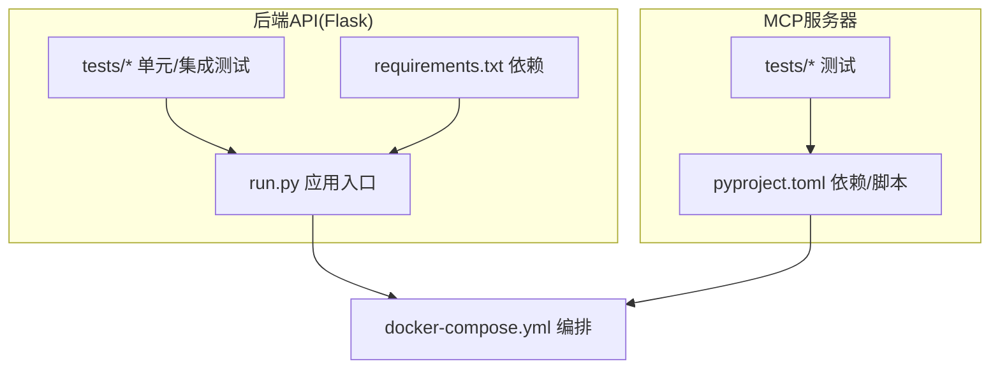
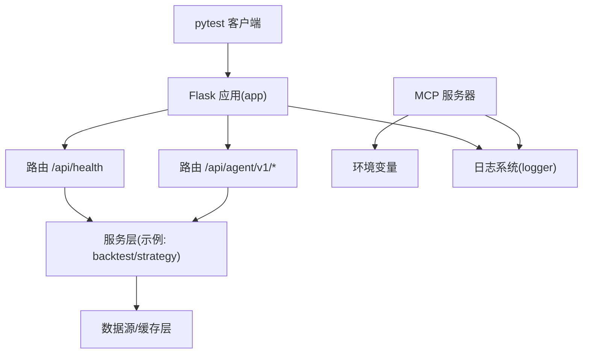
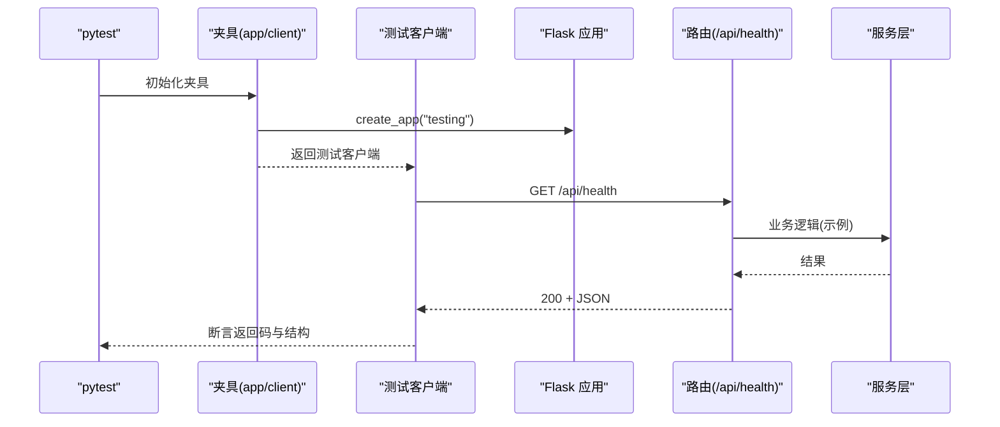
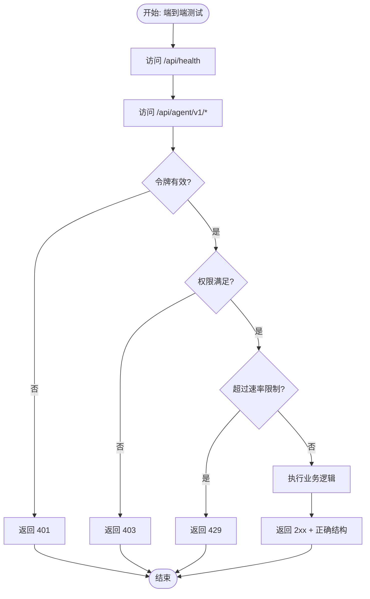
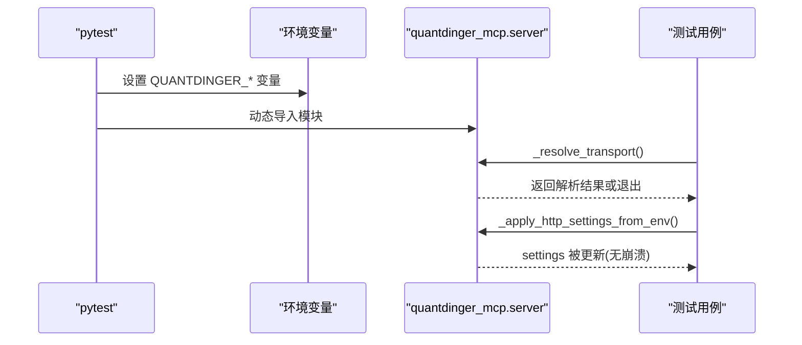
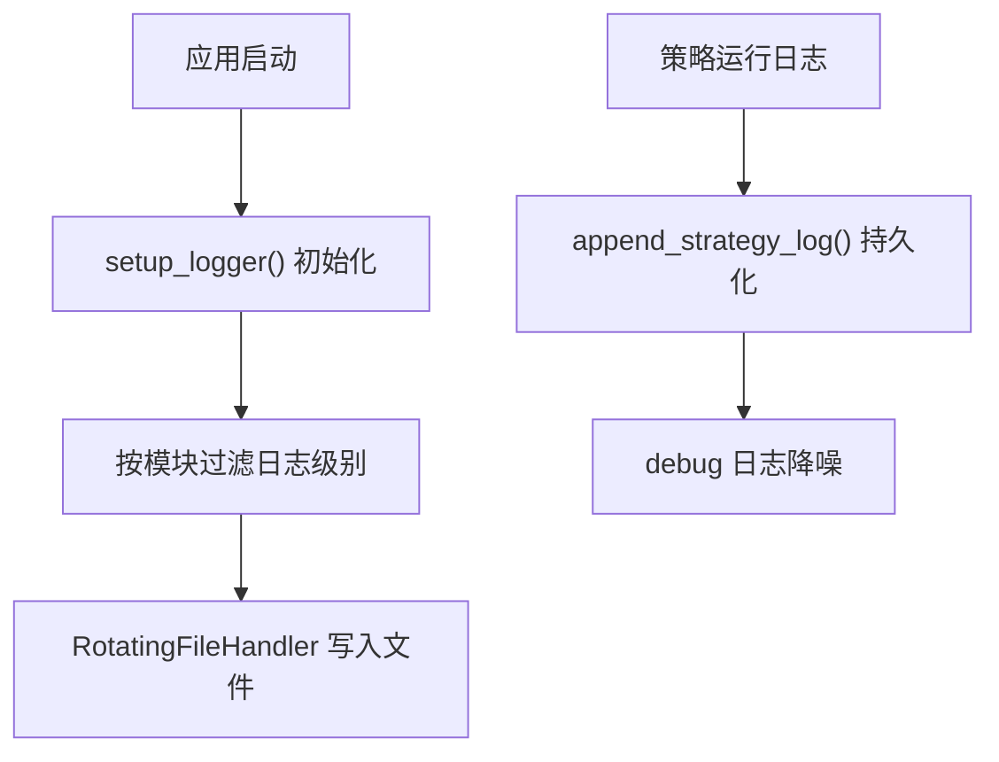
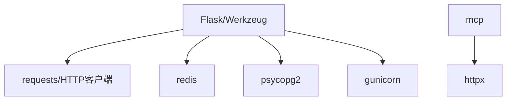

# 插件测试与调试

<cite>
**本文引用的文件**
- [backend_api_python/tests/conftest.py](file://backend_api_python/tests/conftest.py)
- [backend_api_python/tests/test_agent_v1.py](file://backend_api_python/tests/test_agent_v1.py)
- [backend_api_python/tests/test_data_providers.py](file://backend_api_python/tests/test_data_providers.py)
- [backend_api_python/tests/test_health.py](file://backend_api_python/tests/test_health.py)
- [mcp_server/tests/test_transport_resolution.py](file://mcp_server/tests/test_transport_resolution.py)
- [backend_api_python/run.py](file://backend_api_python/run.py)
- [backend_api_python/requirements.txt](file://backend_api_python/requirements.txt)
- [mcp_server/pyproject.toml](file://mcp_server/pyproject.toml)
- [docker-compose.yml](file://docker-compose.yml)
- [backend_api_python/app/utils/logger.py](file://backend_api_python/app/utils/logger.py)
- [backend_api_python/app/utils/strategy_runtime_logs.py](file://backend_api_python/app/utils/strategy_runtime_logs.py)
</cite>

## 目录
1. [引言](#引言)
2. [项目结构](#项目结构)
3. [核心组件](#核心组件)
4. [架构总览](#架构总览)
5. [详细组件分析](#详细组件分析)
6. [依赖分析](#依赖分析)
7. [性能考虑](#性能考虑)
8. [故障排查指南](#故障排查指南)
9. [结论](#结论)
10. [附录](#附录)

## 引言
本指南面向QuantDinger插件开发者与维护者，系统阐述插件单元测试、集成测试、端到端测试、性能与压力测试的实践方法，并提供调试工具与常见问题的解决方案。文档基于仓库中现有的后端API与MCP服务器测试样例，结合日志与运行环境配置，给出可操作的测试策略与最佳实践。

## 项目结构
QuantDinger采用前后端分离与容器化部署，测试覆盖后端API与MCP服务器两部分：
- 后端API（Flask）：提供路由层、服务层、数据源与缓存层等；测试集中在backend_api_python/tests。
- MCP服务器：通过环境变量解析传输方式、HTTP设置等；测试集中在mcp_server/tests。
- 运行与部署：通过docker-compose编排数据库、缓存与后端服务；本地入口脚本负责代理与密钥安全检查。

图表来源
- [docker-compose.yml:1-172](file://docker-compose.yml#L1-L172)
- [backend_api_python/run.py:1-134](file://backend_api_python/run.py#L1-L134)
- [backend_api_python/requirements.txt:1-37](file://backend_api_python/requirements.txt#L1-L37)
- [mcp_server/pyproject.toml:1-71](file://mcp_server/pyproject.toml#L1-L71)

章节来源
- [docker-compose.yml:1-172](file://docker-compose.yml#L1-L172)
- [backend_api_python/run.py:1-134](file://backend_api_python/run.py#L1-L134)
- [backend_api_python/requirements.txt:1-37](file://backend_api_python/requirements.txt#L1-L37)
- [mcp_server/pyproject.toml:1-71](file://mcp_server/pyproject.toml#L1-L71)

## 核心组件
- 测试夹具与客户端
  - 使用pytest夹具创建测试专用应用实例与测试客户端，确保测试隔离与最小环境变量注入。
- 路由与认证层测试
  - 验证公开健康检查、令牌缺失/过期/未激活、权限范围不足、速率限制等场景。
- 数据提供层测试
  - 验证缓存读写、数据清洗、第三方接口适配与容错（失败开路）。
- MCP传输解析测试
  - 验证传输类型解析、未知传输处理、HTTP设置合并等。
- 日志与运行时日志
  - 统一日志配置与文件轮转；策略运行日志持久化至数据库，便于UI展示与回溯。

章节来源
- [backend_api_python/tests/conftest.py:1-31](file://backend_api_python/tests/conftest.py#L1-L31)
- [backend_api_python/tests/test_agent_v1.py:1-160](file://backend_api_python/tests/test_agent_v1.py#L1-L160)
- [backend_api_python/tests/test_data_providers.py:1-193](file://backend_api_python/tests/test_data_providers.py#L1-L193)
- [mcp_server/tests/test_transport_resolution.py:1-76](file://mcp_server/tests/test_transport_resolution.py#L1-L76)
- [backend_api_python/app/utils/logger.py:1-63](file://backend_api_python/app/utils/logger.py#L1-L63)
- [backend_api_python/app/utils/strategy_runtime_logs.py:1-30](file://backend_api_python/app/utils/strategy_runtime_logs.py#L1-L30)

## 架构总览
下图展示了测试与运行时的关键交互：测试通过夹具创建应用实例，调用路由层；路由层依赖服务层与数据源；MCP服务器通过环境变量解析传输与HTTP设置；日志模块统一输出。

图表来源
- [backend_api_python/tests/conftest.py:19-30](file://backend_api_python/tests/conftest.py#L19-L30)
- [backend_api_python/tests/test_health.py:4-10](file://backend_api_python/tests/test_health.py#L4-L10)
- [backend_api_python/tests/test_agent_v1.py:50-128](file://backend_api_python/tests/test_agent_v1.py#L50-L128)
- [mcp_server/tests/test_transport_resolution.py:24-36](file://mcp_server/tests/test_transport_resolution.py#L24-L36)
- [backend_api_python/app/utils/logger.py:9-48](file://backend_api_python/app/utils/logger.py#L9-L48)

## 详细组件分析

### 单元测试最佳实践
- Mock与夹具
  - 使用pytest夹具创建应用实例与测试客户端，避免真实数据库与外部依赖。
  - 在认证与限流等场景中，使用monkeypatch替换内部函数或环境变量，确保可控输入。
- 测试数据准备
  - 使用构造函数或字典模拟外部API响应，保证输入参数覆盖边界值与异常路径。
  - 对于缓存与配置，设置最小必要环境变量以避免初始化失败。
- 断言策略
  - 路由返回码与JSON结构断言；对令牌状态、权限范围、速率限制等进行精确断言。
  - 对第三方接口适配时，断言标准化后的字段类型与默认值。

图表来源
- [backend_api_python/tests/conftest.py:19-30](file://backend_api_python/tests/conftest.py#L19-L30)
- [backend_api_python/tests/test_health.py:4-10](file://backend_api_python/tests/test_health.py#L4-L10)

章节来源
- [backend_api_python/tests/conftest.py:1-31](file://backend_api_python/tests/conftest.py#L1-L31)
- [backend_api_python/tests/test_health.py:1-10](file://backend_api_python/tests/test_health.py#L1-L10)
- [backend_api_python/tests/test_agent_v1.py:1-160](file://backend_api_python/tests/test_agent_v1.py#L1-L160)

### 集成测试与端到端测试
- 集成测试要点
  - 路由层与服务层集成：验证令牌校验、权限控制、速率限制与业务流程串联。
  - 数据提供层集成：验证缓存读写、第三方接口适配与失败开路策略。
- 端到端测试建议
  - 基于现有健康检查与Agent路由，扩展到关键工作流（如策略提交、回测触发、市场数据获取）。
  - 使用Docker Compose拉起数据库与缓存，确保真实依赖可用。

图表来源
- [backend_api_python/tests/test_agent_v1.py:50-147](file://backend_api_python/tests/test_agent_v1.py#L50-L147)
- [backend_api_python/tests/test_health.py:4-10](file://backend_api_python/tests/test_health.py#L4-L10)

章节来源
- [backend_api_python/tests/test_agent_v1.py:1-160](file://backend_api_python/tests/test_agent_v1.py#L1-L160)
- [backend_api_python/tests/test_data_providers.py:1-193](file://backend_api_python/tests/test_data_providers.py#L1-L193)
- [docker-compose.yml:25-132](file://docker-compose.yml#L25-L132)

### 性能测试与压力测试
- 性能测试
  - 使用基准测试库对关键函数（如数据清洗、缓存读写、序列化）进行微基准测试。
  - 在Docker环境中模拟生产资源限制，评估在高并发下的延迟与吞吐。
- 压力测试
  - 使用负载测试工具向路由层发送大量请求，观察429、超时与错误率变化。
  - 结合速率限制与连接池配置，定位瓶颈（数据库、缓存、网络）。

[本节为通用指导，不直接分析具体文件]

### MCP服务器测试
- 传输解析测试
  - 验证默认传输、大小写与别名映射、未知传输的退出行为。
  - 验证HTTP设置从环境变量合并的容错能力。
- 环境注入
  - 通过夹具重载模块前设置必要环境变量，确保导入时的校验通过。

图表来源
- [mcp_server/tests/test_transport_resolution.py:24-76](file://mcp_server/tests/test_transport_resolution.py#L24-L76)

章节来源
- [mcp_server/tests/test_transport_resolution.py:1-76](file://mcp_server/tests/test_transport_resolution.py#L1-L76)
- [mcp_server/pyproject.toml:43-46](file://mcp_server/pyproject.toml#L43-L46)

### 插件调试工具与技术
- 日志记录
  - 统一日志格式与级别过滤，启用文件轮转；针对特定模块（如USDT对账、计费）降低日志级别以便排查。
- 错误追踪
  - 在策略运行日志持久化模块中，采用“尽力而为”的插入策略，避免影响主流程。
- 性能分析
  - 在本地开发时禁用进度条，减少控制台噪声；在容器中通过指标与日志观察延迟与错误分布。

图表来源
- [backend_api_python/app/utils/logger.py:9-48](file://backend_api_python/app/utils/logger.py#L9-L48)
- [backend_api_python/app/utils/strategy_runtime_logs.py:11-30](file://backend_api_python/app/utils/strategy_runtime_logs.py#L11-L30)

章节来源
- [backend_api_python/app/utils/logger.py:1-63](file://backend_api_python/app/utils/logger.py#L1-L63)
- [backend_api_python/app/utils/strategy_runtime_logs.py:1-30](file://backend_api_python/app/utils/strategy_runtime_logs.py#L1-L30)

### 常见问题与解决方案
- 依赖冲突
  - 后端依赖版本固定在安全范围内；若出现冲突，优先锁定版本并使用虚拟环境隔离。
- 内存泄漏
  - 在测试中使用夹具清理全局状态（如速率限制状态），避免跨用例污染。
- 并发安全
  - 在容器编排中合理设置Gunicorn线程数与工作进程数；对共享资源（数据库、缓存）使用连接池与健康检查。

章节来源
- [backend_api_python/requirements.txt:1-37](file://backend_api_python/requirements.txt#L1-L37)
- [backend_api_python/tests/test_agent_v1.py:21-25](file://backend_api_python/tests/test_agent_v1.py#L21-L25)
- [docker-compose.yml:110-122](file://docker-compose.yml#L110-L122)

### 测试框架配置与使用
- 后端API测试
  - 使用pytest与Flask测试客户端；通过夹具注入最小环境变量，避免加载真实数据库。
- MCP服务器测试
  - 通过动态导入模块与环境变量注入，绕过导入期校验；对可选依赖（如MCP SDK）进行条件跳过。

章节来源
- [backend_api_python/tests/conftest.py:1-31](file://backend_api_python/tests/conftest.py#L1-L31)
- [mcp_server/tests/test_transport_resolution.py:19-21](file://mcp_server/tests/test_transport_resolution.py#L19-L21)

### 持续集成中的测试策略
- 服务编排
  - 使用Docker Compose拉起数据库与缓存，确保集成测试具备真实依赖。
- 环境隔离
  - 在CI中设置最小环境变量与测试模式，避免访问真实密钥与外部服务。
- 失败快速反馈
  - 将健康检查与关键路由测试作为必跑用例，尽早暴露配置问题。

章节来源
- [docker-compose.yml:25-132](file://docker-compose.yml#L25-L132)
- [backend_api_python/tests/test_health.py:1-10](file://backend_api_python/tests/test_health.py#L1-L10)

## 依赖分析
- 后端API依赖
  - Web框架、CORS、HTTP客户端、数据与缓存、WSGI服务器、加密与数据库驱动等。
- MCP服务器依赖
  - MCP SDK与HTTP客户端；可选开发依赖用于构建与发布。
- 运行时依赖
  - PostgreSQL与Redis在Docker Compose中定义；可通过环境变量控制启用与连接池参数。

图表来源
- [backend_api_python/requirements.txt:1-37](file://backend_api_python/requirements.txt#L1-L37)
- [mcp_server/pyproject.toml:43-46](file://mcp_server/pyproject.toml#L43-L46)

章节来源
- [backend_api_python/requirements.txt:1-37](file://backend_api_python/requirements.txt#L1-L37)
- [mcp_server/pyproject.toml:1-71](file://mcp_server/pyproject.toml#L1-L71)
- [docker-compose.yml:29-122](file://docker-compose.yml#L29-L122)

## 性能考虑
- 控制台输出与编码
  - 在Windows上强制UTF-8输出，避免编码错误导致的性能退化与日志异常。
- 代理与网络
  - 通过环境变量统一代理设置，并对国内金融域名设置直连，减少不必要的代理往返。
- 进度条与日志
  - 在本地开发时禁用进度条，减少控制台噪声；在容器中通过日志级别与文件轮转管理输出。

章节来源
- [backend_api_python/run.py:7-91](file://backend_api_python/run.py#L7-L91)

## 故障排查指南
- 日志定位
  - 使用统一日志配置与文件轮转，针对特定模块降低日志级别以便排查。
- 策略运行日志
  - 策略运行日志持久化至数据库，便于UI查看与问题回溯。
- 常见症状与对策
  - 令牌相关错误：检查令牌状态、有效期与权限范围；在测试中使用伪造令牌与权限组合。
  - 速率限制：确认每分钟限额与桶状态；在测试中通过伪造令牌限额触发429。
  - 第三方接口异常：验证失败开路策略与错误消息；在测试中模拟HTTP错误码与非数值字段。

章节来源
- [backend_api_python/app/utils/logger.py:9-48](file://backend_api_python/app/utils/logger.py#L9-L48)
- [backend_api_python/app/utils/strategy_runtime_logs.py:11-30](file://backend_api_python/app/utils/strategy_runtime_logs.py#L11-L30)
- [backend_api_python/tests/test_agent_v1.py:68-147](file://backend_api_python/tests/test_agent_v1.py#L68-L147)
- [backend_api_python/tests/test_data_providers.py:115-132](file://backend_api_python/tests/test_data_providers.py#L115-L132)

## 结论
通过规范的测试夹具、Mock策略与断言设计，结合日志与运行时日志机制，QuantDinger插件可在单元、集成与端到端层面获得稳定的质量保障。配合Docker Compose的依赖编排与CI中的最小环境配置，可实现快速、可重复且可扩展的测试与调试流程。

## 附录
- 快速参考
  - 后端测试入口：pytest + 测试夹具
  - MCP测试入口：pytest + 环境变量注入
  - 日志配置：统一格式、文件轮转、模块级别过滤
  - 运行时日志：策略运行日志持久化
  - 依赖与版本：后端与MCP服务器依赖清单
  - 编排与部署：Docker Compose服务与环境变量

章节来源
- [backend_api_python/tests/conftest.py:1-31](file://backend_api_python/tests/conftest.py#L1-L31)
- [mcp_server/tests/test_transport_resolution.py:1-76](file://mcp_server/tests/test_transport_resolution.py#L1-L76)
- [backend_api_python/app/utils/logger.py:1-63](file://backend_api_python/app/utils/logger.py#L1-L63)
- [backend_api_python/app/utils/strategy_runtime_logs.py:1-30](file://backend_api_python/app/utils/strategy_runtime_logs.py#L1-L30)
- [backend_api_python/requirements.txt:1-37](file://backend_api_python/requirements.txt#L1-L37)
- [mcp_server/pyproject.toml:1-71](file://mcp_server/pyproject.toml#L1-L71)
- [docker-compose.yml:1-172](file://docker-compose.yml#L1-L172)